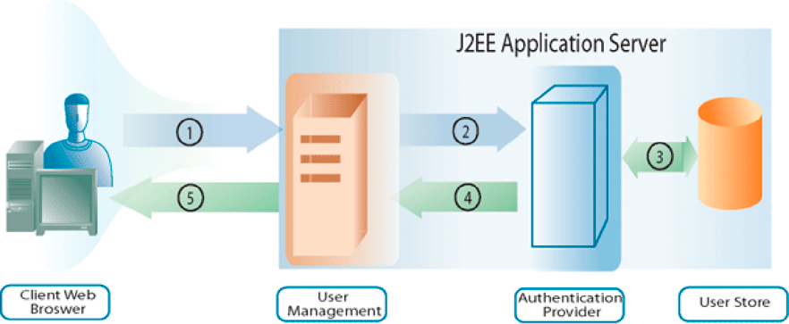
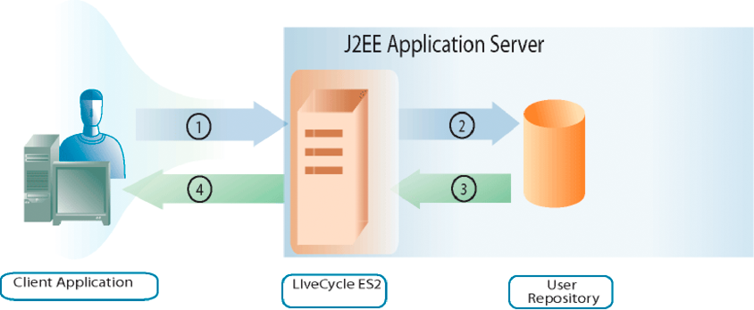

# Managing Users {#managing-users} 

**Samples and examples in this document are only for AEM Forms on JEE environment.**

**About User Management**

You can use the User Management API to create client applications that can manage roles, permissions, and principals (which can be users or groups), and authenticate users. User Management API consists of the following AEM Forms APIs:

* Directory Manager Service API
* Authentication Manager Service API
* Authorization Manager Service API

User Management enables you to assign, remove, and determine roles and permissions. It also enables you to assign, remove, and query domains, users, and groups. Finally, you can use User Management to authenticate users.

In [Adding Users](users.md#adding-users) you will understand how to programmatically add users. This section uses the Directory Manager Service API.

In [Deleting Users](users.md#deleting-users) you will understand how to programmatically delete users. This section uses the Directory Manager Service API.

In [Managing Users and Groups](users.md#managing-users-and-groups) you will understand the difference between a local user and a directory user, and see examples of how to use the Java and web service APIs to programmatically manage users and groups. This section uses the Directory Manager Service API.

In [Managing Roles and Permissions](users.md#managing-roles-and-permissions) you will learn about the system roles and permissions and what you can do programmatically to augment them, and see examples of how to use the Java and web service APIs to programmatically manage roles and permissions. This section uses both the Directory Manager Service API and Authorization Manager Service API.

In [Authenticating Users](users.md#authenticating-users) you will see examples of how to use the Java and web service APIs to programmatically authenticate users. This section uses the Authorization Manager Service API.

**Understanding the authentication process**

User Management provides built-in authentication functionality, and also provides you with the ability to connect it with your own authentication provider. When User Management receives an authentication request (for example, a user attempts to log in), it passes user information to the authentication provider to authenticate. User Management receives the results from the authentication provider after it authenticates the user.

The following diagram shows the interaction among an end user attempting to log in, User Management, and the authentication provider.

The following table describes each step of the authentication process.

<table>
 <thead>
  <tr>
   <th>
Step
</th>
   <th>
Description
</th>
  </tr>
 </thead>
 <tbody>
  <tr>
   <td>
1
</td>
   <td>
A user attempts to log into a service that invokes User Management. The user specifies a user name and password. 
</td>
  </tr>
  <tr>
   <td>
2
</td>
   <td>
User Management sends the user name and password, and configuration information, to the authentication provider.
</td>
  </tr>
  <tr>
   <td>
3
</td>
   <td>
The authentication provider connects to the user store and authenticates the user.
</td>
  </tr>
  <tr>
   <td>
4
</td>
   <td>
The authentication provider returns the results to User Management.
</td>
  </tr>
  <tr>
   <td>
5
</td>
   <td>
User Management either lets the user log in or denies access to the product.
</td>
  </tr>
 </tbody>
</table>

>[!NOTE]
>
>If the server time zone is different from the client time zone, when consuming the WSDL for the AEM Forms Generate PDF service on a native SOAP stack using a .NET client on a WebSphere Application Server cluster, the following User Management authentication error may occur:

`[com.adobe.idp.um.webservices.WSSecurityHandler] errorCode:12803 errorCodeHEX:0x3203 message:WSSecurityHandler: UM authenticate returns exception : An error was discovered processing the <wsse:Security> header. (WSSecurityEngine: Invalid timestamp The security semantics of message have expired).`

**Understanding directory management**

User Management is packaged with a directory service provider (the DirectoryManagerService) that supports connections to LDAP directories. If your organization uses a non-LDAP repository to store user records, you can create your own directory service provider that works with your repository.

Directory service providers retrieve records from a user store at the request of User Management. User Management regularly caches user and group records in the database to improve performance.

The directory service provider can be used to synchronize the User Management database with the user store. This step ensures that all user directory information and all user and group records are up to date.

In addition, the DirectoryManagerService provides you with the ability to create and manage domains. Domains define different user bases. The boundary of a domain is usually defined according to the way your organization is structured or how your user store is set up. User Management domains provide configuration settings that authentication providers and directory service providers use.

In the configuration XML that User Management exports, the root node that has the attribute value of `Domains` contains an XML element for each domain defined for User Management. Each of these elements contain other elements that define aspects of the domain associated with specific service providers.

**Understanding objectSID values**

When using Active Directory, it is important to understand that an `objectSID` value is not a unique attribute across multiple domains. This value stores the security identifier of an object. In a multiple domain environment (for example, a tree of domains) the `objectSID` value can be different.

An `objectSID` value would change if an object is moved from one Active Directory domain to another domain. Some objects have the same `objectSID` value anywhere in the domain. For example, groups like BUILTIN\Administrators, BUILTIN\Power Users, and so on, would have the same `objectSID` value regardless of the domains. These `objectSID` values are well known.

## Adding Users {#adding-users}

You can use the Directory Manager Service API (Java and web service) to programmatically add users to AEM Forms. After you add a user, you can use that user when performing a service operation that requires a user. For example, you can assign a task to the new user.

### Summary of steps {#summary-of-steps}

To add a user, perform the following steps:

1. Include project files.
1. Create a DirectoryManagerService client.
1. Define user information.
1. Add the user to AEM Forms.
1. Verify that the user is added.

**Include project files**

Include necessary files in your development project. If you are creating a client application using Java, include the necessary JAR files. If you are using web services, include the proxy files.

**Create a DirectoryManagerService client**

Before you can programmatically perform a Directory Manager service operation, create a Directory Manager Service API client.

**Define user information**

When you add a new user by using the Directory Manager Service API, define information for that user. Typically, when you add a new user, you define the following values:

* **Domain name**: The domain to which the user belongs (for example, `DefaultDom`).
* **User identifier value**: The identifier value of the user (for example, `wblue`).
* **Principal type**: The type of user (for example, you can specify `USER)`.
* **Given name**: A given name for the user (for example, `Wendy`).
* **Family name**: The family name for the user (for example, `Blue)`.
* **Locale**: Locale information for the user.

**Add the user to AEM Forms**

After you define user information, you can add the user to AEM Forms. To add a user, invoke the `DirectoryManagerServiceClient` object's `createLocalUser` method.

**Verify that the user was added**

You can verify that the user was added to ensure that no issues occurred. Locate the new user by using the user identifier value.

**See also**

[Add users using the Java API](users.md#add-users-using-the-java-api)

[Add users using the web service API](users.md#add-users-using-the-web-service-api)

[Including AEM Forms Java library files](/help/forms/developing/invoking-aem-forms-using-java.md#including-aem-forms-java-library-files)

[Setting connection properties](/help/forms/developing/invoking-aem-forms-using-java.md#setting-connection-properties)

[Deleting Users](users.md#deleting-users)

### Add users using the Java API {#add-users-using-the-java-api}

Add users by using the Directory Manager Service API (Java):

1. Include project files.

   Include client JAR files, such as adobe-usermanager-client.jar, in your Java project's class path.

1. Create a DirectoryManagerServices client.

   Create a `DirectoryManagerServiceClient` object by using its constructor and passing a `ServiceClientFactory` object that contains connection properties.

1. Define user information.

    * Create a `UserImpl` object by using its constructor.
    * Set the demain name by invoking the `UserImpl` object's `setDomainName` method. Pass a string value that specifies the domain name.
    * Set the principal type by invoking the `UserImpl` object's `setPrincipalType` method. Pass a string value that specifies the type of user. For example, you can specify `USER`.
    * Set the user identifier value by invoking the `UserImpl` object's `setUserid` method. Pass a string value that specifies the user identifier value. For example, you can specify `wblue`.
    * Set the canonical name by invoking the `UserImpl` object's `setCanonicalName` method. Pass a string value that specifies the user's canonical name. For example, you can specify `wblue`.
    * Set the given name by invoking the `UserImpl` object's `setGivenName` method. Pass a string value that specifies the user's given name. For example, you can specify `Wendy`.
    * Set the family name by invoking the `UserImpl` object's `setFamilyName` method. Pass a string value that specifies the user's family name. For example, you can specify `Blue`.

   >[!NOTE]
   >
   >Invoke a method that belongs to the `UserImpl` object to set other values. For example, you can set the locale value by invoking the `UserImpl` object's `setLocale` method.

1. Add the user to AEM Forms.

   Invoke the `DirectoryManagerServiceClient` object's `createLocalUser` method and pass the following values:

    * The `UserImpl` object that represents the new user
    * A string value that represents the user's password

   The `createLocalUser` method returns a string value that specifies the local user identifier value.

1. Verify that the user was added.

    * Create a `PrincipalSearchFilter` object by using its constructor.
    * Set the user identifier value by invoking the `PrincipalSearchFilter` object's `setUserId` method. Pass a string value that represents the user identifier value.
    * Invoke the `DirectoryManagerServiceClient` object's `findPrincipals` method and pass the `PrincipalSearchFilter` object. This method returns a `java.util.List` instance, where each element is a `User` object. Iterate through the `java.util.List` instance to locate the user.

**See also**

[Summary of steps](users.md#summary-of-steps)

[Quick Start (SOAP mode): Adding users using the Java API](/help/forms/developing/user-manager-java-api-quick.md#quick-start-soap-mode-adding-users-using-the-java-api)

[Including AEM Forms Java library files](/help/forms/developing/invoking-aem-forms-using-java.md#including-aem-forms-java-library-files)

[Setting connection properties](/help/forms/developing/invoking-aem-forms-using-java.md#setting-connection-properties)

### Add users using the web service API {#add-users-using-the-web-service-api}

Add users by using the Directory Manager Service API (web service):

1. Include project files.

   Create a Microsoft .NET project that uses MTOM. Ensure that you use the following WSDL definition for the service reference: `http://localhost:8080/soap/services/DirectoryManagerService?WSDL&lc_version=9.0.1`.

   >[!NOTE]
   >
   >Replace `localhost` with the IP address of the server hosting AEM Forms.

1. Create a DirectoryManagerService client.

    * Create a `DirectoryManagerServiceClient` object by using its default constructor.
    * Create a `DirectoryManagerServiceClient.Endpoint.Address` object by using the `System.ServiceModel.EndpointAddress` constructor. Pass a string value that specifies the WSDL to the AEM Forms service (for example, `http://localhost:8080/soap/services/DirectoryManagerService?blob=mtom`). You do not need to use the `lc_version` attribute. This attribute is used when you create a service reference. Ensure that you specify `?blob=mtom`.
    * Create a `System.ServiceModel.BasicHttpBinding` object by getting the value of the `DirectoryManagerServiceClient.Endpoint.Binding` field. Cast the return value to `BasicHttpBinding`.
    * Set the `System.ServiceModel.BasicHttpBinding` object's `MessageEncoding` field to `WSMessageEncoding.Mtom`. This value ensures that MTOM is used.
    * Enable basic HTTP authentication by performing the following tasks:

        * Assign the AEM forms user name to the field `DirectoryManagerServiceClient.ClientCredentials.UserName.UserName`.
        * Assign the corresponding password value to the field `DirectoryManagerServiceClient.ClientCredentials.UserName.Password`.
        * Assign the constant value `HttpClientCredentialType.Basic` to the field `BasicHttpBindingSecurity.Transport.ClientCredentialType`.
        * Assign the constant value `BasicHttpSecurityMode.TransportCredentialOnly` to the field `BasicHttpBindingSecurity.Security.Mode`.

1. Define user information.

    * Create a `UserImpl` object by using its constructor.
    * Set the demain name by assigning a string value to the `UserImpl` object's `domainName` field.
    * Set the principal type by assigning a string value to the `UserImpl` object's `principalType` field. For example, you can specify `USER`.
    * Set the user identifier value by assigning a string value to the `UserImpl` object's `userid` field.
    * Set the canonical name value by assigning a string value to the `UserImpl` object's `canonicalName` field.
    * Set the given name value by assigning a string value to the `UserImpl` object's `givenName` field.
    * Set the family name value by assigning a string value to the `UserImpl` object's `familyName` field.

1. Add the user to AEM Forms.

   Invoke the `DirectoryManagerServiceClient` object's `createLocalUser` method and pass the following values:

    * The `UserImpl` object that represents the new user
    * A string value that represents the user's password

   The `createLocalUser` method returns a string value that specifies the local user identifier value.

1. Verify that the user was added.

    * Create a `PrincipalSearchFilter` object by using its constructor.
    * Set the user identifier value of the user by assigning a string value that represents the user identifier value to the `PrincipalSearchFilter` object's `userId` field.
    * Invoke the `DirectoryManagerServiceClient` object's `findPrincipals` method and pass the `PrincipalSearchFilter` object. This method returns a `MyArrayOfUser` collection object, where each element is a `User` object. Iterate through the `MyArrayOfUser` collection to locate the user.

**See also**

[Summary of steps](users.md#summary-of-steps)

[Invoking AEM Forms using MTOM](/help/forms/developing/invoking-aem-forms-using-web.md#invoking-aem-forms-using-mtom)

[Invoking AEM Forms using SwaRef](/help/forms/developing/invoking-aem-forms-using-web.md#invoking-aem-forms-using-swaref)

## Deleting Users {#deleting-users}

You can use the Directory Manager Service API (Java and web service) to programmatically delete users from AEM Forms. After you delete a user, the user can no longer be used to perform a service operation that requires a user. For example, you cannot assign a task to a deleted user.

### Summary of steps {#summary_of_steps-1}

To delete a user, perform the following steps:

1. Include project files.
1. Create a DirectoryManagerService client.
1. Specify the user to delete.
1. Delete the user from AEM Forms.

**Include project files**

Include necessary files in your development project. If you are creating a client application by using Java, include the necessary JAR files. If you are using web services, include the proxy files.

**Create a DirectoryManagerService client**

Before you can programmatically perform a Directory Manager Service API operation, create a Directory Manager service client.

**Specify the user to delete**

You can specify a user to delete by using the user's identifier value.

**Delete the user from AEM Forms**

To delete a user, invoke the `DirectoryManagerServiceClient` object's `deleteLocalUser` method.

**See also**

[Delete users using the Java API](users.md#delete-users-using-the-java-api)

[Delete users using the web service API](users.md#delete-users-using-the-web-service-api)

[Including AEM Forms Java library files](/help/forms/developing/invoking-aem-forms-using-java.md#including-aem-forms-java-library-files)

[Setting connection properties](/help/forms/developing/invoking-aem-forms-using-java.md#setting-connection-properties)

[Adding Users](users.md#adding-users)

### Delete users using the Java API {#delete-users-using-the-java-api}

Delete users by using the Directory Manager Service API (Java):

1. Include project files.

   Include client JAR files, such as adobe-usermanager-client.jar, in your Java project's class path.

1. Create a DirectoryManagerService client.

   Create a `DirectoryManagerServiceClient` object by using its constructor and passing a `ServiceClientFactory` object that contains connection properties.

1. Specify the user to delete.

    * Create a `PrincipalSearchFilter` object by using its constructor.
    * Set the user identifier value by invoking the `PrincipalSearchFilter` object's `setUserId` method. Pass a string value that represents the user identifier value.
    * Invoke the `DirectoryManagerServiceClient` object's `findPrincipals` method and pass the `PrincipalSearchFilter` object. This method returns a `java.util.List` instance, where each element is a `User` object. Iterate through the `java.util.List` instance to locate the user to delete.

1. Delete the user from AEM Forms.

   Invoke the `DirectoryManagerServiceClient` object's `deleteLocalUser` method and pass the value of the `User` object's `oid` field. Invoke the `User` object's `getOid` method. Use the `User` object retrieved from the `java.util.List` instance.

**See also**

[Summary of steps](users.md#summary-of-steps)

[Quick Start (EJB mode): Deleting users using the Java API](/help/forms/developing/user-manager-java-api-quick.md#quick-start-soap-mode-deleting-users-using-the-java-api)

[Quick Start (SOAP mode): Deleting users using the Java API](/help/forms/developing/user-manager-java-api-quick.md#quick-start-soap-mode-deleting-users-using-the-java-api)

[Including AEM Forms Java library files](/help/forms/developing/invoking-aem-forms-using-java.md#including-aem-forms-java-library-files)

[Setting connection properties](/help/forms/developing/invoking-aem-forms-using-java.md#setting-connection-properties)

### Delete users using the web service API {#delete-users-using-the-web-service-api}

Delete users by using the Directory Manager Service API (web service):

1. Include project files.

   Include client JAR files, such as adobe-usermanager-client.jar, in your Java project's class path.

1. Create a DirectoryManagerService client.

    * Create a `DirectoryManagerServiceClient` object by using its default constructor.
    * Create a `DirectoryManagerServiceClient.Endpoint.Address` object by using the `System.ServiceModel.EndpointAddress` constructor. Pass a string value that specifies the WSDL to the AEM Forms service (for example, `http://localhost:8080/soap/services/DirectoryManagerService?blob=mtom`). You do not need to use the `lc_version` attribute. This attribute is used when you create a service reference. Ensure that you specify `blob=mtom.`
    * Create a `System.ServiceModel.BasicHttpBinding` object by getting the value of the `DirectoryManagerServiceClient.Endpoint.Binding` field. Cast the return value to `BasicHttpBinding`.
    * Set the `System.ServiceModel.BasicHttpBinding` object's `MessageEncoding` field to `WSMessageEncoding.Mtom`. This value ensures that MTOM is used.
    * Enable basic HTTP authentication by performing the following tasks:

        * Assign the AEM forms user name to the field `DirectoryManagerServiceClient.ClientCredentials.UserName.UserName`.
        * Assign the corresponding password value to the field `DirectoryManagerServiceClient.ClientCredentials.UserName.Password`.
        * Assign the constant value `HttpClientCredentialType.Basic` to the field `BasicHttpBindingSecurity.Transport.ClientCredentialType`.
        * Assign the constant value `BasicHttpSecurityMode.TransportCredentialOnly` to the field `BasicHttpBindingSecurity.Security.Mode`.

1. Specify the user to delete.

    * Create a `PrincipalSearchFilter` object by using its constructor.
    * Set the user identifier value by assigning a string value to the `PrincipalSearchFilter` object's `userId` field.
    * Invoke the `DirectoryManagerServiceClient` object's `findPrincipals` method and pass the `PrincipalSearchFilter` object. This method returns a `MyArrayOfUser` collection object, where each element is a `User` object. Iterate through the `MyArrayOfUser` collection to locate the user. The `User` object retrieved from the `MyArrayOfUser` collection object is used to delete the user.

1. Delete the user from AEM Forms.

   Delete the user by passing the `User` object's `oid` field value to the `DirectoryManagerServiceClient` object's `deleteLocalUser` method.

**See also**

[Summary of steps](users.md#summary-of-steps)

[Invoking AEM Forms using MTOM](/help/forms/developing/invoking-aem-forms-using-web.md#invoking-aem-forms-using-mtom)

[Invoking AEM Forms using SwaRef](/help/forms/developing/invoking-aem-forms-using-web.md#invoking-aem-forms-using-swaref)

## Creating Groups {#creating-groups}

You can use the Directory Manager Service API (Java and web service) to programmatically create AEM Forms groups. After you create a group, you can use that group to perform a service operation that requires a group. For example, you can assign a user to the new group. (See [Managing Users and Groups](users.md#managing-users-and-groups).)

### Summary of steps {#summary_of_steps-2}

To create a group, perform the following steps:

1. Include project files.
1. Create a DirectoryManagerService client.
1. Determine that the group does not exist.
1. Create the group.
1. Perform an action with the group.

**Include project files**

Include necessary files in your development project. If you are creating a client application using Java, include the necessary JAR files.

The following JAR files must be added to your project's classpath:

* adobe-livecycle-client.jar
* adobe-usermanager-client.jar
* adobe-utilities.jar (Required if AEM Forms is deployed on JBoss)
* jbossall-client.jar (Required if AEM Forms is deployed on JBoss)

For information about the location of these JAR files, see [Including AEM Forms Java library files](/help/forms/developing/invoking-aem-forms-using-java.md#including-aem-forms-java-library-files).

**Create a DirectoryManagerService client**

Before you can programmatically perform a Directory Manager service operation, create a Directory Manager Service API client.

**Determine whether the group exists**

When you create a group, ensure that the group does not exist in the same domain. That is, two groups cannot have the same name within the same domain. To perform this task, perform a search and filter the search results based on two values. Set the principal type to `com.adobe.idp.um.api.infomodel.Principal.PRINCIPALTYPE_GROUP` to ensure that only groups are returned. Also, sure that you specify the domain name.

**Create the group**

After you determine that the group does not exist in the domain, create the group and specify the following attributes:

* **CommonName**: The name of the group.
* **Domain**: The domain in which the group is added.
* **Description**: A description of the group.

**Perform an action with the group**

After you create a group, you can perform an action using the group. For example, you can add a user to the group. To add a user to a group, retrieve the unique identifier value of both the user and the group. Pass these values to the `addPrincipalToLocalGroup` method.

**See also**

[Create groups using the Java API](users.md#create-groups-using-the-java-api)

[Including AEM Forms Java library files](/help/forms/developing/invoking-aem-forms-using-java.md#including-aem-forms-java-library-files)

[Setting connection properties](/help/forms/developing/invoking-aem-forms-using-java.md#setting-connection-properties)

[Adding Users](users.md#adding-users)

[Deleting Users](users.md#deleting-users)

### Create groups using the Java API {#create-groups-using-the-java-api}

Create a group by using the Directory Manager Service API (Java):

1. Include project files.

   Include client JAR files, such as adobe-usermanager-client.jar, in your Java project's class path.

1. Create a DirectoryManagerService client.

   Create a `DirectoryManagerServiceClient` object by using its constructor and passing a `ServiceClientFactory` object that contains connection properties.

1. Determine whether the group exists.

    * Create a `PrincipalSearchFilter` object by using its constructor.
    * Set the principal type by invoking the `PrincipalSearchFilter` object's `setPrincipalType` object. Pass the value `com.adobe.idp.um.api.infomodel.Principal.PRINCIPALTYPE_GROUP`.
    * Set the domain by invoking the `PrincipalSearchFilter` object's `setSpecificDomainName` object. Pass a string value that specifies the domain name.
    * To find a group, invoke the `DirectoryManagerServiceClient` object's `findPrincipals` method (a principal can be a group). Pass the `PrincipalSearchFilter` object that specifies the principal type and the domain name. This method returns a `java.util.List` instance where each element is a `Group` instance. Each group instance conforms to the filter specified by using the `PrincipalSearchFilter` object.
    * Iterate through the `java.util.List` instance. For each element, retrieve the group name. Ensure that the group name does not equal the new group name.

1. Create the group.

    * If the group does not exist, invoke the `Group` object's `setCommonName` method and pass a string value that specifies the group name.
    * Invoke the `Group` object's `setDescription` method and pass a string value that specifies the group description.
    * Invoke the `Group` object's `setDomainName` method and pass a string value that specifies the domain name.
    * Invoke the `DirectoryManagerServiceClient` object's `createLocalGroup` method and pass the `Group` instance.

   The `createLocalUser` method returns a string value that specifies the local user identifier value.

1. Perform an action with the group.

    * Create a `PrincipalSearchFilter` object by using its constructor.
    * Set the user identifier value by invoking the `PrincipalSearchFilter` object's `setUserId` method. Pass a string value that represents the user identifier value.
    * Invoke the `DirectoryManagerServiceClient` object's `findPrincipals` method and pass the `PrincipalSearchFilter` object. This method returns a `java.util.List` instance, where each element is a `User` object. Iterate through the `java.util.List` instance to locate the user.
    * Add a user to the group by invoking the `DirectoryManagerServiceClient` object's `addPrincipalToLocalGroup` method. Pass the return value of the `User` object's `getOid` method. Pass the return value of the `Group` objects's `getOid` method (use the `Group` instance that represents the new group).

**See also**

[Summary of steps](users.md#summary-of-steps)

[Including AEM Forms Java library files](/help/forms/developing/invoking-aem-forms-using-java.md#including-aem-forms-java-library-files)

[Setting connection properties](/help/forms/developing/invoking-aem-forms-using-java.md#setting-connection-properties)

## Managing Users and Groups {#managing-users-and-groups}

This topic describes how you can use (Java) to programmatically assign, remove, and query domains, users, and groups.

>[!NOTE]
>
>When configuring a domain, you must set the unique identifier for groups and users. The attribute that is chosen must not only be unique within the LDAP environment, but must also be immutable and will not change within the directory. This attribute must also be of a simple string data type (the only exception currently allowed for Active Directory 2000/2003 is `"objectsid"`, which is a binary value). The Novell eDirectory attribute `"GUID"`, for example, is not a simple string data type and therefore will not work.

* For Active Directory, use `"objectsid"`.
* For SunOne, use `"nsuniqueid"`.

>[!NOTE]
>
>Creating multiple local users and groups while an LDAP directory synchronization is in progress is not supported. Attempting this process may result in errors.

### Summary of steps {#summary_of_steps-3}

To manage users and groups, perform the following steps:

1. Include project files.
1. Create a DirectoryManagerService client.
1. Invoke the appropriate user or group operations.

**Include project files**

Include necessary files in your development project. If you are creating a client application using Java, then include the necessary JAR files. If you are using web services, then make sure that you include the proxy files.

**Create a DirectoryManagerService client**

Before you can programmatically perform a Directory Manager service operation, you must create a Directory Manager service client. With the Java API this is accomplished by creating a `DirectoryManagerServiceClient` object. With the web service API this is accomplished by creating a `DirectoryManagerServiceService` object.

**Invoke the appropriate user or group operations**

Once you have created the service client, you can then invoke the user or group management operations. The service client lets you assign, remove, and query domains, user, and groups. Note that it is possible to add either a directory principal or a local principal to a local group, but it is not possible to add a local principal to a directory group.

**See also**

[Managing users and groups using the Java API](users.md#managing-users-and-groups-using-the-java-api)

[Managing users and groups using the web service API](users.md#managing-users-and-groups-using-the-web-service-api)

[Including AEM Forms Java library files](/help/forms/developing/invoking-aem-forms-using-java.md#including-aem-forms-java-library-files)

[Setting connection properties](/help/forms/developing/invoking-aem-forms-using-java.md#setting-connection-properties)

[User Manager API Quick Starts](/help/forms/developing/user-manager-java-api-quick.md#user-manager-java-api-quick-start-soap)

### Managing users and groups using the Java API {#managing-users-and-groups-using-the-java-api}

To programmatically manage users, groups, and domains using the (Java), perform the following tasks:

1. Include project files.

   Include client JAR files, such as adobe-usermanager-client.jar, in your Java project's class path. For information about the location of these files, see [Including AEM Forms Java library files](/help/forms/developing/invoking-aem-forms-using-java.md#including-aem-forms-java-library-files).

1. Create a DirectoryManagerService client.

   Create a `DirectoryManagerServiceClient` object by using its constructor and passing a `ServiceClientFactory` object that contains connection properties. For information, see [Setting connection properties](/help/forms/developing/invoking-aem-forms-using-java.md#setting-connection-properties)*.*

1. Invoke the appropriate user or group operations.

   To find a user or group, invoke one of the `DirectoryManagerServiceClient` object's methods for finding principals (since a principal can be a user or a group). In the example below, the `findPrincipals` method is called using a search filter (a `PrincipalSearchFilter` object).

   Since the return value in this case is a `java.util.List` containing `Principal` objects, iterate through the result and cast the `Principal` objects to either `User` or `Group` objects.

   Using the resultant `User` or `Group` object (which both inherit from the `Principal` interface), retrieve the information you need in your workflows. For example, the domain name and canonical name values, in combination, uniquely identify a principal. These are retrieved by invoking the `Principal` object's `getDomainName` and `getCanonicalName` methods, respectively.

   To delete a local user, invoke the `DirectoryManagerServiceClient` object's `deleteLocalUser` method and pass the user's identifier.

   To delete a local group, invoke the `DirectoryManagerServiceClient` object's `deleteLocalGroup` method and pass the group's identifier.

**See also**

[Summary of steps](users.md#summary-of-steps)

[Including AEM Forms Java library files](/help/forms/developing/invoking-aem-forms-using-java.md#including-aem-forms-java-library-files)

[Setting connection properties](/help/forms/developing/invoking-aem-forms-using-java.md#setting-connection-properties)

### Managing users and groups using the web service API {#managing-users-and-groups-using-the-web-service-api}

To programmatically manage users, groups, and domains using the Directory Manager Service API (web service), perform the following tasks:

1. Include project files.

    * Create a Microsoft .NET client assembly that consumes the Directory Manager WSDL. (See [Invoking AEM Forms using Base64 encoding](/help/forms/developing/invoking-aem-forms-using-web.md#invoking-aem-forms-using-base64-encoding).)
    * Reference the Microsoft .NET client assembly. (See [Creating a .NET client assembly that uses Base64 encoding](/help/forms/developing/invoking-aem-forms-using-web.md#creating-a-net-client-assembly-that-uses-base64-encoding).)

1. Create a DirectoryManagerService client.

   Create a `DirectoryManagerServiceService` object by using your proxy class' constructor.

1. Invoke the appropriate user or group operations.

   To find a user or group, invoke one of the `DirectoryManagerServiceService` object's methods for finding principals (since a principal can be a user or a group). In the example below, the `findPrincipalsWithFilter` method is called using a search filter (a `PrincipalSearchFilter` object). When using a `PrincipalSearchFilter` object, local principals are only returned if the `isLocal` property is set to `true`. This behavior is different from what would occur with the Java API.

   >[!NOTE]
   >
   >If the maximum number of results is not specified in the search filter (through the `PrincipalSearchFilter.resultsMax` field), a maximum of 1000 results will be returned. This is different behavior than what occurs using the Java API, in which 10 results is the default maximum. Also, the search methods such as `findGroupMembers` will not yield any results unless the maximum number of results is specified in the search filter (for example, through the `GroupMembershipSearchFilter.resultsMax` field). This applies to all search filters that inherit from the `GenericSearchFilter` class. For more information, see [AEM Forms API Reference](https://www.adobe.com/go/learn_aemforms_javadocs_63_en).

   Since the return value in this case is an `object[]` containing `Principal` objects, iterate through the result and cast the `Principal` objects to either `User` or `Group` objects.

   Using the resultant `User` or `Group` object (which both inherit from the `Principal` interface), retrieve the information you need in your workflows. For example, the domain name and canonical name values, in combination, uniquely identify a principal. These are retrieved by invoking the `Principal` object's `domainName` and `canonicalName` fields, respectively.

   To delete a local user, invoke the `DirectoryManagerServiceService` object's `deleteLocalUser` method and pass the user's identifier.

   To delete a local group, invoke the `DirectoryManagerServiceService` object's `deleteLocalGroup` method and pass the group's identifier.

**See also**

[Summary of steps](users.md#summary-of-steps)

[Invoking AEM Forms using MTOM](/help/forms/developing/invoking-aem-forms-using-web.md#invoking-aem-forms-using-mtom)

## Managing Roles and Permissions {#managing-roles-and-permissions}

This topic describes how you can use the Authorization Manager Service API (Java) to programmatically assign, remove, and determine roles and permissions.

In AEM Forms, a *role* is a group of permissions for accessing one or more system-level resources. These permissions are created through User Management and are enforced by the service components. For example, an Administrator could assign the role of "Policy Set Author" to a group of users. Rights Management would then permit the users of that group with that role to create policy sets through administration console.

There are two types of roles: *default roles* and *custom roles*. Default roles (*system roles)* are already resident in AEM Forms. It is assumed that default roles may not be deleted or modified by the administrator, and are thus immutable. Custom roles created by the administrator, who may subsequently modify or delete them, are thus mutable.

Roles make it easier to manage permissions. When a role is assigned to a principal, a set of permissions is automatically assigned to that principal, and all the specific access-related decisions for the principal are based on that overall set of assigned permissions.

### Summary of steps {#summary_of_steps-4}

To manage roles and permissions, perform the following steps:

1. Include project files.
1. Create an AuthorizationManagerService client.
1. Invoke the appropriate role or permission operations.

**Include project files**

Include necessary files in your development project. If you are creating a client application using Java, then include the necessary JAR files. If you are using web services, then make sure that you include the proxy files.

**Create an AuthorizationManagerService client**

Before you can programmatically perform a User Management AuthorizationManagerService operation, you must create an AuthorizationManagerService client. With the Java API this is accomplished by creating an `AuthorizationManagerServiceClient` object.

**Invoke the appropriate role or permission operations**

Once you have created the service client, you can then invoke the role or permission operations. The service client lets you assign, remove, and determine roles and permissions.

**See also**

[Managing roles and permissions using the Java API](users.md#managing-roles-and-permissions-using-the-java-api)

[Managing roles and permissions using the web service API](users.md#managing-roles-and-permissions-using-the-web-service-api)

[Including AEM Forms Java library files](/help/forms/developing/invoking-aem-forms-using-java.md#including-aem-forms-java-library-files)

[Setting connection properties](/help/forms/developing/invoking-aem-forms-using-java.md#setting-connection-properties)

[User Manager API Quick Starts](/help/forms/developing/user-manager-java-api-quick.md#user-manager-java-api-quick-start-soap)

### Managing roles and permissions using the Java API {#managing-roles-and-permissions-using-the-java-api}

To manage roles and permissions using the Authorization Manager Service API (Java), perform the following tasks:

1. Include project files.

   Include client JAR files, such as adobe-usermanager-client.jar, in your Java project's class path.

1. Create an AuthorizationManagerService client.

   Create an `AuthorizationManagerServiceClient` object by using its constructor and passing a `ServiceClientFactory` object that contains connection properties.

1. Invoke the appropriate role or permission operations.

   To assign a role to a principal, invoke the `AuthorizationManagerServiceClient` object's `assignRole` method and pass the following values:

    * A `java.lang.String` object that contains the role identifier
    * An array of `java.lang.String` objects containing the principal identifiers.

   To remove a role from a principal, invoke the `AuthorizationManagerServiceClient` object's `unassignRole` method and pass the following values:

    * A `java.lang.String` object that contains the role identifier.
    * An array of `java.lang.String` objects containing the principal identifiers.

**See also**

[Summary of steps](users.md#summary-of-steps)

[Quick Start (SOAP mode): Managing roles and permissions using the Java API](/help/forms/developing/user-manager-java-api-quick.md#quick-start-soap-mode-managing-roles-and-permissions-using-the-java-api)

[Including AEM Forms Java library files](/help/forms/developing/invoking-aem-forms-using-java.md#including-aem-forms-java-library-files)

[Setting connection properties](/help/forms/developing/invoking-aem-forms-using-java.md#setting-connection-properties)

### Managing roles and permissions using the web service API {#managing-roles-and-permissions-using-the-web-service-api}

Manage roles and permissions by using the Authorization Manager Service API (web service):

1. Include project files.

   Create a Microsoft .NET project that uses MTOM. Ensure that you use the following WSDL definition: `http://localhost:8080/soap/services/AuthorizationManagerService?WSDL&lc_version=9.0.1`.

   >[!NOTE]
   >
   >Replace `localhost` with the IP address of the server hosting AEM Forms.

1. Create an AuthorizationManagerService client.

    * Create an `AuthorizationManagerServiceClient` object by using its default constructor.
    * Create an `AuthorizationManagerServiceClient.Endpoint.Address` object by using the `System.ServiceModel.EndpointAddress` constructor. Pass a string value that specifies the WSDL to the AEM Forms service (for example, `http://localhost:8080/soap/services/AuthorizationManagerService?blob=mtom`.) You do not need to use the `lc_version` attribute. This attribute is used when you create a service reference.
    * Create a `System.ServiceModel.BasicHttpBinding` object by getting the value of the `AuthorizationManagerServiceClient.Endpoint.Binding` field. Cast the return value to `BasicHttpBinding`.
    * Set the `System.ServiceModel.BasicHttpBinding` object's `MessageEncoding` field to `WSMessageEncoding.Mtom`. This value ensures that MTOM is used.
    * Enable basic HTTP authentication by performing the following tasks:

        * Assign the AEM forms user name to the field `AuthorizationManagerServiceClient.ClientCredentials.UserName.UserName`.
        * Assign the corresponding password value to the field `AuthorizationManagerServiceClient.ClientCredentials.UserName.Password`.
        * Assign the constant value `HttpClientCredentialType.Basic` to the field `BasicHttpBindingSecurity.Transport.ClientCredentialType`.
        * Assign the constant value `BasicHttpSecurityMode.TransportCredentialOnly` to the field `BasicHttpBindingSecurity.Security.Mode`.

1. Invoke the appropriate role or permission operations.

   To assign a role to a principal, invoke the `AuthorizationManagerServiceClient` object's `assignRole` method and pass the following values:

    * A `string` object that contains the role identifier
    * A `MyArrayOf_xsd_string` object that contains the principal identifiers.

   To remove a role from a principal, invoke the `AuthorizationManagerServiceService` object's `unassignRole` method and pass the following values:

    * A `string` object that contains the role identifier.
    * An array of `string` objects containing the principal identifiers.

**See also**

[Summary of steps](users.md#summary-of-steps)

[Invoking AEM Forms using MTOM](/help/forms/developing/invoking-aem-forms-using-web.md#invoking-aem-forms-using-mtom)

## Authenticating Users {#authenticating-users}

This topic describes how you can use the Authentication Manager Service API (Java) to enable your client applications to programmatically authenticate users.

User authentication may be required to interact with an enterprise database or other enterprise repositories that store secure data.

Consider, for example, a scenario where a user enters a user name and password into a web page and submits the values to a J2EE application server hosting Forms. A Forms custom application can authenticate the user with the Authentication Manager service.

If the authentication is successful, the application accesses a secured enterprise database. Otherwise, a message is sent to the user stating that the user is not an authorized user.

The following diagram shows the application's logic flow.

The following table describes the steps in this diagram

<table>
 <thead>
  <tr>
   <th>
Step
</th>
   <th>
Description
</th>
  </tr>
 </thead>
 <tbody>
  <tr>
   <td>
1
</td>
   <td>
The user accesses a web site and specifies a user name and password. This information is submitted to a J2EE application server hosting AEM Forms.
</td>
  </tr>
  <tr>
   <td>
2
</td>
   <td>
The user credentials are authenticated with the Authentication Manager service. If the user credentials are valid, the workflow proceeds to step 3. Otherwise, a message is sent to the user stating that the user is not an authorized user.
</td>
  </tr>
  <tr>
   <td>
3
</td>
   <td>
User information and a form design are retrieved from a secured enterprise database. 
</td>
  </tr>
  <tr>
   <td>
4
</td>
   <td>
User information is merged with a form design and the form is rendered to the user. 
</td>
  </tr>
 </tbody>
</table>

### Summary of steps {#summary_of_steps-5}

To programmatically authenticate a user, perform the following steps:

1. Include project files.
1. Create an AuthenticationManagerService client.
1. Invoke the authentication operation.
1. If necessary, retrieve the context so that the client application can forward it to another AEM Forms service for authentication.

**Include project files**

Include necessary files in your development project. If you are creating a client application using Java, then include the necessary JAR files. If you are using web services, then make sure that you include the proxy files.

**Create an AuthenticationManagerService client**

Before you can programmatically authenticate a user, you must create a AuthenticationManagerService client. When using the Java API, create an `AuthenticationManagerServiceClient` object.

**Invoke the authentication operation**

Once you have created the service client, you can then invoke the authentication operation. This operation will need information about the user, such as the user's name and password. If the user does not authenticate, an exception is thrown.

**Retrieve the authentication context**

Once you have authenticated the user, you can create a context based in the authenticated user. Then you can use the content to invoke another AEM Forms services. For example, you can use the context to create an `EncryptionServiceClient` and encrypt a PDF document with a password. Ensure that the user that was authenticated has the role named `Services User` that is required to invoke a AEM Forms service.

**See also**

[Including AEM Forms Java library files](/help/forms/developing/invoking-aem-forms-using-java.md#including-aem-forms-java-library-files)

[Setting connection properties](/help/forms/developing/invoking-aem-forms-using-java.md#setting-connection-properties)

[User Manager API Quick Starts](/help/forms/developing/user-manager-java-api-quick.md#user-manager-java-api-quick-start-soap)

[Encrypting PDF Documents with a Password](/help/forms/developing/encrypting-decrypting-pdf-documents.md#encrypting-pdf-documents-with-a-password)

### Authenticate a user using the Java API {#authenticate-a-user-using-the-java-api}

Authenticate a user using the Authentication Manager Service API (Java):

1. Include project files.

   Include client JAR files, such as adobe-usermanager-client.jar, in your Java project's class path.

1. Create an AuthenticationManagerServices client.

   Create an `AuthenticationManagerServiceClient` object by using its constructor and passing a `ServiceClientFactory` object that contains connection properties.

1. Invoke the authentication operation.

   Invoke the `AuthenticationManagerServiceClient` object's `authenticate` method and pass the following values:

    * A `java.lang.String` object that contains the user's name.
    * A byte array (a `byte[]` object) containing the user's password. You can obtain the `byte[]` object by invoking the `java.lang.String` object's `getBytes` method.

   The authenticate method returns an `AuthResult` object, which contains information about the authenticated user.

1. Retrieve the authentication context.

   Invoke the `ServiceClientFactory` object's `getContext` method, which will return a `Context` object.

   Then invoke the `Context` object's `initPrincipal` method and pass the `AuthResult`.

### Authenticate a user using the web service API {#authenticate-a-user-using-the-web-service-api}

Authenticate a user using the Authentication Manager Service API (web service):

1. Include project files.

    * Create a Microsoft .NET client assembly that consumes the Authentication Manager WSDL. (See [Invoking AEM Forms using Base64 encoding](/help/forms/developing/invoking-aem-forms-using-web.md#invoking-aem-forms-using-base64-encoding).)
    * Reference the Microsoft .NET client assembly. (See "Referencing the .NET client assembly" in [Invoking AEM Forms using Base64 encoding](/help/forms/developing/invoking-aem-forms-using-web.md#invoking-aem-forms-using-base64-encoding).)

1. Create an AuthenticationManagerService client.

   Create a `AuthenticationManagerServiceService` object by using your proxy class' constructor.

1. Invoke the authentication operation.

   Invoke the `AuthenticationManagerServiceClient` object's `authenticate` method and pass the following values:

    * A `string` object that contains the user's name
    * A byte array (a `byte[]` object) containing the user's password. You can obtain the `byte[]` object by converting a `string` object containing the password to a `byte[]` array using the logic shown in the example below.
    * The returned value will be an `AuthResult` object, which can be used to retrieve information about the user. In the example below, the user's information is retrieved by first obtaining the `AuthResult` object's `authenticatedUser` field and subsequently obtaining the resultant `User` object's `canonicalName` and `domainName` fields.

**See also**

[Invoking AEM Forms using MTOM](/help/forms/developing/invoking-aem-forms-using-web.md#invoking-aem-forms-using-mtom)

[Invoking AEM Forms using SwaRef](/help/forms/developing/invoking-aem-forms-using-web.md#invoking-aem-forms-using-swaref)

## Programmatically Synchronizing Users {#programmatically-synchronizing-users}

You can programmatically synchronize users by using the User Management API. When you synchronize users, you are updating AEM Forms with user data that is in your user repository. For example, assume that you add new users to your user repository. After you perform a synchronization operation, the new users become AEM forms users. As well, users no longer in your user respository are removed from AEM Forms.

The following diagram shows AEM Forms synchronizing with a user respository.

The following table describes the steps in this diagram

<table>
 <thead>
  <tr>
   <th>
Step
</th>
   <th>
Description
</th>
  </tr>
 </thead>
 <tbody>
  <tr>
   <td>
1
</td>
   <td>
A client application requests that AEM Forms performs a synchronization operation.
</td>
  </tr>
  <tr>
   <td>
2
</td>
   <td>
AEM Forms performs a synchronization operation.
</td>
  </tr>
  <tr>
   <td>
3
</td>
   <td>
User information is updated.
</td>
  </tr>
  <tr>
   <td>
4
</td>
   <td>
A user is able to view the updated user information. 
</td>
  </tr>
 </tbody>
</table>

### Summary of steps {#summary_of_steps-6}

To programmatically synchronize users, perform the following steps:

1. Include project files.
1. Create a UserManagerUtilServiceClient client.
1. Specify the enterprise domain.
1. Invoke the authentication operation.
1. Determine if the synchronization operation is complete

**Include project files**

Include necessary files in your development project. If you are creating a client application using Java, then include the necessary JAR files. If you are using web services, then make sure that you include the proxy files.

**Create a UserManagerUtilServiceClientclient**

Before you can programmatically synchronize users, you must create a `UserManagerUtilServiceClient` object.

**Specify the enterprise domain**

Before you perform a synchronization operation by using the User Management API, you specify the enterprise domain to which users belong. You can specify one or many enterprise domains. Before you can programmatically perform a synchronization operation, you have to setup an enterprise domain using Administration Console. (See [administration help](https://www.adobe.com/go/learn_aemforms_admin_63).)

**Invoke the synchronization operation**

After you specify one or more enterprise domains, you can perform the synchronization operation. The time it takes to perform this operation depends upon the number of user records that are in the user repository.

**Determine if the synchronization operation is complete**

After you programmatically perform a synchronization operation, you can detemine if the operation is complete.

**See also**

[Including AEM Forms Java library files](/help/forms/developing/invoking-aem-forms-using-java.md#including-aem-forms-java-library-files)

[Setting connection properties](/help/forms/developing/invoking-aem-forms-using-java.md#setting-connection-properties)

[User Manager API Quick Starts](/help/forms/developing/user-manager-java-api-quick.md#user-manager-java-api-quick-start-soap)

[Encrypting PDF Documents with a Password](/help/forms/developing/encrypting-decrypting-pdf-documents.md#encrypting-pdf-documents-with-a-password)

### Programmatically synchronizing users using the Java API {#programmatically-synchronizing-users-using-the-java-api}

Synchronize users by using the User Management API (Java):

1. Include project files.

   Include client JAR files, such as adobe-usermanager-client.jar and adobe-usermanager-util-client.jar, in your Java project's class path.

1. Create a UserManagerUtilServiceClient client.

   Create a `UserManagerUtilServiceClient` object by using its constructor and passing a `ServiceClientFactory` object that contains connection properties.

1. Specify the enterprise domain.

    * Invoke the `UserManagerUtilServiceClient` object's `scheduleSynchronization` method to start the user synchronization operation.
    * Create a `java.util.Set` instance by using a `HashSet` constructor. Ensure that you specify `String` as the data type. This `Java.util.Set` instance stores the domain names to which the synchronization operation applies.
    * For each domain name to add, invoke the `java.util.Set` object's add method and pass the domain name.

1. Invoke the synchronization operation.

   Invoke the `ServiceClientFactory` object's `getContext` method, which will return a `Context` object.

   Then invoke the `Context` object's `initPrincipal` method and pass the `AuthResult`.

**See also**

[Programmatically Synchronizing Users](users.md#programmatically-synchronizing-users)

[Including AEM Forms Java library files](/help/forms/developing/invoking-aem-forms-using-java.md#including-aem-forms-java-library-files)

[Setting connection properties](/help/forms/developing/invoking-aem-forms-using-java.md#setting-connection-properties)
