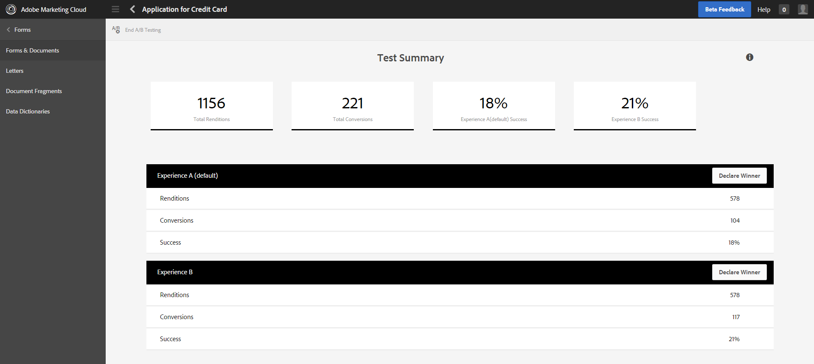

# Create and manage A/B test for adaptive forms{#create-and-manage-a-b-test-for-adaptive-forms}

[!BADGE Discontinued]{type=negative tooltip="This feature is now end of life"}

 The A/B testing for adaptive forms feature has reached end-of-life and is no longer supported. 

## Overview {#overview-br}

Your customers are likely to abandon a form if the experience it delivers is not engaging. While it is frustrating for the customers, it can also upturn the support volume and cost for your organization. It is critical as well as challenging to identify and provide the right customer experience that increases the conversion rate. Adobe Experience Manager Forms holds the key to this problem.

AEM Forms integrates with Adobe Target, an Adobe Marketing Cloud solution, to deliver personalized and engaging customer experiences across multiple digital channels. One of the key capabilities of Target is A/B testing that allows you to quickly set up concurrent A/B tests, present relevant content to targeted users, and identify the experience that drives better conversion rate.

With AEM Forms, you can set up and run A/B tests on adaptive forms in real time. It also provides out-of-the-box and customizable reporting capabilities to visualize real-time performance of your form experiences and identify the one that maximizes user engagement and conversion.

## Set up and integrate Target in AEM Forms {#set-up-and-integrate-target-in-aem-forms}

Before you begin to create and analyze A/B tests for adaptive forms, you need to set up your Target server and integrate it in AEM Forms.

### Set up Target {#set-up-target}

To integrate AEM with Target, ensure that you have a valid Adobe Target account. When you register with Adobe Target, you receive a client code. You need the client code, email associated with Target account, and password to connect AEM with Target.

The Client Code identifies the Adobe Target customer account and is used as a sub-domain in the URL when calling the Adobe Target server. Before proceeding, log on to [https://experience.adobe.com/](https://experience.adobe.com/) and, if you have access, view the [!DNL Adobe Target] option in the [!UICONTROL Quick Access] section.

### Integrate Target in AEM Forms {#integrate-target-in-aem-forms}

Perform the following steps to integrate a running Target server with AEM Forms:

1. On AEM server, go to https://&lt;*hostname*&gt;:&lt;*port*&gt;/libs/cq/core/content/tools/cloudservices.html.

1. In the **Adobe Target** section, click **Show Configurations** and then the **+** icon to add a new configuration.
   If you are configuring target for the first time, click **Configure Now.**

1. In the Create configuration dialog, specify a **Title** and optionally a **Name** for the configuration.

1. Click **Create**. The Edit component dialog opens.
1. Specify your Target account details, such as client code, email, and password.
1. Select **Rest** from the API Type drop-down list.

1. Click **Connect to Adobe Target** to initialize the connection with Target. If the connection is successful, the message Connection successful is displayed. Click **OK** on the message and then **OK** on the dialog. The Target account is configured.

1. Create a Target framework as described in [Add a framework](/help/sites-administering/target.md).

1. Go to https://&lt;*hostname*&gt;:&lt;*port*&gt;/system/console/configMgr.

1. Click **AEM Forms Target Configuration**.
1. Select a **Target Framework**.
1. In the **Target URLs** field, specify all the URLs where A/B tests will run. For example, https://&lt;*hostname*&gt;:&lt;*port*&gt;/ for AEM Forms server on OSGi or https://&lt;*hostname*&gt;:&lt;*port*&gt;/lc/ for AEM Forms server on JEE.
   Consider that you want to configure a Target URL for a publish instance and your customers can access it using the hostname or the IP address, you will need to configure both as Target URLs - using the hostname as well as the IP address. If you confgure only one of the URLs, your A/B test will not run for customers coming from the other URL. Click **+** to specify multiple URLs.

1. Click **Save**.

Your Target server is integrated with AEM Forms. You can now enable A/B testing if you have a full license to utilize Adobe Target.

If you have a full license to utilize Adobe Target, start the server with the following parameters after you integrate Target with AEM Forms:

`parameter -Dabtesting.enabled=true java -Xmx2048m -XX:MaxPermSize=512M -jar -Dabtesting.enabled=true`

If the AEM instance is running on JBoss, started as a service from turnkey, in `jboss\bin\standalone.conf.bat` file, add -Dabtesting.enabled=true parameter in the following entry:

`set "JAVA_OPTS=%JAVA_OPTS% -Dadobeidp.serverName=server1 -Dfile.encoding=utf8 -Djava.net.preferIPv4Stack=true -Dabtesting.enabled=true"`

In addition to jboss server, you can add -Dabtesting.enabled=true jvm argument in server startup script for any application server. Now you can create and run A/B tests for adaptive forms.

>[!NOTE]
>
>If you update the configured Target URLs later, ensure that you update any running A/B tests so that they point to the current URLs. For information about updating A/B tests, see [Update A/B test](/help/forms/using/ab-testing-adaptive-forms.md#p-update-a-b-test-p).
>

## Create audiences within AEM {#create-audiences-within-aem}

AEM lets you create an audience, and use it for an A/B test. The audience you create within AEM is available in AEM Forms. Perform the following steps to create audiences within AEM:

1. In authoring instance, tap **Adobe Experience Manager** &gt; **Personalization** &gt; **Audiences**.

1. In the Audiences page, tap **Create Audience &gt; Create Target Audience**.
1. In the Adobe Target Configuration dialog, select a Target configuration and click **Ok**.
1. In the Create New Audience page, create rules. Rules let you categorize the audience. For example, you want to categorize audiences based on operating system. Your audience A comes from Windows, and audience B comes from Linux.

    1. To categorize audience based on Windows, in Rule #1, select **OS** attribute type. From the When drop-down, select **Windows.**

    1. To categorize audience based on Linux, in Rule #2, select **OS** attribute type. From the **When** drop-down, select **Linux**, and click **Next**.

1. Specify a name for the created audience, and click **Save**.

You can select the audience when you configure A/B testing for a form, as shown below.

## Create A/B test {#create-a-b-test}

Perform the following steps to create an A/B test for an adaptive form.

1. Go to **Forms & Documents** at https://&lt;*hostname*&gt;:&lt;*port*&gt;/aem/forms.html/content/dam/formsanddocuments.

1. Navigate to the folder containing the adaptive form.
1. Click the **Select** tool in the toolbar and select the adaptive form.
1. Click **More** in toolbar and select **Configure A/B Testing**. The Configure A/B testing page opens.

1. Specify an **Activity Name** for the A/B test.

1. From the Audience drop-down list, select an audience to whom you want to serve different experiences of the form. For example, **Visitors Using Chrome**. The audience list is populated from the configured Target server.

1. In the **Experience Distribution** fields for experiences A and B, specify the distribution, in terms of percentage, to determine the distribution of experiences among the total audience. For example, if you specify 40, 60 for experiences A and B, respectively, the experience A will be served to the 40% of the audience and the remaining 60% will see the experience B.
1. Click **Configure**. A dialog appears to confirm the creation of the A/B test.
1. Click **Edit Experience B** to open the adaptive form in the edit mode. Modify the form to create a different experience than the default experience A. The possible variations allowed in Experience B are changes in:

    * CSS or styling
    * Order of fields in different panels or the same panel
    * Panel layout
    * Panel titles
    * Description, label, and help text for a field
    * Scripts that do not impact or break the submit flow
    * Validations (both client and server sides)
    * Theme for experience B. (You can select an alternate theme for experience B)

1. Go to the Forms and Documents UI, select the adaptive form, click **More**, and select **Start A/B Testing**.

You A/B test is now running and the specified audience will be randomly served the experiences based on the specified distribution.

## Update A/B test {#update-a-b-test}

You can update the audience and experience distributions of a running A/B test. To do so:

1. In the Forms & Documents UI, navigate to the folder that contains the adaptive form on which the A/B test is running.
1. Select the adaptive form.
1. Click **More** and then select **Edit A/B testing**. The Update A/B testing page opens.

1. Update the audience and experience distributions, as required.
1. Click **Update**.

## View and analyze A/B test report {#view-and-analyze-a-b-test-report}

Once you have allowed the A/B test to run for the desired period, you can generate a report and check which experience has resulted in better conversion. You can declare the better performing experience a winner or choose to run another A/B test. To do this, perform the following steps:

1. Select the adaptive form, click **More**, and then click **A/B Testing Report**. The report gets displayed.

1. Analyze the report and see if you have enough data points to declare one of the better performing experiences as a winner. You can choose to continue with the same A/B test for more time or declare a winner and end the A/B test.
1. To declare a winner and end the A/B test, click **End A/B test** button on the reporting dashboard. A dialog prompts you to declare one of the two experiences as winner. Choose a winner and confirm to end the A/B test.
   Alternatively, you can first declare a winner by clicking the **Declare Winner** button for the respective experience. It prompts you to confirm the winner. Click **Yes** to end the A/B test.

If you picked experience A as the winner, the A/B test will be put to an end, and going forward, only Experience A will be served to all the audiences.
