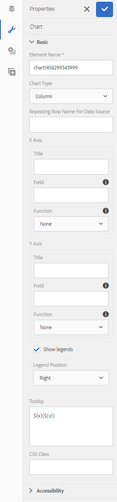
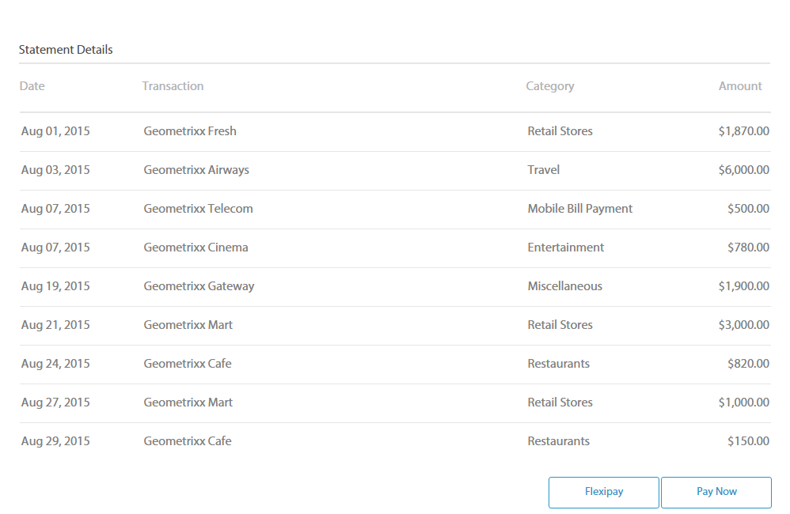
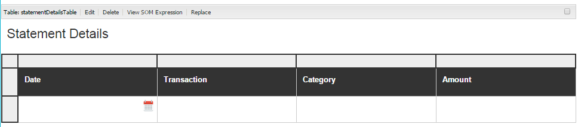
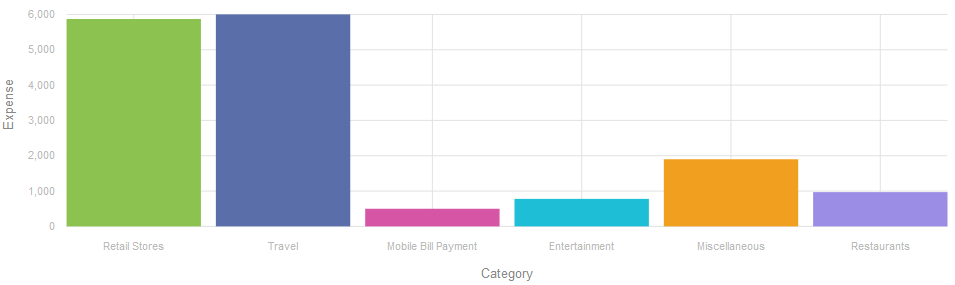
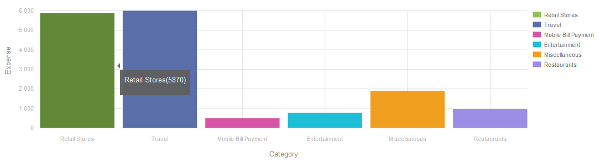
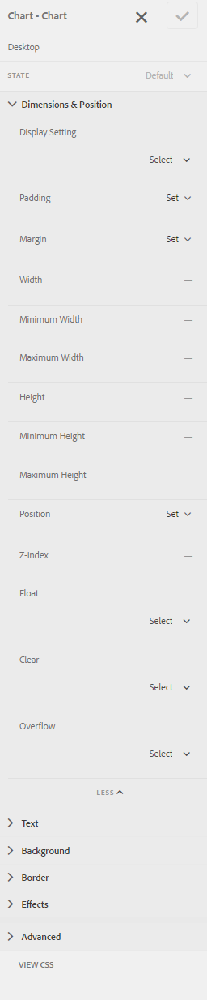
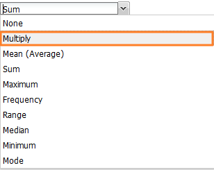
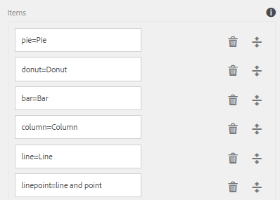
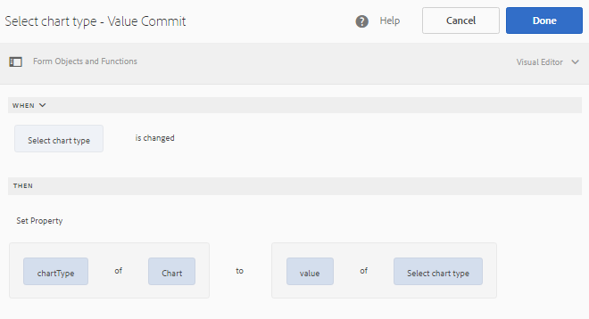
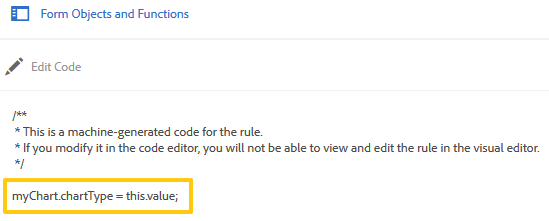

# Adaptive Form Charts {#af-charts}


A chart or a graph is a visual representation of data. It allows you to condense large amounts of information into easy-to-understand visual format, enabling you to better visualize, interpret, and analyze complex data.
AEM Forms add-on package provides an out-of-the-box Chart component. You can use in your adaptive forms and documents for visual representation of two-dimensional data in **repeatable panels** and **tables**. The Chart component allows you to add and configure the following types of charts:

1. Pie
1. Column
1. Donut
1. Bar
1. Line
1. Line and Point
1. Point
1. Area

The Chart component supports and provides in-built statistical functions – sum, mean, maximum, minimum, mode, median, range, and frequency – to compute and plot values on a chart. In addition to the functions available out-of-the-box, you can write your own custom functions and make them available for use in charts.

Let's now look at how to add and configure the Chart component:

## Add chart {#add-chart}

The Chart component is available in AEM sidebar, by default. You can drag-drop the Chart component from AEM sidebar to the adaptive form or document in authoring mode. When you drop the component, it creates a placeholder for a chart.

## Configure chart {#configure-chart}

>[!NOTE]
> 
> Before configuring the chart, ensure that the panel or the table row for which you are configuring the chart is set to repeatable. You can specify minimum and maximum counts for repeatable panel or table row in the Repeat Settings tab of their Edit Component dialog.

To configure the chart, click the Chart component and click  to open the Edit Chart dialog. The dialog includes Title and text, Configuration, Advanced options, and Styling tabs that allow you to configure the chart.

### Basic {#basic}

In the Basic tab, you can configure the following properties:



* **Element name**: An identifier for the chart element in JCR content structure. It is not visible on the chart but helps when referring to the element from other components, scripts, and SOM expressions.
* **Chart type**: Specifies the type of chart that you want to generate. The available options are Pie, Donut, Bar, Column, Line, Line and Point, Point, and Area. In the example, the chart type is Column.
* **Repeating Row Name or Panel Name for Data Source**: Specifies the element name of the table row or the repeatable panel from where the data will be sourced. In the example, statementDetails is the element name of the repeatable row in the Statement Details table.
* **X-Axis > Title**: Specifies the title for the X-axis. In the example, the title for X-axis is Category.
* **X-Axis > Field**: Specifies the element name of the field (or a cell in a table) to be plotted on X-axis. In the example, categories are configured on X-axis. The element name for the table cell in the Category column of the example table is category.
* **X-Axis > Use function**: Specifies the statistical function to use for computing the values on X-axis. In the example, the option selected is None. For more information about functions, see Use functions in chart.
* **Y-Axis > Title**: Specifies the title for the Y-axis. In the example, the title for Y-axis is Expense.
* **Y-Axis > Field**: Specifies the element name of the field (or the cell in a table) to be plotted on Y-axis. In the example, configure amount on Y-axis. The element name for the table cell in the Amount column of the example table is amount.
* **Y-Axis > Use function**: Specifies the statistical function to use for computing the values on Y-axis. In the example, the amount spent in each category is added and the computed value is plotted on the Y-axis. Therefore, select Sum from the Use function drop-down list. For more information about functions, see Use functions in chart.
* **Legend position**: Specifies the position of the legend with respect to the chart. The available options are Right, Left, Top, and Bottom.
* **Show legend**: Show a legend for the chart, when enabled.
* **Tooltip**: Specifies the format in which the tool tip appears on mouseover on a data point in the chart. The default value is **\${x}(\${y})**. Depending on the chart type, when you point the mouse on a point, bar, or slice in the chart, the variables **\${x}** and **\${y}** are dynamically replaced with the corresponding values on X-axis and Y-axis and displayed in the tool tip. As shown in the example below, the tool tip is displayed as **Retail Stores(5870)** when pointing mouse at the Retails Stores column. To disable tool tip, leave the Tooltip field blank. This option is not applicable for Line and Area charts.
* **Chart-specific configurations**: In addition to common configurations, the following chart-specific configuration is available:
* **Inner radius**: available for Donut charts to specify the radius (in pixels) of the inner circle in the chart.
* **Line color**: available for Line, Line and Point, and Area charts to specify the hexadecimal value of the color for the line in the chart.
* **Point color**: available for Point and Line, and Point charts to specify the hexadecimal value of the color for the points in the chart.
* **Area color**: available for Area charts to specify the hexadecimal value of the color for the area under the line in the chart.
* **CSS Class**: Specify the name of a CSS class in the CSS class field to apply custom styling to the chart.

### Configuration {#configuration}

In the Basic tab, you define the type of chart, the source panel or table row that contain data, the values to be plotted on X-axis and Y-axis of the chart, and optionally the statistical function to compute the values for plotting on the chart.

Let's understand in detail about the information that goes in this tab, with the help of an example of a repeatable table in a credit card statement. Consider that you want to generate a chart to depict and correlate the total expense in different categories in the statement details section of a credit card statement, as shown below.

To accomplish this, you need to plot categories on X-axis, and on the Y-axis, plot the total expenditure in each category.



The credit card statement used in this example is an adaptive form document and the statement details section is a table, which looks as follows in the authoring mode.



Let's consider the following requirements and conditions for generating the chart:

* The chart displays the total expense in each category in the Statement Details table.
* The chart type is Column, though you can choose any other chart type, as appropriate.
* The Table row in the Statement Details table is repeatable. You can configure it in the Repeat Settings field of the table row properties.
* The element name for the row is Statement Details. You can configure it in the Table Row properties.
* The element name for the table cell in the Category column is category. You can specify it inline. Select the cell and tap the edit button.
* The element name for the table cell in the Amount column is amount. Also, the table cell in the Amount column is a numeric box.
* With the specified configuration, the Column chart in the example will appear as follows. Each color represents a category and individual line items or amounts for a category are added up in the chart.  

    

The legend and the tool tip appear as follows.



### Styling {#styling}

In the Styling mode, you can configure the width, in percentage of the total width available in the form or document, and height, in pixels, for the chart. Other options include text, background, border, effects, and CSS overrides.

To switch to styling mode, in the page toolbar, **tap>>Style**.



## Use functions in chart {#use-functions}

You can configure a chart to use statistical functions to compute values from the source data for plotting on the chart. While the Chart component have some in-built functions, you can write your own functions and make them available for use in the chart configuration.

>[!NOTE]
>
> You can use functions to compute values for either X-axis or Y-axis in a chart.

### Default functions {#default-functions}

The following functions are available by default with the Chart component:

* **Mean (Average)**: Returns the average of the values on X or Y axis for a given value on the other axis.
* **Sum**: Returns the sum of all values on X or Y axis for a given value on the other axis.
* **Maximum**: Returns the maximum of the values on X or Y axis for a given value on the other axis.
* **Frequency**: Returns the number of values on X or Y axis for a given value on the other axis.
* **Range**: Returns the difference between the maximum and minimum of the values on X or Y axis for a given value on the other axis.
* **Median**: Returns the value that separates higher and lower values in half on X or Y axis for a given value on the other axis.
* **Minimum**: Returns the minimum of the values on X or Y axis for a given value on the other axis.
* **Mode**: Returns the value with most occurrences on X or Y axis for a given value on the other axis

### Custom functions {#custom-functions}

In addition to using the default functions in charts, you can write [custom functions](/help/forms/using/rule-editor.md#custom-functions-in-rule-editor-custom-functions) in JavaScript and make them available in the list of functions in the Chart component.

A function takes an array or values and a category name as inputs and returns a value. For example:

```
Multiply(valueArray, category) {
    var val = 1;
    _.each(valueArray, function(value) {
        val = val * value;
    });
    return val;
}
```

Once you have written a custom function, do the following to make it available for use in the chart configuration:

1. Add the custom function in the client library associated with the adaptive form or document.
1. In CRXDE Lite, create an nt:unstructured node in the apps folder with the following properties:
    * Set guideComponentType set to fd/af/reducer. (mandatory)
    * Set value to a fully qualified name of the custom JavaScript function. (mandatory)
    * Set jcr:description to a meaningful name. It appears in the **Use function** drop-down list. For example, **Multiply**.
    * Set qtip to a short description of the function. It appears as a tooltip when hovering pointer over the function name in the Use function drop-down list.
    * Click **Save All** to save the configuration. 
    * The function is now available for use in the Chart.




## Auto refresh chart {#auto-refresh-chart}

A chart refreshes automatically when users do one of the following:
* Add or remove an instance of the data source panel or table row.
* Change any value plotted on X or Y axis in the data source panel or table row.
* Change the chart type.

## Use chart type in adaptive form rules {#chart-in-rules}

The chartType property specifies the type of chart. The possible values are pie, donut, bar, line, linepoint, point, and area. It is a scriptable property, which means you can use it in [adaptive form rules](/help/forms/using/rule-editor.md) to manipulate chart configurations. Let's understand it with the help of an example.

Consider that you configured a Column chart. However, you also want to provide users an option to select a different chart type from a drop-down list and redraw the chart. You can achieve this using the chartType property in a rule as follows:

1. Drag-drop a Drop-down list component from AEM sidebar on the adaptive form.
1. Select the component and tap .
1. Specify a title for the drop-down list. For example, Select chart type.
1. Add supported chart types in the Items section, to populate the drop-down list. Click **Done**.
    

1. Select the drop-down component and tap . In the rule editor, write a rule in the visual rule editor as shown below. 
    

    In this example, the element name of the chart component is **myChart**.

    Alternatively, you can write the following rules in the code editor.

    

    For more information about writing rules, see [Rule editor](/help/forms/using/rule-editor.md)

1. Click Done to save the rule.

Now, you can select a chart type from the drop-down list and click refresh to redraw the chart.
