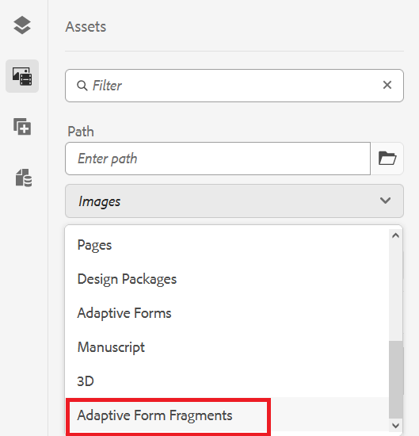
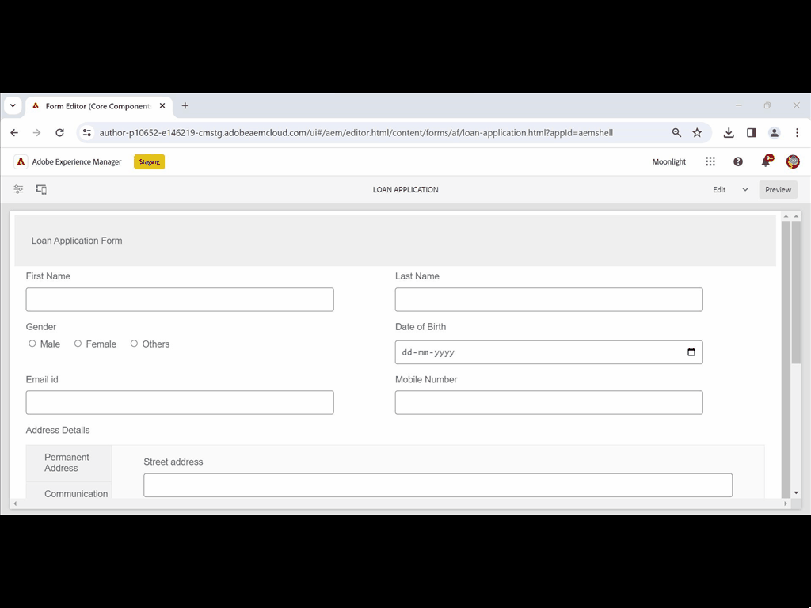

# Create and use Adaptive Forms Fragments in an Adaptive Form based on Core Components {#adaptive-form-fragments}

| Version | Article link |
| -------- | ---------------------------- |
| AEM 6.5     | This article   |
| AEM as a Cloud Service|    [Click here](https://experienceleague.adobe.com/docs/experience-manager-cloud-service/content/forms/adaptive-forms-authoring/authoring-adaptive-forms-core-components/create-an-adaptive-form-on-forms-cs/adaptive-form-fragments-core-components.html)                  |

While every form is designed for a specific purpose, there are some common segments in most forms, such as to provide personal details like name and address, family details, income details. Form developers are required to create these common segments every time a new form is created.

Adaptive Forms provides a convenient mechanism to create form segment like a panel or a group of fields only once and reuse them across Adaptive Forms. These reusable and standalone segments are called Adaptive Form fragments. 

Form fragments seamlessly integrate into multiple forms, streamlining the creation of consistent and professional-looking forms. Form Fragments ensure reusability, standardization, and brand consistency through 'change once and reflect everywhere' functionality. Experience greater maintainability and efficiency as updates made in one place are automatically propagated across all forms that utilize these fragments.

You can add a fragment multiple times to a document and use data binding properties of its components to tie it to different data sources or schema. For example, you can use the same address fragment for permanent, communication, and billing address and connect it to different fields of a data sources or schema. 

>[!NOTE]
>
> You can easily customize your fragment experience for users with the [Configure dialog and Design dialog of Form Fragment component](https://experienceleague.adobe.com/docs/experience-manager-core-components/using/adaptive-forms/adaptive-forms-components/form-fragment.html).

## Create a form fragment {#create-a-fragment}

You can create an Adaptive Form fragment from scratch or save a panel in an existing Adaptive Form as fragment. To create a form fragment: 

1. Log in to your AEM Forms instance at https://[*hostname*]:[*port*]/aem/forms.html.
1. Click **Create &gt; Adaptive Form Fragment**.
1. Specify title, name, description, and tags for the fragment. Ensure that you specify a unique name for the fragment. If another fragment exists with the same name, the fragment fails to create.
1. Select a form template. You can create a form fragment for Core Components based Adaptive Forms or Foundation Components based Adaptive Forms. 
   * To create form fragment for Core Components based forms, select a Core Components based template. 
   * To create form fragment for Foundation Components based forms, select a Foundation Components template. For example, /libs/fd/af/templateForFragment/defaultFragmentTemplate.

   When you create form fragment for Core Components based forms, use the Select Form Theme option to select a Core Components based theme. 

1. Click to open the **Form Model** tab, and from the **Select From** drop-down menu, select one of the following models for the fragment:

   

    * **None**: Specifies to create the fragment from scratch without using any form model.

      >[!NOTE]
      >
      > In Adaptive Forms, you can use single form fragment (based on Core Components) multiple times. It supports both none-based and schema-based form fragments.
      
    * **Schema**: Specifies to create the fragment using an XML or JSON schema uploaded to AEM Forms. You can upload or select from the available XML or JSON schemas as the form model for the fragment. When you select an XML schema, you can also create an Adaptive Form fragment by selecting a complexType present in the selected schema from the **[!UICONTROL XML Schema Complex Type]** drop-down box. When you select a JSON schema, you can also create an Adaptive Form fragment by selecting a schema definition present in the selected schema from the **[!UICONTROL JSON Schema Definitions]** drop-down box. 
    * **Form Data Model**:  Specifies to create the fragment using a form data model. You can create an Adaptive Form fragment based on only one data model object in a form data model. Expand Form Data Model Definitions drop-down. It lists all data model objects in the specified form data model. Select a data model object from the list.

    

      

1. Click **Create** and then click **Open** to open the fragment, with a default template, in edit mode. In edit mode, you can add any Adaptive Form component to the fragment. 

<!-- For information about Adaptive Form components, see [Introduction to authoring Adaptive Forms](../../forms/using/introduction-forms-authoring.md). --> In addition, if you selected an XML schema or XDP form template as the form model for your fragment, a new tab displaying the form-model hierarchy appears in the content finder. It lets you drag-and-drop form-model elements onto the fragment. The added form-model elements get converted into form components while retaining the original properties from the associated XDP or XSD. 

Once the Adaptive Form fragment based on a schema or form data model is created, form data model or schema elements appear in the Data Sources tab of the Content browser in Adaptive Form editor. You can drag-and-drop form-model elements onto the fragment. The added form-model elements are converted to form components while retaining the original properties from the associated schema. 

## Add a fragment to an Adaptive Form {#insert-a-fragment-in-an-adaptive-form}

To add an Adaptive Form fragment to an Adaptive Form:

1. Open the Adaptive Form in edit mode. 
1. Add the **Adaptive Form Fragment** component to the form. 
1. Click the **Assets** content browser the sidebar. In the assets browser, under the paths, select the **Adaptive Form Fragments** option. All the Adaptive Forms fragments available for your form, depending on the model of the form, appear. 

    

1. Drag-and-drop an Adaptive Form fragment onto the **Adaptive Form Fragment** component on your Adaptive Form.

   >[!NOTE]
   >
   >The Adaptive Form fragment is not enabled for authoring from within the Adaptive Form. Moreover, you cannot use an XSD-based fragment in a JSON-based Adaptive Form and the opposite way.

The Adaptive Form fragment is added by reference to the Adaptive Form and remains in synchronized with the standalone Adaptive Form fragment. This implies that any modifications made to the Adaptive Form fragment are mirrored across all instances where the fragment is incorporated within Adaptive Forms.

### Embed a fragment in Adaptive Form {#embed-a-fragment-in-adaptive-form}

You can choose to embed an Adaptive Form fragment in an Adaptive Form by clicking the  icon the panel toolbar of the added fragment

The embedded fragment is no longer linked with the standalone fragment. You can edit the components in the embedded fragment from within the Adaptive Form.

<!-- 
## Configure fragment appearance {#configure-fragment-appearance}

Any fragment you insert in Adaptive Forms appears as a placeholder image. The placeholder displays titles of up to a maximum of ten child panels in the fragment. You can configure AEM Forms to show the complete fragment instead of the placeholder image.

Perform the following steps to show complete fragments in forms:

1. Go to AEM web console configuration page at https:[*host*]:[*port*]/system/console/configMgr.

1. Search and click **[!UICONTROL Adaptive Form and Interactive Communication Web Channel Configuration]** to open it in edit mode.
1. Disable **[!UICONTROL Enable Placeholder in place of Fragment]** checkbox to show complete fragments rather than the placeholder image.

--> 

### Using fragments within fragments {#using-fragments-within-fragments}

You can create nested Adaptive Form fragments, which means you can drag-drop a fragment in another fragment, and can have nested fragment structure.

### Using a form fragment multiple times in an Adaptive Form {#using-form-fragment-mutiple-times-in-af}

You can use a none-based and schema-based form fragment multiple times in an Adaptive Form to save data uniquely for each form fragments fields. For example, you can use an address form fragment to collect address details for permanent, communication, and present living addresses in a loan application form. 

## Auto mapping of fragments for data binding {#auto-mapping-of-fragments-for-data-binding}

When you create an Adaptive Form fragment using an XFA form template or XSD complex type and drag-drop the fragment to an Adaptive Form, the XFA fragment or the XSD complex type is automatically replaced by the corresponding Adaptive Form fragment whose fragment model root is mapped to the XFA fragment or XSD complex Type.

You can change the fragment asset and its bindings from the Edit component dialog.

You can also drag-drop a bound Adaptive Form fragment from Adaptive Form Fragment library in AEM content finder and provide the correct bind reference from the Edit component dialog of the Adaptive Form fragment panel.

## Manage fragments {#manage-fragments}

You can perform several operations on Adaptive Form fragments using the AEM Forms UI.

1. Go to `https://[hostname]/aem/forms.html`.

1. Click **Select** in the AEM Forms UI toolbar and select an Adaptive Form fragment. The toolbar displays the following operations you can perform on the selected Adaptive Form fragment.

<table>
 <tbody>
  <tr>
   <td>
<strong>Operation</strong>
 </td>
   <td>
<strong>Description</strong>
 </td>
  </tr>
  <tr>
   <td>
Edit
 </td>
   <td>
Opens the selected Adaptive Form fragment in edit mode.    
 </td>
  </tr>
  <tr>
   <td>
Properties
 </td>
   <td>
Opens the Properties panel. From the Properties panel, you can view and edit properties, generate a preview, and upload a thumbnail image for the selected fragment. For more information, see <a>Managing metadata</a>.    
 </td>
  </tr>
  <tr>
   <td>
Copy
 </td>
   <td>
Copies the selected fragment. The Paste button appears in the toolbar.    
 </td>
  </tr>
  <tr>
   <td>
Download
 </td>
   <td>
Downloads the selected fragment.    
 </td>
  </tr>
  <tr>
   <td>
Preview
 </td>
   <td>
Provides options to preview the fragment as an HTML or a custom preview by merging data from an XML file with the fragment. For more information, see <a>Previewing a form</a>.    
 </td>
  </tr>
  <tr>
   <td>
Start Review/Manage Review
 </td>
   <td>
Allows initiating and managing a review of the selected fragment. For more information, see <a>Creating and managing reviews</a>.    
 </td>
  </tr>
  <tr>
   <td>
Add Dictionary
 </td>
   <td>
Generates a dictionary for localizing the selected fragment. For more information, see <a>Localizing Adaptive Forms</a>.    
 </td>
  </tr>
  <tr>
   <td>
Publish / Unpublish
 </td>
   <td>
Publishes / unpublishes the selected fragment.    
 </td>
  </tr>
  <tr>
   <td>
Delete
 </td>
   <td>
Deletes the selected fragment.    
 </td>
  </tr>
 </tbody>
</table>

## Key points to remember when working with fragments {#key-points-to-remember-when-working-with-fragments}

* Ensure that the fragment name is unique. The fragment fails to create if there is an existing fragment with the same name.
* In an XDP-based Adaptive Form, if you save a panel as fragment that includes another XDP fragment, the resulting fragment is automatically bound to the child XDP fragment. If an XSD-based Adaptive Form, the resulting fragment is bound to the schema root.
* When you create an Adaptive Form fragment, a fragment node gets created, which is similar to the guideContainer node for an Adaptive Form, in CRXDE Lite.
* A fragment in an Adaptive Form that uses a different form data model is not supported. For example, an XDP-based fragment is not supported in an XSD-based Adaptive Form and conversely.
* Adaptive Form fragments are available for use through the Adaptive Form Fragments tab in AEM content finder.
* Any expression, script, or style in a stand-alone Adaptive Form fragment is retained when it is inserted by reference or embedded in an Adaptive Form.
* You cannot edit an Adaptive Form fragment, which is inserted by reference, from within an Adaptive Form. To edit, you either edit the stand-alone Adaptive Form fragment or embed the fragment in the Adaptive Form.
* When you publish an Adaptive Form, you need to publish the standalone Adaptive Form fragments inserted by reference in the Adaptive Form.
* When you republish an updated Adaptive Form fragment, the changes reflect in the published instances of the Adaptive Form in which the fragment is used.
* Adaptive Form containing the Verify component does not support anonymous users. Also, it is not reommended to use the Verify component in an Adaptive Form fragment.
* (**Mac only**) To ensure that the form fragments functionality works perfectly in all the scenarios, add the following entry to the /private/etc/hosts file:
  `127.0.0.1 <Host machine>` **Host machine**: The Apple Mac machine on which AEM Forms is deployed.

## Reference Fragments {#reference-fragments}

Reference Adaptive Form fragments that you can use to create your form.
<!-- For more information, see [Reference Fragments](../../forms/using/reference-adaptive-form-fragments.md). -->

## See Also {#see-also}

* [Create a Core Components based Adaptive Form](create-an-adaptive-form-core-components.md)
* [Use rule editor to add dynamic behavior to form](rule-editor.md)
* [Create or customize themes for Core Components based Adaptive Forms](create-or-customize-themes-for-adaptive-forms-core-components.md)
* [Create a template for Core Components based Adaptive Forms](template-editor.md)
* [Create or Add an Adaptive Form to an AEM Sites Page or Experience Fragment](create-or-add-an-adaptive-form-to-aem-sites-page.md)
* [Sample themes templates and form data models](https://experienceleague.adobe.com/docs/experience-manager-core-components/using/adaptive-forms/sample-themes-templates-form-data-models-core-components.html)
