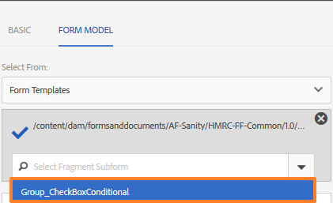
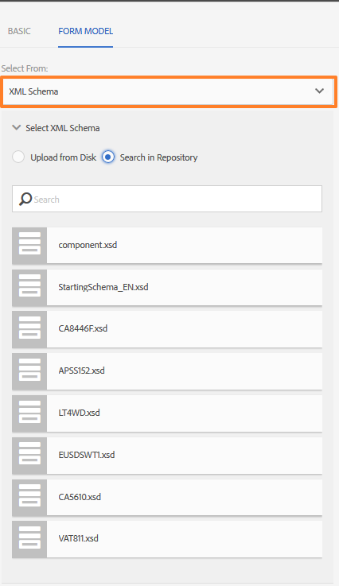
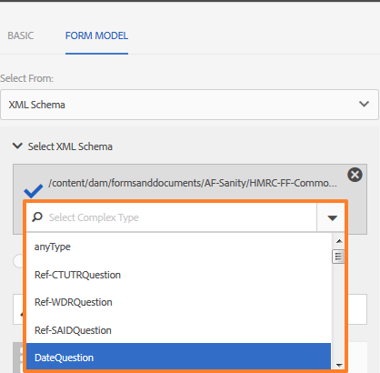
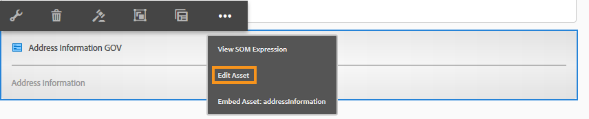

# Adaptive form fragments{#adaptive-form-fragments}

| Version | Article link |
| -------- | ---------------------------- |
| AEM as a Cloud Service |    [Click here](https://experienceleague.adobe.com/docs/experience-manager-cloud-service/content/forms/adaptive-forms-authoring/authoring-adaptive-forms-core-components/create-an-adaptive-form-on-forms-cs/adaptive-form-fragments-core-components.html)               |
| AEM 6.5     | This article         |

 Adobe recommends using the modern and extensible data capture [Core Components](https://experienceleague.adobe.com/docs/experience-manager-core-components/using/adaptive-forms/introduction.html) for [creating new Adaptive Forms](/help/forms/using/create-an-adaptive-form-core-components.md) or [adding Adaptive Forms to AEM Sites pages](/help/forms/using/create-or-add-an-adaptive-form-to-aem-sites-page.md). These components represent a significant advancement in Adaptive Forms creation, ensuring impressive user experiences. This article describes older approach to author Adaptive Forms using foundation components. 

While every form is designed for a specific purpose, there are some common segments in most forms, such as to provide personal details like name and address, family details, and income details. Form developers are required to create these common segments every time a new form is created.

Adaptive forms provide a convenient mechanism to create form segment like a panel or a group of fields only once and reuse them across adaptive forms. These reusable and standalone segments are called Adaptive Form Fragments.

>[!NOTE]
>
> You can easily customize your fragment experience for users with the [Configure dialog and Design dialog of Form Fragment component](https://experienceleague.adobe.com/docs/experience-manager-core-components/using/adaptive-forms/adaptive-forms-components/form-fragment.html).

## Create a fragment {#create-a-fragment}

You can create an Adaptive Form Fragment from scratch or save a panel in an existing adaptive form as fragment.

### Create fragment from scratch {#create-fragment-from-scratch}

1. Log into AEM Forms author instance at https://[*hostname*]:[*port*]/aem/forms.html.
1. Click **Create &gt; Adaptive Form Fragment**.
1. Specify title, name, description, and tags for the fragment.

   >[!NOTE]
   >
   >Ensure that you specify a unique name for the fragment. If there exists another fragment with the same name, the fragment fails to create.

1. Click to open the **Form Model** tab, and from the **Select From** drop-down menu, select one of the following models for the fragment:

    * **None**: Specifies to create the fragment from scratch without using any form model.

      >[!NOTE]
      >
      > In Adaptive Forms based on core components, you can use a single form fragment multiple times in a form. It supports both none-based and schema-based form fragments.

    * **Form Template**: Specifies to create the fragment using an XDP template uploaded to AEM Forms. Select the appropriate XDP template as the form model for the fragment.

   

   The sub-forms marked as fragments in the selected form template are also displayed. You can select a sub-form for adaptive form fragment from the drop-down list.

   

   In addition, you can create an adaptive form fragment using sub forms that are not marked as fragments in the form template by specifying the SOM expression for the sub form in the drop-down box.

    * **XML Schema**: Specifies to create the fragment using an XML schema uploaded to AEM Forms. You can upload or select from the available XML schemas as the form model for the fragment.

   

   You can also create an adaptive form fragment by selecting a complexType present in the selected schema from the drop-down box.

   

1. Click **Create** and then click **Open** to open the fragment, with a default template, in edit mode.

In edit mode, you can drag-and-drop any adaptive form component from the AEM sidekick onto the fragment. For information about adaptive form components, see [Introduction to authoring adaptive forms](../../forms/using/introduction-forms-authoring.md).

In addition, if you selected an XML schema or XDP form template as the form model for your fragment, a new tab displaying the form-model hierarchy appears in the content finder. It lets you drag-and-drop form-model elements onto the fragment. The added form-model elements get converted into form components while retaining the original properties from the associated XDP or XSD.

### Save panel as a fragment {#save-panel-as-a-fragment}

1. Open an adaptive form that contains the panel you want to save as adaptive form fragment.
1. In the panel toolbar, click **[!UICONTROL Save as Fragment]**. The Save As Fragment dialog opens.

   >[!NOTE]
   >
   >If the panel you are saving as fragment contains child panel, the resulting fragment includes them.

1. In the Fragment Creation dialog, specify the following information:

    * **Name**: Name of the fragment. The default value is the element name of the panel. It is a mandatory field.
      >[!NOTE]
      >
      >Ensure that you specify a unique name for the fragment. If there exists another fragment with the same name, the fragment fails to create.  

    * **Title**: Title of the fragment. The default value is the title of the panel.

    * **Description**: Description of the fragment.

    * **Tags**: Tags metadata for the fragment.

    * **Target Path**: Repository path where the fragment is saved. If you do not specify a path, a node with the same name as that of the fragment gets created next to the node containing the adaptive form. The fragment is saved in this node.

    * **Form Model**: Depending on the form model for the adaptive form, this field displays the **XML Schema**, **Form Template**, or **None**. It is a non-editable field.

    * **Fragment Model Root**: Appears only in XSD-based adaptive forms. It specifies the root for the fragment model. You can choose **/** or the XSD complex type from the drop-down. You can reuse the fragment in another adaptive form only if you select the complex type as the fragment model root.
      If you choose **/** as the fragment model root, the complete XSD tree from the root is visible in the adaptive form data model tab. For a complex type fragment model root, only the descendants of the selected complex type are visible in the adaptive form data model tab. If you create a fragment and choose a complex type as the **Fragment Model Root**, you can use it wherever that complex type is used, either within the same form or across multiple forms.

    * **XSD Ref**: Appears only in XSD-based adaptive forms. It displays the location of the XML schema.

    * **XDP Ref**: Appears only in XDP-based adaptive forms. It displays the location of the XDP form template.

   

   Save As Fragment dialog

1. Click **OK**.

   The panel is saved at the specified or the default location in the repository. In the adaptive form, the panel is replaced by a snapshot of the fragment. As shown below, the General Information panel and its child panels, Personal Information and Address, are saved as a fragment.

   To edit the fragment, click **[!UICONTROL Edit Asset]** in the panel toolbar. The fragment opens in a new tab or window in edit mode.

   

## Working with fragments {#working-with-fragments}

### Configure fragment appearance {#configure-fragment-appearance}

Any fragment you insert in adaptive forms appears as a placeholder image. The placeholder displays titles of up to a maximum of ten child panels in the fragment. You can configure AEM Forms to show the complete fragment instead of the placeholder image.

Perform the following steps so you can show complete fragments in forms:

1. Go to AEM web console configuration page at https:[*host*]:[*port*]/system/console/configMgr.

1. Search and select **[!UICONTROL Adaptive Form and Interactive Communication Web Channel Configuration]** to open it in edit mode.
1. Disable **[!UICONTROL Enable Placeholder in place of Fragment]** checkbox so you can show complete fragments rather than the placeholder image.

### Insert a fragment in an adaptive form {#insert-a-fragment-in-an-adaptive-form}

The adaptive form fragments you create appear in the Adaptive Form Fragments tab of the AEM content finder. To insert an adaptive form fragment in an adaptive form:

1. Open the adaptive form, in edit mode, in which you want to insert an adaptive form fragment.
1. Click **Assets**  in the sidebar. In the assets browser, select **Adaptive Form Fragments** from the drop-down.

   You can also choose to display all adaptive form fragments or filter based on their form model - Form Template, XML Schema, or Basic.

1. Drag-and-drop an adaptive form fragment onto the adaptive form.

   >[!NOTE]
   >
   >The adaptive form fragment is not enabled for authoring from within the adaptive form. Moreover, you cannot use an XSD-based fragment in a JSON-based adaptive form and the opposite way.

The adaptive form fragment is inserted by reference in the adaptive form and is synchronized with the standalone adaptive form fragment. It means when you update the adaptive form fragment, the changes reflect in all adaptive forms where the fragment is used.

### Embed a fragment in adaptive form {#embed-a-fragment-in-adaptive-form}

You can choose to embed an adaptive form fragment in an adaptive form by clicking **Embed Asset: &lt;*fragmentName*&gt;** button on the panel toolbar of the added fragment, as shown in the following example image.

>[!NOTE]
>
>The embedded fragment is no longer linked with the standalone fragment. You can edit the components in the embedded fragment from within the adaptive form.

### Using fragments within fragments {#using-fragments-within-fragments}

You can create nested adaptive form fragments, which means you can drag-drop a fragment in another fragment, and can have nested fragment structure.

### Change fragments {#change-fragments}

You can replace or change an adaptive form fragment by another fragment by using the **Select Fragment asset** property in the Edit component dialog for an adaptive form fragment panel.

### Generate Document of Record for Adaptive Form fragment {#generate-DOR-for-fragments}

Document of Record (DOR) helps you keep information of your forms in the print or document format. As such, it helps you to track information about your customers at any time later, and you can also use the Document of Record to archive forms and content together in PDF Format. [Learn to generate document of record for Adaptive Form fragments](/help/forms/using/generate-document-of-record-for-non-xfa-based-adaptive-forms.md).

### Using a form fragment multiple times in an Adaptive Form {#using-form-fragment-mutiple-times-in-af}

You can use a schema-based form fragment multiple times in an Adaptive Form to save data uniquely for each form fragment fields. For example, you can use an address form fragment to collect address details for permanent, communication, and present living addresses in a loan application form. 

  >[!NOTE]
  >
  > * If you use none-based form fragments multiple times in an Adaptive form, data syncing between the fields of fragments occurs. The data syncing issue does not occur in core component-based form fragments, where you can use a fragment either schema-based or none-based multiple times in a form.
  
## Auto mapping of fragments for data binding {#auto-mapping-of-fragments-for-data-binding}

When you create an adaptive form fragment using an XFA form template or XSD complex type and drag-drop the fragment to an adaptive form, the XFA fragment or the XSD complex type is automatically replaced by the corresponding adaptive form fragment whose fragment model root is mapped to the XFA fragment or XSD complex Type.

You can change the fragment asset and its bindings from the Edit component dialog.

>[!NOTE]
>
>You can also drag-drop a bound adaptive form fragment from Adaptive Form Fragment library in AEM content finder and provide the correct bind reference from the Edit component dialog of the adaptive form fragment panel.

## Manage fragments {#manage-fragments}

You can perform several operations on adaptive form fragments using the AEM Forms UI.

1. Go to `https://[hostname]:'port'/aem/forms.html`.

1. Click **Select** in the AEM Forms UI toolbar and select an adaptive form fragment. The toolbar displays the following operations that you can perform on the selected adaptive form fragment.

<table>
 <tbody>
  <tr>
   <td>
<strong>Operation</strong>
 </td>
   <td>
<strong>Description</strong>
 </td>
  </tr>
  <tr>
   <td>
Open
 </td>
   <td>
Opens the selected adaptive form fragment in edit mode.    
 </td>
  </tr>
  <tr>
   <td>
View Properties
 </td>
   <td>
Opens the Properties panel. From the Properties panel, you can view and edit properties, generate a preview, and upload a thumbnail image for the selected fragment. For more information, see <a href="../../forms/using/manage-form-metadata.md" target="_blank">Managing metadata</a>.    
 </td>
  </tr>
  <tr>
   <td>
Copy
 </td>
   <td>
Copies the selected fragment. The Paste button appears in the toolbar.    
 </td>
  </tr>
  <tr>
   <td>
Download
 </td>
   <td>
Downloads the selected fragment.    
 </td>
  </tr>
  <tr>
   <td>
Preview
 </td>
   <td>
Provides options to preview the fragment as an HTML or a custom preview by merging data from an XML file with the fragment. For more information, see <a href="/help/forms/using/previewing-forms.md" target="_blank">Previewing a form</a>.    
 </td>
  </tr>
  <tr>
   <td>
Start Review/Manage Review
 </td>
   <td>
Allows initiating and managing a review of the selected fragment. For more information, see <a href="../../forms/using/create-reviews-forms.md" target="_blank">Creating and managing reviews</a>.    
 </td>
  </tr>
  <tr>
   <td>
Create Dictionary
 </td>
   <td>
Generates a dictionary for localizing the selected fragment. For more information, see <a href="/help/forms/using/lazy-loading-adaptive-forms.md" target="_blank">Localizing adaptive forms</a>.    
 </td>
  </tr>
  <tr>
   <td>
Publish / Unpublish
 </td>
   <td>
Publishes / unpublishes the selected fragment.    
 </td>
  </tr>
  <tr>
   <td>
Delete
 </td>
   <td>
Deletes the selected fragment.    
 </td>
  </tr>
 </tbody>
</table>

## Localizing adaptive form containing fragments {#localizing-adaptive-form-containing-fragments}

To localize an adaptive form that contains adaptive form fragments, you must localize the fragment and the form separately. The idea is to localize a fragment once and reuse it in multiple adaptive forms.

>[!NOTE]
>
>The localization keys in the fragment do not appear in the XLIFF file for an adaptive form.

## Key points to remember when working with fragments {#key-points-to-remember-when-working-with-fragments}

* Ensure that the fragment name is unique. The fragment fails to create if there is an existing fragment with the same name.
* In an XDP-based adaptive form, if you save a panel as fragment that includes another XDP fragment, the resulting fragment is automatically bound to the child XDP fragment. If there is an XSD-based adaptive form, the resulting fragment is bound to the schema root.
* When you create an adaptive form fragment, a fragment node gets created, which is similar to the guideContainer node for an adaptive form, in CRXDE Lite.
* A fragment in an adaptive form that uses a different form data model is not supported. For example, an XDP-based fragment is not supported in an XSD-based adaptive form and conversely.
* Adaptive form fragments are available for use through the Adaptive Form Fragments tab in AEM content finder.
* Any expression, script, or style in a stand-alone adaptive form fragment is retained when it is inserted by reference or embedded in an adaptive form.
* You cannot edit an adaptive form fragment, which is inserted by reference, from within an adaptive form. To edit, you either edit the stand-alone adaptive form fragment or embed the fragment in the adaptive form.
* When you publish an adaptive form, you must publish the standalone adaptive form fragments inserted by reference in the adaptive form.
* When you republish an updated adaptive form fragment, the changes reflect in the published instances of the adaptive form in which the fragment is used.
* Adaptive form containing the Verify component does not support anonymous users. Also, it is not recommended to use the Verify component in an adaptive form fragment.
* (**Mac only**) To ensure that the form fragments functionality works perfectly in all the scenarios, add the following entry to the /private/etc/hosts file:
  `127.0.0.1 <Host machine>` **Host machine**: The Apple Mac machine on which AEM Forms is deployed.

## Reference Fragments {#reference-fragments}

Reference adaptive form fragments that you can use to create your form are available. For more information, see [Reference Fragments](../../forms/using/reference-adaptive-form-fragments.md).
