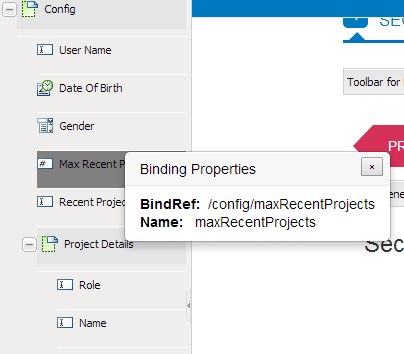

# Creating adaptive forms using XML Schema {#creating-adaptive-forms-using-xml-schema}

<span class="preview"> Adobe recommends using the modern and extensible data capture [Core Components](https://experienceleague.adobe.com/docs/experience-manager-core-components/using/adaptive-forms/introduction.html) for [creating new Adaptive Forms](/help/forms/using/create-an-adaptive-form-core-components.md) or [adding Adaptive Forms to AEM Sites pages](/help/forms/using/create-or-add-an-adaptive-form-to-aem-sites-page.md). These components represent a significant advancement in Adaptive Forms creation, ensuring impressive user experiences. This article describes older approach to author Adaptive Forms using foundation components. </span>

## Prerequisites {#prerequisites}

Authoring an adaptive form using an XML schema as its form model requires basic understanding of XML schemas. Also, it is recommended to read through the following content before this article.

* [Creating an adaptive form](creating-adaptive-form.md)
* [XML schema](https://www.w3.org/TR/xmlschema-2/)

## Using an XML schema as form model {#using-an-xml-schema-as-form-model}

[!DNL Experience Manager Forms] supports creation of an adaptive form by using an existing XML schema as the form model. This XML schema represents the structure in which data is produced or consumed by the back-end system in your organization.

The key features of using an XML schema are:

* The structure of the XSD is displayed as a tree in the Content Finder tab in the authoring mode for an adaptive form. You can drag and add element from the XSD hierarchy to the adaptive form.
* You can pre-populate the form using XML that is compliant with the associated schema.
* On submission, the data entered by the user is submitted as XML that aligns with the associated schema.

An XML schema consists of simple and complex element types. The elements have attributes that add rules to the element. When these elements and attributes are dragged onto an adaptive form, they are automatically mapped to the corresponding adaptive form component.

This mapping of XML elements with adaptive form components is as follows:

<table>
 <tbody>
  <tr>
   <th><strong>XML element or attribute </strong></th>
   <th><strong>Adaptive form component</strong></th>
  </tr>
  <tr>
   <td><code>xs:string</code></td>
   <td>Text box</td>
  </tr>
  <tr>
   <td><code>xs:boolean</code></td>
   <td>Check box</td>
  </tr>
  <tr>
   <td>
    <ul>
     <li><code>xs:unsignedInt</code></li>
     <li><code>xs:xs:int</code></li>
     <li><code class="code">xs:decimal
        </code></li>
     <li>All types of numerical values</li>
    </ul> </td>
   <td>Numeric box</td>
  </tr>
  <tr>
   <td><code>xs:date</code></td>
   <td>Date picker</td>
  </tr>
  <tr>
   <td><code class="code">xs:enumeration
      </code></td>
   <td>Drop down</td>
  </tr>
  <tr>
   <td>Any complex-type element</td>
   <td>Panel</td>
  </tr>
 </tbody>
</table>

## Sample XML Schema {#sample-xml-schema}

Here's an example of an XML schema.

```xml
<?xml version="1.0" encoding="utf-8" ?>
    <xs:schema targetNamespace="https://adobe.com/sample.xsd"
                    xmlns="https://adobe.com/sample.xsd"
                    xmlns:xs="https://www.w3.org/2001/XMLSchema"
                >

        <xs:element name="sample" type="SampleType"/>

        <xs:complexType name="SampleType">
            <xs:sequence>
                <xs:element name="leaderName" type="xs:string" default="Enter Name"/>
                <xs:element name="assignmentStartBirth" type="xs:date"/>
                <xs:element name="gender" type="GenderEnum"/>
                <xs:element name="noOfProjectsAssigned" type="IntType"/>
                <xs:element name="assignmentDetails" type="AssignmentDetails"
                                            minOccurs="0" maxOccurs="10"/>
            </xs:sequence>
        </xs:complexType>

        <xs:complexType name="AssignmentDetails">
            <xs:attribute name="name" type="xs:string" use="required"/>
            <xs:attribute name="durationOfAssignment" type="xs:unsignedInt" use="required"/>
            <xs:attribute name="numberOfMentees" type="xs:unsignedInt" use="required"/>
             <xs:attribute name="descriptionOfAssignment" type="xs:string" use="required"/>
             <xs:attribute name="financeRelatedProject" type="xs:boolean"/>
       </xs:complexType>
  <xs:simpleType name="IntType">
            <xs:restriction base="xs:int">
            </xs:restriction>
        </xs:simpleType>
  <xs:simpleType name="GenderEnum">
            <xs:restriction base="xs:string">
                <xs:enumeration value="Female"/>
                <xs:enumeration value="Male"/>
            </xs:restriction>
        </xs:simpleType>
    </xs:schema>
```

>[!NOTE]
>
>Ensure that your XML schema has only one root element. An XML schema with more than one root element is not supported.

## Adding special properties to fields using XML schema {#adding-special-properties-to-fields-using-xml-schema}

You can add the following attributes to XML Schema elements to add special properties to the fields of the associated adaptive form.

<table>
 <tbody>
  <tr>
   <th><strong>Schema property</strong></th>
   <th><strong>Use in adaptive form</strong></th>
   <th><strong>Supported in </strong></th>
  </tr>
  <tr>
   <td><code>use=required </code></td>
   <td>Marks a field mandatory<br /> </td>
   <td>Attribute</td>
  </tr>
  <tr>
   <td><code>default="default value"</code></td>
   <td>Adds a default value</td>
   <td>Element and attribute</td>
  </tr>
  <tr>
   <td><code>minOccurs="3"</code></td>
   <td><p>Specifies minimum occurrences</p> <p>(For repeatable subforms (complex types))</p> </td>
   <td>Element (complex type)</td>
  </tr>
  <tr>
   <td><code class="code">maxOccurs="10"
      </code></td>
   <td><p>Specifies maximum occurrences</p> <p>(For repeatable subforms (complex types))</p> </td>
   <td>Element (complex type)</td>
  </tr>
 </tbody>
</table>

>[!NOTE]
>
>When you drag a schema element to an adaptive form, a default caption is generated by:
>
>* Capitalizing the first character of the element name
>* Inserting white space at Camel Case boundaries.
>
>For example, if you add the `userFirstName` schema element, the caption generated in the adaptive form is `User First Name`.

## Limit acceptable values for an adaptive form component {#limit-acceptable-values-for-an-adaptive-form-component}

You can add the following restrictions to XML schema elements to limit the values acceptable to an adaptive form component:

<table>
 <tbody>
  <tr>
   <td><p><strong> Schema property</strong></p> </td>
   <td><p><strong>Data Type</strong></p> </td>
   <td><p><strong>Description</strong></p> </td>
   <td><p><strong>Component</strong></p> </td>
  </tr>
  <tr>
   <td><p><code>totalDigits</code></p> </td>
   <td><p>String</p> </td>
   <td><p>Specifies the maximum number of digits allowed in a component. The number of digits specified must be greater than zero.</p> </td>
   <td>
    <ul>
     <li>Numeric box</li>
     <li>Numeric Stepper</li>
    </ul> </td>
  </tr>
  <tr>
   <td><p><code>maximum</code></p> </td>
   <td><p>String</p> </td>
   <td><p>Specifies the upper bound for numeric values and dates. By default, the maximum value is included.</p> </td>
   <td>
    <ul>
     <li>Numeric box</li>
     <li>Numeric Stepper<br /> </li>
     <li>Date Picker</li>
    </ul> </td>
  </tr>
  <tr>
   <td><p><code>minimum</code></p> </td>
   <td><p>String</p> </td>
   <td><p>Specifies the lower bound for numeric values and dates. By default, the minimum value is included.</p> </td>
   <td>
    <ul>
     <li>Numeric box</li>
     <li>Numeric Stepper</li>
     <li>Date Picker</li>
    </ul> </td>
  </tr>
  <tr>
   <td><p><code>exclusiveMaximum</code></p> </td>
   <td><p>Boolean</p> </td>
   <td><p>If true, the numeric value or date specified in the component of the form must be less than the numeric value or date specified for the maximum property.</p> <p>If false, the numeric value or date specified in the component of the form must be less than or equal to the numeric value or date specified for the maximum property.</p> </td>
   <td>
    <ul>
     <li>Numeric box</li>
     <li>Numeric Stepper</li>
     <li>Date Picker</li>
    </ul> </td>
  </tr>
  <tr>
   <td><p><code>exclusiveMinimum</code></p> </td>
   <td><p>Boolean</p> </td>
   <td><p>If true, the numeric value or date specified in the component of the form must be greater than the numeric value or date specified for the minimum property.</p> <p>If false, the numeric value or date specified in the component of the form must be greater than or equal to the numeric value or date specified for the minimum property.</p> </td>
   <td>
    <ul>
     <li>Numeric box</li>
     <li>Numeric Stepper</li>
     <li>Date Picker</li>
    </ul> </td>
  </tr>
  <tr>
   <td><p><code>minLength</code></p> </td>
   <td><p>String</p> </td>
   <td><p>Specifies the minimum number of characters allowed in a component. The minimum length must be equal to or greater than zero.</p> </td>
   <td>
    <ul>
     <li>Text box</li>
    </ul> </td>
  </tr>
  <tr>
   <td><p><code>maxLength</code></p> </td>
   <td><p>String</p> </td>
   <td><p>Specifies the maximum number of characters allowed in a component. The maximum length must be greater than zero.</p> </td>
   <td>
    <ul>
     <li>Text box</li>
    </ul> </td>
  </tr>
  <tr>
   <td><p><code>length</code></p> </td>
   <td><p>String</p> </td>
   <td><p>Specifies the exact number of characters allowed in a component. The length must be equal to or greater than zero.</p> </td>
   <td>
    <ul>
     <li>Text box</li>
    </ul> </td>
  </tr>
  <tr>
   <td><p><code>fractionDigits</code></p> </td>
   <td><p>String</p> </td>
   <td><p>Specifies the maximum number of decimal places allowed in a component. The fractionDigits must be equal to or greater than zero.</p> </td>
   <td>
    <ul>
     <li> Numeric Box with data type float or decimal</li>
    </ul> </td>
  </tr>
  <tr>
   <td><p><code>pattern</code></p> </td>
   <td><p>String</p> </td>
   <td><p>Specifies the sequence of the characters. A component accepts the characters if the characters conform to specified pattern.</p> <p>The pattern property maps to the validation pattern of the corresponding adaptive form component.</p> </td>
   <td>
    <ul>
     <li>All adaptive forms components which are mapped to an XSD schema </li>
    </ul> </td>
  </tr>
 </tbody>
</table>

## Frequently asked questions {#frequently-asked-questions}

**How do I know which element in the tree is associated with which XML element?**

When you double-click an element in Content Finder, a pop-up window displays a field name and a property called `bindRef`. This property maps the tree element to the element or attribute in the schema.



The <code>bindRef</code> field shows the association between a tree element and an element or attribute in a schema.

>[!NOTE]
>
>Attributes have an `@` symbol in their `bindRef`value to distinguish them from elements. For example, `/config/projectDetails/@duration`.

**Why I am not able to drag individual elements of a subform (structure generated from any complex type) for repeatable subforms (minOccours or maxOccurs values are greater than 1)?**

In a repeatable subform, you must use the Complete subform. If you want only selective fields, use the entire structure and delete the unwanted ones.

**I have a long complex structure in Content Finder. How can I find a specific element?**

You have two options:

* Scroll through the tree structure
* Use the Search box to find an element

**What is a bindRef?**

A `bindRef` is the connection between an adaptive form component and a schema element or attribute. It dictates the `XPath` where the value captured from this component or field is available in the output XML. A `bindRef`is also used when prepopulating a field value from prefilled (prepopulated) XML.
