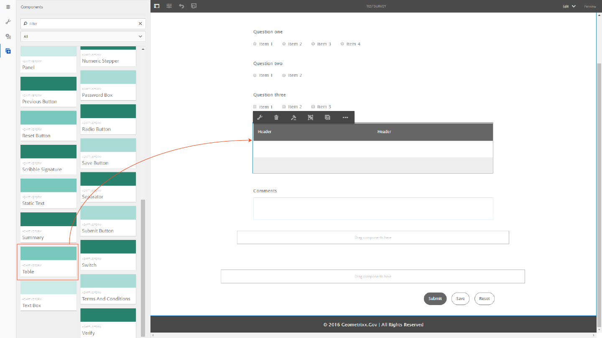
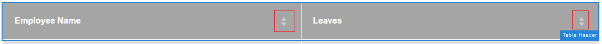
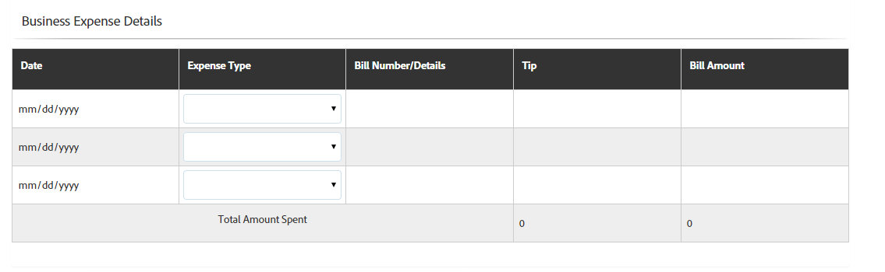
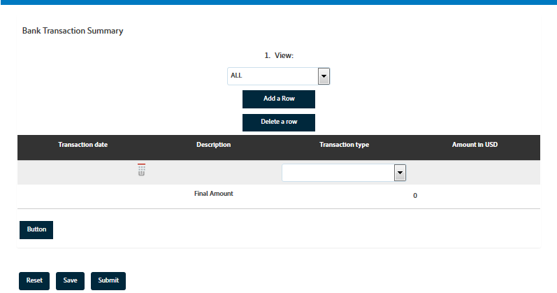

# Tables in adaptive forms{#tables-in-adaptive-forms}

<span class="preview"> Adobe recommends using the modern and extensible data capture [Core Components](https://experienceleague.adobe.com/docs/experience-manager-core-components/using/adaptive-forms/introduction.html) for [creating new Adaptive Forms](/help/forms/using/create-an-adaptive-form-core-components.md) or [adding Adaptive Forms to AEM Sites pages](/help/forms/using/create-or-add-an-adaptive-form-to-aem-sites-page.md). These components represent a significant advancement in Adaptive Forms creation, ensuring impressive user experiences. This article describes older approach to author Adaptive Forms using foundation components. </span>

| Version | Article link |
| -------- | ---------------------------- |
| AEM as a Cloud Service |    [Click here](https://experienceleague.adobe.com/docs/experience-manager-cloud-service/content/forms/adaptive-forms-authoring/authoring-adaptive-forms-foundation-components/add-components-to-an-adaptive-form/adaptive-forms-tables.html)                  |
| AEM 6.5     | This article         |


Using tables is an effective, simplified, and organized way of presenting complex data. It helps users in identifying information easily and providing inputs in an ordered arrangement of rows and columns. Most forms from financial services and government organizations require large data tables to put numbers and perform calculations.

AEM Forms provides a Table component in the components browser in sidebar that lets you create tables in adaptive forms. Some of the key capabilities it provides are:

* Responsive layout on mobile devices
* Configurable rows and columns
* Dynamic addition and deletion of rows at runtime
* Combine or merge and split cells
* Accessible by screen readers
* Custom layout using CSS
* Compatible and mapped with XDP table component
* Support for adding rows or cells using XSD complex type elements
* Merge data from an XML file

## Create a table {#create-a-table}

To create a table, drag-and-drop the Table component from the components browser in the sidekick on the adaptive form. By default, the table contains two columns and three rows, including the header row.



### About header and body cells {#about-header-and-body-cells}

The header cells are text fields. To change the label for a header, right-click the header cell and click **Edit**. In the Edit dialog, update the label in the **Value** field and click **OK**.

The body cells are text boxes, by default. You can replace a body cell with any other adaptive forms component available in the sidekick, such as a numeric box, date picker, or drop-down list.

For example, the first body row in the following table includes text box, date picker, and drop-down list components as cells.


You can merge two or more body cells by selecting the cells you want to merge, right-click, and select **Merge**. Also, you can split a merged cell by right-clicking it and selecting **Split Cells**.

### Add, delete, move rows and columns {#add-delete-move-rows-and-columns}

You can add and delete a row or column, and move a row up and down in a table.

To add or delete a row or column or move a row, click any cell in the row or column. A drop-down menu appears at the top of the column and on the left of the row. The menu at the top provides options to add or delete the column, whereas the menu on the left lets you add, delete, or move the row.

* The Add operation adds a row below or a column to the right of the selected row or column.
* The Delete operation deletes the selected row or column.
* The Move Up and Move Down operation moves the selected row up and down.

The drop-down menu for the row also provides the Edit operation to edit row properties, settings, and styling options.


>[!NOTE]
>
>While you can add any number of rows in a table, the maximum number of columns you can add is six. Also, you cannot delete the header row from the table.

### Add table description {#add-table-description}

You can add a description of the table to explain how the information is organized that screen readers can interpret and read out. To add the description:

1. Select the table and select  to see its properties in the sidebar.
1. Specify summary in the Accessibility tab.
1. Click **Done**.

### Sort columns in a table {#sortcolumnstable}

You can sort data based on any column in a table in the adaptive form. The values in the column can be sorted in an ascending or descending order.

Sorting can be applied to table columns containing:

* Static text
* Data model object properties
* Combination of static text and data model object properties

To apply sorting on table columns, the table column cells must contain any of the following components: Numeric Box, Numeric Stepper, Date Input Field, Date Picker, Text, or Text Box.

To enable sorting:

1. Select the table and select  (Configure). You can also select the table using the **Content** browser in the sidekick of the Interactive Communication.
1. Select **Enable Sorting**.
1. Select  to save the table properties. The sorting icons, up and down arrows, in columns headers represent that the sorting has been enabled.

   

1. Switch to the **Preview** mode to view the output. The table is automatically sorted based on the first column of the table.
1. Click the column header to sort the values based on the column.

   A column header with an up arrow represents that the table is sorted based on that column. In addition, the values in the column are displayed in the ascending order.

   

   Similarly, a column header with a down arrow represents that the values in the column are displayed in the descending order.

   You can also make changes in the table in the **Preview** mode and click the column header again to sort the column values.

## Set column width for a table {#set-column-width}

Execute the following steps to set column width for a table:

1. In the **[!UICONTROL Content]** tab, select the **[!UICONTROL Table]** component and select the Configure ()icon.

1. Enter the comma-separated list of values in the **[!UICONTROL Column Width]** field to specify the proportionate width of each column in the table. For example, for a table that includes 3 columns, specifying 2,4,6 as the value in the **[!UICONTROL Column Width]** field results in setting the width of columns as 2/12 for first column, 4/12 for second column, and 6/12 for third column. 2/12 as the width for the first column refers to one-sixth of the table width. Similarly, 4/12 sets the second column width as one-third of the table width and 6/12 sets the third column width as half of the table width.

## Configure table style {#configure}

You can define the style for a table by using the Style mode in the page toolbar. Perform the following steps to switch to style mode and edit the table styling

1. In the page toolbar, before Preview, select  &gt; **Style**.

1. In the sidebar select table and select the edit button .
   You can see the styling properties in the sidebar.


>[!NOTE]
>
>You can change the color theme for header and body rows by changing the values of LESS variables. For more information, see [Themes in AEM Forms](/help/forms/using/themes.md).

## Add or delete a row dynamically {#add-or-delete-a-row-dynamically}

Tables provide out-of-the box support for dynamically adding or deleting rows at runtime.

1. Select a table row and select .
1. In the Repeat settings tab, specify the minimum and maximum counts to limit the number of rows in the table.
1. Click **Done**.

At runtime, you will see **+** and *-* buttons to add or delete a row.


>[!NOTE]
>
>Adding or deleting a row dynamically is not supported in Headers on left mobile layout of tables.

## Expressions in a table {#expressions-in-a-table}

Tables in adaptive forms let you write expressions in JavaScript to induce behaviors, such as show or hide a table or a row, add up all the numbers and show the total in a cell, enable or disable a cell, validate user input, and so on. These expressions use adaptive forms scripting model APIs.

While tables and rows support only visibility expressions to control their visibility based on the value returned by an expression, cells support the following expressions:

* **Initialization Script:** to perform an action on initialization of a field.
* **Value Commit Script:** to change the components of a form after the value of a field is changed.

>[!NOTE]
>
>If the XFA change/exit script is also applied to the same field, the XFA change/exit script executes before the Value Commit script.

* **Calculate expressions**: to auto-compute value of a field.
* **Validation expressions**: to validate a field.
* **Access expressions**: to enable/disable a field.
* **Visibility expression**: to control visibility of a field and panel.

The visibility expression for a table or a row can be defined in the Panel properties tab of their corresponding Edit component dialog. The expressions for a cell can be defined in the Script tab of its Edit component dialog.

For the complete list of adaptive forms classes, events, objects, and public APIs, see [JavaScript Library API reference for adaptive forms](https://helpx.adobe.com/experience-manager/6-5/forms/javascript-api/index.html).

## Mobile layouts {#mobile-layouts}

Tables in adaptive forms provide unmatched experience mobile devices because of its fluid and responsive layouts. AEM Forms offers two types of mobile layouts for tables - Headers on left and Collapsible columns.

You can configure a mobile layout for a table from the Styling tab of the Edit component dialog for a table.

### Headers on left {#headers-on-left}

In the Headers on left layout, the header in the table are transposed on the left with only one cell appearing against a header. Each row in this layout appears as a distinct section. The following images compare a table on a desktop with that on a mobile device.



Desktop view of a table with Header on left layout


Mobile view of a table with Header on left layout

### Collapsible columns layout {#collapsible-columns-layout}

In the Collapsible column layout, the columns in the table collapse to show one or two columns, depending on the device size, while other columns are collapsed. You can click the collapse/expand icon to view other columns in the table.

>[!NOTE]
>
>While Collapsible column layout is optimized for mobile devices, it will work on desktop as well, if the width available is not enough to show all the columns in a table.

The following images compare how a table looks on a device with collapsed and expanded columns.


Collapsed columns of a table with only two columns showing up on a mobile device


Expanded column of a table on a mobile device

## Merge data in a table {#merge-data-in-a-table}

Tables in adaptive forms let you populate the table at runtime using data from an XML file. The data XML file can reside in the local file system of the machine where AEM Forms server is running or in the CRX repository.

Let's take example of the following bank transaction summary table that we want to populate with data from an XML file.



In this example, the Element name property for:

* the row is **Row1**
* the body cell under Transaction date is **tableItem1**
* the body cell under Description is **tableItem2**
* the body cell under Transaction type is **type**
* the body cell under Amount in USD is **tableItem3**

The XML file that contains data in the following format:

```xml
<?xml version="1.0" encoding="UTF-8"?><afData>
  <afUnboundData>
    <data>
 <typeSelect>0</typeSelect>
 <Row1>
      <tableItem1>2015-01-08</tableItem1>
      <tableItem2>Purchase laptop</tableItem2>
      <type>0</type>
      <tableItem3>12000</tableItem3>
 </Row1>
 <Row1>
      <tableItem1>2015-01-05</tableItem1>
      <tableItem2>Transport expense</tableItem2>
      <type>0</type>
      <tableItem3>120</tableItem3>
 </Row1>
 <Row1>
      <tableItem1>2014-01-08</tableItem1>
      <tableItem2>Laser printer</tableItem2>
      <type>0</type>
      <tableItem3>500</tableItem3>
 </Row1>
 <Row1>
      <tableItem1>2014-12-08</tableItem1>
      <tableItem2>Credit card payment</tableItem2>
      <type>0</type>
      <tableItem3>300</tableItem3>
 </Row1>
 <Row1>
      <tableItem1>2015-01-06</tableItem1>
      <tableItem2>Interest earnings</tableItem2>
      <type>1</type>
      <tableItem3>12000</tableItem3>
 </Row1>
 <Row1>
      <tableItem1>2015-01-05</tableItem1>
      <tableItem2>Payment from a client</tableItem2>
      <type>1</type>
      <tableItem3>500</tableItem3>
 </Row1>
 <Row1>
      <tableItem1>2015-01-08</tableItem1>
      <tableItem2>Food expense</tableItem2>
      <type>0</type>
      <tableItem3>120</tableItem3>
 </Row1>
 </data>
  </afUnboundData>
  <afBoundData>
    <data/>
  </afBoundData>
  <afBoundData/>
</afData>

```

In the sample XML, the data for a row is defined by the `<Row1>` tags, which is the element name for the row in the table. Within the `<Row1>` tag, the data for each cell is defined within the tag for its element name, such as `<tableItem1>`, `<tableItem2>`, `<tableItem3>`, and `<type>`.

To merge this data with the table at runtime, we need to point the adaptive form containing the table to the absolute XML location with wcmmode disabled. For example, if the adaptive form is at *https://localhost:4502/myForms/bankTransaction.html* and the data XML file is saved at *C:/myTransactions/bankSummary.xml*, you can view the table with data at the following URL:

*https://localhost:4502/myForms/bankTransaction.html?dataRef=file:/// C:/myTransactions/bankSummary.xml&wcmmode=disabled*


## Use XDP components and XSD complex types {#use-xdp-components-and-xsd-complex-types}

If you created an adaptive form based on an XFA form template, the XFA elements are available in the Data Model tab of AEM Content Finder. You can drag and drop these XFA elements, including tables, in the adaptive form.

The XFA table element is mapped to the Table component and works out-of-the-box in adaptive forms. All properties and functionalities of XDP table are preserved when moved into adaptive form, and you can perform any operation on it just as you do with native adaptive form table. For example, if a row in an XDP table is marked repeatable, it will be repeated when dropped in adaptive forms as well.

In addition, you can drag-drop XDP subform to add a new row in the table. However, note that dropping a nested subform does not work.

>[!NOTE]
>
>An XDP table without a header row will not be mapped to the adaptive form Table component. Instead, it will be mapped to the adaptive form Panel component with fluid layout. Also, when you add a nested table from an XDP to an adaptive form, the outer table gets converted to a panel while retaining the inner table.

In addition, you can drag-drop a group of XSD complex type elements to create a table row. A new row gets created just below the row on which you dropped the elements. The cells created using the XSD complex type elements maintain a binding reference to the XSD. You can also replace a body cell with an XSD complex type element by dropping the element onto the cell.

>[!NOTE]
>
>The number of elements in an XDP table component, a subform, or an XSD complex type cannot exceed the number of cells in a row. For example, you cannot drop four elements on a row that has only three cells. It will result in an error.
>
>If the number of elements is less than the number of cells in a row, the new row first adds cells based on the elements, and then the default cells are added to fill in the remaining cells in the row. For example, if you drop a group of three elements in a row that has four cells, the first three cells are based on the elements you dropped and the remaining one cell will be the default table cell.

## Key considerations {#key-considerations}

* If you move rows up and down while authoring an XSD-based table, some data loss from table rows is seen in the data XML generated on submitting the form.
* Each body cell in a default table has a predefined element name associated with it. If you add another table in the adaptive form, the default body cells in the new table will have the same element name as in the first table. In such scenario, the data generated on submitting the form will include data in the default body cells of only one of the tables. Therefore, ensure that you rename the element names for default body cells to keep them unique across tables and avoid data loss.

  Note that this is applicable only to the default body cells. If you add more rows or columns to a table will autogenerate unique element names for non-default body cells.
