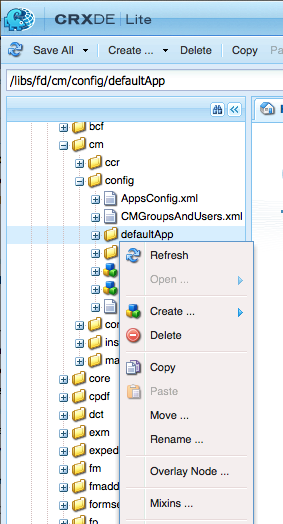
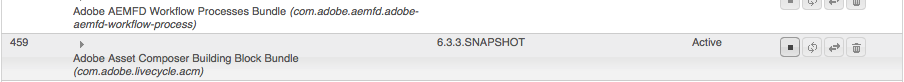

# Add a custom action button in Create Correspondence UI {#add-custom-action-button-in-create-correspondence-ui}

## Overview {#overview}

The Correspondence Management solution lets you add custom actions to the Create Correspondence user interface.

The scenario in this document explains how you can create a button in the Create Correspondence User Interface to share a letter as a review PDF attached to an email.

### Prerequisites {#prerequisites}

To complete this scenario, you require the following:

* Knowledge of CRX and JavaScript
* LiveCycle Server

## Scenario: Create the button in the Create Correspondence User Interface to send a letter for review {#scenario-create-the-button-in-the-create-correspondence-user-interface-to-send-a-letter-for-review}

Adding a button with an action (here send letter for review) to the Create Correspondence User Interface includes:

1. Adding the button to the Create Correspondence User Interface
1. Adding action handling to the button
1. Adding the LiveCycle process to enable action handling

### Add the button to the Create Correspondence user interface {#add-the-button-to-the-create-correspondence-user-interface}

1. Go to `https://'[server]:[port]'/[ContextPath]/crx/de` and login as Administrator.
1. In the apps folder, create a folder named `defaultApp` with path/structure similar to the defaultApp folder (in config folder). Use the following steps to create the folder:

    1. Right-click the **defaultApp** folder at the following path and select **Overlay Node**:

       /libs/fd/cm/config/defaultApp/

       

    1. Ensure that the Overlay Node dialog has the following values:

       **Path:** /libs/fd/cm/config/defaultApp/

       **Overlay Location:** /apps/

       **Match Node Types:** Checked

       

    1. Click **OK**.
    1. Click **Save All**.

1. Make a copy of the acmExtensionsConfig.xml file (exists under the /libs branch) under the /apps branch.

    1. Go to "/libs/fd/cm/config/defaultApp/acmExtensionsConfig.xml"

    1. Right-click the acmExtensionsConfig.xml file and select **Copy**.

       

    1. Right-click the **defaultApp** folder at "/apps/fd/cm/config/defaultApp/," and select **Paste**.
    1. Click **Save All**.

1. Double-click the copy of acmExtentionsConfig.xml you have newly created in the apps folder. The file opens for editing.
1. Locate the following code:

   ```xml
   <?xml version="1.0" encoding="utf-8"?>
   <extensionsConfig>
       <modelExtensions>
           <modelExtension type="LetterInstance">
     <customAction name="Preview" label="loc.letterInstance.preview.label" tooltip="loc.letterInstance.preview.tooltip" styleName="previewButton"/>
               <customAction name="Submit" label="loc.letterInstance.submit.label" tooltip="loc.letterInstance.submit.tooltip" styleName="submitButton" permissionName="forms-users"/>
               <customAction name="SaveAsDraft" label="loc.letterInstance.saveAsDraft.label" tooltip="loc.letterInstance.saveAsDraft.tooltip" styleName="submitButton" permissionName="forms-users"/>
               <customAction name="Close" label="loc.letterInstance.close.label" tooltip="loc.letterInstance.close.tooltip" styleName="closeButton"/>
           </modelExtension>
       </modelExtensions>
   </extensionsConfig>
   ```

1. To email letter, you can use LiveCycle Forms Workflow. Add a customAction tag under the modelExtension tag in acmExtensionsConfig.xml as following:

   ```xml
    <customAction name="Letter Review" label="Letter Review" tooltip="Letter Review" styleName="" permissionName="forms-users" actionHandler="CM.domain.CCRCustomActionHandler">
         <serviceName>Forms Workflow -> SendLetterForReview/SendLetterForReviewProcess</serviceName>
       </customAction>
   ```

   

   The modelExtension tag has a set of customAction child tags that configure the action, permissions, and appearance of the action button. Following is the list of customAction configuration tags:

   | **Name** |**Description** |
   |---|---|
   | name |The alphanumeric name for the action to perform. Value of this tag is required, must be unique (within the modelExtension tag), and must start with an alphabet.  |
   | label |The label to display on the action button |
   | tooltip |Tool tip text of the button, which is displayed when the user hovers over the button. |
   | styleName |Name of the custom style that is applied on the action button.  |
   | permissionName |The corresponding action is displayed only if user has the permission specified by permissionName. When you specify permissionName as `forms-users`, all the users get access to this option. |
   | actionHandler |Fully qualified name of the ActionHandler class that is called when user clicks the button. |

   Apart from the above parameters, there can be additional configurations associated with a customAction. These additional configurations are made available to the handler through the CustomAction object.

   | **Name** |**Description** |
   |---|---|
   | serviceName  |If a customAction contains a child tag with name serviceName, then on clicking of the relevant button/link, a process is called with the name represented by serviceName tag. Ensure this process has the same signature as the Letter PostProcess. Add "Forms Workflow ->" prefix in service name. |
   | Parameters containing cm_ prefix in tag name |If a customAction contains a child tags starting with name cm_, then in post process (be it Letter Post Process or the special process represented by serviceName tag) these parameters are available in the input XML code under the relevant tag with cm_ prefix removed. |
   | actionName |Whenever a post process is due to a click, submitted XML contains a special tag with name under the tag with the name of the user action. |

1. Click **Save All**.

#### Create a locale folder with properties file in the /apps branch {#create-a-locale-folder-with-properties-file-in-the-apps-branch}

The ACMExtensionsMessages.properties file includes labels and tooltip messages of various fields in Create Correspondence user interface. For the customized actions/buttons to work, make a copy of this file in the /apps branch.

1. Right-click the **locale** folder at the following path and select **Overlay Node**:

   /libs/fd/cm/config/defaultApp/locale

1. Ensure that the Overlay Node dialog has the following values:

   **Path:** /libs/fd/cm/config/defaultApp/locale

   **Overlay Location:** /apps/

   **Match Node Types:** Checked

1. Click **OK**.
1. Click **Save All**.
1. Right-click the following file and select **Copy**:

   `/libs/fd/cm/config/defaultApp/locale/ACMExtensionsMessages.properties`

1. Right-click the **locale** folder at the following path and select **Paste**:

   `/apps/fd/cm/config/defaultApp/locale/`

   ACMExtensionsMessages.properties file is copied in the locale folder.

1. To localize the labels of the newly added custom action/button, create the ACMExtensionsMessages.properties file for the relevant locale in `/apps/fd/cm/config/defaultApp/locale/`.

   For example, for localizing the custom action/button created in this article, create a file named ACMExtensionsMessages_fr.properties with the following entry:

   `loc.letterInstance.letterreview.label=Revue De Lettre`

   Similarly, you can add more properties, such as for tooltip and style, in this file.

1. Click **Save All**.

#### Restart the Adobe Asset Composer Building Block bundle {#restart-the-adobe-asset-composer-building-block-bundle}

After making every server-side change, restart the Adobe Asset Composer Building Block bundle. In this scenario, the acmExtensionsConfig.xml and ACMExtensionsMessages.properties files on the server-side are edited, and hence the Adobe Asset Composer Building Block bundle requires a restart.

>[!NOTE]
>
>You may need to clear the browser cache.

1. Go to `https://[host]:'port'/system/console/bundles`. If necessary, log in as Administrator.

1. Locate the Adobe Asset Composer Building Block bundle. Restart the bundle: click Stop and then click Start.

   

After restarting the Adobe Asset Composer Building Block bundle, the custom button appears in the Create Correspondence User Interface. You can open a letter in the Create Correspondence User Interface to preview the custom button.

### Add action handling to the button {#add-action-handling-to-the-button}

The Create Correspondence user interface by default has implementation of ActionHandler in the cm.domain.js file at the following location:

/libs/fd/cm/ccr/gui/components/admin/clientlibs/ccr/js/cm.domain.js

For custom action handling, create an overlay of the cm.domain.js file in the /apps branch of CRX.

Handling the action/button on clicking action/button includes logic for:

* Making the newly added action as visibe/invisible: done by overriding the actionVisible() function.
* Enabling/disabling newly added action: done by overriding the actionEnabled() function.
* Actual handling of action when user clicks the button: done by overriding the implementation of the handleAction() function.

1. Go to `https://'[server]:[port]'/[ContextPath]/crx/de`. If necessary, log in as Administrator.

1. In the apps folder, create a folder named `js` in the /apps branch of CRX with structure similar to the following folder:

   `/libs/fd/cm/ccr/gui/components/admin/clientlibs/ccrui/js`

   Use the following steps to create the folder:

    1. Right-click the **js** folder at the following path and select **Overlay Node**:

       `/libs/fd/cm/ccr/gui/components/admin/clientlibs/ccrui/js`

    1. Ensure that the Overlay Node dialog has the following values:

       **Path:** /libs/fd/cm/ccr/gui/components/admin/clientlibs/ccrui/js

       **Overlay Location:** /apps/

       **Match Node Types:** Checked

    1. Click **OK**.
    1. Click **Save All**.

1. In the js folder, create a file named ccrcustomization.js with the code for action handling of the button using the following steps:

    1. Right-click the **js** folder at the following path and select **Create &gt; Create File**:

       `/apps/fd/cm/ccr/gui/components/admin/clientlibs/ccrui/js`

       Name the file as ccrcustomization.js.

    1. Double-click the ccrcustomization.js file to open it in CRX.
    1. In the file, paste the following code and click **Save All**:

       ```javascript
       /* for adding and handling custom actions in Extensible Toolbar.
         * One instance of handler will be created for each action.
         * CM.domain.CCRCustomActionHandler is actionHandler class.
         */
       var CCRCustomActionHandler;
           CCRCustomActionHandler = CM.domain.CCRCustomActionHandler = new Class({
               className: 'CCRCustomActionHandler',
               extend: CCRDefaultActionHandler,
               construct : function(action,model){
               }
           });
           /**
            * Called when user user click an action
            * @param extraParams additional arguments that may be passed to handler (For future use)
            */
           CCRCustomActionHandler.prototype.handleAction = function(extraParams){
               if (this.action.name == CCRCustomActionHandler.SEND_FOR_REVIEW) {
                   var sendForReview = function(){
                       var serviceName = this.action.actionConfig["serviceName"];
                       var inputParams = {};
                       inputParams["dataXML"] = this.model.iccData.data;
                       inputParams["letterId"] = this.letterVO.id;
                       inputParams["letterName"] = this.letterVO.name;
                       inputParams["mailId"] = $('#email').val();
                       /*function to invoke the LivecyleService */
                       ServiceDelegate.callJSONService(this,"lc.icc.renderlib.serviceInvoker.json","invokeProcess",[serviceName,inputParams],this.onProcessInvokeComplete,this.onProcessInvokeFail);
                       $('#ccraction').modal("hide");
                   }
                   if($('#ccraction').length == 0){
                       /*For first click adding popup & setting letterName.*/
                       $("body").append(popUp);
                       $("input[id*='letterName']").val(this.letterVO.name);
                       $(document).on('click',"#submitLetter",$.proxy( sendForReview, this ));
                   }
                   $('#ccraction').modal("show");
               }
           };
           /**
            * Should the action be enabled in toolbar
            * @param extraParams additional arguements that may be passed to handler (For future use)
            * @return flag indicating whether the action should be enabled
            */
          CCRCustomActionHandler.prototype.actionEnabled = function(extraParams){
                   /*can be customized as per user requirement*/
                   return true;
           };
           /**
            * Should the action be visible in toolbar
            * @param extraParams additional arguments that may be passed to handler (For future use)
            * @return flag indicating whether the action should be enabled
            */
           CCRCustomActionHandler.prototype.actionVisible = function(extraParams){
               /*Check can be enabled for Non-Preview Mode.*/
               return true;
           };
           /*SuccessHandler*/
           CCRCustomActionHandler.prototype.onProcessInvokeComplete = function(response) {
               ErrorHandler.showSuccess("Letter Sent for Review");
           };
           /*FaultHandler*/
           CCRCustomActionHandler.prototype.onProcessInvokeFail = function(event) {
               ErrorHandler.showError(event.message);
           };
           CCRCustomActionHandler.SEND_FOR_REVIEW  = "Letter Review";
       /*For PopUp*/
           var popUp = '<div class="modal fade" id="ccraction" tabindex="-1" role="dialog" aria-hidden="true">'+
           '<div class="modal-dialog modal-sm">'+
               '<div class="modal-content">' +
                   '<div class="modal-header">'+
                       '<button type="button" class="close" data-dismiss="modal" aria-label="Close"><span aria-hidden="true">&times;</code></button>'+
                       '<h4 class="modal-title"> Send Review </h4>'+
                   '</div>'+
                   '<div class="modal-body">'+
                       '<form>'+
                           '<div class="form-group">'+
                               '<label class="control-label">Email Id</label>'+
                               '<input type="text" class="form-control" id="email">'+
                           '</div>'+
                           '<div class="form-group">'+
                               '<label  class="control-label">Letter Name</label>'+
                               '<input id="letterName" type="text" class="form-control" readonly>'+
                           '</div>'+
                           '<div class="form-group">'+
                               '<input id="letterData" type="text" class="form-control hide" readonly>'+
                           '</div>'+
                       '</form>'+
                   '</div>'+
                   '<div class="modal-footer">'+
                      '<button type="button" class="btn btn-default" data-dismiss="modal"> Cancel </button>'+
                      '<button type="button" class="btn btn-primary" id="submitLetter"> Submit </button>'+
                   '</div>'+
               '</div>'+
           '</div>'+
       '</div>';
       ```

### Add the LiveCycle process to enable action <span class="acrolinxCursorMarker"></code>handling {#add-the-livecycle-process-to-enable-action-span-class-acrolinxcursormarker-span-handling}

In this scenario, enable the following components, which are a part of the attached components.zip file:

* DSC component jar (DSCSample.jar)
* Send letter for review process LCA (SendLetterForReview.lca)

Download and unzip the components.zip file to get DSCSample.jar and SendLetterForReview.lca files. Use these files as specified in the following procedures.
[Get File](assets/components.zip)

#### Configure the LiveCycle Server to run the LCA process {#configure-the-livecycle-server-to-run-the-lca-process}

>[!NOTE]
>
>This step is required only if you are on an OSGI setup and LC integration is required for the type of customization you are implementing.

The LCA process runs on the LiveCycle server and requires the server address and the login credentials.

1. Go to `https://'[server]:[port]'/system/console/configMgr` and login as Administrator.
1. Locate Adobe LiveCycle Client SDK Configuration and click **Edit** (edit icon). The Configurations panel opens.

1. Enter the following details and click **Save**:

    * **Server Url**: URL of the LC server whose Send For Review service the action handler code uses.
    * **Username**: Admin user name of the LC server
    * **Password**: Password of the Admin user name

   

#### Install LiveCycle Archive (LCA) {#install-livecycle-archive-lca}

The required LiveCycle process that enables email service process.

>[!NOTE]
>
>To view what this process does or to create a similar process of your own, you need Workbench.

1. Log in as Administrator to LiveCycle&reg; Server adminui at `https:/[lc server]/:[lc port]/adminui`.

1. Navigate to **Home &gt; Services &gt; Applications and Services &gt; Application Management**.

1. If SendLetterForReview application is already present, skip the remaining steps in this procedure, otherwise continue to the next steps.

   

1. Click **Import**.

1. Click **Choose File** and select SendLetterForReview.lca.

   

1. Click **Preview**.

1. Select **Deploy assets to runtime when import is complete**.

1. Click **Import**.

#### Adding ServiceName to the Allowlist Service list {#adding-servicename-to-the-allowlist-service-list}

Mention in the Experience Manager server the LiveCycle services you want to access the Experience Manager server.

1. Log in as Administrator to `https:/[host]:'port'/system/console/configMgr`.

1. Locate and click **Adobe LiveCycle Client SDK Configuration**. The Adobe LiveCycle Client SDK Configuration panel appears.
1. In the Service Name list, click + icon and add a serviceName **SendLetterForReview/SendLetterForReviewProcess**.

1. Click **Save**.

#### Configure the email service {#configure-the-email-service}

In this scenario, for Correspondence Management to be able to send an email, configure the email service in the LiveCycle server.

1. Log in with Admin credentials to LiveCycle Server adminui at `https:/[lc server]:[lc port]/adminui`.

1. Navigate to **Home &gt; Services &gt; Applications and Services &gt; Service Management**.

1. Locate and click **EmailService**.

1. In **SMTP Host**, configure the email service.

1. Click **Save**.

#### Configure the DSC service {#configure-the-dsc-service}

To use the Correspondence Management API, download the DSCSample.jar (attached in this document as part of components.zip) and upload it to the LiveCycle server. After the DSCSample.jar file is uploaded to the LiveCycle server, the Experience Manager server uses the DSCSample.jar file to access the renderLetter API.

For more information, see [Connecting AEM Forms with Adobe LiveCycle](/help/forms/using/aem-livecycle-connector.md).

1. Update the Experience Manager server URL in cmsa.properties in DSCSample.jar, which is at the following location:

   DSCSample.jar\com\adobe\livecycle\cmsa.properties

1. Provide the following parameters in configuration file:

    * **crx.serverUrl**=https:/host:port/[context path]/[AEM URL]
    * **crx.username**= Experience Manager user name
    * **crx.password**= Experience Manager password
    * **crx.appRoot**=/content/apps/cm

   >[!NOTE]
   >
   >Every time you make any changes at the server side, restart the LiveCycle Server. 

   The DSCSample.jar file uses the renderLetter API. For more Information about the renderLetter API, see [Interface LetterRenderService](https://www.adobe.io/experience-manager/reference-materials/6-5/forms/javadocs/index.html?com/adobe/icc/ddg/api/LetterRenderService.html).

#### Import DSC to LiveCyle {#import-dsc-to-livecyle}

DSCSample.jar file uses the renderLetter API to render letter as PDF bytes from XML data that DSC gives as input. For more Information about the renderLetter and other APIs, see [Letter Render Service](https://www.adobe.io/experience-manager/reference-materials/6-5/forms/javadocs/index.html?com/adobe/icc/ddg/api/LetterRenderService.html).

1. Start Workbench and log in.
1. Select **Window &gt; Show Views &gt; Components**. The Components view gets added to Workbench ES2.

1. Right-click **Components** and select **Install Component**.

1. Select the **DSCSample.jar** file through the file browser and click **Open**.
1. Right-click **RenderWrapper** and select **Start Component**. If the component starts, a green arrow appears next to the component name.

## Send letter for review {#send-letter-for-review}

After you have configured the action and button for sending the letter for review:

1. Clear the browser cache.

1. In the Create Correspondence UI, click **Letter Review** and specify the reviewer's email ID.

1. Click **Submit**.


The reviewer receives an email from the system with the letter as a PDF attachment.
