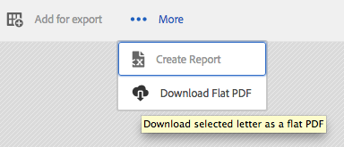
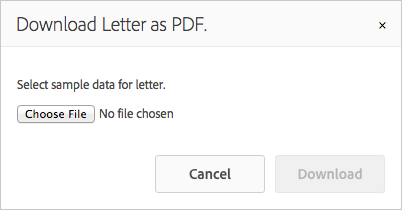

# Add custom action to the Asset Listing view{#add-custom-action-to-the-asset-listing-view}

## Overview {#overview}

The Correspondence Management solution allows you add custom actions to the Manage Assets user interface.

You can add a custom action to the Asset Listing view for:

* One or more asset types or letters
* Execution (action/command becomes active) on selection of single, multiple assets/letters, or without selection

This customization is demonstrated with the scenario that adds a command "Download Flat PDF" to the Asset Listing view for Letters. This customization scenario allows your users to download flat PDF of a single selected letter.

### Prerequisites {#prerequisites}

To complete the following scenario or a similar one, you require knowledge of:

* CRX
* JavaScript
* Java&trade;

## Scenario: Add a command to the Letters list user interface to download flat PDF version of a letter {#addcommandtoletters}

The below steps add a command "Download Flat PDF" to the Asset Listing view for Letters and allows your users to download flat PDF of the selected letter. Using these steps with the appropriate code and parameters, you can add some other functionality for a different asset, such as data dictionaries or texts.

To customize Correspondence Management to allow your users to download a flat PDF of letters, complete the following steps:

1. Go to `https://'[server]:[port]'/[ContextPath]/crx/de` and login as Administrator.

1. In the apps folder, create a folder named items with path/structure similar to the items folder located in selection folder using the following steps:

    1. Right-click the **items** folder at the following path and select **Overlay Node**:

       `/libs/fd/cm/ma/gui/content/cmassets/jcr:content/body/content/header/items/selection/items`

       >[!NOTE]
       >
       >This path is specific to creating an action that works with selection of one of more assets/letters. If you want to create an action that works without selection, create an overlay node for the following path instead and complete the remaining steps accordingly:
       >
       >
       >`/libs/fd/cm/ma/gui/content/cmassets/jcr:content/body/content/header/items/default/items`

       

    1. Ensure that the Overlay Node dialog has the following values:

       **Path:** /libs/fd/cm/ma/gui/content/cmassets/jcr:content/body/content/header/items/selection/items

       **Location:** /apps/

       **Match Node Types:** Selected

       

    1. Click **OK**. The folder structure is created in the apps folder.

       Click **Save All**.

1. Under the newly created items folder, add a node for the custom button/action in a particular asset (Example: downloadFlatPDF) using the following steps:

    1. Right-click the **items** folder and select **Create** &gt; **Create Node**.

    1. Ensure that the Create Node dialog has the following values and click **OK**:

       **Name:** downloadFlatPDF (or the name you want to give to this property)

       **Type:** nt:unstructured

    1. Click the new node that you have created (here downloadFlatPDF). CRX displays the node's properties.

    1. Add the following properties to the node (here downloadFlatPDF) and click **Save All**:

       <table>
        <tbody>
        <tr>
        <td><strong>Name</strong></td>
        <td><strong>Type</strong></td>
        <td><strong>Value and Description</strong></td>
        </tr>
        <tr>
        <td>class</td>
        <td>String</td>
        <td>foundation-collection-action</td>
        </tr>
        <tr>
        <td>foundation-collection-action</td>
        <td>String</td>
        <td><p>{"target": ".cq-manageasset-admin-childpages", "activeSelectionCount": "single","type": "LETTER"}<br /> <br /> <br /> <strong>activeSelectionCount</strong> can be single or multiple to allow selections of single or multiple assets on which the custom action is performed.</p> <p><strong>type</strong> can be one or more (comma separate multiple entries) of the following: LETTER,TEXT,LIST,CONDITION,DATADICTIONARY</p> </td>
        </tr>
        <tr>
        <td>icon</td>
        <td>String</td>
        <td>icon-download<br /> <br /> The icon that Correspondence Management displays to the left side of your command/menu. For different icons and settings available, see <a href="https://experienceleague.adobe.com/docs/experience-manager-release-information/aem-release-updates/previous-updates/aem-previous-versions.html" target="_blank">CoralUI Icons documentation</a>.<br /> </td>
        </tr>
        <tr>
        <td>jcr:primaryType</td>
        <td>Name</td>
        <td>nt:unstructured</td>
        </tr>
        <tr>
        <td>rel</td>
        <td>String</td>
        <td>download-flat-pdf-button</td>
        </tr>
        <tr>
        <td>sling:resourceType</td>
        <td>String</td>
        <td>granite/ui/components/endor/actionbar/button</td>
        </tr>
        <tr>
        <td>text</td>
        <td>String</td>
        <td>Download Flat PDF (Or any other label)<br /> <br /> The command that appears in the Asset Listing interface</td>
        </tr>
        <tr>
        <td>title</td>
        <td>String</td>
        <td>Download a flat PDF of the selected letter (Or any other label/Alt text)<br /> <br /> The title is the alt text that Correspondence Management displays when the user hovers over the custom command.</td>
        </tr>
        </tbody>
       </table>

1. In the apps folder, create a folder named js with path/structure similar to the items folder located in admin folder using the following steps:

    1. Right-click the **js** folder at the following path and select **Overlay Node**:

       `/libs/fd/cm/ma/gui/components/admin/clientlibs/admin/js`

    1. Ensure that the Overlay Node dialog has the following values:

       **Path:** /libs/fd/cm/ma/gui/components/admin/clientlibs/admin/js

       **Location:** /apps/

       **Match Node Types:** Selected

    1. Click **OK**. The folder structure is created in the apps folder. Click **Save All**.

1. In the js folder, create a file named formaction.js with the code for action handling of the button using the following steps:

    1. Right-click the **js** folder at the following path and select **Create &gt; Create File**:

       `/apps/fd/cm/ma/gui/components/admin/clientlibs/admin/js`

       Name the file as formaction.js.

    1. Double-click the file to open it in CRX.
    1. In the formaction.js file (under the /apps branch), copy the code from the formaction.js file at the following location:

       `/libs/fd/cm/ma/gui/components/admin/clientlibs/admin/js/formaction.js`

       Then append the following code at the end in the formaction.js file (under the /apps branch) and click **Save All**:

       ```javascript
       /* Action url for xml file to be added.*/
       var ACTION_URL = "/apps/fd/cm/ma/gui/content/commons/actionhandlers/items/letterpdfdownloader.html";

       /* File upload handling*/
       var fileSelectedHandler = function(e){
           if(e && e.target && e.target.value)
               $(".downloadLetterPDFBtn").removeAttr('disabled');
           else
               $(".downloadLetterPDFBtn").attr('disabled','disabled');
       }

       /*Handing of Download button in pop up.*/
       var downloadClickHandler = function(){
           $('#downloadLetterPDFDilaog').modal("hide");
           var element = $('.foundation-selections-item');
           var path = $(element).data("path");
           $("#fileUploadForm").attr('action', ACTION_URL + "?letterId="+path).submit();
       }

       /*Click handling on action button.*/
       $(document).on("click",'.download-flat-pdf-button',function(e){
           $("#uploadSamepledata").val("");
            if($('#downloadLetterPDFDilaog').length == 0){
               $(document).on("click",".downloadLetterPDFBtn",downloadClickHandler);
               $(document).on("change","#uploadSamepledata",fileSelectedHandler);
               $("body").append(downloadLetterPDFDilaog);
           }
             $('#downloadLetterPDFDilaog').modal("show");
       });

       /*Download popup.*/
       var downloadLetterPDFDilaog = '<div id="downloadLetterPDFDilaog" class="coral-Modal notice " role="dialog"  aria-hidden="true">'+
           '<form id="fileUploadForm" method="POST" enctype="multipart/form-data">'+
               '<div class="coral-Modal-header">'+
                   '<h2 class="coral-Modal-title coral-Heading coral-Heading--2" id="modal-header1443020790107-label" tabindex="0">Download Letter as PDF.</h2>'+
                   '<button type="button" class="coral-MinimalButton coral-Modal-closeButton" data-dismiss="modal">×</button>'+
               '</div>'+
               '<div class="coral-Modal-body" id="modal-header1443020790107-message" role="document" tabindex="0">'+
                   '<div class="coral-Modal-message">'+
                       '<p></p>'+
                   '</div>'+
                   '<div class="coral-Modal-uploader">'+
                       '<p>Select sample data for letter.</p>'+
                       '<input type="file" id="uploadSamepledata" name="file" accept=".xml" size="70px">'+
                   '</div>'+
               '</div>'+
            '</form>'+
               '<div class="coral-Modal-footer">'+
                   '<button type="button" class="coral-Button" data-dismiss="modal">Cancel</button>'+
                   '<button type="button" class="coral-Button coral-Button--primary downloadLetterPDFBtn" disabled="disabled">Download</button>'+
               '</div>'+
       '</div>';
       ```

       The code you add in this step overrides the code under the libs folder, so copy the previous code to formaction.js file in the /apps branch. Copying the code from the /libs branch to the /apps branch ensures that the previous functionality also works.

       The above code is for letters-specific action handling of the command created in this procedure. For action handling of other assets, modify the JavaScript code.

1. In the apps folder, create a folder named items with path/structure similar to the items folder located in actionhandlers folder using the following steps:

    1. Right-click the **items** folder at the following path and select **Overlay Node**:

       `/libs/fd/cm/ma/gui/content/commons/actionhandlers/items/`

    1. Ensure that the Overlay Node dialog has the following values:

       **Path:** /libs/fd/cm/ma/gui/content/commons/actionhandlers/items/

       **Location:** /apps/

       **Match Node Types:** Selected

    1. Click **OK**. The folder structure is created in the apps folder.

    1. Click **Save All**.

1. Under the newly created items node, add a node for the custom button/action in a particular asset (Example: letterpdfdownloader) using the following steps:

    1. Right click the items folder and select **Create &gt; Create Node**.

    1. Ensure that the Create Node dialog has the following values and click **OK**:

       **Name:** letterpdfdownloader (Or the name you want to give to this property - must be unique. If you use a different name here, also specify the same in the formaction.js file's ACTION_URL variable.)

       **Type:** nt:unstructured

    1. Click the new node you have created (here downloadFlatPDF). CRX displays the node's properties.

    1. Add the following property to the node (here letterpdfdownloader) and click **Save All**:

       | **Name** |**Type** |**Value** |
       |---|---|---|
       | sling:resourceType |String |fd/cm/ma/gui/components/admin/clientlibs/admin |

1. Create a file named POST.jsp with the code for action handling of the command at the following location:

   /apps/fd/cm/ma/gui/components/admin/clientlibs/admin

    1. Right-click the **admin** folder at the following path and select **Create &gt; Create File**:

       /apps/fd/cm/ma/gui/components/admin/clientlibs/admin

       Name the file as POST.jsp. (The filename needs to be POST.jsp only.)

    1. Double-click the **POST.jsp** file to open it in CRX.
    1. Add the following code to POST.jsp file and click **Save All**:

       This code is specific to the letter render service. For any other asset, add that asset's Java&trade; libraries to this code. For more information on AEM Forms APIs, see [AEM Forms API](https://experienceleague.adobe.com/docs/experience-manager-release-information/aem-release-updates/previous-updates/aem-previous-versions.html).

       For more information on AEM libraries, see AEM [Components](/help/sites-developing/components.md).

       ```xml
       /*Import libraries. Here we are downloading letter flat pdf with input xml data so we require letterRender Api. For any other Module functionality we need to first import that library. */
       <%@include file="/libs/foundation/global.jsp"%>
       <!DOCTYPE html lang="en" PUBLIC "-//W3C//DTD XHTML 1.1//EN" "https://www.w3.org/TR/xhtml11/DTD/xhtml11.dtd">
       <%@page import="com.adobe.icc.ddg.api.*"%>
       <%@page import="com.adobe.icc.dbforms.obj.*"%>
       <%@page import="com.adobe.icc.render.obj.*" %>
       <%@page import="com.adobe.icc.services.api.*" %>
       <%@page import="org.apache.sling.api.resource.*" %>
       <%@page import="java.io.File" %>
       <%@page import="java.util.*" %>
       <%@page import="com.adobe.livecycle.content.appcontext.AppContextManager"%>
       <%@page import=" com.adobe.icc.dbforms.exceptions.ICCException"%>
       <%@page import="java.io.InputStream" %>
       <%@page import="java.io.FileInputStream" %>
       <%@page import="org.apache.commons.io.IOUtils" %>
       <%@page session="false" contentType="text/html; charset=utf-8"%>
       <%@taglib prefix="sling" uri="https://sling.apache.org/taglibs/sling/1.0"%>
       <%@taglib prefix="cq" uri="https://www.day.com/taglibs/cq/1.0" %>
        <%@page session="false" contentType="text/html; charset=utf-8"%>
       <%
          AppContextManager.setCurrentAppContext("/content/apps/cm");
          /*Get letter id sent in js file.*/
           String letterId = request.getParameter("letterId");
           if(letterId.lastIndexOf("?") != -1)
               letterId = letterId.substring(0, letterId.indexOf("?"));
           String fileName = null;
           String letterName = null;
           InputStream inputStream = null;
           /*Get xml file data*/
           if (slingRequest.getRequestParameter("file") != null)
               inputStream = slingRequest.getRequestParameter("file").getInputStream();
           if(letterId != null){
               String xmlData = null;
               try{
                   xmlData = IOUtils.toString(inputStream, "UTF-8");
               }
               catch (Exception e) {
                   log.error("Xml data does not exists.");
               }
               /*letter Name from letter letter id.*/
               letterName = letterId.substring(letterId.lastIndexOf("/")+1);
               /*Invoking letter render services API.*/
               LetterRenderService letterRenderService = sling.getService(LetterRenderService.class);
               /*using CM renderLetter api to get pdfbytes.*/
               PDFResponseType  pdfResponseType= letterRenderService.renderLetter(letterId,xmlData,true,false,false,false);
               byte[] bytes = null;
               /*Downloading pdf bytes as pdf.*/
               if(pdfResponseType != null && pdfResponseType.getFile() != null){
                   bytes = pdfResponseType.getFile().getDocument();
                   /*set the response header to enable download*/
                   response.setContentType("application/OCTET-STREAM");
                   response.setHeader("Content-Disposition", "attachment;filename=\"" + letterName + ".pdf\"");
                   response.setHeader("Pragma", "cache");
                   response.setHeader("Cache-Control", "private");
                   out.clear();
                   response.getOutputStream().write(bytes);
               }
           }
           else{
               log.error("Letter id does not exists.");
           }
       %>
       ```

## Download flat PDF of a letter using the custom functionality {#download-flat-pdf-of-a-letter-using-the-custom-functionality}

After you have added custom functionality to download flat PDF of your letters, you can use the following steps to download flat PDF version of the letter you select:

1. Go to `https://'[server]:[port]'/[ContextPath]/projects.html` and log in.

1. Select **Forms &gt; Letters**. Correspondence Management lists the letters available in the system.
1. Click **Select** and then click a letter to select it.
1. Select **More** &gt; **&lt;Download Flat PDF&gt;** (The custom functionality created using the instructions this article). Download Letter as PDF dialog appears.

   The menu item name, functionality, and alt-text is according to the customization created in [Scenario: Add a command to the Letters list user interface to download flat PDF version of a letter.](#addcommandtoletters)

   

1. In the Download Letter as PDF dialog, select the relevant XML from which you want to populate the data in the PDF.

   >[!NOTE]
   >
   >Before downloading the letter as a flat PDF, you can create the XML file with the data in the letter using the **Create Report** option.

   

   The letter gets downloaded to your computer as a flat PDF.
