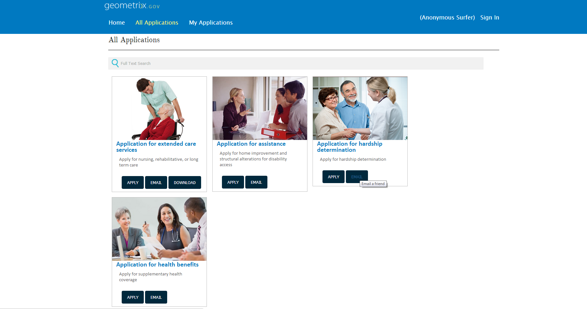

# Adding custom action on form lister items{#adding-custom-action-on-form-lister-items}

In AEM Forms, you can create a portal page listing the available forms. By default, you can search and list forms on a portal page. You can open forms for filling and submit your information. Only rendering actions are provided out of the box for forms listed on a portal page. To know more about the available actions on a portal page, see [Creating a forms portal page](../../forms/using/creating-form-portal-page.md).

You can add other options to the portal page. These options or actions can be customized by customizing the template of forms portal.

This article showcases how to create a button to send the link of a form, directly from a forms portal page. This customization requires updating the template for Search & Lister component.

The required code to add the action to the template is available below. The `onclick` attribute in the code snippet has a script to send a link of a form via email.

```html
<div class="__FP_boxes-container __FP_single-color">
    <div class="boxes __FP_boxes __FP_single-color" data-repeatable="true">
  <div class="__FP_boxes-thumbnail">
            
        </div>
        <h3 class="__FP_single-color" title="${name}" tabindex="0">${name}</h3>
        <p>${description}</p>
        <div class="boxes-icon-cont __FP_boxes-icon-cont">
            <div class="op-dow">
                <a href="${formUrl}" target="_blank" class="__FP_button ${htmlStyle}" title="${config-htmlLinkText}">Apply</a>
                <a class="__FP_button" title="Email a friend" href="#" onclick="javascript:window.location=&apos;mailto:?subject=Interesting information&body=I thought you might find {name} form helpful :  &apos;+window.location.protocol+window.location.host+&apos;${formUrl}&apos; ;">Email</a>
                <a href="${pdfUrl}" class="__FP_button ${pdfStyle}" title="${config-pdfLinkText}">Download</a>
            </div>
        </div>
    </div>
</div>
```

You can add similar actions in your custom template. To define a JavaScript function, add the function on a page-level script and link it with the requisite HTML element. In the above example, the `onclick` expression is the linked function.

After making the edits to the template, the sample portal page contains a button to send the link of the form via email, as shown below.


