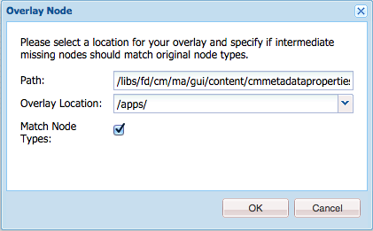
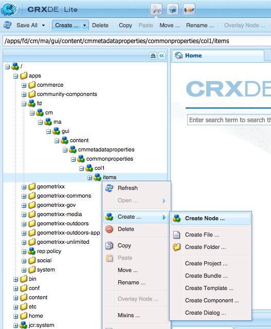
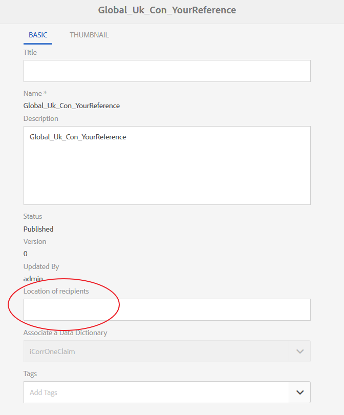
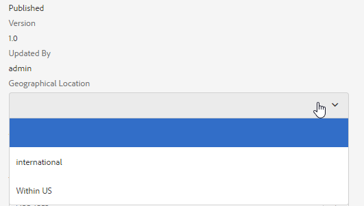
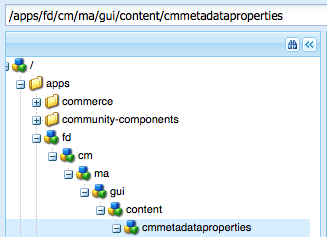
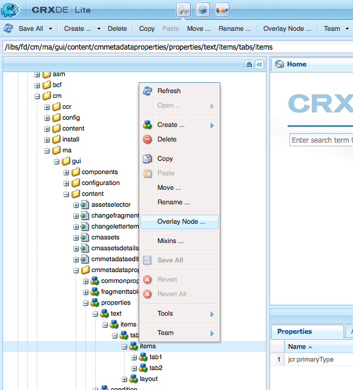
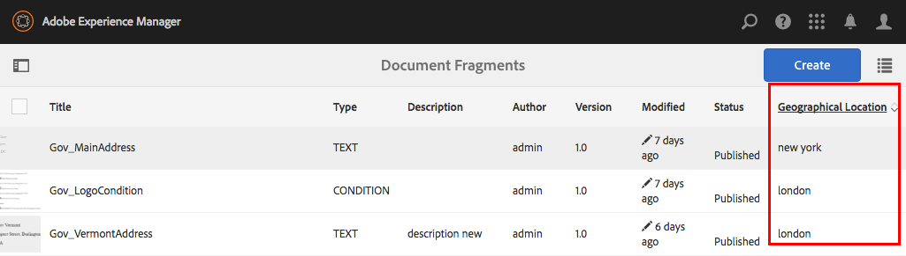

# Add custom properties to Correspondence Management assets{#add-custom-properties-to-correspondence-management-assets}

## Overview {#overview}

You can customize Correspondence Management user interface and present users with a tailored set of properties and tabs. This customization includes adding custom fields/properties and tabs to specific asset types/letters or all the asset types and letters.

## Adding custom properties to Correspondence Management assets {#adding-custom-properties-to-correspondence-management-assets}

The following scenarios show how you can add properties/tabs to Correspondence Management assets and letters:

* Adding a common property to all the asset types
* Adding a common tab to all the asset types
* Adding custom properties to specific asset types

By tweaking the properties, paths, and values in these scenarios, you can add custom properties and tabs to a different set of assets according to your requirements.

### Scenario: Adding a common field (property) to all the asset types {#scenario-adding-a-common-field-property-to-all-the-asset-types}

This scenario shows how you can add a custom property to all the asset types (text, list, condition, and layout fragments) and the letters. Using this scenario, you can add a property, Location of recipients, to all the assets and letters. The Location of recipients property helps identify which geographical area of delivery an asset or letter is relevant to.

>[!NOTE]
>
>If you have already added a custom property, the property starts appearing on the asset creation page. To hide such a property, see Show/Hide Custom Properties On Asset Creation and Properties pages.


Complete the following steps to add a custom property to all the asset types and letters:

1. Go to `https://'[server]:[port]'/[ContextPath]/crx/de` and login as Administrator.
1. In the apps folder, create a folder named css with path/structure similar to the css folder (in ccrui folder) using the following steps:

    1. Right-click the items folder at the following path and select **Overlay Node**:

       `/libs/fd/cm/ma/gui/content/cmmetadataproperties/commonproperties/col1/items`

       

    1. Ensure that the Overlay Node dialog has the following values:

       **Path:** /libs/fd/cm/ma/gui/content/cmmetadataproperties/commonproperties/col1/items

       **Location:** /apps/

       **Match Node Types:** Selected

       

    1. Click **OK**. The folder structure is created in the apps folder.

    1. Click **Save All**.

1. Under the newly created items folder, add a node for the custom property in all the asset (Example: GeoLocation) using the following steps:

    1. Right-click the items folder and select **Create** &gt; **Create Node**.

       

    1. Ensure that the Create Node dialog has the following values and click **OK**:

       **Name:** GeoLocation (or the name you want to give to this property)

       **Type:** nt:unstructured

       

    1. Click the new node you have created (here GeoLocation). CRX displays the node's properties.
    1. Add the following properties to the node (here GeoLocation):

       | **Name** |**Type** |**Value** |
       |---|---|---|
       | fieldLabel |String |The name you want to give the field/property. (Here: Location of recipients) |
       | name |String |`./extendedproperties/GeoLocation` (Keep the value same as the field name you created under the items node) |
       | renderReadOnly |Boolean |true |
       | sling:resourceType |String |`granite/ui/components/coral/foundation/form/textfield` |

    1. Click **Save All**.

1. To view your customization, hover over an asset (text, list, condition, or layout fragment) or letter, click **View Properties**, and click **Edit**. The new field (Location of recipients) appears in the Basic tab in the asset/letter properties.

   >[!NOTE]
   >
   >You may need to clear the browser cache before your customization appears in the UI.

   

   >[!NOTE]
   >
   >The common properties for all assets that you add appear in the basic tab of the asset properties. By default, the common properties added for all assets appear on the properties page and the asset creation page. To hide the common properties, you need to <!--link to show / hide properties]-->.

### Scenario: Add custom drop-down and values to a custom property/field {#scenario-add-custom-drop-down-and-values-to-a-custom-property-field}

This scenario shows how you can add a custom property to all the asset types and add drop-down values to it.

1. Right-click the items folder at the following path and select **Overlay Node**:

   `/libs/fd/cm/ma/gui/content/cmmetadataproperties/commonproperties/col1/items`

1. Under the newly created overlay node (/apps/fd/cm/ma/gui/content/cmmetadataproperties/commonproperties/col1/items)
   Create a node for each of the properties (fields) for which you need to create a drop-down (here `geographicallocation`) of the type nt:unstructured.
1. Add the following properties to the node (here geographicallocation) and click **Save All**:

   <table>
   <tbody>
   <tr>
      <td><strong>Name</strong></td>
      <td><strong>Type</strong></td>
      <td><strong>Value</strong></td>
   </tr>
   <tr>
      <td>fieldLabel</td>
      <td>String</td>
      <td>The name you want to give the field/property. (Here: geographicallocation)</td>
   </tr>
   <tr>
      <td>name</td>
      <td>String</td>
      <td>./extendedproperties/geographicallocation (Keep the value same as the field name you created under the items node)</td>
   </tr>
   <tr>
      <td>renderReadOnly</td>
      <td>Boolean</td>
      <td>true</td>
   </tr>
   <tr>
      <td>sling:resourceType</td>
      <td>String</td>
      <td>granite/ui/components/coral/foundation/form/select<br /> </td>
   </tr>
   </tbody>
   </table>

1. Under property node (here geographicallocation), add a new node with name `items`. Under the items node, add a node each for the values in the drop-down. As a good practice, add the first node as blank to serve as the default value of the drop-down and an option for the user to specify no value for the field. To add multiple options/drop-down values, repeat the following steps:

    1. Right-click the property node (here geographicallocation) and select **Create** &gt; **Create Node**.
    1. Enter name of the field as `item1,` retain type as nt:unstructured, and click **OK**.
    1. Add the following properties to the newly created node (here item1) and then click **Save All**:

       <table>
         <tbody>
         <tr>
          <td><strong>Name</strong></td>
          <td><strong>Type</strong></td>
          <td><strong>Value</strong></td>
         </tr>
         <tr>
          <td>text</td>
          <td>String</td>
          <td>This is the value of the drop-down option that is visible to the user. Keep it blank for the blank (default) value or enter the value, such as <strong>International</strong> or <strong>Within US</strong>.<br /> </td>
         </tr>
         <tr>
          <td>value</td>
          <td>String</td>
          <td>Value stored in CRXDE for the text. Enter any unique keyword. <br /> </td>
         </tr>
         </tbody>
      </table>

      

The custom drop-down appears as the following in asset properties:



### Scenario: Common tab for all asset types {#scenario-common-tab-for-all-asset-types}

This scenario shows how you can add a custom tab, Recipients, to all the asset types (text, list, condition, and layout fragments) and the letters. The Recipients tab is where you can plan to put all your custom properties relevant to the recipients.


Using the following procedure, you can add a tab with a field to all your assets:

1. Go to `https://'[server]:[port]'/[ContextPath]/crx/de` and login as Administrator.
1. In the apps folder, create a folder named cmmetadataproperties with path/structure similar to the cmmetadataproperties folder (in content folder) using the following steps:

    1. Right-click the cmmetadataproperties folder at the following path and select **Overlay Node**:

       `/libs/fd/cm/ma/gui/content/cmmetadataproperties`

       

    1. Ensure that the Overlay Node dialog has the following values:

       **Path:** /libs/fd/cm/ma/gui/content/cmmetadataproperties

       **Location:** /apps/

       **Match Node Types:** Selected

    1. Click **OK**. The folder structure is created in the apps folder.

       

       Click **Save All**.

1. Under the cmmetadataproperties folder, add a node for creating a custom tab for all the assets (Example: commontab) using the following steps:

    1. Right-click the cmmetadataproperties folder and select **Create** &gt; **Create Node**.

       

    1. Ensure that the Create Node dialog has the following values and click **OK**:

       **Name:** commontab (or the name you want to give to this property)

       **Type:** nt:unstructured

    1. Click the new node you have created (here commontab). CRX displays the node's properties.
    1. Add the following properties to the node (here commontab):

       <table>
         <tbody>
         <tr>
          <td><strong>Name</strong></td>
          <td><strong>Type</strong></td>
          <td><strong>Value</strong></td>
         </tr>
         <tr>
          <td>jcr:title</td>
          <td>String</td>
          <td>The name you want to give the column. (Here: Recipients)</td>
         </tr>
         <tr>
          <td>sling:resourceType</td>
          <td>String</td>
          <td>granite/ui/components/coral/foundation/container<br /> </td>
      </tr>
         </tbody>
       </table>

    1. Click **Save All**.

1. For the tab node created in the last step (here commontab), create a node called item using the following step:

    1. Right-click the relevant node (here commontab) and select **Create** &gt; **Create Node**.
    1. Ensure that the Create Node dialog has the following values and click **OK**:

       **Name:** items

       **Type:** nt:unstructured

    1. Click **Save All:**

1. In the items node you created in the previous step (under commontab), add a node for creating a column (here Column1) in the custom tab (commontab) using the following steps (to add more columns, repeat this step):

    1. Right-click the items node and select **Create** &gt; **Create Node**.
    1. Ensure that the Create Node dialog has the following values and click **OK**:

       **Name:** Column1 (Or the name you want to give to the node - this name does not appear in the User Interface.)

       **Type:** nt:unstructured

    1. Add the following property to the node (Here Column1) and then click **Save All**:

       <table>
         <tbody>
         <tr>
           <td><strong>Name</strong></td>
           <td><strong>Type</strong></td>
           <td><strong>Value</strong></td>
         </tr>
         <tr>
           <td>sling:resourceType</td>
           <td>String</td>
           <td>granite/ui/components/coral/foundation/container<br /> </td>
         </tr>
         </tbody>
       </table>

1. In the node you created in the previous step (here Column1), add a node called items using the following steps:

    1. Right-click the node (here Column1) and select **Create** &gt; **Create Node**.
    1. Ensure that the Create Node dialog has the following values and click **OK**:

       **Name:** items

       **Type:** nt:unstructured

    1. Click **Save All**.

1. To create a field in the custom tab (here Recipients), add a node (here GeographicalLocation). This property corresponds to the column you created. Use the following steps to create the field (to create more fields/nodes, repeat these steps.):

    1. Right-click the items node and select **Create** &gt; **Create Node**.
    1. Ensure that the Create Node dialog has the following values and click **OK**:

       **Name:** GeographicalLocation (or another name for the field property)

       **Type:** nt:unstructured

    1. Add the following properties to the field node (here GeographicalLocation) and click **Save All**.

       | **Name** |**Type** |**Value** |
       |---|---|---|
       | fieldLabel |String |Location of recipients (or the name you want to give the field.) |
       | name |String |./extendedproperties/GeographicalLocation |
       | renderReadOnly |Boolean |true |
       | sling:resourceType |String |`/libs/granite/ui/components/coral/foundation/form/textfield` |

1. To add this tab for Letters, create an overlay folder with path/structure similar to the following items folder at the following path:

   `/libs/fd/cm/ma/gui/content/cmmetadataproperties/properties/letter/items/tabs/items`

   To create overlay for a letters or a different asset use the following path by replacing [assettype] with text, condition, list, datadictionary, or fragment:

   `/libs/fd/cm/ma/gui/content/cmmetadataproperties/properties/[assettype]/items/tabs/items`

    1. Right-click the items folder at the following path and select **Overlay Node**:

       `/libs/fd/cm/ma/gui/content/cmmetadataproperties/properties/letter/items/tabs/items`

    1. Ensure that the Overlay Node dialog has the following values:

       **Path:** `/libs/fd/cm/ma/gui/content/cmmetadataproperties/properties/letter/items/tabs/items`

       **Location:** /apps/

       **Match Node Types:** Selected

    1. Click **OK**. The folder is created. Click **Save All**.

1. In the newly created items folder, add a node for the custom tab in the asset (here mytab - this name does not show up in the User Interface) using the following steps:

    1. Right-click the items folder and select **Create** &gt; **Create Node**.
    1. Ensure that the Create Node dialog has the following values and click **OK**:

       **Name:** mytab (or the name you want to give to this property)

       **Type:** nt:unstructured

    1. Click the new node you have created (here mytab). CRX displays the node's properties.
    1. Add the following two properties to the node (here customtab):

       <table>
         <tbody>
         <tr>
           <td><strong>Name</strong></td>
           <td><strong>Type</strong></td>
           <td><strong>Value</strong></td>
         </tr>
         <tr>
           <td>path<br /> </td>
           <td>String</td>
           <td>fd/cm/ma/gui/content/cmmetadataproperties/commontab<br /> </td>
         </tr>
         <tr>
           <td>sling:resourceType</td>
           <td>String</td>
           <td>granite/ui/components/coral/foundation/include<br /> </td>
         </tr>
         </tbody>
       </table>

    1. Click **Save All**.

1. To view your customization, hover over the relevant asset (here a letter), click View Properties, and click **Edit**. The new tab (Recipients) and field (Location of Recipients) appear in the user interface.

   >[!NOTE]
   >
   >You may need to clear the browser cache before your customization appears in the UI.

   

### Scenario: Adding custom properties for specific asset types {#scenario-adding-custom-properties-for-specific-asset-types}

This scenario shows how you can add a property to a particular asset type, such as a field to all the text assets. Using this process, you can add properties to one of the following:

* Text
* Condition
* List
* Layout Fragment
* Data Dictionary
* Letter

For example, only to the text assets, you want to add a property, Location of recipients, to identify which geographical area that an asset is relevant to.  

To add a property to an asset type, complete the following steps:

1. Go to `https://'[server]:[port]'/[ContextPath]/crx/de` and login as Administrator.
1. To create a tab in an asset type (such as Text), create the following folder structure in the apps folder:

   `/libs/fd/cm/ma/gui/content/cmmetadataproperties/properties/[AssetType]/items/tabs/items`

   [AssetType] = text, condition, list, letter, datadictionary, or fragment

   Following are the steps to create this folder structure:

    1. Right-click the items folder at the following path and select **Overlay Node**:

       `/libs/fd/cm/ma/gui/content/cmmetadataproperties/properties/[AssetType]/items/tabs/items`

       For example, if you want to create a property for text assets, select the following folder:

       `/libs/fd/cm/ma/gui/content/cmmetadataproperties/properties/text/items/tabs/items`

       

    1. Ensure that the Overlay Node dialog has the following values:

       **Path:** /libs/fd/cm/ma/gui/content/cmmetadataproperties/properties/[AssetType]/items/tabs/items

       **Location:** /apps/

       **Match Node Types:** Selected

    1. Click **OK**. The folder structure is created in the apps folder.

       Click **Save All**.

1. In the newly created items folder, add a node for the custom tab in the asset (Example: customtab) using the following steps:

    1. Right-click the items folder and select **Create** &gt; **Create Node**.
    1. Ensure that the Create Node dialog has the following values and click **OK**:

       **Name:** customtab (or the name you want to give to this property)

       **Type:** nt:unstructured

    1. Click the new node you have created (here customtab). CRX displays the node's properties.
    1. Add the following two properties to the node (here customtab):

       | **Name** |**Type** |**Value** |
       |---|---|---|
       | sling:resourceType |String |granite/ui/components/coral/foundation/container |
       | jcr:title |String |The name of the field on the User Interface (here My tab) |

    1. Click **Save All**.

1. In the node you created in the previous step (here customtab), add a node called items using the following steps:

    1. Right-click the node (here customtab) and select **Create** &gt; **Create Node**.
    1. Ensure that the Create Node dialog has the following values and click **OK**:

       **Name:** items

       **Type:** nt:unstructured

    1. Click **Save All**.

1. In the items node you created in the previous step (under customtab), add a node for creating a column (here Column1) in the custom tab using the following steps (to add more columns, repeat this step):

    1. Right-click the items node and select **Create** &gt; **Create Node**.
    1. Ensure that the Create Node dialog has the following values and click **OK**:

       **Name:** Column1 (or the name you want to give to the node)

       **Type:** nt:unstructured

    1. Add the following property to the node (Here Column1) and then click **Save All**.

       <table>
         <tbody>
         <tr>
           <td><strong>Name</strong></td>
           <td><strong>Type</strong></td>
           <td><strong>Value</strong></td>
         </tr>
         <tr>
           <td>sling:resourceType</td>
           <td>String</td>
           <td>granite/ui/components/coral/foundation/container<br /> </td>
         </tr>
         </tbody>
       </table>

1. For each column you create (as specified in the previous step - here Column1), create a node called item using the following steps:

    1. Right-click the relevant column node (here Column1) and select **Create** &gt; **Create Node**.
    1. Ensure that the Create Node dialog has the following values and click **OK**:

       **Name:** items

       **Type:** nt:unstructured

    1. Click **Save All:**

1. For each of the columns created, create a node under the items node for creating a field in the new tab in the User Interface. Repeat this step to create more fields in the column:

    1. Right-click the relevant node (here items under Column1) and select **Create** &gt; **Create Node**.
    1. Ensure that the Create Node dialog has the following values and click **OK**:

       **Name:** A name of your choice (here GeoLocation)

       **Type:** nt:unstructured

    1. Add the following properties to the node and then click **Save All**.

       | **Name** |**Type** |**Value** |
       |---|---|---|
       | fieldLabel |String |Location of recipients (or the name you want to give the field.) |
       | name |String |`./extendedproperties/GeoLocation` |
       | renderReadOnly |Boolean |true |
       | sling:resourceType |String |granite/ui/components/coral/foundation/form/textfield |

1. To view your customization, hover over the relevant asset (here a text), click View Properties, and click **Edit**. The new tab and field (Location of Recipients) appear in the user interface.

   >[!NOTE]
   >
   >You may need to clear the browser cache before your customization appears in the UI.

   

### Display custom properties on the Asset Creation Page {#display-custom-properties-on-the-asset-creation-page}

By default, the custom properties added to new tabs are visible only on the properties page and not on the asset creation page, as the asset creation page does not have tab layout. To display the custom properties on the asset creation page along with other properties, you need to do the following:

1. Right-click the items folder at the following path and select **Overlay Node**:

   `/libs/fd/cm/ma/gui/content/createasset/createletter/jcr:content/body/items/form/items/letterWizard/items/properties/items/properties/items/letterproperties/items`

1. Ensure that the Overlay Node dialog has the following values, for letter. For other asset types, path is given in the following table:

   **Path:** /libs/fd/cm/ma/gui/content/createasset/createletter/jcr:content/body/items/form/items/letterWizard/items/properties/items/properties/items/letterproperties/items

   **Location:** /apps/

   **Match Node Types:** Selected

   Depending on the type of asset, following needs to be the path:

   | **Asset/document type** |**Path to be added** |
   |---|---|
   | Text |/libs/fd/cm/ma/gui/content/createasset/createtext/jcr:content/body/items/form/items/textwizard/items/editproperties/items/properties/items/tabs/items/tab1/items |
   | List |/libs/fd/cm/ma/gui/content/createasset/createlist/jcr:content/body/items/form/items/listwizard/items/editproperties/items/properties/items/tabs/items/tab1/items |
   | Condition |/libs/fd/cm/ma/gui/content/createasset/createcondition/jcr:content/body/items/form/items/conditionwizard/items/editproperties/items/properties/items/tabs/items/tab1/items |
   | Fragment |/libs/fd/cm/ma/gui/content/createasset/createfragment/jcr:content/body/items/form/items/fragmentwizard/items/properties/items/properties/items/tabs2/items/tab1/items |
   | Letter |/libs/fd/cm/ma/gui/content/createasset/createletter/jcr:content/body/items/form/items/letterWizard/items/properties/items/properties/items/letterproperties/items |

1. Click **OK**. The folder structure is created in the apps folder.

1. Under the overlay items node you created, create a node of the name col4 (or any other name) and click **Save All**.

   For example, following is the overlay node created for letters.

   `/apps/fd/cm/ma/gui/content/createasset/createletter/jcr:content/body/items/form/items/letterWizard/items/properties/items/properties/items/letterproperties/items`

1. Add the following properties to the newly created node (here col4) and click **Save All**:

<table>
 <tbody>
  <tr>
   <td><strong>Name</strong></td>
   <td><strong>Type</strong></td>
   <td><strong>Value</strong></td>
  </tr>
  <tr>
   <td>path</td>
   <td>String</td>
   <td><p>This path is the pointer to the column created in:</p>
    <ul>
     <li>For common tab for all asset types: /apps/fd/cm/ma/gui/content/cmmetadataproperties/commontab/items/col1</li>
     <li>For different properties for different asset types: /apps/fd/cm/ma/gui/content/cmmetadataproperties/properties//items/tabs/items/customtab/items/col1</li>
    </ul> </td>
  </tr>
  <tr>
   <td>sling:resourceType</td>
   <td>String</td>
   <td> granite/ui/components/coral/foundation/include<br /> </td>
  </tr>
 </tbody>
</table>

   

   Custom property, Language, appearing in the UI for creating a letter

## Customize the list view to show custom properties {#customize-the-list-view-to-show-custom-properties}

After you have added a custom property to Correspondence Management assets, you need to make further changes in CRX/DE to ensure that the custom property is displayed in the Correspondence Management UI.

Complete the following steps to display the custom property in the Correspondence Management's asset list UI:

1. Go to `https://'[server]:[port]'/[ContextPath]/crx/de` and login as Administrator.
1. Create the following folder structure in the apps folder:

   `/libs/fd/cm/ma/gui/content/cmassets/jcr:content/views/lists/columns`

   Following are the steps to create this folder structure:

    1. Right-click the columns folder at the following path and select **Overlay Node**:

       `/libs/fd/cm/ma/gui/content/cmassets/jcr:content/views/lists/columns`

    1. Ensure that the Overlay Node dialog has the following values:

       **Path:** /libs/fd/cm/ma/gui/content/cmassets/jcr:content/views/lists/columns

       **Location:** /apps/

       **Match Node Types:** Selected

    1. Click **OK**. The folder structure is created in the apps folder.

       Click **Save All**.

1. For each of the properties created, create a node under the columns node for creating a column in the User Interface. Repeat this step to create more columns in the UI:

    1. Right-click the relevant node (columns) and select **Create** &gt; **Create Node**.
    1. Ensure that the Create Node dialog has the following values and click **OK**:

       **Name:** A name of your choice (here GeographicalLocation)

       **Type:** nt:unstructured

    1. Add the following properties to the node and then click **Save All**.

       <table>
         <tbody>
         <tr>
           <td><strong>Name</strong></td>
           <td><strong>Type</strong></td>
           <td><strong>Value</strong></td>
         </tr>
         <tr>
           <td>jcr:primaryType</td>
           <td>Name</td>
           <td><p>nt:unstructured</p> </td>
         </tr>
         <tr>
           <td>jcr:title</td>
           <td>String</td>
           <td><p>GeographicalLocation</p> <p>This value appears as the column header in the UI. </p> </td>
         </tr>
         <tr>
           <td>sortable</td>
           <td>Boolean</td>
           <td><p>true</p> <p>A value of true signifies that the user can sort the values in this column. </p> </td>
         </tr>
         </tbody>
       </table>

1. Create the following folder structure in the apps folder:

   `/libs/fd/cm/ma/gui/components/admin/childpagerenderer/childlistpage`

   Following are the steps to create this folder structure:

    1. Right-click the columns folder at the following path and select **Overlay Node**:

       `/libs/fd/cm/ma/gui/components/admin/childpagerenderer/childlistpage`

    1. Ensure that the Overlay Node dialog has the following values:

       **Path:** /libs/fd/cm/ma/gui/components/admin/childpagerenderer/childlistpage

       **Location:** /apps/

       **Match Node Types:** Selected

    1. Click **OK**. The folder structure is created in the apps folder.

       Click **Save All**.

1. Copy the childlistpage.jsp file from the following location:

   /libs/fd/cm/ma/gui/components/admin/childpagerenderer/childlistpage/childlistpage.jsp

   Paste the file in the following location:

   /apps//fd/cm/ma/gui/components/admin/childpagerenderer/childlistpage/.

1. Open the childlistpage.jsp file (/apps/fd/cm/ma/gui/components/admin/childpagerenderer/childlistpage/childlistpage.jsp) and make the following changes:

    1. Add the following to line 19 of the file (following the copyright statement).

       ```jsp
       <%@page import="java.util.Map"%>
       ```

    1. Add the following code of a function that gets value for each custom property to the end of the file:

       ```jsp
       <%!
           private String getCustomPropertyValue(Map<String, Object> extendedProperties, String propertyName) {

               String propertyValue = "";
               if (extendedProperties.containsKey(propertyName)) {
                   propertyValue = (String) extendedProperties.get(propertyName);
               }

               return propertyValue;
           }
       %>
       ```

    1. Add the following before the starting of the &lt;tr&gt; tag (&lt;tr &lt;%= attrs.build() %&gt;&gt;):

       ```jsp
       <%
           String GeoLocation = "";
           if (asset != null) {
                   Map<String, Object> extendedProperties = asset.getExtendedProperties();
                   if (extendedProperties != null) {
                       GeoLocation = getCustomPropertyValue(extendedProperties,"GeoLocation");
                   }
           }
       %>
       ```

       In the code, GeoLocation is the value that you set in the name property while creating the custom node/field. While creating a custom node/field, you specified the name of property with ./extendedproperties/ prefix: ./extendedproperties/GeoLocation. In the code, the prefix is not required.

    1. For displaying the new property in the UI, add a TD tag as following before the closing tr (&lt;/tr&gt;) tag:

       ```jsp
       <td is="coral-td" value="<%= xssAPI.encodeForHTMLAttr(geographicalLocation) %>"><%= xssAPI.encodeForHTML(geographicalLocation) %></td>
       ```

       To add more columns, repeat steps 6.3 and 6.4.

    1. Click **Save All**.

1. To view your customization, open list view of document fragments, or letters in which you have added the custom property.

   The UI column and property added in this procedure is displayed for all asset types. However, the values in these properties can be entered and displayed only for the asset types for which you originally added the custom property.

   For example, using the Scenario: Adding custom properties for specific asset types you add a custom property to text assets, you can enter custom properties to text assets only. If, however, you display that custom property in the UI, the column appears for all asset types.

   

1. (Optional) By default the new column appears as the last column in the UI. To make the column appear at a specific position, add the following property to the column node:

<table>
 <tbody>
  <tr>
   <td><strong>Name</strong></td>
   <td><strong>Type</strong></td>
   <td><strong>Value</strong></td>
  </tr>
  <tr>
   <td>sling:orderBefore</td>
   <td>String</td>
   <td><p>The name of the column node at path "/libs/fd/cm/ma/gui/content/cmassets/jcr:content/views/list/columns" before which custom column needs to appear on UI.</p> <p>Here, if you want Geographical Location column to appear before (to the left of) the Version column, add the property sling:orderBefore to GeoLocation node at path ""/apps/fd/cm/ma/gui/content/cmassets/jcr:content/views/list/columns/GeoLocation" and set the value of property to version.</p> </td>
  </tr>
 </tbody>
</table>

When you add the sling:orderBefore property to specify the column location, then you also need to update the order of the corresponding &lt;td&gt; tag specified in step 6.4 of this procedure. For example, in this case, you need to ensure that the &lt;td&gt; tag of Geographical Location is placed before &lt;td&gt; tag of Version column:

```xml
<td is="coral-td" value="<%= xssAPI.encodeForHTMLAttr(geographicalLocation) %>"><%= xssAPI.encodeForHTML(geographicalLocation) %></td>
<td is="coral-td" value="<%= xssAPI.encodeForHTMLAttr(version) %>"><%= xssAPI.encodeForHTML(version) %></td>
```

## Enable search for custom properties {#enable-search-for-custom-properties}

By default, full text search does not include custom properties that you add to the UI using CRX/DE.

To include the custom properties in search, you need to allow indexing of custom properties.

To allow indexing of custom properties, complete the following steps:

1. Go to `https://'[server]:[port]'/[ContextPath]/crx/de` and login as Administrator.
1. Go to `/oak:index/cmLucene`and add a node named **aggregates** under it.

    1. Right-click the cmLucene folder and select **Create** &gt; **Create Node**.
    1. Ensure that the Create Node dialog has the following values and click **OK**:

       **Name:** aggregates

       **Type:** nt:unstructured

    1. Click **Save All**.

1. Under the newly created aggregates folder, add a node cm:resource. And under cm:resource, add a node named include0.

    1. Right-click the aggregates folder and select **Create** &gt; **Create Node**. Ensure that the Create Node dialog has the following values and click **OK**:

       **Name:** cm:resource

       **Type:** nt:unstructured

    1. Right-click the cm:resource folder and select **Create** &gt; **Create Node**. Ensure that the Create Node dialog has the following values and click **OK**:

       **Name:** include0

       **Type:** nt:unstructured

    1. Click the new node you have created (here include0). CRX displays the node's properties.
    1. Add the following property to the node (here include0):

       <table>
         <tbody>
         <tr>
           <td><strong>Name</strong></td>
           <td><strong>Type</strong></td>
           <td><strong>Value</strong></td>
         </tr>
         <tr>
           <td>path</td>
           <td>String</td>
           <td>extendedProperties<br /> </td>
         </tr>
         </tbody>
       </table>

    1. Click **Save All**.

1. Go to properties at the following location and add a node location under it: `/oak:index/cmLucene/indexRules/cm:resource/properties`

   Repeat this step for each of the custom properties you want to add to the search.

    1. Right-click the properties folder and select **Create** &gt; **Create Node**.
    1. Ensure that the Create Node dialog has the following values and click **OK**:

       **Name:** location (or the name of the custom property you want to add to search)

       **Type:** nt:unstructured

    1. Click the new node you have created (here location). CRX displays the node's properties.
    1. Add the following properties to the node (here location):

       | **Name** | **Type** |**Value** |
       |---|---|---|
       | analyzed |String |true |
       | name |String |extendedProperties/location (or the name of the property you want to add to search) |
       | propertyIndex |Boolean |true |
       | useInSuggest |Boolean |true |

    1. Click **Save All**.

1. Now you can use custom property values in full text search to locate relevant assets.

>[!NOTE]
>
>If you are still unable to search, it may be because of an indexing issue. For re-indexing, go to the following node and change value of property "re-index" to true:
>
>/oak:index/cmLucene" and change value of property

## Change default view of the search page {#change-default-view-of-the-search-page}

1. Go to `https://'[server]:[port]'/[ContextPath]/crx/de` and login as Administrator.
1. In the apps folder, create a folder named list with path/structure similar to the list folder in /libs/granite/ui/content/shell/omnisearch/searchresults/singleresults/views:

    1. Right-click the items folder at the following path and select **Overlay Node**:

       `/libs/granite/ui/content/shell/omnisearch/searchresults/singleresults/views/list`

    1. Ensure that the Overlay Node dialog has the following values:

       **Path:** /libs/granite/ui/content/shell/omnisearch/searchresults/singleresults/views/list

       **Location:** /apps/

       **Match Node Types:** Selected

    1. Click **OK**. The folder structure is created in the apps folder.

    1. Click **Save All**.

1. In the newly created node, list, add the following property and click **Save All**:

   <table>
   <tbody>
   <tr>
      <td><strong>Name</strong></td>
      <td><strong>Type</strong></td>
      <td><strong>Value</strong></td>
   </tr>
   <tr>
      <td>sling:orderBefore<br /> </td>
      <td>String</td>
      <td>card</td>
   </tr>
   </tbody>
   </table>

1. The customization shows search results in List view for all consoles, including Forms and Documents, Assets, and Sites.

## Change default view of the assets page {#change-default-view-of-the-assets-page}

>[!NOTE]
>
>These steps change the default view of all consoles such as Forms and Documents, Assets, and Sites.

1. Go to `https://'[server]:[port]'/[ContextPath]/crx/de` and login as Administrator.
1. In the apps folder, create a folder named list with path/structure similar to the list folder in:

   /libs/fd/cm/ma/gui/content/cmassets/jcr:content/views/

    1. Right-click the items folder at the following path and select **Overlay Node**:

       `/libs/fd/cm/ma/gui/content/cmassets/jcr:content/views/list`

    1. Ensure that the Overlay Node dialog has the following values:

       **Path:** /libs/fd/cm/ma/gui/content/cmassets/jcr:content/views/list

       **Location:** /apps/

       **Match Node Types:** Selected

    1. Click **OK**. The folder structure is created in the apps folder.

    1. Click **Save All**.

1. In the newly created node, list, add the following property and click **Save All**:

   <table>
   <tbody>
   <tr>
      <td><strong>Name</strong></td>
      <td><strong>Type</strong></td>
      <td><strong>Value</strong></td>
   </tr>
   <tr>
      <td>sling:orderBefore<br /> </td>
      <td>String</td>
      <td>card</td>
   </tr>
   </tbody>
   </table>

1. Clear the browser cookies or use the incognito mode of your browser to view the assets. The assets page, by default, appears in the card layout.

## Show/hide custom properties on Asset Creation and Properties pages {#show-hide-custom-properties-on-asset-creation-and-properties-pages}

To show or hide the custom properties, complete the following steps:

1. Under the custom property node, such as geographicallocation, create a node with name "granite:rendercondition" of type "nt:unstructured."
1. Add the following property to the node and click **Save All**:

   <table>
   <tbody>
   <tr>
      <td><strong>Name</strong></td>
      <td><strong>Type</strong></td>
      <td><strong>Value</strong></td>
   </tr>
   <tr>
      <td>sling:resourceType<br /> </td>
      <td>String</td>
      <td>fd/cm/ma/gui/components/admin/assetsproperties/custompropertyconfig<br /> </td>
   </tr>
   </tbody>
   </table>

1. To hide this property on the asset creation page, add the following property to it and click **Save All**:

   <table>
   <tbody>
   <tr>
      <td><strong>Name</strong></td>
      <td><strong>Type</strong></td>
      <td><strong>Value</strong></td>
   </tr>
   <tr>
      <td>hideOnCreate<br /> </td>
      <td>Boolean</td>
      <td>true<br /> </td>
   </tr>
   </tbody>
   </table>

1. To hide the custom property on the properties page of the assets, add the following property to it and click **Save All**:

   <table>
   <tbody>
   <tr>
      <td><strong>Name</strong></td>
      <td><strong>Type</strong></td>
      <td><strong>Value</strong></td>
   </tr>
   <tr>
      <td>hideOnEdit<br /> </td>
      <td>Boolean</td>
      <td>true<br /> </td>
   </tr>
   </tbody>
   </table>

   To display the values again, either reset the property values to `false` or delete the property entries.
