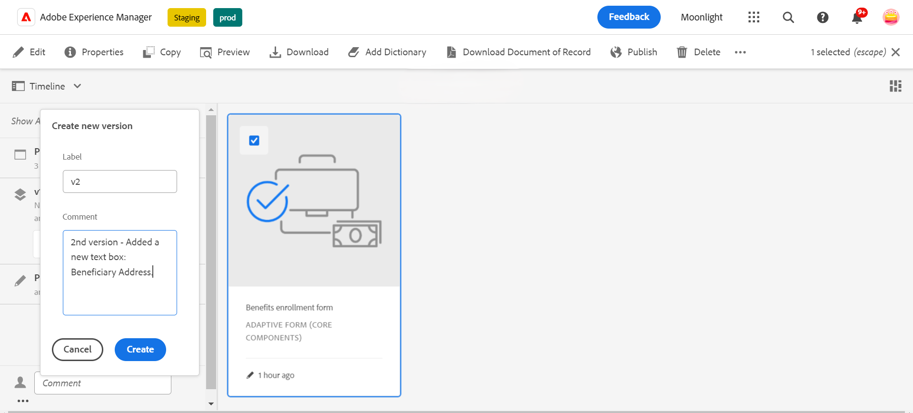
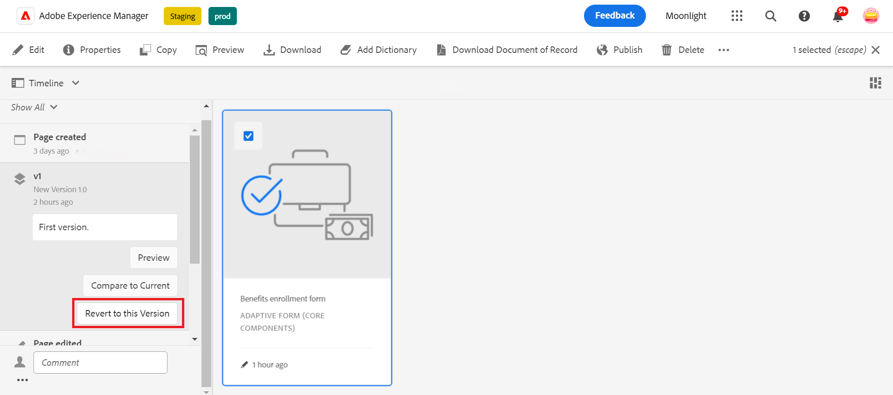
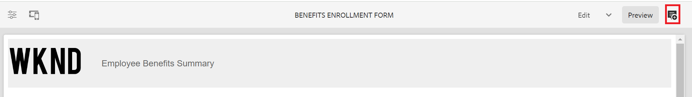

# Versioning, reviewing and commenting on an Adaptive Form

<!--
 This feature is under the early adopter program. If you're interested in joining our early access program for this feature, send an email from your official address to aem-forms-ea@adobe.com to request access 
-->

This feature is not enabled by default. You can write from your official address to aem-forms-ea@adobe.com to request access to the feature.

Adaptive Form Core Components allow form authors to add versioning, comments, and annotations to forms. These features simplify form development by enabling users to create and manage multiple versions, collaborate through comments, and add notes to specific form sections, enhancing the form-building experience.

See this step by step video for versioning, commenting, and annotation features in an Adaptive Form.

>[!VIDEO](https://video.tv.adobe.com/v/3463265)

## Prerequisite {#prerequisite-versioning}

To use versioning, commenting, and annotation features in an Adaptive Form, ensure that the [Adaptive Form Core Components](
https://experienceleague.adobe.com/en/docs/experience-manager-65/content/forms/adaptive-forms-core-components/enable-adaptive-forms-core-components) is enabled on your AEM 6.5 Forms environment.

## Adaptive Form versioning {#adaptive-form-versioning}

Adaptive form versioning helps add versions to a form. Form authors can easily create multiple versions of a form and finally use the one that is suitable for the business objectives. In addition, form users can also revert the form to the previous versions. It also facilitates authors to compare any two versions of a form by previewing them, allowing them to analyze forms better from UI perspectives. Let's go in detail for each adaptive form versioning functionality:

### Create a form version {#create-a-form-version}

To create a version of a form, follow the steps given below:

1. On your AEM Forms environment, navigate to the **[!UICONTROL Form]**>>**[!UICONTROL Forms & Documents]** and select your **Form**.
1. From the selection dropdown on the left panel, select **[!UICONTROL Versions]**.
        
1. Click the **three dots** located on the lower panel on the left, click **[!UICONTROL Save as Version]**.
1. Provide a label to the form version, you can also add information about the form through a comment.
     

### Update a form version {#update-a-form-version}

Once you edit and update your form, you add a new version to the form. Follow the steps given in the last section to name a new version of the form as shown in the image:

### Revert a form version {#revert-a-form-version}

To revert a form version to the previous, select a form version, click **[!UICONTROL Revert to this Version]**.

### Compare form versions {#compare-form-versions}

Form authors can compare two different versions of a form for previewing purposes. To compare versions, select any form version and click **[!UICONTROL Compare to Current]**. It shows two different form versions in preview mode.

## Add Comments {#add-comments}

A review is a mechanism that allows one or more reviewers to comment on forms. Any form user can comment on a form or review a form through comments. To comment on a form, select a **[!UICONTROL Form]**, and add a **[!UICONTROL Comment]** to the form.

>[!NOTE]
>
>When you use comments in adaptive form core components as discussed above, the form functionality, [adding reviewers to forms](/help/forms/using/create-reviews-forms.md) is disabled.

## Add Annotations {#adaptive-form-annotations}

In many cases, form group users are required to add annotations to a form for review purposes such as on a specific tab or components of a form. In such cases, authors can use annotations. 
To add annotations to a form, perform the following steps:

1. Open a form in the **[!UICONTROL Edit]** mode.

1. Click the **add icon** located on the upper right rail as given in the image.
        

1. Now, click the **add icon** located on the upper left rail as given in the image to add the annotation.
        

1. Now, you can add comments, draw sketches with multiple colors to form components.

1. To see all your added annotations to a form, select your form, and you see that the annotations added on the left panel, as shown in the image.

   

## See also

* [Compare Adaptive Forms Core Components](/help/forms/using/compare-forms-core-components.md)
