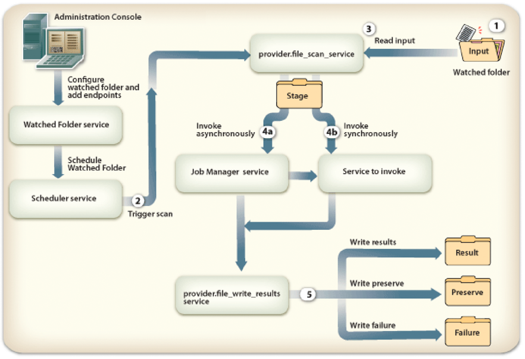
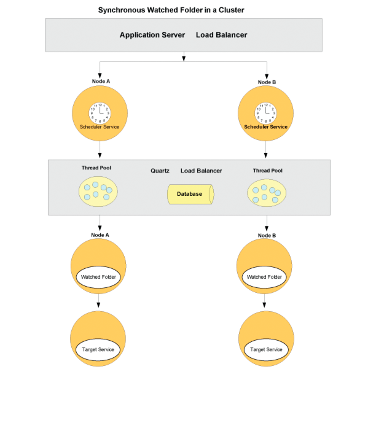

# Configuring watched folder endpoints {#configuring-watched-folder-endpoints}

An administrator can configure a network folder, known as a *watched folder*, so that when a user places a file (such as a PDF file) in the watched folder, a configured service operation is invoked and manipulates the file. After the service performs the specified operation, it saves the modified file in a specified output folder.

## Configuring the Watched Folder service {#configuring-the-watched-folder-service}

Before you configure a watched folder endpoint, configure the Watched Folder service. The Watched Folder service's configuration parameters have two purposes:

* To configure attributes that are common for all watched folder endpoints
* To provide default values for all the watched folder endpoints

After configuring the Watched Folder service, you add a Watched Folder endpoint for the target service. When adding the endpoint, you set values, such as the service name and operation name to invoke when files or folders are placed in the input folder of the configured Watched Folder service. For details on configuring the Watched Folder service, see [Watched Folder service settings](/help/forms/using/admin-help/configure-service-settings.md#watched-folder-service-settings).

## Creating a watched folder {#creating-a-watched-folder}

You can create a watched folder in the following two ways:

* When configuring the settings for a watched folder endpoint, type the full path to the parent directory in the Path box and append the name of the watched folder to be created, as shown in this example:
  `  C:\MyPDFs\MyWatchedFolder`Because the MyWatchedFolder folder does not already exist, AEM forms attempts to create it at that location.

* Create a folder on the file system prior to configuring a watched folder endpoint, and then type the full path in the Path box.

In a clustered environment, the folder that is used as a watched folder must be accessible, writable, and shared on the file system or network. In this scenario, each application server instance of the cluster must have access to the same shared folder.

In Windows, if the application server is running as a service, it must be started with appropriate access to the shared folder in one of the following ways:

* Configure the application server service Log On As **parameter** to start as a specific user with appropriate access to the shared watched folder.
* Configure the application server service Start as Local System option to Allow Service to Interact with the desktop. This option requires that the shared watched folder is accessible and writable to everyone.

## Chaining together watched folders {#chaining-together-watched-folders}

Watched folders can be chained together so that a result document of one watched folder is the input document of the next watched folder. Each watched folder can invoke a different service. By configuring watched folders in this manner, multiple services can be invoked. For example, one watched folder could convert PDF files to Adobe PostScript&reg; and a second watched folder could convert the PostScript files to PDF/A format. To do this, simply set the *result* folder of the watched folder defined by your first endpoint to point to the *input* folder of the watched folder defined by your second endpoint.

Output from the first conversion would go to \path\result. Input for the second conversion would be \path\result, and output from the second conversion would go to \path\result\result (or the directory you define in the Result Folder box for the second conversion).

## How users interact with watched folders {#how-users-interact-with-watched-folders}

For a watched folder endpoint, users can invoke by copying or dragging input files or folders from their desktops to a watched folder. The files will be processed in the order in which they arrive.

For watched folder endpoints, if the job requires only one input file, the user can copy that file to the root of the watched folder.

If the job contains more than one input file, the user must create a folder outside the watched folder hierarchy that contains all required files. This new folder should include the input files (and optionally a DDX file if necessary by the process). After the job folder has been constructed, the user copies it into the watched folder's input folder.

>[!NOTE]
>
>Ensure that the application server has deleted access to the files in the watched folder. If AEM forms cannot delete the files from the input folder after they are scanned, the associated process will be invoked indefinitely.

## Watched folder output {#watched-folder-output}

When the input is a folder and the output consists of multiple files, AEM forms creates an output folder with the same name as the input folder and copies the output files into that folder. When the output consists of a document map containing a key-value pair, such as the output from an Output process, the key is used as the output file name.

The output file names that result from an endpoint process cannot contain characters other than letters, numbers, and a period (.) before the file extension. AEM forms converts other characters to their hexadecimal values.

Client applications pick up the result documents from the watched folder result folder. Process errors are logged in the watched folder failure folder.

## How Watched Folder works {#how-watched-folder-works}

The Watched Folder module contains these services:

* Watched Folder service
* provider.file_scan_service
* provider.file_write_results_service

In addition to the services listed above, Watched Folder also depends on other services, including the Scheduler service for scheduling the jobs and the Job Manager service to support asynchronous invocation of target services.

### How Watched Folder processes an invocation request {#how-watched-folder-processes-an-invocation-request}

The Watched Folder service handles the creation, update, and deletion of the endpoints. After the administrator creates the endpoints, they are scheduled to be triggered by the Scheduler service based on the specified repeat interval or cron expression.

This diagram illustrates how Watched Folder processes an invocation request.

The process of invoking a service using watched folders is as follows:

1. A client application places files or folders in the watched folder input folder.
1. When the job scan interval occurs, the Scheduler service invokes the provider.file_scan_service to process the files or folders in the input folder.
1. The provider.file_scan_service performs these tasks:

    * Scans the input folder for files or folders that match the include file pattern and excludes files or folders for the specified exclude file pattern. The oldest files or folders are picked up first. Files and folders that are older than the wait time are also picked up. In one scan, the number of files or folders that are processed are based on the batch size. For information about file patterns, see [About file patterns](configuring-watched-folder-endpoints.md#about-file-patterns). For information about setting the batch size, see [Watched Folder service settings](/help/forms/using/admin-help/configure-service-settings.md#watched-folder-service-settings).
    * Picks up the files or folders for processing. If the files or folders are not completely downloaded, they are picked up in the next scan. To make sure that folders are completely downloaded, administrators should create a folder with a name by using the exclude file pattern. After the folder has all the files, it must be renamed to the pattern specified in the include file pattern. This step ensures that the folder has all the necessary files needed for invoking the service. For more information about ensuring that folders are completely downloaded, see [Tips and tricks for watched folders](configuring-watched-folder-endpoints.md#tips-and-tricks-for-watched-folders). 
    * Moves the files or folders to the stage folder after selecting them for processing.
    * Converts the files or folders in the stage folder to the appropriate input based on the endpoint input parameter mappings. For examples of input parameter mappings, see [Tips and tricks for watched folders](configuring-watched-folder-endpoints.md#tips-and-tricks-for-watched-folders).

1. The target service configured for the endpoint is invoked either synchronously or asynchronously. The target service is invoked using the user name and password configured for the endpoint.

    * Synchronous invocation calls the target service directly and immediately handles the response. 
    * For asynchronous invocation, the target service is called through the Job Manager service, which places the request in a queue. The Job Manager Service, in turn, calls the provider.file_write_results_service to handle the results.

1. The provider.file_write_results_service handles the response or failure of the target service invocation. When successful, the output is saved to the result folder based on the endpoint configuration. The provider.file_write_results_service also preserves the source if the endpoint is configured to preserve the results upon successful completion.

   When the invocation of the target service results in a failure, the provider.file_write_results_service logs the reason for the failure in a failure.log file and places that file in the failure folder. The failure folder is created based on the configuration parameters specified for the endpoint. When the administrator sets the Preserve On Failure option for the endpoint configuration, the provider.file_write_results_service also copies the source files into the failure folder. For information about recovering files from the failure folder, see [Failure points and recovery](configuring-watched-folder-endpoints.md#failure-points-and-recovery).

## Watched folder endpoint settings {#watched-folder-endpoint-settings}

Use the following settings to configure a watched folder endpoint.

**Name:** (Mandatory) Identifies the endpoint. Do not include a < character because it will truncate the name displayed in Workspace. If you're entering a URL as the name of the endpoint, ensure that it conforms with the syntax rules specified in RFC1738.

**Description:** A description of the endpoint. Do not include a < character because it will truncate the description displayed in Workspace.

**Path:** (Mandatory) Specifies the watched folder location. In a clustered environment, this setting must point to a shared network folder that is accessible from every computer in the cluster.

**Asynchronous:** Identifies the invocation type as asynchronous or synchronous. The default value is asynchronous. Asynchronous is recommended for long-lived processes, while synchronous is recommended for transient or short-lived processes.

**Cron Expression:** Enter a cron expression if the watched folder must be scheduled by using a cron expression. When this setting is configured, Repeat Interval is ignored.

**Repeat Interval:** The interval in seconds for scanning the watched folder for input. Unless the Throttle setting is enabled, Repeat Interval should be longer than the time to process an average job; otherwise, the system may become overloaded. The default value is 5. See the description for Batch Size for additional information.

**Repeat Count:** Number of times the watched folder scans the folder or directory. A value of -1 indicates indefinite scanning. The default value is -1.

**Throttle:** When this option is selected, it limits the number of watched folder jobs that AEM forms processes at any given time. The maximum number of jobs is determined by the Batch Size value. (See About throttling.)

**User Name:** (Mandatory) The user name that is used when invoking a target service from the watched folder. The default value is SuperAdmin.

**Domain Name:** (Mandatory) The user's domain. The default value is DefaultDom.

**Batch Size:** The number of files or folders to be picked up per scan. Use to prevent an overload on the system; scanning too many files at one time can cause a crash. The default value is 2.

The Repeat Interval and Batch Size settings determine how many files Watched Folder picks up in every scan. Watched Folder uses a Quartz thread pool to scan the input folder. The thread pool is shared with other services. If the scan interval is small, the threads will scan the input folder often. If files are dropped frequently into the watched folder, then you should keep the scan interval small. If files are dropped infrequently, use a larger scan interval so that the other services can use the threads.

If there is a large volume of files being dropped, make the batch size large. For example, if the service invoked by the watched folder endpoint can process 700 files per minute, and users drop files into the input folder at the same rate, then setting the Batch Size to 350 and the Repeat Interval to 30 seconds will help Watched Folder performance without incurring the cost of scanning the watched folder too often.

When files are dropped into the watched folder, it lists the files in the input, which can reduce performance if scanning is happening every second. Increasing the scan interval can improve performance. If the volume of files being dropped is small, adjust the Batch Size and Repeat Interval accordingly. For example, if 10 files are dropped every second, try setting the Repeat Interval to 1 second and the Batch Size to 10.

**Wait Time:** The time, in milliseconds, to wait before you scan a folder or file after it is created. For example, if the wait time is 3,600,000 milliseconds (one hour) and the file was created one minute ago, this file will be picked up after 59 or more minutes have passed. The default value is 0.

This setting is useful to ensure that a file or folder is completely copied to the input folder. For example, if you have a large file to process and the file takes ten minutes to download, set the wait time to 10&ast;60 &ast;1000 milliseconds. This prevents the watched folder from scanning the file if it is not ten minutes old.

**Exclude File Pattern:** A semi-colon **;** delimited list of patterns that a watched folder uses to determine which files and folders to scan and pick up. Any file or folder with this pattern will not be scanned for processing.

This setting is useful when the input is a folder with multiple files. The contents of the folder can be copied into a folder with a name that will be picked up by the watched folder. This prevents the watched folder from picking up a folder for processing before the folder is completely copied into the input folder.

You can use file patterns to exclude:

* Files with specific filename extensions; for example, &ast;.dat, &ast;.xml, &ast;.pdf.
* Files with specific names; for example, data.&ast; would exclude files and folders named *data1*, *data2*, and so on.
* Files with composite expressions in the name and extension, as in these examples:

    * Data[0-9][0-9][0-9].[dD][aA]'port'
    * &ast;.[dD][Aa]'port'
    * &ast;.[Xx][Mm][Ll]

For more information about file patterns, see [About file patterns](configuring-watched-folder-endpoints.md#about-file-patterns).

**Include File Pattern:** (Mandatory) A semi-colon **;** delimited list of patterns that the watched folder uses to determine which folders and files to scan and pick up. For example, if the Include File Pattern is input&ast;, all files and folders that match input&ast; are picked up. This includes files and folders named input1, input2, and so on.

The default value is &ast; and indicates all files and folders.

You can use file patterns to include:

* Files with specific filename extensions; for example, &ast;.dat, &ast;.xml, &ast;.pdf.
* Files with specific names; for example, data.&ast; would include files and folders named *data1*, *data2*, and so on.
* Files with composite expressions in the name and extension, as in these examples:

    * Data[0-9][0-9][0-9].[dD][aA]'port'
    * &ast;.[dD][Aa]'port'
    * &ast;.[Xx][Mm][Ll]

For more information about file patterns, see [About file patterns](configuring-watched-folder-endpoints.md#about-file-patterns).

**Result Folder:** The folder where the saved results are stored. If the results do not appear in this folder, check the failure folder. Read-only files are not processed and will be saved in the failure folder. This value can be an absolute or relative path with the following file patterns:

* %F = filename prefix 
* %E = filename extension
* %Y = year (full) 
* %y = year (last two digits) 
* %M = month
* %D = day of month 
* %d = day of year 
* %H = hour (24-hour clock) 
* %h = hour (12-hour clock) 
* %m = minute 
* %s = second 
* %l = millisecond 
* %R = random number (between 0&ndash;9) 
* %P = process or job id

For example, if it is 8 PM on July 17, 2009 and you specify `C:/Test/WF0/failure/%Y/%M/%D/%H/`, the result folder is `C:/Test/WF0/failure/2009/07/17/20`.

If the path is not absolute but relative, the folder will be created inside the watched folder. The default value is result/%Y/%M/%D/, which is the Result folder inside the watched folder. For more information about file patterns, see [About file patterns](configuring-watched-folder-endpoints.md#about-file-patterns).

>[!NOTE]
>
>The smaller the size of the result folders, the better Watched Folder performance will be. For example, if the estimated load for the watched folder is 1000 files every hour, try a pattern like `result/%Y%M%D%H` so that a new subfolder is created every hour. If the load is smaller (for example, 1000 files per day), you could use a pattern like `result/%Y%M%D`.

**Preserve Folder:** The location where files are stored after successful scanning and pick-up. The path can be an absolute, a relative, or a null directory path. You can use file patterns, as described for Result Folder. The default value is preserve/%Y/%M/%D/.

**Failure Folder:** The folder where failure files are saved. This location is always relative to the watched folder. You can use file patterns, as described for Result Folder.

Read-only files are not processed and will be saved in the failure folder.

The default value is failure/%Y/%M/%D/.

**Preserve On Failure:** Preserve input files if there is a failure to run the operation on a service. The default value is true.

**Overwrite Duplicate Filenames:** When set to True, files in the results folder and preserve folder are overwritten. When set to False, files and folders with a numeric index suffix are used for the name. The default value is False.

**Purge Duration:** (Mandatory) Files and folders in the result folder are purged when they are older than this value. This value is measured in days. This setting is useful in ensuring that the result folder does not become full.

A value of -1 days indicates to never delete the results folder. The default value is -1.

**Operation Name:** (Mandatory) A list of operations that can be assigned to the watched folder endpoint.

**Input Parameter Mappings:** Used to configure the input required to process the service and operation. The settings available depend on which service is using the watched folder endpoint. Here are the two types of inputs:

**Literal:** The watched folder uses the value entered in the field as it is displayed. All basic Java types are supported. For example, if an API uses input such as String, long, int, and Boolean, the string is converted to the proper type and the service is invoked.

**Variable:** The value entered is a file pattern that the watched folder uses to pick the input. For example, if there is the encrypt password service, where the input document must be a PDF file, the user can use &ast;.pdf as the file pattern. The watched folder will pick up all files in the watched folder that match this pattern and invoke the service for each file. When a variable is used, all input files are converted to documents. Only APIs that use Document as the input type are supported.

**Output Parameter Mappings:** Used to configure the outputs of the service and operation. The settings available depend on which service is using the watched folder endpoint.

Watched Folder output can be a single document, a list of documents, or a map of documents. These output documents are then saved in the result folder, using the pattern specified in the Output Parameter Mapping.

>[!NOTE]
>
>Specifying names that result in unique output filenames improves performance. For example, consider the case where the service returns one output document and the Output Parameter Mapping maps it to `%F.%E` (the file name and extension of the input file). In this case, if users drop files with the same name every minute, and the result folder is configured to `result/%Y/%M/%D`, and the Overwrite Duplicate Filename setting is off, Watched Folder will try to resolve the duplicate file names. The process of resolving duplicate file names can affect performance. In this situation, changing the Output Parameter Mapping to `%F_%h_%m_%s_%l` to add hours, minutes, seconds, and milliseconds to the name, or ensuring that dropped files have unique names may improve performance.

## About file patterns {#about-file-patterns}

Administrators can specify the type of file that can invoke a service. Multiple file patterns can be established for each watched folder. A file pattern can be one of the following file properties:

* Files with specific file name extensions. For example, &ast;.dat, &ast;.xml, &ast;.pdf
* Files with specific names. For example, data.&ast;
* Files with composite expressions in the name and extension, as in these examples:

    * Data[0-9][0-9][0-9].[dD][aA]'port'
    * &ast;.[dD][Aa]'port'
    * &ast;.[Xx][Mm][Ll]

The administrator can define the file pattern of the output folder in which to store the results. For the output folders (result, preserve, and failure), the administrator can specify any of these file patterns:

* %Y = year (full)
* %y = year (last two digits)
* %M = month,
* %D = day of month,
* %d = day of year,
* %h = hour,
* %m = minute,
* %s = second,
* %R = random number between 0&ndash;9
* %J = Job name

For example, the path to the result folder may be `C:\Adobe\Adobe_Experience_Manager_forms\BarcodedForms\%y\%m\%d`.

Output parameter mappings can also specify additional patterns, such as these:

* %F = Source Filename
* %E = Source Filename Extension

If the output parameter mapping pattern ends with "File.separator" (which is the path separator), a folder is created and the content is copied into that folder. If the pattern does not end with "File.separator", the content (result file or folder) is created with that name. For more information about output parameter mappings, see [Tips and tricks for watched folders](configuring-watched-folder-endpoints.md#tips-and-tricks-for-watched-folders).

## About throttling {#about-throttling}

When throttling is enabled for a watch folder endpoint, it limits the number of watched folder jobs that can be processed at any given time. The maximum number of jobs is determined by the Batch Size value, also configurable in the Watched Folder endpoint. Incoming documents in the input directory of the watched folder will not be polled when the throttling limit has been reached. The documents will also remain in the input directory until other watched folder jobs have completed and another poll attempt is made. If there is synchronous processing, all jobs processed in a single poll will count toward the throttling limit, even though the jobs are processed consecutively in a single thread.

>[!NOTE]
>
>Throttling does not scale with a cluster. When throttling is enabled, the cluster as a whole will not process more than the number of jobs specified in the Batch Size at any given time. This limit is cluster-wide, and not specific to each node in the cluster. For example, with a Batch Size of 2, the throttling limit could be reached with a single node processing two jobs, and no other nodes would poll the input directory until one of the jobs is completed.

### How throttling works {#how-throttling-works}

Watched Folder scans the input folder at each Repeat Interval, picks up the number of files specified in the Batch Size, and invokes the target service for each of these files. For example, if the Batch Size is four, at each scan, Watched Folder will pick up four files, create four invocation requests, and invoke the target service. Before these requests are completed, if Watched Folder is invoked, it will again start four jobs regardless of whether the previous four jobs are completed.

Throttling prevents Watched Folder from invoking new jobs when the previous jobs are not completed. Watched Folder will detect jobs in progress and process new jobs based on the batch size minus jobs in progress. For example, in the second invocation, if the number of jobs completed is only three and one job is still in progress, Watched Folder invokes only three more jobs.

* Watched Folder relies on the number of files present in the stage folder to find out how many jobs are in progress. If files remain unprocessed in the stage folder, Watched Folder will not invoke any more jobs. For example, if the batch size is four and three jobs are stalled, Watched Folder will invoke only one job in subsequent invocations. There are multiple scenarios that can cause files to remain unprocessed in the stage folder. When jobs are stalled, the administrator can terminate the process on the forms workflow administration page so that Watched Folder moves the files out of the stage folder.
* If the Forms Server goes down before Watched Folder can invoke the jobs, the administrator can move the files out of the stage folder. For information, see [Failure points and recovery](configuring-watched-folder-endpoints.md#failure-points-and-recovery).
* If the Forms Server is running but Watched Folder is not running when the Job Manager service calls back, which occurs when services do not start in the ordered sequence, the administrator can move the files out of the stage folder. For information, see [Failure points and recovery](configuring-watched-folder-endpoints.md#failure-points-and-recovery).

## Performance and scalability {#performance-and-scalability}

Watched Folder can serve 100 folders in total on one single node. The performance of Watched Folder is dependent on the performance of the Forms Server. For asynchronous invocation, performance is more dependent on the system load and jobs that are in the Job Manager queue.

Watched Folder performance can be improved by adding nodes to the cluster. Watched Folder jobs are distributed across the cluster nodes by virtue of the Quartz scheduler and, if there are asynchronous requests, by the Job Manager service. All the jobs are persisted in the database.

Watched Folder depends on the Scheduler service for scheduling, unscheduling, and rescheduling the jobs. Other services, such as Event Management service, User Manager service, and Email Provider service, are available that share the Scheduler service thread pool. This can affect Watched Folder performance. The Scheduler service thread pool tuning will be needed when all the services start using it.

## Watched folders in a cluster {#watched-folders-in-a-cluster}

In a cluster, Watched Folder depends on the Quartz scheduler and the Job Manager service for load balancing and failover. For more information about Quartz cluster behavior, see [Quartz Documentation](https://www.quartz-scheduler.org/documentation).

Watched Folder performs these three main tasks at each poll:

* Scan the folder
* Invoke the target service
* Handle the results

The load balancing and failover behavior changes depending on whether the watched folder is configured for synchronous or asynchronous invocation.

### Synchronous watched folder in a cluster {#synchronous-watched-folder-in-a-cluster}

For synchronous invocations, the Quartz load balancer decides which node will get the polling event. The node that gets the polling event will perform all the tasks: scan the folder, invoke the target service, and handle the results. 

For synchronous invocations, when one node fails, the Quartz scheduler sends new polling events to other nodes. Invocations that were started on the failed node will be lost. For more information about how to recover the files associated with the failed job, see [Failure points and recovery](configuring-watched-folder-endpoints.md#failure-points-and-recovery).

### Asynchronous watched folder in a cluster {#asynchronous-watched-folder-in-a-cluster}

For asynchronous invocations, the Quartz load balancer decides which node will get the polling event. The node that gets the polling event will scan the input folder and invoke the target service by placing the request in the Job Manager service queue. The Job Manager service load balancer, in turn, is responsible for deciding which node will process the invocation request. It is possible that even though node A created the invocation request, node B ends up processing the request. Or the node that started the invocation request may also end up processing the request. 

For asynchronous invocations, when one node fails, the Quartz scheduler sends new polling events to other nodes. Invocation requests that were created on the failed node will be in the Job Manager service queue and will be sent to other nodes for processing. Files for which invocation requests are not created will remain in the stage folder. For more information about how to recover the files associated with the failed job, see [Failure points and recovery](configuring-watched-folder-endpoints.md#failure-points-and-recovery).

## Failure points and recovery {#failure-points-and-recovery}

At each poll event, Watched Folder locks the input folder, moves the files that match the include file pattern to the stage folder, and then unlocks the input folder. Locking is needed so that two threads do not pick up the same set of files and process them twice. The chances of this happening increase with a small repeat interval and a large batch size. After files are moved to the stage folder, the input folder is unlocked so that other threads can scan the folder. This step helps provide high throughput because other threads can scan while one thread is processing the files.

After files are moved to the stage folder, invocation requests are created for each file and the target service is invoked. There may be cases where Watched Folder cannot recover the files in the stage folder:

* If the server goes down before Watched Folder can create the invocation request, the files in the stage folder remain in the stage folder and are not recovered.
* If Watched Folder has successfully created the invocation request for each of the files in the stage folder and the server crashes, there are two behaviors based on the invocation type:

**Synchronous:** If Watched Folder is configured to invoke the service synchronously, all the files in the stage folder remain unprocessed in the stage folder.

**Asynchronous:** In this case, Watched Folder relies on the Job Manager service. If the Job Manager Service calls back Watched Folder, the files in the stage folder are moved to the preserve or failure folder based on the results of the invocation. If the Job Manager service does not call back Watched Folder, the files will remain unprocessed in the stage folder. This situation happens when Watched Folder is not running when the Job Manager calls back.

### Recovering unprocessed source files in the stage folder {#recovering-unprocessed-source-files-in-the-stage-folder}

When Watched Folder cannot process the source files in the stage folder, you can recover the unprocessed files.

1. Restart the application server or node.
1. (Optional) Stop Watched Folder from processing new input files. If you skip this step, it will be much harder to determine which files are unprocessed in the stage folder. To prevent Watched Folder from processing new input files, do one of the following tasks:

    * In Applications and Services, change the Include File Pattern parameter for the watched folder endpoint to something that will not match any of the new input files (for example, enter `NOMATCH`).
    * Suspend the process that is creating new input files.

   Wait until AEM forms recovers and processes all the files. The majority of the files should be recovered and any new input files processed correctly. The length of time you wait for Watched Folder to recover and process the files will depend on the length of the operation to invoke and the number of files to recover.

1. Determine which files cannot be processed. If you waited an appropriate amount of time and completed the previous step, and there are still unprocessed files left in the stage folder, go to the next step.

   >[!NOTE]
   >
   >You can look at the date and time stamp of the files in the stage directory. Depending on the number of files and normal processing time, you can determine which files are old enough to be considered stuck.

1. Copy the unprocessed files from the stage directory to the input directory.
1. If you prevented Watched Folder from processing new input files in step 2, change the Include File Pattern to its previous value or re-enable the process that you disabled.

## Security considerations for watched folders {#security-considerations-for-watched-folders}

Each watched folder is configured with a user name and password. These credentials are used when invoking the services. Watched Folder relies on the fact that the shared folder is protected with the underlying security file system so that only the owner of the watched folder can access the shared folder.

## Tips and tricks for watched folders {#tips-and-tricks-for-watched-folders}

Here are some tips and tricks when configuring the Watched Folder endpoint:

* If you have a watched folder on Windows that is processing image files, specify values for the Include File Pattern or Exclude File Pattern option to prevent the Windows auto-generated Thumbs.db file from being polled by the watched folder.
* If a cron expression is specified, the repeat interval is ignored. The cron expression usage is based on the Quartz open source job-scheduling system, version 1.4.0.
* The batch size is the number of files or folders that will be picked up in each scan of the watched folder. If the batch size is set to two and ten files or folders are dropped in the watched folder input folder, only two will be picked up in each scan. In the next scan, which will happen after the time specified in the repeat interval, the next two files will be picked up.
* For file patterns, administrators can specify regular expressions with added support of wild card patterns to specify file patterns. Watched Folder modifies the regular expression to support wild card patterns such as &ast;.&ast; or &ast;.pdf. These wild card patterns are not supported by the regular expressions.
* Watched Folder scans the input folder for the input and does not know if the source file or folder is completely copied to the input folder before it starts processing the file or folder. To ensure that the source file or folder is completely copied to the input folder of the watched folder before the file or folder is picked up, do these tasks:

    * Use Wait time, which is the time in milliseconds that Watched Folder waits from the last modified time. Use this feature if you have large files to process. For example, if a file takes 10 minutes to download, specify the wait time as 10&ast;60 &ast;1000 milliseconds. This will prevent Watched Folder from picking up the file if it is not as old as 10 minutes.
    * Use exclude file pattern and include file pattern. For example, if the exclude file pattern is `ex*` and the include file pattern is `in*`, Watched Folder will pick up the files that start with "in" and will not pick up the files that start with "ex". To copy large files or folders, first rename the file or folder so that the name starts with "ex". After the file or folder named "ex" is completely copied to the watched folder, rename it to "in&ast;".

* Use purge duration to keep the result folder clean. Watched Folder cleans up all the files that are older than the duration mentioned in the purge duration. The duration is in days.
* When adding a Watched Folder endpoint, after selecting the operation name, the input parameter mapping is populated. For each input of the operation, one input parameter mapping field is generated. Here are examples of input parameter mappings:

    * For `com.adobe.idp.Document` input: If the service operation has an input of type `Document`, the administrator can specify the mapping type as `Variable`. Watched Folder will pick up the input from the watched folder's input folder based on the file pattern specified for the input parameter. If the administrator specifies `*.pdf` as the parameter, each file that has an extension of .pdf will be picked up, converted to `com.adobe.idp.Document`, and the service invoked.
    * For `java.util.Map` input: If the service operation has an input of type `Map`, the administrator can specify the mapping type as `Variable` and enter a mapping value with a pattern like `*.pdf`. For example, a service needs a map of two `com.adobe.idp.Document` objects that represent two files in the input folder such as 1.pdf and 2.pdf. Watched Folder will create a map with the key as the filename and the value as `com.adobe.idp.Document`.
    * For `java.util.List` input: If the service operation has an input of type List, the administrator can specify the mapping type as `Variable` and enter a mapping value with a pattern like `*.pdf`. When PDF files are dropped in the input folder, Watched Folder will create a list of the `com.adobe.idp.Document` objects that represents these files and invoke the target service.
    * For `java.lang.String`: The administrator has two options. First, the administrator can specify the mapping type as `Literal` and enter a mapping value as a string, such as `hello.` Watched Folder will invoke the service with the string `hello`. Second, the administrator can specify the mapping type as a `Variable` and enter a mapping value with a pattern like `*.txt`. In the latter case, files with the .txt extension will be read as a document coerced as a string to invoke the service.
    * Java primitive type: The administrator can specify the mapping type as `Literal` and provide the value. Watched Folder will invoke the service with the value specified.

* Watched Folder is meant to work with documents. The supported outputs are `com.adobe.idp.Document`, `org.w3c.Document`, `org.w3c.Node`, and a list and map of these types. Any other type will result in a failure output in the failure folder.
* If the results are not in the result folder, verify the failure folder to see if a failure has occurred.
* Watched Folder works best if used in asynchronous mode. In this mode, Watched Folder places the invocation request into the queue and calls back. The queue is then processed asynchronously. When the Asynchronous option is not set, Watched Folder invokes the target service synchronously and the Process Engine waits until the service is done with the request and results are produced. If the target service takes a long time to process the request, Watched Folder may get time-out errors.
* The creation of watched folders for import and export operations does not allow filename extension abstraction. When invoking the Form Data Integration service using watched folders, the filename extension type for the output file may not match the intended output format for the document object type. For example, if the input file to a watched folder that invokes the export operation is an XFA form that contains data, the output should be an XDP data file. To obtain an output file with the correct filename extension, you can specify it in the output parameter mapping. In this example, you can use %F.xdp for the output parameter mapping.
* Watched Folder may process input files before they are completely copied to the folder. File locking is not mandatory on UNIX as it is on Windows. For this reason, when a file is being copied to a watched folder, Watched Folder may move the file to stage without waiting for the file copy to complete. This behavior causes only a portion of the input file to be processed. There are currently two workarounds:

    * Workaround 1

      1. Specify a pattern for Exclude File Pattern, such as temp&ast;.ps.
      1. Copy files that begin with temp (for example, temp1.ps) to the watched folder.
      1. After the file has been completely copied to the watched folder, rename the file to correspond with the pattern specified for Include File Pattern. Watched Folder then moves the completed file to stage.
    
    * Workaround 2

      If you know the maximum length of time it will take to copy your files to a watched folder, specify the time in seconds for Wait Time. Watched Folder then waits the specified length of time before moving the file to stage.

      This is not an issue for files on Windows because Windows locks a file when one thread is writing. However, this is an issue for folders on Windows. For folders, you must follow the steps in Workaround 1.

* If the Preserve Folder Name endpoint attribute for Watched Folder is set to a null directory path, the staging directory is not cleaned out as it should be. The directory still contains the processed file and temporary folder.

## Service-specific recommendations for watched folders {#service-specific-recommendations-for-watched-folders}

For all services, you should adjust the batch size and repeat interval of the watched folder so that the rate at which Watched Folder picks up new files and folders for processing does not exceed the rate of the jobs that can be processed by the AEM Forms Server. The actual parameters to use may vary depending on how many watched folders are configured, which services are using watched folders, and how intensive the jobs are on the processor.

### Generate PDF service recommendations {#generate-pdf-service-recommendations}

* The Generate PDF service can convert only one file at a time for these file types: Microsoft Word, Microsoft Excel, Microsoft PowerPoint, Microsoft Project, AutoCAD, Adobe Photoshop&reg;, Adobe FrameMaker&reg;, and Adobe PageMaker&reg;. These are long running jobs; therefore, make sure you keep the batch size to a low setting. Also increase the repeat interval if there are more nodes in the cluster.
* For PostScript (PS), Encapsulated PostScript (EPS), and image file types, the Generate PDF service can process several files in parallel. You should carefully tune the session bean pool size (which governs the number of conversions that will be done in parallel) depending on the capacity of your server and the number of nodes in the cluster. Then increase the batch size to a number that is equal to the session bean pool size for the file types you are trying to convert. The polling frequency should be dictated by the number of nodes in the cluster; however, because the Generate PDF service processes these kinds of jobs quite fast, you could configure the repeat interval to a low value such as 5 or 10.
* Even though the Generate PDF service can convert only one OpenOffice file at a time, the conversion is quite fast. The above logic for PS, EPS, and image conversions also applies to OpenOffice conversions.
* To enable uniform load distribution in the cluster, keep the batch size low and increase the repeat interval.

### barcoded forms service recommendations {#barcoded-forms-service-recommendations}

* For best performance when processing barcoded forms (small files), enter `10` for Batch Size and `2` for Repeat Interval.
* When many files are placed in the input folder, errors with hidden files called *thumbs.db* may occur. It is therefore recommended that you set the Include File Pattern for the include files to the same value specified for the input Variable (for example, `*.tiff`). This prevents Watched Folder from processing the DB files.
* A Batch Size value of `5` and Repeat Interval of `2` is normally sufficient because the Barcoded Forms service usually takes about .5 seconds to process one barcode. 
* Watched Folder does not wait for the Process Engine to finish the job before it picks up new files or folders. It keeps scanning the watched folder and invoking the target service. This behavior can overload the engine, causing resourcing issues and time-outs. Ensure that you use repeat interval and batch size to throttle the Watched Folder input. You can increase the repeat interval and reduce the batch size if more watched folders exist or enable throttling on the endpoint. For information about throttling, see [About throttling](configuring-watched-folder-endpoints.md#about-throttling). 
* Watched Folder impersonates the user specified in the user name and domain name. Watched Folder invokes the service as this user if invoked directly or if the process is short-lived. For a long-lived process, the process is invoked with the System context. Administrators can set operating system policies for Watched Folder to determine which user to allow or deny access to. 
* Use file patterns to organize result, failure, and preserve folders. (See [About file patterns](configuring-watched-folder-endpoints.md#about-file-patterns).)

* Watched Folder relies on the Quartz scheduler for scanning the watched folders. The Quartz scheduler has a thread pool to scan them. If the repeat interval for the watched folder is very low (&lt; 5 seconds) and the batch size is high (&gt; 2), a race condition can occur. When this condition occurs, one file is picked up by two Quartz threads:

    * One of the threads successfully finds the file and invokes the target service with the file. 
    * The second thread sees the file but fails when it tries to find out if the file is valid (read or write file), which causes false failures that indicate that the file cannot be processed because it is read-only. This happens only with a low repeat interval and a high batch size.
