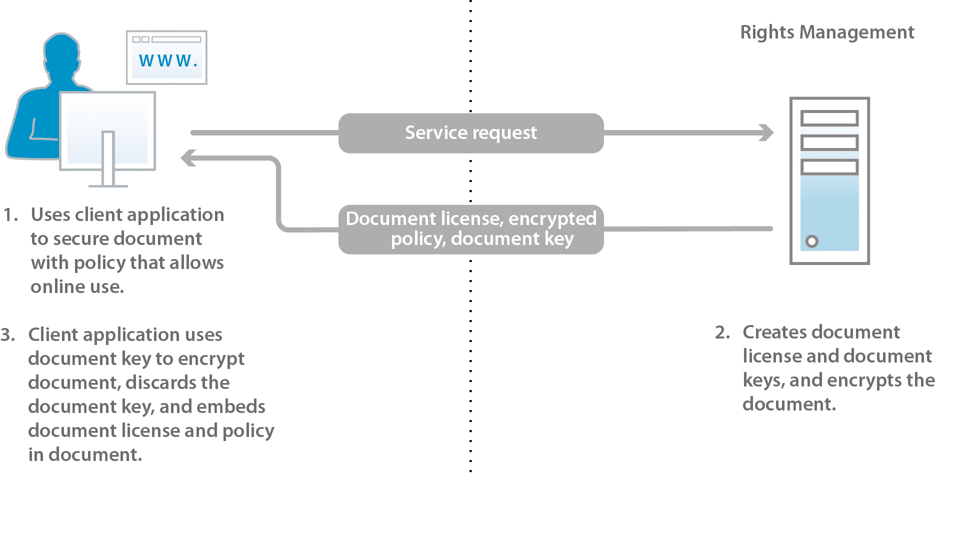
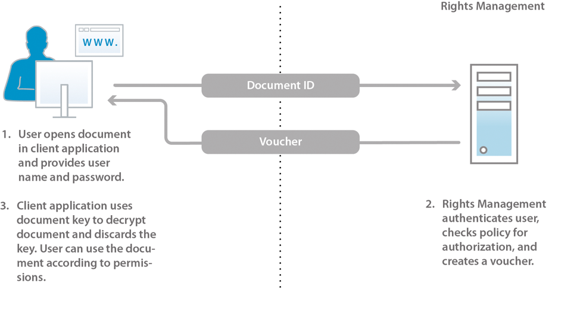

# About document security {#about-document-security}

Document security ensures that only authorized users can use your documents. Using document security, you can safely distribute any information that you have saved in a supported format. Supported file formats include:

* Adobe PDF files
* Microsoft&reg; Word, Excel, and PowerPoint files

For more information about how policies protect supported file types, see [more document security information](https://experienceleague.adobe.com/docs/experience-manager-65/forms/use-document-security/document-security-offerings.html?lang=en).

Using document security, you can easily create, store, and apply predefined confidentiality settings to your documents. To prevent information from spreading beyond your reach, you can also monitor and control how recipients use your documents after you distribute them.

You can protect documents by using policies. A *policy* is a collection of information that includes confidentiality settings and a list of authorized users. The confidentiality settings that you specify in a policy determine how a recipient can use a document to which you apply the policy. For example, you can specify whether recipients can print or copy text, edit text, or add signatures and comments to protected documents.

Document security users create policies through the end-user web pages. Administrators use the document security web pages to create policy sets that contain shared policies that are available to all authorized users.

Although policies are stored in document security, you apply them to documents through your client application. How to apply policies to PDF documents is described in detail in *Acrobat Help*. Applying policies by using other applications, such as Microsoft&reg; Office, is documented in the *Acrobat Reader DC Extensions Help* for the application.

When you apply a policy to a document, the confidentiality settings specified in the policy protect the information that the document contains. The confidentiality settings also protect any files (text, audio, or video) within a PDF document. You can distribute the policy-protected document to recipients who are authorized by the policy.

**Document access control and auditing**

Using a policy to protect a document gives you ongoing control over that document, even after you distribute it. You can monitor the document, change the policy, prevent users from continuing to access the document, and switch the policy that is applied to the document.

Through document security, you can monitor policy-protected documents and track events, such as when an authorized or unauthorized user attempts to open the document.

**Components**

Document security consists of a server and user interface:

**Server:** The central component through which document security performs transactions such as user authentication, real-time management of policies, and application of confidentiality. The server also provides a central repository for policies, audit records, and other related information.

**Web pages:** The interface where you create policies, manage your policy-protected documents, and monitor events that are associated with policy-protected documents. Administrators can also configure global options such as user authentication, auditing, and messaging for invited users, and manage invited user accounts.

The steps in the illustration are as follows:

1. The document owner creates policies using the web pages. Document owners can create personal policies that are accessible only to them. Administrators and policy set coordinators can create shared policies within policy sets that are accessible to authorized users. 
1. The document owner applies the policy, and then saves and distributes the document. The document can be distributed by email, through a network folder, or on a website. 
1. The recipient opens the document in the appropriate client application. The recipient can use the document according to its policy.
1. The document owner, policy set coordinator, or administrator can track documents and modify access to them using the web pages.

## About document security users {#about-document-security-users}

Various types of users work with document security to accomplish different tasks:

* The system administrator or other information systems (IS) person installs and configures document security. This person may also be responsible for configuring global settings for the server, web pages, and policies and documents.

  These settings may include, for example, a base document security URL, auditing and privacy notifications, invited user registration notices, and default offline lease periods. 

* Document security administrators create policies and policy sets, and manage policy-protected documents for users as required. They also create invited user accounts, and monitor system, document, user, policy, policy set, and custom events. They may also be responsible for configuring the global server, and web page and policy settings with a system administrator.

  Administrators can assign users the following roles in the User Management area of administration console. Users who are assigned these roles perform their tasks in the document security user interface area of administration console.

  **Document security super administrator**

  Users with this role have access to all document security settings in administration console. These permissions are associated with the role:

    * Manage configuration
    * Manage policy
    * Manage policy sets
    * Manage documents
    * Manage document publishers
    * Manage invited and local users
    * View events
    * Delegate
    * Invite external users

  **Document security administrator**

  Users with this role can configure the document security server, using the Configuration page in document security section of administration console. This permission is associated with the role, Manage Configuration.

  >[!NOTE]
  >
  >Users with this role must also have the administration console User role to be able to log in to administration console and edit any configuration-related settings.  

  **Document security policy set administrator**

  Users with this role can use the document security section of administration console to edit other users' policies and to create, edit, and delete policy sets. When a policy set administrator creates a policy set, they can assign a policy set coordinator to that policy set. These permissions are associated with the role:

    * Manage policy
    * Manage policy sets
    * Manage documents
    * Manage document publishers
    * View events
    * Delegate

    >[!NOTE]
    >
    >Users with this role must also have the administration console User role to be able to log in to administration console and edit any configuration-related settings.  

  **Document security manages invited and local users**

  Users with this role can perform tasks required to manage all invited and local users on the relevant document security web pages. These permissions are associated with the role:

    * Manage invited and local users
    * Invite external users
    * Access end-user web pages

    >[!NOTE]
    >
    >Users with this role must also have the administration console User role to be able to log in to administration console and edit any configuration-related settings.  

  **Document security invite user**

  Users with this role can invite users. These permissions are associated with the role:

    * Invite external users
    * Access end-user web pages

  **Document security end user**

  Users with this role can access document security end-user web pages. This role can also be assigned to administrators to allow administrators to create policies using the end-user pages. This permission is associated with the role Access end-user web pages.

* Users within the organization who have valid document security accounts create their own policies, use policies to protect documents, track and manage their policy-protected documents, and monitor events that are related to their documents. 
* Policy set coordinators manage documents, view events, and manage other policy set coordinators (based on their permissions). Administrators designate users as policy set coordinators for particular policy sets.
* Users who are external to your organization (for example, a business partner) can use policy-protected documents if they are in the document security directory, if the administrator creates an account for them, or if they register with document security through an automated email invitation process. Depending on how the administrator enables the access settings, the invited users may also have permission to apply policies to documents, to create, modify, and delete their policies, and invite other external users to use their policy-protected documents. 
* Developers use the AEM Forms SDK to integrate custom applications with document security.

Document security administrators can create custom roles by using the following permissions in User Management:

* Document security Manage Configuration 
* Document security Manage Invited and Local Users 
* Document security Manage Policy Sets 
* Document security Manage Policy Sets 
* Document security View Server Events 
* Document security Change Policy Owner

## Policies and policy-protected documents {#policies-and-policy-protected-documents}

A *policy* defines a set of confidentiality settings and users who can access a document to which the policy is applied. A policy also enables the permissions on a document to be changed dynamically. It gives the person who secures the document permission to change the confidentiality settings to revoke access to the document or to switch the policy.

Policy protection can be applied to a PDF document by using Adobe Acrobat&reg; Pro and Acrobat Standard. Policy protection can be applied to other file types, such as Microsoft&reg; Word, Excel, and PowerPoint files, by using the client application with the appropriate Acrobat Reader DC Extensions installed.

### How policies work {#how-policies-work}

Policies contain information about the authorized users and the confidentiality settings to apply to documents. Users can be any one in your organization, and people who are external to your organization who have an account. If the administrator enables the user invitation feature, it is even possible to add new users to policies, therefore initiating a registration invitation email process.

The confidentiality settings in a policy determine how the recipients can use the document. For example, you can specify whether recipients can print or copy text, make changes, or add signatures and comments to protected documents. The same policy can also specify different confidentiality settings for specific users.

>[!NOTE]
>
>Confidentiality settings that are applied through a policy override any settings that may have been applied to a PDF document in Acrobat by using the password or certificate security options. (See Acrobat Help for more information.)

Users and administrators create policies through the document security web pages. Only one policy at a time can be applied to a document. You can apply a policy by using one of these methods:

* Open the document in Acrobat or another client application and select a policy to secure the document.
* Send a document as an email attachment in Microsoft&reg; Outlook. In this case, you can select a policy from a list of policies. Or, you can select an auto-generated policy that Acrobat creates with a default set of confidentiality settings to protect the document only for the email message recipients.

A policy can be removed from a document by using the client application.

The steps in the diagram are as follows:

1. The document owner secures the document from a supported client application with a policy that allows online use. 
1. Document security creates a document license and document keys, and encrypts the policy. The document license, encrypted policy, and document key are returned to the client application.
1. The document is encrypted with the document key, and the document key is discarded. The document now embeds the license and policy. These tasks are performed in the supported client application.

When you apply a policy to a document, the information contained in it, including any contained files (text, audio, or video) in PDF documents, is protected by the confidentiality settings specified in the policy. Document security generates a license and encryption information that is then embedded in the document. When you distribute the document, document security can authenticate the recipients who attempt to open the document and authorize access according to the privileges specified in the policy.

If offline usage is enabled, recipients can also use policy-protected documents offline (without an active Internet or network connection) for the time period specified in the policy.

### How policy-protected documents work {#how-policy-protected-documents-work}

To open and use policy-protected documents, the policy must include your name as a recipient, and you must have a valid document security account. For PDF documents, you need Acrobat or Adobe Reader&reg;. For other file types, you need the appropriate application for the file with the Acrobat Reader DC Extensions installed.

When you open a policy-protected document, Acrobat, Adobe Reader, or the Acrobat Reader DC Extensions connects to document security to authenticate you. Then, you can proceed to log on. If the document usage is being audited, a notification message appears. After document security determines which document permissions to grant, it manages the decryption of the document. You can then use the document according to the policy confidentiality settings. 

The steps in the diagram are as follows:

1. The document user opens the document in a supported client application and authenticates with the server. The document identifier is sent to the document security server.
1. Document security authenticates the users, checks the policy for authorization, and creates a voucher. The voucher (which contains the document key and permissions) is returned to the client application.
1. The document is decrypted with the document key, and the document key is discarded. The document can then be used according to the confidentiality settings of the policy. These tasks are performed in the supported client application.

You can continue to use a document under these conditions:

* Indefinitely or for the validity period that is specified in the policy
* Until the administrator or the person who applied the policy revokes access to the document or changes the policy

You can also use policy-protected documents offline (without an Internet or network connection) if the policy permits offline access. First log on to document security to synchronize the document. You can then use the document during the offline lease period that is specified in the policy.

When the offline lease period ends, synchronize the document with document security again, either by going online and opening a policy-protected document or by using a command in the client application. See *Acrobat Help* or the appropriate *Acrobat Reader DC Extensions Help* for details.

If you save a copy of a policy-protected document by using the Save or Save As menu command, the policy is automatically applied and enforced for the new document. Events such as attempts to open the new document are also audited and recorded for the original document.

## Policy sets {#policy-sets}

*Policy sets* are used to group a set of policies that have a common business purpose. These policy sets are then made available to a subset of users in the system.

Each policy set can have one or more associated policy set coordinators. The policy set coordinator is an administrator or a user who has more permissions. The *policy set coordinator* is typically a specialist in the organization who can best author the policies in a particular policy set.

Policy set coordinators can perform these tasks:

* Create policies
* Edit and delete any policy in the policy set
* Edit policy set settings
* Add and remove policy set coordinators
* View policy and document events for any policy or document within the policy set
* Revoke access to documents
* Switch policies for the document.

>[!NOTE]
>
>You can retrieve a maximum of 1000 policy set names from the database using `getAllPolicysetnames()` API.

Policy sets are created and deleted in the document security administration web pages by administrators and policy set coordinators who have permission to do so.

Policy sets are made available to a limited number of users by specifying which users or groups within a domain can use the policies from the policy set to protect documents.

When document security is installed, a default policy set is created called *Global Policy Set*. The administrator who installed the software manages this policy set.

## Best practices {#best-practices}

Policies are reusable sets of permissions and user groups that can be applied to various documents. For the protected documents. These policies ensure that only authorized users can use allowed features. The number of policies and policy sets are expected to grow with an increase in different user roles and documents within a department. To create and manage policies, here are some considerations and best practices:

* **Create reusable policies:** Adobe recommends reusing policies across various documents. It helps keep the number of policies to a minimum, provide optimum performance, and makes it easier to manage the policies. To create a reusable policy:

1. Identify and define access control requirements at departments and organization level.

1. Create user groups and add users to these groups.

1. Create a policy set.

1. Open the policy set and create a policy. Add user groups and set confidentiality (access-control) settings for the policy.

  Add user groups to policies instead of individual users. It makes it easier to manage and apply policies to many users.

* **Create Custom Policy sets:** A policy set combines multiple policies into a manageable entity. Create custom policy sets for your organization or department, use them to group related policies, and make them available to a subset of users in the system. 

  Using policy sets makes it easier to assign and manage related policies to specific users in an organization or department. For example, separate policy sets for the finance and human resources department can help easily manage and apply related policies to documents designated for corresponding departments.

* **Use an external authorizer to apply permissions dynamically:** You can use [external authorizer](https://help.adobe.com/en_US/livecycle/11.0/ProgramLC/WS624e3cba99b79e12e69a9941333732bac8-6f26.2.html) to evaluate and dynamically apply permissions based on external condition. When the permissions are evaluated dynamically, based on external condition, then you can:

  * Provide centralized access control for documents in your organization.

  * Control access to policy-protected documents by dynamically determining whether a user can access a policy-protected document. For example, dynamically decides whether a user can print a policy-protected document.

  * Use an access control mechanism that your content management system uses, in addition to the standard policy evaluation process. For example, when the service determines whether a user can print a policy-protected document, it can use the standard policy evaluation process. And, it can also use the access control mechanism that your content management system uses.

  Although it is possible to completely replace the Document Security policy evaluation process with an external authorization handler, it is recommended that you use an external authorization handler with the policy evaluation process. As a result, document access can be controlled by the same control mechanism that your content management system uses. For example, when the Document Security service determines whether a user can print a policy-protected document, it uses the standard policy evaluation process. It also uses the access control mechanism that your content management system uses. For more information, see [Creating External Authorization Handlers](https://help.adobe.com/en_US/livecycle/11.0/ProgramLC/WS624e3cba99b79e12e69a9941333732bac8-6f26.2.html).

* **Keep the policy sets to a limited number:** Several factors lead to the constant growth of policies and policy sets. Some common factors are:

  * Increase in user roles, departments, and documents within an organization over a period.
  * Departments of an organization work in isolation and keep a tight control on the department-specific policies. It leads to identical policies within an organization. 

  Adobe recommends keeping the number of policies and policy sets to a minimum. It helps easily manage policies and policy sets and provide better performance. To keep the number to a minimum:

  * Create reusable policies. These policies can be shared across multiple departments.
  * Consider creating organization-wide policy sets, if some policies apply to multiple departments instead of an individual policy set for each department.
  * Group-related policies in a policy set. Do not create a separate policy set for each policy.
  * Use an external authorizer to dynamically  control user permissions.

  >[!NOTE]
  >
  >You can use the [getAllPolicysetnames()](https://developer.adobe.com/experience-manager/reference-materials/6-5/forms/programlc/javadoc/com/adobe/livecycle/rightsmanagement/client/PolicyManager.html) API to retrieve a maximum of 1000 policy set names. Internally, the API retrieves a maximum of 1000 policies for which the API invoker has document publisher permission and then creates and returns a list of unique policy set names associated with retrieved policies to you. For example, when the API retrieves 1000 policies and the retrieved policies are associated with 200 policy sets in total, the API returns only 200 policy set names.
