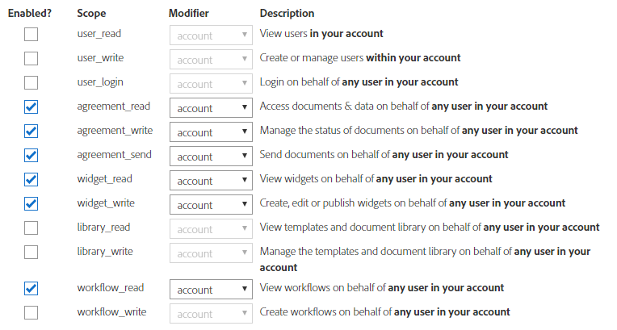

# Integrate [!DNL Adobe Sign] with AEM [!DNL Forms]{#integrate-adobe-sign-with-aem-forms}

[!DNL Adobe Sign] enables e-signature workflows for adaptive forms. E-signatures improve workflows to process documents for legal, sales, payroll, human resource management, and many more areas.

In a typical [!DNL Adobe Acrobat Sign] and Adaptive Forms scenario, a user fills an Adaptive Form to apply for a service. For example, a credit card application and a citizen benefits form. When a user fills, submits, and signs the application form, the form is sent to the service provider for further action. Service provider reviews the application and uses [!DNL Adobe Acrobat Sign] to mark the application approved. AEM Forms supports both Adobe Acrobat Sign and Adobe Acrobat Sign Solutions for Government. Depending on your license and requirements, you can integrate or connect AEM Forms with either of the solution:

* [Connect AEM Forms with Adobe Acrobat Sign](#adobe-sign)
* [Connect AEM Forms with Adobe Acrobat Sign Solutions for Government](#adobe-acrobat-sign-for-government)

## Connect AEM Forms with Adobe Acrobat Sign {#adobe-sign}

To connect **[!DNL AEM Forms]** with **[!DNL Adobe Acrobat Sign]**, set up the software and accounts listed in the prerequisites section, and connect Adobe Sign to your all the AEM Forms Author and Publish instances:

## Prerequisites {#prerequisites}

You require the following to integrate [!DNL Adobe Sign] with AEM [!DNL Forms]:

* An active [Adobe Sign developer account.](https://acrobat.adobe.com/us/en/why-adobe/developer-form.html)
* An [SSL enabled](/help/sites-administering/ssl-by-default.md) AEM [!DNL Forms] server.
* An [Adobe Sign API application](https://www.adobe.io/apis/documentcloud/sign/docs.html#!adobedocs/adobe-sign/master/gstarted/create_app.md).
* Credentials (Client ID and Client Secret) of [!DNL Adobe Sign] API application.
* When reconfiguring, remove the existing [!DNL Adobe Sign] configuration from both author and publish instances.
* Use [identical crypto key](/help/sites-administering/security-checklist.md#make-sure-you-properly-replicate-encryption-keys-when-needed) for author and publish instances.

## Configure [!DNL Adobe Sign] with AEM [!DNL Forms] {#configure-adobe-sign-with-aem-forms}

After prerequisites are in place, perform the following steps to configure [!DNL Adobe Sign] with AEM [!DNL Forms] on the Author instance:

1. On AEM [!DNL Forms] author instance, navigate to **Tools**  &gt; **[!UICONTROL General]** &gt; **[!UICONTROL Configuration Browser]**.
1. On the **[!UICONTROL Configuration Browser]** page, tap **[!UICONTROL Create]**.
   * See the [Configuration Browser](/help/sites-administering/configurations.md) documentation for more information.
1. In the **[!UICONTROL Create Configuration]** dialog, specify a **[!UICONTROL Title]** for the configuration, enable **[!UICONTROL Cloud Configurations]**, and tap **[!UICONTROL Create]**. It creates a configuration container.
1. Navigate to **Tools**  &gt; **[!UICONTROL Cloud Services]** &gt; **[!UICONTROL Adobe Sign]** and select the configuration container you created in the above step.

   >[!NOTE]
   >
   >You can either execute steps 1-4 to create a new configuration container and create an [!DNL Adobe Sign] configuration in the container or use the existing `global` folder in **Tools**  &gt; **[!UICONTROL Cloud Services]** &gt; **[!UICONTROL Adobe Sign]**. If you create the configuration in the new configuration container, ensure to specify the container name in the **[!UICONTROL Configuration Container]** field when you create an adaptive form.
   
   >[!NOTE]
   >
   >Ensure that the URL of the Cloud Services Configuration Page starts with **HTTPS**. If not, [enable SSL](/help/sites-administering/ssl-by-default.md) for AEM [!DNL Forms] server.

1. On the configuration page, tap **[!UICONTROL Create]** to create [!DNL Adobe Sign] configuration in AEM [!DNL Forms].
1. In the **[!UICONTROL General]** tab of the **[!UICONTROL Create Adobe Sign Configuration]** page, specify a **[!UICONTROL Name]** for the configuration and tap **[!UICONTROL Next]**. You can optionally specify a title and browse to select a thumbnail for the configuration.

1. Copy the URL in your current browser window to a notepad. It is required to configure [!DNL Adobe Sign] application with AEM[!DNL Forms].

1. In the **[!UICONTROL Settings]** tab, the **[!UICONTROL OAuth URL]** field contains the default URL. The format of the URL is:

      `https://<shard>/public/oAuth/v2`
   
      For example: 
      `https://secure.na1.echosign.com/public/oauth/v2`
   
      where:
   
      **na1** refers to the default database shard. You can modify the value for the database shard. Ensure that  the [!DNL  Adobe Sign] Cloud Configurations point to the [correct Shard](https://helpx.adobe.com/sign/using/identify-account-shard.html).
   
      If you create another [!DNL Adobe Sign] configuration for an Adobe Experience Manager feature or component, ensure that all the [!DNL Adobe Sign] Cloud Configurations point to the same shard.
   
      >[!NOTE]
      >
      >Keep the **Create Adobe Sign Configuration** page open. Do not close it. You can retrieve **Client Id** and **Client Secret** after configuring OAuth settings for the [!DNL Adobe Sign] application as described in upcoming steps.

1. Configure OAuth settings for the [!DNL Adobe Sign] application:

    1. Open a browser window and sign in to the [!DNL Adobe Sign] developer account.
    1. Select the application configured for AEM [!DNL Forms], and tap **[!UICONTROL Configure OAuth for Application]**.
    1. Copy the **[!UICONTROL Client ID]** and **[!UICONTROL Client Secret]** to a notepad.
    1. In the **[!UICONTROL Redirect URL]** box, add the HTTPS URL copied in the previous step.
    1. Enable the following OAuth settings for the [!DNL Adobe Sign] application and click **[!UICONTROL Save]**.

    * agreement_read
    * agreement_write
    * agreement_send
    * widget_write
    * workflow_read

   For step-by-step information to configure OAuth settings for an [!DNL Adobe Sign] application and obtain the keys, see [Configure oAuth settings for the application](https://www.adobe.io/apis/documentcloud/sign/docs.html#!adobedocs/adobe-sign/master/gstarted/configure_oauth.md) developer documentation.

   

1. Go back to the **[!UICONTROL Create Adobe Sign Configuration]** page. In the **[!UICONTROL Settings]** tab, the **[!UICONTROL OAuth URL]** field mentions the  default URL. The format of the URL is:

   `https://<shard>/public/oAuth/v2`

   For example: 
   `https://secure.na1.echosign.com/public/oauth/v2`

   where:

   **na1** refers to the default database shard.

   You can modify the value for the database shard. Restart the server to be able to use the new value for the database shard.

   >[!NOTE]
   >
   >Ensure that your author and publish instance configurations point to the same shard. If you create multiple Adobe Sign configurations for an organization, ensure all the configurations utilize the same shard.

1. Go back to the **[!UICONTROL Create Adobe Sign Configuration]** page. In the **[!UICONTROL Settings]** tab, specify the **Client ID** (also referred to as Application ID) and **Client Secret**. Use the [Client ID and Client Secret of Adobe Sign application](https://opensource.adobe.com/acrobat-sign/developer_guide/helloworld.html#get-the-app-id-and-secret) created for AEM Forms.

1. Select the **[!UICONTROL Enable Adobe Sign for attachments also]** option to append files attached to an adaptive form to the corresponding [!DNL Adobe Sign] document sent for signing.

1. Tap **[!UICONTROL Connect to Adobe Sign]**. When prompted for credentials, provide username and password of the account used while creating [!DNL Adobe Sign] application.

1. Tap **[!UICONTROL Create]** to create the [!DNL Adobe Sign] configuration.

1. Open AEM Web Console. The URL is `https://'[server]:[port]'/system/console/configMgr`
1. Open **[!UICONTROL Forms Common Configuration Service].**
1. In the **[!UICONTROL Allow]** field, **select** All users - All the users, anonymous or logged in, can preview attachments, verify and sign forms, and click **[!UICONTROL Save].** Author instance is configured to use [!DNL Adobe Sign].
1. Publish the configuration. 
1. Use [replication](https://experienceleague.adobe.com/docs/experience-manager-65/deploying/configuring/replication.html) to create identical configuration on corresponding publish instances. 

Now, [!DNL Adobe Sign] is integrated with AEM [!DNL Forms] and ready for use in adaptive forms. To [use Adobe Sign service in an adaptive form](../../forms/using/working-with-adobe-sign.md#configure-adobe-sign-for-an-adaptive-form), specify the configuration container created above in adaptive form properties.

## Connect AEM Forms with Adobe Acrobat Sign Solutions for Government {#adobe-acrobat-sign-for-government}

Connecting AEM Forms with Adobe Acrobat Sign Solutions for Government is a multi-step process. It involves: 

* Creating redirect URL for your AEM instances
* Sharing the redirect URL and scopes with Adobe Sign Solutions for Government team
* Receiving credentials from Adobe Sign team
* Using the received credentials to connect AEM Forms with Adobe Acrobat Sign Solutions for Government

### Before you start {#prerequisites-for-adobe-sign-for-acrobat-sign-for-government}

Before you start connecting AEM Forms with Adobe Acrobat Sign Solution, 

* Ensure that your [Adobe Acrobat Sign Solutions for Government](https://opensource.adobe.com/acrobat-sign/signgov/gstarted.html#account-provisioning) account is provisioned. 
* Your AEM [!DNL Forms] servers are [SSL enabled](/help/sites-administering/ssl-by-default.md) .
* Your AEM [!DNL Forms] servers are using [identical crypto key](/help/sites-administering/security-checklist.md#make-sure-you-properly-replicate-encryption-keys-when-needed) for author and publish instances.

### Connect AEM Forms to Adobe Acrobat Sign Solutions for Government {#connect-adobe-acrobat-sign-for-government}

#### Create a redirect URL for your AEM instance

1. On your AEM Forms instance, navigate to **[!UICONTROL Tools]**  &gt; **[!UICONTROL General]** &gt; **[!UICONTROL Configuration Browser]**.
1. On the **[!UICONTROL Configuration Browser]** page, tap **[!UICONTROL Create]**.
1. In the **[!UICONTROL Create Configuration]** dialog, specify a **[!UICONTROL Title]** for the configuration, enable **[!UICONTROL Cloud Configurations]**, and tap **[!UICONTROL Create]**. It creates a configuration container. Ensure that the container/folder name does not contain any space.

1. Navigate to **[!UICONTROL Tools]**  &gt; **[!UICONTROL Cloud Services]** &gt; **[!UICONTROL Adobe Acrobat Sign]** and open the configuration container you created in the previous step. When you create an Adaptive Form, specify the container name in the **[!UICONTROL Configuration Container]** field.  
1. On the configuration page, tap **[!UICONTROL Create]** to create [!DNL Adobe Acrobat Sign] configuration in AEM Forms.
1. Copy the URL of your current browser window to a notepad from the URL. This URL is referred as `re-direct URL`. In the next section, you share the `re-direct URL` and `Scopes` with Adobe Sign team and request credentials (Client Id and Client Secret).  

>[!NOTE]
>
>
> * A `re-direct URL` should contain a [Top-level](https://en.wikipedia.org/wiki/Top-level_domain) domain. For example, `https://adobe.com/libs/adobesign/cloudservices/adobesign/createcloudconfigwizard/cloudservices.html/conf/global` 
> * Do not use a local URL as a `re-direct URL`. For example, `https://localhost:4502/libs/adobesign/cloudservices/adobesign/createcloudconfigwizard/cloudservices.html/conf/global`.

#### Share the redirect URL and scopes with Adobe Sign team and receive credentials

Adobe Acrobat Sign for Government Solutions team requires the `re-direct URL` and the certain scopes to be enabled for your Adobe Acrobat Sign application (listed below) to generate credentials (Client Id and Client Secret) that allow you to connect AEM Forms with Adobe Acrobat Sign Solutions for Government.

Share the `scopes` (listed below) and the `re-direct URL` created and noted down the last step of previous section with your Adobe Acrobat Sign for Government Solution representative [Adobe Professional Services team member](https://opensource.adobe.com/acrobat-sign/signgov/gstarted.html#password).

**_Scopes_**

* [!DNL agreement_read]
* [!DNL agreement_write]
* [!DNL agreement_send]
* [!DNL widget_read]
* [!DNL widget_write]
* [!DNL workflow_read]
* [!DNL offline_access]

The representative generates and shares credentials with you. In the next section, you use the credentials (Client Id and Client Secret) to connect AEM Forms with Adobe Acrobat Sign Solutions for Government.

#### Use the received credentials to connect AEM Forms with Adobe Acrobat Sign Solutions for Government

1. Open the `re-direct URL` in your browser. You created and noted down the `re-direct URL` in the last step of the [create a redirect URL on your AEM instance](#create-redirect-url) section. 

1. In the **[!UICONTROL General]** tab of the **[!UICONTROL Create Adobe Sign Configuration]** page, specify a **[!UICONTROL Name]** for the configuration, and tap **[!UICONTROL Next]**. You can optionally specify a **[!UICONTROL Title]** and browse to select a **[!UICONTROL Thumbnail]** for the configuration. Click **[!UICONTROL Next]**. 

1. In the **[!UICONTROL Settings]** tab of the **[!UICONTROL Create Adobe Sign Configuration]** page, for the **[!UICONTROL Select solution]** option, select [!DNL Adobe Acrobat Sign Solutions for Government].
   
      

1. In the **[!UICONTROL Email]** filed, specify the email address associated with your Adobe Acrobat Sign Solutions for Government account.  

1. The **[!UICONTROL OAuth URL]** field specifies the Adobe Sign database shard. The field contains the default URL. Do not change the URL. 

1. Use the credentials shared by  Adobe Acrobat Sign for Government Solution representative ([Adobe Professional Services team member]) in the previous section as [**[!UICONTROL Client ID]** and **[!UICONTROL Client Secret]**].  

1. Select the **[!UICONTROL Enable Adobe Acrobat Sign for attachments]** option to append files attached to an Adaptive Form to the corresponding [!DNL Adobe Acrobat Sign] document sent for signing.

1. Tap **[!UICONTROL Connect to Adobe Sign]**. When prompted for credentials, provide username and password of the account used while creating [!DNL Adobe Acrobat Sign] application. When asked to confirm access for `Adobe Acrobat Sign for Government Solutions` and , click **[!UICONTROL Allow Access]**. If the credentials are correct and you allow [!DNL AEM Forms] to access your [!DNL Adobe Acrobat Sign] developer account, a success message similar to the following appears.
     
      

      When prompted for credentials, provide username and password of the account used while creating [!DNL Adobe Acrobat Sign] application. When asked to confirm access for `your account`, and click **[!UICONTROL Allow Access]**.

1. Tap **[!UICONTROL Create]** to create the configuration.
1. Open AEM Web Console. The URL is `https://'[server]:[port]'/system/console/configMgr`
1. Open **[!UICONTROL Forms Common Configuration Service].**
1. In the **[!UICONTROL Allow]** field, **select** All users - All the users, anonymous or logged in, can preview attachments, verify and sign forms, and click **[!UICONTROL Save].** Author instance is configured to use [!DNL Adobe Sign].

1. Publish the configuration. 
1. Use [replication](https://experienceleague.adobe.com/docs/experience-manager-65/deploying/configuring/replication.html) to create identical configuration on corresponding publish instances. 

Now, you can [use add Adobe Acrobat Sign fields in an Adaptive Form](working-with-adobe-sign.md) or [AEM Workflow](/help/forms/using/aem-forms-workflow-step-reference.md#sign-document-step-sign-document-step). Ensure that you add the configuration container used for the Cloud Service configuration to all the Adaptive Forms being enabled for [!DNL Adobe Acrobat Sign]. You can specify a configuration container from the properties of an Adaptive Form.

## Configure [!DNL Adobe Sign] scheduler to sync the signing status {#configure-adobe-sign-scheduler-to-sync-the-signing-status}

An [!DNL Adobe Sign] enabled adaptive form is submitted only after all the signers complete the signing process. By default, the [!DNL Adobe Sign] Scheduler services is scheduled to check (poll) signer response after every 24 hours. You can change the default interval for your environment. Perform the following steps to change the default interval:

1. Log in to AEM [!DNL Forms] server with admin credentials and navigate to **Tools** &gt; **[!UICONTROL Operations]** &gt; **[!UICONTROL Web Console]**.

   You can also open the following URL in a browser window:
   `https://[localhost]:'port'/system/console/configMgr`

1. Locate and open the **[!UICONTROL Adobe Sign Configuration Service]** option. Specify a [cron expression](https://en.wikipedia.org/wiki/Cron#CRON_expression) in the **[!UICONTROL Status Update Scheduler Expression]** field and click **[!UICONTROL Save]**. For example, to run the configuration service daily at 00:00 am, specify `0 0 0 1/1 * ? *` in the **[!UICONTROL Status Update Scheduler Expression]** field.

Default interval to sync status of [!DNL Adobe Sign] is now changed.

## Related Articles {#related-articles}

* [Using Adobe Sign in an adaptive form](../../forms/using/working-with-adobe-sign.md)
* [Adobe Sign with Form-Centric workflows](/help/forms/using/aem-forms-workflow-step-reference.md#sign-document-step-sign-document-step)
* [Using Adobe Sign with AEM Forms (Video)](https://helpx.adobe.com/experience-manager/kt/forms/using/adobe-sign-integration-feature-video.html)
