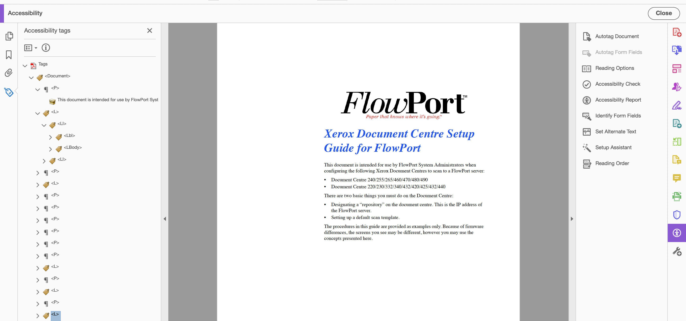

# Using AEM Document Services Programmatically  {#using-aem-document-services-programmatically}

Samples and examples in this document help you understand and use  AEM Document Services on an AEM Forms on OSGi environment. For samples and examples for AEM Forms on JEE environment, see 

* [Signature Service Java API Quick Start](https://experienceleague.adobe.com/docs/experience-manager-65/forms/developer-reference/programming-aem-forms-jee/java-api-quick-start-code-examples/signature-service-java-api-quick.html?#programming-aem-forms-jee)

* [Encryption Service Java API Quick Start](https://experienceleague.adobe.com/docs/experience-manager-65/forms/developer-reference/programming-aem-forms-jee/java-api-quick-start-code-examples/encryption-service-java-api-quick.html?#developer-reference)

* [Acrobat Reader extensions Service Java API Quick Start](https://experienceleague.adobe.com/docs/experience-manager-65/forms/developer-reference/programming-aem-forms-jee/java-api-quick-start-code-examples/acrobat-reader-dc-extensions-service.html?#developer-reference)

## Prerequisite {#prerequisite}

* Before using the DocAssurance service APIs, [configure the DocAssurance service](/help/forms/using/install-configure-document-services.md).

* Download and configure [AEM Forms Client SDK](https://helpx.adobe.com/aem-forms/kb/aem-forms-releases.html) with you AEM maven project. The client classes required to build Maven Projects using AEM Document Services are available in the [AEM Forms Client SDK](https://helpx.adobe.com/aem-forms/kb/aem-forms-releases.html)

* Learn [how to build your AEM project using Maven](/help/sites-developing/ht-projects-maven.md)

## DocAssurance Service {#docassurance-service}

The DocAssurance service includes the following services:

* Signature service
* Encryption service
* Reader Extension service

You can perform the following operations using the DocAssurance service:

* [Add Invisible Signature](/help/forms/using/aem-document-services-programmatically.md#p-adding-an-invisible-signature-field-p)

* [Add Signature Field](/help/forms/using/aem-document-services-programmatically.md#p-adding-a-signature-field-nbsp-p)
* [Apply Document TimeStamp](/help/forms/using/aem-document-services-programmatically.md#apply-document-timestamp)

* [Get Signature](/help/forms/using/aem-document-services-programmatically.md#p-getting-signature-p)
* [Get Signature Field List](/help/forms/using/aem-document-services-programmatically.md#p-getting-signature-field-list-nbsp-p)
* [Modify Signature Fields](/help/forms/using/aem-document-services-programmatically.md#p-modifying-signature-fields-nbsp-p)

* [Secure Document](/help/forms/using/aem-document-services-programmatically.md#p-securing-documents-p)

* [Get Credential Usage Rights](/help/forms/using/aem-document-services-programmatically.md#p-getting-credential-usage-rights-p)

* [Get Document Usage Rights](/help/forms/using/aem-document-services-programmatically.md#p-getting-document-usage-rights-p)

* [Remove Usage Rights](/help/forms/using/aem-document-services-programmatically.md#p-removing-usage-rights-p)
* [Verify Digital Signatures](/help/forms/using/aem-document-services-programmatically.md#p-verifying-digital-signatures-p)
* [Verify Multiple Digital Signatures](/help/forms/using/aem-document-services-programmatically.md#p-verifying-multiple-digital-signatures-p)
* [Remove Digital Signatures](/help/forms/using/aem-document-services-programmatically.md#p-removing-digital-signatures-p)

* [Get Certifying Signature Field](/help/forms/using/aem-document-services-programmatically.md#p-getting-certifying-signature-field-p)
* [Get PDF Encryption Type](/help/forms/using/aem-document-services-programmatically.md#p-getting-pdf-encryption-type-p)
* [Remove Password Encryption](/help/forms/using/aem-document-services-programmatically.md#p-removing-password-encryption-from-pdf-p)

* [Remove Certificate Encryption](/help/forms/using/aem-document-services-programmatically.md#p-removing-certificate-encryption-p)

>[!NOTE]
>
>All these services use Document object as  input  parameter for which the Javadoc can be found at the URL [https://helpx.adobe.com/experience-manager/6-3/forms/javadocs/index.html](https://helpx.adobe.com/experience-manager/6-3/forms/javadocs/index.html)

### Adding an invisible signature field {#adding-an-invisible-signature-field}

Digital signatures appear in signature fields, which are form fields that contain a graphical representation of the signature. Signature fields can be visible or invisible. Signers can use a pre-existing signature field, or a signature field can be programmatically added. In either case, the signature field must exist before a PDF document can be signed. You can programmatically add a signature field by using the Signature service Java API or Signature web service API. You can add more than one signature field to a PDF document. However, each signature field name must be unique.

**Syntax**: `addInvisibleSignatureField(Document inDoc, String signatureFieldName, FieldMDPOptionSpec fieldMDPOptionsSpec, PDFSeedValueOptionSpec seedValueOptionsSpec, UnlockOptions unlockOptions)`

**Input Parameters**

<table>
 <tbody>
  <tr>
   <th>Parameters</th>
   <th>Description</th>
  </tr>
  <tr>
   <td><code>inDoc</code></td>
   <td>Document object containing PDF.<br /> </td>
  </tr>
  <tr>
   <td><code>signatureFieldName</code><br /> </td>
   <td>The name of the signature field. This parameter is mandatory and cannot have null as a value.<br /> </td>
  </tr>
  <tr>
   <td><code>fieldMDPOptionsSpec</code></td>
   <td>A <code>FieldMDPOptionSpec</code> object that specifies the PDF document fields that are locked after the signature field is signed. This parameter is optional and can accept null value.</td>
  </tr>
  <tr>
   <td><code>seedValueOptionsSpec</code></td>
   <td>A <code>SeedValueOptions</code> object that specifies the various seed values for the field. T This parameter is optional and can accept null value.<span class="acrolinxCursorMarker"></span></td>
  </tr>
  <tr>
   <td><code>unlockOptions</code></td>
   <td>Includes the parameters require to unlock an encrypted file, This parameter is required only for the encrypted files.</td>
  </tr>
 </tbody>
</table>

Here is a sample Java code that adds an invisible signature field to a PDF document.

```java
/*************************************************************************
 *
 * ADOBE CONFIDENTIAL
 * ___________________
 *
 * Copyright 2014 Adobe Systems Incorporated
 * All Rights Reserved.
 *
 * NOTICE:  All information contained herein is, and remains
 * the property of Adobe Systems Incorporated and its suppliers,
 * if any.  The intellectual and technical concepts contained
 * herein are proprietary to Adobe Systems Incorporated and its
 * suppliers and are protected by trade secret or copyright law.
 * Dissemination of this information or reproduction of this material
 * is strictly forbidden unless prior written permission is obtained
 * from Adobe Systems Incorporated.
 **************************************************************************/
package com.adobe.docassurance.samples;

import java.io.File;
import java.io.IOException;

import org.apache.felix.scr.annotations.Component;
import org.apache.felix.scr.annotations.Reference;
import org.apache.felix.scr.annotations.Service;

import com.adobe.aemfd.docmanager.Document;
import com.adobe.fd.docassurance.client.api.DocAssuranceException;
import com.adobe.fd.docassurance.client.api.DocAssuranceService;
import com.adobe.fd.signatures.client.types.PositionRectangle;
import com.adobe.fd.signatures.client.types.exceptions.DuplicateSignatureFieldException;
import com.adobe.fd.signatures.client.types.exceptions.InvalidArgumentException;
import com.adobe.fd.signatures.client.types.exceptions.PDFOperationException;
import com.adobe.fd.signatures.client.types.exceptions.PermissionsException;
import com.adobe.fd.signatures.client.types.exceptions.SignaturesBaseException;
import com.adobe.fd.signatures.pdf.inputs.UnlockOptions;

/**
 * Digital signatures appear in signature fields, which are form fields that contain a graphic representation of the signature.
 * Signature fields can be visible or invisible. Signers can use a pre existing signature field, or a signature field can be
 * programmatically added. In either case, the signature field must exist before a PDF document can be signed.
 * You can programmatically add a signature field by using the Signature service Java API or Signature web service API.
 * You can add more than one signature field to a PDF document; however, each signature field name must be unique.
 *
 * The following Java code example adds an invisible signature field named SignatureField1 to a PDF document.
 */

@Component
@Service(value=AddInvisibleSignatureField.class)
public class AddInvisibleSignatureField {

 @Reference
 private DocAssuranceService docAssuranceService;

 /**
  *
  * @param inputFile - path to an pdf document stored at disk
  * @param outputFile - path where the output file has to be saved
  * @throws SignaturesBaseException
  * @throws DuplicateSignatureFieldException
  * @throws PermissionsException
  * @throws PDFOperationException
  * @throws InvalidArgumentException
  * @throws DocAssuranceException
  *
  */
 public void addInvisibleSignatureField(String inputFile, String outputFile) throws InvalidArgumentException, PDFOperationException, PermissionsException, DuplicateSignatureFieldException, SignaturesBaseException, DocAssuranceException {

  File inFile = new File(inputFile);
  Document inDoc = new Document(inFile);

  File outFile = new File(outputFile);
  Document outDoc = null;

        //Specify the name of the signature field
        String fieldName = "SignatureField1";

        //Create a  PositionRectangle object that specifies
        //the signature fields location
        PositionRectangle post = new  PositionRectangle(193,47,133,12);

        //Specify the page number that will contain the signature field
        java.lang.Integer pageNum = new java.lang.Integer(1);

        //Add a signature field to the PDF document
        try {
   outDoc = docAssuranceService.addInvisibleSignatureField(
       inDoc,
       fieldName,
       null,
       null,
       null);
  } catch (Exception e1) {
   // TODO Auto-generated catch block
   e1.printStackTrace();
  } // for an encrypted PDF input, pass unlock options

        //save the outDoc
        try {
   outDoc.copyToFile(outFile);
  } catch (IOException e) {
   // TODO Auto-generated catch block
   e.printStackTrace();
  }
 }

 /**
  *
  * UnlockOptions to be passed to addSignatureField() API to add a signature field in an encrypted pdf document.
  */
 private UnlockOptions getUnlockOptions(){
        UnlockOptions unlockOptions = new UnlockOptions();
        //sets the Open Password for password encrypted PDF
        unlockOptions.setPassword("OpenPassword");

        //for Certificate Encrypted Document, set the alias of the credential uploaded in the user's key store
        //and corresponding resource resolver

        return unlockOptions;

    }
}
```

You can also use [CAdES](https://en.wikipedia.org/wiki/CAdES_%28computing%29)specification for signing documents. Use the following sample code to set up signing format to [CAdES.](https://en.wikipedia.org/wiki/CAdES_%28computing%29)

```java
SigningFormat signingFormat = SigningFormat.CAdES;
sigAppearence.setSigningFormat(signingFormat);
signOptions.setSigAppearence(sigAppearence);
```

### Adding a signature field&nbsp; {#adding-a-signature-field-nbsp}

You can programmatically add a signature field by using the Signature service Java API or Signature web service API. You can add multiple signature fields to a PDF document. However, each signature field name must be unique.

**Syntax**:

```java
public Document addSignatureField(Document inDoc,
 String signatureFieldName,
 Integer pageNo,
 PositionRectangle positionRectangle,
 FieldMDPOptionSpec fieldMDPOptionsSpec,
 PDFSeedValueOptionSpec seedValueOptionsSpec, UnlockOptions unlockOptions)
```

**Input Parameters**

<table>
 <tbody>
  <tr>
   <th>Parameters</th>
   <th>Description</th>
  </tr>
  <tr>
   <td><code>inDoc</code></td>
   <td>Document object containing PDF</td>
  </tr>
  <tr>
   <td><code>signatureFieldName</code></td>
   <td>Name of the signature field. This parameter is mandatory and cannot accept a null value.</td>
  </tr>
  <tr>
   <td><code>pageNumber</code></td>
   <td>The page number on which the signature field is added. Valid values are 1 to the number of pages contained within the document. This parameter is mandatory and cannot accept a null value.<br /> </td>
  </tr>
  <tr>
   <td><code>positionRectangle</code></td>
   <td>A <code>PositionRectangle object</code> that specifies the position for the signature field. This parameter is mandatory and cannot accept a null value. If the specified rectangle does not lie at least partially on the crop box of the specified page, an <code>InvalidArgumentException</code> is thrown. Also, neither the height or width of the specified rectangle can be 0 or negative. Lower left X or lower left Y coordinates can be 0 or greater but not negative, and are relative to the crop box of the page.</td>
  </tr>
  <tr>
   <td><code>fieldMDPOptionsSpec</code></td>
   <td>A <code>FieldMDPOptionSpec</code> object that specifies the PDF document fields that are locked after the signature field is signed. This is an optional parameter and can be null.</td>
  </tr>
  <tr>
   <td><code>seedValueOptionsSpec</code></td>
   <td>A <code>SeedValueOptions</code> object that specifies the various seed values for the field. This is an optional parameter and can be null.</td>
  </tr>
  <tr>
   <td><code>unlockOptions</code></td>
   <td>Includes the parameters required to unlock an encrypted file. This parameter is required only for the encypted files.</td>
  </tr>
 </tbody>
</table>

Here is a sample Java code that adds a signature field to a PDF document.

```java
/*************************************************************************
 *
-------------------------------------------------------------
*ADOBE SYSTEMS INCORPORATED
*Copyright 2014 Adobe Systems Incorporated
*All Rights Reserved.

*NOTICE:  Adobe permits you to use, modify, and distribute this file in accordance with the
*terms of the Adobe license agreement accompanying it.  If you have received this file from a
*source other than Adobe, then your use, modification, or distribution of it requires the prior
*written permission of Adobe.
-------------------------------------------------------------------------------------------------

 **************************************************************************/
package com.adobe.docassurance.samples;

import java.io.File;
import java.io.IOException;

import org.apache.felix.scr.annotations.Component;
import org.apache.felix.scr.annotations.Reference;
import org.apache.felix.scr.annotations.Service;

import com.adobe.aemfd.docmanager.Document;
import com.adobe.fd.docassurance.client.api.DocAssuranceException;
import com.adobe.fd.docassurance.client.api.DocAssuranceService;
import com.adobe.fd.signatures.client.types.PositionRectangle;
import com.adobe.fd.signatures.client.types.exceptions.DuplicateSignatureFieldException;
import com.adobe.fd.signatures.client.types.exceptions.InvalidArgumentException;
import com.adobe.fd.signatures.client.types.exceptions.PDFOperationException;
import com.adobe.fd.signatures.client.types.exceptions.PermissionsException;
import com.adobe.fd.signatures.client.types.exceptions.SignaturesBaseException;
import com.adobe.fd.signatures.pdf.inputs.UnlockOptions;

/**
 * Digital signatures appear in signature fields, which are form fields that contain a graphic representation of the signature.
 * Signature fields can be visible or invisible. Signers can use a pre existing signature field, or a signature field can be
 * programmatically added. In either case, the signature field must exist before a PDF document can be signed.
 * You can programmatically add a signature field by using the Signature service Java API or Signature web service API.
 * You can add more than one signature field to a PDF document; however, each signature field name must be unique.
 *
 * The following Java code example adds a signature field named SignatureField1 to a PDF document.
 */

@Component
@Service(value=AddSignatureField.class)
public class AddSignatureField {

 @Reference
 private DocAssuranceService docAssuranceService;

 /**
  *
  * @param inputFile - path to an pdf document stored at disk
  * @param outputFile - path where the output file has to be saved
  * @throws SignaturesBaseException
  * @throws DuplicateSignatureFieldException
  * @throws PermissionsException
  * @throws PDFOperationException
  * @throws InvalidArgumentException
  * @throws DocAssuranceException
  *
  */
 public void addSignatureField(String inputFile, String outputFile) throws InvalidArgumentException, PDFOperationException, PermissionsException, DuplicateSignatureFieldException, SignaturesBaseException, DocAssuranceException {

  File inFile = new File(inputFile);
  Document inDoc = new Document(inFile);

  File outFile = new File(outputFile);
  Document outDoc = null;

        //Specify the name of the signature field
        String fieldName = "SignatureField1";

        //Create a  PositionRectangle object that specifies
        //the signature fields location
        PositionRectangle post = new  PositionRectangle(193,47,133,12);

        //Specify the page number that will contain the signature field
        java.lang.Integer pageNum = new java.lang.Integer(1);

        //Add a signature field to the PDF document
        try {
   outDoc = docAssuranceService.addSignatureField(
       inDoc,
       fieldName,
       pageNum,
       post,
       null,
       null,
       null);
  } catch (Exception e1) {
   // TODO Auto-generated catch block
   e1.printStackTrace();
  } // for an encrypted PDF input, pass unlock options

        //save the outDoc
        try {
   outDoc.copyToFile(outFile);
  } catch (IOException e) {
   // TODO Auto-generated catch block
   e.printStackTrace();
  }
 }

 /**
  *
  * UnlockOptions to be passed to addSignatureField() API to add a signature field in an encrypted pdf document.
  */
 private UnlockOptions getUnlockOptions(){
        UnlockOptions unlockOptions = new UnlockOptions();
        //sets the Open Password for password encrypted PDF
        unlockOptions.setPassword("OpenPassword");

        //for Certificate Encrypted Document, set the alias of the credential uploaded in the user's key store
        //and corresponding resource resolver

        return unlockOptions;

    }
}
```

### Apply Document TimeStamp {#apply-document-timestamp}

You can programmatically timestamp a document as per [PAdES 4](https://en.wikipedia.org/wiki/PAdES) specifications. You can also use [CAdES](https://en.wikipedia.org/wiki/CAdES_%28computing%29) specification for transaction related documents.

**Syntax**: `applyDocumentTimeStamp(Document doc, VerificationTime verificationTime, ValidationPreferences dssPrefs, ResourceResolver resourceResolver, UnlockOptions unlockOptions)`

**Input Parameters**

<table>
 <tbody>
  <tr>
   <th>Parameters</th>
   <th>Description</th>
  </tr>
  <tr>
   <td><code>doc</code><br /> </td>
   <td>Document object containing PDF.<br /> </td>
  </tr>
  <tr>
   <td><code>VerificationTime</code></td>
   <td>The time at which the signature should be validated<br /> </td>
  </tr>
  <tr>
   <td><code>ValidationPreferences</code> </td>
   <td>Preferences to control validation configurations.</td>
  </tr>
  <tr>
   <td><code>ResourceResolver</code></td>
   <td>Resource resolver to the granite trust store.</td>
  </tr>
  <tr>
   <td><code>UnlockOptions</code></td>
   <td>Includes the parameters require to unlock an encrypted file. This is required only if the file is encrypted.</td>
  </tr>
 </tbody>
</table>

The following code samples adds a time stamp to a document as per [PAdES 4](https://en.wikipedia.org/wiki/PAdES).

```java
package com.adobe.signatures.test;

import java.io.File;

import javax.jcr.Session;

import org.apache.felix.scr.annotations.Component;
import org.apache.felix.scr.annotations.Service;
import org.apache.sling.api.resource.ResourceResolver;
import org.apache.sling.jcr.api.SlingRepository;
import org.apache.sling.jcr.resource.JcrResourceResolverFactory;

import com.adobe.aemfd.docmanager.Document;
import com.adobe.fd.docassurance.client.api.DocAssuranceService;
import com.adobe.fd.signatures.client.types.VerificationTime;
import com.adobe.fd.signatures.pdf.inputs.ValidationPreferences;
import com.adobe.fd.signatures.pdf.inputs.ValidationPreferencesImpl;
import com.adobe.fd.signatures.pki.client.types.common.RevocationCheckStyle;
import com.adobe.fd.signatures.pki.client.types.prefs.CRLPreferences;
import com.adobe.fd.signatures.pki.client.types.prefs.CRLPreferencesImpl;
import com.adobe.fd.signatures.pki.client.types.prefs.OCSPPreferencesImpl;
import com.adobe.fd.signatures.pki.client.types.prefs.PKIPreferences;
import com.adobe.fd.signatures.pki.client.types.prefs.PKIPreferencesImpl;
import com.adobe.fd.signatures.pki.client.types.prefs.PathValidationPreferences;
import com.adobe.fd.signatures.pki.client.types.prefs.PathValidationPreferencesImpl;
import com.adobe.fd.signatures.pki.client.types.prefs.TSPPreferences;
import com.adobe.fd.signatures.pki.client.types.prefs.TSPPreferencesImpl;

 @Component
 @Service(value=Test.class)
 public class Test {

     @Reference
     private DocAssuranceService docAssuranceService;

     @Reference
     private SlingRepository slingRepository;

     @Reference
     private JcrResourceResolverFactory jcrResourceResolverFactory ;

     /**
      *
      * @param inputFile - path to the pdf document stored at disk
      * @param outputFile - path to the pdf document where the output needs to be stored
      * @throws Exception
      */
     public void TimeStamp(String inputFile, String outputFile) throws Exception{

         File inFile = new File(inputFile);
         Document inDoc = new Document(inFile);

         File outFile = new File(outputFile);
         Document outDoc = null;

         Session adminSession = null;
         ResourceResolver resourceResolver = null;
         try {

              /** resourceResolver with admin privileges to be passed to SignatureServiceAPI and Reader Extensions
              the resource resolver for signature options has to be corresponding to the user who has the signing certificate in his granite key store
              the resource resolver for signature options has to be corresponding to the user who has the credential for reader extension in his granite key store
              here we are using the same resource resolver
              */
              adminSession = slingRepository.loginAdministrative(null);
              resourceResolver = jcrResourceResolverFactory.getResourceResolver(adminSession);

              VerificationTime verificationTime = getVerificationTimeForPades();
              ValidationPreferences dssPrefs = getValidationPreferences();

              //retrieve specifications for each of the services, you may pass null if you do not want to use that service
              //for encrypted document pass Unlock Options - see the method getUnlockOptions() below
               outDoc = docAssuranceService.applyDocumentTimeStamp(inDoc, verificationTime, dssPrefs, resourceResolver, null);
         }
         finally{
             /**
              * always close the PDFDocument object after your processing is done.
              */
             if(inDoc != null){
                 inDoc.close();
             }
             if(adminSession != null && adminSession.isLive()){
                 if(resourceResolver != null){
                     resourceResolver.close();
                 }
                 adminSession.logout();
             }
         }

         outDoc.copyToFile(outFile);

     }

  public  VerificationTime getVerificationTimeForPades(){

         return VerificationTime.SECURE_TIME_ELSE_CURRENT_TIME;

     }

 /**
       * sets ValidationPreferences
       */
      private static ValidationPreferences getValidationPreferences(){

         ValidationPreferencesImpl prefs = new ValidationPreferencesImpl();
         prefs.setPKIPreferences(getPKIPreferences());

         //set the unlock options for processing an encrypted pdf document, do not set if the input doc is unprotected

         return prefs;

     }

   /**
       * sets PKIPreferences
       */
     private static PKIPreferences getPKIPreferences(){
         PKIPreferences pkiPref = new PKIPreferencesImpl();
         pkiPref.setCRLPreferences(getCRLPreferences());
         pkiPref.setPathPreferences(getPathValidationPreferences());
         pkiPref.setOCSPPreferences(getOCSPPref());
         pkiPref.setTSPPreferences(getTspPref());
         return pkiPref;
     }

   /**
      * sets CRL Preferences
      */
     private static CRLPreferences getCRLPreferences(){

         CRLPreferencesImpl crlPrefs = new CRLPreferencesImpl();
         crlPrefs.setRevocationCheck(RevocationCheckStyle.BestEffort);
         crlPrefs.setGoOnline(true);
         return crlPrefs;
     }

     /**
      *
      * sets PathValidationPreferences
      */
     private static PathValidationPreferences getPathValidationPreferences(){
         PathValidationPreferencesImpl pathPref = new PathValidationPreferencesImpl();
         pathPref.setDoValidation(true);
         return pathPref;

     }

   public static TSPPreferences getTspPref(){
   TSPPreferencesImpl tspPrefs=new TSPPreferencesImpl();
   char pass[]=new char[9];

   tspPrefs.setTspServerURL("TSPPrefs_ServerURL");
   tspPrefs.setUsername("TSPPrefs_Username");
   tspPrefs.setPassword(pass);
   tspPrefs.setSize(10240);
   return tspPrefs;
   }

     private static OCSPPreferencesImpl getOCSPPref(){
         OCSPPreferencesImpl ocsp = new OCSPPreferencesImpl();
         ocsp.setRevocationCheck(RevocationCheckStyle.BestEffort);
         return ocsp;
     }

}
```

### Getting signature {#getting-signature}

You can retrieve the names of all signature fields that are in a PDF document that you want to sign or certify. If you are not sure of the signature field names in a PDF document or to verify the names, then retrieve the names programmatically. The Signature service returns the fully qualified name of the signature field, such as `form1[0].grantApplication[0].page1[0].SignatureField1[0]`.

**Syntax**: `getSignature(Document doc, String signatureFieldName, UnlockOptions unlockOptions)`

**Input Parameters**

<table>
 <tbody>
  <tr>
   <th>Parameters</th>
   <th>Description</th>
  </tr>
  <tr>
   <td><code>doc</code><br /> </td>
   <td>Document object containing PDF.<br /> </td>
  </tr>
  <tr>
   <td><code>signatureFieldName</code></td>
   <td>The name of the signature field that contains a signature. Specify the fully qualified name of the signature field. When using a PDF document that is based on an XFA form, then the partial name of the signature field can be used. For example, <code>form1[0].#subform[1].SignatureField3[3]</code> can be specified as <code>SignatureField3[3]</code>.</td>
  </tr>
  <tr>
   <td><code>UnlockOptions</code></td>
   <td>Includes the parameters require to unlock an encrypted file. This is required only if the file is encrypted.</td>
  </tr>
 </tbody>
</table>

The following Java code example retrieves the signature information for the given signature field in a PDF document.

```java
/*************************************************************************
 *
 * ADOBE CONFIDENTIAL
 * ___________________
 *
 * Copyright 2014 Adobe Systems Incorporated
 * All Rights Reserved.
 *
 * NOTICE:  All information contained herein is, and remains
 * the property of Adobe Systems Incorporated and its suppliers,
 * if any.  The intellectual and technical concepts contained
 * herein are proprietary to Adobe Systems Incorporated and its
 * suppliers and are protected by trade secret or copyright law.
 * Dissemination of this information or reproduction of this material
 * is strictly forbidden unless prior written permission is obtained
 * from Adobe Systems Incorporated.
 **************************************************************************/
package com.adobe.docassurance.samples;

import java.io.File;
import java.util.Iterator;
import java.util.List;

import org.apache.felix.scr.annotations.Component;
import org.apache.felix.scr.annotations.Reference;
import org.apache.felix.scr.annotations.Service;

import com.adobe.aemfd.docmanager.Document;
import com.adobe.fd.docassurance.client.api.DocAssuranceService;
import com.adobe.fd.signatures.client.types.PDFSignatureField;
import com.adobe.fd.signatures.client.types.exceptions.DuplicateSignatureFieldException;
import com.adobe.fd.signatures.client.types.exceptions.InvalidArgumentException;
import com.adobe.fd.signatures.client.types.exceptions.PDFOperationException;
import com.adobe.fd.signatures.client.types.exceptions.PermissionsException;
import com.adobe.fd.signatures.client.types.exceptions.SignaturesBaseException;
import com.adobe.fd.signatures.pdf.inputs.UnlockOptions;
import com.adobe.fd.signatures.client.types.PDFSignature;

/**
 * You can retrieve the names of all signature fields that are in a PDF document that you want to sign or certify.
 * If you are unsure of the signature field names that are in a PDF document or you want to verify the names, you can
 * programmatically retrieve them. The Signature service returns the fully qualified name of the signature field, such as
 * form1[0].grantApplication[0].page1[0].SignatureField1[0].
 *
 * The following Java code example retrieves the Signature Info for the given signature field in a PDF document.
 */

@Component
@Service(value=GetSignature.class)
public class GetSignature {

 @Reference
 private DocAssuranceService docAssuranceService;

 /**
  *
  * @param inputFile - path to the pdf document stored at disk
  * @throws SignaturesBaseException
  * @throws DuplicateSignatureFieldException
  * @throws PermissionsException
  * @throws PDFOperationException
  * @throws InvalidArgumentException
  *
  */
 public void GetSignature(String inputFile) throws Exception {

  File inFile = new File(inputFile);
  Document inDoc = new Document(inFile);

  //Retrieve signature data for a given signature field.
  //for encrypted document pass Unlock Options - see the method getUnlockOptions() below
        PDFSignature pdfSignature = docAssuranceService.getSignature(inDoc,"fieldName",null);

   }

  /**
     * sets Unlock Options for encrypted PDF
     */
    private UnlockOptions getUnlockOptions(){
        UnlockOptions unlockOptions = new UnlockOptions();
        //sets the Open Password for password encrypted PDF
        unlockOptions.setPassword("OpenPassword");

        //for Certificate Encrypted Document, set the alias of the credential uploaded in the user's key store
        //and corresponding resource resolver

        return unlockOptions;

    }
}

```

### Getting signature field list&nbsp; {#getting-signature-field-list-nbsp}

You can retrieve the names of all signature fields that are in a PDF document that you want to sign or certify. If you are unsure of the signature field names in a PDF document, you can programmatically retrieve and verify them. The Signature service returns the fully qualified name of the signature field, such as `form1[0].grantApplication[0].page1[0].SignatureField1[0]`.

**Syntax**: `public List <PDFSignatureField> getSignatureFieldList (Document inDoc, UnlockOptions unlockOptions)`

**Input Parameters**

| Parameters |Description |
|---|---|
| `inDoc` |Document object containing PDF |
| `unlockOptions` |Includes the parameters require to unlock an encrypted file. This is required only if the file is encrypted. |

The following Java code example retrieves the names of signature fields in a PDF document.

```java
/*************************************************************************
 *
 *
-------------------------------------------------------------
*ADOBE SYSTEMS INCORPORATED
*Copyright 2014 Adobe Systems Incorporated
*All Rights Reserved.

*NOTICE:  Adobe permits you to use, modify, and distribute this file in accordance with the
*terms of the Adobe license agreement accompanying it.  If you have received this file from a
*source other than Adobe, then your use, modification, or distribution of it requires the prior
*written permission of Adobe.
-------------------------------------------------------------------------------------------------
**************************************************************************/
package com.adobe.docassurance.samples;

import java.io.File;
import java.util.Iterator;
import java.util.List;

import org.apache.felix.scr.annotations.Component;
import org.apache.felix.scr.annotations.Reference;
import org.apache.felix.scr.annotations.Service;

import com.adobe.aemfd.docmanager.Document;
import com.adobe.fd.docassurance.client.api.DocAssuranceService;
import com.adobe.fd.signatures.client.types.PDFSignatureField;
import com.adobe.fd.signatures.client.types.exceptions.DuplicateSignatureFieldException;
import com.adobe.fd.signatures.client.types.exceptions.InvalidArgumentException;
import com.adobe.fd.signatures.client.types.exceptions.PDFOperationException;
import com.adobe.fd.signatures.client.types.exceptions.PermissionsException;
import com.adobe.fd.signatures.client.types.exceptions.SignaturesBaseException;
import com.adobe.fd.signatures.pdf.inputs.UnlockOptions;

/**
 * You can retrieve the names of all signature fields that are in a PDF document that you want to sign or certify.
 * If you are unsure of the signature field names that are in a PDF document or you want to verify the names, you can
 * programmatically retrieve them. The Signature service returns the fully qualified name of the signature field, such as
 * form1[0].grantApplication[0].page1[0].SignatureField1[0].
 *
 * The following Java code example retrieves the names of signature fields in a PDF document.
 */

@Component
@Service(value=GetSignatureFields.class)
public class GetSignatureFields {

 @Reference
 private DocAssuranceService docAssuranceService;

 /**
  *
  * @param inputFile - path to the pdf document stored at disk
  * @throws SignaturesBaseException
  * @throws DuplicateSignatureFieldException
  * @throws PermissionsException
  * @throws PDFOperationException
  * @throws InvalidArgumentException
  *
  */
 public void getSignatureFields(String inputFile) throws Exception {

  File inFile = new File(inputFile);
  Document inDoc = new Document(inFile);

  //Retrieve the name of the document's signature fields
  //for encrypted document pass Unlock Options - see the method getUnlockOptions() below
        List fieldNames = docAssuranceService.getSignatureFieldList(inDoc,null);

        //Obtain the name of each signature field by iterating through the
        //List object
        Iterator iter = fieldNames.iterator();
        int i = 0 ;
        String fieldName="";
        while (iter.hasNext()) {
            PDFSignatureField signatureField = (PDFSignatureField)iter.next();
            fieldName = signatureField.getName();
            System.out.println("The name of the signature field is " +fieldName);
            i++;
        }
   }

  /**
     * sets Unlock Options for encrypted PDF
     */
    private UnlockOptions getUnlockOptions(){
        UnlockOptions unlockOptions = new UnlockOptions();
        //sets the Open Password for password encrypted PDF
        unlockOptions.setPassword("OpenPassword");

        //for Certificate Encrypted Document, set the alias of the credential uploaded in the user's key store
        //and corresponding resource resolver

        return unlockOptions;

    }
}
```

### Modifying signature fields&nbsp; {#modifying-signature-fields-nbsp}

You can modify signature fields that are in a PDF document. Modifying a signature field involves manipulating its signature field lock dictionary values or seed value dictionary values.

A field lock dictionary specifies a list of fields that are locked when the signature field is signed. A locked field prevents users from editing the field. A seed value dictionary contains constraining information that is used at the time the signature is applied. For example, you can change permissions that control the actions that can occur without invalidating a signature.

By modifying an existing signature field, you can edit the PDF document to reflect changing business requirements. For example, a new business requirement requires locking all document fields after the document is signed.

**Syntax**: `public Document modifySignatureField(Document inDoc, String signatureFieldName, PDFSignatureFieldProperties pdfSignatureFieldProperties, UnlockOptions unlockOptions)`

**Input Parameters**

<table>
 <tbody>
  <tr>
   <th>Parameters</th>
   <th>Description</th>
  </tr>
  <tr>
   <td><code>inDoc</code></td>
   <td>Document object containing PDF</td>
  </tr>
  <tr>
   <td><code>signatureFieldName</code></td>
   <td>The name of the signature field. This parameter is mandatory and cannot accept a null value.<br /> </td>
  </tr>
  <tr>
   <td><code>pdfSignatureFieldProperties</code></td>
   <td>Object that specifies information about the <code>PDFSeedValueOptionSpec</code> and <code>FieldMDPOptionSpec</code> values of the signature field.</td>
  </tr>
  <tr>
   <td><code>unlockOptions</code></td>
   <td>Includes the parameters require to unlock an encrypted file. This is required only if the file is encrypted.</td>
  </tr>
 </tbody>
</table>

The following Java code sample modifies a signature field by locking all fields in the form when a signature is applied to the signature field.

```java
/*************************************************************************
 *

-------------------------------------------------------------
*ADOBE SYSTEMS INCORPORATED
*Copyright 2014 Adobe Systems Incorporated
*All Rights Reserved.

*NOTICE:  Adobe permits you to use, modify, and distribute this file in accordance with the
*terms of the Adobe license agreement accompanying it.  If you have received this file from a
*source other than Adobe, then your use, modification, or distribution of it requires the prior
*written permission of Adobe.
-------------------------------------------------------------------------------------------------

 **************************************************************************/
package com.adobe.docassurance.samples;

import java.io.File;

import org.apache.felix.scr.annotations.Component;
import org.apache.felix.scr.annotations.Reference;
import org.apache.felix.scr.annotations.Service;

import com.adobe.aemfd.docmanager.Document;
import com.adobe.fd.docassurance.client.api.DocAssuranceException;
import com.adobe.fd.docassurance.client.api.DocAssuranceService;
import com.adobe.fd.signatures.client.types.FieldMDPAction;
import com.adobe.fd.signatures.client.types.FieldMDPOptionSpec;
import com.adobe.fd.signatures.client.types.MDPPermissions;
import com.adobe.fd.signatures.client.types.PDFSeedValueOptionSpec;
import com.adobe.fd.signatures.client.types.PDFSignatureFieldProperties;
import com.adobe.fd.signatures.client.types.PositionRectangle;
import com.adobe.fd.signatures.client.types.exceptions.DuplicateSignatureFieldException;
import com.adobe.fd.signatures.client.types.exceptions.InvalidArgumentException;
import com.adobe.fd.signatures.client.types.exceptions.MissingSignatureFieldException;
import com.adobe.fd.signatures.client.types.exceptions.PDFOperationException;
import com.adobe.fd.signatures.client.types.exceptions.PermissionsException;
import com.adobe.fd.signatures.client.types.exceptions.SignatureFieldSignedException;
import com.adobe.fd.signatures.client.types.exceptions.SignaturesBaseException;
import com.adobe.fd.signatures.client.types.exceptions.SignaturesOtherException;
import com.adobe.fd.signatures.pdf.inputs.UnlockOptions;

/**
 * You can modify signature fields that are in a PDF document by using the Java API and web service API. Modifying a signature field involves
 * manipulating its signature field lock dictionary values or seed value dictionary values.
 * A field lock dictionary specifies a list of fields that are locked when the signature field is signed. A locked field prevents users from making
 * changes to the field. A seed value dictionary contains constraining information that is used at the time the signature is applied.
 * For example, you can change permissions that control the actions that can occur without invalidating a signature.
 * By modifying an existing signature field, you can change the PDF document to reflect changing business requirements. For example,
 * a new business requirement may require locking all document fields after the document is signed.
 * This section explains how to modify a signature field by amending both field lock dictionary and seed value dictionary values.
 * Changes made to the signature field lock dictionary result in all fields in the PDF document being locked when a signature field is signed.
 * Changes made to the seed value dictionary prohibit specific types of changes to the document.
 *
 * The following Java code example modifies a signature field named SignatureField1 by locking all fields in the form when a signature is applied to the signature field and ensuring that no changes are allowed.
 * After the Signature service returns the PDF document that contains the modified signature field
 */

@Component
@Service(value=ModifySignatureField.class)
public class ModifySignatureField {

 @Reference
 private DocAssuranceService docAssuranceService;

 /**
  *
  * @param inputFile - path to the pdf document stored at disk
  * @param outFile - path where the output file has to be saved
  *
  *
  */
 public void modifySignatureField(String inputFile, String outFile) throws Exception {

  File inFile = new File(inputFile);
  Document inDoc = new Document(inFile);

  //Specify the name of the signature field
        String fieldName = "SignatureField1";

        //Create a PDFSignatureFieldProperties
        PDFSignatureFieldProperties fieldProperties = new PDFSignatureFieldProperties();

         //Create a PDFSeedValueOptionSpec object that stores
         //seed value dictionary information.
         PDFSeedValueOptionSpec seedOptionsSpec = new PDFSeedValueOptionSpec();

         //Disallow changes to the PDF document. Any change to the document invalidates
         //the signature
         seedOptionsSpec.setMdpValue(MDPPermissions.NoChanges);

         //Create a FieldMDPOptionSpec object that stores
         //signature field lock dictionary information.
         FieldMDPOptionSpec fieldMDPOptionsSpec = new FieldMDPOptionSpec();

         //Lock all fields in the PDF document
         fieldMDPOptionsSpec.setAction(FieldMDPAction.ALL);

         //Set dictionary information
         fieldProperties.setSeedValue(seedOptionsSpec);
         fieldProperties.setFieldMDP(fieldMDPOptionsSpec);

         //Modify the signature field
         //for encrypted document pass Unlock Options - see the method getUnlockOptions() below
         Document modSignatureField =  docAssuranceService.modifySignatureField(inDoc,fieldName,fieldProperties,null);

        //save the modSignatureField
         modSignatureField.copyToFile(new File(outFile));
 }

  /**
     * sets Unlock Options for encrypted PDF
     */
    private UnlockOptions getUnlockOptions(){
        UnlockOptions unlockOptions = new UnlockOptions();
        //sets the Open Password for password encrypted PDF
        unlockOptions.setPassword("OpenPassword");

        //for Certificate Encrypted Document, set the alias of the credential uploaded in the user's key store
        //and corresponding resource resolver

        return unlockOptions;

    }
}
```

### Certifying PDF documents&nbsp; {#certifying-pdf-documents-nbsp}

You can secure a PDF document by certifying it with a particular type of signature called a certified signature. A certified signature is distinguished from a digital signature in these ways:

* It must be the first signature applied to the PDF document. In other words, when the certified signature is applied, other signature fields in the document must be unsigned. Only one certified signature is permitted in a PDF document. To sign and certify a PDF document, certify it before signing it. After you certify a PDF document, you can digitally sign additional signature fields.
* The author or originator of the document can specify that the document can be modified in certain ways without invalidating the certified signature. For example, the document can permit filling in forms or commenting. If the author specifies that a certain modification is not permitted, Acrobat restricts users from modifying the document in that way. If such modifications are made, the certified signature is invalid. In addition, Acrobat issues a warning when a user opens the document. (With non-certified signatures, modifications are not prevented, and normal editing operations do not invalidate the original signature.)
* At the time of signing, the document is scanned for specific types of content that could make the contents of a document ambiguous or misleading. For example, an annotation could obscure some text on a page that is important for understanding what is being certified. An explanation (legal attestation) can be provided about such content.

**Syntax**:

```java
secureDocument(Document inDoc, EncryptionOptions encryptionOptions,
 SignatureOptions signatureOptions, ReaderExtensionOptions readerExtensionOptions, UnlockOptions unlockOptions)
```

**Input Parameters**

<table>
 <tbody>
  <tr>
   <th>Parameters</th>
   <th>Description</th>
  </tr>
  <tr>
   <td><code>inDoc</code><br /> </td>
   <td>Document input PDF document<br /> </td>
  </tr>
  <tr>
   <td><code>encryptionOptions</code><br /> </td>
   <td>Includes the arguments required for Encrypting a PDF document<br /> </td>
  </tr>
  <tr>
   <td><code>signatureOptions</code></td>
   <td>Includes the options required for Signing/Certifying a PDF document</td>
  </tr>
  <tr>
   <td><code>readerExtensionOptions</code></td>
   <td>Includes the options required for Reader Extending a PDF document</td>
  </tr>
  <tr>
   <td><code>unlockOptions</code></td>
   <td>Includes the parameters require to unlock an encrypted file, This is required only if the file is encrypted.<br /> </td>
  </tr>
 </tbody>
</table>

The following code sample certifies a PDF document that is based on a PDF file.

```java
/*************************************************************************

-------------------------------------------------------------
*ADOBE SYSTEMS INCORPORATED
*Copyright 2014 Adobe Systems Incorporated
*All Rights Reserved.

*NOTICE:  Adobe permits you to use, modify, and distribute this file in accordance with the
*terms of the Adobe license agreement accompanying it.  If you have received this file from a
*source other than Adobe, then your use, modification, or distribution of it requires the prior
*written permission of Adobe.
-------------------------------------------------------------------------------------------------

 **************************************************************************/
package com.adobe.docassurance.samples;

import java.io.File;
import java.io.IOException;

import javax.jcr.RepositoryException;
import javax.jcr.Session;

import org.apache.felix.scr.annotations.Component;
import org.apache.felix.scr.annotations.Reference;
import org.apache.felix.scr.annotations.Service;
import org.apache.sling.api.resource.ResourceResolver;
import org.apache.sling.jcr.api.SlingRepository;
import org.apache.sling.jcr.resource.JcrResourceResolverFactory;

import com.adobe.aemfd.docmanager.Document;
import com.adobe.fd.docassurance.client.api.DocAssuranceException;
import com.adobe.fd.docassurance.client.api.DocAssuranceService;
import com.adobe.fd.docassurance.client.api.DocAssuranceServiceOperationTypes;
import com.adobe.fd.docassurance.client.api.SignatureOptions;
import com.adobe.fd.signatures.client.types.MDPPermissions;
import com.adobe.fd.signatures.client.types.exceptions.InvalidArgumentException;
import com.adobe.fd.signatures.pdf.inputs.CredentialContext;
import com.adobe.fd.signatures.pdf.inputs.DSSPreferences;
import com.adobe.fd.signatures.pdf.inputs.DSSPreferencesImpl;
import com.adobe.fd.signatures.pdf.inputs.PDFSignatureAppearenceOptions;
import com.adobe.fd.signatures.pdf.inputs.PDFSignatureAppearenceOptions.PDFSignatureAppearanceType;
import com.adobe.fd.signatures.pdf.inputs.PDFSignatureAppearenceOptions.TextDirection;
import com.adobe.fd.signatures.pdf.inputs.UnlockOptions;
import com.adobe.fd.signatures.pki.client.types.common.HashAlgorithm;
import com.adobe.fd.signatures.pki.client.types.common.RevocationCheckStyle;
import com.adobe.fd.signatures.pki.client.types.prefs.CRLPreferences;
import com.adobe.fd.signatures.pki.client.types.prefs.CRLPreferencesImpl;
import com.adobe.fd.signatures.pki.client.types.prefs.GeneralPreferencesImpl;
import com.adobe.fd.signatures.pki.client.types.prefs.PKIPreferences;
import com.adobe.fd.signatures.pki.client.types.prefs.PKIPreferencesImpl;
import com.adobe.fd.signatures.pki.client.types.prefs.PathValidationPreferences;
import com.adobe.fd.signatures.pki.client.types.prefs.PathValidationPreferencesImpl;

/**
 * You can secure a PDF document by certifying it with a particular type of signature called a certified signature.
 * A certified signature is distinguished from a digital signature in these ways:
 *
 * It must be the first signature applied to the PDF document; that is, at the time the certified signature is applied, any other signature fields in the document must be unsigned.
 * Only one certified signature is permitted in a PDF document. If you want to sign and certify a PDF document, you must certify it before signing it.
 * After you certify a PDF document, you can digitally sign additional signature fields.
 *
 * The author or originator of the document can specify that the document can be modified in certain ways without invalidating the certified signature. For example,
 * the document may permit filling in forms or commenting. If the author specifies that a certain modification is not permitted, Acrobat restricts users from modifying the document
 * in that way. If such modifications are made, such as by using another application, the certified signature is invalid and Acrobat issues a warning when a user opens the document.
 * (With non-certified signatures, modifications are not prevented, and normal editing operations do not invalidate the original signature.)
 *
 * At the time of signing, the document is scanned for specific types of content that could make the contents of a document ambiguous or misleading. For example, an annotation could
 * obscure some text on a page that is important for understanding what is being certified. An explanation (legal attestation) can be provided about such content.
 * You can programmatically certify PDF documents by using the Signature service Java API or the Signature web service API. When certifying a PDF document, you must reference a security
 * credential that exists in the Credential service.
 *
 * Note: When certifying and signing the same PDF document, if the certify signature is not trusted, a yellow triangle appears next to the first sign signature when you open the PDF document in Acrobat or Adobe Reader.
 * The certifying signature must be trusted to avoid this situation.
 *
 * The following Java code example certifies a PDF document that is based on a PDF file.
 *
 * PreRequisites - Digital certificate for certifying the document has to be uploaded on AEM Key Store.
 *
 */

@Component
@Service(value=Certify.class)
public class Certify {

 @Reference
 private DocAssuranceService docAssuranceService;

 @Reference
    private SlingRepository slingRepository;

 @Reference
    private JcrResourceResolverFactory jcrResourceResolverFactory ;

 /**
  *
  * @param inputFile - path to the pdf document stored at JCR node
  * @param outputFile - path to the pdf document where the output needs to be stored
  * @throws IOException
  * @throws RepositoryException
  * @throws InvalidArgumentException
  * @throws DocAssuranceException
  */
 public void certify(String inputFile, String outputFile) throws IOException, RepositoryException, InvalidArgumentException, DocAssuranceException{

  File inFile = new File(inputFile);
  Document inDoc = new Document(inFile);

  File outFile = new File(outputFile);
  Document outDoc = null;

  Session adminSession = null;
        ResourceResolver resourceResolver = null;
        try {

          /** resourceResolver to be passed to SignatureServiceAPI and Reader Extensions
          the resource resolver for signature options has to be corresponding to the user who has the signing certificate in his granite key store
          the resource resolver for signature options has to be corresponding to the user who has the credential for reader extension in his granite key store
          here we are using the same resource resolver
          */
          adminSession = slingRepository.loginAdministrative(null);
             resourceResolver = jcrResourceResolverFactory.getResourceResolver(adminSession);

             //retrieve specifications for each of the services, you may pass null if you do not want to use that service
             //we are not extending the reader in this case, so passing null
             //for encrypted document pass Unlock Options - see the method getUnlockOptions() below
    try {
    outDoc = docAssuranceService.secureDocument(inDoc, null, getCertificationOptions(resourceResolver), null,null);
   } catch (Exception e) {
    // TODO Auto-generated catch block
    e.printStackTrace();
   }

        }
        finally{
            /**
             * always close the PDFDocument object after your processing is done.
             */
            if(inDoc != null){
                inDoc.close();
            }
            if(adminSession != null && adminSession.isLive()){
                if(resourceResolver != null){
                    resourceResolver.close();
                }
                adminSession.logout();
            }
        }

        outDoc.copyToFile(outFile);

 }

 /**
  *
  * @param rr resource resolver corresponding to the user with the access to signing credential for the
  * given alias "allcertificatesanypolicytest11ee_new" in this case
  * @return SignatureOptions
  */
 private SignatureOptions getCertificationOptions(ResourceResolver rr){

  //create an instance of SignatureOptions
  SignatureOptions signatureOptions = SignatureOptions.getInstance();

  //set the operation you want to perform - SIGN/CERTIFY
  signatureOptions.setOperationType(DocAssuranceServiceOperationTypes.CERTIFY);

  //signature field to certify, pass null if invisible signature field
  String fieldName = "Signature1" ;

  //alias of the private credential uploaded on the Key Store
        String alias = "allcertificatesanypolicytest11ee_new";

        //Hash Algo to be used to compute digest the PDF document
        HashAlgorithm algo = HashAlgorithm.SHA256;

        //Reason for signing/certifying
        String reason = "Reason";

        //location of the signer
        String location = "Location";

        //contact info of the signer
        String contactInfo = "Contact Info";

        //DocMDP Permissions associated with certification
        MDPPermissions mdpPermissions = MDPPermissions.valueOf("FormChanges");

        //Create a PDFSignatureAppearanceOptions object
        //and show date information
        PDFSignatureAppearenceOptions appOptions = new PDFSignatureAppearenceOptions(
                PDFSignatureAppearanceType.NAME, null, 1.0d, null, true, true,
                true, true, false, true, true, TextDirection.AUTO);
        signatureOptions.setLockCertifyingField(true);
        signatureOptions.setSignatureFieldName(fieldName);
        signatureOptions.setAlgo(algo);
        signatureOptions.setContactInfo(contactInfo);
        signatureOptions.setLocation(location);
        signatureOptions.setSigAppearence(appOptions);
        signatureOptions.setReason(reason);
        signatureOptions.setDssPref(getDSSPreferences(rr));
        signatureOptions.setCredential(new CredentialContext(alias, rr));
        signatureOptions.setMdpPermissions(mdpPermissions);
  return signatureOptions;
 }

 private DSSPreferences getDSSPreferences(ResourceResolver rr){
  //sets the DSS Preferences
        DSSPreferencesImpl prefs = DSSPreferencesImpl.getInstance();
        prefs.setPKIPreferences(getPKIPreferences());
        GeneralPreferencesImpl gp = (GeneralPreferencesImpl) prefs.getPKIPreferences().getGeneralPreferences();
        gp.setDisableCache(true);
        return prefs;
    }

    private PKIPreferences getPKIPreferences(){
     //sets the PKI Preferences
        PKIPreferences pkiPref = new PKIPreferencesImpl();
        pkiPref.setCRLPreferences(getCRLPreferences());
        pkiPref.setPathPreferences(getPathValidationPreferences());
        return pkiPref;
    }

    private CRLPreferences getCRLPreferences(){
        //specifies the CRL Preferences
        CRLPreferencesImpl crlPrefs = new CRLPreferencesImpl();
        crlPrefs.setRevocationCheck(RevocationCheckStyle.CheckIfAvailable);
        crlPrefs.setGoOnline(true);
        return crlPrefs;
    }

    private PathValidationPreferences getPathValidationPreferences(){
     //sets the path validation preferences
        PathValidationPreferencesImpl pathPref = new PathValidationPreferencesImpl();
        pathPref.setDoValidation(false);
        return pathPref;

    }

    /**
     * sets Unlock Options for encrypted PDF
     */
    private UnlockOptions getUnlockOptions(){
        UnlockOptions unlockOptions = new UnlockOptions();
        //sets the Open Password for password encrypted PDF
        unlockOptions.setPassword("OpenPassword");

        //for Certificate Encrypted Document, set the alias of the credential uploaded in the user's key store
        //and corresponding resource resolver

        return unlockOptions;

    }

}
```

### Securing documents {#securing-documents}

secureDocument enables you to encrypt, sign/certify, and reader extend a PDF Document either individually or in any combination in a particular order. To access any of this functionality, pass the corresponding argument. If null, it would be assumed that the particular processing is not required.

**Encrypting PDF documents with password**

When you encrypt a PDF document with a password, a user must specify the password to open the PDF document in Adobe Reader or Acrobat. Also, before another AEM Forms Document Services operation uses the document, a password-encrypted PDF document must be unlocked.

**Encrypting PDF documents with certificates**

Certificate-based encryption lets you encrypt a document for specific recipients using public key technology.

Various recipients can be given different permissions for the document. Many aspects of encryption are made possible by public key technology.

An algorithm is used to generate two large numbers, known as keys that have the following properties:

* One key is used to encrypt a set of data. Later, only the other key can be used to decrypt the data.
* It is impossible to distinguish one key from the other.
* One of the keys acts as a user's private key. It is important that only the user has access to this key.
* The other key is the user's public key, which can be shared with others.

A public key certificate contains a user's public key and identifying information. The X.509 format is used for storing certificates. Certificates are typically issued and digitally signed by a certificate authority (CA), which is a recognized entity that provides a measure of confidence in the validity of the certificate. Certificates have an expiration date, after which they are no longer valid.

In addition, certificate revocation lists (CRLs) provide information about certificates that were revoked prior to their expiration date. CRLs are published periodically by certificate authorities. The revocation status of a certificate can also be retrieved through Online Certificate Status Protocol (OCSP) over the network.

>[!NOTE]
>
>Before you can encrypt a PDF document with a certificate, you must ensure that you add the certificate to AEM Trust Store.

**Applying usage rights to PDF documents**

You can apply usage rights to PDF documents using the Reader Extensions Java Client API and web service. Usage rights pertain to functionality that is available by default in Acrobat but not in Adobe Reader, such as the ability to add comments to a form or to fill in form fields and save the form. PDF documents that have usage rights applied to them are called rights-enabled documents. A user who opens a rights-enabled document in Adobe Reader can perform operations that are enabled for that specific document.

Before you can Reader Extend a PDF document with a certificate, you must ensure that you add the certificate to AEM Keystore.

**Digitally signing PDF documents**

Digital signatures can be applied to PDF documents to provide a level of security. Digital signatures, like handwritten signatures, provide a means by which signers identify themselves and make statements about a document.

The technology used to digitally sign documents helps to ensure that both the signer and recipients are clear about what was signed and confident that the document was not altered since it was signed.

PDF documents are signed by means of public-key technology. A signer has two keys: a public key and a private key. The private key is stored in a user's credential that must be available at the time of signing.

The public key is stored in the user's certificate that must be available to recipients to validate the signature. Information about revoked certificates is found in certificate revocation lists (CRLs) and Online Certificate Status Protocol (OCSP) responses distributed by Certificate Authorities (CAs). The time of signing can be obtained from a trusted source known as a Timestamping Authority.

>[!NOTE]
>
>Before you can digitally sign a PDF document, you must ensure that you add the credential in AEM Keystore. The credential is the private key used for signing.

>[!NOTE]
>
>AEM Forms also supports *[CAdES](https://en.wikipedia.org/wiki/CAdES_%28computing%29)* specification for digitally signing PDF documents.

**Certifying PDF Documents**

You can secure a PDF document by certifying it with a particular type of signature called a certified signature. A certified signature is distinguished from a digital signature in these ways:

It must be the first signature applied to the PDF document; that is, at the time the certified signature is applied, any other signature fields in the document must be unsigned.

Only one certified signature is permitted in a PDF document. If you want to sign and certify a PDF document, you must certify it before signing it.

After you certify a PDF document, you can digitally sign additional signature fields.

The author or originator of the document can specify that the document can be modified in certain ways without invalidating the certified signature.

For example, the document may permit filling in forms or commenting. If the author specifies that a certain modification is not permitted,

Acrobat restricts users from modifying the document in that way. If such modifications are made, such as by using another application, the certified signature is invalid and Acrobat issues a warning when a user opens the document. (With non-certified signatures, modifications are not prevented, and normal editing operations do not invalidate the original signature.)

At the time of signing, the document is scanned for specific types of content that could make the contents of a document ambiguous or misleading.

For example, an annotation could obscure some text on a page that is important for understanding what is being certified. An explanation (legal attestation) can be provided about such content.

>[!NOTE]
>
>Before you can digitally sign a PDF document, you must ensure that you add the credential in AEM Keystore. The credential is the private key used for signing.

**Syntax**:

```java
secureDocument(Document inDoc,
 EncryptionOptions encryptionOptions,
 SignatureOptions signatureOptions,
 ReaderExtensionOptions readerExtensionOptions,
 UnlockOptions unlockOptions)
```

**Input Parameters**

<table>
 <tbody>
  <tr>
   <th>Parameters</th>
   <th>Description</th>
  </tr>
  <tr>
   <td><code>inDoc</code><br /> </td>
   <td>Document input PDF Document<br /> </td>
  </tr>
  <tr>
   <td><code>encryptionOptions</code><br /> </td>
   <td>Includes the arguments required for Encrypting a PDF Doc<br /> </td>
  </tr>
  <tr>
   <td><code>signatureOptions</code></td>
   <td>Includes the options required for Signing/Certifying a PDF Doc</td>
  </tr>
  <tr>
   <td><code>readerExtensionOptions</code></td>
   <td>Includes the options required for Reader Extending a PDF Doc</td>
  </tr>
  <tr>
   <td><code>unlockOptions</code></td>
   <td>Includes the parameters require to unlock an encrypted file, This is required only if the file is encrypted.<br /> </td>
  </tr>
 </tbody>
</table>

**Sample 1**: This sample is used to carry out password encryption, certifying a signature field and Reader Extending the PDF document.

```java
/*************************************************************************
 *
 * ADOBE CONFIDENTIAL
 * ___________________
 *
 * Copyright 2014 Adobe Systems Incorporated
 * All Rights Reserved.
 *
 * NOTICE:  All information contained herein is, and remains
 * the property of Adobe Systems Incorporated and its suppliers,
 * if any.  The intellectual and technical concepts contained
 * herein are proprietary to Adobe Systems Incorporated and its
 * suppliers and are protected by trade secret or copyright law.
 * Dissemination of this information or reproduction of this material
 * is strictly forbidden unless prior written permission is obtained
 * from Adobe Systems Incorporated.
 **************************************************************************/
package com.adobe.docassurance.samples;

import java.io.File;
import java.util.ArrayList;
import java.util.List;

import javax.jcr.Session;

import org.apache.felix.scr.annotations.Component;
import org.apache.felix.scr.annotations.Reference;
import org.apache.felix.scr.annotations.Service;
import org.apache.sling.api.resource.ResourceResolver;
import org.apache.sling.jcr.api.SlingRepository;
import org.apache.sling.jcr.resource.JcrResourceResolverFactory;

import com.adobe.aemfd.docmanager.Document;
import com.adobe.fd.docassurance.client.api.DocAssuranceService;
import com.adobe.fd.docassurance.client.api.DocAssuranceServiceOperationTypes;
import com.adobe.fd.docassurance.client.api.EncryptionOptions;
import com.adobe.fd.docassurance.client.api.ReaderExtensionOptions;
import com.adobe.fd.docassurance.client.api.SignatureOptions;
import com.adobe.fd.encryption.client.PasswordEncryptionCompatability;
import com.adobe.fd.encryption.client.PasswordEncryptionOption;
import com.adobe.fd.encryption.client.PasswordEncryptionOptionSpec;
import com.adobe.fd.encryption.client.PasswordEncryptionPermission;
import com.adobe.fd.readerextensions.client.ReaderExtensionsOptionSpec;
import com.adobe.fd.readerextensions.client.UsageRights;
import com.adobe.fd.signatures.client.types.MDPPermissions;
import com.adobe.fd.signatures.pdf.inputs.CredentialContext;
import com.adobe.fd.signatures.pdf.inputs.DSSPreferences;
import com.adobe.fd.signatures.pdf.inputs.DSSPreferencesImpl;
import com.adobe.fd.signatures.pdf.inputs.PDFSignatureAppearenceOptions;
import com.adobe.fd.signatures.pdf.inputs.PDFSignatureAppearenceOptions.PDFSignatureAppearanceType;
import com.adobe.fd.signatures.pdf.inputs.PDFSignatureAppearenceOptions.TextDirection;
import com.adobe.fd.signatures.pdf.inputs.UnlockOptions;
import com.adobe.fd.signatures.pki.client.types.common.HashAlgorithm;
import com.adobe.fd.signatures.pki.client.types.common.RevocationCheckStyle;
import com.adobe.fd.signatures.pki.client.types.prefs.CRLPreferences;
import com.adobe.fd.signatures.pki.client.types.prefs.CRLPreferencesImpl;
import com.adobe.fd.signatures.pki.client.types.prefs.GeneralPreferencesImpl;
import com.adobe.fd.signatures.pki.client.types.prefs.PKIPreferences;
import com.adobe.fd.signatures.pki.client.types.prefs.PKIPreferencesImpl;
import com.adobe.fd.signatures.pki.client.types.prefs.PathValidationPreferences;
import com.adobe.fd.signatures.pki.client.types.prefs.PathValidationPreferencesImpl;

/**
 *
 * This class provides a sample code to use {@code DocAssuranceService} to carry out
 * password encryption, certifying a signature field and reader extending the pdf document.
 *
 * PreRequisites - Digital certificate for signing the document has to be uploaded on Granite Key Store
 * Digital certificate for reader extending the document has to be uploaded on Granite Key Store
 */

@Component
@Service(value=PassEncryptCertifyExtend.class)
public class PassEncryptCertifyExtend {

 @Reference
 private DocAssuranceService docAssuranceService;

 @Reference
    private SlingRepository slingRepository;

 @Reference
    private JcrResourceResolverFactory jcrResourceResolverFactory ;

 /**
  *
  * @param inputFile - path to the pdf document stored at disk
  * @param outputFile - path to the pdf document where the output needs to be stored
  * @throws Exception
  */
 public void SecureDocument(String inputFile, String outputFile) throws Exception{

  File inFile = new File(inputFile);
  Document inDoc = new Document(inFile);

  File outFile = new File(outputFile);
  Document outDoc = null;

  Session adminSession = null;
        ResourceResolver resourceResolver = null;
        try {

          /** resourceResolver with admin privileges to be passed to SignatureServiceAPI and Reader Extensions
          the resource resolver for signature options has to be corresponding to the user who has the signing certificate in his granite key store
          the resource resolver for signature options has to be corresponding to the user who has the credential for reader extension in his granite key store
          here we are using the same resource resolver
          */
          adminSession = slingRepository.loginAdministrative(null);
             resourceResolver = jcrResourceResolverFactory.getResourceResolver(adminSession);

             //retrieve specifications for each of the services, you may pass null if you do not want to use that service
             //for encrypted document pass Unlock Options - see the method getUnlockOptions() below
    outDoc = docAssuranceService.secureDocument(inDoc, getPassEncryptionOptions(), getCertificationOptions(resourceResolver), getReaderExtensionOptions(resourceResolver),null);
        }
        finally{
            /**
             * always close the PDFDocument object after your processing is done.
             */
            if(inDoc != null){
                inDoc.close();
            }
            if(adminSession != null && adminSession.isLive()){
                if(resourceResolver != null){
                    resourceResolver.close();
                }
                adminSession.logout();
            }
        }

        outDoc.copyToFile(outFile);

 }

  /**
     * sets Unlock Options for encrypted PDF
     */
    private UnlockOptions getUnlockOptions(){
        UnlockOptions unlockOptions = new UnlockOptions();
        //sets the Open Password for password encrypted PDF
        unlockOptions.setPassword("OpenPassword");

        //for Certificate Encrypted Document, set the alias of the credential uploaded in the user's key store
        //and corresponding resource resolver

        return unlockOptions;

    }

 /**
  * @return EncryptionOptions for password encrypting the document.
  *
  */
 private EncryptionOptions getPassEncryptionOptions(){

  //Create an instance of EncryptionOptions
  EncryptionOptions encryptionOptions = EncryptionOptions.getInstance();

  //Create a PasswordEncryptionOptionSpec object that stores encryption run-time values
        PasswordEncryptionOptionSpec passSpec = new PasswordEncryptionOptionSpec();

        //Specify the PDF document resource to encrypt
        passSpec.setEncryptOption(PasswordEncryptionOption.ALL);

        //Specify the permission associated with the password
        //These permissions enable data to be extracted from a password
        //protected PDF form
        List<PasswordEncryptionPermission> encrypPermissions = new ArrayList<PasswordEncryptionPermission>();
        encrypPermissions.add(PasswordEncryptionPermission.PASSWORD_EDIT_ADD);
        encrypPermissions.add(PasswordEncryptionPermission.PASSWORD_EDIT_MODIFY);
        passSpec.setPermissionsRequested(encrypPermissions);

        //Specify the Acrobat version
        passSpec.setCompatability(PasswordEncryptionCompatability.ACRO_7);

        //Specify the password values
        passSpec.setDocumentOpenPassword("OpenPassword");
        passSpec.setPermissionPassword("PermissionPassword");

        //Set the encryption type to Password Encryption
  encryptionOptions.setEncryptionType(DocAssuranceServiceOperationTypes.ENCRYPT_WITH_PASSWORD);
        encryptionOptions.setPasswordEncryptionOptionSpec(passSpec);

     return encryptionOptions;
 }

 /**
  *
  * @param resourceResolver corresponding to the user with the access to Reader Extension credential
  * for the given alias -"production" in this case
  * @return
  */
 private ReaderExtensionOptions getReaderExtensionOptions(ResourceResolver resourceResolver){

  //Create an instance of ReaderExtensionOptions
  ReaderExtensionOptions reOptions = ReaderExtensionOptions.getInstance();

  //Create instance for UsageRights to be enabled in the reader
  UsageRights uRights = new UsageRights();
  //enabling comments in the PDF Reader
  uRights.setEnabledComments(true);
  //setting ReaderExtensionsOptionSpec in the reOptions
  reOptions.setReOptions(new ReaderExtensionsOptionSpec(uRights, "Enable commenting in PDF"));
  //alias of the credential to be used for extending the PDF Reader
  reOptions.setCredentialAlias("production");
  //corresponding to the user with the access to Reader Extension credential
  reOptions.setResourceResolver(resourceResolver);

  return reOptions;
 }

 /**
  *
  * @param rr resource resolver corresponding to the user with the access to signing credential for the
  * given alias "allcertificatesanypolicytest11ee_new" in this case
  * @return SignatureOptions
  */
 private SignatureOptions getCertificationOptions(ResourceResolver rr){

  //create an instance of SignatureOptions
  SignatureOptions signatureOptions = SignatureOptions.getInstance();

  //set the operation you want to perform - SIGN/CERTIFY
  signatureOptions.setOperationType(DocAssuranceServiceOperationTypes.CERTIFY);

  //signature field to certify, pass null if invisible signature field
  String fieldName = "Signature1" ;

  //alias of the private credential uploaded on the Key Store
        String alias = "allcertificatesanypolicytest11ee_new";

        //Hash Algo to be used to compute digest the PDF document
        HashAlgorithm algo = HashAlgorithm.SHA384;

        //Reason for signing/certifying
        String reason = "Test Reason";

        //location of the signer
        String location = "Test Location";

        //contact info of the signer
        String contactInfo = "Test Contact";

        //DocMDP Permissions associated with certification
        MDPPermissions mdpPermissions = MDPPermissions.valueOf("FormChanges");

        //Create a PDFSignatureAppearanceOptions object
        //and show date information
        PDFSignatureAppearenceOptions appOptions = new PDFSignatureAppearenceOptions(
                PDFSignatureAppearanceType.NAME, null, 1.0d, null, true, true,
                true, true, true, true, true, TextDirection.AUTO);

        signatureOptions.setSignatureFieldName(fieldName);
        signatureOptions.setAlgo(algo);
        signatureOptions.setContactInfo(contactInfo);
        signatureOptions.setLocation(location);
        signatureOptions.setSigAppearence(appOptions);
        signatureOptions.setReason(reason);
        signatureOptions.setDssPref(getDSSPreferences(rr));
        signatureOptions.setCredential(new CredentialContext(alias, rr));
        signatureOptions.setMdpPermissions(mdpPermissions);
  return signatureOptions;
 }

 private DSSPreferences getDSSPreferences(ResourceResolver rr){
  //sets the DSS Preferences
        DSSPreferencesImpl prefs = DSSPreferencesImpl.getInstance();
        prefs.setPKIPreferences(getPKIPreferences());
        GeneralPreferencesImpl gp = (GeneralPreferencesImpl) prefs.getPKIPreferences().getGeneralPreferences();
        gp.setDisableCache(true);
        return prefs;
    }

    private PKIPreferences getPKIPreferences(){
     //sets the PKI Preferences
        PKIPreferences pkiPref = new PKIPreferencesImpl();
        pkiPref.setCRLPreferences(getCRLPreferences());
        pkiPref.setPathPreferences(getPathValidationPreferences());
        return pkiPref;
    }

    private CRLPreferences getCRLPreferences(){
        //specifies the CRL Preferences
        CRLPreferencesImpl crlPrefs = new CRLPreferencesImpl();
        crlPrefs.setRevocationCheck(RevocationCheckStyle.CheckIfAvailable);
        crlPrefs.setGoOnline(true);
        return crlPrefs;
    }

    private PathValidationPreferences getPathValidationPreferences(){
     //sets the path validation preferences
        PathValidationPreferencesImpl pathPref = new PathValidationPreferencesImpl();
        pathPref.setDoValidation(false);
        return pathPref;

    }

}
```

**Sample 2**: This sample is used to carry out PKI encryption, signing a signature field and Reader Extending the PDF document.

```java
/*************************************************************************
 *
 * ADOBE CONFIDENTIAL
 * ___________________
 *
 * Copyright 2014 Adobe Systems Incorporated
 * All Rights Reserved.
 *
 * NOTICE:  All information contained herein is, and remains
 * the property of Adobe Systems Incorporated and its suppliers,
 * if any.  The intellectual and technical concepts contained
 * herein are proprietary to Adobe Systems Incorporated and its
 * suppliers and are protected by trade secret or copyright law.
 * Dissemination of this information or reproduction of this material
 * is strictly forbidden unless prior written permission is obtained
 * from Adobe Systems Incorporated.
 **************************************************************************/
package com.adobe.docassurance.samples;

import java.io.ByteArrayInputStream;
import java.io.File;
import java.io.IOException;
import java.io.InputStream;
import java.util.ArrayList;
import java.util.List;

import javax.jcr.Binary;
import javax.jcr.Node;
import javax.jcr.RepositoryException;
import javax.jcr.Session;

import org.apache.felix.scr.annotations.Component;
import org.apache.felix.scr.annotations.Reference;
import org.apache.felix.scr.annotations.Service;
import org.apache.sling.api.resource.ResourceResolver;
import org.apache.sling.jcr.api.SlingRepository;
import org.apache.sling.jcr.resource.JcrResourceResolverFactory;

import com.adobe.aemfd.docmanager.Document;
import com.adobe.fd.docassurance.client.api.DocAssuranceException;
import com.adobe.fd.docassurance.client.api.DocAssuranceService;
import com.adobe.fd.docassurance.client.api.DocAssuranceServiceOperationTypes;
import com.adobe.fd.docassurance.client.api.EncryptionOptions;
import com.adobe.fd.docassurance.client.api.ReaderExtensionOptions;
import com.adobe.fd.docassurance.client.api.SignatureOptions;
import com.adobe.fd.encryption.client.CertificateEncryptionCompatibility;
import com.adobe.fd.encryption.client.CertificateEncryptionIdentity;
import com.adobe.fd.encryption.client.CertificateEncryptionOption;
import com.adobe.fd.encryption.client.CertificateEncryptionOptionSpec;
import com.adobe.fd.encryption.client.CertificateEncryptionPermissions;
import com.adobe.fd.encryption.client.Recipient;
import com.adobe.fd.readerextensions.client.ReaderExtensionsOptionSpec;
import com.adobe.fd.readerextensions.client.UsageRights;
import com.adobe.fd.signatures.client.types.exceptions.InvalidArgumentException;
import com.adobe.fd.signatures.pdf.inputs.CredentialContext;
import com.adobe.fd.signatures.pdf.inputs.DSSPreferences;
import com.adobe.fd.signatures.pdf.inputs.DSSPreferencesImpl;
import com.adobe.fd.signatures.pdf.inputs.PDFSignatureAppearenceOptions;
import com.adobe.fd.signatures.pdf.inputs.UnlockOptions;
import com.adobe.fd.signatures.pdf.inputs.PDFSignatureAppearenceOptions.PDFSignatureAppearanceType;
import com.adobe.fd.signatures.pdf.inputs.PDFSignatureAppearenceOptions.TextDirection;
import com.adobe.fd.signatures.pki.client.types.common.HashAlgorithm;
import com.adobe.fd.signatures.pki.client.types.common.RevocationCheckStyle;
import com.adobe.fd.signatures.pki.client.types.prefs.CRLPreferences;
import com.adobe.fd.signatures.pki.client.types.prefs.CRLPreferencesImpl;
import com.adobe.fd.signatures.pki.client.types.prefs.GeneralPreferencesImpl;
import com.adobe.fd.signatures.pki.client.types.prefs.PKIPreferences;
import com.adobe.fd.signatures.pki.client.types.prefs.PKIPreferencesImpl;
import com.adobe.fd.signatures.pki.client.types.prefs.PathValidationPreferences;
import com.adobe.fd.signatures.pki.client.types.prefs.PathValidationPreferencesImpl;

/**
 *
 * This class provides a sample code to use {@code DocAssuranceService} to carry out
 * certificate encryption, signing a signature field and reader extending the pdf document.
 *
 * PreRequisites - Digital certificate for encrypting the document has to be uploaded on Granite Trust Store
       Digital certificate for signing the document has to be uploaded on Granite Key Store
 * Digital certificate for reader extending the document has to be uploaded on Granite Key Store
 */

@Component
@Service(value=PassEncryptSignExtend.class)
public class PassEncryptSignExtend {

 @Reference
 private DocAssuranceService docAssuranceService;

 @Reference
    private SlingRepository slingRepository;

 @Reference
    private JcrResourceResolverFactory jcrResourceResolverFactory ;

 /**
  *
  * @param inputFile - path to the pdf document stored at disk
  * @param outputFile - path to the pdf document where the output needs to be stored
  * @throws Exception
  */
 public void CertEncryptSignReaderExtend(String inputFile, String outputFile) throws Exception{

  File inFile = new File(inputFile);
  Document inDoc = new Document(inFile);

  File outFile = new File(outputFile);
  Document outDoc = null;

  Session adminSession = null;
        ResourceResolver resourceResolver = null;
        try {

          /** resourceResolver with admin privileges to be passed to SignatureServiceAPI and Reader Extensions
          the resource resolver for signature options has to be corresponding to the user who has the signing certificate in his granite key store
          the resource resolver for signature options has to be corresponding to the user who has the credential for reader extension in his granite key store
          here we are using the same resource resolver
          */
          adminSession = slingRepository.loginAdministrative(null);
             resourceResolver = jcrResourceResolverFactory.getResourceResolver(adminSession);

             //retrieve specifications for each of the services, you may pass null if you do not want to use that service
             //for encrypted document pass Unlock Options - see the method getUnlockOptions() below
    outDoc = docAssuranceService.secureDocument(inDoc, getCertEncryptionOptions(), getSignatureOptions(resourceResolver), getReaderExtensionOptions(resourceResolver),null);
        }
        finally{
            /**
             * always close the PDFDocument object after your processing is done.
             */
            if(inDoc != null){
                inDoc.close();
            }
            if(adminSession != null && adminSession.isLive()){
                if(resourceResolver != null){
                    resourceResolver.close();
                }
                adminSession.logout();
            }
        }

        outDoc.copyToFile(outFile);

 }

  /**
     * sets Unlock Options for encrypted PDF
     */
    private UnlockOptions getUnlockOptions(){
        UnlockOptions unlockOptions = new UnlockOptions();
        //sets the Open Password for password encrypted PDF
        unlockOptions.setPassword("OpenPassword");

        //for Certificate Encrypted Document, set the alias of the credential uploaded in the user's key store
        //and corresponding resource resolver

        return unlockOptions;

    }

 /**
  * @return EncryptionOptions for password encrypting the document.
  *
  */
 private EncryptionOptions getCertEncryptionOptions(){

  //Create an instance of EncryptionOptions
  EncryptionOptions encryptionOptions = EncryptionOptions.getInstance();

        //Set the encryption type to Certificate Encryption
  encryptionOptions.setEncryptionType(DocAssuranceServiceOperationTypes.ENCRYPT_WITH_CERTIFCATE);

  //Set the List that stores PKI information
  List<CertificateEncryptionIdentity> pkiIdentities = new ArrayList<CertificateEncryptionIdentity>();

  //Set the Permission List
  List<CertificateEncryptionPermissions> permList = new ArrayList<CertificateEncryptionPermissions>();
  permList.add(CertificateEncryptionPermissions.PKI_ALL_PERM) ;

  //Create a Recipient object to store certificate information
  Recipient recipient = new Recipient();

  //Specify the alias of the public certificate present in the trust store that is used to encrypt the document
  recipient.setX509Cert("alias");
  /*
   * An alternative to add a certificate is by providing the alias
   * of the certificate stored in AEM trust store.
   * recipient.setAlias(alias);
   */

  //Create an EncryptionIdentity object
  CertificateEncryptionIdentity encryptionId = new CertificateEncryptionIdentity();
  encryptionId.setPerms(permList);
  encryptionId.setRecipient(recipient);

  //Add the EncryptionIdentity to the list
  pkiIdentities.add(encryptionId);

  //Set encryption run-time options
  CertificateEncryptionOptionSpec certOptionsSpec = new CertificateEncryptionOptionSpec();
  certOptionsSpec.setOption(CertificateEncryptionOption.ALL);
  certOptionsSpec.setCompat(CertificateEncryptionCompatibility.ACRO_9);

  //Set the certificate encryption option
  encryptionOptions.setCertOptionSpec(certOptionsSpec)

  //Set the PKI Identities in encryption Options
        encryptionOptions.setPkiIdentities(pkiIdentities);

     return encryptionOptions;
 }

 /**
  *
  * @param resourceResolver corresponding to the user with the access to Reader Extension credential
  * for the given alias -"production" in this case
  * @return
  */
 private ReaderExtensionOptions getReaderExtensionOptions(ResourceResolver resourceResolver){

  //Create an instance of ReaderExtensionOptions
  ReaderExtensionOptions reOptions = ReaderExtensionOptions.getInstance();

  //Create instance for UsageRights to be enabled in the reader
  UsageRights uRights = new UsageRights();
  //enabling comments in the PDF Reader
  uRights.setEnabledComments(true);
  //setting ReaderExtensionsOptionSpec in the reOptions
  reOptions.setReOptions(new ReaderExtensionsOptionSpec(uRights, "Enable commenting in PDF"));
  //alias of the credential to be used for extending the PDF Reader
  reOptions.setCredentialAlias("production");
  //corresponding to the user with the access to Reader Extension credential
  reOptions.setResourceResolver(resourceResolver);

  return reOptions;
 }

 /**
  *
  * @param rr resource resolver corresponding to the user with the access to signing credential for the
  * given alias "allcertificatesanypolicytest11ee_new" in this case
  * @return SignatureOptions
  */
 private SignatureOptions getSignatureOptions(ResourceResolver rr){

  //create an instance of SignatureOptions
  SignatureOptions signatureOptions = SignatureOptions.getInstance();

  //set the operation you want to perform - SIGN/CERTIFY
  signatureOptions.setOperationType(DocAssuranceServiceOperationTypes.SIGN);

  //field to sign
  String fieldName = "Signature1" ;

  //alias of the private credential uploaded on the Key Store
        String alias = "allcertificatesanypolicytest11ee_new";

        //Hash Algo to be used to compute digest the PDF document
        HashAlgorithm algo = HashAlgorithm.SHA384;

        //Reason for signing/certifying
        String reason = "Test Reason";

        //location of the signer
        String location = "Test Location";

        //contact info of the signer
        String contactInfo = "Test Contact";

        //Create a PDFSignatureAppearanceOptions object
        //and show date information
        PDFSignatureAppearenceOptions appOptions = new PDFSignatureAppearenceOptions(
                PDFSignatureAppearanceType.NAME, null, 1.0d, null, true, true,
                true, true, true, true, true, TextDirection.AUTO);

        signatureOptions.setSignatureFieldName(fieldName);
        signatureOptions.setAlgo(algo);
        signatureOptions.setContactInfo(contactInfo);
        signatureOptions.setLocation(location);
        signatureOptions.setSigAppearence(appOptions);
        signatureOptions.setReason(reason);
        signatureOptions.setDssPref(getDSSPreferences(rr));
        signatureOptions.setCredential(new CredentialContext(alias, rr));
  return signatureOptions;
 }

 private DSSPreferences getDSSPreferences(ResourceResolver rr){
  //sets the DSS Preferences
        DSSPreferencesImpl prefs = DSSPreferencesImpl.getInstance();
        prefs.setPKIPreferences(getPKIPreferences());
        GeneralPreferencesImpl gp = (GeneralPreferencesImpl) prefs.getPKIPreferences().getGeneralPreferences();
        gp.setDisableCache(true);
        return prefs;
    }

    private PKIPreferences getPKIPreferences(){
     //sets the PKI Preferences
        PKIPreferences pkiPref = new PKIPreferencesImpl();
        pkiPref.setCRLPreferences(getCRLPreferences());
        pkiPref.setPathPreferences(getPathValidationPreferences());
        return pkiPref;
    }

    private CRLPreferences getCRLPreferences(){
        //specifies the CRL Preferences
        CRLPreferencesImpl crlPrefs = new CRLPreferencesImpl();
        crlPrefs.setRevocationCheck(RevocationCheckStyle.CheckIfAvailable);
        crlPrefs.setGoOnline(true);
        return crlPrefs;
    }

    private PathValidationPreferences getPathValidationPreferences(){
     //sets the path validation preferences
        PathValidationPreferencesImpl pathPref = new PathValidationPreferencesImpl();
        pathPref.setDoValidation(false);
        return pathPref;

    }

}
```

If the following error message displays while reader extending a PDF document:

```javascript
org.apache.sling.engine.impl.SlingRequestProcessorImpl service: Uncaught Throwable java.lang.ThreadDeath: null at com.adobe.internal.pdftoolkit.services.javascript.GibsonContextFactory.observeInstructionCount(GibsonContextFactory.java:138)
```

It signifies that the Reader Extension service is not able to execute the JavaScripts used in the document within the defined timeout interval.

Manage the timeout interval defined for the JavaScripts in the PDF document using:

```javascript
ReaderExtensionsOptionSpec optionSpec = new ReaderExtensionsOptionSpec(usageRights, message);
optionSpec.setJsScriptExecutionTimeoutInterval(100);
```

where 100 refers to the timeout interval defined for execution of JavaScripts (in seconds). Set an appropriate value for the timeout interval.

### Getting credential usage rights {#getting-credential-usage-rights}

To fetch usage rights information of the credential specified by the given `credentialAlias`, call this API from within the `SecureDocument` API.

**Syntax**: `getCredentialUsageRights(String credentialAlias, ResourceResolver resourceResolver)`

**Input Parameters**

<table>
 <tbody>
  <tr>
   <th>Parameters</th>
   <th>Description</th>
  </tr>
  <tr>
   <td><code>credentialAlias</code><br /> </td>
   <td>The <code>credentialAlias</code> that specifies the credential.<br /> </td>
  </tr>
  <tr>
   <td><code>credentialPassword</code><br /> </td>
   <td>The password of the credential if the credential is encrypted, null needs to be used if the credential is not encrypted.<br /> </td>
  </tr>
 </tbody>
</table>

The following sample fetches usage rights information for the credential specified.

```java
/*************************************************************************
 *
 * ADOBE CONFIDENTIAL
 * __________________
 *
 * Copyright 2014 Adobe Systems Incorporated
 * All Rights Reserved.
 *
 * NOTICE:  All information contained herein is, and remains
 * the property of Adobe Systems Incorporated and its suppliers,
 * if any.  The intellectual and technical concepts contained
 * herein are proprietary to Adobe Systems Incorporated and its
 * suppliers and may be covered by U.S. and Foreign Patents,
 * patents in process, and are protected by trade secret or copyright law.
 * Dissemination of this information or reproduction of this material
 * is strictly forbidden unless prior written permission is obtained
 * from Adobe Systems Incorporated.
 **************************************************************************/
package com.adobe.fd.readerextensions.samples;

import java.io.File;

import org.apache.felix.scr.annotations.Component;
import org.apache.felix.scr.annotations.Reference;
import org.apache.felix.scr.annotations.Service;
import org.apache.sling.api.resource.ResourceResolverFactory;

import com.adobe.aemfd.docmanager.Document;
import com.adobe.fd.docassurance.client.api.DocAssuranceService;
import com.adobe.fd.docassurance.client.api.ReaderExtensionOptions;
import com.adobe.fd.readerextensions.client.GetUsageRightsResult;
import com.adobe.fd.readerextensions.client.ReaderExtensionsOptionSpec;
import com.adobe.fd.readerextensions.client.UsageRights;
import com.adobe.fd.signatures.pdf.inputs.UnlockOptions;

/**
 *
 */
@Component(metatype = true, immediate = true, label = "ReaderExtensionsSampleService")
@Service(value = ReaderExtensionsSampleService.class)
public class ReaderExtensionsSampleService {

 @Reference(referenceInterface=DocAssuranceService.class)
 private DocAssuranceService docAssuranceService;

 @Reference(referenceInterface=ResourceResolverFactory.class)
 private ResourceResolverFactory resourceResolverFactory;
public void getCredentialUsageRights() {
  try {

   GetUsageRightsResult usageRightsResult = docAssuranceService.getCredentialUsageRights("production",
     resourceResolverFactory.getAdministrativeResourceResolver(null));

   System.out.println("Credential usage Rights are as follows");
   System.out.println(usageRightsResult.toString());

  } catch (Exception e) {
   e.printStackTrace();
  }
 }
}
```

### Getting document usage rights {#getting-document-usage-rights}

To fetch usage rights information for a given document, call this API from within the `docAssuranceService`API.

**Syntax**: `getDocumentUsageRights(Document inDocument, UnlockOptions unlockOptions)`

**Input Parameters**

<table>
 <tbody>
  <tr>
   <th>Parameters</th>
   <th>Description</th>
  </tr>
  <tr>
   <td><code>inDocument</code><br /> </td>
   <td>The document to fetch usage rights information from<br /> </td>
  </tr>
 </tbody>
</table>

This following sample code returns the usage rights information for a document.

```java
/*************************************************************************
 *
 * ADOBE CONFIDENTIAL
 * __________________
 *
 * Copyright 2014 Adobe Systems Incorporated
 * All Rights Reserved.
 *
 * NOTICE:  All information contained herein is, and remains
 * the property of Adobe Systems Incorporated and its suppliers,
 * if any.  The intellectual and technical concepts contained
 * herein are proprietary to Adobe Systems Incorporated and its
 * suppliers and may be covered by U.S. and Foreign Patents,
 * patents in process, and are protected by trade secret or copyright law.
 * Dissemination of this information or reproduction of this material
 * is strictly forbidden unless prior written permission is obtained
 * from Adobe Systems Incorporated.
 **************************************************************************/
package com.adobe.fd.readerextensions.samples;

import java.io.File;
import java.util.HashMap;
import java.util.Map;

import javax.jcr.SimpleCredentials;

import org.apache.felix.scr.annotations.Component;
import org.apache.felix.scr.annotations.Reference;
import org.apache.felix.scr.annotations.Service;
import org.apache.sling.api.resource.LoginException;
import org.apache.sling.api.resource.ResourceResolver;
import org.apache.sling.api.resource.ResourceResolverFactory;
import org.apache.sling.jcr.resource.JcrResourceConstants;

import com.adobe.aemfd.docmanager.Document;
import com.adobe.fd.docassurance.client.api.DocAssuranceService;
import com.adobe.fd.docassurance.client.api.ReaderExtensionOptions;
import com.adobe.fd.readerextensions.client.GetUsageRightsResult;
import com.adobe.fd.readerextensions.client.ReaderExtensionsOptionSpec;
import com.adobe.fd.readerextensions.client.UsageRights;
import com.adobe.fd.signatures.pdf.inputs.UnlockOptions;

@Component(metatype = true, immediate = true, label = "ReaderExtensionsSampleService")
@Service(value = ReaderExtensionsSampleService.class)
public class ReaderExtensionsSampleService {

 @Reference(referenceInterface=DocAssuranceService.class)
 private DocAssuranceService docAssuranceService;

 @Reference(referenceInterface=ResourceResolverFactory.class)
private ResourceResolverFactory resourceResolverFactory;

public void getDocumentUsageRights() {
  Document inputDocument = null;
  try {
   //Name of the input file on which usage rights is to be applied.
   String inputFileName = "C:/RETest/input/GetUsageRightsInfo/02_fromAcrobat7.0.8_Acro700_UB8_BS_signed_commenting.pdf";

   //Document to be input to Doc Assurance Service
   inputDocument = new Document(new File(inputFileName));

   //Unlock options to unlock the document if some kind of security is set on it.
   //Currently set to null because input document has no security.
   UnlockOptions unlockOptions = null;

   GetUsageRightsResult usageRightsResult = docAssuranceService.getDocumentUsageRights(inputDocument, unlockOptions);

   System.out.println("Document usage Rights are as follows");
   System.out.println(usageRightsResult.toString());

  } catch (Exception e) {
   e.printStackTrace();
  } finally {
//   if (inputDocument != null) {
//    inputDocument.dispose(); //dispose off the document.
//   }
  }
}

/**
  * Resource resolver of the user in whose keystore Reader Extensions Certificate is installed.
  * @param resourceResolverFactory
  * @return
  * @throws LoginException
  */
 public ResourceResolver getResourceResolver() throws LoginException{
  Map<String,Object> authInfo = new HashMap<String,Object>();
  //Username and password of the user in whose keystore Reader Extensions Certificate is installed
  SimpleCredentials credentials = new SimpleCredentials("username"/*UserName*/, "password"/*Password*/.toCharArray());
  authInfo.put(JcrResourceConstants.AUTHENTICATION_INFO_CREDENTIALS,credentials);
  return resourceResolverFactory.getResourceResolver(authInfo);
}

}
```

### Removing usage rights {#removing-usage-rights}

You can remove the usage rights for a document by calling the `removeUsageRights`API from within the `docAssuranceService`API.

**Input Parameters**

<table>
 <tbody>
  <tr>
   <th>Parameters</th>
   <th>Description</th>
  </tr>
  <tr>
   <td><code>inDocument</code><br /> </td>
   <td>The document to remove usage rights from.<br /> </td>
  </tr>
  <tr>
   <td><code>unlockOptions</code><br /> </td>
   <td>Includes the parameters require to unlock an encrypted file. This is required only if the file is encrypted.<br /> </td>
  </tr>
 </tbody>
</table>

The following sample removes the usage rights for a given document.

```java
/*************************************************************************
 *
 * ADOBE CONFIDENTIAL
 * __________________
 *
 * Copyright 2014 Adobe Systems Incorporated
 * All Rights Reserved.
 *
 * NOTICE:  All information contained herein is, and remains
 * the property of Adobe Systems Incorporated and its suppliers,
 * if any.  The intellectual and technical concepts contained
 * herein are proprietary to Adobe Systems Incorporated and its
 * suppliers and may be covered by U.S. and Foreign Patents,
 * patents in process, and are protected by trade secret or copyright law.
 * Dissemination of this information or reproduction of this material
 * is strictly forbidden unless prior written permission is obtained
 * from Adobe Systems Incorporated.
 **************************************************************************/
package com.adobe.fd.readerextensions.samples;

import java.io.File;
import java.util.HashMap;
import java.util.Map;

import javax.jcr.SimpleCredentials;

import org.apache.felix.scr.annotations.Component;
import org.apache.felix.scr.annotations.Reference;
import org.apache.felix.scr.annotations.Service;
import org.apache.sling.api.resource.LoginException;
import org.apache.sling.api.resource.ResourceResolver;
import org.apache.sling.api.resource.ResourceResolverFactory;
import org.apache.sling.jcr.resource.JcrResourceConstants;

import com.adobe.aemfd.docmanager.Document;
import com.adobe.fd.docassurance.client.api.DocAssuranceService;
import com.adobe.fd.docassurance.client.api.ReaderExtensionOptions;
import com.adobe.fd.readerextensions.client.GetUsageRightsResult;
import com.adobe.fd.readerextensions.client.ReaderExtensionsOptionSpec;
import com.adobe.fd.readerextensions.client.UsageRights;
import com.adobe.fd.signatures.pdf.inputs.UnlockOptions;

@Component(metatype = true, immediate = true, label = "ReaderExtensionsSampleService")
@Service(value = ReaderExtensionsSampleService.class)
public class ReaderExtensionsSampleService {

 @Reference(referenceInterface=DocAssuranceService.class)
 private DocAssuranceService docAssuranceService;

 @Reference(referenceInterface=ResourceResolverFactory.class)
private ResourceResolverFactory resourceResolverFactory;

public void removeDocumentUsageRights() {
  Document inputDocument = null;
  Document outDocument = null;
  try {
   //Name of the input file on which usage rights is to be applied.
   String inputFileName = "C:/RETest/input/RemoveUsageRights/01_Ubiquitized_50-267_PDF1.5_UB2_Rights.pdf";

   //Name of the output file where result will be saved.
   String outputFileName = "C:/RETest/output/samples/removeUsageRightsOutput.pdf";

   //Document to be input to Doc Assurance Service
   inputDocument = new Document(new File(inputFileName));

   //Unlock options to unlock the document if some kind of security is set on it.
   //Currently set to null because input document has no security.
   UnlockOptions unlockOptions = null;

   //Specify null encryption options and signatures options.
   //If requirement is also to encrypt and sign the document then, corresponding options can also be specified.
   outDocument = docAssuranceService.removeUsageRights(inputDocument, unlockOptions);

   File outputdir = new File("C:/RETest/output/samples");
   outputdir.mkdirs();

   outDocument.copyToFile(new File(outputFileName));
  } catch (Exception e) {
   e.printStackTrace();
  }
}

/**
  * Resource resolver of the user in whose keystore Reader Extensions Certificate is installed.
  * @param resourceResolverFactory
  * @return
  * @throws LoginException
  */
 public ResourceResolver getResourceResolver() throws LoginException{
  Map<String,Object> authInfo = new HashMap<String,Object>();
  //Username and password of the user in whose keystore Reader Extensions Certificate is installed
  SimpleCredentials credentials = new SimpleCredentials("username"/*UserName*/, "password"/*Password*/.toCharArray());
  authInfo.put(JcrResourceConstants.AUTHENTICATION_INFO_CREDENTIALS,credentials);
  return resourceResolverFactory.getResourceResolver(authInfo);
}

}
```

#### Verifying digital signatures {#verifying-digital-signatures}

Digital signatures can be verified to ensure that a signed PDF document was not modified and that the digital signature is valid. When verifying a digital signature, you can check the signature's status and the signature's properties, such as the signer's identity. Before trusting a digital signature, it is recommended that you verify it. When verifying a digital signature, reference a PDF document that contains a digital signature.

**Syntax**: `verify( inDoc, signatureFieldName, revocationCheckStyle, verificationTime, dssPrefs, ResourceResolver resourceResolver)`

**Input Parameters**

<table>
 <tbody>
  <tr>
   <th>Parameters</th>
   <th>Description</th>
  </tr>
  <tr>
   <td><code>inDoc</code><br /> </td>
   <td>Document object containing PDF<br /> </td>
  </tr>
  <tr>
   <td><code class="code">signatureField
      Name</code><br /> </td>
   <td>The name of the signature field to be validated. either fully qualified name or partial name can be given<br /> </td>
  </tr>
  <tr>
   <td><code>revocationCheckStyle</code></td>
   <td>The option to govern the revocation checking of the certificates encountered during validation</td>
  </tr>
  <tr>
   <td><code>verificationTime</code></td>
   <td>The time at which the signature should be validated</td>
  </tr>
  <tr>
   <td><code>dssPrefs</code></td>
   <td>Preferences to control various validation configurations. For an encrypted document, set unlock options by using <code>setUnlockOptions()</code></td>
  </tr>
  <tr>
   <td><code>resourceResolver</code></td>
   <td>Resource resolver to the granite trust store</td>
  </tr>
 </tbody>
</table>

This sample code uses `DocAssuranceService` to verify a signature field in an encrypted PDF document.

```java
/*************************************************************************
 *
-------------------------------------------------------------
*ADOBE SYSTEMS INCORPORATED
*Copyright 2014 Adobe Systems Incorporated
*All Rights Reserved.

*NOTICE:  Adobe permits you to use, modify, and distribute this file in accordance with the
*terms of the Adobe license agreement accompanying it.  If you have received this file from a
*source other than Adobe, then your use, modification, or distribution of it requires the prior
*written permission of Adobe.
-------------------------------------------------------------------------------------------------

 **************************************************************************/
package com.adobe.docassurance.samples;

import java.io.File;
import java.io.IOException;

import javax.jcr.RepositoryException;
import javax.jcr.Session;

import org.apache.felix.scr.annotations.Component;
import org.apache.felix.scr.annotations.Reference;
import org.apache.felix.scr.annotations.Service;
import org.apache.sling.api.resource.ResourceResolver;
import org.apache.sling.jcr.api.SlingRepository;
import org.apache.sling.jcr.resource.JcrResourceResolverFactory;

import com.adobe.aemfd.docmanager.Document;
import com.adobe.fd.docassurance.client.api.DocAssuranceException;
import com.adobe.fd.docassurance.client.api.DocAssuranceService;
import com.adobe.fd.signatures.client.types.IdentityInformation;
import com.adobe.fd.signatures.client.types.IdentityStatus;
import com.adobe.fd.signatures.client.types.PDFSignatureType;
import com.adobe.fd.signatures.client.types.PDFSignatureVerificationInfo;
import com.adobe.fd.signatures.client.types.SignatureProperties;
import com.adobe.fd.signatures.client.types.SignatureStatus;
import com.adobe.fd.signatures.client.types.SignatureType;
import com.adobe.fd.signatures.client.types.VerificationTime;
import com.adobe.fd.signatures.client.types.exceptions.InvalidArgumentException;
import com.adobe.fd.signatures.pdf.inputs.UnlockOptions;
import com.adobe.fd.signatures.pdf.inputs.ValidationPreferences;
import com.adobe.fd.signatures.pdf.inputs.ValidationPreferencesImpl;
import com.adobe.fd.signatures.pki.client.types.common.RevocationCheckStyle;
import com.adobe.fd.signatures.pki.client.types.prefs.CRLPreferences;
import com.adobe.fd.signatures.pki.client.types.prefs.CRLPreferencesImpl;
import com.adobe.fd.signatures.pki.client.types.prefs.OCSPPreferencesImpl;
import com.adobe.fd.signatures.pki.client.types.prefs.PKIPreferences;
import com.adobe.fd.signatures.pki.client.types.prefs.PKIPreferencesImpl;
import com.adobe.fd.signatures.pki.client.types.prefs.PathValidationPreferences;
import com.adobe.fd.signatures.pki.client.types.prefs.PathValidationPreferencesImpl;
import com.adobe.fd.signatures.pki.client.types.prefs.TSPPreferences;
import com.adobe.fd.signatures.pki.client.types.prefs.TSPPreferencesImpl;

/**
 *
 * This class provides a sample code to use {@code DocAssuranceService} to carry out
 * verification of a signature field in an already Encrypted PDF Document
 *
 * Digital signatures can be verified to ensure that a signed PDF document was not modified and that the digital signature is valid.
 * When verifying a digital signature, you can check the signature's status and the signature's properties, such as the signer's identity.
 * Before trusting a digital signature, it is recommended that you verify it. When verifying a digital signature, reference a PDF document
 * that contains a digital signature.
 *
 * For unprotected document, you are not required to set UnlockOptions in ValidationPreferences
 * PreRequisites - The certificate chain upto the Root Certificate should be uploaded on CQ trust Store
 */

@Component
@Service(value=VerifyFieldEncryptedPDF.class)
public class VerifyFieldEncryptedPDF {

 @Reference
 private DocAssuranceService docAssuranceService;

 @Reference
    private SlingRepository slingRepository;

 @Reference
    private JcrResourceResolverFactory jcrResourceResolverFactory ;

 /**
  *
  * @param inputFile - path to an encrypted pdf document stored at JCR node
  * @throws IOException
  * @throws RepositoryException
  * @throws InvalidArgumentException
  * @throws DocAssuranceException
  */
 public void verifyFieldEncryptedPDF(String inputFile,String fieldName) throws IOException, RepositoryException, InvalidArgumentException, DocAssuranceException{

  File inFile = new File(inputFile);
  Document inDoc = new Document(inFile);

  Session adminSession = null;
        ResourceResolver resourceResolver = null;
        try {

         //the resource resolver has to be corresponding to the user who has access to CQ Trust Store
          adminSession = slingRepository.loginAdministrative(null);
             resourceResolver = jcrResourceResolverFactory.getResourceResolver(adminSession);

           //Specify the name of the signature field

             RevocationCheckStyle revocationCheckStyle = RevocationCheckStyle.AlwaysCheck;
             VerificationTime verificationTime = VerificationTime.CURRENT_TIME;
             ValidationPreferences dssPrefs = getValidationPreferences();

             //Verify the digital signature
             PDFSignatureVerificationInfo  signInfo = docAssuranceService.verify(
                 inDoc,
                 fieldName,
                 revocationCheckStyle,
                 verificationTime,
                 dssPrefs,
                 resourceResolver);

             //Get the Signature Status
             SignatureStatus sigStatus = signInfo.getStatus();
             String myStatus="";

             //Determine the status of the signature
             if (sigStatus == SignatureStatus.DynamicFormSignatureUnknown)
                 myStatus = "The signatures in the dynamic PDF form are unknown";
             else if (sigStatus == SignatureStatus.DocumentSignatureUnknown)
                 myStatus = "The signatures in the PDF document are unknown";
             else if (sigStatus == SignatureStatus.CertifiedDynamicFormSignatureTamper)
                 myStatus = "The signatures in a certified PDF form are valid";
             else if (sigStatus == SignatureStatus.SignedDynamicFormSignatureTamper)
                 myStatus = "The signatures in a signed dynamic PDF form are valid";
             else if (sigStatus == SignatureStatus.CertifiedDocumentSignatureTamper)
                 myStatus = "The signatures in a certified PDF document are valid";
             else if (sigStatus == SignatureStatus.SignedDocumentSignatureTamper)
                 myStatus = "The signatures in a signed PDF document are valid";
             else if (sigStatus == SignatureStatus.SignatureFormatError)
                 myStatus = "The format of a signature in a signed document is invalid";
             else if (sigStatus == SignatureStatus.DynamicFormSigNoChanges)
                 myStatus = "No changes were made to the signed dynamic PDF form";
             else if (sigStatus == SignatureStatus.DocumentSigNoChanges)
                 myStatus = "No changes were made to the signed PDF document";
             else if (sigStatus == SignatureStatus.DynamicFormCertificationSigNoChanges)
                 myStatus = "No changes were made to the certified dynamic PDF form";
             else if (sigStatus == SignatureStatus.DocumentCertificationSigNoChanges)
                 myStatus = "No changes were made to the certified PDF document";
             else if (sigStatus == SignatureStatus.DocSigWithChanges)
                 myStatus = "There were changes to a signed PDF document";
            else if (sigStatus == SignatureStatus.CertificationSigWithChanges)
                 myStatus = "There were changes made to the PDF document.";

             //Get the signature type
             SignatureType sigType = signInfo.getSignatureType();
             String myType = "";

             if (sigType.getType() == PDFSignatureType.AUTHORSIG)
                    myType="Certification";
             else if(sigType.getType() == PDFSignatureType.RECIPIENTSIG)
                    myType="Recipient";

             //Get the identity of the signer
             IdentityInformation signerId = signInfo.getSigner();
             String signerMsg = "";

            if (signerId.getStatus() == IdentityStatus.UNKNOWN)
                signerMsg = "Identity Unknown";
            else if (signerId.getStatus() == IdentityStatus.TRUSTED)
                signerMsg = "Identity Trusted";
            else if (signerId.getStatus() == IdentityStatus.NOTTRUSTED)
                signerMsg = "Identity Not Trusted";

            //Get the Signature properties returned by the Signature service
            SignatureProperties sigProps = signInfo.getSignatureProps();
            String signerName =  sigProps.getSignerName();

           System.out.println("The status of the signature is: "+myStatus +". The signer identity is "+signerMsg +". The signature type is "+myType +". The name of the signer is "+signerName+".");
           }
           catch (Exception ee)
           {
               ee.printStackTrace();
           }
         finally{
             /**
              * always close the PDFDocument object after your processing is done.
              */
             if(inDoc != null){
                 inDoc.close();
             }
             if(adminSession != null && adminSession.isLive()){
                 if(resourceResolver != null){
                     resourceResolver.close();
                 }
                 adminSession.logout();
             }
         }

 }

 /**
   * sets ValidationPreferences
   */
  private static ValidationPreferences getValidationPreferences(){

        ValidationPreferencesImpl prefs = new ValidationPreferencesImpl();
        prefs.setPKIPreferences(getPKIPreferences());

        //set the unlock options for processing an encrypted pdf document, do not set if the input doc is unprotected
        prefs.setUnlockOptions(getUnlockOptions());
        return prefs;

    }

  /**
   * sets PKIPreferences
   */
    private static PKIPreferences getPKIPreferences(){
        PKIPreferences pkiPref = new PKIPreferencesImpl();
        pkiPref.setCRLPreferences(getCRLPreferences());
        pkiPref.setPathPreferences(getPathValidationPreferences());
        pkiPref.setOCSPPreferences(getOCSPPref());
        pkiPref.setTSPPreferences(getTspPref());
        return pkiPref;
    }

    private static TSPPreferences getTspPref(){
     TSPPreferencesImpl tsp = new TSPPreferencesImpl();
     tsp.setRevocationCheck(RevocationCheckStyle.BestEffort);
     return tsp;
    }
    private static OCSPPreferencesImpl getOCSPPref(){
     OCSPPreferencesImpl ocsp = new OCSPPreferencesImpl();
     ocsp.setRevocationCheck(RevocationCheckStyle.BestEffort);
     return ocsp;
    }
    /**
     * sets CRL Preferences
     */
    private static CRLPreferences getCRLPreferences(){

        CRLPreferencesImpl crlPrefs = new CRLPreferencesImpl();
        crlPrefs.setRevocationCheck(RevocationCheckStyle.BestEffort);
        crlPrefs.setGoOnline(true);
        return crlPrefs;
    }

    /**
     *
     * sets PathValidationPreferences
     */
    private static PathValidationPreferences getPathValidationPreferences(){
        PathValidationPreferencesImpl pathPref = new PathValidationPreferencesImpl();
        pathPref.setDoValidation(true);
        return pathPref;

    }

    /**
     * sets Unlock Options for encrypted PDF
     */
    private static UnlockOptions getUnlockOptions(){
        UnlockOptions unlockOptions = new UnlockOptions();
        //sets the Open Password for password encrypted PDF
        unlockOptions.setPassword("OpenPassword");

        //for Certificate Encrypted Document, set the alias of the credential uploaded in the user's key store
        //and corresponding resource resolver

        return unlockOptions;

    }

}
```

### Verifying multiple digital signatures {#verifying-multiple-digital-signatures}

AEM lets you verify digital signatures in PDF documents. A PDF document can contain multiple digital signatures if it is subjected to a business process that requires signatures from multiple signers. For example, a financial transaction requires signatures of both the loan officer and the manager. You can use the Signature service API to verify all signatures within the PDF document. When verifying multiple digital signatures, you can check the status and properties of each signature. Before you trust a digital signature, Adobe recommends that you verify it.

**Syntax**: `verifyDocument(Document doc, RevocationCheckStyle revocationCheckStyle, VerificationTime verificationTime, ValidationPreferences prefStore, ResourceResolver resourceResolver)`

**Input Parameters**

<table>
 <tbody>
  <tr>
   <th>Parameters</th>
   <th>Description</th>
  </tr>
  <tr>
   <td><code>inDoc</code><br /> </td>
   <td>Document object containing PDF<br /> </td>
  </tr>
  <tr>
   <td><code>revocationCheckStyle</code></td>
   <td>The option to govern the revocation checking of the certificates encountered during validation</td>
  </tr>
  <tr>
   <td><code>verificationTime</code></td>
   <td>The time at which the signature should be validated</td>
  </tr>
  <tr>
   <td><code>dssPrefs</code></td>
   <td>Preferences to control various validation configurations. For an encrypted document, set unlock options by using <code>setUnlockOptions()</code></td>
  </tr>
  <tr>
   <td><code>resourceResolver</code></td>
   <td>Resource resolver to the granite trust store</td>
  </tr>
 </tbody>
</table>

The following sample code uses DocAssuranceService to verify the signature fields in an already encrypted PDF document.

```java
/*************************************************************************
 *
  *
-------------------------------------------------------------
*ADOBE SYSTEMS INCORPORATED
*Copyright 2014 Adobe Systems Incorporated
*All Rights Reserved.

*NOTICE:  Adobe permits you to use, modify, and distribute this file in accordance with the
*terms of the Adobe license agreement accompanying it.  If you have received this file from a
*source other than Adobe, then your use, modification, or distribution of it requires the prior
*written permission of Adobe.
-------------------------------------------------------------------------------------------------

 **************************************************************************/
package com.adobe.docassurance.samples;

import java.io.File;
import java.io.IOException;
import java.util.Iterator;
import java.util.List;

import javax.jcr.RepositoryException;
import javax.jcr.Session;

import org.apache.felix.scr.annotations.Component;
import org.apache.felix.scr.annotations.Reference;
import org.apache.felix.scr.annotations.Service;
import org.apache.sling.api.resource.ResourceResolver;
import org.apache.sling.jcr.api.SlingRepository;
import org.apache.sling.jcr.resource.JcrResourceResolverFactory;

import com.adobe.aemfd.docmanager.Document;
import com.adobe.fd.docassurance.client.api.DocAssuranceException;
import com.adobe.fd.docassurance.client.api.DocAssuranceService;
import com.adobe.fd.signatures.client.types.PDFDocumentVerificationInfo;
import com.adobe.fd.signatures.client.types.PDFSignatureType;
import com.adobe.fd.signatures.client.types.PDFSignatureVerificationInfo;
import com.adobe.fd.signatures.client.types.SignatureProperties;
import com.adobe.fd.signatures.client.types.SignatureStatus;
import com.adobe.fd.signatures.client.types.SignatureType;
import com.adobe.fd.signatures.client.types.VerificationTime;
import com.adobe.fd.signatures.client.types.exceptions.InvalidArgumentException;
import com.adobe.fd.signatures.pdf.inputs.UnlockOptions;
import com.adobe.fd.signatures.pdf.inputs.ValidationPreferences;
import com.adobe.fd.signatures.pdf.inputs.ValidationPreferencesImpl;
import com.adobe.fd.signatures.pki.client.types.common.RevocationCheckStyle;
import com.adobe.fd.signatures.pki.client.types.prefs.CRLPreferences;
import com.adobe.fd.signatures.pki.client.types.prefs.CRLPreferencesImpl;
import com.adobe.fd.signatures.pki.client.types.prefs.PKIPreferences;
import com.adobe.fd.signatures.pki.client.types.prefs.PKIPreferencesImpl;
import com.adobe.fd.signatures.pki.client.types.prefs.PathValidationPreferences;
import com.adobe.fd.signatures.pki.client.types.prefs.PathValidationPreferencesImpl;

/**
 *
 * This class provides a sample code to use {@code DocAssuranceService} to carry out
 * verification of all the signature fields in an already Encrypted PDF Document
 *
 * Assume that a PDF document contains multiple digital signatures as a result of a business process that requires signatures from multiple
 * signers. For example, consider a financial transaction that requires both a loan officer's and a manager's signature. You can use the
 * Signature service Java API or web service API to verify all signatures within the PDF document. When verifying multiple digital signatures,
 * you can check the status and properties of each signature. Before you trust a digital signature, it is recommended that you verify it. It
 * is recommended that you are familiar with verifying a single digital signature.
 *
 * For unprotected document, you are not required to set UnlockOptions in ValidationPreferences
 * PreRequisites - The certificate chain upto the Root Certificate should be uploaded on CQ trust Store
 */

@Component
@Service(value=VerifyEncryptedPDFDoc.class)
public class VerifyEncryptedPDFDoc {

 @Reference
 private DocAssuranceService docAssuranceService;

 @Reference
    private SlingRepository slingRepository;

 @Reference
    private JcrResourceResolverFactory jcrResourceResolverFactory ;

 /**
  *
  * @param inputFile - path to an encrypted pdf document stored at JCR node
  * @throws IOException
  * @throws RepositoryException
  * @throws InvalidArgumentException
  * @throws DocAssuranceException
  */
 public void verifyEncryptedPDFDoc(String inputFile) throws IOException, RepositoryException, InvalidArgumentException, DocAssuranceException{

  File inFile = new File(inputFile);
  Document inDoc = new Document(inFile);

  Session adminSession = null;
        ResourceResolver resourceResolver = null;
        try {

          //the resource resolver has to be corresponding to the user who has access to CQ Trust Store
          adminSession = slingRepository.loginAdministrative(null);
             resourceResolver = jcrResourceResolverFactory.getResourceResolver(adminSession);

             RevocationCheckStyle revocationCheckStyle = RevocationCheckStyle.CheckIfAvailable;
             VerificationTime verificationTime = VerificationTime.CURRENT_TIME;
             ValidationPreferences dssPrefs = getValidationPreferences();

             //Verify the digital signature
             PDFDocumentVerificationInfo  docInfo = docAssuranceService.verifyDocument(
                 inDoc,
                 revocationCheckStyle,
                 verificationTime,
                 dssPrefs,
                 resourceResolver);

             //Get a list of all signatures that are in the PDF document
             List allSignatures = docInfo.getVerificationInfos();

           //Create an Iterator object and iterate through
           //the List object
           Iterator<PDFSignatureVerificationInfo> iter = allSignatures.iterator();

           while (iter.hasNext()) {
                  PDFSignatureVerificationInfo signInfo = (PDFSignatureVerificationInfo)iter.next();

                  //Get the Signature Status
                     SignatureStatus sigStatus = signInfo.getStatus();
                     String myStatus="";

                   //Determine the status of the signature
                     if (sigStatus == SignatureStatus.DynamicFormSignatureUnknown)
                         myStatus = "The signatures in the dynamic PDF form are unknown";
                     else if (sigStatus == SignatureStatus.DocumentSignatureUnknown)
                         myStatus = "The signatures in the PDF document are unknown";
                     else if (sigStatus == SignatureStatus.CertifiedDynamicFormSignatureTamper)
                         myStatus = "The signatures in a certified PDF form are valid";
                     else if (sigStatus == SignatureStatus.SignedDynamicFormSignatureTamper)
                         myStatus = "The signatures in a signed dynamic PDF form are valid";
                     else if (sigStatus == SignatureStatus.CertifiedDocumentSignatureTamper)
                         myStatus = "The signatures in a certified PDF document are valid";
                     else if (sigStatus == SignatureStatus.SignedDocumentSignatureTamper)
                         myStatus = "The signatures in a signed PDF document are valid";
                     else if (sigStatus == SignatureStatus.SignatureFormatError)
                         myStatus = "The format of a signature in a signed document is invalid";
                     else if (sigStatus == SignatureStatus.DynamicFormSigNoChanges)
                         myStatus = "No changes were made to the signed dynamic PDF form";
                     else if (sigStatus == SignatureStatus.DocumentSigNoChanges)
                         myStatus = "No changes were made to the signed PDF document";
                     else if (sigStatus == SignatureStatus.DynamicFormCertificationSigNoChanges)
                         myStatus = "No changes were made to the certified dynamic PDF form";
                     else if (sigStatus == SignatureStatus.DocumentCertificationSigNoChanges)
                         myStatus = "No changes were made to the certified PDF document";
                     else if (sigStatus == SignatureStatus.DocSigWithChanges)
                         myStatus = "There were changes to a signed PDF document";
                    else if (sigStatus == SignatureStatus.CertificationSigWithChanges)
                         myStatus = "There were changes made to the PDF document.";

                     //Get the signature type
                    SignatureType sigType = signInfo.getSignatureType();
                    String myType = "";

                    if (sigType.getType() == PDFSignatureType.AUTHORSIG)
                        myType="Certification";
                    else if(sigType.getType() == PDFSignatureType.RECIPIENTSIG)
                        myType="Recipient";

                    //Get the Signature properties returned by the Signature service
                    SignatureProperties sigProps = signInfo.getSignatureProps();
                    String signerName =  sigProps.getSignerName();

                   System.out.println("The status of the signature is: "+myStatus +". The signature type is "+myType +". The name of the signer is "+signerName+".");
               }
           }
           catch (Exception ee)
           {
               ee.printStackTrace();
           }
         finally{
             /**
              * always close the PDFDocument object after your processing is done.
              */
             if(inDoc != null){
                 inDoc.close();
             }
             if(adminSession != null && adminSession.isLive()){
                 if(resourceResolver != null){
                     resourceResolver.close();
                 }
                 adminSession.logout();
             }
         }

 }

 /**
   * sets ValidationPreferences
   */
  private static ValidationPreferences getValidationPreferences(){

        ValidationPreferencesImpl prefs = new ValidationPreferencesImpl();
        prefs.setPKIPreferences(getPKIPreferences());

        //set the unlock options for processing an encrypted pdf document, do not set if the document is unprotected
        prefs.setUnlockOptions(getUnlockOptions());
        return prefs;

    }

  /**
   * sets PKIPreferences
   */
    private static PKIPreferences getPKIPreferences(){
        PKIPreferences pkiPref = new PKIPreferencesImpl();
        pkiPref.setCRLPreferences(getCRLPreferences());
        pkiPref.setPathPreferences(getPathValidationPreferences());
        return pkiPref;
    }

    /**
     * sets CRL Preferences
     */
    private static CRLPreferences getCRLPreferences(){

        CRLPreferencesImpl crlPrefs = new CRLPreferencesImpl();
        crlPrefs.setRevocationCheck(RevocationCheckStyle.CheckIfAvailable);
        crlPrefs.setGoOnline(true);
        return crlPrefs;
    }

    /**
     *
     * sets PathValidationPreferences
     */
    private static PathValidationPreferences getPathValidationPreferences(){
        PathValidationPreferencesImpl pathPref = new PathValidationPreferencesImpl();
        pathPref.setDoValidation(false);
        return pathPref;

    }

    /**
     * sets Unlock Options for encrypted PDF
     */
    private static UnlockOptions getUnlockOptions(){
        UnlockOptions unlockOptions = new UnlockOptions();
        //sets the Open Password for password encrypted PDF
        unlockOptions.setPassword("OpenPassword");

        //for Certificate Encrypted Document, set the alias of the credential uploaded in the user's key store
        //and corresponding resource resolver

        return unlockOptions;

    }

}
```

### Removing digital signatures {#removing-digital-signatures}

You can apply a new digital signature to a signature field only after you remove the previous digital signature. You cannot overwrite a digital signature. If you attempt to apply a digital signature to a signature field that contains a signature already, an exception occurs.

**Syntax**: `clearSignatureField(Document inDoc, String signatureFieldName, UnlockOptions unlockOptions)`

**Input Parameters**

<table>
 <tbody>
  <tr>
   <th>Parameters</th>
   <th>Description</th>
  </tr>
  <tr>
   <td><code>inDoc</code><br /> </td>
   <td>Document object containing PDF<br /> </td>
  </tr>
  <tr>
   <td><code>signatureFieldName</code></td>
   <td>The name of the signature field<br /> </td>
  </tr>
  <tr>
   <td><code>unlockOptions</code><br /> </td>
   <td>Includes the parameters require to unlock an encrypted file, This is required only if the file is encrypted<br /> </td>
  </tr>
 </tbody>
</table>

The following Java code sample removes a digital signature from a signature field.

```java
/*************************************************************************
 *
  *
-------------------------------------------------------------
*ADOBE SYSTEMS INCORPORATED
*Copyright 2014 Adobe Systems Incorporated
*All Rights Reserved.

*NOTICE:  Adobe permits you to use, modify, and distribute this file in accordance with the
*terms of the Adobe license agreement accompanying it.  If you have received this file
*from a source other than Adobe, then your use, modification, or distribution of it requires
*the prior written permission of Adobe.
-------------------------------------------------------------------------------------------------

 **************************************************************************/
package com.adobe.docassurance.samples;

import java.io.File;
import java.io.IOException;

import javax.jcr.RepositoryException;

import org.apache.felix.scr.annotations.Component;
import org.apache.felix.scr.annotations.Reference;
import org.apache.felix.scr.annotations.Service;

import com.adobe.aemfd.docmanager.Document;
import com.adobe.fd.docassurance.client.api.DocAssuranceException;
import com.adobe.fd.docassurance.client.api.DocAssuranceService;
import com.adobe.fd.signatures.client.types.exceptions.InvalidArgumentException;
import com.adobe.fd.signatures.client.types.exceptions.PDFOperationException;
import com.adobe.fd.signatures.client.types.exceptions.PermissionsException;
import com.adobe.fd.signatures.client.types.exceptions.SignaturesOtherException;
import com.adobe.fd.signatures.pdf.inputs.UnlockOptions;

/**
 * Digital signatures must be removed from a signature field before a newer digital signature can be applied.
 * A digital signature cannot be overwritten.
 * If you attempt to apply a digital signature to a signature field that contains a signature, an exception occurs
 *
 *The following Java code example removes a digital signature from a signature field named SignatureField1.
 *The name of the PDF file that contain the signature field is LoanSigned.pdf
 */

@Component
@Service(value=ClearSignatureField.class)
public class ClearSignatureField {

 @Reference
 private DocAssuranceService docAssuranceService;
 /**
  *
  * @param inputFile - path to an encrypted pdf document stored at disk
  * @param outFile - path where the output file has to be saved
  * @throws Exception
  */
 public void clearSignatureField(String inputFile, String outFile) throws Exception{

  File inFile = new File(inputFile);
  Document inDoc = new Document(inFile);

        //Specify the name of the signature field
        String fieldName = "SignatureField1";

        //Clear the signature field
        //for encrypted document pass Unlock Options - see the method getUnlockOptions() below
        Document outPDF = docAssuranceService.clearSignatureField(inDoc,fieldName,null);

        //save the outPDF
        outPDF.copyToFile(new File(outFile));
 }

  /**
     * sets Unlock Options for encrypted PDF
     */
    private UnlockOptions getUnlockOptions(){
        UnlockOptions unlockOptions = new UnlockOptions();
        //sets the Open Password for password encrypted PDF
        unlockOptions.setPassword("OpenPassword");

        //for Certificate Encrypted Document, set the alias of the credential uploaded in the user's key store
        //and corresponding resource resolver

        return unlockOptions;

    }
}
```

### Getting certifying signature field {#getting-certifying-signature-field}

You can retrieve the names of all signature fields that are in a PDF document that you want to sign or certify. If you are unsure of the signature field names that are in a PDF document or you want to verify the names, you can programmatically retrieve them. The Signature service returns the fully qualified name of the signature field, such as `form1[0].grantApplication[0].page1[0].SignatureField1[0]`.

**Syntax**: `getCertifyingSignatureField(Document inDoc, UnlockOptions unlockOptions)`

**Input Parameters**

<table>
 <tbody>
  <tr>
   <th>Parameters</th>
   <th>Description</th>
  </tr>
  <tr>
   <td><code>inDoc</code><br /> </td>
   <td>Document object containing PDF.<br /> </td>
  </tr>
  <tr>
   <td><code>UnlockOptions</code></td>
   <td>UnlockOptions includes the parameters require to unlock an encrypted file. This is required only if the file is encrypted.</td>
  </tr>
 </tbody>
</table>

The following Java code example retrieves the signature field that was used to certify the document.

```java
/*************************************************************************
 *
 * ADOBE CONFIDENTIAL
 * ___________________
 *
 * Copyright 2014 Adobe Systems Incorporated
 * All Rights Reserved.
 *
 * NOTICE:  All information contained herein is, and remains
 * the property of Adobe Systems Incorporated and its suppliers,
 * if any.  The intellectual and technical concepts contained
 * herein are proprietary to Adobe Systems Incorporated and its
 * suppliers and are protected by trade secret or copyright law.
 * Dissemination of this information or reproduction of this material
 * is strictly forbidden unless prior written permission is obtained
 * from Adobe Systems Incorporated.
 **************************************************************************/
package com.adobe.docassurance.samples;

import java.io.File;
import java.util.Iterator;
import java.util.List;

import org.apache.felix.scr.annotations.Component;
import org.apache.felix.scr.annotations.Reference;
import org.apache.felix.scr.annotations.Service;

import com.adobe.aemfd.docmanager.Document;
import com.adobe.fd.docassurance.client.api.DocAssuranceService;
import com.adobe.fd.signatures.client.types.PDFSignatureField;
import com.adobe.fd.signatures.client.types.exceptions.DuplicateSignatureFieldException;
import com.adobe.fd.signatures.client.types.exceptions.InvalidArgumentException;
import com.adobe.fd.signatures.client.types.exceptions.PDFOperationException;
import com.adobe.fd.signatures.client.types.exceptions.PermissionsException;
import com.adobe.fd.signatures.client.types.exceptions.SignaturesBaseException;
import com.adobe.fd.signatures.pdf.inputs.UnlockOptions;

/**
 * You can retrieve the names of all signature fields that are in a PDF document that you want to sign or certify.
 * If you are unsure of the signature field names that are in a PDF document or you want to verify the names, you can
 * programmatically retrieve them. The Signature service returns the fully qualified name of the signature field, such as
 * form1[0].grantApplication[0].page1[0].SignatureField1[0].
 *
 * The following Java code example retrieves the ignature field that was used to certify the document.
 */

@Component
@Service(value=GetCertifyingSignatureField.class)
public class GetCertifyingSignatureField {

 @Reference
 private DocAssuranceService docAssuranceService;

 /**
  *
  * @param inputFile - path to the pdf document stored at disk
  * @throws SignaturesBaseException
  * @throws DuplicateSignatureFieldException
  * @throws PermissionsException
  * @throws PDFOperationException
  * @throws InvalidArgumentException
  *
  */
 public void getCertifyingSignatureField(String inputFile) throws Exception {

  File inFile = new File(inputFile);
  Document inDoc = new Document(inFile);

  //Retrieve signature data for a given signature field.
  //for encrypted document pass Unlock Options - see the method getUnlockOptions() below
        PDFSignatureField pdfSignature = docAssuranceService.getCertifyingSignatureField(inDoc,null);

   }

  /**
     * sets Unlock Options for encrypted PDF
     */
    private UnlockOptions getUnlockOptions(){
        UnlockOptions unlockOptions = new UnlockOptions();
        //sets the Open Password for password encrypted PDF
        unlockOptions.setPassword("OpenPassword");

        //for Certificate Encrypted Document, set the alias of the credential uploaded in the user's key store
        //and corresponding resource resolver

        return unlockOptions;

    }
}

```

### Getting PDF encryption type {#getting-pdf-encryption-type}

You can retrieve the names of all signature fields that are in a PDF document that you want to sign or certify. If you are unsure of the signature field names that are in a PDF document or you want to verify the names, you can programmatically retrieve them. The Signature service returns the fully qualified name of the signature field, such `asform1[0].grantApplication[0].page1[0].SignatureField1[0]`.

**Syntax**: `void getPDFEncryption(Document inDoc)`

**Input Parameters**

<table>
 <tbody>
  <tr>
   <th>Parameters</th>
   <th>Description</th>
  </tr>
  <tr>
   <td><code>inDoc</code><br /> </td>
   <td>A document supplied as input. It may or may not be encrypted.<br /> </td>
  </tr>
 </tbody>
</table>

The following Java code example retrieves the Signature information for the given signature field in a PDF document.

```java
/*************************************************************************
 *
 * ADOBE CONFIDENTIAL
 * ___________________
 *
 * Copyright 2014 Adobe Systems Incorporated
 * All Rights Reserved.
 *
 * NOTICE:  All information contained herein is, and remains
 * the property of Adobe Systems Incorporated and its suppliers,
 * if any.  The intellectual and technical concepts contained
 * herein are proprietary to Adobe Systems Incorporated and its
 * suppliers and are protected by trade secret or copyright law.
 * Dissemination of this information or reproduction of this material
 * is strictly forbidden unless prior written permission is obtained
 * from Adobe Systems Incorporated.
 **************************************************************************/
package com.adobe.docassurance.samples;

import java.io.File;
import java.util.Iterator;
import java.util.List;

import org.apache.felix.scr.annotations.Component;
import org.apache.felix.scr.annotations.Reference;
import org.apache.felix.scr.annotations.Service;

import com.adobe.aemfd.docmanager.Document;
import com.adobe.fd.docassurance.client.api.DocAssuranceService;
import com.adobe.fd.signatures.client.types.PDFSignatureField;
import com.adobe.fd.signatures.client.types.exceptions.DuplicateSignatureFieldException;
import com.adobe.fd.signatures.client.types.exceptions.InvalidArgumentException;
import com.adobe.fd.signatures.client.types.exceptions.PDFOperationException;
import com.adobe.fd.signatures.client.types.exceptions.PermissionsException;
import com.adobe.fd.signatures.client.types.exceptions.SignaturesBaseException;
import com.adobe.fd.signatures.pdf.inputs.UnlockOptions;
import com.adobe.fd.encryption.client.EncryptionTypeResult;

/**
 * You can retrieve the names of all signature fields that are in a PDF document that you want to sign or certify.
 * If you are unsure of the signature field names that are in a PDF document or you want to verify the names, you can
 * programmatically retrieve them. The Signature service returns the fully qualified name of the signature field, such as
 * form1[0].grantApplication[0].page1[0].SignatureField1[0].
 *
 * The following Java code example retrieves the Signature Info for the given signature field in a PDF document.
 */

@Component
@Service(value=GetPDFEncryption.class)
public class GetPDFEncryption {

 @Reference
 private DocAssuranceService docAssuranceService;

 /**
  *
  * @param inputFile - path to the pdf document stored at disk
  * @throws SignaturesBaseException
  * @throws DuplicateSignatureFieldException
  * @throws PermissionsException
  * @throws PDFOperationException
  * @throws InvalidArgumentException
  *
  */
 public void getPDFEncryption(String inputFile) throws Exception {

  File inFile = new File(inputFile);
  Document inDoc = new Document(inFile);

  //Retrieve signature data for a given signature field.
  //for encrypted document pass Unlock Options - see the method getUnlockOptions() below
        EncryptionTypeResult encryptionTypeResult = docAssuranceService.getPDFEncryption(inDoc);

   }

  /**
     * sets Unlock Options for encrypted PDF
     */
    private UnlockOptions getUnlockOptions(){
        UnlockOptions unlockOptions = new UnlockOptions();
        //sets the Open Password for password encrypted PDF
        unlockOptions.setPassword("OpenPassword");

        //for Certificate Encrypted Document, set the alias of the credential uploaded in the user's key store
        //and corresponding resource resolver

        return unlockOptions;

    }
}

```

### Removing password encryption from PDF {#removing-password-encryption-from-pdf}

Remove password-based encryption from a PDF document to let users open the PDF document in Adobe Reader or Acrobat without having to specify a password. After you remove password-based encryption from a PDF document, the document is no longer secure.

**Syntax**: `Document removePDFPasswordSecurity (Document inDoc,String password)`

**Input Parameters**

<table>
 <tbody>
  <tr>
   <th>Parameters</th>
   <th>Description</th>
  </tr>
  <tr>
   <td><code>inDoc</code><br /> </td>
   <td>Document supplied as input. It must be password protected.<br /> </td>
  </tr>
  <tr>
   <td><code>password</code><br /> </td>
   <td>Either a document open or permission password to be used for removing security from the document.<br /> </td>
  </tr>
 </tbody>
</table>

The following code sample removes password-based encryption from a PDF document.

```java
    package com.adobe.docassurance.samples;

    import java.io.File;
    import java.io.FileNotFoundException;
    import org.apache.felix.scr.annotations.Component;
    import org.apache.felix.scr.annotations.Reference;
    import org.apache.felix.scr.annotations.Service;
    import org.apache.sling.jcr.api.SlingRepository;

    import com.adobe.aemfd.docmanager.Document;
    import com.adobe.fd.docassurance.client.api.DocAssuranceService;

    /**
    * The following Java code example removes password-based encryption from a PDF document.
    * The master password value used to remove password-based encryption is PermissionPassword
    *
    */
    @Component(enabled=true,immediate=true)
    @Service(value=RemovePasswordEncryption.class)
    public class RemovePasswordEncryption {

    // Create reference for DocAssuranceService
    @Reference
    private DocAssuranceService docAssuranceService;

    @Reference
        private SlingRepository slingRepository;

    /**
    * The below sample code demonstrates removing password encryption from a PDF using AEM EncryptionService.
    *
    * @param inFilePath  path of the input PDF File
    * Path Example for Files stored at hardDisk = "C:/temp/test.pdf"
    *
    * @param outFilePath path where the output PDF File needs to be saved
    * Path Example for Files stored at hardDisk = "C:/temp/test_out.pdf"
    * @throws Exception
    */
    public void removePasswordEncryption(String inputFile, String outputFile) throws Exception {

    File inFile = new File(inputFile);
    Document inDoc = new Document(inFile);

    File outFile = new File(outputFile);
    Document outDoc = null;

        try{

        String password = "PermissionPassword"; //master password with which the pdf was encrypted
                    //in case if the pdf is encrypted only with user password, specify the
                    //user password
        //Remove password-based encryption from the PDF document
        outDoc = docAssuranceService.removePDFPasswordSecurity(inDoc,password);

        }finally{
                    /**
                    * always close the PDFDocument object after your processing is done.
                    */
                    if(inDoc != null){
                        inDoc.close();
                    }

            }

            outDoc.copyToFile(outFile);

    }

    }
```

### Removing certificate encryption {#removing-certificate-encryption}

You can remove certificate-based encryption from a PDF document so that users can open the PDF document in Adobe Reader or Acrobat. To remove encryption from a PDF document that is encrypted with a certificate, reference a private key. After you remove the encryption from a PDF document, it is no longer secure.

**Syntax**: `removePDFCertificateSecurity(Document inDoc, String alias, ResourceResolver resourceResolver)`

**Input Parameters**

<table>
 <tbody>
  <tr>
   <th>Parameters</th>
   <th>Description</th>
  </tr>
  <tr>
   <td><code>inDoc</code><br /> </td>
   <td>A Document object that represents the certificate-encrypted PDF document.<br /> </td>
  </tr>
  <tr>
   <td><code>alias</code><br /> </td>
   <td>The alias that corresponds to the key in Granite Trust Store that is used to remove certificate-based encryption from the PDF document.<br /> </td>
  </tr>
  <tr>
   <td><code>ResourceResolver</code></td>
   <td>ResourceResolver to access the key store of the particular user to fetch the Credential.</td>
  </tr>
 </tbody>
</table>

The following Java code sample removes certificate-based encryption from a PDF document.

```java
    package com.adobe.docassurance.samples;

    import java.io.File;

    import javax.jcr.Session;

    import org.apache.felix.scr.annotations.Component;
    import org.apache.felix.scr.annotations.Reference;
    import org.apache.felix.scr.annotations.Service;
    import org.apache.sling.api.resource.ResourceResolver;
    import org.apache.sling.jcr.api.SlingRepository;
    import org.apache.sling.jcr.resource.JcrResourceResolverFactory;

    import com.adobe.aemfd.docmanager.Document;
    import com.adobe.fd.docassurance.client.api.DocAssuranceService;

    /**
    * The following Java code example removes certificate-based encryption from a PDF document
    *
    */
    @Component(enabled=true,immediate=true)
    @Service(value=RemovePKIEncryption.class)
    public class RemovePKIEncryption {

    // Create reference for docAssuranceServiceInterface
    @Reference
    private DocAssuranceService docAssuranceService;

    @Reference
        private SlingRepository slingRepository;

    @Reference
        private JcrResourceResolverFactory jcrResourceResolverFactory ;

    /**
    * The below sample code demonstrates encrypting PDF with Password using AEM docAssuranceService.
    *
    * @param inFilePath  path of the input PDF File
    * Path Example for Files stored at hardDisk = "C:/temp/test.pdf"
    *
    * @param outFilePath path where the output PDF File needs to be saved
    * Path Example for Files stored at hardDisk = "C:/temp/test_Encrypted.pdf"
    *
    * @throws Exception
    */
    public void removePKIEncryption(String inputFile, String outputFile) throws Exception {

    File inFile = new File(inputFile);
    Document inDoc = new Document(inFile);

    File outFile = new File(outputFile);
    Document outDoc = null;

            Session adminSession = null;
            ResourceResolver resourceResolver = null;
            try{
        adminSession = slingRepository.loginAdministrative(null);
        resourceResolver = jcrResourceResolverFactory.getResourceResolver(adminSession);

        //Remove certificate-based encryption from the PDF document
        /**
        * Here the alias("encryption") of the private credential stored in the keystore of the
        * user has been provided with the user's resource resolver
        */
        outDoc = docAssuranceService.removePDFCertificateSecurity(inDoc, "encryption",resourceResolver);

            }catch(Exception e){

            // TODO Auto-generated catch block
            }finally{
                /**
                * always close the PDFDocument object after your processing is done.
                */
                if(inDoc != null){
                    inDoc.close();
                }
                if(adminSession != null && adminSession.isLive()){
                    if(resourceResolver != null){
                        resourceResolver.close();
                    }
                    adminSession.logout();
                }
            }

            outDoc.copyToFile(outFile);
    }

    }
```

## Output Service {#output-service}

The Output service provides APIs to render an XDP file in .pdf, .pcl, .zpl, and .ps formats. The service supports following APIs:

* **[generatePDFOutput](/help/forms/using/aem-document-services-programmatically.md#p-generatepdfoutput-p):** Generates a PDF document by merging a form design with data stored on a network location, local file system, or HTTP location as literal values.

* **[generatePDFOutput](/help/forms/using/aem-document-services-programmatically.md#p-generatepdfoutput-p):** Generates a PDF document by merging a form design with data that are stored in an application.
* **[generatePDFOutputBatch](/help/forms/using/aem-document-services-programmatically.md#p-generatepdfoutputbatch-p):** Merges a form design with data to create a PDF document. Optionally, generates a metadata file for each record or saves the output to a PDF file.
* **[generatePrintedOutput](/help/forms/using/aem-document-services-programmatically.md#p-generateprintedoutput-p):** Generates a PCL, PostScript, or ZPL output from a form design and data file stored on a network location, local file system, or HTTP location as literal values.

* **[generatePrintedOutput](/help/forms/using/aem-document-services-programmatically.md#p-generateprintedoutput-p):** Generates a PCL, PostScript, and ZPL output from a form design and data file that are stored in an application.

### generatePDFOutput {#generatepdfoutput}

The generatePDFOutput API generates a PDF document by merging a form design with data. Optionally, generates a metadata file for each record or saves the output to a PDF file. Use the generatePDFOutput API for the form designs or data that are stored on a network location, local file system, or HTTP location as literal values. If the form design and XML data are stored in an application, use the [generatePDFOutput](/help/forms/using/aem-document-services-programmatically.md#p-generatepdfoutput-p) API.

**Syntax:** `Document generatePDFOutput(String uriOrFileName, Document data, PDFOutputOptions options);`

#### Input Parameters {#input-parameters}

<table>
 <tbody>
  <tr>
   <th>Parameters</th>
   <th>Description</th>
  </tr>
  <tr>
   <td>uriOrFileName</td>
   <td>Specifies path and name of the input file. The file can be of type PDF or XDP. If only filename is specified, the file is read in relation to contentRoot specified in options.</td>
  </tr>
  <tr>
   <td>data</td>
   <td>An XML file that contains the data that is merged with the PDF document.<br /> </td>
  </tr>
  <tr>
   <td>options</td>
   <td>Specifies values of contentRoot, locale, AcrobatVersion, linearizedPDF, and taggedPDF variables. The options parameter accept object of type PDFOutputOptions. <br /> </td>
  </tr>
 </tbody>
</table>

The following Java code sample generates a PDF document by merging a form design with data stored in an XML file.

```java
    @Reference private OutputService outputService;

    private File generatePDFOutput(String contentRoot,File inputXML,String templateStr,String acrobatVersion,String tagged,String linearized, String locale) {

    String outputFolder="C:/Output";

    Document doc=null;

    try {

            PDFOutputOptions option = new PDFOutputOptions();         option.setContentRoot(contentRoot);         if(acrobatVersion.equalsIgnoreCase("Acrobat_10"))

            {

                option.setAcrobatVersion(com.adobe.fd.output.api.AcrobatVersion.Acrobat_10);

            } else if(acrobatVersion.equalsIgnoreCase("Acrobat_10_1")) {

                option.setAcrobatVersion(com.adobe.fd.output.api.AcrobatVersion.Acrobat_10_1);

            } else if(acrobatVersion.equalsIgnoreCase("Acrobat_11")) {             option.setAcrobatVersion(com.adobe.fd.output.api.AcrobatVersion.Acrobat_11);

            }

            if (tagged.equalsIgnoreCase("true") ) {

                option.setTaggedPDF(true );

            }

            if (linearized.equalsIgnoreCase("true") ) {

                option.setTaggedPDF(true );

            }

            if(locale!=null)

            {

                option.setLocale(locale);

            }

            InputStream in = new FileInputStream(inputXML);

            doc = outputService.generatePDFOutput(templateStr,new Document(in),option);         File toSave = new File(outputFolder+"Output.pdf");

            doc.copyToFile(toSave);

            return toSave;

        } catch (OutputServiceException e) {

            e.printStackTrace();

        }catch (FileNotFoundException e) {

            e.printStackTrace();

        } catch (IOException e) {

            e.printStackTrace();

        }finally{

                    doc.dispose();

        }

        return null;

    }
```

### generatePDFOutput {#generatepdfoutput-1}

The generatePDFOutput API generates a PDF document by merging a form design with data. Optionally, generate a metadata file for each record or save the output to a PDF file. Use the generatePrintedOutput API for the form designs or data that are stored in an application. If the form design and XML data are stored in on a network location, locally, or an HTTP location as literal values, use the [generatePDFOutput](/help/forms/using/aem-document-services-programmatically.md#p-generatepdfoutput-p) API.

**Syntax:** `Document generatePDFOutput(Document inputdocument, Document data, PDFOutputOptions options)`

#### Input Parameter {#input-parameter}

<table>
 <tbody>
  <tr>
   <th>Parameters</th>
   <th>Description</th>
  </tr>
  <tr>
   <td>Inputdocument<br /> </td>
   <td>Specifies path and name of the input file. The file can be of type PDF or XDP. If only filename is specified, the file is read in relation to contentRoot specified in options. <br /> </td>
  </tr>
  <tr>
   <td>data</td>
   <td>An XML file that contains the data that is merged with the PDF document.<br /> </td>
  </tr>
  <tr>
   <td>options</td>
   <td>Specifies values of contentRoot, locale, AcrobatVersion, linearizedPDF, and taggedPDF variables. The options parameter accepts object of type PDFOutputOptions.</td>
  </tr>
 </tbody>
</table>

The following Java code sample generates a PDF document by merging a form design with data stored in an XML file.

```java
    @Reference private OutputService outputService;

    private File generatePDFOutput2(String contentRoot, File inputXML, File templateStr, String acrobatVersion, String tagged, String linearized, String locale) {

    String outputFolder="C:/Output";

    Document doc=null;

        try {

                PDFOutputOptions option = new PDFOutputOptions();             option.setContentRoot(contentRoot);
                if(locale!=null)

                {

                    option.setLocale(locale);

                }

                if(acrobatVersion.equalsIgnoreCase("Acrobat_10"))

                {

                    option.setAcrobatVersion(com.adobe.fd.output.api.AcrobatVersion.Acrobat_10);

                } else if(acrobatVersion.equalsIgnoreCase("Acrobat_10_1")) {                 option.setAcrobatVersion(com.adobe.fd.output.api.AcrobatVersion.Acrobat_10_1);

                } else if(acrobatVersion.equalsIgnoreCase("Acrobat_11")) {                 option.setAcrobatVersion(com.adobe.fd.output.api.AcrobatVersion.Acrobat_11);

                }

                if (tagged.equalsIgnoreCase("true") ) {

                    option.setTaggedPDF(true );

                }

                if (linearized.equalsIgnoreCase("true") ) {

                    option.setTaggedPDF(true );

                }

                InputStream inputXMLStream = new FileInputStream(inputXML);

                InputStream templateStream = new FileInputStream(templateStr);;

                doc = outputService.generatePDFOutput(new Document(templateStream),new             Document(inputXMLStream),option);

                        File toSave = new File(outputFolder,"Output.pdf");

                        doc.copyToFile(toSave);

                        return toSave;

                    } catch (OutputServiceException e) {

                            e.printStackTrace();

                }catch (FileNotFoundException e) {

                            e.printStackTrace();

                } catch (IOException e) {

                            e.printStackTrace();

                }finally{

                                doc.dispose();

                }

                    return null;

    }
```

### generatePDFOutputBatch {#generatepdfoutputbatch}

Merges a form design with data to create a PDF document. Optionally, generates a metadata file for each record or saves the output to a PDF file. Use the generatePDFOutputBatch API for form designs or data that are stored on a network location, local file system, or HTTP location as literal values.

**Syntax:** `BatchResult generatePDFOutputBatch(Map templates, Map data, PDFOutputOptions options, BatchOptions batchOptions);`

#### Input Parameters {#input-parameters-1}

<table>
 <tbody>
  <tr>
   <th>Parameter</th>
   <th>Description</th>
  </tr>
  <tr>
   <td>templates<br /> </td>
   <td>Specifies Map of key and template filename.<br /> </td>
  </tr>
  <tr>
   <td>data</td>
   <td>Specifies Map of key and data document. If key is not null, then data document is rendered with template for corresponding key specified in the templates Map. </td>
  </tr>
  <tr>
   <td>options</td>
   <td>Specifies values of contentRoot, locale, AcrobatVersion, linearizedPDF, and taggedPDF variables. The options parameter accepts object of type PDFOutputOptions.</td>
  </tr>
  <tr>
   <td>batchOptions</td>
   <td>Specifies the value of the variable <code>generateManyFiles</code>. Set the generateManyFiles flag to generate multiple files. The options parameter accepts object of type BatchOptions.</td>
  </tr>
 </tbody>
</table>

The following Java code sample generates PDF documents by merging a form designs with data stored in an XML file.

```java
private ArrayList generatePDFBatch(String contentRoot,String multipleFiles) {

String outputFolder="C:/Output";

    try {

        PDFOutputOptions option = new PDFOutputOptions();         option.setContentRoot(contentRoot);

        Map templates = new LinkedHashMap();

        Map data = new LinkedHashMap();

        String template1 = "PurchaseOrder.xdp"; String template2 = "CardApp.xdp";         templates.put(template1.substring(0, template1.indexOf(".xdp")),template1);         templates.put(template1.substring(0, template2.indexOf(".xdp")),template2);

        File inputXML1 = new File("c:/InputFolder/PurchaseOrder.xml");

        File inputXML2 = new File("c:/InputFolder/CardApp.xml");

        InputStream in1 = new FileInputStream(inputXML1);

        InputStream in2 = new FileInputStream(inputXML2);

        data.put(template1.substring(0, template1.indexOf(".xdp")),new         Document((in1))); data.put(template1.substring(0,         template1.indexOf(".xdp")),new Document((in2))); BatchOptions bo = new         BatchOptions(); BatchResult ret=null;         if(multipleFiles.equalsIgnoreCase("true"))

        {

            bo.setGenerateManyFiles(true);

            ret = outputService.generatePDFOutputBatch(templates, data, option, bo);

        } else {

            ret = outputService.generatePDFOutputBatch(templates, data, option, new             BatchOptions());

        }

        ArrayList outputs = new ArrayList();

        int counter=0;

        if(ret.getMetaDataDoc() !=null ){

        File toSave = new File(outputFolder+"Output.xml");

        ret.getMetaDataDoc().copyToFile(toSave);

        outputs.add(toSave);

        List<Document> list = ret.getGeneratedDocs();

        for(Document doc:list){

        File toSave = new File(outputFolder,"Output"+"_"+counter+".pdf");         doc.copyToFile(toSave);                    outputs.add(toSave);

        counter++;

        doc.dispose();

        }

        return outputs;

       } catch (OutputServiceException e) {

            e.printStackTrace();

       }catch (FileNotFoundException e) {

            e.printStackTrace();

       }catch (IOException e) {

            e.printStackTrace();

       }

       return null;

}
```

### generatePrintedOutput {#generateprintedoutput}

Generates a PCL, PostScript, and ZPL output from a form design and data file. The data file is merged with the form design and formatted for printing. You can send the output directly to a printer or save as a file. Use the generatePrintedOutput API for the form designs or data that are stored in an application.

**Syntax:** `Document generatePrintedOutput(String uriOrFileName, Document data, PrintedOutputOptions);`

#### Input Parameters {#input-parameters-2}

<table>
 <tbody>
  <tr>
   <th>Parameter</th>
   <th>Description</th>
  </tr>
  <tr>
   <td>uriOrFileName<br /> </td>
   <td>Specifies path and name of the input file. If only filename is specified, the file is read in relation to contentRoot specified in options. The file can be of type PDF or XDP.<br /> </td>
  </tr>
  <tr>
   <td>data</td>
   <td>An XML file that contains data that is merged with PDF documents.<br /> </td>
  </tr>
  <tr>
   <td>options</td>
   <td>Specifies values of contentRoot, locale, AcrobatVersion, linearizedPDF, and taggedPDF variables. The options parameter accepts object of type PrintedOutputOptions.<br /> </td>
  </tr>
 </tbody>
</table>

The following Java code sample generates a PCL, PostScript, and ZPL output from a form design and data. The output type depends upon the value passed to the `printConfig`parameter.

```java
@Reference private OutputService outputService;

private File generatePrintedOutput(String contentRoot,File inputXML,String templateStr,String printConfig) {

String outputFolder="C:/Output";

Document doc=null;

    try {

            PrintedOutputOptions options = new PrintedOutputOptions();                           options.setContentRoot(contentRoot);

            if(printConfig.equalsIgnoreCase("ps"))

            {

                options.setPrintConfig(PrintConfig.PS_PLAIN);

            }else if(printConfig.equalsIgnoreCase("pcl")) {

                            options.setPrintConfig(PrintConfig.HP_PCL_5e);

                     }else if(printConfig.equalsIgnoreCase("zpl")) {                                                                       options.setPrintConfig(PrintConfig.ZPL300);

            }

            InputStream in = new FileInputStream(inputXML);

            doc = outputService.generatePrintedOutput(templateStr,new             Document(in),options);

            in.close();

            File toSave = new File(outputFolder,"Output"+"."+printConfig);             doc.copyToFile(toSave);

            return  toSave;

        } catch (OutputServiceException e) {

             e.printStackTrace();

        }catch (FileNotFoundException e) {

             e.printStackTrace();

        }catch (IOException e) {

             e.printStackTrace();

        }finally{

             doc.dispose();

        }

        return null;

}
```

### generatePrintedOutput {#generateprintedoutput-1}

Generates a PCL, PostScript, and ZPL output given a form design and data file. The data file is merged with the form design and formatted for printing. The output can be sent directly to a printer or saved as file. Use the generatePrintedOutput API for the form designs or data stored in an application.

**Syntax:** `Document generatePrintedOutput(Document inputdocument, Document data, PrintedOutputOptions);`

#### Input Parameters {#input-parameters-3}

<table>
 <tbody>
  <tr>
   <th>Parameter</th>
   <th>Description</th>
  </tr>
  <tr>
   <td>Inputdocument<br /> </td>
   <td>Specifies path and name of the input file. If only filename is specified, the file is read in relation to contentRoot specified in options. The file can be of type XDP. </td>
  </tr>
  <tr>
   <td>data</td>
   <td>An XML file that contains data that is merged with PDF documents.<br /> </td>
  </tr>
  <tr>
   <td>options</td>
   <td>This object is used to set the values of contentRoot, locale, printConfig, copies, and paginationOverride. The options parameter accepts object of type PrintedOutputOptions.<br /> </td>
  </tr>
 </tbody>
</table>

The following Java code sample generates a PCL, PostScript, and ZPL output from a form design and data. The output type depends upon the value passed to the `printConfig`parameter.

```java
@Reference private OutputService outputService;

private File generatePrintedOutput2(File  inputXML,File templateStr,String printConfig) {

String outputFolder="C:/Output";

Document doc=null;

       try {

            PrintedOutputOptions options = new PrintedOutputOptions();             if(printConfig.equalsIgnoreCase("ps"))

            {

                options.setPrintConfig(PrintConfig.PS_PLAIN);

            }else if(printConfig.equalsIgnoreCase("pcl")) {                                   options.setPrintConfig(PrintConfig.HP_PCL_5e);

            }else if(printConfig.equalsIgnoreCase("zpl")) {                                                                       options.setPrintConfig(PrintConfig.ZPL300);

                             }

            InputStream inputXMlStream = new FileInputStream(inputXML);

            InputStream templateStream = new FileInputStream(templateStr); doc =             outputService.generatePrintedOutput(new Document(templateStream),new             Document(inputXMlStream),options);

            File toSave = new File(outputFolder,"Output"+"."+printConfig);             doc.copyToFile(toSave);

            return toSave;

            } catch (OutputServiceException e) {

                e.printStackTrace();

            }catch (FileNotFoundException e) {

                e.printStackTrace();

            } catch (IOException e) {

                e.printStackTrace();

            }finally{

                doc.dispose();

            }

            return null;

}
```

### generatePrintedOutputBatch {#generateprintedoutputbatch}

Generates a document of PS, PCL, and ZPL format by merging a form design with data. Optionally, generate a metadata file for each record or save the output to a PDF file. Use the generatePrintedOutputBatch API for the form designs or data that are stored on a network location, local file system, or HTTP location as literal values.

**Syntax`:`** `BatchResult generatePrintedOutputBatch(Map templates, Map data, PrintedOutputOptions options, BatchOptions batchOptions);`

#### Input Parameters {#input-parameters-4}

<table>
 <tbody>
  <tr>
   <th>Parameter</th>
   <th>Description</th>
  </tr>
  <tr>
   <td>templates<br /> </td>
   <td>Specifies the map of key and template filename.<br /> </td>
  </tr>
  <tr>
   <td>data</td>
   <td>Specifies map of key and data document. If key is not null, then data document is rendered with template for corresponding key in the templates Map.<br /> </td>
  </tr>
  <tr>
   <td>options</td>
   <td>Specifies object of type PrintedOutputOptions. This object is used to set the values of contentRoot, locale, printConfig, copies, paginationOverride.<br /> </td>
  </tr>
  <tr>
   <td>batchOptions</td>
   <td>Specifies value of variable generateManyFiles. Set the generateManyFiles flag to generate multiple files. The options parameter accepts object of type BatchOptions.<br /> </td>
  </tr>
 </tbody>
</table>

The following Java code sample generates PCL, PostScript, and ZPL output in batch from multiple form design templates and data files. The output type depends upon the value passed to the `printConfig`parameter.

```java
@Reference private OutputService outputService;

private ArrayList generatePrintedOutputBatch(String contentRoot,String multipleFiles,String printConfig) {

String outputFolder="C:/Output";

        try {

                PrintedOutputOptions option = new PrintedOutputOptions();                 option.setContentRoot(contentRoot);

                Map templates = new LinkedHashMap();

                Map data = new LinkedHashMap();

                String template1 = "PurchaseOrder.xdp";

                String template2 = "CardApp.xdp";

                templates.put(template1.substring(0,                 template1.indexOf(".xdp")),template1);                 templates.put(template1.substring(0,                 template2.indexOf(".xdp")),template2);

                File inputXML1 = new                                   File("c:/InputFolder/PurchaseOrder.xml");

                File inputXML2 = new File("c:/InputFolder/CardApp.xml");

                InputStream in1 = new FileInputStream(inputXML1);

                InputStream in2 = new FileInputStream(inputXML2);                  data.put(template1.substring(0,                     template1.indexOf(".xdp")),new Document((in1)));

                 data.put(template2.substring(0,                     template2.indexOf(".xdp")),new Document((in2)));

                 if(printConfig.equalsIgnoreCase("ps"))

                 {

                    option.setPrintConfig(PrintConfig.PS_PLAIN);

                 } else if(printConfig.equalsIgnoreCase("pcl"))

                 {

                    option.setPrintConfig(PrintConfig.HP_PCL_5e);

                 } else if(printConfig.equalsIgnoreCase("zpl")){

                                         option.setPrintConfig(PrintConfig.ZPL300);

                 }

                 option.setContentRoot(contentRoot);

                 BatchOptions bo = new BatchOptions();

                 BatchResult ret =                             outputService.generatePrintedOutputBatch(temp                                    lates, data, option, new                                                     BatchOptions());

                 ArrayList outputs = new ArrayList();

                 int counter=0;

                 if(ret.getMetaDataDoc() !=null ){

                 File toSave = new File(outputFolder,"Output"+".xml");                    ret.getMetaDataDoc().copyToFile(toSave);

                 outputs.add(toSave);

                 List<Document> list = ret.getGeneratedDocs();

                 for(Document doc:list){

                 File toSave = new                                                               File(outputFolder,"Output"+"_"+counter+".                                        "+printConfig);                                    doc.copyToFile(toSave);

                 outputs.add(toSave);

                 counter++;

                 doc.dispose();

                 }

                 return outputs;

          }

            catch (OutputServiceException e) {

                e.printStackTrace();

          }catch (FileNotFoundException e) {

                e.printStackTrace();

          } catch (IOException e) {

                e.printStackTrace();

          }

            return null;

  }
```

## Forms Service {#forms-service}

The Forms service provides APIs to import and export data to and from an interactive PDF form. An interactive PDF form is a PDF document that contains one or more fields used to display and collect information from the users. The service supports following APIs:

* **[exportData](/help/forms/using/aem-document-services-programmatically.md#p-exportdata-p):** exports data from a PDF form.
* **[importData](/help/forms/using/aem-document-services-programmatically.md#p-importdata-p):** imports data into an interactive PDF Form.

### exportData {#exportdata}

Exports form data from an interactive PDF form in XML and XDP formats.

**Syntax:** `Document exportData(Document xdpOrPdf, DataFormat dataFormat)`

#### Input Parameters {#input-parameters-5}

<table>
 <tbody>
  <tr>
   <th>Parameter</th>
   <th>Description</th>
  </tr>
  <tr>
   <td>xdpOrPdf<br /> </td>
   <td>Specifies a document object containing an XDP or PDF file. </td>
  </tr>
  <tr>
   <td>dataFormat<br /> </td>
   <td>Specified the format in which data is exported. It accepts variable of type enum(XDP, XmlData, Auto).<br /> </td>
  </tr>
 </tbody>
</table>

The following Java code sample exports form data from an interactive PDF form in XML and XDP formats.

#### Sample {#sample}

```java
@Reference private FormsService formsService;
private File exportData(String  dataFormat, File  inDoc) {

String outputFolder="C:/Output";

InputStream in; Document doc=null;

try {

        in = new FileInputStream(inDoc);

        if(dataFormat.equalsIgnoreCase("xml"))

        {

          doc=formsService.exportData(new Document(in),                                       DataFormat.XmlData);

        }

        else if(dataFormat.equalsIgnoreCase("xdp")) {

        doc =formsService.exportData(new Document(in),                       DataFormat.XDP);

        }

        File toSave = new File(outputFolder,"Output"+"."+dataFormat);

        doc.copyToFile(toSave);

        return toSave;

    } catch (FormsServiceException e) {

       e.printStackTrace();

    }catch (FileNotFoundException e) {

       e.printStackTrace();

    } catch (IOException e) {

       e.printStackTrace();

    }finally{

        doc.dispose();

    }

    return null;

 }

```

### importData {#importdata}

Imports form data into an interactive PDF form.

**Syntax:** `Document importData(Document PDF, Document data)`

#### Input Parameters {#input-parameters-6}

<table>
 <tbody>
  <tr>
   <th>Parameter</th>
   <th>Description</th>
  </tr>
  <tr>
   <td>PDF<br /> </td>
   <td>Specifies a document object containing PDF files. </td>
  </tr>
  <tr>
   <td>Data<br /> </td>
   <td>An XML file that contains data in XML format.</td>
  </tr>
 </tbody>
</table>

The following Java code sample imports form data into an interactive PDF form.

#### Sample {#sample-1}

```java
@Reference private FormsService formsService

private File importData(File inDoc, File inXML)

{

 String outputFolder="C:/Output";

 Document doc=null;

 try {

        InputStream in = new FileInputStream(inDoc);

        InputStream in2 = new FileInputStream(inXML);

        doc=formsService.importData(new Document(in), new Document(in2));

        File toSave = new File(outputFolder,"Output.pdf");

        doc.copyToFile(toSave);

    } catch (FormsServiceException e) {

         e.printStackTrace();

    }catch (FileNotFoundException e) {

         e.printStackTrace();

    } catch (IOException e) {

         e.printStackTrace();

    }finally{

        doc.dispose();

    }

    return null;

}
```

## PDF Generator Service {#pdfgeneratorservice}

The PDF Generator service provides APIs to converts native file formats to PDF. It also converts PDF to other file formats and optimizes the size of PDF documents.

### GeneratePDFService {#generatepdfservice}

The GeneratePDFService provides APIs to convert various file formats such as .doc, .docx, .ppt, .pptx, .xls, .xlsx, .odp, .odt, .ods, .swf (deprecated), .jpg, .bmp, .tif, .png, .html, and many other file formats to PDF. It also provides APIs to export PDF to various file formats and optimize PDFs. The service supports the following APIs:

* **createPDF**: Converts a supported file type to a PDF document. It supports file formats such as Microsoft Word, Microsoft PowerPoint, Microsoft Excel, and Microsoft Project. In addition to these applications, any third-party generic PDF generating application type can also be plugged into the API.
* **exportPDF**: Converts a PDF document to a supported file type. The method accepts a PDF as input and exports the content of the PDF in specified file type format. You can export a PDF document in Encapsulated PostScript( eps), HTML 3.2( htm, html), HTML 4.01 with CSS 1.0( htm, html), JPEG( jpg, jpeg, jpe), JPEG2000( jpf, jpx, jp2, j2k, j2c, jpc), Microsoft Word Document( doc, docx) Microsoft Excel Workbook( xlsx), Microsoft PowerPoint Presentation( pptx), PNG( png), PostScript( ps), Rich Text Format( rtf), Text(Accessible)( txt), Text(Plain)( txt) TIFF( tif, tiff), XML 1.0( xml), PDF/A-1a(sRGB), PDF/A-1b, PDF/A-2a(sRGB), PDF/A-2b(sRGB), PDF/A-3a(sRGB), PDF/A-3b(sRGB) formats. You can also specify [custom Preflight profiles](https://helpx.adobe.com/acrobat/using/preflight-profiles-acrobat-pro.html) for the PDF outputs.

* **optimizePDF**: Optimizes the PDF document and also converts a PDF document from one type to another. The method accepts a PDF document as input.
* **htmlToPdf2**: Converts an HTML page to a PDF document. It accepts URL of the HTML page as input.

>[!NOTE]
>
>The HTMLtoPDF API is deprecated for AEM Forms server running on AIX operating system.

#### PDF Generator API available on Microsoft Windows and Linux {#pdf-generator-api-available-on-microsoft-windows-and-linux}

<table>
 <tbody>
  <tr>
   <td><strong>API</strong></td>
   <td><p><strong>Microsoft Windows </strong></p> </td>
   <td><strong>Linux </strong></td>
  </tr>
  <tr>
   <td>createPDF</td>
   <td><strong>✓</strong></td>
   <td><strong>✓</strong></td>
  </tr>
  <tr>
   <td>htmlToPDF</td>
   <td><strong>✓</strong></td>
   <td><strong>✓</strong></td>
  </tr>
   <td>optimizePDF</td>
   <td><strong>✓</strong></td>
   <td>✖</td>
  </tr>
  <tr>
   <td>exportPDF</td>
   <td><strong>✓</strong></td>
   <td>✖</td>
  </tr>
  <tr>
   <td>OCR PDF (searchable PDF)</td>
   <td><strong>✓</strong></td>
   <td>✖</td>
  </tr>
 </tbody>
</table>

#### createPDF {#createpdf}

The createPDF API converts a supported file type to a PDF document. It supports various file formats such as Microsoft Word, Microsoft PowerPoint, Microsoft Excel, and Microsoft Project. In addition to these applications, any third-party generic PDF generating application type can also be plugged into the API.

For the conversion, only a few parameters are mandatory. An input document is mandatory parameter. You can apply the security permissions, PDF Output Settings, and Metadata information later to the output PDF document.

The createPDF service returns a java.util.Map with results. The keys of the map are:

* ConvertedDoc: It contains the newly created PDF document.
* LogDoc: It contains the log file.

The createPDF service throws the following exceptions:

* ConversionException
* InvalidParameterException
* FileFormatNotSupportedException

**Syntax:** `Map createPDF(Document inputDoc, String inputFilename, String fileTypeSettings, String pdfSettings, String securitySettings, Document settingsDoc, Document xmpDoc) throws InvalidParameterException, ConversionException, FileFormatNotSupportedException;`

#### Input Parameters {#input-parameters-7}

<table>
 <tbody>
  <tr>
   <th>Parameter</th>
   <th>Description</th>
  </tr>
  <tr>
   <td>inputDoc<br /> </td>
   <td>Specifies a document object. The document object contains the input file. Create a com.adobe.aemfd.docmanager.Document object over the input document. It is a mandatory parameter.</td>
  </tr>
  <tr>
   <td>inputFileName<br /> </td>
   <td>The name of the input file along with the extension. It is a mandatory parameter.<br /> </td>
  </tr>
  <tr>
   <td>fileTypeSettings</td>
   <td>It is an optional parameter.</td>
  </tr>
  <tr>
   <td>pdfSettings</td>
   <td><p>PDF output for the converted document. You can apply only following settings:</p>
    <ul>
     <li>High_Quality_Print<br /> </li>
     <li>PDFA1b_2005_RGB<br /> </li>
     <li>PDFA1b_2005_CMYK<br /> </li>
     <li>PDFX1a_2001<br /> </li>
     <li>PDFX3_2002<br /> </li>
     <li>Press_Quality<br /> </li>
     <li>Smallest_File_Size</li>
    </ul> <p>It is an optional parameter.<br /> </p> </td>
  </tr>
  <tr>
   <td>securitySettings</td>
   <td><p>Security settings for the converted document. You can apply the following settings:</p>
    <ul>
     <li>No Security</li>
     <li>Password Security<br /> </li>
     <li>Certificate Security<br /> </li>
     <li>Adobe Policy Server</li>
    </ul> <p>It is an optional parameter.</p> </td>
  </tr>
  <tr>
   <td>settingsDoc</td>
   <td>The file contains the settings applied while generating the PDF document (Such as, Optimizing PDF document for Web View) and settings applied after creating the PDF document (Such as, Initial View and Security). It is an optional parameter.<br /> </td>
  </tr>
  <tr>
   <td>xmpDoc </td>
   <td>The file contains metadata information applied to the generated PDF Document. This parameter is optional.<br /> </td>
  </tr>
 </tbody>
</table>

The following Java code converts a document of supported file type to a PDF document.

```java
@Reference GeneratePDFService generatePdfService;
File createPDF(File inputFile, String inputFilename, String fileTypeSettings, String pdfSettings, String securitySettings, File settingsFile, File xmpFile) throws Exception
{
 Transaction tx = OSGiUtils.getTransactionManager().getTransaction();
 // Begin transaction
 if (tx == null)
 OSGiUtils.getTransactionManager().begin();
 String outputFolder="C:/Output"
 Document convertedDoc = null;
 Document inDoc = null;
 Document settingsDoc = null;
 Document xmpDoc = null;
 try
 {
  inDoc = new Document(inputFile);
  if(inputFilename == null || inputFilename.trim().equals("")) {
   throw new Exception("Input file name cannot be null");
  }
  if(inputFileExtension.lastIndexOf('.') == -1) {
   throw new Exception("Input file should have an extension");
  }
  if(settingsFile != null && settingsFile.exists() && settingsFile.isFile())
  settingsDoc = new Document(settingsFile);
  if(xmpFile != null && xmpFile.exists() && xmpFile.isFile())
  xmpDoc = new Document(xmpFile);
  Map result = generatePdfService.createPDF(inDoc, inputFilename, fileTypeSettings, pdfSettings, securitySettings, settingsDoc, xmpDoc);
  convertedDoc = (Document)result.get("ConvertedDoc");
  OSGiUtils.getTransactionManager().commit();
  File outputFile = new File(outputFolder,"Output.pdf");
  doc.copyToFile(outputFile);
  return outputFile;
 }
 catch (Exception e)
 {
  if (OSGiUtils.getTransactionManager().getTransaction() != null)
  OSGiUtils.getTransactionManager().rollback();
  throw e;
 }
 finally {
  if (convertedDoc != null) {
   convertedDoc.dispose();
   convertedDoc = null;
  }
  if (inDoc != null) {
   inDoc.dispose();
   inDoc = null;
  }
  if (settingsDoc != null) {
   settingsDoc.dispose();
   settingsDoc = null;
  }
  if (xmpDoc != null) {
   xmpDoc.dispose();
   xmpDoc = null;
  }
 }
}
```

#### exportPDF {#exportpdf}

Converts a PDF document to a supported file type. The method accepts a PDF as input and exports the content of the PDF in specified file type format.

The createPDF service returns a java.util.Map with results. The keys of the map are:

* ConvertedDoc: It contains the output document.

The createPDF service throws the following exceptions:

* ConversionException
* InvalidParameterException
* FileFormatNotSupportedException

**Syntax:**

```java
Map exportPDF(Document inputDoc, String inputFileName, String formatType, Document settingsDoc) throws ConversionException, InvalidParameterException, FileFormatNotSupportedException;

```

#### Input Parameters {#input-parameters-8}

<table>
 <tbody>
  <tr>
   <th>Parameter</th>
   <th>Description</th>
  </tr>
  <tr>
   <td>inputDoc<br /> </td>
   <td>Specifies the document to be converted. </td>
  </tr>
  <tr>
   <td>inputFileName<br /> </td>
   <td>The name of the file along with the extension.<br /> </td>
  </tr>
  <tr>
   <td>formatType</td>
   <td>The output file format for the exportPDF API.<br /> </td>
  </tr>
  <tr>
   <td>settingsDoc </td>
   <td>The file contains the configurations to be applied while generating the output document. Generally, it is an XML file.</td>
  </tr>
 </tbody>
</table>

The following Java code sample converts a PDF document to specified file type.

```java
(tx == null)
OSGiUtils.getTransactionManager().begin();
String outputFolder="C:/Output"
Document convertedDoc = null;
Document inDoc = null;
Document settingsDoc = null;
try
{
 inDoc = new Document(inputFile);
 if(inputFileName == null || inputFileName.trim().equals("")) {
  throw new Exception("Input file name cannot be null");
 }
 if(inputFileExtension.lastIndexOf('.') == -1) {
  throw new Exception("Input file should have an extension");
 }
 if(settingsFile != null && settingsFile.exists() && settingsFile.isFile())
 settingsDoc = new Document(settingsFile);
 Map result = generatePdfService.exportPDF(inDoc, inputFileName, formatType, settingsDoc);
 convertedDoc = (Document)result.get("ConvertedDoc");
 OSGiUtils.getTransactionManager().commit();
 File outputFile = new File(outputFolder,"OutputFile");
 doc.copyToFile(outputFile);
 return outputFile;
}
catch (Exception e)
{
 if (OSGiUtils.getTransactionManager().getTransaction() != null)
 OSGiUtils.getTransactionManager().rollback();
 throw e;
}
finally {
 if (convertedDoc != null) {
  convertedDoc.dispose();
  convertedDoc = null;
 }
 if (inDoc != null) {
  inDoc.dispose();
  inDoc = null;
 }
 if (settingsDoc != null) {
  settingsDoc.dispose();
  settingsDoc = null;
 }
}
}
```

#### optimizePDF {#optimizepdf}

The OptimizePDF API optimizes PDF files by reducing their size. The result of this conversion is PDF files that might be smaller than their original versions. This operation also converts PDF documents to the PDF version specified in the optimization parameters. It returns OptimizePDFResult object containing optimized PDF.

The createPDF service throws the following exceptions:

* ConversionException
* InvalidParameterException
* FileFormatNotSupportedException

**Syntax:**

```java
OptimizePDFResult optimizePDF(Document inputDoc, String fileTypeSettings, Document settingsDoc) throws ConversionException, InvalidParameterException, FileFormatNotSupportedException;

```

#### Input Parameters {#input-parameters-9}

<table>
 <tbody>
  <tr>
   <th>Parameter</th>
   <th>Description</th>
  </tr>
  <tr>
   <td>inputDoc<br /> </td>
   <td>Specifies the input document. It is a mandatory parameter.</td>
  </tr>
  <tr>
   <td>fileTypeSettings<br /> </td>
   <td>It is an optional parameter.<br /> </td>
  </tr>
  <tr>
   <td>settingsDoc </td>
   <td>The file contains the settings applied while generating the PDF document (Such as, Optimizing PDF document for Web View) and settings applied after creating the PDF document (Such as, Initial View and Security). It is an optional parameter.<br /> </td>
  </tr>
 </tbody>
</table>

The following Java code sample optimizes the input PDF file by reducing its size.

```java
@Reference GeneratePDFService generatePdfService;
File optimizePDF(File inputFile, String fileTypeSettings, File settingsFile) throws Exception
{
 Transaction tx = OSGiUtils.getTransactionManager().getTransaction();
 // Begin transaction
 if (tx == null)
 OSGiUtils.getTransactionManager().begin();
 String outputFolder="C:/Output"
 Document convertedDoc = null;
 Document inDoc = null;
 Document settingsDoc = null;
 try
 {
  inDoc = new Document(inputFile);
  if(settingsFile != null && settingsFile.exists() && settingsFile.isFile())
  settingsDoc = new Document(settingsFile);
  OptimizePDFResult result = generatePdfService.optimizePDF(inDoc, fileTypeSettings, settingsDoc);
  convertedDoc = result.getConvertedDocument();
  OSGiUtils.getTransactionManager().commit();
  File outputFile = new File(outputFolder,"Output.pdf");
  doc.copyToFile(outputFile);
  return outputFile;
 }
 catch (Exception e)
 {
  if (OSGiUtils.getTransactionManager().getTransaction() != null)
  OSGiUtils.getTransactionManager().rollback();
  throw e;
 }
 finally {
  if (convertedDoc != null) {
   convertedDoc.dispose();
   convertedDoc = null;
  }
  if (inDoc != null) {
   inDoc.dispose();
   inDoc = null;
  }
  if (settingsDoc != null) {
   settingsDoc.dispose();
   settingsDoc = null;
  }
 }
}
```

#### htmlToPdf2 {#htmltopdf}

Converts an HTML page to a PDF document. It accepts URL of the HTML page as input.

The htmlToPdf2 service returns an HtmlToPdfResult object. You can obtain the converted PDF via result.getConvertedDocument().

The htmlToPdf2 service throws the following exceptions:

* ConversionException
* InvalidParameterException
* FileFormatNotSupportedException

**Syntax:**

```java
HtmlToPdfResult htmlToPdf2(String inputUrl, String fileTypeSettingsName, String securitySettingsName, Document settingsDoc, Document xmpDoc) throws ConversionException, InvalidParameterException, FileFormatNotSupportedException;

```

#### Input Parameters {#input-parameters-10}

<table>
 <tbody>
  <tr>
   <th>Parameter</th>
   <th>Description</th>
  </tr>
  <tr>
   <td>inputDoc<br /> </td>
   <td>Specifies the input document. It is a mandatory parameter.</td>
  </tr>
  <tr>
   <td>fileTypeSettings<br /> </td>
   <td>It is an optional parameter.<br /> </td>
  </tr>
  <tr>
   <td>settingsDoc </td>
   <td>The file contains the settings applied while generating the PDF document (Such as, Optimizing PDF document for Web View) and settings applied after creating the PDF document (Such as, Initial View and Security). It is an optional parameter.<br /> </td>
  </tr>
 </tbody>
</table>

The following Java code sample converts an HTML page to a PDF document.

```java
Reference GeneratePDFService generatePdfService;
File htmlToPdf(String inputUrl, String fileTypeSettingsName, String securitySettingsName, File settingsFile, File xmpFile) throws Exception
{
 Transaction tx = OSGiUtils.getTransactionManager().getTransaction();
 // Begin transaction
 if (tx == null)
 OSGiUtils.getTransactionManager().begin();
 String outputFolder="C:/Output"
 Document convertedDoc = null;
 Document settingsDoc = null;
 Document xmpDoc = null;
 try
 {
  if(settingsFile != null && settingsFile.exists() && settingsFile.isFile())
  settingsDoc = new Document(settingsFile);
  if(xmpFile != null && xmpFile.exists() && xmpFile.isFile())
  xmpDoc = new Document(xmpFile);
  HtmlToPdfResult result = generatePdfService.htmlToPdf2(inputURL, fileTypeSettingsName, securitySettingsName, settingsDoc, xmpDoc);;
  convertedDoc = result.getConvertedDocument();
  OSGiUtils.getTransactionManager().commit();
  File outputFile = new File(outputFolder,"Output.pdf");
  doc.copyToFile(outputFile);
  return outputFile;
 }
 catch (Exception e)
 {
  if (OSGiUtils.getTransactionManager().getTransaction() != null)
  OSGiUtils.getTransactionManager().rollback();
  throw e;
 }
 finally {
  if (convertedDoc != null) {
   convertedDoc.dispose();
   convertedDoc = null;
  }
  if (xmpDoc != null) {
   xmpDoc.dispose();
   xmpDoc = null;
  }
  if (settingsDoc != null) {
   settingsDoc.dispose();
   settingsDoc = null;
  }
 }
}
```

### DistillerService {#distillerservice}

The Distiller service converts PostScript, Encapsulated PostScript (EPS), and printer text files (PRN) to PDF files. The Distiller service is frequently used to convert large volumes of print documents to electronic documents, such as invoices and statements. Converting documents to PDF also allows enterprises to send their customers a paper version and an electronic version of a document. The supported file formats are .ps, .eps, and .prn. The service supports the following API:

The createPDF service returns a java.util.Map with results. The keys of the map are:

* ConvertedDoc : It contains the newly created PDF document.
* LogDoc : It contains the log file.

The createPDF service throws the following exceptions:

* ConversionException
* InvalidParameterException
* FileFormatNotSupportedException

#### createPDF {#createpdf-1}

Converts the supported formats to PDF documents. The method accepts files formats .ps, .eps, and .prn as an input. You can apply specific security permissions, output settings, and Metadata information to the output PDF document.

**Syntax:**

```java
Map createPDF(Document inputDoc, String inputFileName, String pdfSettings, String securitySettings, Document settingsDoc, Document xmpDoc) throws ConversionException, InvalidParameterException, FileFormatNotSupportedException;

```

#### Input Parameters {#input-parameters-11}

<table>
 <tbody>
  <tr>
   <th>Parameter</th>
   <th>Description</th>
  </tr>
  <tr>
   <td>inputDoc<br /> </td>
   <td>Specifies the input document. It is a mandatory parameter.</td>
  </tr>
  <tr>
   <td>inputFileName</td>
   <td>Specifies the complete name of the input file along with the extension of the file. It is a mandatory parameter.</td>
  </tr>
  <tr>
   <td>pdfSettings</td>
   <td><p>PDF output settings for the converted document. You can apply only following settings:</p>
    <ul>
     <li>High_Quality_Print<br /> </li>
     <li>PDFA1b_2005_RGB<br /> </li>
     <li>PDFA1b_2005_CMYK<br /> </li>
     <li>PDFX1a_2001<br /> </li>
     <li>PDFX3_2002<br /> </li>
     <li>Press_Quality<br /> </li>
     <li>Smallest_File_Size</li>
    </ul> <p>It is an optional parameter.</p> </td>
  </tr>
  <tr>
   <td>securitySettings</td>
   <td><p>Security settings for the converted document. You can apply the following settings:</p>
    <ul>
     <li>No Security</li>
     <li>Password Security<br /> </li>
     <li>Certificate Security<br /> </li>
     <li>Adobe Policy Server</li>
    </ul> <p>It is an optional parameter.</p> </td>
  </tr>
  <tr>
   <td>settingsDoc </td>
   <td>The file contains the settings applied while generating the PDF document (Such as, Optimizing PDF document for Web View) and settings applied after creating the PDF document (Such as, Initial View and Security). It is an optional parameter.<br /> </td>
  </tr>
  <tr>
   <td>xmpDoc </td>
   <td>The file contains metadata information for generated PDF Document. It is an optional parameter.</td>
  </tr>
 </tbody>
</table>

The following Java code sample converts input files of type PostScript (PS), Encapsulated PostScript (EPS), and printer text files (PRN) to PDF files.

```java
@Reference DistillerService distillerService;
File createPDF(File inputFile, String inputFilename, String pdfSettings, String securitySettings, File settingsFile, File xmpFile) throws Exception
{
 Transaction tx = OSGiUtils.getTransactionManager().getTransaction();
 // Begin transaction
 if (tx == null)
 OSGiUtils.getTransactionManager().begin();
 String outputFolder="C:/Output"
 Document convertedDoc = null;
 Document inDoc = null;
 Document settingsDoc = null;
 Document xmpDoc = null;
 try
 {
  inDoc = new Document(inputFile);
  if(inputFilename == null || inputFilename.trim().equals("")) {
   throw new Exception("Input file name cannot be null");
  }
  if(inputFileExtension.lastIndexOf('.') == -1) {
   throw new Exception("Input file should have an extension");
  }
  if(settingsFile != null && settingsFile.exists() && settingsFile.isFile())
  settingsDoc = new Document(settingsFile);
  if(xmpFile != null && xmpFile.exists() && xmpFile.isFile())
  xmpDoc = new Document(xmpFile);
  Map result = distillerService.createPDF(inDoc, inputFilename, pdfSettings, securitySettings, settingsDoc, xmpDoc);
  convertedDoc = (Document)result.get("ConvertedDoc");
  OSGiUtils.getTransactionManager().commit();
  File outputFile = new File(outputFolder,"Output.pdf");
  doc.copyToFile(outputFile);
  return outputFile;
 }
 catch (Exception e)
 {
  if (OSGiUtils.getTransactionManager().getTransaction() != null)
  OSGiUtils.getTransactionManager().rollback();
  throw e;
 }
 finally {
  if (convertedDoc != null) {
   convertedDoc.dispose();
   convertedDoc = null;
  }
  if (inDoc != null) {
   inDoc.dispose();
   inDoc = null;
  }
  if (settingsDoc != null) {
   settingsDoc.dispose();
   settingsDoc = null;
  }
  if (xmpDoc != null) {
   xmpDoc.dispose();
   xmpDoc = null;
  }
 }
}
```

### Doc Utility Services {#doc-utility-services}

<!-- Document utilities with synchronous APIs help you <!--convert documents from PDF to XDP file format, Clone a PDF, Retrieve PDF properties (Redact), Multiclone PDF, Sanitise PDF for retrieving uninteneded hidden information, and tag PDF documents with lists and paragraphs. Details of each APIs are given below: -->

#### Auto Tag PDF documents {#auto-tag-api}

Auto Tag PDF API helps to make a PDF document accessible by adding tags to it, It supports tagging block of text (paragraphs) and the bulleted lists in one operator.



<!--

**Syntax**: `tag(Document inDoc)`

**Input Parameters**

<table>
 <tbody>
  <tr>
   <th>Parameters</th>
   <th>Description</th>
  </tr>
  <tr>
   <td><code>inDoc</code><br /> </td>
   <td>Document object containing PDF.<br /> </td>
  </tr>
 </tbody>
</table>

The following Java code tags the PDF document with lists and paragraphs.

```java
/*************************************************************************
 *
 * ADOBE CONFIDENTIAL
 * ___________________
 *
 * Copyright 2014 Adobe Systems Incorporated
 * All Rights Reserved.
 *
 * NOTICE:  All information contained herein is, and remains
 * the property of Adobe Systems Incorporated and its suppliers,
 * if any.  The intellectual and technical concepts contained
 * herein are proprietary to Adobe Systems Incorporated and its
 * suppliers and are protected by trade secret or copyright law.
 * Dissemination of this information or reproduction of this material
 * is strictly forbidden unless prior written permission is obtained
 * from Adobe Systems Incorporated.
 **************************************************************************/
package com.adobe.fd.pdfutility.services.impl;
import com.adobe.aem.transaction.core.ITransactionRecorder;
import com.adobe.aemfd.docmanager.Document;
import com.adobe.fd.jbig2.wrapper.api.JBIG2Wrapper;
import com.adobe.fd.pdfutility.services.PDFUtilityService;
import com.adobe.fd.pdfutility.services.client.*;
import com.adobe.internal.pdftoolkit.core.exceptions.PDFIOException;
import com.adobe.internal.pdftoolkit.core.exceptions.PDFInvalidDocumentException;
import com.adobe.internal.pdftoolkit.core.exceptions.PDFSecurityException;
import com.adobe.internal.pdftoolkit.pdf.document.*;
import com.adobe.internal.pdftoolkit.services.pdftagging.structlib.StructLib;
import com.adobe.internal.pdfutil.util.IOUtils;
import com.adobe.internal.pdfutil.util.JBIG2CustomFilter;
import com.day.cq.dam.handler.gibson.fontmanager.FontManagerService;
import org.apache.felix.scr.annotations.Component;
import org.apache.felix.scr.annotations.Reference;
import org.apache.felix.scr.annotations.Service;
import org.osgi.service.component.ComponentContext;
import org.slf4j.Logger;
import org.slf4j.LoggerFactory;
import java.io.IOException;
import java.util.List;

/**
 * The following Java code example is used to tag the PDF document with lists and paragraphs.
 */

public PDFDocument tag(final Document inDoc) throws PDFUtilityException {
        if (LOGGER.isTraceEnabled()) {
            LOGGER.trace(pdfUtilService, "tag");
}
        if (inDoc == null) {
            LOGGER.info(PDFUtilityMsgSet.UTL_S00_001_MISSING_DOCUMENT);
            throw new PDFUtilityException(PDFUtilityMsgSet.getMessage(PDFUtilityMsgSet.UTL_S00_001_MISSING_DOCUMENT, null));
}
PDFDocument outDoc;
        try {
PDFOpenOptions openOptions = PDFOpenOptions.newInstance();
            openOptions.setFontSet(fontManagerService.getPdfFontSet());
            outDoc = IOUtils.toPDFDocument(inDoc, openOptions);
StructLib.AutoTagDoc(outDoc);
            LOGGER.info("Successfully tagged the PDF document.");
} catch (PDFSecurityException e) {
            LOGGER.error(PDFUtilityMsgSet.UTL_S00_015_PDF_SECURITY_ERROR);
            throw new PDFUtilityException(PDFUtilityMsgSet.getMessage(PDFUtilityMsgSet.UTL_S00_015_PDF_SECURITY_ERROR, null), e);
} catch (PDFIOException e) {
            LOGGER.error(PDFUtilityMsgSet.UTL_S00_011_PDF_IO_ERROR);
            throw new PDFUtilityException(PDFUtilityMsgSet.getMessage(PDFUtilityMsgSet.UTL_S00_011_PDF_IO_ERROR, null), e);
} catch (PDFInvalidDocumentException e) {
            LOGGER.info(PDFUtilityMsgSet.UTL_S00_003_INVALID_PDF_DOCUMENT);
            throw new PDFUtilityException(PDFUtilityMsgSet.getMessage(PDFUtilityMsgSet.UTL_S00_003_INVALID_PDF_DOCUMENT, null), e);
} catch (IOException e) {
            LOGGER.error(PDFUtilityMsgSet.UTL_S00_016_PDF_GENERAL_ERROR);
            throw new PDFUtilityException(PDFUtilityMsgSet.getMessage(PDFUtilityMsgSet.UTL_S00_016_PDF_GENERAL_ERROR, null), e);
} finally {
            if (LOGGER.isTraceEnabled()) {
                LOGGER.trace(pdfUtilService, "tag");
}
}
        return outDoc;
}

```
-->