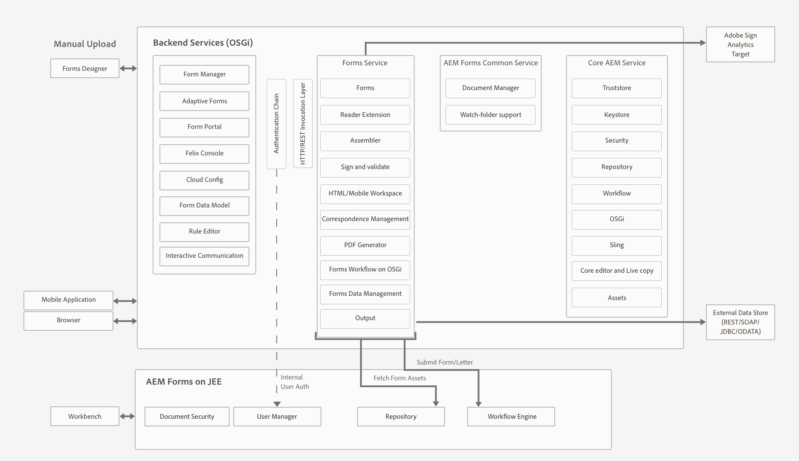
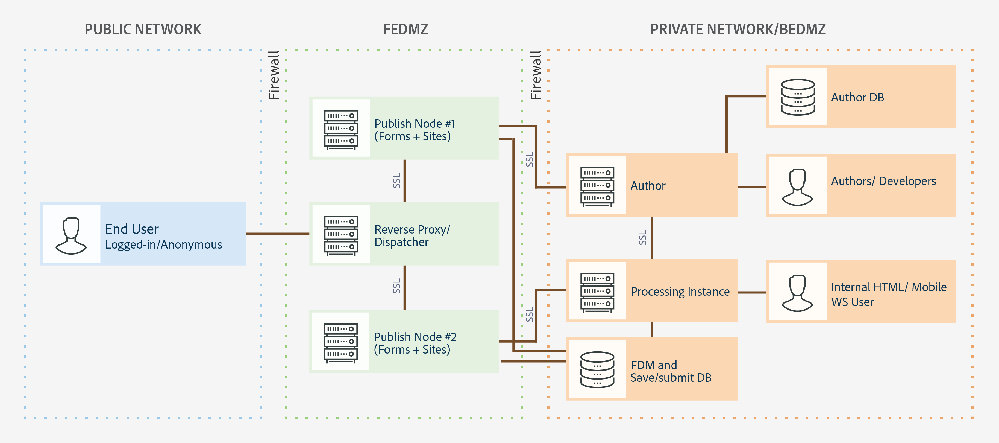
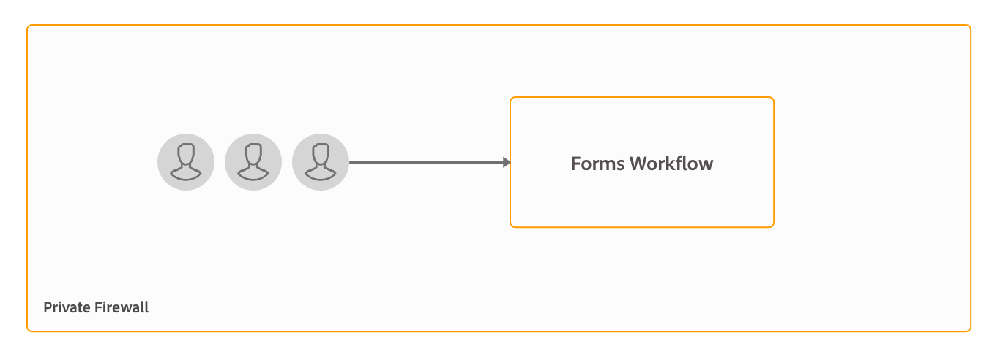
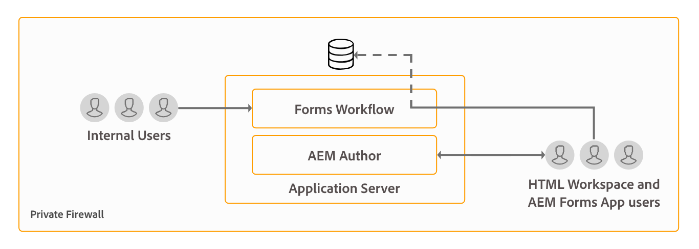
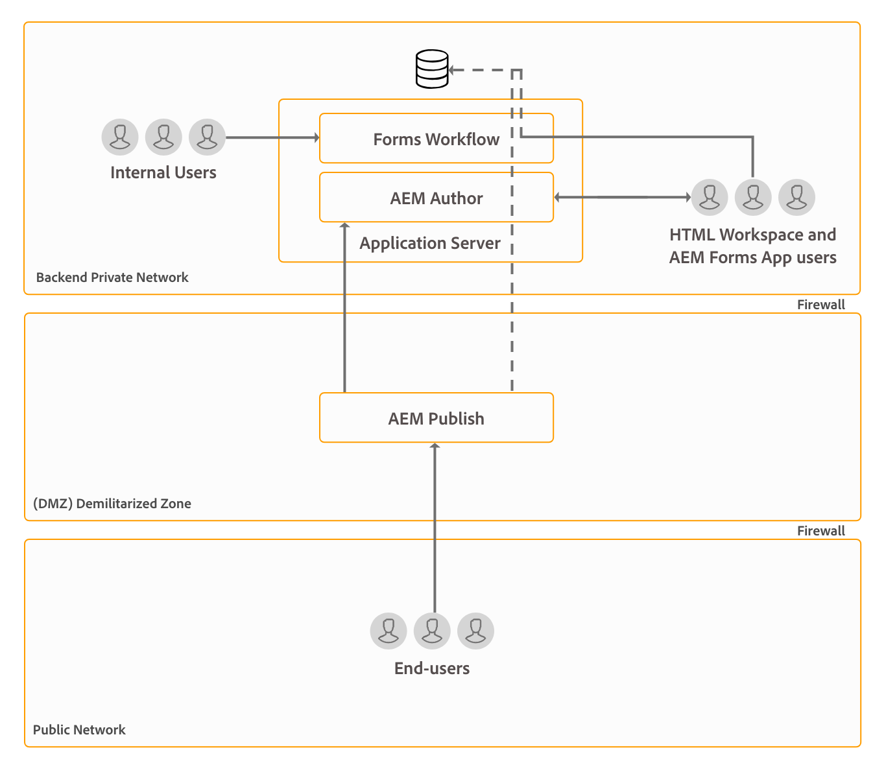
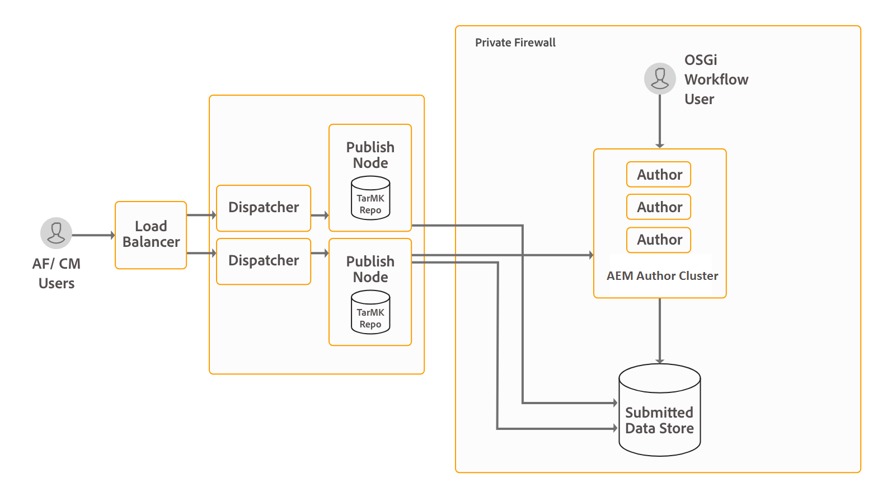
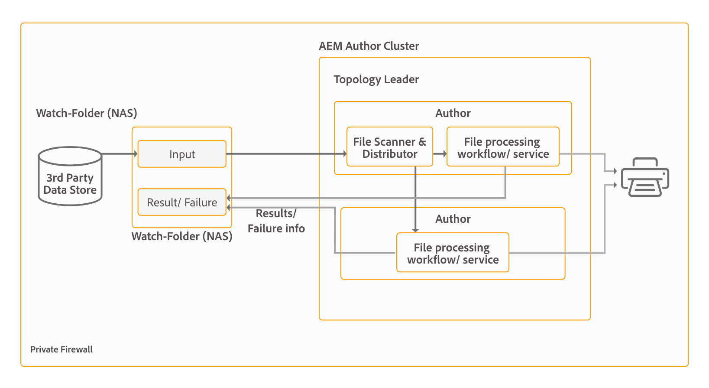
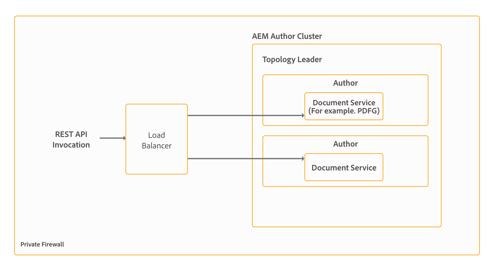

# Architecture and deployment topologies for AEM Forms {#architecture-and-deployment-topologies-for-aem-forms}

| Version | Article link |
| -------- | ---------------------------- |
| AEM as a Cloud Service |    [Click here](https://experienceleague.adobe.com/docs/experience-manager-cloud-service/content/forms/forms-overview/aem-forms-cloud-service-architecture.html)                  |
| AEM 6.5     | This article         |

## Architecture {#architecture}

AEM Forms is an application deployed into AEM as an AEM package. The package is known as AEM Forms add-on package. The AEM Forms add-on package contains both services (API providers), which are deployed into the AEM OSGi container, and servlets or JSPs (providing both front-end and REST API functionality) managed by the AEM Sling framework. The following diagram depicts this set-up:

The architecture for AEM Forms includes the following components:

* **Core AEM services:** Basic services that AEM provides to a deployed application. These services include a JCR-compliant content repository, an OSGI service container, a workflow engine, a trust store, a key store, and so on. These services are available to AEM Forms application but are not provided by AEM Forms packages. These services are an integral part of the overall AEM stack and various AEM Forms components use these services.
* **Forms services:** Provide forms-related functionality, such as create, assemble, distribute, and archive PDF documents, add digital signatures to limit access to documents, and decode barcoded forms. These services are publicly available for consumption by custom code co-deployed in AEM.
* **Web layer:** JSPs or servlets, built over common and forms services, which provide the following functionalities:

    * **Authoring frontend**: A forms authoring and forms management user interface for authoring and managing forms.
    * **Form rendition and submission frontend**: An end user facing interface for use by the end users of the AEM Forms (for example, citizens accessing a government website). This provides form rendition (display form in a web browser) and submission functionalities.
    * **REST APIs**: JSPs and servlets export a subset of forms services for remote consumption by HTTP-based clients, such as the forms mobile SDK.

**AEM Forms on OSGi:** An AEM Forms on OSGi environment is standard AEM Author or AEM Publish with AEM Forms package deployed on it. You can run AEM Forms on OSGi in a [single server environment, Farm, and clustered setups](/help/sites-deploying/recommended-deploys.md). Cluster setup is available only for AEM Author instances.

**AEM Forms on JEE:** AEM Forms on JEE is AEM Forms server running on JEE stack. It has AEM Author with AEM Forms add-on packages and additional AEM Forms JEE capabilities co-deployed on a single JEE stack running on an application server. You can run AEM Forms on JEE in single-server and clustered setups. AEM Forms on JEE is required only to run document security, process management, and for LiveCycle customers upgrading to AEM Forms. Here are a few additional scenarios to use AEM Forms on JEE:

* **HTML workspace support (for customers using HTML workspace):** AEM Forms on JEE enables single sign-on with Processing instances, serves certain assets rendered on Processing instances, and handles submission of forms rendered within the HTML workspace.
* **Advanced additional form/interactive communication data processing**: AEM Forms on JEE can be utilized for additionally processing form/interactive communication data (and saving the results to a suitable data store) in complex use-cases where advanced process-management capabilities are required.

AEM Forms on JEE also includes provides following supporting services to the AEM components:

* **Integrated user management:** Allows users of AEM Forms on JEE to be recognized as AEM forms on OSGi users and helps enable SSO for both OSGi and JEE users. This is required for scenarios where single sign-on between AEM forms on OSGi and AEM Forms on JEE is required (for example, HTML workspace).
* **Asset hosting:** AEM Forms on JEE can serve assets (for example, HTML5 forms) rendered on AEM Forms on OSGi.

AEM Forms authoring user interface does not support creating Document of Record (DOR), PDF Forms, and HTML5 Forms. Such assets are designed using the stand-alone Forms Designer application and uploaded individually to AEM Forms Manager. Alternatively, for AEM Forms on JEE, forms can be designed as application (in AEM Forms Workbench) assets and deployed into AEM Forms on JEE server.

AEM Forms on OSGi and AEM Forms on JEE both have workflow capabilities. You can rapidly build and deploy basic workflows for various tasks on the AEM forms on OSGi, without having to install the full-fledged Process Management capability of AEM Forms on JEE. There is some difference in the [features of Form-centric workflow on AEM Forms on OSGi and Process Management capability of AEM Forms on JEE](capabilities-osgi-jee-workflows.md). The development and management of Form-centric workflows on AEM Forms on OSGi uses the familiar AEM Workflow and AEM Inbox capabilities.

## Terminologies {#terminologies}

The following image displays various AEM Form server configurations and their components that are used in a typical AEM Forms deployment:

**Author:** An author instance is an AEM Forms server running in the standard Author run mode. It can be AEM Forms on JEE or AEM Forms on OSGi environment. It is intended for internal users, forms and interactive communication designers, and developers. It enables the following functionalities:

* **Authoring and managing forms and interactive communications:** Designers and developer can create and edit adaptive forms and interactive communications, upload other types of forms created externally, for example, forms created in Adobe Forms Designer, and manage these assets using the Forms Manager console.
* **Form and interactive communication publishing:** Assets hosted on an author instance can be published to a publish instance to perform runtime operations. Asset publishing uses AEM's replication features. Adobe recommends that a replication agent is configured on all the author instances to manually push published forms to processing instances, and another replication agent is configured on processing instances with the *On Receive* trigger enabled to automatically replicate the received forms to publish instances.

**Publish:** A publish instance is an AEM Forms server running in the standard Publish run mode. Publish instances are intended for end users of form-based applications, for example, users accessing a public website and submitting forms. It enables the following functionalities:

* Rendering and submitting Forms for end users.
* Transporting of raw submitted form data to processing instances for further processing and storage in the final system-of-record. The default implementation provided in AEM Forms achieves this using the reverse-replication capabilities of AEM. An alternative implementation is also available for directly pushing the form data to processing servers instead of saving it locally first (the latter being a pre-requisite for reverse-replication to activate). Customers having concerns about storage of potentially sensitive data on publish instances can go in for this [alternative implementation](/help/forms/using/configuring-draft-submission-storage.md), since processing instances typically lie in a more secure zone.
* Rendering and submitting interactive communications and letters: An interactive communication and letter are rendered on publish instances and corresponding data is submitted to processing instances for storage and post-processing. The data can either be saved locally on a publish instance and reverse-replicated to a processing instance (the default option) later, or pushed directly to processing instance without saving on the publish instance. The latter implementation is useful for security-conscious customers.

**Processing:** An instance of AEM Forms running in Author run mode with no users assigned to the forms-manager group. You can deploy AEM Forms on JEE or AEM Forms on OSGi as a processing instance. The users are not assigned to ensure that form authoring and management activities are not performed on the Processing instance and occur only on the Author instance. A Processing instance enables the following functionalities:

* **Processing of raw form data arriving from a Publish instance:** This is achieved primarily on a Processing instance via AEM workflows which trigger when the data arrives. The workflows can use the Form Data Model step provided out-of-the-box to archive the data or document to a suitable data store.
* **Secure storage of form data**: Processing provides a behind-the-firewall repository for raw form data which is isolated from users. Neither form designers on the Author instance nor end users on the Publish instance can access this repository.

    >[!NOTE]
    >
    >Adobe recommends using a third-party data store to save final processed data instead of using AEM repository.

* **Storage and post-processing of correspondence data arriving from a Publish instance:** AEM workflows perform the optional post-processing of the corresponding letter definitions. These workflows can save the final processed data into a suitable external data stores.

* **HTML Workspace hosting**: A processing instance hosts the frontend for HTML Workspace. HTML workspace provides the UI for associated task/group assignment for review and approval processes.

A Processing instance is configured to run in the Author run mode because:

* It enables reverse-replication of raw form data from a Publish instance. The default data storage handler requires the reverse-replication feature.
* AEM Workflows, which are the primary means of processing raw form data arriving from a Publish instance, are recommended to run on an author-style system.

## Sample physical topologies for AEM Forms on JEE {#sample-physical-topologies-for-aem-forms-on-jee}

The AEM Forms on JEE topologies recommended below are mainly for customers upgrading from LiveCycle or a previous version of AEM Forms on JEE. Adobe recommends using AEM Forms on OSGi for fresh installations. A fresh installation of AEM Forms on JEE only recommended for using Document Security and Process Management capabilities.

### Topology for using document services or document security capabilities {#topology-for-using-document-services-or-document-security-capabilities}

AEM Forms customers planning to use only document services or document security capabilities can have a topology similar to the one displayed below. This topology recommends using a single instance of AEM Forms. You can also create a cluster or farm of AEM Forms servers, if necessary. This topology is recommended when most users programmatically access capabilities of AEM Forms server and intervention through the user interface is minimum. The topology is helpful in batch processing operations of document services. For example, using output service to create hundreds of non-editable PDF documents on daily basis.

Although, AEM Forms lets you set up and run all the functionalities from a single server, yet, you should do capacity planning, load balancing, and set up dedicated servers for specific capabilities in a production environment. For example, for an environment using the PDF Generator service to convert thousands of pages a day and add digital signatures to limit access to documents, set up separate AEM Forms servers for the PDF Generator service and digital signature capabilities. It helps provide optimum performance and scale the servers independent of each other.

### Topology for using AEM Forms process management {#topology-for-using-aem-forms-process-management}

AEM Forms customers planning to use AEM Forms process management features, for example, HTML Workspace can have a topology similar to the one displayed below. The AEM Forms on JEE server can be in a single server or cluster configuration.

If you are upgrading from LiveCycle ES4, this topology closely mirrors with what you already have in LiveCycle except for the addition of AEM Author built-in to AEM Forms on JEE. Moreover, there is no change in the clustering requirements for customers performing an upgrade. If you were using AEM Forms in a clustered environment, you can continue with same in AEM 6.5 Forms. For a fresh installation of AEM Forms of JEE for using HTML Workspace, running AEM author instance built-in to the JEE environment is an additional requirement.

Form data store is a third-party data store used for storing final processed data of forms and interactive communications. This is an optional element in the topology. You can also choose to set up a processing instance and use its repository as the final system-of-record system, if necessary.

The topology is recommended to the customers planning to use AEM Forms on JEE server for process management capabilities (HTML Workspace) without using any post-processing, adaptive forms, HTML5 forms, and interactive communication capabilities.

### Topology for using adaptive forms, HTML5 forms, interactive communication capabilities {#topology-for-using-adaptive-forms-html-forms-interactive-communication-capabilities}

AEM Forms customers planning to use AEM Forms data capture capabilities, for example, adaptive forms, HTML5 Forms, PDF Forms, can have a topology similar to the one displayed below. This topology is also recommended for using interactive communication capabilities of AEM Forms.

You can make the following changes/customizations to the above-suggested topology:

* Using HTML Workspace and AEM Forms app requires an AEM author or processing instance. You can use the AEM author instance built-in to AEM Forms on JEE server instead of setting up an additional external AEM author server.
* An AEM Author or Processing instance is required only for Forms-centric workflows on OSGi, adaptive forms, forms portal, and interactive communication.
* interactive communication Agent UI is generally run within the organization. So, you can keep a publish server for Agent UI within the private network.
* AEM forms on OSGi instance built-in to AEM Forms on JEE server can also run Forms-centric workflows on OSGi and Watched Folders.

## Sample physical topologies for using AEM Forms on OSGi {#sample-physical-topologies-for-using-aem-forms-on-osgi}

### Topology for data capture, interactive communication, Form-Centric Workflow on OSGi capabilities {#topology-for-data-capture-interactive-communication-form-centric-workflow-on-osgi-capabilities}

AEM Forms customers planning to use AEM Forms data capture capabilities, for example, adaptive forms, HTML5 Forms, PDF Forms, can have a topology similar to the one displayed below. This topology is also recommended for using interactive communications and Forms-Centric Workflows on OSGi capability, for example, for using AEM Inbox and AEM Forms App for business process workflows.

### Topology for using watched folder capabilities for offline batch processing {#topology-for-using-watched-folder-capabilities-for-offline-batch-processing}

AEM Forms customers planning to use Watched Folders for batch processing can have a topology similar to the one displayed below. The topology displays a clustered environment but you decide to use a single instance or a farm of AEM Forms servers depending on the load. The third-party data source is your own system-of-record. It acts as an input source for Watched Folders. The topology also displays output in the form of a printed file. You can also store the output content to a file-system, send via email, and use other custom methods to consume output.

### Topology for using document services capabilities for offline API-based processing {#topology-for-using-document-services-capabilities-for-offline-api-based-processing}

AEM Forms customers planning to use only document services capability can have a topology similar to the one displayed below. This topology recommends using a cluster of AEM Forms on OSGi servers. This topology is recommended when most users programmatically (Using APIs) access capabilities of AEM Forms server and intervention through the user interface is minimum. The topology is quite helpful in multiple software client scenarios. For example, multiple clients using PDF Generator service to create PDF documents on demand.

Although AEM Forms lets you set up and run all the functionalities from a single server, you should do capacity planning, load balancing, and set up dedicated servers for specific capabilities in a production environment. For example, for an environment using the PDF Generator service to convert thousands of pages a day and multiple adaptive forms to capture data, set up separate AEM Forms servers for the PDF Generator service and adaptive forms capabilities. It helps provide optimum performance and scale the servers independent of each other.

