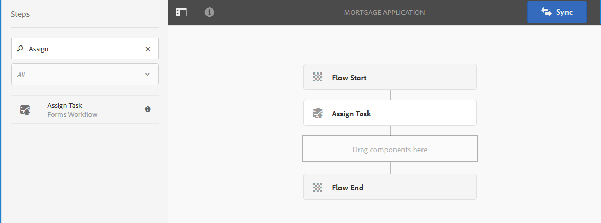
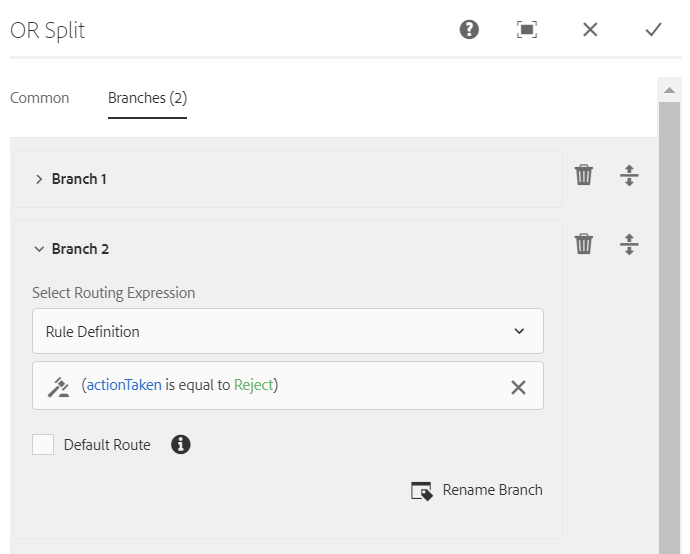

# Forms-centric workflow on OSGi{#forms-centric-workflow-on-osgi}

 

Enterprises collect data from hundreds and thousands of forms, various back-end systems, and online or offline data sources. They also have a dynamic set of users to take decisions on the data, which involves iterative review and approval processes.

Along with review and approval workflows for internal and external audiences, large organizations and businesses have repetitive tasks. For example, converting a PDF document to another format. When done manually, these tasks take up much time and resources. Enterprises also have legal requirements to digitally sign a document and archive form data for later use in pre-defined formats.

## Introduction to Forms-centric workflow on OSGi {#introduction-to-forms-centric-workflow-on-osgi}

You can use AEM Workflows to rapidly build adaptive forms-based workflows. These workflows can be used for review and approvals, business process flows, to start document services, integrate with Adobe Sign signature workflow, and similar operations. For example, credit card application processing, employee leave approval workflows, saving a form as a PDF document. Moreover, these workflows can be used within an organization or across network firewall.

With Forms-centric workflow on OSGi, you can rapidly build and deploy workflows for various tasks on the OSGi stack, without having to install the full-fledged Process Management capability on JEE stack. The development and management of workflows uses the familiar AEM Workflow and AEM Inbox capabilities. Workflows form the basis of automating real-world business processes that span multiple software systems, networks, departments, and even organizations.

Once set up, these workflows can be triggered manually to complete a defined process or run programmatically when users submit a form or [correspondence management](/help/forms/using/cm-overview.md) letter. With this enhanced AEM Workflow capabilities, AEM Forms offers two distinct, yet similar, capabilities. As part of your deployment strategy, you need to decide which one works for you. See a [comparison](capabilities-osgi-jee-workflows.md) of the Forms-centric AEM Workflows on OSGi and Process Management on JEE. Moreover, for the deployment topology see, [Architecture and deployment topologies for AEM Forms](/help/forms/using/aem-forms-architecture-deployment.md).

Forms-centric workflow on OSGi extends [AEM Inbox](/help/sites-authoring/inbox.md) and provides extra components (steps) for AEM Workflow editor to add support for AEM Forms-centric workflows. The extended AEM Inbox has functionalities similar to [AEM Forms Workspace](introduction-html-workspace.md). Along with managing human-centric workflows (Approval, Review, and so on), you can use AEM workflows to automate [document services](/help/sites-developing/workflows-step-ref.md)-related operations (for example, Generate PDF) and electronically signing (Adobe Sign) documents.

All AEM Forms workflow steps support the use of variables. Variables enable workflow steps to hold and pass metadata across steps at runtime. You can create different types of variables for storing different types of data. You can also create variable collections (array) for storing multiple instances of related, same-typed data. Typically, you use a variable or a collection of variables when you need to make a decision based on the value that it holds or to store information that you need later in a process. For more information on using variables in these Forms-centric workflow components (steps), see [Forms-centric workflow on OSGi - Step Reference](../../forms/using/aem-forms-workflow-step-reference.md). For information on creating and managing variables, see [Variables in AEM workflows](../../forms/using/variable-in-aem-workflows.md).

The following diagram depicts end-to-end procedure to create, run, and monitor a Forms-centric workflow on OSGi.


## Before you start {#before-you-start}

* A workflow is a representation of a real-world business process. Keep your real-world business process and list of the participants of the business process ready. Also, keep the collateral (adaptive forms, PDF Documents, and more) ready before start creating a workflow.
* A workflow can have multiple stages. These stages are displayed in the AEM Inbox and help report progress of the workflow. Divide your business process into logical stages.
* You can configure the assign task step of AEM Workflows to send email notifications to the users or assignees. So, [enable email notifications](#configure-email-service).
* A workflow can also use Adobe sign for digital signatures. If you plan to use Adobe Sign in a workflow, the [configure Adobe Sign for AEM Forms](../../forms/using/adobe-sign-integration-adaptive-forms.md) before using it in a workflow.

## Create a workflow model {#create-a-workflow-model}

A workflow model consists of logic and flow of a business process. It is made up of a series of the steps. These steps are AEM components. You can extend workflow steps with parameters and scripts to provide more functionality and control, as required. AEM Forms provides a few steps in addition to AEM steps available out of the box. For a detailed list of AEM and AEM Forms steps, see [AEM Workflow Step Reference](/help/sites-developing/workflows-step-ref.md) and [Forms-centric workflow on OSGi - Step Reference](../../forms/using/aem-forms-workflow.md).

AEM provides an intuitive user interface to create a workflow model using the provided workflow steps. For step-by-step instructions to create a workflow model, see [Creating Workflow Models](/help/sites-developing/workflows-models.md). The following example provides step-by-step instructions to create a workflow model for an approval and review workflow:

>[!NOTE]
>
>You must be a member of the workflow-editor group to create or edit a workflow model.

### Create a model for an approval and review workflow {#create-a-model-for-an-approval-and-review-workflow}

Approval and review workflow are for the tasks which require human intervention to make decisions. The following example creates a workflow model for a mortgage loan application to be filled by a front-office banking agent. Once the application is filled, it is sent for approval. Later on, the approved application is sent to the applicant for electronic signatures using Adobe Sign.

The example is available as a package attached below. Import and install the example using the package manager. You can also perform the following steps to manually create the workflow model for the application:

The example creates a workflow model a mortgage application to be filled by a front-office banking agent. Once filled the application is sent for approval. Later on, the approved application is sent to the customer for electronic signatures using Adobe Sign. You can import and install the example using the package manager.

[Get File](assets/example-mortgage-loan-application.zip)

1. Open the Workflow Models console. The default URL is `https://[server]:[port]/libs/cq/workflow/admin/console/content/models.html/etc/workflow/models`
1. Select **Create**, then **Create Model**. The Add Workflow Model dialog appears.
1. Enter the **Title** and **Name** (optional). For example, a mortgage application. Select **Done**.
1. Select the newly created workflow model and select **Edit**. Now, you can add workflow steps to build business logic. When you first create a workflow model, it contains:

    * The steps: Flow Start and Flow End. These steps represent the beginning and end of the workflow. These steps are required and cannot be edited or removed.
    * An example Participant step named Step 1. This step is configured to assign a work item to the admin user. Remove this step.

1. Enable email notifications. You can configure Forms-centric workflow on OSGi to send email notifications to the users or assignees. Perform the following configurations to enable email notifications:

    1. Go to AEM configuration manager at `https://[server]:[port]/system/console/configMgr`.
    1. Open the **[!UICONTROL Day CQ Mail Service]** configuration. Specify a value for the **[!UICONTROL SMTP server host name]**, **[!UICONTROL SMTP server port,]** and **[!UICONTROL "From" address]** fields. Click **[!UICONTROL Save]**.
    1. Open the **[!UICONTROL Day CQ Link Externalizer]** configuration. In the **[!UICONTROL Domains]** field, specify the actual hostname/IP address and port number for local, author, and publish instances. Click **[!UICONTROL Save]**.

1. Create workflow stages. A workflow can have multiple stages. These stages are displayed in the AEM Inbox and report progress of the workflow.

   To define a stage, select the  icon to open workflow model properties, open the **Stages** tab, add stages for the workflow model, and select **Save & Close**. For the example mortgage application, create stages: loan request, loan request status, to be signed documents, and signed loan document.

1. Drag-and-drop the **Assign Task** steps browser to the workflow model. Make it the first step of the model.

   The assign task component assigns the task, created by workflow, to a user or group. Along with assigning the task, you can use the component to specify an adaptive form or a non-interactive PDF for the task. The adaptive form is required to accept input from users and non-interactive PDF or a read-only adaptive form is used for review only workflows.

   You can also use the step to control the behavior of the task. For example, creating an automatic document of record, assign the task to a specific user or group, the path of the submitted data, the path of data to be pre-populated, and default actions. For detailed information about the options of the assign task step, see [Forms-centric workflow on OSGi - Step Reference](../../forms/using/aem-forms-workflow.md) document.

   

   For the mortgage application example, configure the assign task step to use a Read-only adaptive form and display PDF Document once the task is complete. Also, select to user group allowed to approve the loan request. On the **Actions** tab, disable the **Submit** option. Create an **actionTaken** variable of String data type and specify the variable as the **Route Variable**. For example, actionTaken. Also, add the Approve and Reject routes. The routes are displayed as separate actions (buttons) in AEM Inbox. The workflow selects a branch based on the action (button) a user taps.

   You can import the example package, available for download in the starting of the section, for the complete set of values of all the fields of the assign task step configured for example, mortgage application.

1. Drag-and-drop the OR Split component from step browser to the workflow model. The OR Split creates a split in the workflow, after which only one branch is active. This step enables you to introduce conditional processing paths into your workflow. You add workflow steps to each branch as required.

   You can define routing expression for a branch using a rule definition, ECMA script, or an external script.

   Use the expression editor to create routing expressions for Branch 1 and Branch 2. These routing expressions help choose a branch based on the user action in AEM Inbox.

   **Routing expression for Branch 1**

   When a user taps **Approve** in AEM Inbox, Branch 1 is activated.

   

   **Routing expression for Branch 2**

   When a user taps **Reject** in AEM Inbox, Branch 2 is activated.

   

   For information on creating routing expressions using variables, see [Variables in AEM Forms workflows](../../forms/using/variable-in-aem-workflows.md).

1. Add other workflow steps to build the business logic.

   For the mortgage example, add a generate document of record, two assign task steps, and a sign document step to Branch 1 of the model, as displayed in the image below. One assign task step is to display and send **to be signed loan documents to the applicant** and another assign task component is **to display signed documents**. Also, add an assign task component to branch 2. It is activated, when a user taps Reject in AEM Inbox.

   For the complete set of values of all the fields of the assign task steps, document of record step, and sign document step configured for example, mortgage application, import the example package, available for download in the starting of this section.

   The workflow model is ready. You can launch the workflow through various methods. For details, see [Launch a Forms-centric workflow on OSGi](#launch).

   

## Create a Forms-centric Workflow Application {#create-a-forms-centric-workflow-application}

The application is the adaptive form associated with the workflow. When an application is submitted through Inbox, it launches the associated workflow. To make a Forms workflow available as an application in AEM Inbox and AEM Forms App, do the following to create a workflow application:

>[!NOTE]
>
>You must be a member of the fd-administrator group to be able to create and manage workflow applications.

1. On your AEM author instance, go to  > **[!UICONTROL Forms]** > **[!UICONTROL Manage Workflow Application]** and taps **[!UICONTROL Create]**.
1. In the Create Workflow Application window, provide inputs for the following fields, and taps **Create**. A new application is created and is listed in the Workflow Applications screen.

<table>
 <tbody>
  <tr>
   <td>Field</td>
   <td>Description</td>
  </tr>
  <tr>
   <td>Title</td>
   <td>The title is visible in AEM Inbox and helps users choose an application. Keep it descriptive. For example, Savings Account Opening Application.<br /> </td>
  </tr>
  <tr>
   <td>Name </td>
   <td>Specify the name of the application. All the characters other than alphabets, numbers, hyphens, and underscores are replaced with hyphens. </td>
  </tr>
  <tr>
   <td>Description</td>
   <td>The description is visible in AEM Inbox. Provide detailed information about the application in the description fields. For example, Purpose of the application.<br /> </td>
  </tr>
  <tr>
   <td>Adaptive Form</td>
   <td><p>Specify the path of an adaptive form. When a user starts an application, the specified adaptive form is displayed.</p> <p><strong>Note</strong>: Workflow applications do not support forms and PDF documents which are longer than one page or require scrolling on Apple iPad. When an application is opened on Apple iPad and the adaptive form or the PDF document is longer than a page, the form fields and content from the second page are lost.</p> </td>
  </tr>
  <tr>
   <td>Access Group</td>
   <td><p>Select a group. The application is visible in AEM Inbox only to the members of the selected group. The access group option makes all the groups of the workflow-users group available for selection. </p> <br /> </td>
  </tr>
  <tr>
   <td>Prefill Service</td>
   <td>Select a <a href="../../forms/using/prepopulate-adaptive-form-fields.md#aem-forms-custom-prefill-service" target="_blank">prefill service</a> for the adaptive form.<br /> </td>
  </tr>
  <tr>
   <td>Workflow Model</td>
   <td>Select a <a href="../../forms/using/aem-forms-workflow.md#create-a-workflow-model">workflow model</a> for the application. A workflow model consists of logic and flow of the business process. </td>
  </tr>
  <tr>
   <td>Data File Path</td>
   <td>Specify the path of the data file in crx-repository. The path is relative to adaptive form payload and contains the name of the data file. Always include the complete name of the file including extension, if applicable. For example, [payload]/data.xml. </td>
  </tr>
  <tr>
   <td>Attachment Path</td>
   <td>Specify the path of attachments folder in crx-repository. The attachment path is relative to payload location. For example, [payload]/data.xml. </td>
  </tr>
  <tr>
   <td>Document of Record Path</td>
   <td>Specify the path of Document of Record file in crx-repository. The path is relative to adaptive form payload location. Always include the complete name of the file including extension, if applicable. For example, [payload]/DOR/creditcard.pdf.</td>
  </tr>
 </tbody>
</table>

## Launch a Forms-centric workflow on OSGi {#launch}

You can launch or trigger a Forms-centric workflow by:

* [Submitting an application from AEM Inbox](#inbox)
* [Submitting an application from AEM Forms App](#afa)

* [Submitting an adaptive form](#af)
* [Using watched folder](#watched)

* [Submitting an interactive communication or a letter](#letter)

### Submitting an application from AEM Inbox {#inbox}

The workflow application you created is available as an application in Inbox. Users who are members of workflow-users group can fill and submit the application that triggers the associated workflow. For information about using AEM Inbox to submit applications and manage tasks, see [Manage Forms applications and tasks in AEM Inbox](../../forms/using/manage-applications-inbox.md).

### Submitting an application from AEM Forms App {#afa}

The AEM Forms app syncs with an AEM Forms server and lets you change the form data, tasks, workflow applications, and saved information (drafts/templates) in your account. For more information, see [AEM Forms app](/help/forms/using/aem-forms-app.md) and related articles.

### Submitting an adaptive form {#af}

You can configure the submit actions of an adaptive form to start a workflow on submission of the adaptive form. Adaptive forms provides the **Invoke an AEM Workflow** submit action to start a workflow on submission of an adaptive form. For detailed information about the submit action, see [Configuring the Submit action](../../forms/using/configuring-submit-actions.md). To submit an Adaptive form through the AEM Forms app, enable Sync With AEM Forms App in the adaptive form properties.

You can configure an adaptive form to sync, submit, and trigger a workflow from AEM Forms app. For details, see [working with a form](/help/forms/using/working-with-form.md).

### Using a watched folder {#watched}

An administrator (a member of fd-administrators group) can configure a network folder to run a pre-configured workflow when a user places a file (such as a PDF file) in the folder. After the workflow completes, it can save the result file to a specified output folder. Such a folder is known as [Watched Folder](../../forms/using/watched-folder-in-aem-forms.md). Perform the following procedure to configure a watched folder to launch a workflow:

1. On your AEM author instance, go to  > **[!UICONTROL Forms]** > **[!UICONTROL Configure Watched Folder]**. A list of already configured watched folders is displayed.
1. Select **[!UICONTROL New]**. A list of fields is displayed. Specify a value for the following fields to configure a Watched Folder for a workflow:

<table>
 <tbody>
  <tr>
   <td>Field</td>
   <td>Description</td>
  </tr>
  <tr>
   <td><span class="uicontrol">Name</code></td>
   <td>Specify the name of the Watched Folder. This field support only alphanumeric.</td>
  </tr>
  <tr>
   <td><span class="uicontrol">Path</code></td>
   <td>Specify the physical location of the Watched Folder. In a clustered environment, use a shared network folder that is accessible from AEM cluster node.</td>
  </tr>
  <tr>
   <td><span class="uicontrol">Process Files Using</code></td>
   <td>Select the <span class="uicontrol">Workflow </code>option. </td>
  </tr>
  <tr>
   <td><span class="uicontrol">Workflow Model</code></td>
   <td>Select a workflow model.<br /> </td>
  </tr>
  <tr>
   <td><span class="uicontrol">Output File Pattern</code></td>
   <td>Specify the directory structure for output files and directories. You can also specify a <a href="/help/forms/using/admin-help/configuring-watched-folder-endpoints.md" target="_blank">pattern for output files and directories</a>.</td>
  </tr>
 </tbody>
</table>

1. Select **Advanced**. Specify a value for the following field and taps **Create**. The Watched Folder is configured to launch a workflow. Now, whenever a file is placed in the input directory of the Watched Folder, the specified workflow is triggered.

   | Field |Description |
   |---|---|
   | Payload Mapper Filter |When you create a watched folder, it creates a folder structure in the crx-repository. The folder structure can serve as a payload to the workflow. You can write a script to map an AEM Workflow to accept inputs from the watched folder structure. An out of the box implementation is available and listed in the Payload Mapper Filter. If you do not have a custom implementation, select the default implementation. |

   The Advanced tab contains more fields. Most of these fields contain a default value. To learn about all the fields, see the [Create or Configure a watched folder](/help/forms/using/admin-help/configuring-watched-folder-endpoints.md) article.

### Submitting an interactive communication or a letter {#letter}

You can associate and execute a Forms-centric workflow on OSGi on submission of an interactive communication or a letter. In correspondence management workflows are used for post processing interactive communications and letters. For example, emailing, printing, faxing, or archiving final letters. For detailed steps, see [Post processing of interactive communications and letters](../../forms/using/submit-letter-topostprocess.md).

## Additional Configurations {#additional-configurations}

### Configure email service {#configure-email-service}

You can use the Assign Task and Send Email steps of AEM Workflows to send an email. Perform the following steps to specify email servers and other configurations required to send email:

1. Go to AEM configuration manager at `https://[server]:[port]/system/console/configMgr`.
1. Open the **[!UICONTROL Day CQ Mail Service]** configuration. Specify a value for the **[!UICONTROL SMTP server host name]**, **[!UICONTROL SMTP server port,]** and **[!UICONTROL "From" address]** fields. Click **[!UICONTROL Save]**.
1. Open the **[!UICONTROL Day CQ Link Externalizer]** configuration. In the **[!UICONTROL Domains]** field, specify the actual hostname/IP address and port number for local, author, and publish instances. Click **[!UICONTROL Save]**.

### Purge workflow instances {#purge-workflow-instances}

Minimizing the number of workflow instances increases the performance of the workflow engine, so you can regularly purge completed or running workflow instances from the repository. For detailed information see, [Regular Purging of Workflow Instances](/help/sites-administering/workflows-administering.md#regular) purging of workflow instances.

## Parameterize sensitive data to workflow variables and store in external data stores {#externalize-wf-variables}

Any data that is submitted from adaptive forms to [!DNL Experience Manager] workflows can have PII (Personally Identifiable Information) or SPD (Sensitive Personal Data) of your business' end users. However, it is not mandatory to have your data stored in [!DNL Adobe Experience Manager] [JCR  repository](https://experienceleague.adobe.com/docs/experience-manager-learn/cloud-service/underlying-technology/introduction-jcr.html). You can externalize the storage of end-user data into your managed data storage (for example, Azure blob storage) by parameterizing the information into [workflow variables](/help/forms/using/variable-in-aem-workflows.md).

In an [!DNL Adobe Experience Manager] Forms workflow, data is processed and passed through a series of workflow steps by way of workflow variables. These variables are named properties or key-value pairs that are stored in workflow instances metadata node; for example, `/var/workflow/instances/<serverid>/<datebucket>/<uniquenameof model>_<id>/data/metaData`. These workflow variables can be externalized into a separate repository other than JCR and then processed by [!DNL Adobe Experience Manager] workflows. [!DNL Adobe Experience Manager] provides API `[!UICONTROL UserMetaDataPersistenceProvider]` to store the workflow variables in your managed external storage. To know more about Using workflow variables for customer owned datastores in [!DNL Adobe Experience Manager], see [Administer workflow variables for external datastores](/help/sites-administering/workflows-administering.md#using-workflow-variables-customer-datastore).
[!DNL Adobe] provides the following [sample](https://github.com/adobe/workflow-variable-externalizer) to store variables from workflow metadata map to Azure blob storage, by using the API [UserMetaDataPersistenceProvider](https://github.com/adobe/workflow-variable-externalizer/blob/master/README.md). On the similar lines you can use the sample as a guide to use [UserMetaDataPersistenceProvider] API to externalize the workflow variables in any other data storage external to [!DNL Adobe Experience Manager] and manage the same.

>[!NOTE]
>
>When you store your workflow variables to an external data storage, refer the pointers in the [guidelines for workflows external data storage](#guidelines-workflows-external-data-storage).

### Install the workflow API sample implementation

To store workflow variables in your managed Azure blob storage:
1. Install the [sample](https://github.com/adobe/workflow-variable-externalizer) workflow API [UserMetaDataPersistenceProvider](https://github.com/adobe/workflow-variable-externalizer/blob/master/README.md) as follows:

    1. Run in the project root directory the `mvn clean install` command with Maven 3.

    1. To deploy the bundle and the content package to author, run `mvn clean install -PautoInstallPackage`.

    1. To deploy only the bundle to the author, run `mvn clean install -PautoInstallBundle`.

1. Initialize the following properties in the externalizer OSGi configuration file in the `ui.config` content package:

   ```JQL
      accountKey=""
      accountName=""
      endpointSuffix=""
      containerName=""
      protocol=""
   ```

The following are the purposes (and examples) of these properties:

* **accountKey** is the secret key to authorize access.

* **accountName** is the azure account where data has to be stored.

* **endpointSuffix**, for example, `core.windows.net`.

* **containerName** is the container in the account where the data needs to be stored. The sample assumes the container is existing.

* **protocol**, for example, `https` or `http`.

1. Configure the workflow model in [!DNL Adobe Experience Manager]. To know how to configure the workflow model for an external storage, see [Configure the workflow model](#configure-aem-wf-model).

### Configure workflow model in [!DNL Adobe Experience Manager] for external data storage {#configure-aem-wf-model}

To configure an AEM Workflow model for an external data storage:

1. Navigate to **[!UICONTROL Tools]** > **[!UICONTROL Workflow]** > **[!UICONTROL Models]**.

1. Select a model name and select **[!UICONTROL Edit]**.

1. Select the Page Information icon and select **[!UICONTROL Open Properties]**.

1. Select **[!UICONTROL Externalize workflow data storage]**.

1. Select **[!UICONTROL Save & Close]** to save the properties.

### Guidelines for AEM Workflows for external data storage {#guidelines-workflows-external-data-storage}

The following are the guidelines when you are using [!DNL Adobe Experience Manager] workflows and storing data to external data storages (for example, Microsoft Azure storage server):

* Use variables to store data while defining input and output data files and attachments in workflow model steps. Do not select **[!UICONTROL Relative to Payload]** and **[!UICONTROL Available at an absolute path]** options. The **[!UICONTROL Relative to Payload]** and **[!UICONTROL Available at an absolute path]** options do not display automatically once you [configure an [!DNL Adobe Experience Manager] workflow model for external data storage](#configure-aem-wf-model).

* Use variables to store data file and attachments while submitting an adaptive form to an AEM Workflow. Do not select **[!UICONTROL Relative to Payload]** option while submitting an adaptive form to an [!DNL Adobe Experience Manager] workflow. The **[!UICONTROL Relative to Payload]** option does not display automatically once you [configure an [!DNL Adobe Experience Manager] workflow model for external data storage](#configure-aem-wf-model).

* Do not use a custom [!DNL Adobe Experience Manager] workflow step in a workflow model to store data in the [!UICONTROL CRX DE] repository.

* When you [configure an [!DNL Adobe Experience Manager] workflow model for external data storage](#configure-aem-wf-model), do not create custom columns for [!DNL Adobe Experience Manager] [!UICONTROL Inbox] since the values of the custom columns are not fetched if the work item in the [!DNL Adobe Experience Manager] [!UICONTROL Inbox] belongs to a workflow that is marked for external storage.
