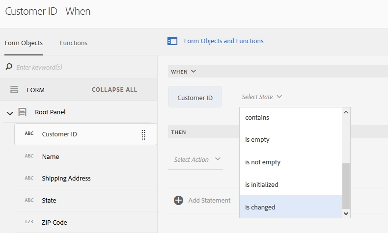
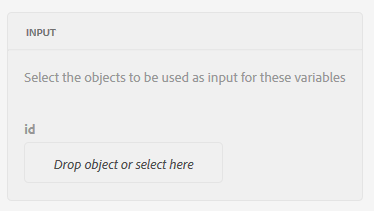
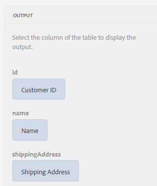
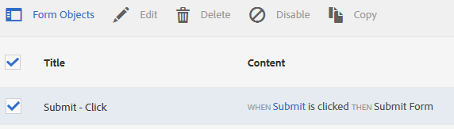
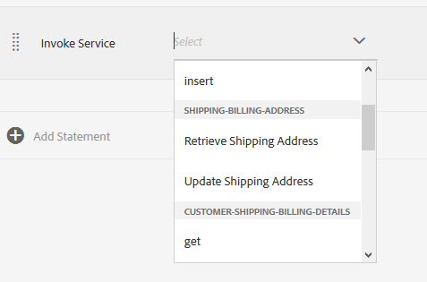
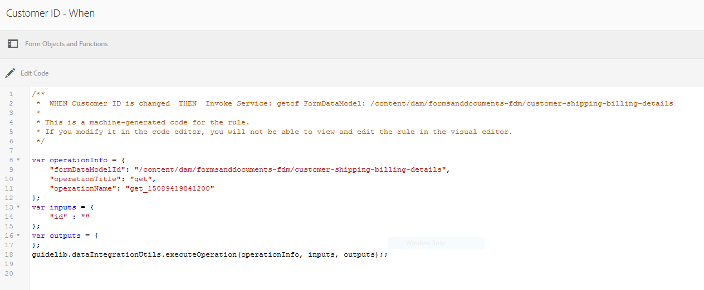

# Tutorial: Apply rules to adaptive form fields {#tutorial-apply-rules-to-adaptive-form-fields}

 

This tutorial is a step in the [Create Your First Adaptive Form](/help/forms/using/create-your-first-adaptive-form.md) series. Adobe recommends following the series in chronological sequence to understand, perform, and demonstrate the complete tutorial use case.

## About the tutorial {#about-the-tutorial}

You can use rules to add interactivity, business logic, and smart validations to an adaptive form. Adaptive forms have a built-in rule editor. The rule editor provides a drag-and-drop functionality, similar to guided tours. The drag-and-drop method is the fastest and easiest method to create rules. The rule editor also provides a code window for users interested in testing their coding skills or taking the rules to the next level.

You can learn more about the rule editor at [Adaptive Forms rule editor](/help/forms/using/rule-editor.md).

By the end of the tutorial, you will learn to create rules to:

* Invoke a Form Data Model service to retrieve data from the database
* Invoke a Form Data Model service to add data to the database
* Run a validations check and display error messages

Interactive GIF images at the end of each section of the tutorial help you learn and validate the functionality of the form you are building, on the fly.

## Step 1: Retrieve a customer record from the database {#retrieve-customer-record}

You created a form data model by following the [create form data model](/help/forms/using/create-form-data-model.md) article. Now, you can use the rule editor to invoke the Forms Data Model services to retrieve and add information to the database.

Every customer is assigned a unique Customer ID number, which helps identify relevant customer data in a database. The procedure below uses the Customer ID to retrieve information from the database:

1. Open the adaptive form for editing.

   [http://localhost:4502/editor.html/content/forms/af/change-billing-shipping-address.html](http://localhost:4502/editor.html/content/forms/af/change-billing-shipping-address.html)

1. Select the **[!UICONTROL Customer ID]** field and select the **[!UICONTROL Edit Rules]** icon. The Rule Editor window opens.
1. Select the **[!UICONTROL + Create]** icon to add a rule. It opens the Visual Editor.

   In the Visual Editor, the **[!UICONTROL WHEN]** statement is selected by default. Also, the form object (in this case, **[!UICONTROL Customer ID]**) from where you launched the rule editor is specified in the **[!UICONTROL WHEN]** statement.

1. Select the **[!UICONTROL Select State]** drop-down and select **[!UICONTROL is changed]**.

   

1. In the **[!UICONTROL THEN]** statement, select **[!UICONTROL Invoke Service]** from the **[!UICONTROL Select Action]** drop-down.
1. Select the **[!UICONTROL Retrieve Shipping Address]** service from the **[!UICONTROL Select]** drop-down.
1. Drag-and-drop the **[!UICONTROL Customer ID]** field from the Form Objects tab to the **[!UICONTROL Drop object or select here]** field in the **[!UICONTROL INPUT]** box.

   

1. Drag-and-drop the **[!UICONTROL Customer ID, Name, Shipping Address, State, and Zip Code]** field from the Form Objects tab to the **[!UICONTROL Drop object or select here]** field in the **[!UICONTROL OUTPUT]** box.

   

   Select **[!UICONTROL Done]** to save the rule. On the rule editor window, select **[!UICONTROL Close]**.

1. Preview the adaptive form. Enter an ID in the **[!UICONTROL Customer ID]** field. The form can now retrieve customer details from the database.

   

## Step 2: Add the updated customer address to the database {#updated-customer-address}

After the customer details are retrieved from the database, you can update the shipping address, state, and zip code. The procedure below invokes a Form Data Model service to update customer information to the database:

1. Select the **[!UICONTROL Submit]** field and select the **[!UICONTROL Edit Rules]** icon. The Rule Editor window opens.
1. Select the **[!UICONTROL Submit - Click]** rule and select the **[!UICONTROL Edit]** icon. The options to edit the Submit rule appear.

   

   In the WHEN option, the **[!UICONTROL Submit]** and **[!UICONTROL is clicked]** options are already selected.

   

1. In the **[!UICONTROL THEN]** option, select the **[!UICONTROL + Add Statement]** option. Select **[!UICONTROL Invoke Service]** from the **[!UICONTROL Select Action]** drop-down.
1. Select the **[!UICONTROL Update Shipping Address]** service from the **[!UICONTROL Select]** drop-down.

   

   

1.   Drag-and-drop the **[!UICONTROL Shipping Address, State, and Zip Code]** field from the [!UICONTROL Form Objects] tab to the corresponding  tablename .property (for example,  customerdetails .shippingAddress) of the **[!UICONTROL Drop object or select here]** field in the **[!UICONTROL INPUT]** box. All the fields prefixed with  tablename  (For example,  customerdetails  in this use case) serve as input data for the update service. All the content provided in these fields is updated in the data source.

     >[!NOTE]
     >
     >Do not drag-and-drop the **[!UICONTROL Name]** and **[!UICONTROL Customer ID]** fields to the corresponding tablename.property (for example, customerdetails.name). It helps avoid updating name and ID of the customer by mistake.

1. Drag-and-drop the **[!UICONTROL Customer ID]** field from the [!UICONTROL Form Objects] tab to the id field in the **[!UICONTROL INPUT]** box. Fields without a prefixed  tablename  (for example,  customerdetails  in this use case) serve as a search parameter for the update service. The **[!UICONTROL id]** field in this use case uniquely identifies a record in the  **customerdetails**  table.
1. Select **[!UICONTROL Done]** to save the rule. On the rule editor window, select **[!UICONTROL Close]**.
1. Preview the adaptive form. Retrieve details of a customer, update the shipping address, and submit the form. When you retrieve details of the same customer again, the updated shipping address is displayed.

## Step 3: (Bonus section) Use the code editor to run validations and display error messages {#step-bonus-section-use-the-code-editor-to-run-validations-and-display-error-messages}

You should run validation on the form to ensure that the data entered in the form is correct and an error message is displayed if there is incorrect data. For example, if a non-existing Customer ID is entered in the form, an error message should be displayed.

Adaptive forms provide several components with built-in validations, for example, email, and numeric fields that you can use for common use cases. Use the rule editor for advanced use cases, for example, to display an error message when the database returns zero (0) records (no records).

The following procedure shows how to create a rule to displays an error message if the Customer ID entered in the form does not exist in the database. The rule also brings the focus to and resets the **[!UICONTROL Customer ID]** field. The rule uses [the dataIntegrationUtils API of the form data model service](/help/forms/using/invoke-form-data-model-services.md) to check if the Customer ID exists in the database.

1. Select the **[!UICONTROL Customer ID]** field and select the `Edit Rules` icon. The [!UICONTROL Rule Editor] window opens.
1. Select the **[!UICONTROL + Create]** icon to add a rule. It opens the Visual Editor.

   In the Visual Editor, the **[!UICONTROL WHEN]** statement is selected by default. Also, the form object (in this case, **[!UICONTROL Customer ID]**) from where you launched the rule editor is specified in the **[!UICONTROL WHEN]** statement.

1. Select the **[!UICONTROL Select State]** drop-down and select **[!UICONTROL is changed]**.

   

   In the **[!UICONTROL THEN]** statement, select **[!UICONTROL Invoke Service]** from the **[!UICONTROL Select Action]** drop-down.

1. Switch from **[!UICONTROL Visual Editor]** to **[!UICONTROL Code Editor]**. The switch control is on the right side of the window. The Code Editor opens, displaying code similar to the following:

   

1. Replace the input variable section with the following code:

   ```javascript
   var inputs = {
       "id" : this
   };
   ```

1. Replace the `guidelib.dataIntegrationUtils.executeOperation (operationInfo, inputs, outputs)` section with the following code:

   ```javascript
   guidelib.dataIntegrationUtils.executeOperation(operationInfo, inputs, outputs, function (result) {
     if (result) {
         result = JSON.parse(result);
       customer_Name.value = result.name;
       customer_Shipping_Address = result.shippingAddress;
     } else {
       if(window.confirm("Invalid Customer ID. Provide a valid customer ID")) {
             customer_Name.value = " ";
            guideBridge.setFocus(customer_ID);
       }
     }
   });
   ```

1. Preview the adaptive form. Enter an incorrect Customer ID. An error message appears.

   
