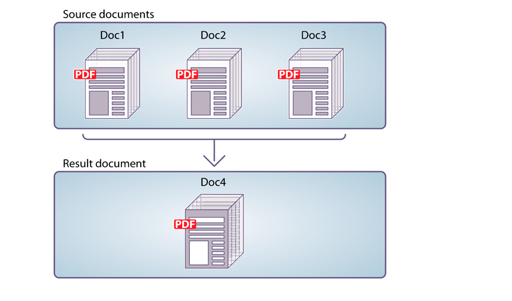
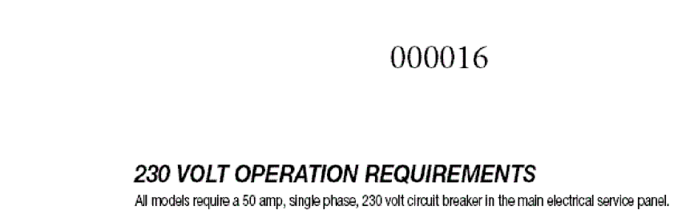
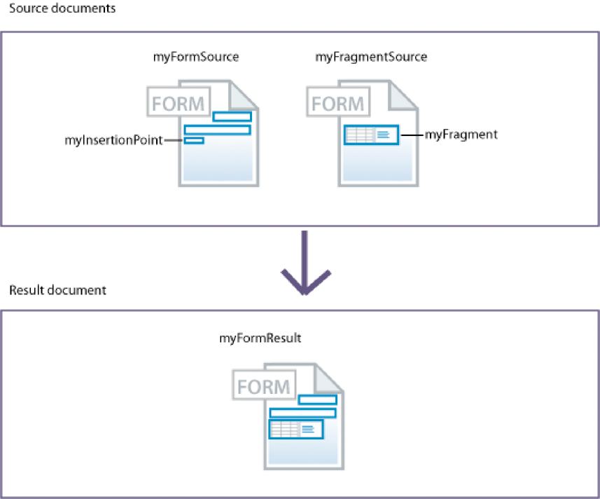
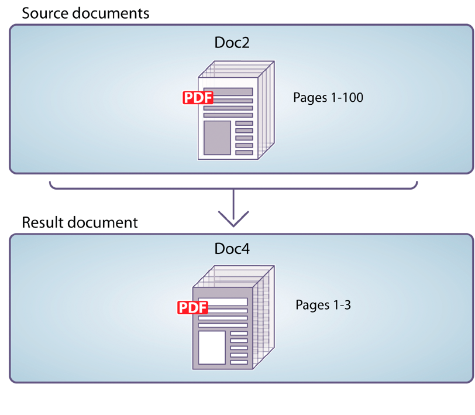
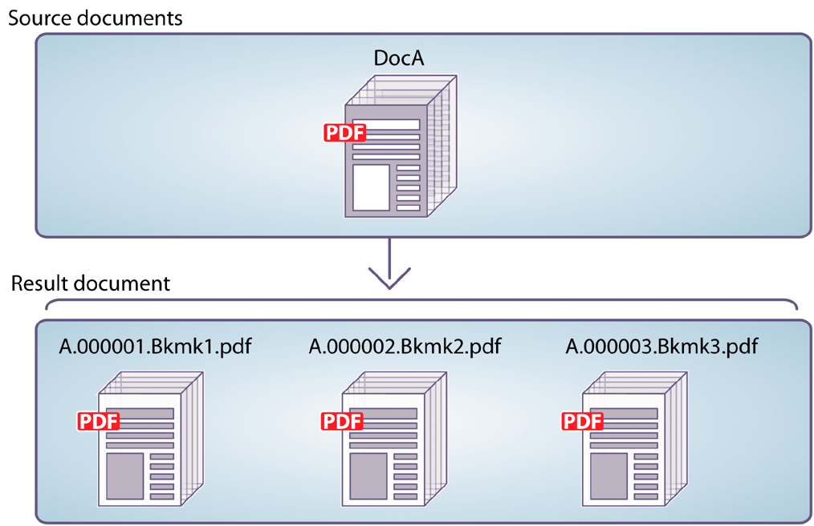

# Using Assembler Service{#using-assembler-service}

The Assembler service lets you combine, rearrange, and augment PDF and XDP documents and obtain information about PDF documents. Each job submitted to the Assembler service includes a Document Description XML (DDX) document, source documents, and external resources (strings and graphics). For more information about assembler service, see [Overview of Assembler Service](../../forms/using/overview-aem-document-services.md#p-assembler-service-p).

You can use the assemble service for the following operations:

## Assemble PDF documents {#assemble-pdf-documents}

You can use the Assembler service to assemble two or more PDF documents into a single PDF document or PDF Portfolio. You can also apply features to the PDF document that aid navigation or enhance security. Here are some of the ways you can assemble PDF documents:

### Assemble a simple PDF document {#assemble-a-simple-pdf-document}

The following illustration shows three source documents being merged into a single resultant document.



Assembling a simple PDF document from multiple PDF documents

The following example is a simple DDX document used to assemble the document. It specifies the names of the source documents used to produce the resultant document, and the name of the resultant document:

```xml
<PDF result="Doc4">
<PDF source="Doc1"/>
<PDF source="Doc2"/>
<PDF source="Doc3"/>
</PDF>
```

Document assembly produces a resultant document that contains the following content and  
characteristics:

* All or part of each source document
* All or part of the bookmarks from each source document, normalized for the assembled resultant document
* Other characteristics adopted from the base document (Doc1), including metadata, page labels, and page size
* Optionally, the resultant document includes a table of contents constructed from the bookmarks in the source documents

### Create a PDF Portfolio {#create-a-pdf-portfolio}

The Assembler service can create PDF Portfolios that contain a collection of documents and a selfcontained user interface. The interface is called a PDF Portfolio Layout or a PDF Portfolio navigator (navigator). PDF Portfolios extend the capability of PDF packages by adding a navigator, folders, and welcome pages. The interface can enhance the user experience by taking advantage of localized text string, custom color schemes, and graphic resources. The PDF Portfolio can also include folders for organizing the files in the portfolio.

When the Assembler service interprets the following DDX document, it assembles a PDF Portfolio that includes a PDF Portfolio navigator and a package of two files. The service obtains the navigator from the location specified by the myNavigator source. It changes the navigator’s default color scheme to the pinkScheme color scheme.

```xml
<DDX xmlns="https://ns.adobe.com/DDX/1.0/">
<PDF result="Untitled 1">
<Portfolio>
<Navigator source="myNavigator"/>
<ColorScheme scheme="pinkScheme"/>
</Portfolio>
<PackageFiles>
<PDF source="sourcePDF1"/>
<PDF source="sourcePDF2"/>
</PackageFiles>
</PDF>
</DDX>
```

### Assemble encrypted documents {#assemble-encrypted-documents}

When you assemble a document, you can also encrypt the PDF document with a password. After a PDF document is encrypted with a password, a user must specify the password to view the PDF document in Adobe Reader or Acrobat. To encrypt a PDF document with a password, the DDX document must contain encryption element values that are required to encrypt a PDF document.

The Encryption service does not have to be part of your LiveCycle installation to encrypt a PDF document with a password.

If one or more of the input documents is encrypted, provide a password to open the document as part of the DDX.

### Assemble documents using Bates numbering {#assemble-documents-using-bates-numbering}

When you assemble a document, you can use Bates numbering to apply a unique page identifier to each page. When you use Bates numbering, each page in the document (or set of documents) is assigned a number that uniquely identifies the page. For example, manufacturing documents that contain bill of material information and are associated with the production of an assembly can contain an identifier. A Bates number contains a sequentially incremented numeric value and an optional prefix and suffix. The prefix + numeric value + suffix is called a bates pattern.

The following illustration shows a PDF document that contains a unique identifier in the document’s header.



A PDF document that contains a unique identifier in the document’s header

### Flatten and assemble documents {#flatten-and-assemble-documents}

You can use the Assembler service to transform an interactive PDF document (for example, a form) to a non-interactive PDF document. An interactive PDF document lets users enter or modify data in the PDF document fields. The process of transforming an interactive PDF document to a non-interactive PDF document is called flattening. When a PDF document is flattened, form fields retain their graphical appearance but are no longer interactive. One reason to flatten a PDF document is to ensure that data cannot be modified. In addition, scripts associated with the fields no longer function.

When you create a PDF document that is assembled from interactive PDF documents, the Assembler service flattens those forms before assembling them into the resultant document.

>[!NOTE]
>
>The Assembler service uses the Output service to flatten dynamic XFA forms. If the Assembler service processes a DDX that requires it to flatten an XFA dynamic form and the Output service is unavailable, an exception is thrown. The Assembler service can flatten an Acrobat form or a static XFA form without using the Output service.

## Assemble XDP documents {#assemble-xdp-documents}

You can use the Assembler service to assemble multiple XDP documents into a single XDP document or into a PDF document. For source XDP files that include insertion points, you can specify the fragments to insert.

Here are some of the ways you can assemble XDP documents:

### Assemble a simple XDP document {#assemble-a-simple-xdp-document}

The following illustration shows three source XDP documents being assembled into a single resultant XDP document. The resultant XDP document contains the three source XDP documents including their associated data. The resultant document obtains basic attributes from the base document, which is the first source XDP document. 


Assembling a simple XDP document from multiple XDP documents

Here is a DDX document that produces the result illustrated above.

```xml
<DDX xmlns="https://ns.adobe.com/DDX/1.0/">
<XDP result="MyXDPResult">
<XDP source="sourceXDP1"/>
<XDP source="sourceXDP2"/>
<XDP source="sourceXDP3"/>
</XDP>
</DDX>
```

### Resolving references during assembly {#resolving-references-during-assembly}

Typically, XDP documents can contain images referenced either through absolute or relative references. Assembler service, by default, retains the references to the images in the resultant XDP document.

You can specify how the Assembler service handles the images referenced in the source XDP documents either through absolute or relative references in the XDP files when assembling. You can choose to have all the images embedded in the resultant so that it contains no relative or absolute references. You define this by setting the value of the resolveAssets tag, which can take any of the following options. By default, no references are resolved in the result document.

<table>
 <tbody> 
  <tr> 
   <th>Value</th> 
   <th>Description</th> 
  </tr> 
  <tr> 
   <td>none</td> 
   <td>Does not resolve any references.</td> 
  </tr> 
  <tr> 
   <td>all</td> 
   <td>Embeds all referenced images in the source XDP document.</td> 
  </tr> 
  <tr> 
   <td>relative</td> 
   <td>Embeds all the images referenced through relative references in the source XDP<br /> document.</td> 
  </tr> 
  <tr> 
   <td>absolute</td> 
   <td>Embeds all the images referenced through absolute references in the source XDP<br /> document.</td> 
  </tr> 
 </tbody> 
</table>

You can specify the value of the resolveAssets attribute either in the XDP source tag or in the parent XDP result tag. If the attribute is specified to the XDP result tag, it will be inherited by all the XDP source elements which are children of XDP result. However, explicitly specifying the attribute for a source element overrides the setting of the result element for that source document alone.

#### Resolve all source references in an XDP document {#resolve-all-source-references-in-an-xdp-document}

To resolve all references in the source XDP documents, specify the resolveAssets attribute for the  
resultant document to all, as in the example below:

```xml
<DDX xmlns="https://ns.adobe.com/DDX/1.0/">
<XDP result="result.xdp" resolveAssets="all">
<XDP source="input1.xdp" />
<XDP source="input2.xdp" />
<XDP source="input3.xdp" />
</XDP>
</DDX
```

You can also specify the attribute for all the source XDP documents independently to get the same  
result.

```xml
<DDX xmlns="https://ns.adobe.com/DDX/1.0/">
<XDP result="result.xdp">
<XDP source="input1.xdp" resolveAssets="all"/>
<XDP source="input2.xdp" resolveAssets="all"/>
<XDP source="input3.xdp" resolveAssets="all"/>
</XDP>
</DDX>
```

#### Resolve selected source references in an XDP document {#resolve-selected-source-references-in-an-xdp-document}

You can selectively specify the source references that you want to resolve by specifying the resolveAssets attribute for them. The attributes for individual source documents override the resultant XDP document’s setting. In this example, the fragments included are also resolved.

```xml
<DDX xmlns="https://ns.adobe.com/DDX/1.0/">
<XDP result="result.xdp" resolveAssets="all">
<XDP source="input1.xdp" >
<XDPContent source="fragment.xdp" insertionPoint="MyInsertionPoint"
fragment="myFragment"/>
</XDP>
<XDP source="input2.xdp" />
</XDP>
</DDX>
```

#### Resolve references on CRX repository {#resolve-references-on-crx-repository}

You can selectively specify the source reference that you want to resolve by giving the crx path of the
fragment reference in the XDP source. In the example given below, the fragments included are also
resolved.

```xml
<DDX xmlns="http://ns.adobe.com/DDX/1.0/"
xmlns:xsi="http://www.w3.org/2001/XMLSchema-instance"
xsi:schemaLocation="http://ns.adobe.com/DDX/1.0/ coldfusion_ddx.xsd">
<XDP result="stitched.xdp">
<XDP source="crx:///content/dam/formsanddocuments/test-xdp/sample.xdp" />
</XDP>
</DDX>
```

#### Selectively resolve absolute or relative references {#selectively-resolve-absolute-or-relative-references}

You can selectively resolve absolute or relative references in all or some of the source documents, as shown in the example below:

```xml
<DDX xmlns="https://ns.adobe.com/DDX/1.0/">
<XDP result="result.xdp" resolveAssets="absolute">
<XDP source="input1.xdp" />
<XDP source="input2.xdp" />
</XDP>
</DDX
```

### Dynamically insert form fragments into an XFA form {#dynamically-insert-form-fragments-into-an-xfa-form}

You can use the Assembler service to create an XFA form that is created from another XFA form that fragments are inserted into. Using this feature, you can use fragments to create multiple forms.

Support for dynamic insertion of form fragments supports single-source control. You maintain a single source of commonly used components. For example, you can create a fragment for your company banner. If the banner changes, you only have to modify the fragment. The other forms that include the fragment are unchanged.

Form designers use LiveCycle Designer to create form fragments. These fragments are uniquely named subforms within an XFA form. The form designers also use Designer to create XFA forms that have uniquely named insertion points. You (the programmer) write DDX documents that specify how fragments are inserted into the XFA form.

The following illustration shows two XML forms (XFA templates). The form on the left contains an insertion point named myInsertionPoint. The form on the right contains a fragment named myFragment.



Inserting form fragments into an XFA form

When the Assembler service interprets the following DDX document, it creates an XML form that contains another XML form. The myFragment subform from the myFragmentSource document is inserted at the myInsertionPoint in the myFormSource document.

```xml
<DDX xmlns="https://ns.adobe.com/DDX/1.0/">
<XDP result="myFormResult">
<XDP source="myFormSource">
<XDPContent fragment="myFragment" insertionPoint="myInsertionPoint"
source="myFragmentSource"/>
</XDP>
</XDP>
</DDX
```

### Package an XDP document as PDF {#package-an-xdp-document-as-pdf}

You can use the Assembler service to package an XDP document as a PDF document, as shown in this DDX document.

```xml
<DDX xmlns="https://ns.adobe.com/DDX/1.0/">
<PDF result="Untitled 1" encryption="passEncProfile1">
<XDP>
<XDP source="sourceXDP3"/>
<XDP source="sourceXDP4"/>
</XDP>
</PDF>
</DDX>
```

## Disassemble PDF documents {#disassemble-pdf-documents}

You can use the Assembler service to disassemble a PDF document. The service can extract pages from the source document or divide a source document based on bookmarks. Typically, this task is useful if the PDF document was originally created from many individual documents, such as a collection of statements.

### Extract pages from a source document {#extract-pages-from-a-source-document}

In the following illustration, pages 1-3 are extracted from the source document and placed in a new resultant document.



Extracting specific pages from a source document

The following example is a DDX document used to disassemble the document.

```xml
<PDF result="Doc4">
<PDF source="Doc2" pages="1-3"/>
</PDF>
```

### Divide a source document based on bookmarks {#divide-a-source-document-based-on-bookmarks}

In the following illustration, DocA is divided into multiple resultant documents. The first level 1 bookmark on a page identifies the start of a new resultant document.



Dividing a source document based on bookmarks into multiple documents

The following example is a DDX document that uses bookmarks to disassemble a source document.

```xml
<PDFsFromBookmarks prefix="A">
<PDF source="DocA"/>
</PDFsFromBookmarks>
```

## Determine whether documents are PDF/A-compliant {#determine-whether-documents-are-pdf-a-compliant}

You can use the Assembler service to determine whether a PDF document is PDF/A-compliant. PDF/A is an archival format meant for long-term preservation of the document’s content. The fonts are embedded within the document, and the file is uncompressed. As a result, a PDF/A document is typically larger than a standard PDF document. Also, a PDF/A document does not contain audio and video content.

## Obtain information about a PDF document {#obtain-information-about-a-pdf-document}

You can use the Assembler service to obtain the following information about a PDF document:

* Text information.

    * Words on each page of the document
    * Position of each word on each page of the document
    * Sentences in each paragraph of each page of the document

* Bookmarks, including the page number, title, destination, and appearance. You can export this  
  data from a PDF document and import it into a PDF document.  

* File attachments, including file information. For page-level attachments, it also includes the  
  location of the file attachment annotation. You can export this data from a PDF document and  
  import it into a PDF document.

* Package files, including file information, folders, package, schema, and field data. You can export this data from a PDF document and import it into a PDF document.

## Validate DDX documents {#validate-ddx-documents}

You can use the Assembler service to determine whether a DDX document is valid. For example, if you upgraded from a previous LiveCycle version, validation ensures that your DDX document is valid.

## Call other services {#call-other-services}

You can use DDX documents that cause the Assembler service to call the following LiveC ycle services. The Assembler service can call only those services installed with LiveCycle.

**Reader Extensions service**: Enables Adobe Reader users to digitally sign the resultant PDF document.

**Forms service**: Merges an XDP file and XML data file to produce a PDF document that contains the filled interactive form.

**Output service**: Converts a dynamic XML form to a PDF document that contains a non-interactive form (flattens the form). The Assembler service flattens static XML forms and Acrobat forms without calling the Output service.

```xml
<?xml version="1.0" encoding="UTF-8"?>
<DDX xmlns="https://ns.adobe.com/DDX/1.0/">
<PDF result="outDoc">
<PDF source="doc1"/>
<PDF source="doc2"/>
<ReaderRights
credentialAlias="LCESCred"
digitalSignatures="true"/>
</PDF>
</DDX>
```

Using DDX and the Assembler service to call other LiveC ycle services can simplify your process diagram. It can even reduce the effort you spend customizing your workflows. (See also)
