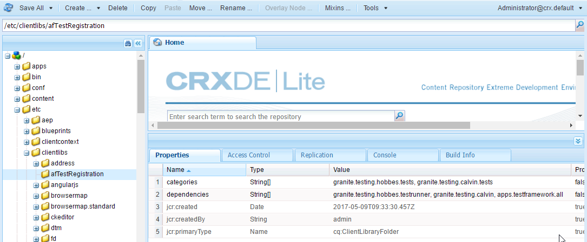
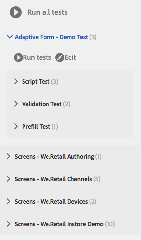
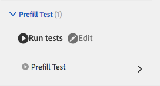
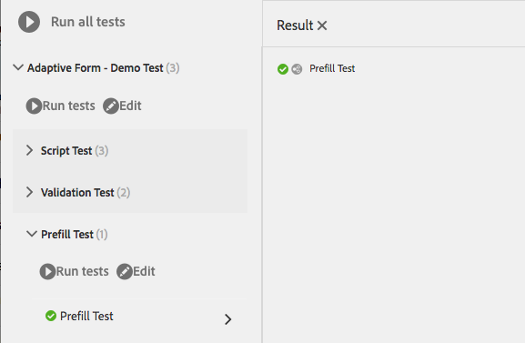

# Automate testing of adaptive forms{#automate-testing-of-adaptive-forms}

## Overview {#overview}

Adaptive forms are integral to your customer interactions. It is important to test your adaptive forms with every change you make in them, such as while rolling out a new fix pack or changing a rule in the form. However, functional testing adaptive forms and every field in them may be tedious.

Calvin allows you to automate testing of your adaptive forms in the web browser. Calvin utilizes Hobbes's user interface for running the tests and provides the following tools:

* A JavaScript API for creating tests.
* A user interface for running tests.

Using Calvin, you can create test cases in CRXDE and run UI tests directly in the web browser to thoroughly test your adaptive forms' following aspects:

<table>
 <tbody>
  <tr>
   <td><strong>Adaptive form aspect to test</strong></td>
   <td><strong>Description</strong></td>
  </tr>
  <tr>
   <td>Prefill experience of an Adaptive Form</td>
   <td>
    <ul>
     <li>Is the form being prepopulated as expected based on the type of data model?</li>
     <li>Are the default values of form objects being prefilled as expected?</li>
    </ul> </td>
  </tr>
  <tr>
   <td>Submit experience of an adaptive form</td>
   <td>
    <ul>
     <li>Is correct data being generated on submit?</li>
     <li>Is the form being re-validated on the server during submit?</li>
     <li>Is the submit action configured for the form being executed?</li>
    </ul> </td>
  </tr>
  <tr>
   <td><p>Expression Rules</p> <p> </p> </td>
   <td>
    <ul>
     <li>Are the expressions associated with form objects, such as calculate, visible, execute scripts after exiting a field, being executed after performing the relevant UI operations?<br /> </li>
    </ul> </td>
  </tr>
  <tr>
   <td>Validations</td>
   <td>
    <ul>
     <li>Are field validations executing as expected after performing the operations?</li>
    </ul> </td>
  </tr>
  <tr>
   <td><p>Lazy Loading</p> <p> </p> </td>
   <td>
    <ul>
     <li>On click of tabs (or any navigation item of a panel), is the HTML being fetched from server as per lazy loading configuration?</li>
    </ul></td>
  </tr>
  <tr>
   <td><p>UI Interaction</p> </td>
   <td>
    <ul>
     <li>Testing UI interaction with Adaptive Form objects</li>
    </ul> </td>
  </tr>
 </tbody>
</table>

### Prerequisites {#prerequisites}

Before using this article to create your test cases, you need to know the following:

* Creating test suites and executing test cases using Hobbes
* Hobbes JavaScript APIs
* Calvin JavaScript APIs

## Example: Create a test suite for an adaptive form using Hobbes as testing framework {#example-create-a-test-suite-for-an-adaptive-form-using-hobbes-as-testing-framework}

The following example walks you through creation of a test suite for testing multiple adaptive forms. You need to create a separate test case for each form that you need to test. By following steps similar to the following ones and modifying the JavaScript code in step 11, you can create your own test suite to test your adaptive forms.

1. Go to CRXDE Lite in your web browser: `https://'[server]:[port]'/crx/de`.
1. Right-click the /etc/clientlibs subfolder and click **Create** &gt; **Create Node**. Enter a name (here afTestRegistration), specify the type of node as cq:ClientLibraryFolder, and click **OK.**

   The clientlibs folder contains the registration aspect of your application (JS and Init). It is recommended that you register all Hobbes test suites objects specific to a form in the clientlibs folder.

1. Specify the following property values in the newly created node (here afTestRegistration) and then click **Save All**. These properties help Hobbes recognize the folder as a test. To reuse this client library as a dependency in other client libraries, name it as granite.testing.calvin.tests.

<table>
 <tbody>
  <tr>
   <td>Property</td>
   <td>Type</td>
   <td>Value</td>
  </tr>
  <tr>
   <td><p>categories</p> </td>
   <td><p>String[]</p> </td>
   <td><p>granite.testing.hobbes.tests, granite.testing.calvin.tests</p> </td>
  </tr>
  <tr>
   <td><p>dependencies</p> </td>
   <td><p>String[]</p> </td>
   <td><p>granite.testing.hobbes.testrunner, granite.testing.calvin, apps.testframework.all</p> </td>
  </tr>
 </tbody>
</table>

   >[!NOTE]
   >
   >The granite.testing.calvin.af clientlib contains all the adaptive forms APIs. These APIs are part of the calvin namespace.

   

1. Right-click the test node (here **afTestRegistration)** and then click **Create** &gt; **Create File**. Name the file js.txt and click **OK**.
1. In the js.txt file, add the following text:

   ```javascript
   #base=.
   js.txt

   ```

1. Click **Save All** and then close the js.txt file.
1. Right-click the test node (here **afTestRegistration)** and click **Create** &gt; **Create File**. Name the file init.js and click **OK**.
1. Copy the following code to the init.js file and click **Save All**:

   ```javascript
   (function(window, hobs) {
       'use strict';
       window.testsuites = window.testsuites || {};
     // Registering the test form suite to the sytem
     // If there are other forms, all registration should be done here
       window.testsuites.testForm = new hobs.TestSuite("Adaptive Form - Demo Test", {
           path: '/etc/clientlibs/afTestRegistration/init.js',
           register: true
       });
    // window.testsuites.testForm1 = new hobs.TestSuite("testForm1");
   }(window, window.hobs));
   ```

   The above code creates a test suite named **Adaptive Form - Demo Test**. To create a test suite with a different name, change the name accordingly.

1. Click **Create** > **Create Node** to create a node under the clientlib folder for each form that you want to test. This example uses a node named **testForm** to test an adaptive form named **testForm**. Specify the following properties and click **OK**:

    * Name: testForm (your form name)
    * Type: cq:ClientLibraryFolder

1. Add the following properties to the newly created node (here testForm) to test an adaptive form:

   | **Property** |**Type** |**Value** |
   |---|---|---|
   | categories |String[] |granite.testing.hobbes.tests, granite.testing.hobbes.tests.testForm |
   | dependencies |String[] |granite.testing.calvin.tests |

   >[!NOTE]
   >
   >This example uses a dependency on the client lib granite.testing.calvin.tests for better management. This example also adds a client lib category, "granite.testing.hobbes.tests.testForm" to reuse this client lib, if necessary.

   

1. Right-click the folder you have created for the test form (here testForm) and select **Create** &gt; **Create File**. Name the file scriptingTest.js and add the following code to the file and click **Save All.**

   To use the following code to test another adaptive form, change the path and name of the form in **navigateTo** (lines 11, 36, and 62) and the respective test cases. 

   ```javascript
   (function(window, hobs) {
       'use strict';

    var ts = new hobs.TestSuite("Script Test", {
           path: '/etc/clientlibs/testForm/scriptingTest.js',
     register: false
    })

       .addTestCase(new hobs.TestCase("Checking execution of calculate script")
           // navigate to the testForm which is to be tested
           .navigateTo("/content/forms/af/testForm.html?wcmmode=disabled")
           // check if adaptive form is loaded
           .asserts.isTrue(function () {
               return calvin.isFormLoaded()
           })
           .execSyncFct(function () {
               // create a spy before checking for the expression
               calvin.spyOnExpression("panel1.textbox1");
               // setValue would trigger enter, set the value and exit from the field
               calvin.setValueInDOM("panel1.textbox", "5");
           })
           // if the calculate expression was setting "textbox1" value to "5", let's also check that
           .asserts.isTrue(function () {
               return calvin.isExpressionExecuted("panel1.textbox1", "Calculate");
           })
           .execSyncFct(function () {
               calvin.destroySpyOnExpression("panel1.textbox1");
           })
           .asserts.isTrue(function () {
               return calvin.model("panel1.textbox1").value == "5"
           })
       )

       .addTestCase(new hobs.TestCase("Calculate script Test")
           // navigate to the testForm which is to be tested
           .navigateTo("/content/forms/af/cal/demoform.html?wcmmode=disabled&dataRef=crx:///content/forms/af/cal/prefill.xml")
           // check if adaptive form is loaded
           .asserts.isTrue(function () {
               return calvin.isFormLoaded()
           })

           .execSyncFct(function () {
               // create a spy before checking for the expression
               calvin.spyOnExpression("panel2.panel1488218690733.downPayment");
               // setValue would trigger enter, set the value and exit from the field
               calvin.setValueInDOM("panel2.panel1488218690733.priceProperty", "1000000");
           })
           .asserts.isTrue(function () {
               return calvin.isExpressionExecuted("panel2.panel1488218690733.downPayment", "Calculate");
           })
           .execSyncFct(function () {
               calvin.destroySpyOnExpression("panel2.panel1488218690733.downPayment");
           })
           .asserts.isTrue(function () {
               // if the calculate expression was setting "downPayment" value to "10000", let's also check that
      return calvin.model("panel2.panel1488218690733.downPayment").value == 10000
           })
       )

       .addTestCase(new hobs.TestCase("Checking execution of Value commit script")
           // navigate to the testForm which is to be tested
           .navigateTo("/content/forms/af/cal/demoform.html?wcmmode=disabled&dataRef=crx:///content/forms/af/cal/prefill.xml")
           // check if adaptive form is loaded
           .asserts.isTrue(function () {
               return calvin.isFormLoaded()
           })

           .execSyncFct(function () {
               // create a spy before checking for the expression
               calvin.spyOnExpression("panel2.panel1488218690733.priceProperty");
               // setValue would trigger enter, set the value and exit from the field
               calvin.setValueInDOM("panel2.panel1488218690733.priceProperty", "100");
           })
           .asserts.isTrue(function () {
               return calvin.isExpressionExecuted("panel2.panel1488218690733.priceProperty", "Value Commit");
           })
           .execSyncFct(function () {
               calvin.destroySpyOnExpression("panel2.panel1488218690733.priceProperty");
           })
           .asserts.isTrue(function () {
            // if the value commit expression was setting "textbox1488215618594" value to "0", let's also check that
               return calvin.model("panel2.panel1488218690733.textbox1488215618594").value == 0
           })
       );

    // register the test suite with testForm
     window.testsuites.testForm.add(ts);

    }(window, window.hobs));

   ```

   The test case is created. Proceed to run the test case to test adaptive forms through Hobbes. For steps for running the test cases, see [Executing Tests in Testing Your UI Using Automated Tests](/help/sites-developing/hobbes.md).

You can also install the package in the attached file SampleTestPackage.zip to achieve the same results as by the steps explained in Example: Create a test suite for an adaptive form using Hobbes as testing framework.

[Get File](assets/sampletestpackage.zip)

## Testing Your UI Using Automated Tests {#testing-your-ui-using-automated-tests}

### Running a Single Test Suite {#running-a-single-test-suite}

Tests Suites can be run individually. When you run a Test Suite, the page changes as the Test Cases and their Actions are executed and the results appear after completion of the test. Icons indicate the results.

A checkmark icon indicates a passed test: 

An "X" icon indicates a failed test: 

To run a Test Suite:

1. In the Tests panel, click or tap the name of the Test Case that you want to run to expand the deatils of the Actions.

   

1. Click or tap the Run tests button. 

   

1. The placeholder is replaced with page content as the test executes.

   

1. Review the results of the Test Case by tapping or clicking the description to open the Result panel. Tapping or clicking the name of your Test Case in the Result panel shows all details.

   

The steps for testing your AEM adaptive forms are similar to steps for testing your AEM UI. For more information on testing your adaptive forms, see the following topics in [Testing Your UI](/help/sites-developing/hobbes.md):

* Viewing Test Suites
* Running Multiple Tests

## Glossary {#glossary}

<table>
 <tbody>
  <tr>
   <td><strong>Term</strong></td>
   <td><strong>Description</strong></td>
  </tr>
  <tr>
   <td><p>Test suite</p> </td>
   <td><p>A test suite is a collection of related test cases.</p> </td>
  </tr>
  <tr>
   <td><p>Test case</p> </td>
   <td><p>A test case represents a task that a user performs using your UI. Add test cases to your test suite to test the activities that users perform.</p> </td>
  </tr>
  <tr>
   <td><p>Actions</p> </td>
   <td><p>Actions are methods that perform a gesture in the UI, such as clicking a button or filling an input box with a value.</p> <p>The methods of the hobs.actions.Asserts, hobs.actions.Core and hobs.utils.af classes are actions that you can use in your tests. All actions execute synchronously.</p> </td>
  </tr>
  <tr>
   <td><p>Author or publish environment</p> </td>
   <td><p>In general, forms can either be tested in author or publish environment. In case of publish environment, by default, the access to execute the test is restricted. This is because all the client libraries related to test runner lies inside the /libs in the JCR structure.</p> </td>
  </tr>
 </tbody>
</table>
