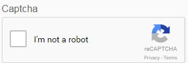

# Using CAPTCHA in adaptive forms {#using-captcha-in-adaptive-forms}

CAPTCHA (Completely Automated Public Turing test to tell Computers and Humans Apart) is a program commonly used in online transactions to distinguish between humans and automated programs or bots. It poses a challenge and evaluates user response to determine if it's a human or a bot interacting with the site. It prevents the user to proceed if the test fails and helps make online transactions secure by keeping bots from posting spam or malicious purposes.

AEM Forms supports CAPTCHA in adaptive forms. You can use reCAPTCHA service by Google to implement CAPTCHA.

>[!NOTE] {grayBox="true"}
>
>AEM Forms support only reCaptcha v2. Any other version is not supported.
>CAPTCHA in adaptive forms is not supported in offline mode on AEM Forms app.

## Configure ReCAPTCHA service by Google {#google-recaptcha}

Form authors can use the reCAPTCHA service by Google to implement CAPTCHA in adaptive forms. It offers advanced CAPTCHA capabilities to protect your site. For more information on how reCAPTCHA works, see [Google reCAPTCHA](https://developers.google.com/recaptcha/).

To implement the reCAPTCHA service in AEM Forms:

1. Obtain [reCAPTCHA API key pair](https://www.google.com/recaptcha/admin) from Google. It includes a site key and secret.
1. Create configuration container for cloud services.

    1. Go to **[!UICONTROL Tools > General > Configuration Browser]**.
    1. Do the following to enable the global folder for cloud configurations or skip this step to create and configure another folder for cloud service configurations.

        1. In the Configuration Browser, select the **[!UICONTROL global]** folder and tap **[!UICONTROL Properties]**.
        1. In the Configuration Properties dialog, enable **[!UICONTROL Cloud Configurations]**.
        1. Tap **[!UICONTROL Save & Close]** to save the configuration and exit the dialog.

    1. In the Configuration Browser, tap **[!UICONTROL Create]**.
    1. In the Create Configuration dialog, specify a title for the folder and enable **[!UICONTROL Cloud Configurations]**.
    1. Tap **[!UICONTROL Create]** to create the folder enabled for cloud service configurations.

1. Configure the cloud service for reCAPTCHA.

    1. On your AEM author instance, go to ** &gt;  Cloud Services**.
    1. Tap **[!UICONTROL reCAPTCHA]**. The Configurations page opens. Select the configuration container created in the previous step and tap **[!UICONTROL Create]**.
    1. Specify Name, Site key, and Secret Key for reCAPTCHA service and tap **[!UICONTROL Create]** to create the cloud service configuration.
    1. In the Edit Component dialog, specify the site and secret keys obtained in step 1. Tap **[!UICONTROL Save Settings]** and then tap **[!UICONTROL OK]** to complete the configuration.

   Once the reCAPTCHA service is configured, it is available for use in adaptive forms. For more information, see [Using CAPTCHA in adaptive forms](#using-captcha).

## Use CAPTCHA in adaptive forms {#using-captcha}

To use CAPTCHA in adaptive forms:

1. Open an adaptive form in edit mode.

   >[!NOTE]
   >
   >Ensure that the configuration container selected when creating the adaptive form contains the reCAPTCHA cloud service. You can also edit adaptive form properties to change the configuration container associated with the form.

1. From the component browser, drag-drop the **[!UICONTROL Captcha]** component onto the adaptive form.

   >[!NOTE]
   >
   >Using more than one Captcha component in an adaptive form is not supported. Also, it is not recommended to use CAPTCHA in a panel marked for lazy loading or in a fragment.

   >[!NOTE]
   >
   >Captcha is time-sensitive and expires in about a minute. Therefore, it is recommended to place the Captcha component just before the Submit button in the adaptive form.

1. Select the Captcha component you added and tap  to edit its properties.
1. Specify a title for the CAPTCHA widget. The default value is **Captcha**. Select **[!UICONTROL Hide title]** if you do not want title to appear.
1. From the **[!UICONTROL Captcha service]** drop-down, select **[!UICONTROL reCaptcha]** to enable reCAPTCHA service if you configured it as described in [ReCAPTCHA service by Google](#google-recaptcha). Select a configuration from the Settings drop-down. Also, select the size as **[!UICONTROL Normal]** or **[!UICONTROL Compact]** for the reCAPTCHA widget.

   >[!NOTE]
   >
   >Do not select **[!UICONTROL Default]** from the Captcha service drop-down as the default AEM CAPTCHA service is deprecated.

1. Save the properties.

The reCAPTCHA service is enabled on the adaptive form. You can preview the form and see the CAPTCHA working.
