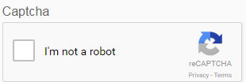
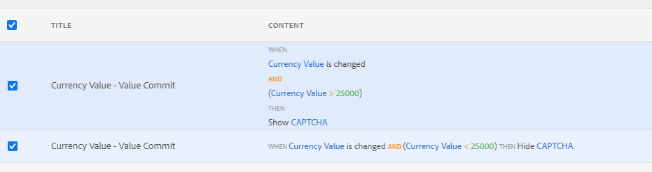
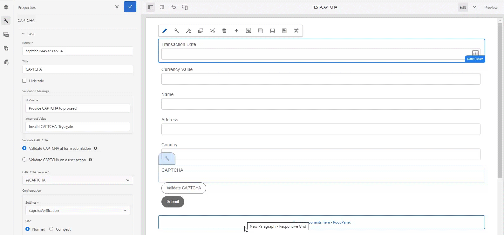

# Using CAPTCHA in adaptive forms{#using-captcha-in-adaptive-forms}

CAPTCHA (Completely Automated Public Turing test to tell Computers and Humans Apart) is a program commonly used in online transactions to distinguish between humans and automated programs or bots. It poses a challenge and evaluates user response to determine if it's a human or a bot interacting with the site. It prevents the user to proceed if the test fails and helps make online transactions secure by keeping bots from posting spam or malicious purposes.

AEM Forms supports CAPTCHA in adaptive forms. You can use reCAPTCHA service by Google to implement CAPTCHA.

>[!NOTE]
>
>* AEM Forms support only reCaptcha v2. Any other version is not supported.
>* CAPTCHA in adaptive forms is not supported in offline mode on AEM Forms app.
>

## Configure ReCAPTCHA service by Google {#google-recaptcha}

Form authors can use the reCAPTCHA service by Google to implement CAPTCHA in adaptive forms. It offers advanced CAPTCHA capabilities to protect your site. For more information on how reCAPTCHA works, see [Google reCAPTCHA](https://developers.google.com/recaptcha/).



To implement the reCAPTCHA service in AEM Forms:

1. Obtain [reCAPTCHA API key pair](https://www.google.com/recaptcha/admin) from Google. It includes a site key and secret.
1. Create configuration container for cloud services.

    1. Go to **[!UICONTROL Tools > General > Configuration Browser]**.
       * See the [Configuration Browser](/help/sites-administering/configurations.md) documentation for more information.
    1. Do the following to enable the global folder for cloud configurations or skip this step to create and configure another folder for cloud service configurations.

        1. In the Configuration Browser, select the **[!UICONTROL global]** folder and tap **[!UICONTROL Properties]**.

        1. In the Configuration Properties dialog, enable **[!UICONTROL Cloud Configurations]**.
        1. Tap **[!UICONTROL Save & Close]** to save the configuration and exit the dialog.

    1. In the Configuration Browser, tap **[!UICONTROL Create]**.
    1. In the Create Configuration dialog, specify a title for the folder and enable **[!UICONTROL Cloud Configurations]**.
    1. Tap **[!UICONTROL Create]** to create the folder enabled for cloud service configurations.

1. Configure the cloud service for reCAPTCHA.

    1. On your AEM author instance, go to  &gt; **Cloud Services**.
    1. Tap **[!UICONTROL reCAPTCHA]**. The Configurations page opens. Select the configuration container created in the previous step and tap **[!UICONTROL Create]**.
    1. Specify Name, Site key, and Secret Key for reCAPTCHA service and tap **[!UICONTROL Create]** to create the cloud service configuration.
    1. In the Edit Component dialog, specify the site and secret keys obtained in step 1. Tap **Save Settings** and then tap **OK** to complete the configuration.

   Once the reCAPTCHA service is configured, it is available for use in adaptive forms. For more information, see [Using CAPTCHA in adaptive forms](#using-captcha).

## Use CAPTCHA in adaptive forms {#using-captcha}

To use CAPTCHA in adaptive forms:

1. Open an adaptive form in edit mode.

   >[!NOTE]
   >
   >Ensure that the configuration container selected when creating the adaptive form contains the reCAPTCHA cloud service. You can also edit adaptive form properties to change the configuration container associated with the form.

1. From the component browser, drag-drop the **Captcha** component onto the adaptive form.

   >[!NOTE]
   >
   >Using more than one Captcha component in an adaptive form is not supported. Also, it is not recommended to use CAPTCHA in a panel marked for lazy loading or in a fragment.

   >[!NOTE]
   >
   >Captcha is time-sensitive and expires in about a minute. Therefore, it is recommended to place the Captcha component just before the Submit button in the adaptive form.

1. Select the Captcha component you added and tap  to edit its properties.
1. Specify a title for the CAPTCHA widget. The default value is **Captcha**. Select **Hide title** if you do not want title to appear.
1. From the **Captcha service** drop-down, select **reCaptcha** to enable reCAPTCHA service if you configured it as described in [ReCAPTCHA service by Google](#google-recaptcha). Select a configuration from the Settings drop-down. Also, select the size as **Normal** or **Compact** for the reCAPTCHA widget.

   >[!NOTE]
   >
   >Do not select **[!UICONTROL Default]** from the Captcha service drop-down as the default AEM CAPTCHA service is deprecated.

1. Save the properties.

The reCAPTCHA service is enabled on the adaptive form. You can preview the form and see the CAPTCHA working.

### Show or hide CAPTCHA component based on rules {#show-hide-captcha}

You can select to show or hide the CAPTCHA component based on rules that you apply on a component in an Adaptive Form. Tap the component, select , and tap **[!UICONTROL Create]** to create a rule. For more information on creating rules, see [Rule Editor](rule-editor.md).

For example, the CAPTCHA component must display in an Adaptive Form only if the Currency Value field in the form has a value of more than 25000.

Tap the **[!UICONTROL Currency Value]** field in the form and create the following rules:



### Validate CAPTCHA {#validate-captcha}

You can validate CAPTCHA in an Adaptive Form either when you submit the form or base the CAPTCHA validation on user actions and conditions.

#### Validate CAPTCHA on form submission {#validation-form-submission}

To validate a CAPTCHA automatically when you submit an Adaptive Form:

1. Tap the CAPTCHA component and select  to view the component properties.
1. In the **[!UICONTROL Validate CAPTCHA]** section, select **[!UICONTROL Validate CAPTCHA at form submission]**.
1. Tap  to save the component properties.

#### Validate CAPTCHA on user actions and conditions {#validate-captcha-user-action}

To validate a CAPTCHA based on conditions and user actions:

1. Tap the CAPTCHA component and select  to view the component properties.
1. In the **[!UICONTROL Validate CAPTCHA]** section, select **[!UICONTROL Validate CAPTCHA on a user action]**.
1. Tap  to save the component properties.

[!DNL Experience Manager Forms] provides `ValidateCAPTCHA` API to validate CAPTCHA using pre-defined conditions. You can invoke the API using a custom Submit Action or by defining rules on components in an Adaptive Form.

The following is an example of a `ValidateCAPTCHA` API to validate CAPTCHA using pre-defined conditions:

```javascript
if (slingRequest.getParameter("numericbox1614079614831").length() >= 5) {
    	GuideCaptchaValidatorProvider apiProvider = sling.getService(GuideCaptchaValidatorProvider.class);
        String formPath = slingRequest.getResource().getPath();
        String captchaData = slingRequest.getParameter(GuideConstants.GUIDE_CAPTCHA_DATA);
        if (!apiProvider.validateCAPTCHA(formPath, captchaData).isCaptchaValid()){
            response.setStatus(400);
            return;
        }
    }
```

The example signifies that the `ValidateCAPTCHA` API validates the CAPTCHA in the form only if number of digits in the numeric box specified by the user while filling the form is greater than 5.

**Option 1: Use [!DNL Experience Manager Forms] ValidateCAPTCHA API to validate CAPTCHA using a custom Submit Action**

Perform the following steps to use the `ValidateCAPTCHA` API to validate CAPTCHA using a custom Submit Action:

1. Add the script that includes the `ValidateCAPTCHA` API to custom Submit Action. For more on custom Submit Actions, see [Create a custom Submit Action for Adaptive Forms](custom-submit-action-form.md).
1. Select the name of the custom Submit Action from the **[!UICONTROL Submit Action]** drop-down list in **[!UICONTROL Submission]** properties of an Adaptive Form.
1. Tap **[!UICONTROL Submit]**. The CAPTCHA gets validated based on the conditions defined in `ValidateCAPTCHA` API of the custom Submit Action.

**Option 2: Use [!DNL Experience Manager Forms] ValidateCAPTCHA API to validate CAPTCHA on a user action before submitting the form**

You can also invoke `ValidateCAPTCHA` API by applying rules on a component in an Adaptive Form.

For example, you add a **[!UICONTROL Validate CAPTCHA]** button in an Adaptive Form and create a rule to invoke a service on the click of a button.

The following figure illustrates how you can invoke a service on the click of a **[!UICONTROL Validate CAPTCHA]** button:



You can invoke the custom servlet that includes `ValidateCAPTCHA` API using the rule editor and enable or disable the submit button of the Adaptive Form based on the validation result.

Similarly, you can use rule editor to include a custom method to validate CAPTCHA in an Adaptive Form.

### Add custom CAPTCHA services {#add-custom-captcha-service}

[!DNL Experience Manager Forms] provides reCAPTCHA as the CAPTCHA service. However, you can add a custom service to display in the **[!UICONTROL CAPTCHA Service]** drop-down list.  

The following is a sample implementation of the interface to add additional CAPTCHA service to your Adaptive Form:

```javascript
package com.adobe.aemds.guide.service;

import org.osgi.annotation.versioning.ConsumerType;

/**
 * An interface to provide captcha validation at server side in Adaptive Form
 * This interface can be used to provide custom implementation for different captcha services.
 */
@ConsumerType
public interface GuideCaptchaValidator {
    /**
     * This method should define the actual validation logic of the captcha
     * @param captchaPropertyNodePath path to the node with CAPTCHA configurations inside form container
     * @param userResponseToken  The user response token provided by the CAPTCHA from client-side
     *
     * @return  {@link GuideCaptchaValidationResult} validation result of the captcha
     */
     GuideCaptchaValidationResult validateCaptcha(String captchaPropertyNodePath, String userResponseToken);

    /**
     * Returns the name of the captcha validator. This should be unique among the different implementations
     * @return  name of the captcha validator
     */
     String getCaptchaValidatorName();
}
```

`captchaPropertyNodePath` refers to the resource path of the CAPTCHA component in the Sling repository. Use this property to include details specific to the CAPTCHA component. For example, `captchaPropertyNodePath` includes information for the reCAPTCHA cloud configuration configured on the CAPTCHA component. The cloud configuration information provides **[!UICONTROL Site Key]** and **[!UICONTROL Secret Key]** settings for implementing the reCAPTCHA service.

`userResponseToken` refers to the `g_recaptcha_response` that gets generated after solving a CAPTCHA in a form.

### Edit reCAPTCHA service domain {#recaptcha-service-domain}

reCAPTCHA service uses `https://www.recaptcha.net/` as the default domain. You can modify the settings to set `https://www.google.com/` or any custom domain name for loading, rendering, and validating the reCAPTCHA service.

Set the **[!UICONTROL af.cloudservices.recaptcha.domain]** property of the **[!UICONTROL Adaptive Form and Interactive Communication Web Channel Configuration]** configuration to specify `https://www.google.com/` or any other custom domain name. The following JSON file displays a sample:

```json
{
  "af.cloudservices.recaptcha.domain": "https://www.google.com/"
}
```

To set values of a configuration, [Generate OSGi Configurations using the AEM SDK](https://experienceleague.adobe.com/docs/experience-manager-cloud-service/implementing/deploying/configuring-osgi.html?lang=en#generating-osgi-configurations-using-the-aem-sdk-quickstart), and [deploy the configuration](https://experienceleague.adobe.com/docs/experience-manager-cloud-service/implementing/using-cloud-manager/deploy-code.html?lang=en#deployment-process) to your Cloud Service instance.
