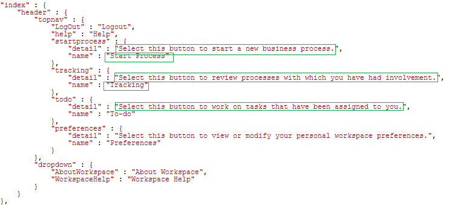

# Changing the locale of AEM Forms workspace user interface{#changing-the-locale-of-aem-forms-workspace-user-interface}

AEM Forms workspace provides out of the box support for English, French, German, and Japanese languages. It also provides capability to localize AEM Forms workspace user interface to any other language.

To localize the AEM Forms workspace user interface to the language of your choice:

* Localize text of the AEM Forms workspace.
* Localize collapsed categories, queues, and processes.
* Localize Date Picker

Before performing the above steps, ensure that you follow the steps listed at [Generic steps for AEM Forms workspace customization](../../forms/using/generic-steps-html-workspace-customization.md).

>[!NOTE]
>
>To change the language of the login screen of the AEM Forms workspace, see [Creating a login screen](../../forms/using/creating-new-login-screen.md).

## Localizing text {#localizing-text}

Perform the following steps so you can add support for a language *New* and the browser locale code *nw*.

1. Log in to CRXDE Lite.
   The default URL of CRXDE Lite is `https://'[server]:[port]'/lc/crx/de/index.jsp`.
1. Navigate to the location `apps/ws/locales` and create a folder `nw.`
1. Copy the file `translation.json`from the location `/apps/ws/locales/en-US` to location `/apps/ws/locales/nw` .
1. Navigate to `/apps/ws/locales/nw` and open `translation.json` for editing. Make locale-specific changes to the translation.json file.

   The following examples contain the translation.json file for English and French locales of the AEM Forms workspace.

    

## Localizing collapsed categories, queues, and processes {#localizing-collapsed-categories-queues-and-processes}

AEM Forms workspace uses images to display headers of categories, queues, and processes. You require a development package to localize these headers. For detailed information about creating a development package, see [Building AEM Forms workspace code.](introduction-customizing-html-workspace.md#building-html-workspace-code)

In the following steps, it is assumed that the new localized image files are *Categories_nw.png*, *Queue_nw.png*, and *Processes_nw.png*. The recommended width of the images should be set to 19 pixels.

>[!NOTE]
>
>To find the browser language locale code of your browser. Open `https://'[server]:[port]'/lc/libs/ws/Locale.html`.


To localize the images, perform the following steps:

1. Using a WebDAV client, place the image files in the */apps/ws/images* folder.
1. Navigate to */apps/ws/css*. Open *newStyle.css* for editing and add the following entries:

   ```css
   #categoryListBar .content.nw {
        background: #3e3e3e url(../images/Categories_nw.png) no-repeat 10px 10px;
    }

   #filterListBar .content.nw {
       background: #3e3e3e url(../images/Queues_nw.png) no-repeat 10px 10px;
   }

   #processNameListBar .content.nw {
       background: #3e3e3e url(../images/Processes_nw.png) no-repeat 10px 10px;
   }
   ```

1. Perform all the semantic changes listed in the [Workspace Customization](../../forms/using/introduction-customizing-html-workspace.md) article.
1. Navigate to the *js/runtime/utility* folder and open the *usersession.js* file for editing.
1. Locate the code listed in the original code block and add the condition *lang !== 'nw'* to the if statement:

   ```javascript
   // Orignal code
   setLocale = function () {
           var lang = $.trim(i18n.lng());
           if (lang === null || lang === '' || (lang !== 'fr-FR' && lang !== 'de-DE' && lang !== 'ja-JP')) {
               window.lcWorkspace.locale = 'en-US';
           } else {
               window.lcWorkspace.locale = lang;
           }
       }

   ```

   ```javascript
   //new code
    setLocale = function () {
           var lang = $.trim(i18n.lng());
           if (lang === null || lang === '' || (lang !== 'fr-FR' && lang !== 'de-DE' && lang !== 'ja-JP' && lang !== 'nw')) {
               window.lcWorkspace.locale = 'en-US';
           } else {
               window.lcWorkspace.locale = lang;
           }
       }
   ```

## Localizing Date Picker {#localizing-date-picker}

You require a development package to localize the *datepicker* API. For detailed information about creating a development package, see [Building AEM Forms workspace code](introduction-customizing-html-workspace.md#building-html-workspace-code).

1. Download and extract the [jQuery UI Package](https://jqueryui.com/download/all/), navigate to *&lt;extracted jquery UI package&gt;*\jquery-ui-1.10.2.zip\jquery-ui-1.10.2\ui\i18n.
1. Copy the jquery.ui.datepicker-nw.js file for locale code nw to apps/ws/js/libs/jqueryui and make locale-specific changes to the file.
1. Navigate to `apps/ws/js` and open the `jquery.ui.datepicker-nw.js` file for editing.
1. In the main.js file, create an alias for `jquery.ui.datepicker-nw.js.` The code to create an alias for the `jquery.ui.datepicker-nw.js` file is:

   ```javascript
   jqueryuidatepickernw : pathprefix + 'libs/jqueryui/jquery.ui.datepicker-nw'
   ```

1. Use alias `jqueryuidatepickernw` to include the `jquery.ui.datepicker-nw.js` file in all the files that use datepicker. The datepicker is used in the following files:

    * `js/runtime/views/outofoffice.js`
    * `js/runtime/views/searchtemplatedetails.js`

   The sample code below shows how to add the entry of jquery.ui.datepicker-nw.js:

   ```json
   //Original Code
   define([
       'jquery',
       'underscore',
       'backbone',
       'jqueryui',
       'jqueryuidatepickerja',
       'jqueryuidatepickerde',
       'jqueryuidatepickerfr',
       'slimscroll',
       'usersearchview',
       'logmanagerutil',
       'loggerutil'
   ], function ($, _, Backbone, jQueryUI, jQueryUIDatePickerJA, jQueryUIDatePickerDE, jQueryUIDatePickerFR, slimScroll, UserSearch, LogManager, Logger) {

   ```

   ```json
   // Code with Date Picker alias for new language
   define([
       'jquery',
       'underscore',
       'backbone',
       'jqueryui',
       'jqueryuidatepickerja',
       'jqueryuidatepickerde',
       'jqueryuidatepickerfr',
       'jqueryuidatepickernw', // Date Picker alias
       'slimscroll',
       'usersearchview',
       'logmanagerutil',
       'loggerutil'
   ], function ($, _, Backbone, jQueryUI, jQueryUIDatePickerJA, jQueryUIDatePickerDE, jQueryUIDatePickerFR, jQueryUIDatePickerNW, slimScroll, UserSearch, LogManager, Logger) {
   ```

1. In all the files that use the datepicker API, change the default datepicker API settings. The datepicker API is used in the following files:

    * apps\ws\js\runtime\views\searchtemplatedetails.js
    * apps\ws\js\runtime\views\outofoffice.js

   Change the following code to add the new locale:

   ```javascript
   if (locale === 'ja-JP') {
      $.datepicker.setDefaults($.datepicker.regional.ja);
   } else if (locale === 'de-DE') {
      $.datepicker.setDefaults($.datepicker.regional.de);
   } else if (locale === 'fr-FR') {
      $.datepicker.setDefaults($.datepicker.regional.fr);
   } else {
      $.datepicker.setDefaults($.datepicker.regional['']);
   }

   ```

   ```javascript
   if (locale === 'ja-JP') {
       $.datepicker.setDefaults($.datepicker.regional.ja);
   } else if (locale === 'de-DE') {
       $.datepicker.setDefaults($.datepicker.regional.de);
   } else if (locale === 'fr-FR') {
       $.datepicker.setDefaults($.datepicker.regional.fr);
   } else if (locale === 'nw') {
       $.datepicker.setDefaults($.datepicker.regional.nw);
   } else {
       $.datepicker.setDefaults($.datepicker.regional['']);
   }
   ```
