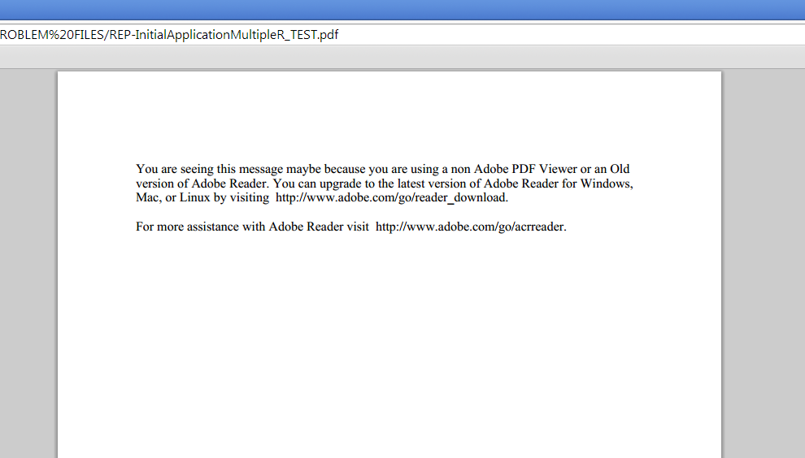

# Changing Page Zero content in Designer {#changing-page-zero-content-in-designer}

Page Zero content is displayed by default when a non-Adobe PDF viewer, such as the default PDF viewer in Chrome or Firefox, cannot read the content of the PDF/XFA form. The default Page Zero message is shown below.

AEM Forms Feature Pack 1 version of Designer allows you to change the message that is displayed on Page Zero. To change the Page Zero message, perform the following steps:

1. Ensure that you have the AEM Forms Feature Pack 1 version of Designer installed. You can check the version from the About screen of designer.  

1. Open the form for which you want to change the Page Zero content.  

1. Click **File &gt; Form Properties**.  

1. In the Form Properties dialog, click  (Plus icon) to add a custom property.  

1. Specify **_pagezerocontent** as the name of the property.
1. Add the new Page Zero message, in Rich Text format, as value. For example:

   `<body xmlns="https://www.w3.org/1999/xhtml" xmlns:xfa="https://www.xfa.org/schema/xfa-data/1.0/">
 

You are seeing this message maybe because you are using a non Adobe PDF Viewer or an Old version of Adobe Reader. You can upgrade to the latest version of Adobe Reader for Windows, Mac, or Linux by visiting  https://www.adobe.com/go/reader_download.

 

For more assistance with Adobe Reader visit  https://www.adobe.com/go/acrreader.
</body>`

1. Save the form as PDF.  

1. View the PDF form in browser to confirm that the message is updated. The example value above appears as follows:

   

>[!NOTE]
>
>The custom property you just created may not appear properly in the Form Properties dialog when you reopen the form. However, it works fine and the form displays the updated Page Zero message.

