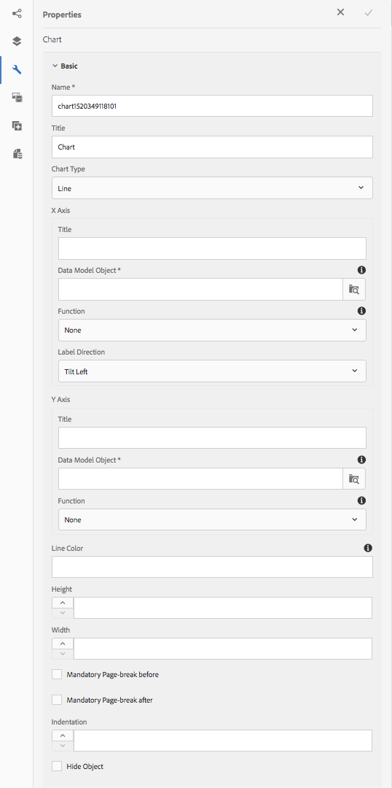
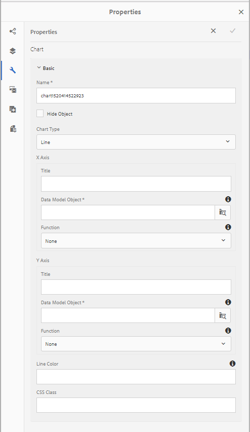
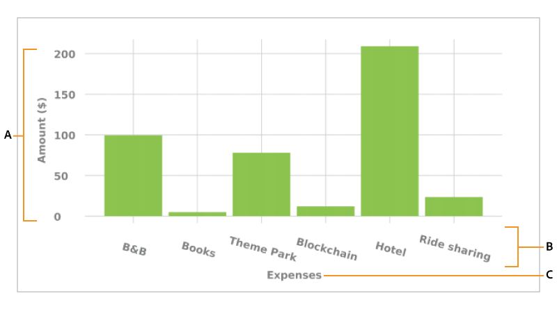
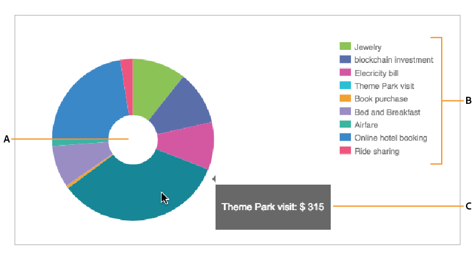
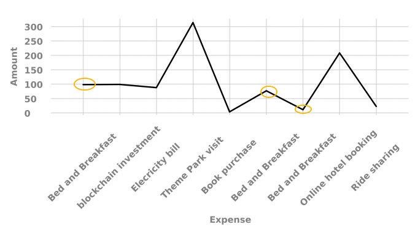
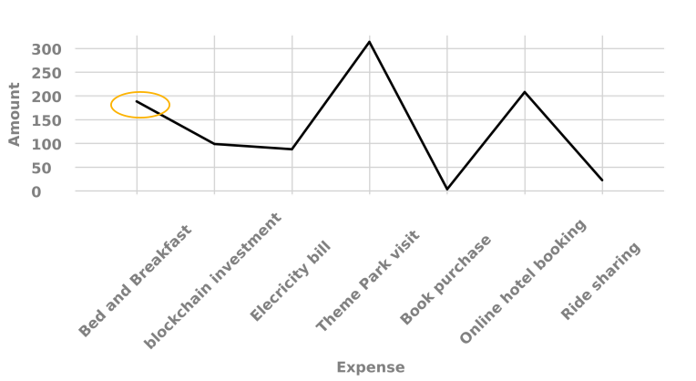
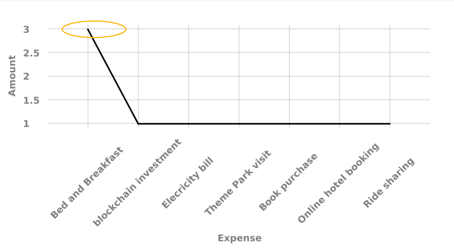
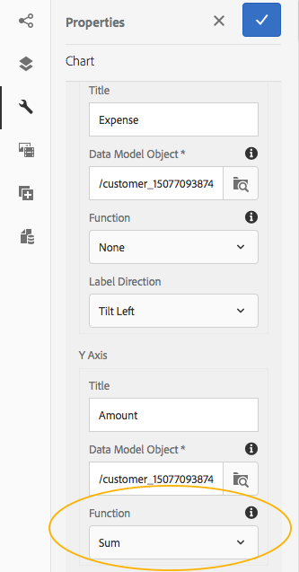

# Using charts in Interactive Communications {#using-charts-in-interactive-communications}

Using charts in an Interactive Communication, you can condense large amounts of information into an easy to analyze and understand visual format  

A chart or a graph is a visual representation of data. It condenses large amounts of information into easy-to-understand visual format, enabling the recipients of the Interactive Communication to better visualize, interpret, and analyze complex data.

While creating an Interactive Communication, you can add charts to visually represent two-dimensional data from the Interactive Communication's form data model. The Chart component allows you to add and configure the following types of charts:

* Pie
* Column  
* Donut
* Bar (Web channel only)
* Line
* Line and Point
* Point
* Area

## Add and configure chart in an Interactive Communication {#add-and-configure-chart-in-an-interactive-communication}

Complete the following steps to add a chart to an Interactive Communication:

1. From the Components in the AEM sidebar, drag and drop the Chart component in one of the following of print or web channel of an Interactive Communication:

    * Print channel: Target area and Image field
    * Web channel: Panel and Target area

   The dropped Chart component, creates a placeholder for a chart. 

1. Tap the chart component in the Interactive Communication editor and from the Component toolbar select **[!UICONTROL Configure (]** ).

   Properties sidebar appears with the Basic properties of the chart in focus. 

   
**Figure:** *Basic properties of a line type chart in print channel*

   
**Figure:** *Basic properties of a line type chart in web channel*

1. Configure the Basic properties of the chart for print channel and web channel. Apart from the common properties, there are properties that are specific to print and web channel and the chart type.

    * **[!UICONTROL Name]**: Name of the chart object. The name of the chart that you specify here does not appear in the chart output but is used in rules to refer to the chart. 
    * **[!UICONTROL Chart Type]**: Specify the chart type: Pie, Column, Donut, Line, Line and Point, Point, or Area. 
    * **[!UICONTROL Hide Object]**: Select to hide the chart in the final output. 
    * Specify the following for **[!UICONTROL x-axis]** and **[!UICONTROL y-axis]**:

        * **[!UICONTROL Title]**: Specify the titles for X and Y axis to be displayed in the Interactive Communication. 
        * **[!UICONTROL Data Model Object *]**: Browse and select data model objects for the X and Y axis of the chart from the form data model specified while creating the Interactive Communication. Choose two collection/array type properties of the same parent data model object that are meaningful in relation to each other to plot on the X and Y axis of a chart. 
        * **[!UICONTROL Function]**: To use statistical functions to compute the values on the axis, select function for X / Y axis. For more information about functions, see [Use functions in chart](#usefunction) and [Example 2: Application of sum and mean functions in a line chart](#applicationsumfrequency).

   >[!NOTE]
   >
   >For print channel, on the X axis, the data model object that you bind should be of Number, String, or Date type. On the Y axis the data model object that you bind should be of Number type. It is recommended that you use the right-side legend in the print channel.

   For more information on chart properties, see [Basic properties in charts](#basicpropertiescharts). 

1. (Print channel only) In the Agent Settings, specify whether it is mandatory for the agent to use this chart. If i **[!UICONTROL t Is Mandatory For the Agent To Use This Chart]** option is not selected, the agent can tap the eye icon for the chart in the Content tab of Agent UI to show/hide the chart. 

   

1. In the Properties sidebar, tap .

   Preview to see the appearance and data of the chart. Return to reconfigure the properties of the chart, if necessary. 

1. Return to making other changes in the Interactive Communication.

## Example 1: Chart output in print and web {#chartoutputprintweb}

In the Basic tab, you define the type of chart, the source form data model properties that contain data, the labels to be plotted on x-axis and y-axis of the chart, and optionally the statistical function to compute the values for plotting on the chart.

Let's understand in detail about the minimum required information in basic properties, with the help of a credit card statement generated using an Interactive Communication. Consider that you want to generate a chart to depict the amount of different expenses in the statement. You want to use different types of charts for print and web output of the Interactive Communication.

To accomplish this, you need to specify:

* **[!UICONTROL Chart Type]** - in this example, Column for the print channel and Donut for the web channel
* **[!UICONTROL Data Model Objects]** as source for X and Y axis of the chart - in this example, Transaction Amount for X axis and Expense name for the Y axis
* **[!UICONTROL Title]** for the X and Y axis (for Column type chart in the print channel only in this example) - in this example, Amount ($) for the X axis and Expense for the Y axis.
* **[!UICONTROL Label Direction]** (for Column type chart in the print channel only in this example) - in this example `Tilt Left`

* **[!UICONTROL Tooltip]** to display on mouse over of an expense (web channel only) - in this example `${x}: $ ${y}`, which displays as [Expense Label: $ Amount] (Example: Theme Park Visit: $ 315)


**Figure:** *Column chart in the print output of an Interactive Communication*

**A.** Y axis - Amount fetched from the form data model property and Title property set to Amount ($) **B.** Label Direction of X-axis set to Tilt Left **C.** X Axis - Expense description fetched from the form data model property and Title property set to Expense


**Figure:** *Donut chart in the web output of an Interactive Communication*

**A.** Inner Radius property of the donut is set **B.** Show Legend property is selected and Legend Position property is set to Right **C.** Tooltip displays the detail of the item on mouse over - Tooltip is set to ${x}: $ ${y}

## Example 2: Application of Sum and Frequency functions in a line chart {#applicationsumfrequency}

By applying functions in a chart, you can plot data that is not directly provided by the form data model. In this example, we use a credit card statement example to understand how Sum and Frequency functions can be applied to the chart.


**Figure:** *Line chart without a function with three "Bed and Breakfast" transactions*

### Sum function {#sum-function}

You can apply the sum function to add up values of multiple instances of same data property and show it only once. For example, in the following graph, the Sum function is applied on the Y axis to add up the amount of the three Bed and Breakfast transactions ($99.45, $78, and $12) and show only one transaction ($189.45).

Sum function can make graph more useful when you want to collate and display sum for many instances of the same data property. 

 

### Frequency function {#frequency-function}

The Frequency function returns the number of values on X or Y axis for a given value on the other axis. With application of the Frequency function on the y-axis (Amount/TransAmount), the graph displays that there have been three occurrences of Bed and Breakfast transactions and one occurrence of rest of the types of transactions. 

 

## Basic properties in charts {#basicpropertiescharts}

In the Basic tab, you can configure the following properties:

**Name** An identifier for the chart element. Name is not visible on the chart but helps when referring to the element from other components, scripts, and SOM expressions.

**Title (Print channel only)** Specifies title of the chart.

**Chart type** Specifies the type of chart you want to generate. The available options are Pie, Column, Donut, Bar (Web channel only), Line, Line and Point, Point, and Area. For more information, see Example 1: Chart output in print and web.

**X-axis > Title** Specifies the title for the x-axis.

**X-axis > Data Model Object &ast;** Specify the name of the form data model collection item to be plotted on x-axis.

**X-axis > Function** Specifies the statistical/custom function to use for computing the values on x-axis. For more information about functions, see Use functions in chart and Example 2: Application of sum and mean functions in a line chart.

**X-axis > Label Direction** Direction of the label on the chart in print channel. If you choose direction of the label as Custom Rotation, Custom Rotation Angle (degrees) field appears. In the Custom Rotation Angle (degrees) field, you can choose angle of rotation in steps of 15 degrees.

**Y-axis > Title** Specifies the title for the y-axis.

**Y-axis > Data Model Object &ast;** Specifies the form data model collection item to be plotted on y-axis. In the Print channel, the data model object for the Y-axis should be of type Number.

**Y-axis > Function** Specifies the statistical/custom function to use for computing the values on y-axis. For more information about functions, see Use functions in chart and Example 2: Application of sum and mean functions in a line chart.

**Show legend** Shows a legend for the pie or donut chart when enabled.

**Legend position** Specifies the position of the legend with respect to the chart. The available options are Right, Left, Top, and Bottom.

**Height (Print channel only)** Height of the chart in pixels.

**Width (Print channel only)** Width of the chart in pixels.

>[!NOTE]
>
>You can control width of chart in web channel using the style layer or by applying a theme.

**Tooltip (Web channel only)** Specifies the format in which the tooltip appears on mouseover on a data point in the chart in the web channel. The default value is \${x}(\${y}). Depending on the chart type, when you point the mouse on a point, bar, or slice in the chart, the variables \${x} and \${y} are dynamically replaced with the corresponding values on x-axis and y-axis and displayed in the tooltip.

To disable tool tip, leave the Tooltip field blank. This option is not applicable for Line and Area charts. For example, see [Example 1: Chart output in print and web](#chartoutputprintweb).

**CSS Class (Web channel only)** Specify the name of a CSS class in the CSS class field to apply custom styling to the chart.

**Mandatory Page Break Before (Print channel only)** Select to add a mandatory page break before the chart and put the chart on the top of a new page.

**Mandatory Page Break After (Print channel only)** Select to add a mandatory page break after the chart and put the contents following the chart on the top of a new page.

**Indentation (Print channel only)** Specify the indentation of the chart from the left of the page.

**Chart-specific configurations** In addition to common configurations, the following chart-specific configuration are available:

* **Inner radius**: available for Donut charts to specify the radius (in pixels) of the inner circle in the chart.
* **Line color**: available for Line, Line and Point, and Area charts to specify the hexadecimal value of the color for the line in the chart.
* **Point color**: available for Point and Line and Point charts to specify the hexadecimal value of the color for the points in the chart.  

* **Area color**: available for Area charts to specify the hexadecimal value of the color for the area under the line in the chart.

## Use functions in chart {#usefunction}

You can configure a chart to use statistical functions to compute values from the source data for plotting on the chart. By applying functions in a chart, you can plot data that is not directly provided by the form data model.

While the Chart component come with some in-built functions, you can write your own functions and make them available for use in the chart configuration in the Web channel.



>[!NOTE]
>
>You can use functions to compute values for either X-axis or Y-axis in a chart.

### Default functions {#default-functions}

The following functions are available by default with the Chart component:

**Mean (Average)** Returns the average of the values on X or Y axis for a given value on the other axis.

**Sum** Returns the sum of all values on X or Y axis for a given value on the other axis.

**Maximum** Returns the maximum of the values on X or Y axis for a given value on the other axis.

**Frequency** Returns the number of values on X or Y axis for a given value on the other axis.

**Range** Returns the difference between the maximum and minimum of the values on X or Y axis for a given value on the other axis.

**Median** Returns the value that separates higher and lower values in half on X or Y axis for a given value on the other axis.

**Minimum** Returns the minimum of the values on X or Y axis for a given value on the other axis.

**Mode** Returns the value with most occurrences on X or Y axis for a given value on the other axis

### Custom functions in web channel {#custom-functions-in-web-channel}

In addition to using the default functions in charts, you can write custom functions in JavaScript™ and make them available in the list of functions in the Chart component for web channel.

A function takes an array or values and a category name as inputs and returns a value. For example:

```
Multiply(valueArray, category) {
 var val = 1;
 _.each(valueArray, function(value) {
 val = val * value;
 });
 return val;
}
```

Once you have written a custom function, do the following to make it available for use in the chart configuration:

1. Add the custom function in the client library associated with the relevant Interactive Communication. For more information, see [Configuring the Submit action](/help/forms/using/configuring-submit-actions.md) and [Using Client-Side Libraries](/help/sites-developing/clientlibs.md).

1. To display the custom function in Function drop-down, in CRXDe Lite, create an `nt:unstructured` node in the apps folder with the following properties:

    * Add property `guideComponentType` with value as `fd/af/reducer`. (mandatory)
    * Add property `value` to a fully qualified name of the custom JavaScript™ function. (mandatory) and set its value to name of the custom function, such as Multiply. 
    * Add property `jcr:description` with the value you want to display as the name of the custom function that appears in the Function drop-down. For example, **Multiply**. 
    * Add property `qtip` with value that will be short description of the custom function. It appears as a tooltip when hovering pointer over the function name in the **Function** drop-down list.

1. Click **Save All** to save the configuration.

The function is now available for use in the Chart.  