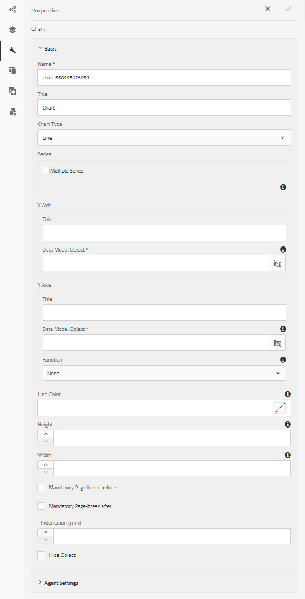
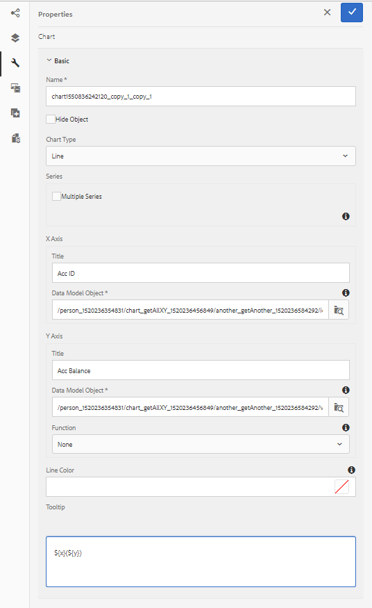
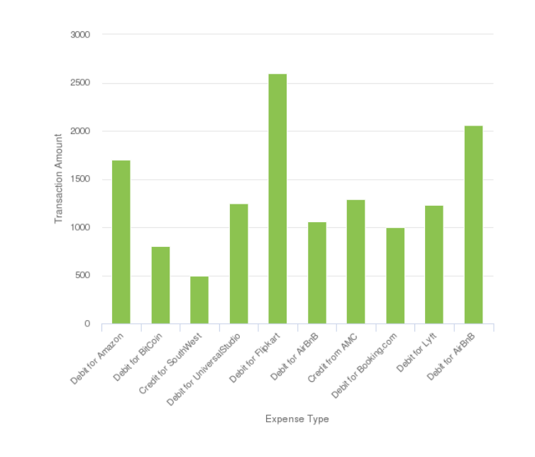
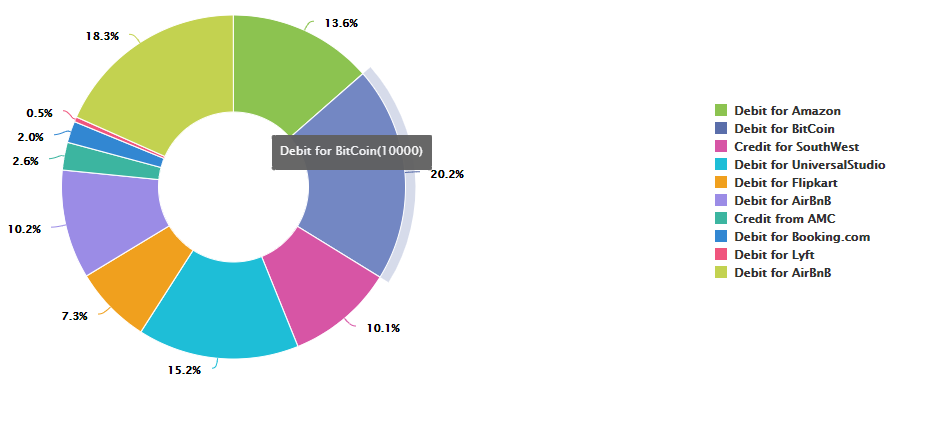
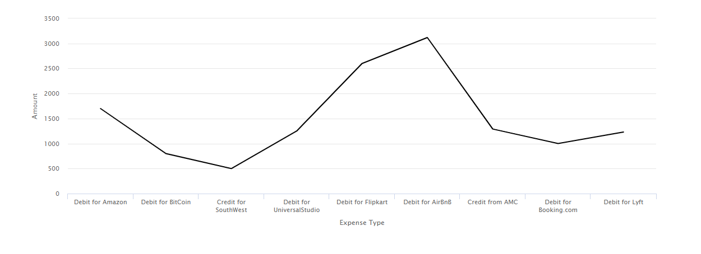

# Using charts in Interactive Communications{#using-charts-in-interactive-communications}

A chart or a graph is a visual representation of data. It condenses large amounts of information into easy-to-understand visual format, enabling the recipients of the Interactive Communication to better visualize, interpret, and analyze complex data.

While creating an Interactive Communication, you can add charts to visually represent two-dimensional data from the Interactive Communication's form data model. The Chart component lets you add and configure the following types of charts: Pie, Column, Donut, Bar, Line, Line and Point, Point, Area, and Quadrant.

## Add and configure chart in an Interactive Communication {#add-and-configure-chart-in-an-interactive-communication}

Perform the following steps to add and configure a chart in an Interactive Communication:

1. Select **Components** from the sidekick of the Interactive Communication.
1. Drag and drop the **Chart** component to one of the following components:

    * Print channel: Target area or Image field
    * Web channel: Panel or Target area

1. Select the chart component in the Interactive Communication editor and select **[!UICONTROL Configure (]** ) from the Component toolbar.

   The Chart Properties display in the left pane.

   

   Basic properties of a line type chart in print channel

   

   Basic properties of a line type chart in web channel

1. Configure the [chart properties](../../forms/using/chart-component-interactive-communications.md#configure-chart-properties) based on the channel type.
1. (Print channel only) In the **[!UICONTROL Agent Settings]**, specify if it is mandatory for the agent to use this chart. If i **[!UICONTROL t Is Mandatory For the Agent To Use This Chart]** option is not selected, the agent can select the eye icon for the chart in the **[!UICONTROL Content]** tab of Agent UI to show or hide the chart.

   

1. Select  to save the chart properties.

   Select **[!UICONTROL Preview]** to view the appearance and data associated with the chart. Select **[!UICONTROL Edit]** to reconfigure the properties of the chart.

## Configure chart properties {#configure-chart-properties}

Configure the following properties while creating charts for print and web channels:

<table>
 <tbody>
  <tr>
   <td>Field</td>
   <td>Description</td>
   <td>Channel Type</td>
  </tr>
  <tr>
   <td>Name</td>
   <td>Identifier for the chart element. The name of the chart specified in this field is not visible on the chart. It is used when referring to the element from other components, scripts, and SOM expressions.</td>
   <td>Print and Web</td>
  </tr>
  <tr>
   <td>Chart type</td>
   <td>Type of chart you want to generate. The available options are Pie, Column, Donut, Bar, Line, Line and Point, Point, and Area.</td>
   <td>Print and Web</td>
  </tr>
  <tr>
   <td>Series &gt; Multiple Series</td>
   <td>Select to add multiple series for the form data model collection items plotted on X-axis and Y-axis.</td>
   <td>Print and Web</td>
  </tr>
  <tr>
   <td>Series &gt; Data Model Object</td>
   <td>Name of the form data model collection item to add multiple series to the chart.<br /> Choose a parent form data model object property for the properties plotted on X-axis and Y-axis to form a meaningful series. The data model object that you bind must be of Number, String, or Date type.</td>
   <td>Print and Web</td>
  </tr>
  <tr>
   <td>Show Stacked</td>
   <td>Select to stack the values of each series on top of each other.</td>
   <td>Print and Web</td>
  </tr>
  <tr>
   <td>X-axis &gt; Title</td>
   <td>Title for the X-axis.</td>
   <td>Print and Web</td>
  </tr>
  <tr>
   <td>X-axis &gt; Data Model Object</td>
   <td><p>Name of the form data model collection item to be plotted on X-axis.</p> <p>Choose two collection/array type properties of the same parent data model object that are meaningful in relation to each other to plot on the X and Y-axis of a chart. The data model object that you bind must be of Number, String, or Date type.</p> </td>
   <td>Print and Web</td>
  </tr>
  <tr>
   <td>Y-axis &gt; Title</td>
   <td>Title for the Y-axis. </td>
   <td>Print and Web</td>
  </tr>
  <tr>
   <td>Y-axis &gt; Data Model Object</td>
   <td><p>Form data model collection item to be plotted on Y-axis. In the Print channel, the data model object for the Y-axis should be of Number type.</p> <p>Choose two collection/array type properties of the same parent data model object that are meaningful in relation to each other to plot on the X and Y-axis of a chart. </p> </td>
   <td>Print and Web</td>
  </tr>
  <tr>
   <td>Y-axis &gt; Function</td>
   <td>Statistical/custom function to use for computing the values on y-axis.</td>
   <td>Print and Web</td>
  </tr>
  <tr>
   <td>Hide Object</td>
   <td>Select to hide the chart in the final output.</td>
   <td>Print and Web</td>
  </tr>
  <tr>
   <td>Title</td>
   <td>Title of the chart. </td>
   <td>Print</td>
  </tr>
  <tr>
   <td>Height</td>
   <td>Height of the chart in pixels.</td>
   <td>Print</td>
  </tr>
  <tr>
   <td>Width</td>
   <td>Width of the chart in pixels. You can control width of chart in web channel using the style layer or by applying a theme.</td>
   <td>Print</td>
  </tr>
  <tr>
   <td>Mandatory Page Break Before</td>
   <td>Select to add a mandatory page break before the chart and put the chart on the top of a new page. </td>
   <td>Print</td>
  </tr>
  <tr>
   <td>Mandatory Page Break After</td>
   <td>Select to add a mandatory page break after the chart and put the contents following the chart on the top of a new page. </td>
   <td>Print</td>
  </tr>
  <tr>
   <td>Indentation</td>
   <td>Indentation of the chart from the left of the page. </td>
   <td>Print</td>
  </tr>
  <tr>
   <td>Tooltip</td>
   <td><p>Format in which the tooltip appears on mouseover on a data point in the chart in the web channel. The default value is ${x}(${y}). Depending on the chart type, when you point the mouse on a point, bar, or slice in the chart, the variables ${x}and ${y} are dynamically replaced with the corresponding values on X-axis and Y-axis and displayed in the tooltip.</p> <p>To disable tool tip, leave the <span class="uicontrol">Tooltip</code> field blank. This option is not applicable for Line and Area charts. For example, see <a href="#chartoutputprintweb">Example 1: Chart output in print and web</a>.</p> </td>
   <td>Web</td>
  </tr>
  <tr>
   <td>Chart-specific configurations</td>
   <td><p>In addition to common configurations, the following chart-specific configuration are available:</p>
    <ul>
     <li><strong>Show legend: </strong>Shows a legend for the pie or donut chart when enabled.</li>
     <li><strong>Legend position: </strong>Specifies the position of the legend with respect to the chart. The available options are Right, Left, Top, and Bottom. Use the right-side legend in the print channel.</li>
     <li><strong>Inner radius</strong>: Available for Donut charts to specify the radius (in pixels) of the inner circle in the chart.</li>
     <li><strong>Line color</strong>: Available for Line, Line and Point, and Area charts to specify the color for the line in the chart.</li>
     <li><strong>Point color</strong>: Available for Point and Line and Point charts to specify the color for the points in the chart.<br /> </li>
     <li><strong>Area color</strong>: Available for Area charts to specify the color for the area under the line in the chart.</li>
     <li><strong>Reference Point &gt; Binding Type: </strong>Available for Quadrant charts to<strong> </strong>specify the binding type for the reference point. Use static text or data model object property to define the value for the reference point.</li>
     <li><strong>Reference Point &gt; X-axis: </strong>Available for Quadrant charts if you select <span class="uicontrol">Static</code> from the Binding Type drop-down list to specify the X-axis value for the reference point.</li>
     <li><strong>Reference Point &gt; Y-axis: </strong>Available for Quadrant charts if you select <span class="uicontrol">Static</code> from the Binding Type drop-down list to specify the Y-axis value for the reference point.</li>
     <li><strong>Reference Point &gt; Data Model Object for Series: </strong>Available for multiple series Quadrant charts if you select <span class="uicontrol">Data Model Object</code> from the Binding Type drop-down list. Define the form data model object property to identify the series for the reference point. </li>
     <li><strong>Reference Point &gt; Data Model Object Value for Series: </strong>Available for multiple series Quadrant charts if you select <span class="uicontrol">Data Model Object</code> from the Binding Type drop-down list. Use the form data model object property for series and the value defined in this field to identify the series for the reference point.</li>
     <li><strong>Reference Point &gt; Data Model Object for Reference Point: </strong>Available for Quadrant charts if you select <span class="uicontrol">Data Model Object</code> from the Binding Type drop-down list. Define a form data model object property that is a sibling to the properties plotted on X-axis and Y-axis. In addition, for multiple series, define a data model object property that is a child entity of the data model object property defined for the series.</li>
     <li><strong>Reference Point &gt; Data Model Object Value for Reference Point: </strong>Available for Quadrant charts if you select <span class="uicontrol">Data Model Object</code> from the Binding Type drop-down list. Use the form data model object property for reference point and the value defined in this field to identify the reference point for the chart.<br /> <strong>Quadrant Labels &gt; Top Left:</strong> Available for Quadrant charts to specify the name for the Top Left quadrant.</li>
     <li><strong>Quadrant Labels &gt; Top Right:</strong> Available for Quadrant charts to specify the name for the Top Right quadrant.</li>
     <li><strong>Quadrant Labels &gt; Bottom Right: </strong>Available for Quadrant charts to specify the name for the Bottom Right quadrant.</li>
     <li><strong>Quadrant Labels &gt; Bottom Left: </strong>Available for Quadrant charts to specify the name for the Bottom Left quadrant.</li>
    </ul> </td>
   <td>Print and Web</td>
  </tr>
 </tbody>
</table>

## Use functions in chart {#use-functions-in-chart}

You can configure a chart to use statistical functions to compute values from the source data for plotting on the chart. By applying functions in a chart, you can plot data that is not directly provided by the form data model.


While the Chart component come with some in-built functions, you can write [custom functions](#customfunctionsweb) and make them available for use in the chart configuration in the web channel.

The following functions are available by default with the Chart component:

**Mean (Average)** Returns the average of the values on X or Y axis for a given value on the other axis.

**Sum** Returns the sum of all values on X or Y axis for a given value on the other axis.

**Maximum** Returns the maximum of the values on X or Y axis for a given value on the other axis.

**Frequency** Returns the number of values on X or Y axis for a given value on the other axis.

**Range** Returns the difference between the maximum and minimum of the values on X or Y axis for a given value on the other axis.

**Median** Returns the value that separates higher and lower values in half on X or Y axis for a given value on the other axis.

**Minimum** Returns the minimum of the values on X or Y axis for a given value on the other axis.

**Mode** Returns the value with most occurrences on X or Y axis for a given value on the other axis.

For more information, see [Example 2: Application of Sum and Frequency functions in a line chart](#applicationsumfrequency).

### Custom functions in web channel {#customfunctionsweb}

In addition to using the default functions in charts, you can write custom functions in JavaScript™ and make them available in the list of functions in the Chart component for web channel.

A function takes an array or values and a category name as inputs and returns a value. For example:

```javascript
Multiply(valueArray, category) {
 var val = 1;
 _.each(valueArray, function(value) {
 val = val * value;
 });
 return val;
}
```

Once you have written a custom function, do the following to make it available for use in the chart configuration:

1. Add the custom function in the client library associated with the relevant Interactive Communication. For more information, see [Configuring the Submit action](/help/forms/using/configuring-submit-actions.md) and [Using Client-Side Libraries](/help/sites-developing/clientlibs.md).

1. To display the custom function in Function drop-down, in CRXDe Lite, create an `nt:unstructured` node in the apps folder with the following properties:

    * Add property `guideComponentType` with value as `fd/af/reducer`. (mandatory)

    * Add property `value` to a fully qualified name of the custom JavaScript™ function. (mandatory) and set its value to name of the custom function, such as Multiply.
    * Add property `jcr:description` with the value you want to display as the name of the custom function that appears in the Function drop-down. For example, **Multiply**.

    * Add property `qtip` with value that will be short description of the custom function. It appears as a tooltip when hovering pointer over the function name in the **Function** drop-down list.

1. Click **Save All** to save the configuration.

The function is now available for use in the Chart.

## Example 1: Chart output in print and web {#chartoutputprintweb}

In the Basic tab, you define the type of chart, the source form data model properties that contain data, the labels to be plotted on X-axis and Y-axis of the chart, and optionally the statistical function to compute the values for plotting on the chart.

Let's understand in detail about the minimum required information in basic properties, with the help of a card statement generated using an Interactive Communication. Consider that you want to generate a chart to depict the amount of different expenses in the statement. You want to use different types of charts for print and web output of the Interactive Communication.

### Column chart for Print {#columnchartprint}

To accomplish this, specify the following properties:

* **[!UICONTROL Name]** - Specify the name for the chart.
* **[!UICONTROL Chart Type]** - Select **Column** from the drop-down list.
* **[!UICONTROL Title]** - Specify Expense Type for X-axis and Transaction Amount for the Y-axis.
* **[!UICONTROL Data Model Objects]** - Select the data model object properties to create data bindings for X-axis (Expense Type) and Y-axis (Transaction Amount).



Column chart in the print channel of an Interactive Communication

### Donut chart for web {#donutchartweb}

To accomplish this, specify the following properties:

* **[!UICONTROL Name]** - Specify the name for the chart.
* **[!UICONTROL Chart Type]** - Select **[!UICONTROL Donut]** from the drop-down list.
* **[!UICONTROL Data Model Objects]** - Select the data model object properties to create data bindings for X-axis (Expense Type) and Y-axis (Transaction Amount).
* **[!UICONTROL Inner Radius]** - Specify the Inner Radius value as 150 to specify the radius (in pixels) of the inner circle in the chart.
* **[!UICONTROL Tooltip]** - Use the ${x}(${y}) default format to display the tooltip. The tooltip is displayed as: Expense Type(Transaction Amount). Example: Debit for Bitcoin(10000).



Donut chart in the web channel of an Interactive Communication

## Example 2: Application of Sum and Frequency functions in a line chart {#applicationsumfrequency}

By applying functions in a chart, you can plot data that is not directly provided by the form data model. In this example, we use a credit card statement example to understand how Sum and Frequency functions can be applied to the chart.


Line chart without a function with two "Debit for AirBnB" transactions

### Sum function {#sum-function}

You can apply the sum function to add up values of multiple instances of same data property and show it only once. For example, in the following graph, the Sum function is applied on the Y-axis to add up the amount of the two Debit for AirBnB transactions (2050 and 1050) and show only one transaction (3100).

Sum function can make graph more useful when you want to collate and display sum for many instances of the same data property.



### Frequency function {#frequency-function}

The Frequency function returns the number of values Y-axis for a given value on the other axis. With application of the Frequency function on the Y-axis (Transaction Amount), the graph displays that there have been two occurrences of Debit for AirBnB transactions and one occurrence of rest of the types of transactions.


## Example 3: Multi-series Quadrant chart in Web {#example-multi-series-quadrant-chart-in-web}

The chart plots the amount for transactions performed in a certain date range. The Quadrant chart provides the ability to divide the chart area into four labelled sections. The char uses a static reference point for X-axis and Y-axis. Use the multiple series feature to segregate data based on the name of the bank.

To accomplish this, specify the following properties:

* **Name:** Specify the name for the chart.
* **Chart Type:** Select **Quadrant** from the drop-down list.

* Select the **Multiple Series** checkbox.
* **Data Model Object**: Specify the data model object property for the series. The data model object property for the bank name is a parent to the data model object properties plotted in X-axis and Y-axis.
* **Data Model Objects:** Select the data model object properties to create data bindings for X-axis (Transaction Date) and Y-axis (Transaction Amount).
* In the **Reference Point** section, select **Static** as the Binding Type.

* Specify the values for X-axis and Y-axis reference points.
* Specify the quadrant labels for Top Left, Top Right, Bottom Right, and Bottom Left quadrants.
* Select the **Show legends** checkbox to display the colour codes for the bank names.


