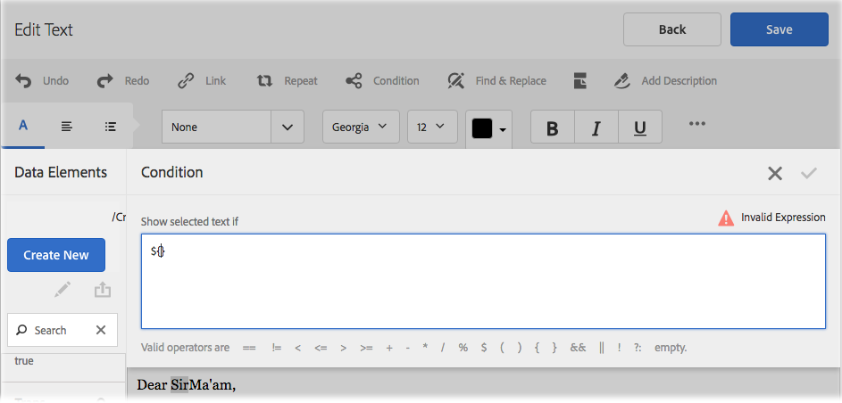
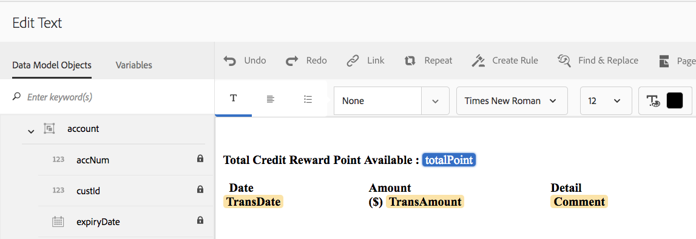
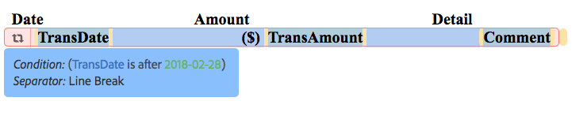
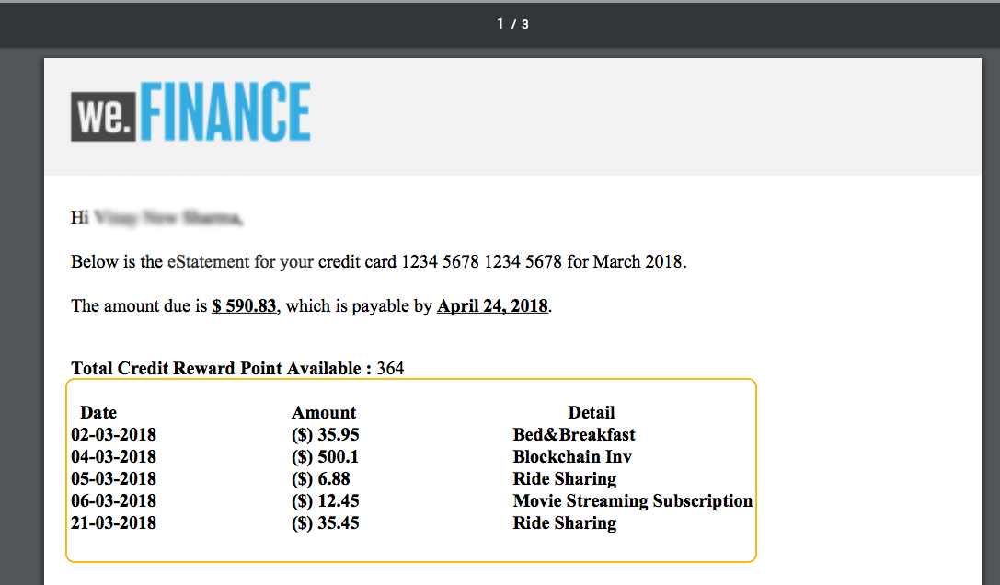
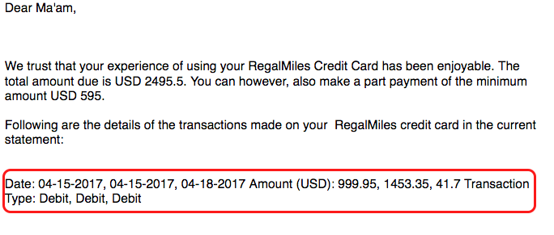
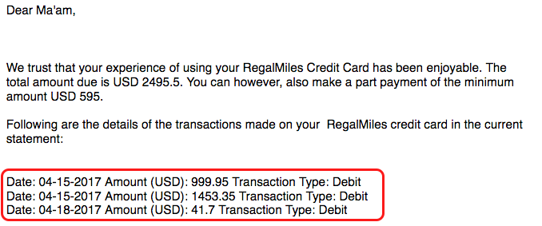
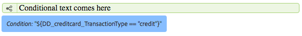

# Inline condition and repeat in Interactive Communications and letters{#inline-condition-and-repeat-in-interactive-communications-and-letters}

## Inline conditions {#inline-conditions}

AEM Forms lets you use inline conditions in text modules to automate rendering of text that depends on the context or data associated with the form data model (in Interactive Communication) or data dictionary (in letters). Inline condition displays specific content based on condition evaluation being true or false.

Conditions perform computations on data values provided by the form data model/Data Dictionary or by end users. Using inline conditions, you can save time and reduce human errors, while creating highly contextual and personalized Interactive Communication/letters.

For more information, see:

* [Create an Interactive Communication](../../forms/using/create-interactive-communication.md)
* [Correspondence Management Overview](/help/forms/using/cm-overview.md)
* [Text in Interactive Communications](../../forms/using/texts-interactive-communications.md)

### Example: Using rules to conditionalize inline text in Interactive Communication {#example-using-rules-to-conditionalize-inline-text-in-interactive-communication}

To conditionalize a sentence, paragraph, or string of text in an Interactive Communication, you can create a rule in the appropriate text document fragment. The following example uses a rule to display a toll free number only to the US recipients of the Interactive Communication.

For more information, see Create rule in text in [Texts in Interactive Communications](../../forms/using/texts-interactive-communications.md).

Once you include the text fragment in an Interactive Communication and Agent uses the Agent UI to prepare an Interactive Communication, the (form data model) data for the recipients is evaluated and the text is shown only to the recipients in the US.

### Example: Using inline condition in a letter to render the appropriate address  {#example-using-inline-condition-in-a-letter-to-render-the-appropriate-address}

You can insert inline condition in a letter by inserting the inline condition in the appropriate text module. The following example uses two conditions to evaluate and display the appropriate address, Sir or Ma'am, in a letter based on the DD element Gender. Using similar steps, you can create other conditions.

>[!NOTE]
>
>If your existing assets include old condition/repeat expressions (pre 6.2 SP1 CFP 4), the assets display old syntax of condition and repeat. However, the old condition/repeat works. The new and old condition/repeat expressions are compatible with each other to create a nested mix of old and new condition/repeat expressions.

1. In the relevant text module, select the part of text that you want to conditionalize and select **Condition**.

   

   The Condition dialog appears with an empty condition.

   

   >[!NOTE]
   >
   >Empty or invalid conditional expression cannot be saved. There has to be a valid conditional expression inside `${}` to save the expression.

1. Do the following to construct a condition for evaluating whether the selected/conditionalized text appears in the letter and then select the check mark to save the expression:

   Double-select a DD element to insert it in the condition. Insert the appropriate operator and construct the following condition in dialog.

   ```javascript
   ${DD_creditcard_Gender=="Male"}

   ```

   For more information on creating the expression, see **Creating expressions and remote functions with expression builder** in [Expression Builder](../../forms/using/expression-builder.md). The value specified in the expression must be supported for the element in the data dictionary. For more information, see [Data Dictionary](../../forms/using/data-dictionary.md).

   Once the condition is inserted, you can hover over the handle on the left of the condition to view the condition. You can select the handle to view the pop-up menu of the condition, which lets you edit or remove the condition.

    

1. Insert similar condition by selecting the text `Ma'am`.

   ```javascript
   ${DD_creditcard_Gender == "Female"}
   ```

1. Preview the relevant letter and notice that the text is rendered according to the inline condition. You can input the value of DD element Gender using:

    * A sample XML data file created based on the relevant data dictionary while previewing the letter with sample data.
    * An XML data file attached to the relevant data dictionary.

   For more information, see [Data Dictionary](../../forms/using/data-dictionary.md).

   

## Repeat {#repeat}

You may have dynamic information in your Interactive Communication/letter, such as transactions in a credit card statement, the instance or occurrence of which may keep changing with each generated letter. Using repeat, you can format and structure such dynamic information in your text document fragment.

Further, you can specify rule/condition within the repeat construct to conditionalize the information/entries that are rendered in the Interactive Communication/letter.

### Example: Using repeat in an Interactive Communication to format, structure, and display a list of credit card transactions {#example-using-repeat-in-an-interactive-communication-to-format-structure-and-display-a-list-of-credit-card-transactions}

The following example gives you the steps for using repeat to structure and render the credit card transactions in an Interactive Communication.

1. In a form data model-based text document fragment, insert the relevant form data model objects (and embedded text required for the labels, as in this example):

   

   >[!NOTE]
   >
   >The repeatable content must include at least one property of the type Collection.

1. Select the content on which to apply repeat.

   

1. Select Repeat.

   The Repeat dialog appears.

   

1. Select Line Break as separator and, if necessary, select Add Condition to create a rule. You can also use text as separator and specify the text charaters to be used as separator.

   The Create Rule dialog appears.

1. Create a rule to display transactions dated after Feb 28, 2018 to include the transactions only for the month of March in the Interactive Communication.

   >[!NOTE]
   >
   >This example assumes that the Agent will be creating the statement at the end of March 2018. Otherwise, you can create another rule to include transactions before 2018-04-01 to exclude transactions after March 2018.

   

1. Save the condition/rule and then save the repeat. Conditional repeat gets applied to the selected content.

   

   On mouse over, the text document fragment displays the Condition and the separator used in the repeat applied to the content.

1. Save the text document fragment and preview the relevant Interactive Communication. Depending on the data in the form data model, the repeat applied on the elements renders the transaction details similar to the following in the preview:

   

### Example: Using repeat in a letter to format, structure, and display a list of credit card transactions {#example-using-repeat-in-a-letter-to-format-structure-and-display-a-list-of-credit-card-transactions}

The following example gives you the steps for using repeat to structure and render the credit card transactions in a letter. Using similar steps, you can use repeat in a different scenario.

1. Open (while editing or creating) a text module that has DD elements that render repeated/dynamic data and embed the required text around the DD elements. For example, a text module has the following DD elements to create a statement of transactions on a credit card:

   ```javascript
   {^DD_creditcard_TransactionDate^} {^DD_creditcard_TransactionAmount^}
   {^DD_creditcard_TransactionType^}
   ```

   These DD elements render a list of the transactions made on the credit card with the following information:

   Transaction date, Transaction amount, and Transaction type (Debit or Credit)

1. Embed the text within the DD elements to make the statement more readable, such as following:

   

   ```javascript

   Date: {^DD_creditcard_TransactionDate^} Amount (USD): {^DD_creditcard_TransactionAmount^} Transaction Type: {^DD_creditcard_TransactionType^}

   ```

   The job of rendering a well formatted statement, however, is not done yet. If you render a letter based on the work done so far, it appears as the following:

   

   To repeat the static text along with the DD elements, you need to apply repeat as explained in the further steps.

1. Select the static text and the DD elements that you want to repeat, as shown below:

   

1. Select **Repeat**. The Repeat dialog appears with an empty inline condition.

   

1. If necessary, insert a condition to selectively render the transactions, such as to render transaction amounts bigger than 50 cents:

   ```javascript
   ${DD_creditcard_TransactionAmount > 0.5}
   ```

   Otherwise, if you do not need to render the information (here transactions) selectively, keep the condition empty by deleting the following in the dialog: `${}`. Saving a repeat expression gets enabled either when the repeat expression window is empty (without ${} when no repeat is needed) or when it contains a valid condition for repeat.

1. Select a separator for formatting the dynamic text and select the check mark to save:

    * **Line Break**: Inserts line break after each transaction entry in the output letter.
    * **Text**: Inserts the specified text character after each transaction entry in the output letter.

   Once the condition is inserted, the text with repeat is highlighted in red and a handle appears on its left. You can hover over the handle on the left of the repeat to view the repeat construct.

   

   You can select the handle to view the pop-up menu of the repeat, which lets you edit or remove the repeat construct.

   

1. Preview the relevant letter and notice that the text is rendered according to repeat. You can input the value of DD elements using:

    * A sample XML data file created based on the relevant data dictionary while previewing the letter with sample data.
    * An XML data file attached to the relevant data dictionary.

   For more information, see [Data Dictionary](https://helpx.adobe.com/aem-forms/6-2/data-dictionary.html).

   

   The static text repeats with the transaction details. Repeating static text is facilitated by the repeat applied to the text in this procedure. The condition, ${DD_creditcard_TransactionAmount &gt; 0.5}, ensures that the transactions below USD .5 are not rendered in the letter.

   >[!NOTE]
   >
   >You can insert condition and repeat only while creating or editing the relevant text module. While previewing the letter, although you can make edits to the text module, you cannot insert condition or repeat.

## Using inline condition and repeat - some use cases  {#using-inline-condition-and-repeat-some-use-cases}

### Repeat within condition {#repeat-within-condition}

You may require to use repeat within a condition. Correspondence Management lets you use repeat within an inline condition construct.

For example, following is repeat (formatted in red) within a condition (formatted in green).

While the repeat renders the credit card transactions, the condition ${DD_creditcard_nooftransactions &gt; 0} ensures that the repeat construct is rendered only if there's at least one transaction.


Similarly, according to your requirement, you can create:

* One or more conditions within a condition
* One or more conditions within a repeat
* A combination of conditions and repeat within a condition or repeat

### Empty inline condition {#empty-inline-condition}

You may need to insert empty inline conditions and embed text and DD elements later. Correspondence Management lets you do that.



It is, however, recommended that if possible, you insert the text and DD elements first in the text module with the intended formatting, such as bullets, and apply an inline condition afterwards.
