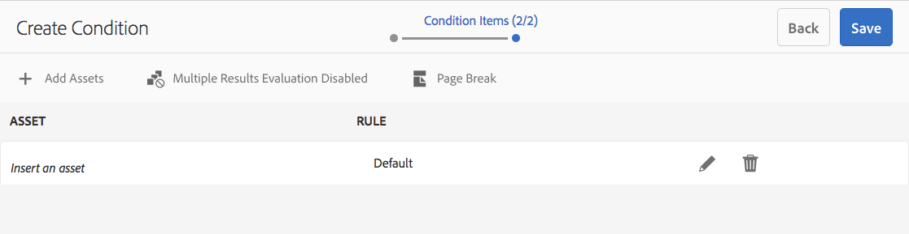
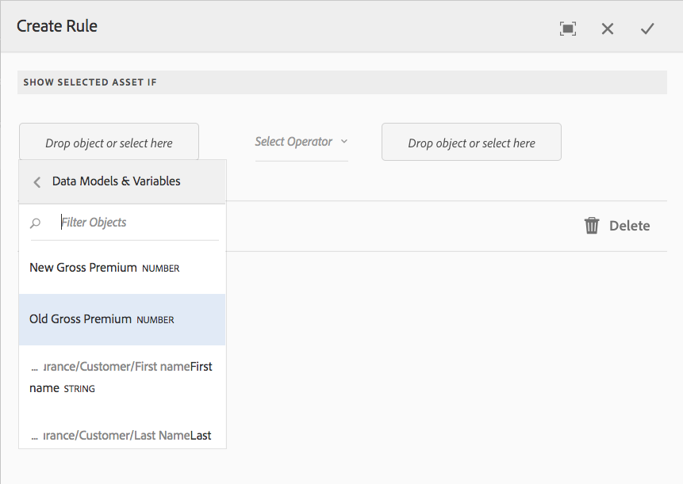
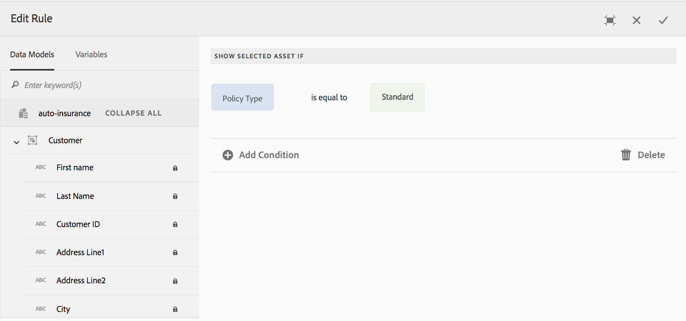

# Conditions in Interactive Communications{#conditions-in-interactive-communications}

Creating and editing condition fragments to be used in Interactive Communications - condition is one of the four types of document fragments used to build Interactive Communications. The other three are texts, lists, and layout fragments.

## Overview {#overview}

Condition is a document fragment that you can include in an Interactive Communication. The other document fragments are [text](../../forms/using/texts-interactive-communications.md), list, and layout fragment. Conditions enable you to define one or more contextual assets that get included in an Interactive Communication based on the supplied data and rules.

Examples:

* In a credit card statement, display the credit card annual fee and credit card image based on the type of customer's credit card.
* In an insurance premium due reminder, display calculations of tax based on the customer's state's taxes.

The assets in the conditions that are rendered based on the applied rules and the values passed to the rule. The rules in the conditions can check values in the following types of data:

* Associated form data model's property
* Any variables that you create in the condition
* Strings
* Numbers
* Mathematical expressions
* Dates

## Create condition {#createcondition}

1. Select **[!UICONTROL Forms]** > **[!UICONTROL Document Fragments]**.
1. Select **[!UICONTROL Create]** > **[!UICONTROL Condition]**.
1. Specify the following information:

    * **[!UICONTROL Title]**: (Optional) Enter the title for the condition. Titles do not need to be unique and can have special characters and non-english characters. Conditions are referred by their titles (when available) such as in thumbnails and properties.
    * **[!UICONTROL Name]**: The unique name for the condition, within a folder. No two document fragments (text, condition, or list) in any state can exist with the same name within a folder. In the Name field, you can enter only English language characters, numbers, and hyphens. The Name field is automatically populated based on the Title field. The special characters, spaces, numbers, and non-English characters entered in the Title field are replaced with hyphens in the Name field. Although the value in the Title field is automatically copied to the Name, you can edit the value.

    * **[!UICONTROL Description]**: Type a description of the document fragment.
    * **[!UICONTROL Form Data Model]**: Optionally, select the Form Data Model radio button to create the condition based on a form data model. When you select Form Data Model radio button, **[!UICONTROL Form Data Model]** field appears. Browse and select a form data model. While creating condition for an Interactive Communication, ensure that you use the same data model that you intend to use in the Interactive Communication. For more information on form data model, see [Data Integration](../../forms/using/data-integration.md).

    * **[!UICONTROL Tags]**: Optionally, to create custom tag enter value in text field and select Enter. When you save this condition, the newly added tags get created.

1. Select **[!UICONTROL Next]**.

   Create Condition page appears.

   

1. Select **[!UICONTROL Add Assets]**.

   Select Assets page appears and displays the available texts, lists, conditions, and images that are available for adding in the condition.

   >[!NOTE]
   >
   >Only none-based, newly created assets and FDM-based assets (created using same FDM as the condition being created) appear in the Select Assets page.

1. Select the appropriate assets to select them to include in the condition and then select **[!UICONTROL Done]**.

   Create Condition page appears and lists the added assets.

   

   You can use the following options to manage assets in a condition:

   

   **[A] Reject Change.** Select this icon to reject the changes you may have made to the asset and the rule in the condition.
   **[B] Accept Change.** Select this icon to accept the changes you have made in the asset and rule in the condition.
   **[C] Duplicate Asset.** Select this icon to create a copy of the asset along with the applied rule, if any, in the condition. Then you can proceed to editing the rule and asset for duplicated asset. Duplicating an asset is useful for creating similar rules to display alternate assets based on a particular context.
   **[D] Show Preview.** Select this icon to display a preview of the asset within the Create\Edit Condition page.
   **'server' Reorder.** Select and hold this icon to drag-and-drop assets to reorder them within a condition.

   You can select the following options to specify how the condition behaves at runtime:

    * **Multiple Results Evaluation Disabled\Multiple Results Evaluation Enabled**: When this option is enabled (appears as "Multiple Results Evaluation Enabled"), all the rules are evaluated and the result is the sum of all the true rules. If this option is disabled (appears as "Multiple Results Evaluation Disabled") then only the first rule that is found to be true is evaluated and becomes the output of the condition.

    * **Page Break**: Select this option ( ) to add a page break between the assets of the conditions. When this option is not selected ( ), if a condition is overflowing to the next page in the print output, the whole condition is shifted to the next page instead of breaking in the page between the assets in the condition.

1. Select **[!UICONTROL Create Rule]** to add rules to display or hide the assets, as required. To use variables in the rules, see [creating variables](#variables). For more information, see [Adding rules to condition](#ruleeditor).

   The created rules appear in the RULE column in the Create Condition screen.

   

   >[!NOTE]
   >
   >You can insert assets in your condition that already have rules or repeat applied.

1. Select **[!UICONTROL Save]**.

   The condition is created. Now you can proceed to using the condition as a building block while creating an Interactive Communication.

   >[!NOTE]
   >
   >To save a new or edited condition, you must have at least one rule for each of assets added in the condition.

## Edit a condition {#edit-a-condition}

You can edit a condition using the following steps. You can also choose to edit a condition from within an Interactive Communication by selecting Edit Fragment in the popup menu.

1. Select **[!UICONTROL Forms]** > **[!UICONTROL Document Fragments]**.
1. Navigate to the condition and select it.
1. Select **[!UICONTROL Edit]**.
1. Make the required changes in the condition. For more details on the information you can change in a condition, see [Create condition](#createcondition).
1. Select **[!UICONTROL Save]** and then select **[!UICONTROL Close]**.

## Create rules in condition {#ruleeditor}

Using rule editor in a condition, you can create rules to display or hide assets based on **preset conditions**. These conditions can be constructed based on:

* Strings
* Numbers
* Mathematical expressions
* Dates
* Associated form data model's properties
* Any [variables](#variables) that you may have created

### Create rule in condition {#create-rule-in-condition}

1. While creating or editing a condition, select  (Rule Editor) icon for the relevant asset.

   The Create Rule dialog appears. In addition to string, number, mathematical expression, and date, the following are also available in the Rule Editor for creating statements of the rules:

    * Associated form data model's properties
    * Any [variables](#variables) that you may have created.

   

   Select the appropriate option to be evaluated.

   >[!NOTE]
   >
   >Collection property is not supported for creating rules to display assets.

1. Select the appropriate operator to evaluate the rule, such as Is Equal To, Contains, and Starts With.
1. Insert the evaluating expression, string, data model property, variable, or date.

   

   Rule to show an asset when policy type is standard

    * While creating or editing a rule, you can also select  (Resize) to expand the Create Rule/Edit Rule dialog. The expanded, full-window dialog lets you create [variables](#variables) to construct rules. Select Resize again to go back to the regular Create Rule dialog.

    * You can also create multiple conditions in a rule.

1. Select **[!UICONTROL Done]**.

   The rule gets applied to the asset.

## Creating and using variables in a condition {#variables}

While creating or editing a rule in a condition, you can select  (Resize) to expand the Create Rule\Edit Rule dialog. The expanded, full-window dialog lets you:

* Create and use variables in the rule
* Drag-and-drop form data model's properties and variables in the rule

Select Resize again to go back to the Create Rule\Edit Rule dialog.

### Create variables {#create-variables}

1. While creating or editing a rule in a condition, you can select  (Resize) to expand the Create Rule\Edit Rule dialog.

   The Expanded, full-window dialog appears.

   

1. In the left pane, select **[!UICONTROL Variables]**.

   The Variables pane appears.

   

1. Select **[!UICONTROL Create]**.

   Create Variables pane appears.

1. Enter the following information and select **[!UICONTROL Create]**:

    * **[!UICONTROL Name]**: Name of the variable.
    * **[!UICONTROL Description]**: Optionally enter a description about the variable.
    * **[!UICONTROL Type]**: Select a type of the variable: String, Number, Boolean, or Date.
    * **[!UICONTROL Allow Specific Values Only]**: For String and Number variables, you can ensure that the agent chooses from a specific set of values for a placeholder in the Agent UI. To specify the set of values, select this option and then specify comma-separated values that are allowed in the **[!UICONTROL Values]** field.

1. Select **[!UICONTROL Create]**.

   The variable is created and listed in the Variables pane.

1. To insert a variable in the rule, drag-and-drop the variable into a placeholder for an option in the rule.
1. After you have constructed a valid rule, select **[!UICONTROL Done]**.

   Proceed to making further changes, if necessary, in the condition and saving it.
