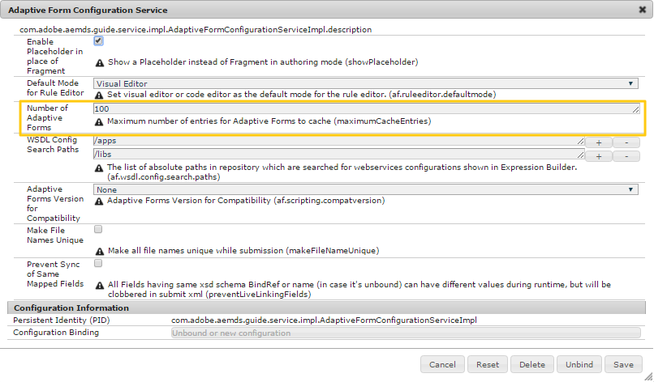

# Configure adaptive forms cache {#configure-adaptive-forms-cache}

A cache is a mechanism to shorten data access times, reduce latency, and improve input/output (I/O) speeds. Adaptive forms cache stores only HTML content and JSON structure of an adaptive form without saving any pre-filled data. It helps in reducing the time required to render an adaptive form on the client. It is designed specifically for adaptive forms. 

## Configure adaptive forms cache at author and publish instances {#configure-adaptive-forms-caching-at-author-and-publish-instances}

1. Go to AEM web console configuration manager at `https://[server]:[port]/system/console/configMgr`.
1. Click **[!UICONTROL Adaptive Form and Interactive Communication Web Channel Configuration]** to edit its configuration values.
1. In the [!UICONTROL edit configuration values] dialog, specify the maximum number of forms or documents an instance of the AEM [!DNL Forms] server can cache in the **[!UICONTROL Number of Adaptive Forms]** field. The default value is 100.

   >[!NOTE]
   >
   >To disable the cache, set the value in the Number of Adaptive Forms field to **0**. The cache is reset and all forms and documents are removed from the cache when you disable or change the cache configuration.

   

1. Click **[!UICONTROL Save]** to save the configuration. 

Your environment is configured to use cache adaptive forms and related assets.


## (Optional) Configure adaptive form cache at dispatcher {#configure-the-cache}

You can also configure adaptive form caching at dispatcher for additional performance boost.

### Pre-requisites {#pre-requisites}

* Enable the [merging or prefilling data at client](prepopulate-adaptive-form-fields.md#prefill-at-client) option. It helps merge unique data for each instance of a pre-filled form. 
* [Enable flush agent for every publish instance](https://docs.adobe.com/content/help/en/experience-manager-dispatcher/using/configuring/page-invalidate.html#invalidating-dispatcher-cache-from-a-publishing-instance). It helps gain better caching performance for adaptive forms. The default URL of flush agents is `http://[server]:[port]]/etc/replication/agents.publish/flush.html`.

### Considerations for caching adaptive forms on a dispatcher {#considerations}

* When using the adaptive forms cache, use the AEM [!DNL Dispatcher] to cache client libraries (CSS and JavaScript) of an adaptive form.
* While developing custom components, on the server used for development, keep the adaptive forms cache disabled.
* URLs without extension are not cached. For example, URL with pattern  pattern`/content/forms/[folder-structure]/[form-name].html` are cached and caching ignores URLs with pattern `/content/dam/formsanddocument/[folder-name]/<form-name>/jcr:content`. So, use URLs with extensions to take benefits of caching.
* Considerations for localized adaptive forms:
  * Use URL format `http://host:port/content/forms/af/<afName>.<locale>.html` to request a localized version of an adaptive form instead of `http://host:port/content/forms/af/afName.html?afAcceptLang=<locale>`
  * [Disable using browser locale](supporting-new-language-localization.md#how-localization-of-adaptive-form-works) for URLs with format `http://host:port/content/forms/af/<adaptivefName>.html`.
  * When you use URL Format `http://host:port/content/forms/af/<adaptivefName>.html`, and **[!UICONTROL Use Browser Locale]** in configuration manager is disabled, the non-localized version of the adaptive form is served. The non-localized language is the language used while developing the adaptive form. The locale configured for your browser (browser locale) is not taken into consideration and a non-localized version of the adaptive form is served.
  * When you use URL Format `http://host:port/content/forms/af/<adaptivefName>.html`, and **[!UICONTROL Use Browser Locale]** in configuration manager is enabled, a localized version of the adaptive form is served, if available. The language of the localized adaptive form is based on the locale configured for your browser (browser locale). It can lead to [caching only first instance of an adaptive form]. To prevent the issue from happening on your instance, see [troubleshooting](#only-first-insatnce-of-adptive-forms-is-cached).  

### Enable the caching at dispatcher

Perform the below listed steps to enable and configure caching  adaptive forms on dispatcher:

1. Open the following URL for every publish instance of you environment and configure the replication agent:
   `http://[server]:[port]]/etc/replication/agents.publish/flush.html`

1. [Add the following to your dispatcher.any file](https://docs.adobe.com/content/help/en/experience-manager-dispatcher/using/configuring/dispatcher-configuration.html#automatically-invalidating-cached-files):

   ```JSON
      /invalidate
      {
      /0000
      {
      /glob "*"
      /type "deny"
      }
      /0001
      {
      # Consider all HTML files stale after an activation.
      /glob "*.html"
      /type "allow"
      }
      /0002
      {
      # Exclude htmls present in AF directories
      /glob "/content/forms/**/*.html"
      /type "deny"
      }

   ```

   When you add the above:

   * An adaptive form remains in cache until an updated version of the form is not published.

   * When a newer version of resource referenced in an adaptive form is published, the impacted adaptive forms is automatically invalidated. There are some exceptions to automatic invalidation of referenced resources. For workaround to exceptions, see [troubleshooting](#troubleshooting) section.
1. [Add the below rules dispatcher.any or custom rules file](https://docs.adobe.com/content/help/en/experience-manager-dispatcher/using/configuring/dispatcher-configuration.html#specifying-the-documents-to-cache). It excludes the URLs that do not support caching. For example, Interactive Communication.

   ``` JSON

      /0000 {
            /glob "*"
            /type "allow"
      }
      ## Don't cache csrf login tokens
      /0001 {
            /glob "/libs/granite/csrf/token.json"
            /type "deny"
      }
      ## Don't cache IC - print channel
      /0002 {
            /glob "/content/forms/**/channels/print.html"
            /type "deny"
      }
      ## Don't cache IC - web channel
      /0003 {
            /glob "/content/forms/**/channels/web.html"
            /type "deny"
      }

   ```

1. [Add the following parameters to the ignore URL parameters list](https://docs.adobe.com/content/help/en/experience-manager-dispatcher/using/configuring/dispatcher-configuration.html#ignoring-url-parameters): 

   ``` JSON

      /ignoreUrlParams {
      /0001 { /glob "*" /type "deny" }
      # added for AEM forms specific use cases.
      /0003 { /glob "dataRef" /type "allow" }
      }
   ```

Your AEM environment is configured to cache adaptive forms. It caches all types of adaptive forms. If you have a requirement to check user access permissions for a page before delivering the cached page, see [caching secured content](https://docs.adobe.com/content/help/en/experience-manager-dispatcher/using/configuring/permissions-cache.html).

## Troubleshooting {#troubleshooting}

### Some adaptive forms containing images or videos are not automatically invalidated from dispatcher cache {#videos-or-images-not-auto-invalidated}

#### Issue {#issue1}

When you select and add images or videos via asset browser to an adaptive form and these images and videos are edited in Assets editor, adaptive forms containing such images are not invalidated from dispatcher cache automatically.

#### Solution {#Solution1}

After publishing the images and video, explicitly unpublish and publish the adaptive forms that reference these assets. 

### Some adaptive forms containing content fragment or experience fragments are not automatically invalidated from dispatcher cache {#content-or-experience-fragment-not-auto-invalidated}

#### Issue {#issue2}

When you add a content fragment or an experience fragment to an adaptive form and these assets are independently edited and published, adaptive forms containing such assets not invalidated from dispatcher cache automatically.

#### Solution {#Solution2}

After publishing updated content fragment or experience fragment, explicitly unpublish and publish the adaptive forms that use these assets.

### Only first instance of an adaptive form is cached{#only-first-insatnce-of-adptive-forms-is-cached}

#### Issue {#issue3}

When the adaptive form URL does not have any localization information, and **[!UICONTROL Use Browser Locale]** in configuration manager is enabled, a localized version of the adaptive form is served and only the first instance of the adaptive form is cached and delivered to every subsequent user.

#### Solution {#Solution3}

 Perform the following steps to resolve the issue:
 
 1. Open the conf.d/httpd-dispatcher.conf or any other configuration file configured to load at runtime.
 
 1. Add the following code to your file and save it. It is a sample code modify it to suit your environment.

``` XML

   <VirtualHost *:80>
        # Set log level high during development / debugging and then turn it down to whatever is appropriate
    LogLevel rewrite:trace6
        # Start Rewrite Engine
    RewriteEngine On
        # Handle actual URL convention (just pass through)
        RewriteRule "^/content/forms/af/(.*)[.](.*).html$" "/content/forms/af/$1.$2.html" [PT]
 
        # Handle selector based redirection basded on browser language
        # The Rewrite Cond(ition) is looking for the Accept-Lanague header and if found takes the first two character which most likely will be the desired language selector.
        RewriteCond %{HTTP:Accept-Language} ^(..).*$ [NC]
        RewriteRule "^/content/forms/af/(.*).html$" "/content/forms/af/$1.%1.html" [R]
   </VirtualHost>

```
