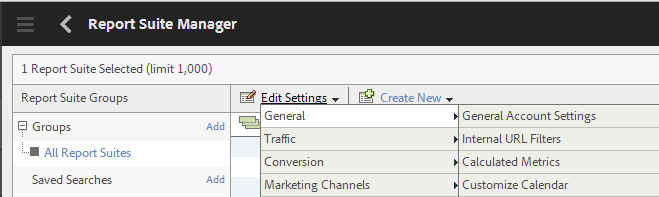
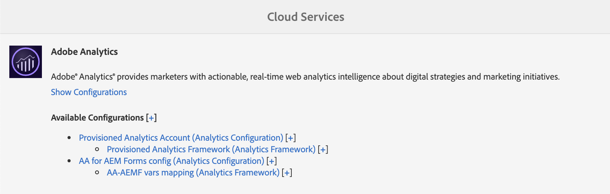
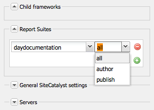
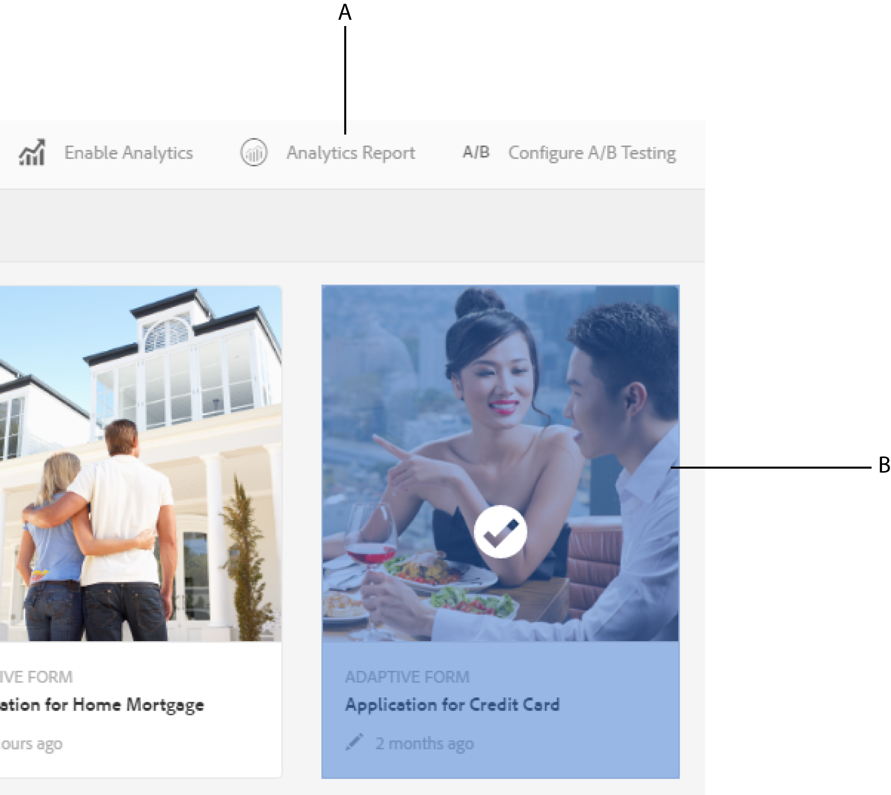

# Analytics using Cloud Service Framework {#analyticsusingcloudframework}

AEM Forms integrates with Analytics that lets you capture and track performance metrics for your published forms and documents. The objective behind analyzing these metrics is to make informed decisions based on data about the changes required to make forms or document more usable.

>[!NOTE]
>
>The analytics feature in AEM Forms is available as part of the AEM Forms add-on package. For information about installing the add-on package, see [Installing and configuring AEM Forms](../../forms/using/installing-configuring-aem-forms-osgi.md).
>
>In addition to the add-on package, you need an Adobe Analytics account and administrator privileges on the AEM instance. For information about the solution, see [Adobe Analytics](https://www.adobe.com/solutions/digital-analytics.html).

You can also perform analytics using Adobe Launch. For more information on how to integrate AEM Forms with Adobe Launch, see [Analytics using Adobe Launch](/help/forms/using/integrate-aem-forms-with-adobe-analytics.md).

## Overview {#overview}

You can use Adobe Analytics to discover interaction patterns and problems users face while using adaptive forms, HTML5 forms and interactive communication. Out of the box, Adobe analytics tracks and stores information about the following parameters:

* **Average fill time**: Average time spent to fill the form.
* **Renditions**: Number of times a form is opened.
* **Drafts**: Number of times a form is saved in the draft state.
* **Submissions**: Number of times a form is submitted.
* **Abort**: Number of times the users leave without completing the form.

You can customize Adobe Analytics to add/remove more parameters. Along with the above information, the report contains following information about every panel of the HTML5 and adaptive form:

* **Time**: Time spent on the panel and the fields of the panel.
* **Error**: Number of errors encountered on the panel and on the fields of the panel.
* **Help**: Number of times a user opens help of a panel and the fields of the panel.

## Creating report suite {#creating-report-suite}

Analytics data is stored in customer-specific repositories called report suites. To create report suite and use Adobe Analytics, you must have a valid Adobe Marketing Cloud account. Before performing the following steps, ensure that you have a valid Adobe Marketing Cloud account.

Perform the following steps to create a report suite.

1. Log in at [https://sc.omniture.com/login/](https://sc.omniture.com/login/ )
1. In the Marketing Cloud, select **Admin** &gt; **Admin Console** &gt; **Report Suites**.
1. Select **Create New** &gt; **Report Suite** in the Report Suite Manager.

   

   Create new Report Suite

1. Make sure the first dropdown list is set to **Create from a Template** and then select **Commerce**.
1. Locate the **Report Suite ID** field and add new Report Suite ID. For example, JJEsquire. A report suite ID appears below the Report Suite ID field. It includes an automatic prefix, which is often the company name.
1. Add new **Site Title**. For example, JJEsquire Getting Started Suite. This title is used within the Analytics UI. Use the report suite ID in your code.
1. Select a **Time Zone** from the dropdown. All of the data that comes into this report suite is recorded based on defined time zone.
1. Leave the **Base URL** and **Default Page** fields empty. These two values are only used from the Adobe Marketing Cloud interface to link to your website.
1. Leave the **Go Live Date** set to today. The Go Live Date determines the day when the report suite is activated.
1. In the **Estimated Page Views Per Day** field, type 100. Use this field to estimate the number of page views you anticipate for your website per day. This estimate allows Adobe to put in place the appropriate amount of hardware to process the data you will be collecting.
1. Select a **Base Currency** from the dropdown. All currency data that comes into this report suite is converted and stored in this currency format.
1. Click **Create Report** Suite. You should see the page refresh with a message that your report suite has been successfully created.
1. Select the newly created Report Suite. Navigate to **Edit Settings** &gt; **General** &gt; **General Account Settings**.

   

   General Account Settings

1. In General Account Settings screen, enable **Geography Reporting**, and click **Save.**
1. Navigate to **Edit Settings** &gt; **Traffic** &gt; **Traffic Variables**.
1. In the report suite, configure and enable following traffic variables.

    * **formName**: Identifier for an adaptive form.
    * **formInstance**: Identifier of an adaptive form instance. Enable Path reports for this variable.
    * **fieldName**: Identifier of an adaptive form field. Enable Path reports for this variable.
    * **panelName**: Identifier of an adaptive form panel. Enable Path reports for this variable.
    * **formTitle**: Title of the form.
    * **fieldTitle**: Title of the form field.
    * **panelTitle**: Title of the form panel.
    * **analyticsVersion**: Version of form analytics.

1. Navigate to **Edit Settings** &gt; **Conversion** &gt; **Success Events**. Define and enable the following success events:

   | Success Event |Type |
   |---|---|
   | abandon |Counter |
   | render |Counter |
   | panelVisit |Counter |
   | fieldVisit |Counter |
   | save |Counter |
   | error |Counter |
   | help |Counter |
   | submit |Counter |
   | timeSpent |Numeric |

   >[!NOTE]
   >
   >An event number and prop number used to configure AEM Forms analytics must be different from event number and prop number used in [AEM analytics](/help/sites-administering/adobeanalytics.md) configuration.

1. Log out of the Adobe Marketing Cloud account.

## Creating Cloud Service Configuration {#creating-cloud-service-configuration}

Cloud Service configuration is information about your Adobe Analytics account. The configuration enables Adobe Experience Manager (AEM) to connect to Adobe Analytics. Create a separate configuration for each Analytics account that you use.

1. Log in to your AEM author instance as an administrator.
1. In the top-left corner, click **Adobe Experience Manager** &gt; **Tools**  &gt; **Cloud Services** &gt; **Legacy Cloud Services**.
1. Locate **Adobe Analytics** icon. Click **Show Configurations** and then proceed to click **[+]** to add new configuration.

   If you are a first-time user, click **Configure now**.

1. Add a Title to your new configuration (filling out the Name field is optional). For example, My analytics configuration. Click **Create**.

1. When the Edit panel opens on the configuration page, fill in the fields:

    * **Company**: Your company's name as featured on Adobe Analytics.
    * **Username**: The name used to log in to Adobe Analytics.
    * **Password**: The Adobe Analytics password for the above account.
    * **Data Center**: The Data Center of your Adobe Analytics account.

1. Click **Connect to Analytics**. A dialog appears with message that the connection was successful. Click **OK**.

## Creating Cloud Service Framework {#creating-cloud-service-framework}

An Adobe Analytics framework is a set of mappings between Adobe Analytics variables and AEM variables. Use a framework to configure how your forms populate data to Adobe Analytics reports. Frameworks are associated with an Adobe Analytics configuration. You can create multiple frameworks for each configuration.

1. On the AEM cloud services console, click **Show configurations**, under Adobe Analytics.
1. Click the **[+]** link next to next to your Analytics configuration.

   

   Adobe Analytics configuration

1. Type a **Title** and **Name** for the framework, select **Adobe Analytics** Framework, and click **Create**. The framework opens for editing.
1. In the Report Suites section of the side pod, click **Add Item**, then use the drop-down to select the Report Suite ID (for example, JJEsquire) with which the framework will interact.
1. Next to the Report Suite ID, select the server instances that you want to send information to the Report Suite.

   

1. Drag a **Form Analytics component** from the **other** category from SideKick onto the framework.
1. To map Analytics variables with variables that are defined in the component, drag a variable from AEM Content Finder onto a field on the tracking component.

   

1. Activate the framework using the **page tab** in sidekick, click **Activate Framework**.

## Configuring AEM Forms Analytics Configuration service {#configuring-aem-forms-analytics-configuration-service}

1. On author instance, open AEM Web Console Configuration manager at `https://<server>:<port>;/system/console/configMgr`.
1. Locate and open AEM Forms Analytics Configuration

   

   AEM Forms Analytics Configuration service

1. Specify appropriate values for the following fields and click **Save**.

    * **SiteCatalyst Framework**: Select the framework/configuration that you defined in the Set up a framework for tracking section.
    * **Field time tracking baseline**: Specify the duration, in seconds, after which the field visit must be tracked. The default value is 0. When the value is greater than 0 (zero), two separate tracking events are sent to Adobe Analytics server. The first event instructs the analytics server to stop tracking the exited field. The second event is sent after the specified duration elapses. The second event instructs the analytics server to start tracking the visited field. Using two separate events helps accurately measure time spent on a field. When the value is 0 (zero), single tracking event is sent to Adobe Analytics server.

    * **Analytics report sync cron**: Specify cron expression for fetching reports from Adobe Analytics. The default value is 0 0 2 ? &#42; &#42;.

    * **Fetch report timeout:** Specify the duration, in seconds, to wait for server to respond to the analytics report. The default time is 120 seconds.

   >[!NOTE]
   >
   >It can take up to 10 seconds more to timeout report fetch operation then the specified number of seconds.

1. Repeat step 1-3 on publish instance to configure analytics.

Now, you can enable analytics for forms and generate an analytics report.

## Enabling analytics for a form or document {#enabling-analytics-for-a-form-or-document}

1. Log in to AEM portal at `https://[hostname]:'port'`.
1. Click **Forms &gt; Forms & Documents**, select a form or document, and click **Enable Analytics**. The analytics is enabled.

   

   Enabling analytics for a form

   **A.** Enable Analytics button **B.** Selected form

   For detailed information on viewing forms analytics reports, see [Viewing and understanding AEM Forms analytics reports](../../forms/using/view-understand-aem-forms-analytics-reports.md).
