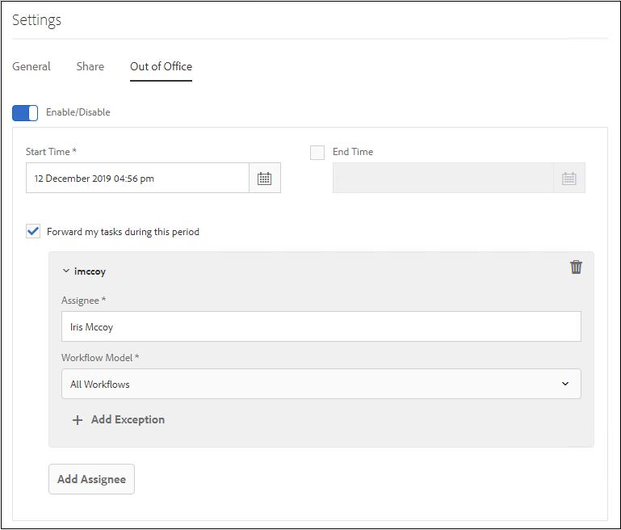

# Configure Out of Office setting {#configure-out-of-office-settings}

| Version | Article link |
| -------- | ---------------------------- |
| AEM as a Cloud Service |    [Click here](https://experienceleague.adobe.com/docs/experience-manager-cloud-service/content/forms/create-form-centric-workflows/configure-out-of-office-settings.html)                  |
| AEM 6.5     | This article         |

If you plan to be out of the office, you can specify what happens to items that are assigned to you for that period.

You have the option of specifying a start date and time and an end date and time for your out-of-office settings to be in effect. If you are in a different time zone from the server, the time zone used is that of the client.

You can set a default person to which all of your items are sent. You can also specify exceptions for items from specific processes to be sent to a different user or to remain in your Inbox until you return. If the designated person is also out of the office, the item goes to the user that they have designated. If the item cannot be assigned to a user who is not out of the office, the item remains in your Inbox.

You can segregate item delegation based on the workflow models. For example, you can assign an item related to Workflow A to user A and assign an item related to Workflow B is assigned to user B.

>[!NOTE]
>
>* When you enable the Out of Office setting, all the items available in your Inbox before enabling the setting remain in your inbox. Only items received after enabling the setting are delegated.
>* When you turn the Out of Office setting off, the delegated items are not automatically assigned back to you. You can use the claim functionality to assign items to you.
>* When User A delegates items to User B and User B delegates further to User C, then items are assigned only to User C and not User B.
>* When there is a loop in assignment, the tasks remain with original user. For example,  When User A delegates items to User B User B delegates to User C, User C delegates to User D, and User D delegates to User B, a loop in created. In such situation, the item remains with original User. User A is original user in above example.

## Enable the Out of Office setting for your account {#enable-out-of-office}

Perform the following steps to Enable the Out of Office setting for your account and delegate your Inbox Items to another user:

1. Log in to your AEM instance. Select the  icon and select **[!UICONTROL View All]**. A list of your inbox items appear.
1. Select the  or  icon next to the **[!UICONTROL Create]** button and select **[!UICONTROL Settings]**. The settings dialog appears.
1. Open the **[!UICONTROL Out of Office]** tab on the settings dialog.
1. Select the **[!UICONTROL Enable/Disable]** button to enable the Out of Office setting.
1. Specify the **[!UICONTROL Start Time]**  and **[!UICONTROL End Time]** for the setting. The items are delegated only during the specified period. Leave the **[!UICONTROL End Time]** field empty to delegate items for an indefinite time period.
1. Select the **[!UICONTROL Forward my items during this period]** checkbox. If you do not select the option and not specify an assignee, your items are not forwarded to any user. Although you are away and the setting is enabled, the items remain in your Inbox.
1. Select **[!UICONTROL Add Assignee]**. Specify a user in the **[!UICONTROL Assignee]** field so you can delegate the items. Specify the **[!UICONTROL Workflow Model]** so you can delegate to the specified user. You can select more than one workflow model.

    In addition, to assign all the items, irrespective of the workflow model, to a particular user, select **[!UICONTROL All Workflows]** from the Workflow Model drop-down list.  

    To assign items to a particular user for all workflow models except a few, select **[!UICONTROL All Workflows]** from the Workflow Model drop-down list, select **[!UICONTROL + Add Exceptions]**, and specify the workflow models to be left out.
     

    Repeat the step so you can add more assignees.  

    >[!NOTE]
    >
    >The order of the assignees is important. When an item is assigned to a user who have enabled the out-of-office setting, the item is evaluated against the specified assignees list in the order assignees are added. When an item matches the criteria, it is assigned to the assignee, and next assignee is not checked.

1. Select **[!UICONTROL Save]**. The setting takes effect at the specified start date and time. If you log in while you are out of the office, you are not considered in the office until you change your settings.

Now, items assigned to you during the Out of Office time period are automatically assigned to the specified assignee.

>[!NOTE]
>
>(For Forms-centric workflow items only) Enable the **Allow assignee to delegate using 'Out of Office' settings** option of the **Assign task** step in the workflow. Only items which have the previously mentioned option enabled are delegated to other users.

## Limitations {#limitations}

* Assigning items to a group is not supported.
* Enabling  Out of Office for  project tasks  is  currently  not supported.
