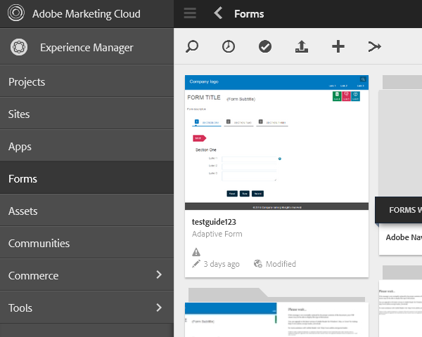

# Configuring the synchronization scheduler{#configuring-the-synchronization-scheduler}

By default, the synchronization scheduler runs after every 3 minutes to synchronize all the assets modified and updated in the repository via LiveCycle Workbench 11. Applications containing forms and resources are visible in the AEM Forms user interface once the synchronization process is complete.

## Change interval of the synchronization scheduler   {#change-interval-of-the-synchronization-scheduler-br}

Perform the following steps to change the interval of the synchronization scheduler:

1. Log in to AEM Configuration Manager. The URL of Configuration Manager is http://[Server]:[Port]/lc/system/console/configMgr  

1. Locate and open the **FormsManagerConfiguration **bundle.   

1. Specify a new value for the **Synchronization Scheduler Frequency** option.  
   The unit of the frequency is minutes. For example, to configure the scheduler to run after every 60 minutes, specify 60.

## Synchronizing assets {#synchronizing-assets}

You can use the **Synchronize Assets from Repository **option to manually synchronize the assets. Perform the following steps to manually synchronize the assets:

1. Log in to AEM Forms. The default URL is http://[Server]:[Port]/lc/aem/forms/.

   

   Figure 1 - AEM Forms user interface

1. Click the ** 

   ** icon in the toolbar. If you do not have any assets at last configured path then the dialog box as shown below. Click **Start **to initiate the synchronization.

   

   Figure 2 - Synchronization dialog box

## Troubleshooting synchronization error {#troubleshooting-synchronization-error}

You can create new applications in the workflow designer (LiveCycle Workbench).

If the newly created application and a folder at /content/dam/formsanddocuments has identical name, an error "*An asset with the same name as this application already exists at root level.*" is logged.

To resolve the conflict, rename the application, and manually synchronize the assets.

Figure 4 - Conflicts in asset synchronization dialog box

