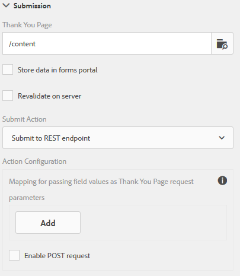

# Configuring redirect page{#configuring-redirect-page}

 Adobe recommends using the modern and extensible data capture [Core Components](https://experienceleague.adobe.com/docs/experience-manager-core-components/using/adaptive-forms/introduction.html) for [creating new Adaptive Forms](/help/forms/using/create-an-adaptive-form-core-components.md) or [adding Adaptive Forms to AEM Sites pages](/help/forms/using/create-or-add-an-adaptive-form-to-aem-sites-page.md). These components represent a significant advancement in Adaptive Forms creation, ensuring impressive user experiences. This article describes older approach to author Adaptive Forms using foundation components. 

| Version | Article link |
| -------- | ---------------------------- |
| AEM as a Cloud Service |    [Click here](https://experienceleague.adobe.com/docs/experience-manager-cloud-service/content/forms/adaptive-forms-authoring/authoring-adaptive-forms-foundation-components/configure-submit-actions-and-metadata-submission/configuring-redirect-page.html)                  |
| AEM 6.5     | This article         |

Form authors can configure a page for each form, to which the form users are redirected after submitting a form.

1. In the edit mode, select a component, then click  &gt; **Adaptive Form Container**, and then click .

1. In the sidebar, click **Submission**.  

1. Provide the URL of the redirect page under Thank You Page in the Submission section.  
1. Optionally, under Submit Action, for the Submit to REST endpoint action, you can configure the parameter to be passed to the redirect page.

Redirect page configuration

Form authors can use the following parameters that are passed to the Thank you page. For all the available submit actions, `status` and `owner` parameters are passed. Besides these two parameters, some additional parameters are passed for the following submit actions:

* **Store content action** (deprecated) : `contentPath`--the path of the node in the repository where submitted data is stored--is passed.

* **Store PDF action** (deprecated) : `contentPath`--of the submitted data and path to the node storing the PDF file in the repository--is passed.  

* **Submit to Forms workflow**: Output parameters returned from forms workflow are passed.  

* **Submit to REST endpoint**: Parameters added for in-field to parameter mapping are passed. `status` and `owner` parameters are not passed in this submit action. For more information, see [Configuring the Submit to REST endpoint submit action](../../forms/using/configuring-submit-actions.md).
