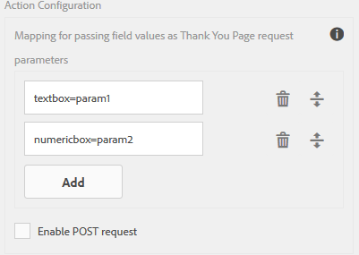
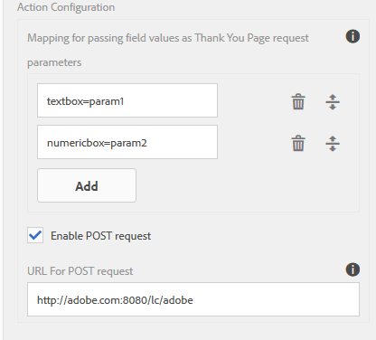
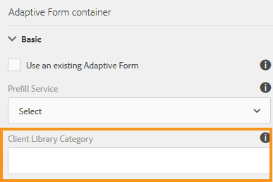

# Configuring the Submit action {#configuring-the-submit-action}

 Adobe recommends using the modern and extensible data capture [Core Components](https://experienceleague.adobe.com/docs/experience-manager-core-components/using/adaptive-forms/introduction.html) for [creating new Adaptive Forms](/help/forms/using/create-an-adaptive-form-core-components.md) or [adding Adaptive Forms to AEM Sites pages](/help/forms/using/create-or-add-an-adaptive-form-to-aem-sites-page.md). These components represent a significant advancement in Adaptive Forms creation, ensuring impressive user experiences. This article describes older approach to author Adaptive Forms using foundation components. 

| Version | Article link |
| -------- | ---------------------------- |
| AEM as a Cloud Service |    [Click here](https://experienceleague.adobe.com/docs/experience-manager-cloud-service/content/forms/adaptive-forms-authoring/authoring-adaptive-forms-foundation-components/configure-submit-actions-and-metadata-submission/configuring-submit-actions.html)                  |
| AEM 6.5     | This article         |

## Introduction to submit actions {#introduction-to-submit-actions}

A submit action is triggered when a user clicks the Submit button on an adaptive form. You can configure the submit action on adaptive form. Adaptive forms provide a few out of the box submit actions. You can copy and extend the default submit actions to create your own submit action. However, based on your requirements, you can write and register your own submit action to process data in the submitted form. The submit action can use [synchronous or asynchronous submission](../../forms/using/asynchronous-submissions-adaptive-forms.md).

You can configure a submit action in the **Submission** section of the Adaptive Form Container properties, in the sidebar.

Configure Submit Action

The default submit actions available with adaptive forms are:

* Submit to REST endpoint
* Send Email
* Send PDF via Email
* Invoke a Forms Workflow
* Submit using Form Data Model
* Forms Portal Submit Action
* Invoke a AEM Workflow
* Submit to Power Automate

>[!NOTE]
>
>Send PDF via Email submit action is applicable only to adaptive forms that use XFA template as form model.

>[!NOTE]
>
>Ensure that the [AEM_Installation_Directory]\crx-quickstart\temp\datamanager\ASM folder
>exists. The directory is required to temporarily store attachments. If the directory does not exist, create it.

>[!CAUTION]
>
>If you [prefill](../../forms/using/prepopulate-adaptive-form-fields.md) a form template, form data model, or schema based adaptive form with XML or JSON data complaint to a schema (XML schema, JSON schema, form template, or form data model) that is data does not contain &lt;afData&gt;, &lt;afBoundData&gt;, and &lt;/afUnboundData&gt; tags, then the data of unbounded fields (Unbounded fields are adaptive form fields without [bindref](../../forms/using/prepopulate-adaptive-form-fields.md) property) of the adaptive form is lost.

You can write a custom submit action for adaptive forms to fulfill your use case. For more information, see [Writing custom Submit action for adaptive forms](../../forms/using/custom-submit-action-form.md).

## Submit to REST endpoint {#submit-to-rest-endpoint}

The **Submit to REST endpoint** submit option passes the data filled in the form to a configured confirmation page as part of the HTTP GET request. You can add the name of the fields to request. The format of the request is:

`{fieldName}={request parameter name}`

As shown in the image below, `param1` and `param2` are passed as parameters with values copied from the **textbox** and **numeric box** fields for the next action.

You can also **Enable POST request** and provide a URL to post the request. To submit data to the Experience Manager server hosting the form, use a relative path corresponding to the root path of the Experience Manager server. For example, /content/forms/af/SampleForm.html. To submit data to any other server, use absolute path.

Configuring Rest Endpoint Submit Action

>[!NOTE]
>
>To pass the fields as parameters in a REST URL, all the fields must have different element names, even if the fields are placed on different panels.

### Post submitted data to a resource or external rest end point&nbsp; {#post-submitted-data-to-a-resource-or-external-rest-end-point-nbsp}

Use the **Submit to REST Endpoint** action to post the submitted data to a rest URL. The URL can be of an internal (the server on which the form is rendered) or an external server.

To post data to an internal server, provide path of the resource. The data is posted the path of the resource. For example, /content/restEndPoint. For such post requests, the authentication information of the submit request is used.

To post data to an external server, provide a URL. The format of the URL is https://host:port/path_to_rest_end_point. Ensure that you configure the path to handle the POST request anonymously.

In the example above, user entered information in `textbox` is captured using parameter `param1`. Syntax to post data captured using `param1` is:

`String data=request.getParameter("param1");`

Similarly, parameters that you use for posting XML data and attachments are `dataXml` and `attachments`.

For example, you use these two parameters in your script to parse data to a rest end point. You use the following syntax to store and parse the data:

`String data=request.getParameter("dataXml");`
`String att=request.getParameter("attachments");`

In this example, `data` stores the XML data, and `att` stores attachment data.

## Send Email {#send-email}

The **Send Email** submit action sends an email to one or more recipients on successful submission of the form. The email generated can contain form data in a predefined format.

>[!NOTE]
>
>All the form fields must have different element names, even if they are placed on different panels), for including form data in an email.

## Send PDF via Email {#send-pdf-via-email}

The **Send PDF via Email** submit action sends an email with a PDF containing form data, to one or more recipients on successful submission of the form.

>[!NOTE]
>
>This submit action is available for XFA-based adaptive forms and XSD-based adaption forms that have the Document of Record template.

## Invoke a Forms Workflow {#invoke-a-forms-workflow}

The **Submit to Forms Workflow** submit option sends a data xml and file attachments (if any) to an existing Adobe LiveCycle or AEM Forms on JEE process.

For information about how to configure the Submit to Forms Workflow submit action, see [Submitting and processing your form data using forms workflows](../../forms/using/submit-form-data-livecycle-process.md).

## Submit using Form Data Model {#submit-using-form-data-model}

The **Submit using Form Data Model** submit action writes submitted adaptive form data for the specified data model object in a form data model to its data source. When configuring the submit action, you can choose a data model object whose submitted data you want to write back to its data source.

In addition, you can submit a form attachment using a form data model and a Document of Record (DoR) to the data source.

For information about form data model, see [AEM Forms Data Integration](../../forms/using/data-integration.md).

## Forms Portal Submit Action {#forms-portal-submit-action}

The **Forms Portal Submit Action** option makes form data available through an AEM Forms Portal.

For more information about the Forms Portal and submit action, see [Drafts and submissions component](../../forms/using/draft-submission-component.md).

## Invoke an AEM Workflow {#invoke-an-aem-workflow}

The **[!UICONTROL Invoke an AEM Workflow]** Submit Action associates an Adaptive Form with an [AEM Workflow](/help/sites-developing/workflows-models.md). When a form is submitted, the associated workflow starts automatically on the Author instance. You can save the data file, attachments, and Document of Record to the folder relative or under the payload of the workflow or to a variable. If the workflow is marked for external data storage then the variable option is available and not the payload option. You can select from the list of variables available for the workflow model. If the workflow is marked for external data storage at a later stage and not at the time of workflow creation, then ensure that the required variable configurations are in place.

Before using the **Invoke an AEM Workflow** submit action, [configure the Experience Manager DS settings](../../forms/using/configuring-the-processing-server-url.md). For information about creating an AEM Workflow, see [Form-centric workflows on OSGi](../../forms/using/aem-forms-workflow.md).

The Submit Action places the following at the payload location of the workflow. However, note that only the Variable option is displayed if the workflow model is marked for external data storage, and not the payload option.

* **Data file**: It contains data submitted to the Adaptive Form. You can use the **[!UICONTROL Data File Path]** option to specify the name of the file and path of file relative to the payload. For example, the `/addresschange/data.xml` path creates a folder named `addresschange` and places it relative to payload. You can also specify only `data.xml` to send only submitted data without creating a folder hierarchy. Use the variable option and select the variable from the list of variables available for the workflow model.

>[!NOTE]
>
>Variables can be used whether workflow model is marked for external data storage or not.

* **Attachments**: You can use the **[!UICONTROL Attachment Path]** option to specify the folder name to store the attachments uploaded to the Adaptive Form. The folder is created relative to the payload. If the workflow is marked for external data storage, use the variable option and select the variable from the list of variables available for the workflow model.

* **Document of Record**: It contains the Document of Record generated for the Adaptive Form. You can use the **[!UICONTROL Document of Record Path]** option to specify the name of the Document of Record file and path of file relative to the payload. For example, the `/addresschange/DoR.pdf` path creates a folder named `addresschange` relative to the payload and places the `DoR.pdf` relative to payload. You can also specify only `DoR.pdf` to save only Document of Record without creating a folder hierarchy. If the workflow is marked for external data storage, use the variable option and select the variable from the list of variables available for the workflow model.

## Submit to Power Automate {#microsoft-power-automate}

You can configure an Adaptive Form to run a Microsoft&reg; Power Automate Cloud Flow on submission. The configured Adaptive Form sends captured data, attachments, and Document Of Record to Power Automate Cloud Flow for processing. It helps you build custom data capture experience while harnessing the power of Microsoft&reg; Power Automate to build business logics around captured data and automate customer workflows. Here are a few examples of what you can do after integrating an Adaptive Form with Microsoft&reg; Power Automate: 

* Use Adaptive Forms data in a Power Automate business processes
* Use Power Automate to send captured data to more than 500 data sources or any publicly available API  
* Perform complex calculations on captured data
* Save Adaptive Forms data to storage systems at a predefined schedule

Adaptive Forms editor provides the **Invoke a Microsoft&reg; Power Automate flow** submit action to send adaptive forms data, attachments, and Document Of Record to Power Automate Cloud Flow. To use the Submit action to send captured data to Microsoft&reg; Power Automate, [Connect your AEM Forms instance with Microsoft&reg; Power Automate](/help/forms/using/forms-microsoft-power-automate-integration.md)  

After a successful configuration, use the [Invoke a Microsoft&reg; Power Automate flow](/help/forms/using/forms-microsoft-power-automate-integration.md#use-the-invoke-a-microsoft&reg;-power-automate-flow-submit-action-to-send-data-to-a-power-automate-flow-use-the-invoke-microsoft-power-automate-flow-submit-action) submit action to send data to a Power Automate Flow.  

## Submit to Microsoft&reg; SharePoint List{#submit-to-sharedrive}

>[!NOTE]
>
> The Submit to Microsoft&reg; SharePoint List feature was introduced with AEM 6.5 Forms Service Pack 19 (6.5.19.0).

The **[!UICONTROL Submit to SharePoint]** submit action connects an Adaptive Form with a Microsoft&reg; SharePoint Storage. You can submit the form data file, attachments, or Document of Record to the connected Microsoft&reg; Sharepoint Storage. 

### Connect an Adaptive Form to Microsoft&reg; SharePoint List {#connect-af-sharepoint-list}

To connect an Adaptive Form to Microsoft&reg; SharePoint List:

1. [Create a SharePoint List Configuration](#create-sharepoint-list-configuration): It connects AEM Forms to your Microsoft&reg; Sharepoint List Storage.
1. [Use the **Submit using Form Data Model** submit action in an Adaptive Form](#use-submit-using-fdm): It sends your Adaptive Form data to configured Microsoft&reg; SharePoint.

#### Create a SharePoint List Configuration {#create-sharepoint-list-configuration}

To connect AEM Forms to your Microsoft&reg; Sharepoint List:

1. Go to **[!UICONTROL Tools]** > **[!UICONTROL Cloud Services]** >  **[!UICONTROL Microsoft&reg; SharePoint]**.   
1. Select a **Configuration Container**. The configuration is stored in the selected Configuration Container. 
1. Click **[!UICONTROL Create]** > **[!UICONTROL SharePoint List]** from the drop-down list. The SharePoint configuration wizard appears.  
1. Specify the **[!UICONTROL Title]**, **[!UICONTROL Client ID]**, **[!UICONTROL Client Secret]** and **[!UICONTROL OAuth URL]**. For information on how to retrieve Client ID, Client Secret, Tenant ID for OAuth URL, see [Microsoft&reg; Documentation](https://learn.microsoft.com/en-us/graph/auth-register-app-v2).
    * You can retrieve the `Client ID` and `Client Secret` of your app from the Microsoft&reg; Azure portal.
    * In the Microsoft&reg; Azure portal, add the Redirect URI as `https://[author-instance]/libs/cq/sharepointlist/content/configurations/wizard.html`. Replace `[author-instance]` with the URL of your Author instance.
    * Add the API permissions `offline_access` and `Sites.Manage.All` in the **Microsoft&reg; Graph** tab to provide read/write permissions. Add `AllSites.Manage` permission in the **Sharepoint** tab to interact remotely with the SharePoint data.
    * Use OAuth URL: `https://login.microsoftonline.com/tenant-id/oauth2/v2.0/authorize`. Replace `<tenant-id>` with the `tenant-id` of your app from the Microsoft&reg; Azure portal.

      >[!NOTE]
      >
      > The **client secret** field is mandatory or optional depends upon your Azure Active Directory application configuration. If your application is configured to use a client secret, it is mandatory to provide the client secret.

1. Click **[!UICONTROL Connect]**. On a successful connection, the `Connection Successful` message appears.
1. Select **[!UICONTROL SharePoint Site]** and **[!UICONTROL SharePoint List]** from the drop-down list.
1. Tap **[!UICONTROL Create]** to create the cloud configuration for the Microsoft&reg; SharePointList.

#### Use the Submit using Form Data Model in an Adaptive Form {#use-submit-using-fdm}

You can use the created SharePoint List configuration in an Adaptive Form, to save data or generated Document of Record in a SharePoint List. Perform the following steps to use a SharePoint List storage configuration in an Adaptive Form as:

1. [Create a Form Data Model using Microsoft&reg; SharePoint List configuration](/help/forms/using/create-form-data-model.md)
1. [Configure the Form Data Model to retrieve and send data](/help/forms/using/work-with-form-data-model.md#configure-services)
1. [Create an Adaptive Form](/help/forms/using/create-adaptive-form.md).
1. [Configure Submit action using a Form Data Model](/help/forms/using/configuring-submit-actions.md#submit-using-form-data-model-submit)

When you submit the form, the data is saved in the specified Microsoft&reg; Sharepoint List Storage. 

>[!NOTE]
>
> In Microsoft&reg; SharePoint List, the following column types are not supported:
> * image column
> * metadata column
> * person column
> * external data column

>[!NOTE] 
>
> To set values of a configuration, [Generate OSGi Configurations using the AEM SDK](https://experienceleague.adobe.com/docs/experience-manager-cloud-service/implementing/deploying/configuring-osgi.html?lang=en#generating-osgi-configurations-using-the-aem-sdk-quickstart), and [deploy the configuration](https://experienceleague.adobe.com/docs/experience-manager-cloud-service/implementing/using-cloud-manager/deploy-code.html?lang=en#deployment-process) to your Cloud Service instance.

## Server-Side Revalidation in Adaptive Form {#server-side-revalidation-in-adaptive-form}

Typically, in any online data capture system, developers place someJavaScript validations on client side to enforce a few business rules. But in modern browsers, end users have way to bypass those validations and manually do submissions using various techniques, Such as Web Browser DevTools Console. Such techniques are also valid a for adaptive forms. A forms developer can create various validation logics, but technically, end users can bypass those validation logics and submit invalid data to the server. Invalid data would break the business rules that a forms author has enforced.

The server-side revalidation feature provides the ability to also run the validations that an adaptive forms author has provided while designing an adaptive form on the server. It prevents any possible compromise of data submissions and business rules violations represented in terms of form validations.

### What to validate on Server? {#what-to-validate-on-server-br}

All out-of-the-box field validations of an adaptive form that are rerun at the server are:

* Required
* Validation Picture Clause
* Validation Expression

### Enabling Server-side Validation {#enabling-server-side-validation-br}

Use the **Revalidate on server** under Adaptive Form Container in the sidebar to enable or disable server-side validation for the current form.

Enabling Server-Side Validation

If end-user bypass those validations and submit the forms, the server again performs the validation. If the validation fails at server end, then the submit transaction is stopped. The end user is presented with the original form again. The captured data and submitted data are presented to the user as an error.

>[!NOTE]
>
>Server-side validation validates the form model. It is recommended to create a separate client library for validations and not mix it with other things like HTML styling and DOM manipulation in the same client library.

### Supporting Custom functions in Validation Expressions {#supporting-custom-functions-in-validation-expressions-br}

At times, if there are complex validation rules, the exact validation script reside in custom functions and author calls these custom functions from field validation expression. To make this custom function library known and available while performing server-side validations, the form author can configure the name of AEM client library under the **Basic** tab of Adaptive Form Container properties as shown below.

Supporting Custom functions in Validation Expressions

Author can configure customJavaScript library per adaptive form. In the library, only keep the reusable functions, which have dependency on jquery and underscore.js third-party libraries.

## Error handling on submit action {#error-handling-on-submit-action}

As a part of Experience Manager security and hardening guidelines, configure custom error pages such as 404.jsp and 500.jsp. These handlers are called, when on submitting a form 404 or 500 errors appear. The handlers are also called when these error codes are triggered on the Publish node.

For more information, see [Customizing Pages shown by the Error Handler](/help/sites-developing/customizing-errorhandler-pages.md).
