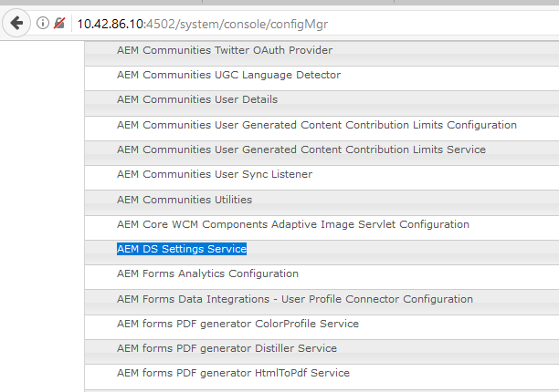
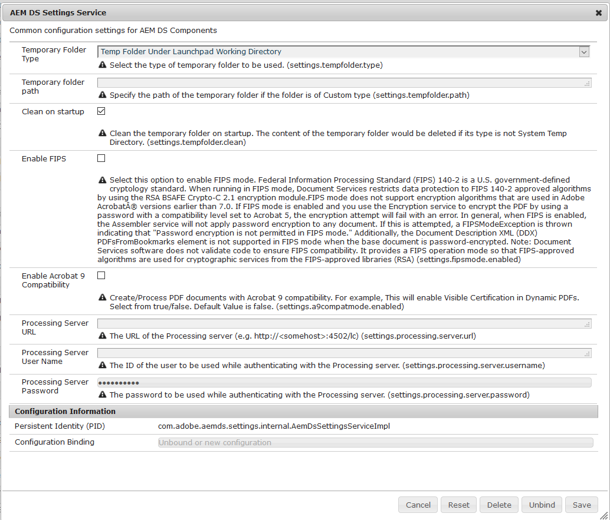

# Configuring AEM DS settings{#configuring-aem-ds-settings}

This article describes how to configure the **AEM DS Settings Service**. This setting can be used in multiple scenarios, for example:

* In Correspondence Management

    * For configuring AEM Forms Workflow
    * While using the Forms Portal for remote save of draft/submission

* In Adaptive forms, for cases when an Adaptive form is submitted from publish instance

Following are the steps to configure the **[!UICONTROL AEM DS Settings]**:

1. Open the Configuration Manager on the publish instance using the URL:   
   *https://localhost:port/system/console/configMgr*.

   

1. In the **[!UICONTROL Adobe Experience Manager Web Console Configuration]** window, locate and click the **[!UICONTROL AEM DS Settings]** option.

   

1. The **[!UICONTROL AEM DS Settings Service]** window displays the common configuration settings for AEM DS Components.

   

1. Add the following information in the respective fields:

   **[!UICONTROL Processing Server URL]**: The Processing Server is the server where the Forms or AEM workflow must be triggered. This can be the same as the URL of the AEM author instance or the other Server URL (that is, https://localhost:port/).

   **[!UICONTROL Processing Server User Name]**: Workflow user's User Name [based on the server URL being used]

   **[!UICONTROL Processing Server Password]**: Workflow user's Password

   >[!NOTE]
   >
   >
   >    
   >    
   >    * While using either Forms or AEM workflows, before you make any submission from the publish server, it is necessary to configure the DS settings service. Otherwise, the Form submission shall fail.
   >    
   >
