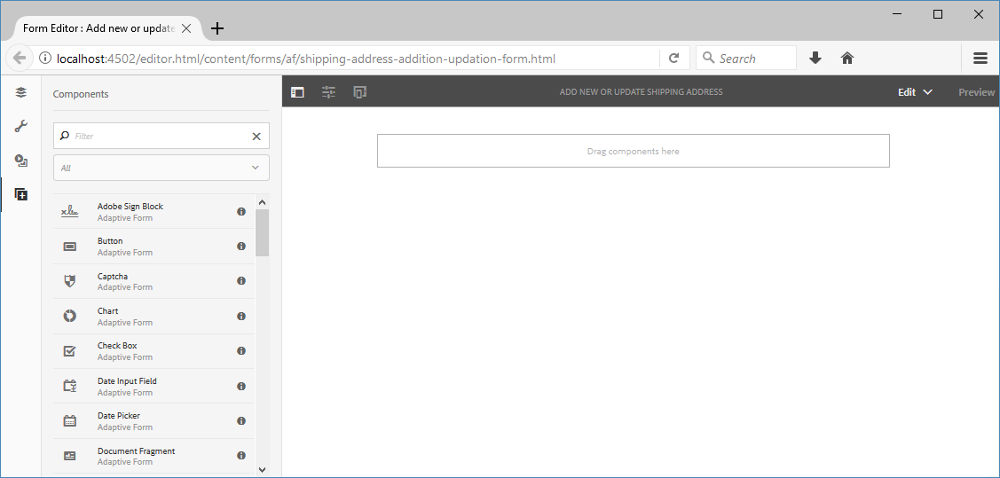
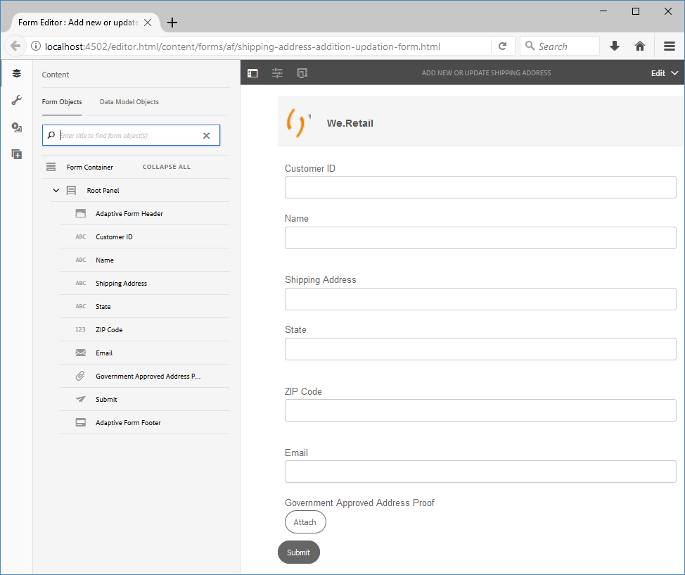

# Tutorial: Create an adaptive form {#do-not-publish-tutorial-create-an-adaptive-form}

 

This tutorial is a step in the [Create Your First Adaptive Form](/help/forms/using/create-your-first-adaptive-form.md) series. It is recommended to follow the series in chronological sequence to understand, perform, and demonstrate the complete tutorial use case.

## About the tutorial {#about-the-tutorial}

Adaptive forms are new-generation forms that are dynamic and responsive. You can use Adaptive forms to deliver personalized experiences. You can also integrate adaptive forms with [!DNL Adobe Analytics] for usage statistics and [!DNL Adobe Campaign] for campaign management. For more information about adaptive forms capabilities, see [Introduction to authoring adaptive forms](/help/forms/using/introduction-forms-authoring.md).

It is easier to create and manage forms when a proper process is followed. In this article, you learn how to:

* [Create an adaptive form that allows a customer to add a shipping address](/help/forms/using/create-adaptive-form.md#step-create-the-adaptive-form)  

* [Layout fields of an adaptive form to display and accept information from a customer](/help/forms/using/create-adaptive-form.md#step-add-header-and-footer)  

* [Create submit action to send an email containing form content](/help/forms/using/create-adaptive-form.md#step-add-components-to-capture-and-display-information)
* [Preview and submit an adaptive form](/help/forms/using/create-adaptive-form.md)

You will have a form similar to the following by end of article:  

## Step 1: Create the adaptive form {#step-create-the-adaptive-form}

1. Log in to the AEM author instance and navigate to **[!UICONTROL Adobe Experience Manager]** &gt; **[!UICONTROL Forms]** &gt; **[!UICONTROL Forms & Documents]**. The default URL is [http://localhost:4502/aem/forms.html/content/dam/formsanddocuments](http://localhost:4502/aem/forms.html/content/dam/formsanddocuments). 
1. Select **[!UICONTROL Create]** and select **[!UICONTROL Adaptive Form]**. An option to select a template appears. Select the **[!UICONTROL Blank]** template to select it and select **[!UICONTROL Next]**.  

1. An option to **[!UICONTROL Add Properties]** appears. The **[!UICONTROL Title]** and **[!UICONTROL Name]** fields are mandatory:

    * **Title:** Specify `Add new or update shipping address` in the **[!UICONTROL Title]** field. The title field specifies the display name of the form. The title helps you identify the form in the AEM [!DNL Forms] user interface.
    * **Name:** Specify `shipping-address-add-update-form` in the **[!UICONTROL Name]** field. The Name field specifies the name of the form. A node with the specified name is created in the repository. As you start typing a title, value for the name field is automatically generated. You can change the suggested value. The name field can include only alphanumeric characters, hyphens, and underscores. All the invalid inputs are replaced with a hyphen.

1. Select **[!UICONTROL Create]**. An adaptive form is created and a dialog to open the form for editing appears. Select **[!UICONTROL Open]** to open the newly created form in a new tab. The form opens for editing. It also displays the sidebar to customize the newly created form according to the needs.

   For information about adaptive form authoring interface and available components, see [Introduction to authoring adaptive forms](/help/forms/using/creating-adaptive-form.md).

   

## Step 2: Add header and footer {#step-add-header-and-footer}

AEM [!DNL Forms] provides many components to display information on an adaptive form. Header and Footer components help provide a consistent look and feel to a form. A header typically includes the logo of a corporation, the title of the form, and summary. A footer typically includes copyright information and links to other pages.

1. Select  &gt; . The component browser opens. Drag the **[!UICONTROL Header]** component from component browser to the adaptive form. 
1. Select **[!UICONTROL Logo]**. The toolbar appears. Select  on the toolbar, type **We.Retail**, and select .  

1. Select Image. The toolbar appears. Select . The properties browser opens on the left of the screen. **[!UICONTROL Browse]** and upload the logo image. Select . The image appears on the header.

   You can select Get file to download the logo used in this article if you do not have one.

   [Get File](assets/logo.png)

1. Drag the **[!UICONTROL Footer]** component from  to the adaptive form. At this stage, the form looks like the following: 

   

## Step 3: Add components to capture and display information {#step-add-components-to-capture-and-display-information}

Components are building blocks of an adaptive form. AEM [!DNL Forms] provides many components to capture and display information in an adaptive form. You can drag the components from  to a form. To learn about available components and corresponding functionality, see [Introduction to authoring adaptive forms](/help/forms/using/introduction-forms-authoring.md).

1. Drag the **[!UICONTROL Numeric Box component]** to the adaptive form. Place it before the footer component. Open properties of the component, change **[!UICONTROL Title]** of the component to **`Customer ID`**, change **[!UICONTROL Element Name]** to **`customer_ID`**, enable the **[!UICONTROL Required Field]** option, enable the **[!UICONTROL Use HTML5 Number Input Type]** option, and select .
1. Drag three Text Box components to the adaptive form. Place these before the footer component. Set the following properties for these text boxes.:

   <table> 
    <tbody> 
     <tr> 
      <td><b>Property</b></td> 
      <td><b>Text Box 1 </b></td> 
      <td><b>Text Box 2 </b></td> 
      <td><b>Text Box 3</b></td> 
     </tr> 
     <tr> 
      <td>Title</td> 
      <td>Name  </td> 
      <td>Shipping Address</td> 
      <td>State</td> 
     </tr> 
     <tr> 
      <td>Element Name</td> 
      <td>customer_Name  </td> 
      <td>customer_Shipping_Address</td> 
      <td>customer_State</td> 
     </tr> 
     <tr> 
      <td>Required Field</td> 
      <td>Enabled</td> 
      <td>Enabled</td> 
      <td>Enabled</td> 
     </tr> 
     <tr> 
      <td>Allow multiple lines  </td> 
      <td>Disabled</td> 
      <td>Enabled</td> 
      <td>Disabled</td> 
     </tr> 
    </tbody> 
   </table>

1. Drag a **[!UICONTROL Numeric Box]** component before the footer component. Open properties of the component, set values listed in the below table, Select .

   | Property |Value |
   |---|---|
   | Title |ZIP Code |
   | Element Name |customer_ZIPCode |
   | Maximum Number of Digits |6 |
   | Required Field |Enabled |
   | Display Pattern Type |No Pattern |

1. Drag an **[!UICONTROL Email]** component before the footer component. Open properties of the component, set values listed in the below table, and select .

   | Property |Value |
   |---|---|
   | Title |Email |
   | Element Name |customer_Email |
   | Required Field |Enabled |

1. Drag an **[!UICONTROL File Attachment]** component before the footer component. Open properties of the component, set values listed in the below table, and select .

   <table> 
    <tbody> 
     <tr> 
      <td><b>Property</b></td> 
      <td><b>Value</b></td> 
     </tr> 
     <tr> 
      <td>Title</td> 
      <td>Government approved address proof  </td> 
     </tr> 
     <tr> 
      <td>Element Name</td> 
      <td>customer_Address_Proof</td> 
     </tr> 
     <tr> 
      <td>Required Field</td> 
      <td>Enabled</td> 
     </tr> 
    </tbody> 
   </table>

1. Drag a **[!UICONTROL Submit Button]** component to the adaptive form. Place it before the footer component. Open properties of the component, change Element Name to `address_addition_update_submit`, select . The layout of the form is complete and the form looks like the following:

   

## Step 4: Configure submit action for the adaptive form {#step-configure-submit-action-for-the-adaptive-form}

A submit action is triggered when a user taps the Submit button on an adaptive form. You can use a submit action to save form data to the local repository, send form data to a REST endpoint, send form data as an email, and more. Adaptive forms provides a few more out-of-the-box submit actions. For detailed information, see [Configuring the Submit action](/help/forms/using/configuring-submit-actions.md).

Using the following steps, you can configure email submit action and demo submit action of the form:

1. Configure the email server. For details, see [Configuring Email Notification](/help/sites-administering/notification.md).

1. Select **[!UICONTROL Form Container]** in the Content browser and select . The properties browser opens on the left. 
1. Go to **[!UICONTROL Submission]** &gt;  **[!UICONTROL Submit Action]**. Select **[!UICONTROL Send Email]**. Specify the following values and select .

   |Property|Value|
   |--- |--- |
   |From|`donotreply@weretail.com`|
   |To|`${customer_Email}`|
   |Subject|Acknowledgement: You have added shipping address on We.Retail website.|
   |Email Template|Hi `${customer_Name}`, The following address is added as the shipping address for your account:  `${customer_Name}`, `${customer_Shipping_Address}`, `${customer_State}`, `${customer_ZIPCode}`  Regards, We.Retail|
   |Include attachments|Enabled|

   Your form is ready. Now, you can preview the form and test the functionality. If you have used the name mentioned the tutorial and accessing the form on the machine running AEM [!DNL Forms] server, then the form is available at [http://localhost:4502/editor.html/content/forms/af/shipping-address-add-update-form.html](http://localhost:4502/editor.html/content/forms/af/shipping-address-add-update-form.html).

## Step 5: Preview and submit the adaptive form {#step-preview-and-submit-the-adaptive-form}

You can use the **[!UICONTROL Preview option]** to evaluate appearance and behavior of a form. You can submit a form in preview mode and also check validations applied on a form. For example, if an error is displayed when a mandatory field is left empty.

Adaptive forms also provide an option to Emulate experience of a form for various devices. For example, iPhone, iPad, and Desktop. You can use both **[!UICONTROL Preview]** and **[!UICONTROL Emulator]**  options in conjunction with each other to preview a form for devices of different screen sizes.

1. Select the **[!UICONTROL Preview]** option on the right side of the form editor. The form opens in the preview mode. If you have used the name mentioned the tutorial, then preview URL of the form is [http://localhost:4502/content/dam/formsanddocuments/shipping-address-add-update-form/jcr:content?wcmmode=disabled](http://localhost:4502/content/dam/formsanddocuments/shipping-address-addition-updation-form/jcr:content?wcmmode=disabled)
1. Use  to view how the form looks on various devices.
1. Fill out fields of the form and select **[!UICONTROL Submit]**. The form is submitted and you are redirected to default **Thank You** page. You can also specify a custom thank you page. For details, see [Configuring redirect page](/help/forms/using/configuring-redirect-page.md).

The adaptive form to add an address is ready. If you have used the name mentioned in the tutorial and accessing the form on the machine running AEM Forms server, then the form is available at [http://localhost:4502/editor.html/content/forms/af/shipping-address-add-update-form.html](http://localhost:4502/editor.html/content/forms/af/shipping-address-add-update-form.html).
