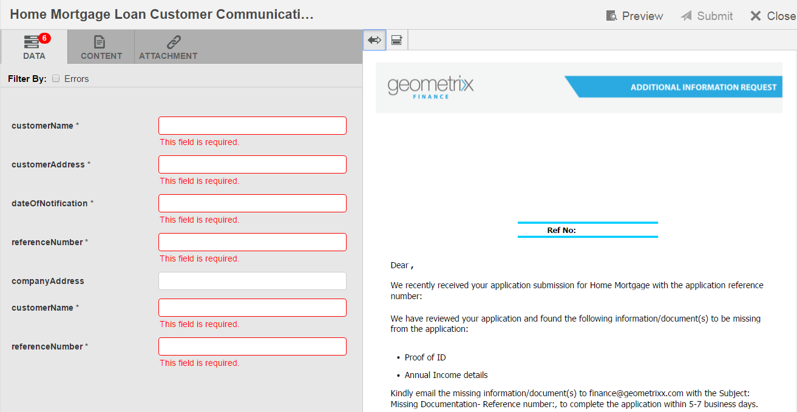
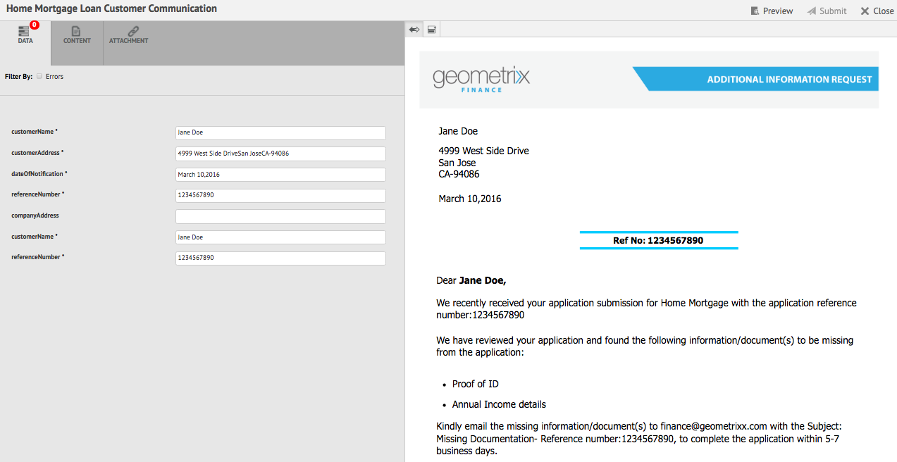
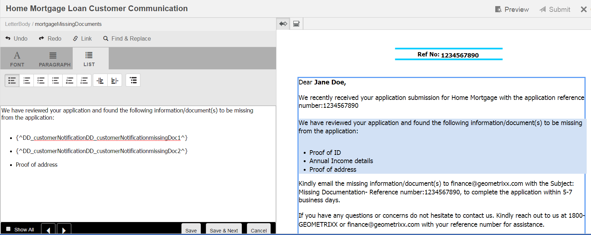
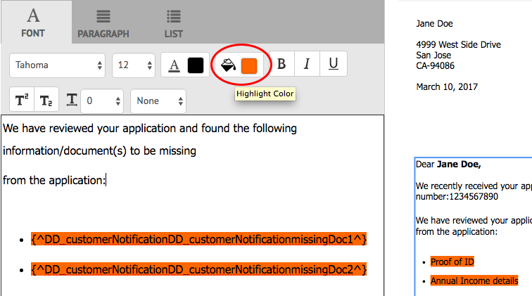
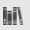
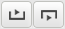
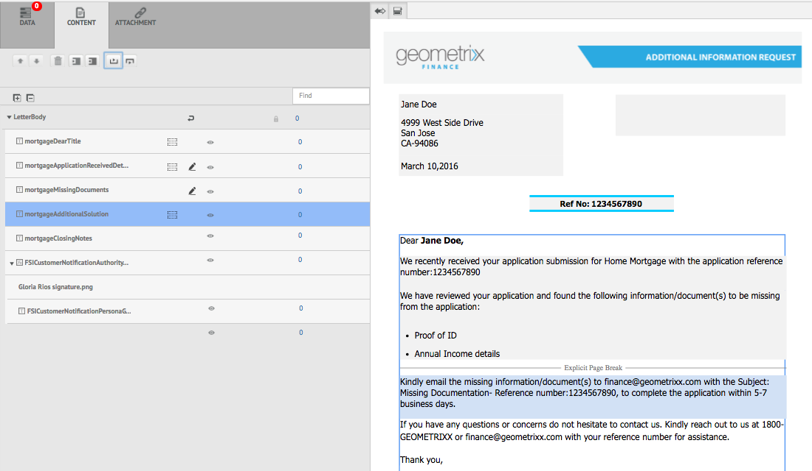

# Create Correspondence{#create-correspondence}

## Create correspondence in the Create Correspondence user interface {#create-correspondence-in-the-create-correspondence-user-interface}

After a [letter template is created in Correspondence Management](../../forms/using/create-letter.md), the end user/agent/claim adjustor can open the letter in the Create Correspondence user interface and create a correspondence by entering data, setting up content, and managing attachments. Finally, the claim adjustor or agent can manage the content in the preview mode and submit the letter.

### Preview a correspondence {#preview-a-correspondence}

Select the letter to preview using the following steps:

1. On the Letters page, tap **Select**.
1. Select the appropriate letter by tapping it.

   

   Select letter

1. For a Data Dictionary based letter, select **Preview** &gt; **Preview**. Or for a non-Data-Dictionary-based letter, select **Preview**. You can also hover over a letter (without selecting it) and tap the Letter Preview icon to preview it.

   >[!NOTE]
   >
   >If a data dictionary is not associated with the letter, the letter preview opens. Otherwise, if the letter is data dictionary based, Correspondence Management displays Preview and Custom options in the Preview menu and you can select one of the two options. You can also associate test data with a Data Dictionary. When the [Data Dictionary has associated test data](../../forms/using/data-dictionary.md#p-working-with-test-data-p), then on selecting the preview option, the normal preview opens with the test data populated.

1. To be able to render a correspondence while previewing it, you should either be an administrator or a part of one of the following groups:

    * forms-users (to preview on author instance)
    * cm-agent-users (for rendition on publish instance)

   If you do not the required permissions, request the admin for the appropriate access. For more information on creating and adding users to groups, see [Adding Users or Groups to a Group](/help/sites-administering/security.md). If you try to render a correspondence without having the appropriate permissions, the 404 error page appears.

1. If you've selected **Preview** &gt; **Custom**, a dialog opens. In the dialog, select a data file, corresponding to the data dictionary, to preview the letter with and then select **Preview**. A data file is created based on a data dictionary for a specific letter. For more information on the data file, see [Data Dictionary](../../forms/using/data-dictionary.md#p-working-with-test-data-p).

   

1. The letter HTML preview (mobile forms preview) opens with the Data tab in focus by default.

   For more information on mobile forms and the features they support, see [Feature differentiation between Mobile Forms and PDF Forms](https://helpx.adobe.com/livecycle/help/mobile-forms/feature-differentiation-mobile-forms-pdf.html).

   There are three tabs: data, content, and attachments. If there are no data elements (placeholder variables and layout fields) then the letter directly opens in with the Content tab displayed. Attachments tab is available only when attachments are present or library access is enabled.

   >[!NOTE]
   >
   >For more information on switching between HTML or PDF rendition mode of letter preview, see [Change rendition mode of letter](#changerenditionmode). For more information on PDF support in Correspondence Management and AEM, see [Discontinuation of NPAPI browser plug-ins and its impact](https://helpx.adobe.com/acrobat/kb/change-in-support-for-acrobat-and-reader-plug-ins-in-modern-web-.html). <!-- and [PDF Forms to HTML5 Forms](https://helpx.adobe.com/aem-forms/kb/pdf-forms-to-html5-forms.html). THIS URL IS A 404 AND NO SUITABLE REPLACEMENT TOPIC WAS FOUND. CONSIDER DELETING OR ADDING NEW LINK. COMMENTING OUT SO USERS DON'T CLICK IT. -->

### Enter data {#enterdata}

In the Data tab, fill up the available layout fields and placeholders.

1. Enter the data and content variables in the fields as required. Fill up all the mandatory fields marked with an asterisk (&#42;) to enable the **Submit** button.

   Tap a data field value in the HTML letter preview to highlight the corresponding data field in the Data tab.

    

### Manage Content {#managecontent}

In the content tab, manage the content such as document fragments and content variables in the letter.

1. Select **Content**. Correspondence Management displays the content tab of the letter.

   

1. Edit the content modules, as required, in the Content tab. To bring focus to the relevant content module in the content hierarchy, you can either tap the relevant line or paragraph in the letter preview or tap the content module directly in the Content hierarchy.

   For example, the line "We have reviewed... " is selected in the below graphic and the relevant content module is selected in the Content tab.

   

   In the Content or Data tab, by tapping Highlight Selected Modules ( ) on upper left of the HTML letter preview, you can disable or enable functionality to go to the content/data module when the relevant text, paragraph, or data field is selected in the letter preview.

   For more information on the actions available for various modules in the Create Correspondence user interface, see [Actions and info available in the Create Correspondence user interface](#actions-and-info-available-in-the-create-correspondence-content-tab).

1. To locate content modules, use the Find field. Enter full or partial name or title of the content module to search for it in the correspondence.
1. Tap the Display icon ( ) in front of a list, text, condition, or target area to show or hide it in the letter.
1. To edit an inline or editable text module, tap the relevant **Edit** icon ( ) or double-click the relevant text module in the letter preview.

   The system displays a text editor to edit and format the text.

   The default spellchecker in your browser checks spelling in the Text editor. To manage the spelling and grammar checking, you can edit your browser's spellchecker settings or install browser plugins/addons to check spelling and grammar.

   You can also use the various keyboard shortcuts in the text editor to manage, edit, and format text. For more information on [Text Editor](/help/forms/using/keyboard-shortcuts.md#correspondence-management) keyboard shortcuts in Correspondence Management Keyboard Shortcuts.

   

   You may want to reuse one of more paragraphs of text that exist in another application of document. You can directly copy and paste text, such as from MS Word, HTML pages, or any other application.

   You can copy and paste one or more paragraphs of text in an editable text module. For example, you may have an MS Word document with a bulleted list of acceptable proofs of residence such a following:

   

   You can directly copy and paste the text from the MS Word document to an editable text module. The formatting such as bulleted list, font, and text color is retained in the text module.

   

   >[!NOTE]
   >
   >The formatting of pasted text, however, has some [limitations](https://helpx.adobe.com/aem-forms/kb/cm-copy-paste-text-limitations.html).

   You can indent the text and numbers in your letter using the Tab key. For example, you can use the Tab key to align multiple columns of text in a list into a tabular format.

   

   Example: Using the Tab key to align multiple columns of text into a tabular format

   >[!NOTE]
   >
   >For more information on setting up tab spacing for your text modules and letters, see [More information on using tab spacing for arranging text](https://helpx.adobe.com/aem-forms/kb/cm-tab-spacing-limitations.html).

1. If required, insert special characters in the correspondence. For example, you can use the Special Characters palette to insert:

    * Currency symbols such as &euro;,￥, and £
    * Mathematical symbols such as ∑, √, ∂, and ^
    * Punctuation symbols such as ‟ and "

   

   Correspondence Management has built in support for 210 special characters. The admin can [add support for more/custom special characters by customization](../../forms/using/custom-special-characters.md).

1. To highlight\emphasize parts of text in an editable inline module, select the text and tap Highlight Color.

   

   You can either directly tap a basic color `**[A]**` present in the Basic Colors palette or tap **Select** after using the slider `**[B]**` to choose the appropriate shade of the color.

   Optionally, you can also go to the Advanced tab to select the appropriate Hue, Lightness, and Saturation `**[C]**` to create the precise color and then tap Select `**[D]**` to apply the color to highlight the text.

   

1. Make the appropriate content and format changes and tap **Save**. Tap ( ) to move between editable text modules, or tap **Save and Next** to save the changes and move to the next editable text module.
1. The system also displays the unfilled variables for each of the branches. When there are no unfilled variables, unfilled variables are shown as 0. If there is unfilled variable, you can tap a branch to expand it and locate the unfilled variable. Use the content toolbar to Delete content, increase/decrease indent of the content, and insert page breaks before/after the content.

   You can insert page breaks above and below data modules even when they are part of lists and conditions.

1. Tap Open/Close Content Variable ( ) to open the content variables and fill them appropriately.
1. Once you fill in the unfilled variable correctly, the count of unfilled variable is set to 0.

   In the Create Correspondence user interface, the unfilled variable count is displayed at each level of the hierarchy of any module that contains at least one variable. If a module contains unfilled variables, the count is displayed at the variable, module, target area, and letter template level.

   The unfilled variable count includes:

    * Only unprotected data dictionary and placeholder variables. The variable count does not include layout or protected data dictionary variables.
    * Mandatory fields.
    * Layout fields if they are mandatory and bound to the user.
    * Only unique variables instances. If a module, target area, or letter template contains two or more instances of the same variable, the count is displayed as 1 (one). However, for each of the instances, the count is displayed as 1.

   The unfilled variable count does not include deselected modules. If a module is included in a letter template but is not in the letter, the count for unfilled variables in this module are not displayed.

   For the target area, module, and variable the count is displayed to the right of each object in the letter template. However, for the complete template, the count is displayed in the Create Correspondence status bar.

   The modules in a letter template display the unfilled variable count as described below:

    * **Text** Displays the sum of the unique unfilled placeholder variables and data dictionary elements contained in the text module.
    * **Condition** Displays the sum of the unique unfilled condition variables contained in the condition and the variables contained in the resultant modules.
    * **List** Displays the sum of all unique unfilled variables contained in the modules assigned to the list.
    * **Target area** Displays the sum of all unique unfilled variables contained in the modules assigned to the target area.

   Note the following regarding variables with default values:

    * A Boolean variable field defaults to *false*. However, the variable is considered to be unfilled. This implies that the variable count includes all Boolean variable fields with value *false*.

    * A numeric variable field defaults to *0 (zero)*. However, the variable is considered to be unfilled. This implies that the variable count includes all numeric variable fields with value *0 (zero)*.

#### Actions and Info available in the Create Correspondence Content tab {#actions-and-info-available-in-the-create-correspondence-content-tab}

**Target Area**

* Insert Blank Line: Inserts new blank line.
* Insert Inline Text: Inserts new text module.
* Order Lock (info): Indicates that the order of the contents cannot be changed.
* Unfilled Values (info): Indicates the number of unfilled variables in the target area.

**Module**

* Selection (eye icon): Includes\excludes module from the letter.
* Skip Bullets (applicable for list modules and their child modules): Skips bullets in a particular module.
* Page Break Before (applicable for child modules of target area): Inserts page break before the module.
* Page Break After (applicable for child modules of target area): Inserts page break before the module.
* Unfilled Values (info): Indicates the number of unfilled variables in the target area.
* Edit (text modules only): Open rich text editor for editing the text module.
* Data Panel (text and condition modules): Open all variables of the module.

**List Module**

* Insert Blank Line: Inserts new blank line.
* Content Library: Opens content library to add modules to the list.
* List Setting (nested list only):
* Order Lock (info): Indicates that the order of the list items cannot be changed.

### Manage attachments {#manage-attachments}

1. Select **Attachments**. Correspondence Management displays the available attachments, as set up while creating the letter template.
1. You can choose not to submit an attachment along with the letter by tapping the view icon and you can tap the cross in the attachment to delete it from the letter. For the attachments specified, while creating a letter template, as Mandatory, the View and Delete icons are disabled.
1. Tap the Library Access ( ) icon to access Content Library to insert DAM assets as attachments.

   >[!NOTE]
   >
   >Library Access icon is available only library access was enabled while authoring the letter.

1. If the order of the attachments was not locked while creating the correspondence, you can reorder the attachments by selecting an attachment and tapping the down and up arrows.

   For more information, see [Attachment delivery](#attachmentdelivery).

### Manage content in preview and submit the letter {#manage-content-in-preview-and-submit-the-letter}

You can make layout and content related changes to ensure the letter looks the way you intend it to and submit it to the various post processes.

1. To highlight all the editable content in the letter, tap **Highlight Editable Sections**.

   The editable contents of the letter are highlighted with gray background.

   

1. Edit the content modules, as required, in the Content tab. To bring focus to the relevant content module in the content hierarchy, you can either tap the relevant line or paragraph in the letter preview or tap the content module directly in the Content hierarchy.

   For example, the line "To allow us to access..." is selected in the below graphic and the corresponding content module is selected in the Content tab.

   By tapping Highlight Selected Modules in Content ( ), you can disable or enable functionality to highlight the content module in Content tab when the relevant text, paragraph, or data field is tapped in the letter preview.

   For more information on the actions available for various modules in the Create Correspondence user interface, see [Actions and info available in the Create Correspondence user interface](#actions-and-info-available-in-the-create-correspondence-content-tab).

1. To add a page break to the letter, tap where you want to insert a page break and select Page Break Before or Page Break After ( ).

   An explicit page break placeholder gets inserted in the letter. To view how an explicit page break affects the letter, see the flattened PDF preview.

   >[!NOTE]
   >
   >As mobile forms do not support page breaks, headers and footers appear only once. You can, however, explicitly set headers and footers in the layout (per page) to appear in the mobile forms preview. Also, blank pages in the letter, if any, do not appear in the Mobile forms preview.

   

1. To save the letter as a draft, which you can continue working on later, tap Save As Draft. To use this option, your letter needs to be [published](../../forms/using/publishing-unpublishing-forms.md#publishanasset). For more information, see Draft Instance under [Saving drafts and submitting letter instances](#savingdrafts).

   

   The Draft Letter Name dialog appears with the letter instance id. You can, optionally edit this ID. Make a note of the letter Id and then tap **Done**. You can later use this ID to [reload the draft letter](submit-letter-topostprocess.md#reloaddraft).

1. To preview the letter as a flattened PDF with the exact layout and page breaks as it will be submitted, tap ( ) Preview.

   The letter appears as a flattened PDF. The flattened PDF is the exact representation of the letter as it will be submitted with the correct fonts, breaks, and layout of the letter.

   >[!NOTE]
   >
   >If you are using Mozilla Firefox and HTML rendition type, to preview the letter as flattened PDF, ensure that you use the native browser plug-in and not the Acrobat plugin. To select the native browser plug-in, go to Mozilla Firefox's settings and for content type PDF, select Preview in Firefox.

1. If you find the flattened PDF preview to be satisfactory, tap **Submit** to submit the letter. Or to make changes to the letter, tap **Exit Preview** to go back to the Create Correspondence UI preview of the letter to make changes in the letter. When you tap Submit, if the Manage Letter Instance configuration is enabled on the Publish instance, the submit letter instance is generated.

   For more information, see Draft Instance under Saving drafts and submitting letter instances.

   You can also save the letter as a draft to make changes to the letter later.

   After making the required changes, you can either submit the letter from the HTML5 preview or tap Preview again to review the flattened PDF output.

   For information on differences between HTML5 forms and PDF forms, see [Feature differentiation between HTML5 forms and PDF forms](../../forms/using/feature-differentiation-html5-forms-pdf-forms.md).

## Saving drafts and submitting letter instances {#savingdrafts}

When a letter is rendered in the Create Correspondence user interface, you can save the letter as being viewed.

There are two types of letter instances that can be saved: Draft instance and Submit instance.

* **Draft Instance**: Draft instance captures the current state of the letter you are previewing. To save a draft instance, first ensure that the letter and all the assets the letter references are in Published state. For information on publishing a letter, see [Publish an asset](../../forms/using/publishing-unpublishing-forms.md#publishanasset). You need to Publish a letter before you could save it as a draft, because when you publish a letter, you create a version of the letter, its dependent assets, and data at that point. The published version of a letter cannot be edited by you or another user and can be restored later without any unexpected discrepancies from the published version. You can return to this instance later and continue from where you left.

* **Submit Instance**: Submit instances captures the state of letter as it is submitted. Submit instance stores the PDF state of the letter instance after it is post processed along with the data entered by user in the Create Correspondence user interface.

Such instances can only be saved when the letter is being viewed on publish instance. By default saving on instances is turned off. To enable saving of letter instances, perform the following steps.

1. In AEM, open Adobe Experience Manager Web Console Configuration for your server using the following URL: https://&lt;server&gt;:&lt;port&gt;/&lt;contextpath&gt;/system/console/configMgr
1. Locate **[!UICONTROL Correspondence Management Configurations]** and click it.
1. Check **[!UICONTROL Manage Letter Instances on Publish]** configuration and then click **[!UICONTROL Save]**.

### Enable save draft feature {#enable-save-draft-feature}

 Before publishing letters or saving drafts on the publish instance, perform the following steps on author and publish instance to enable Save as Draft feature:

 The *cq:lastReplicationAction*, *cq:lastreplicated* and *cq:lastReplicatedBy* properties are not carried over to publish instance by default. In order to carry over *cq:lastReplicationAction*, *cq:lastreplicated* and *cq:lastReplicatedBy* properties to publish instance, disable the [!UICONTROL com.day.cq.replication.impl.ReplicationPropertiesFilterFactory] component. To disable the component:

 1. On the author instance, open the Adobe Experience Manager Web Console Components console. The default URL is `http://author-server:port/system/console/components`

 1. Search for the **[!UICONTROL com.day.cq.replication.impl.ReplicationPropertiesFilterFactory]** component.

 1. Click  icon to disable the [!UICONTROL com.day.cq.replication.impl.ReplicationPropertiesFilterFactory] component.

 

To enable save as draft feature, replace the existing URL at [!UICONTROL VersionRestoreManager Author URL] with URL of your author instance. To replace the URL: 

 1. On the publish instance, open [!UICONTROL Aode Manager Web Console Configuration]. The default URL is `https://publish-server:port/system/console/configMgr`
   
 1. Search and open the **[!UICONTROL Correspondence Management - Author instance Version Restore configurations]** component.

 1. Locate the **[!UICONTROL VersionRestoreManager Author URL]** field and specify the URL for the  author instance. 

 1. Click Save.

When the saving of letter instances is turned on, you have the option to select where to save the letter instances. There are two options for saving the letter instances: Local Save or Remote Save.

### Local save {#local-save}

Letter instances are saved on the publish instance and are reverse replicated on the author instance.

### Remote save {#remote-save}

This option exists for people who have concerns over saving user data on publish instances, which are in general case outside the corporate firewall. When remote save is turned on, the letter instances are not saved on publish instance but they are remotely saved on the processing author specified through the LiveCycle Client SDK configurations.

#### Enable remote save {#enable-remote-save}

1. In AEM, open Adobe Experience Manager Web Console Configuration for your server using the following URL: `https://<server>:<port>/<contextpath>/system/console/configMgr`
1. Search for **[!UICONTROL Correspondence Management Configurations]** and click it.
1. Locate the **[!UICONTROL Remote Save]** configuration, check it, and the click **[!UICONTROL Save]**.

#### Specify processing author settings {#specify-processing-author-settings}

1. In AEM, open Adobe Experience Manager Web Console Configuration for your server using the following URL: `https://<server>:<port>/system/console/configMgr`

   

1. On this page, locate Adobe LiveCycle Client SDK Configuration and expand it by clicking it.

1. In the Processing Server URL, enter the name of your LiveCycle server, provide the login information, and then click **Save**.

   

1. If necessary, set the user name and password with which you want to access the server.

#### Attachment delivery {#attachmentdelivery}

* The letter attachments are available post process in the PDF, which is created after letter submission.
* When the Letter is rendered using Server-side APIs as an interactive or non-interactive PDF, the rendered PDF contains attachments as PDF attachments.
* When a post process associated with a letter template is loaded as part of the Submit or Complete Correspondence operations using the Create Correspondence user interface, attachments are passed as the List&lt;com.adobe.idp.Document&gt; in AttachmentDocs parameter.
* Out-of-the-box delivery mechanisms, such as email and Print, also deliver attachments along with the PDF of the generated correspondence.

## Rendition modes of letter preview: Mobile forms preview and PDF preview {#rendition-modes-of-letter-preview-mobile-forms-preview-and-pdf-preview}

AEM Forms Correspondence Management displays a letter as HTML in the Create Correspondence UI. However, Correspondence Management still supports reverting to the PDF preview instead of HTML preview. For more information on switching between HTML and PDF mode of preview, see [Change rendition mode of letter](#changerenditionmode).

Following are the benefits and functionality available in HTML and PDF preview.

**Benefits of mobile forms/HTML preview**

* **Tap a data field value to highlight corresponding data field**: In the Create Correspondence user interface, you can tap a data field value in the letter to highlight the corresponding data field in the Data tab. For more information, see [Enter data](#enterdata).

* **Browser support**: Browsers a withdrawing support for NPAPI gradually, which affects PDF preview of letter. HTML/mobile forms preview of letter is unaffected by this.
* **Highlight editable content in a letter**: In the Create Correspondence user interface, you can tap Highlight Editable Content to highlight all the editable content in the letter in gray. For more information, see [Manage content](#managecontent).

`<li>` `<li>Benefits of HTML preview  <ul>   <li>Right to left</li>   <li>NPAPI</li>   <li>Highlight Editable Content</li>  </ul> </li>` `<li>Benefits of PDF preview  <ul>   <li>Page Break</li>   <li>Final Preview</li>  </ul> </li>`
`<li>` `<li>Benefits of HTML preview  <ul>   <li>Right to left</li>   <li>NPAPI</li>   <li>Highlight Editable Content</li>  </ul> </li>` `<li>Benefits of PDF preview  <ul>   <li>Page Break</li>   <li>Final Preview</li>  </ul> </li>`  **Benefits of PDF preview**

* **Page break**: In the PDF preview, you can view exactly how the page breaks in the letter affect its output.
* **Final preview**: In the PDF preview, you can view the exact formatting and appearance of the letter as the letter will appear in its output.

For information on scripting support in PDF forms, see [Scripting Support](https://help.adobe.com/en_US/livecycle/11.0/ScriptingSupport/index.html).

For more information on scripting support in HTML5 forms, see [Scripting support for HTML5 forms](/help/forms/using/scripting-support.md).

### Change rendition mode of letter {#changerenditionmode}

By default, the Create Correspondence UI uses the HTML or mobile forms to render the letter preview. The mobile forms preview has no issues rendering in any browser, as it uses the browser's native plug-in and requires no additional plug-ins. You can change the letter preview mode to PDF. However, browser constraints may create issues for different features of the interactive PDF preview of the letter.

For more information on browser compatibility with letter preview, see [Discontinuation of NPAPI browser plug-ins and its impact](https://helpx.adobe.com/acrobat/kb/change-in-support-for-acrobat-and-reader-plug-ins-in-modern-web-.html).

To change the preview mode of the letter, complete the following steps:

1. Go to `https://[system]:'port'/system/console/configMgr` and, if necessary, log in as Admin.
1. Go to **[!UICONTROL Correspondence Management Configurations]** > **[!UICONTROL Rendition Type]** and select **HTML Rendition** (Default) or **PDF Rendition**.
1. Click **[!UICONTROL Save]**.
