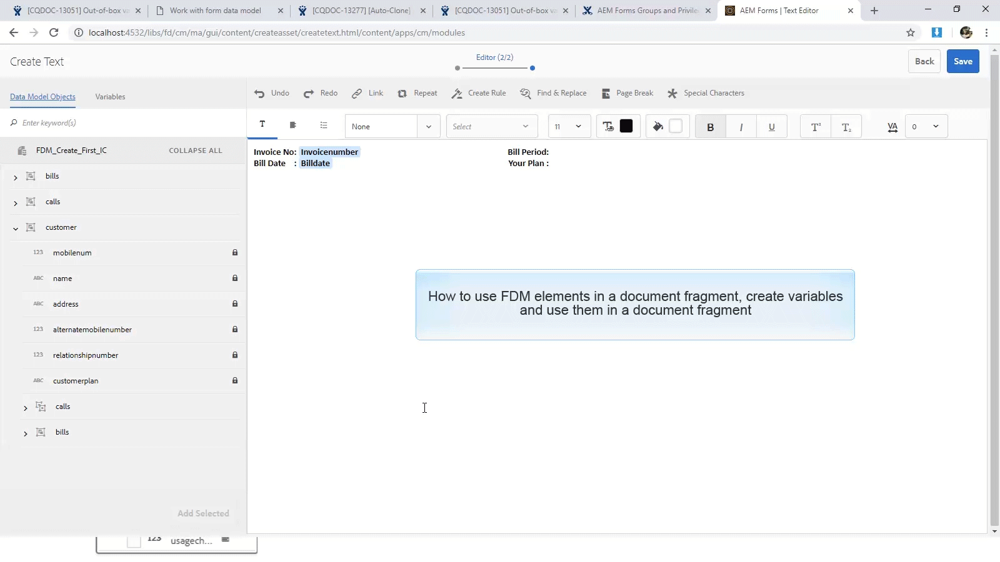
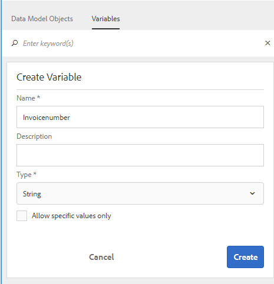
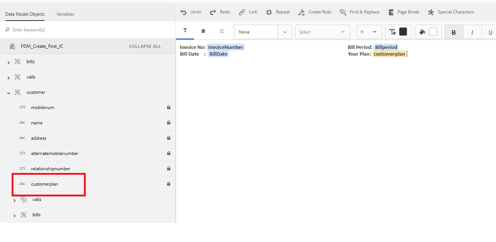
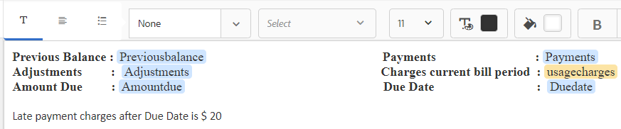
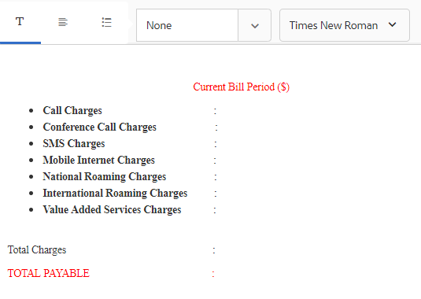
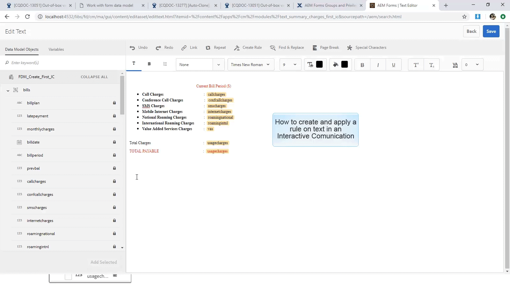

# Tutorial: Create document fragments{#tutorial-create-document-fragments}

 

| This tutorial is a step in the [Create your first Interactive Communication](/forms/using/create-your-first-interactive-communication.md) series. It is recommended to follow the series in chronological sequence to understand, perform, and demonstrate the complete tutorial use case. |
|---|

Document fragments are reusable components of a correspondence that are used to compose an Interactive Communication. The document fragments are of the following types:

* Text - A text asset is a piece of content that consists of one or more paragraphs of text. A paragraph can be static or dynamic.
* List - List is a group of document fragments, including text, lists, conditions, and images. 
* Condition - Conditions enable you to define what content gets included in the Interactive Communication based on the data received from the Form Data Model.

This tutorial walks you through the steps to create multiple text document fragments based on the anatomy provided in [Plan the Interactive Communication](/forms/using/planning-interactive-communications.md) section. At the end of this tutorial, you will be able to:

* Create document fragments
* Create variables
* Create and apply rules

The following is the list of document fragments that are created in this tutorial:

* [Bill details](../../forms/using/create-document-fragments.md#step-create-bill-details-text-document-fragment)
* [Customer details](../../forms/using/create-document-fragments.md#step-create-customer-details-text-document-fragment)
* [Bill summary](../../forms/using/create-document-fragments.md#step-create-bill-summary-text-document-fragment)
* [Summary of charges](../../forms/using/create-document-fragments.md#step-create-summary-of-charges-text-document-fragment)

Each document fragment includes fields with static text, data received from form data model, and data entered using the Agent UI. All these fields have been depicted in the [Plan the Interactive Communication](/forms/using/planning-interactive-communications.md) section.

While creating document fragments in this tutorial, variables are created for fields that receive data using the Agent UI.

Use **FDM_Create_First_IC**, as described in the [Create form data model](../../forms/using/create-form-data-model0.md) section, as the form data model to create document fragments in this tutorial.

## Step 1: Create Bill Details text document fragment {#step-create-bill-details-text-document-fragment}

The Bill Details document fragment includes the following fields:

| Field |Data Source |
|---|---|
| Invoice No |Agent UI |
| Bill Period |Agent UI |
| Bill Date |Agent UI |
| Your Plan |Form data model |

Execute the following steps to create variables for fields with Agent UI as the data source, create static text, and use form data model elements in the document fragment:

1. Select **Forms** &gt; **Document Fragments**.   

1. Select **Create** &gt; **Text**.
1. Specify the following information:

    1. Enter **bill_details_first_ic** as the name in the **Title** field. The title gets auto-populated in the **Name** field.
    
    1. Select **Form Data Model** from the **Data Model** section.
    
    1. Select **FDM_Create_First_IC** as the form data model and tap **Select**.
    
    1. Tap **Next**.

1. Select the **Variables** tab in the left pane and tap **Create**.
1. In the **Create Variable** section:

    1. Enter **Invoicenumber** as the name of the variable.
    1. Select **String** as type.
    1. Tap **Create**.

   

   Repeat step 4 and 5 to create the following variables:

    * Billperiod: String type
    * BillDate: Date type

   

1. Create static text for the following fields using the right pane:

    * Invoice No
    * Bill Period
    * Bill Date
    * Your Plan

   

1. Place the cursor next to the **Invoice No** field and double-click the **InvoiceNumber** variable from the **Variables** tab in the left pane.
1. Place the cursor next to the **Bill Period** field and double-click the **Billperiod** variable.
1. Place the cursor next to the **Bill Date** field and double-click the **Bill Date** variable.
1. Select the **Data Model Objects** tab in the left pane.
1. Place the cursor next to the **Your Plan** field and double-click the **customer** &gt; **customerplan** property.

   

1. Click **Save **to create the Bill Details text document fragment.

## Step 2: Create Customer Details text document fragment {#step-create-customer-details-text-document-fragment}

The Customer Details document fragment includes the following fields:

| Field |Data Source |
|---|---|
| Customer name |Form data model |
| Address |Form data model |
| Place of Supply |Agent UI |
| State Code |Agent UI |
| Mobile Number |Form data model |
| Alternate Contact Number |Form data model |
| Relationship Number |Form data model |
| Number of Connections |Agent UI |

Execute the following steps to create variables for fields with Agent UI as the data source, create static text, and use form data model elements in the document fragment:

1. Select **Forms** &gt; **Document Fragments**. 
1. Select **Create** &gt; **Text**.
1. Specify the following information:

    1. Enter **customer_details_first_ic** as the name in the **Title** field. The title gets auto-populated in the **Name** field.
    
    1. Select **Form Data Model** from the **Data Model** section.
    
    1. Select **FDM_Create_First_IC** as the form data model and tap **Select**.
    
    1. Tap **Next**.

1. Select the **Variables** tab in the left pane and tap **Create**.
1. In the **Create Variable** section:

    1. Enter **Placesupply** as the name of the variable.
    1. Select **String** as type.
    1. Tap **Create**.

   Repeat step 4 and 5 to create the following variables:

    * Statecode: Number type
    * Numberconnections: Number type

1. Select the **Data Model Objects** tab, place the cursor in the right pane, and double-click the **customer** &gt; **name** property.
1. Press Enter to move the cursor to the next line and double-click the **customer** &gt; **address** property.
1. Create static text for the following fields using the right pane:

    * Mobile Number
    * Alternate Contact Number
    * Place of Supply
    * Relationship Number
    * State Code
    * Number of connections

   

1. Place the cursor next to the **Mobile Number** field and double-click the **customer** &gt; **mobilenum** property.
1. Place the cursor next to the **Alternate Contact Number** field and double-click the** customer** &gt; **alternatemobilenumber** property.
1. Place the cursor next to the **Relationship Number** field and double-click the **customer** &gt; **relationshipnumber** property.
1. Select the **Variables** tab, place the cursor next to the **Place of Supply** field and double-click the **Placesupply** variable.
1. Place the cursor next to the **State Code** field and double-click the **Statecode** variable.
1. Place the cursor next to the **Number of Connections** field and double-click the **Numberconnections** variable.

   

1. Click **Save **to create the Customer Details text document fragment.

## Step 3: Create Bill Summary text document fragment {#step-create-bill-summary-text-document-fragment}

The Bill Summary document fragment includes the following fields:

| Field |Data Source |
|---|---|
| Previous Balance |Agent UI |
| Payments |Agent UI |
| Adjustments |Agent UI |
| Charges current bill period |Form data model |
| Amount Due |Agent UI |
| Due Date |Agent UI |

Execute the following steps to create variables for fields with Agent UI as the data source, create static text, and use form data model elements in the document fragment:

1. Select **Forms** &gt; **Document Fragments**. 
1. Select **Create** &gt; **Text**.
1. Specify the following information:

    1. Enter **bill_summary_first_ic** as the name in the **Title** field. The title gets auto-populated in the **Name** field.
    
    1. Select **Form Data Model** from the **Data Model** section.
    
    1. Select **FDM_Create_First_IC** as the form data model and tap **Select**.
    
    1. Tap **Next**.

1. Select the **Variables** tab in the left pane and tap **Create**.
1. In the **Create Variable** section:

    1. Enter **Previousbalance** as the name of the variable.
    1. Select **Number** as type.
    1. Tap **Create**.

   Repeat step 4 and 5 to create the following variables:

    * Payments: Number type
    * Adjustments: Number type
    * Amountdue: Number type
    * Duedate: Date type

1. Create static text for the following fields using the right pane:

    * Previous Balance
    * Payments
    * Adjustments
    * Charges current bill period
    * Amount Due
    * Due Date
    * Late payment charges after Due Date is $ 20

   

1. Place the cursor next to the **Previous Balance** field and double-click the **Previousbalance** variable.
1. Place the cursor next to the **Payments** field and double-click the **Payments** variable.
1. Place the cursor next to the **Adjustments** field and double-click the **Adjustments** variable.
1. Place the cursor next to the **Amount Due** field and double-click the **Amountdue** variable.
1. Place the cursor next to the **Due Date** field and double-click the **Duedate** variable.
1. Select the **Data Model Objects** tab, place the cursor next to the **Charges current bill period** field in the right pane, and double-click the **bills** &gt; **usagecharges** property.

   

1. Click **Save** to create the Customer Details text document fragment.

## Step 4: Create Summary of charges text document fragment {#step-create-summary-of-charges-text-document-fragment}

The Summary of charges document fragment includes the following fields:

| Field |Data Source |
|---|---|
| Call Charges |Form data model |
| Conference Call Charges |Form data model |
| SMS Charges |Form data model |
| Mobile Internet Charges |Form data model |
| National Roaming Charges |Form data model |
| International Roaming Charges |Form data model |
| Value Added Services Charges |Form data model |
| Total Charges |Form data model |
| TOTAL PAYABLE |Form data model |

Execute the following steps to create static text and use form data model elements in the document fragment:

1. Select **Forms** &gt; **Document Fragments**. 
1. Select **Create** &gt; **Text**.
1. Specify the following information:

    1. Enter **summary_charges_first_ic **as the name in the **Title** field. The title gets auto-populated in the Name field.
    
    1. Select **Form Data Model** from the **Data Model** section.
    
    1. Select **FDM_Create_First_IC** as the form data model and tap **Select**.
    
    1. Tap **Next**.

1. Create static text for the following fields using the right pane:

    * Call Charges
    * Conference Call Charges
    * SMS Charges
    * Mobile Internet Charges
    * National Roaming Charges
    * International Roaming Charges
    * Value Added Services Charges
    * Total Charges
    * TOTAL PAYABLE

   

1. Select the **Data Model Objects** tab.
1. Place the cursor next to the **Call Charges** field and double-click the **bills** &gt; **callcharges **property.
1. Place the cursor next to the **Conference** **Call Charges** field and double-click the **bills** &gt; **confcallcharges **property.
1. Place the cursor next to the **SMS Charges** field and double-click the **bills** &gt; **smscharges **property.
1. Place the cursor next to the **Mobile Internet Charges** field and double-click the **bills** &gt; **internetcharges **property.
1. Place the cursor next to the **National Roaming Charges** field and double-click the **bills** &gt; **roamingnational **property.
1. Place the cursor next to the **International Roaming Charges** field and double-click the **bills** &gt; **roamingintnl **property.
1. Place the cursor next to the **Value Added Services Charges** field and double-click the **bills** &gt; **vas **property.
1. Place the cursor next to the **Total Charges** field and double-click the **bills** &gt; **usagecharges **property.
1. Place the cursor next to the **TOTAL PAYABLE** field and double-click the **bills** &gt; **usagecharges **property.

   

1. Select the text in the **Value Added Services Charges** row and tap **Create Rule **to create a condition based on which the row is displayed in the Interactive Communication:
1. On the **Create Rule** pop-up window:

    1. Select **Data Models and Variables** and then **bills** &gt; **callcharges**.
    
    1. Select **is less than** as the operator.
    1. Select **Number** and enter the value as **60**.

   Based on this condition, Value Added Services Charges row is displayed only if the value for the Call Charges field is less than 60.

   

1. Click **Save **to create the Summary of charges text document fragment.

