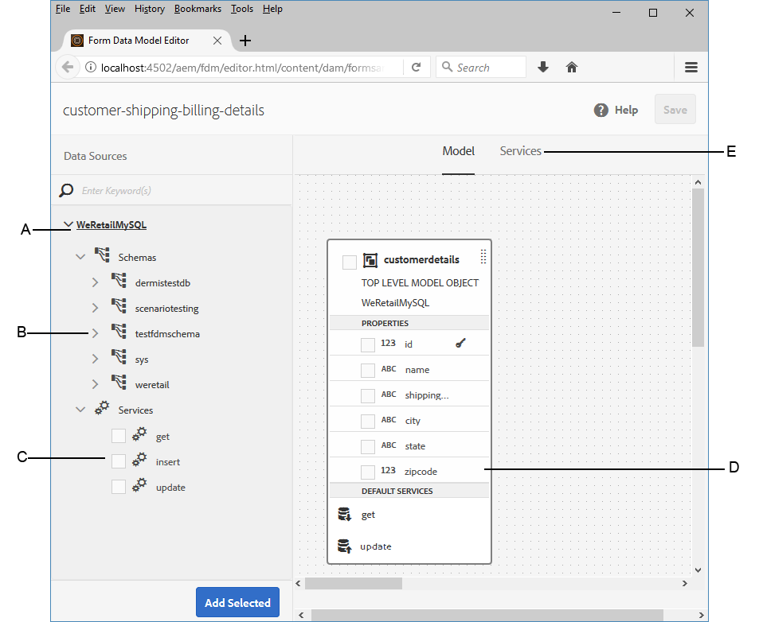
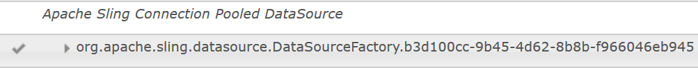
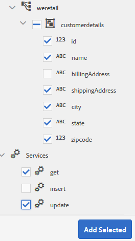
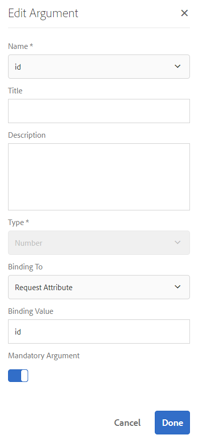
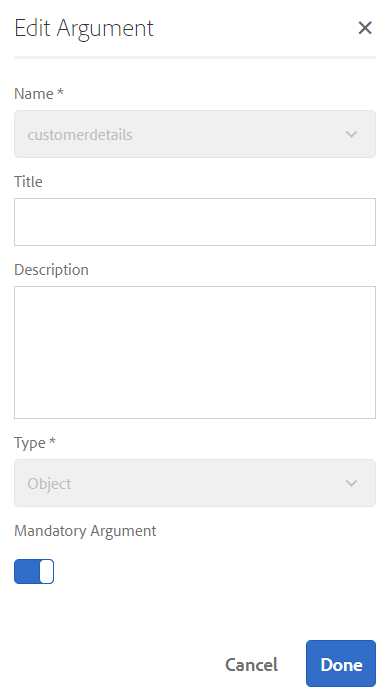
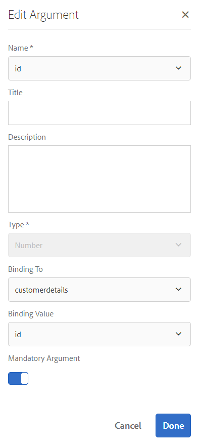
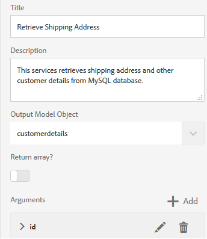
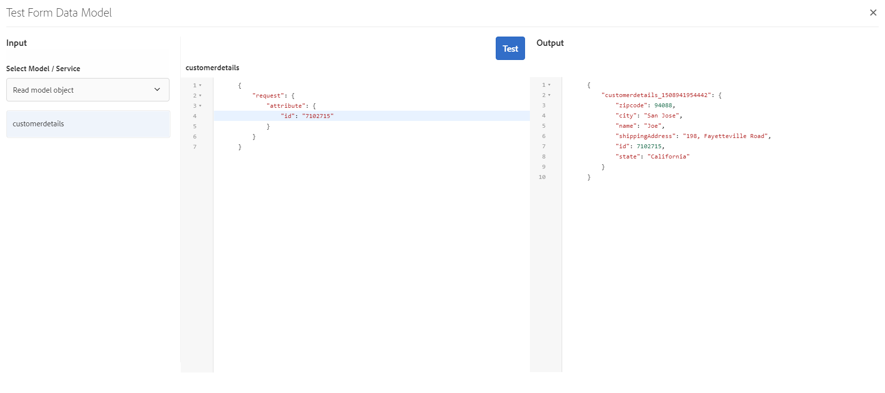
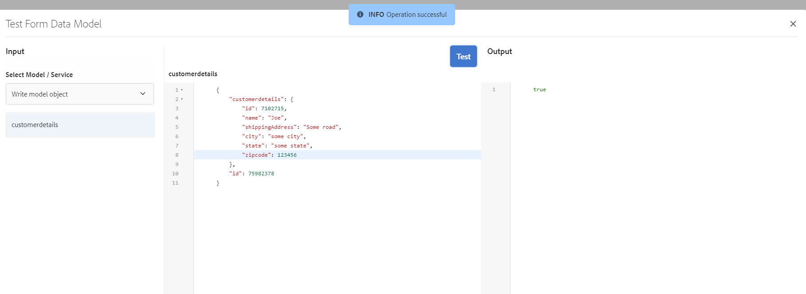

# Tutorial: Create form data model  {#tutorial-create-form-data-model}

 

This tutorial is a step in the [Create Your First Adaptive Form](/help/forms/using/create-your-first-adaptive-form.md) series. It is recommended to follow the series in chronological sequence to understand, perform, and demonstrate the complete tutorial use case.

## About the tutorial {#about-the-tutorial}

AEM Forms data integration module allows you to create a form data model from disparate backend data sources such as AEM user profile, RESTful web services, SOAP-based web services, OData services, and relational databases. You can configure data model objects and services in a form data model and associate it with an adaptive form. Adaptive form fields are bound to data model object properties. The services enable you to prefill the adaptive form and write submitted form data back to the data model object.

For more information about form data integration and form data model, see [AEM Forms Data Integration](/help/forms/using/data-integration.md).

This tutorial walks you through the steps to prepare, create, configure, and associate a form data model with an adaptive form. At the end of this tutorial, you will be able to:

* [Configure MySQL database as data source](#config-database)
* [Create form data model using MySQL database](#create-fdm) 
* [Configure form data model](#config-fdm)
* [Test form data model](#test-fdm)

The form data model will look similar to the following:

**A.** Configured data sources **B.** Data source schemas **C.** Available services **D.** Data model objects **E.** Configured services

## Prerequisites {#prerequisites}

Before you begin, ensure that you have the following:

* MySQL database with sample data as stated in the Prerequisites section of [Create your first adaptive form](/help/forms/using/create-your-first-adaptive-form.md)
* OSGi bundle for MySQL JDBC driver as explained in [Bundling the JDBC Database Driver](/help/sites-developing/jdbc.md#bundling-the-jdbc-database-driver)
* Adaptive form as explained in the first tutorial [Create an adaptive form](/help/forms/using/create-adaptive-form.md)

## Step 1: Configure MySQL database as data source {#config-database}

You can configure different types of data sources to create a form data model. For this tutorial, we will configure the MySQL database that you configured and populated with sample data. For information about other supported data sources and how to configure them, see [AEM Forms Data Integration](/help/forms/using/data-integration.md).

Do the following to configure your MySQL database:

1. Install JDBC driver for MySQL database as an OSGi bundle:

    1. Log in to AEM Forms Author Instance as an administrator and go to AEM web console bundles. The default URL is [http://localhost:4502/system/console/bundles](http://localhost:4502/system/console/bundles).  

    1. Tap **Install/Update**. An **Upload / Install Bundles** dialog appears.  

    1. Tap **Choose File** to browse and select the MySQL JDBC driver OSGi bundle. Select **Start Bundle** and **Refresh Packages**, and tap **Install or Update**. Ensure that the Oracle Corporation's JDBC Driver for MySQL is active. The driver is installed.

1. Configure MySQL database as a data source:

    1. Go to AEM web console at [http://localhost:4502/system/console/configMgr](http://localhost:4502/system/console/configMgr).
    1. Locate **Apache Sling Connection Pooled DataSource** configuration. Tap to open the configuration in edit mode.
    1. In the configuration dialog, specify the following details:

        * **Datasource name:** You can specify any name. For example, specify **WeRetailMySQL**. 
        * **DataSource service property name**: Specify name of the service property containing the DataSource name. It is specified while registering the data source instance as OSGi service. For example, **datasource.name**.
        * **JDBC driver class**: Specify Java class name of the JDBC driver. For MySQL database, specify **com.mysql.jdbc.Driver**. 
        * **JDBC connection URI**: Specify connection URL of the database. For MySQL database running on port 3306 and schema weretail, the URL is: `jdbc:mysql://[server]:3306/weretail?autoReconnect=true&useUnicode=true&characterEncoding=utf-8`
        * **Username:** Username of the database. It is required to enable JDBC driver to establish a connection with the database.
        * **Password:** Password of the database. It is required to enable JDBC driver to establish a connection with the database.
        * **Test on Borrow:** Enable the **Test on Borrow** option.   
        * **Test on Return:** Enable the **Test on Return** option.   
        * **Validation Query:** Specify a SQL SELECT query to validate connections from the pool. The query must return at least one row. For example, **select &ast; from customerdetails**.
        * **Transaction Isolation**: Set the value to **READ_COMMITTED**.

       Leave other properties with default [values](https://tomcat.apache.org/tomcat-7.0-doc/jdbc-pool.html) and tap **Save**.

   A configuration similar to the following is created.

   

## Step 2: Create form data model {#create-fdm}

AEM Forms provides an intuitive user interface to [create a form data mode](/help/forms/using/data-integration.md#main-pars-header-1524967585)l from configured data sources. You can use multiple data sources in a form data model. For our use case, we will use the configured MySQL data source.

Do the following to create form data model:

1. In AEM author instance, navigate to **Forms** &gt;  **Data Integration**s.
1. Tap **Create** &gt;  **Form Data Model**.
1. In the Create Form Data Model dialog, specify a **name** for the form data model. For example, **customer-shipping-billing-details**. Tap **Next**.
1. The select datasource screen lists all configured data sources. Select **WeRetailMySQL** data source and tap **Create**.

   

The **customer-shipping-billing-details** form data model is created.

## Step 3: Configure form data model {#config-fdm}

Configuring form data model involves:

* adding data model object and services 
* configuring read and write services for data model objects

Do the following to configure the form data model:

1. On AEM author instance, navigate to **Forms &gt; Data Integrations**. The default URL is [http://localhost:4502/aem/forms.html/content/dam/formsanddocuments-fdm](http://localhost:4502/aem/forms.html/content/dam/formsanddocuments-fdm).
1. The **customer-shipping-billing-details** form data model you created earlier is listed here. Open it in edit mode.

   The selected data source **WeRetailMySQL** is configured in the form data model.

   

1. Expand the WeRailMySQL data source tree. Select the following data model objects and services from **weretail** &gt;  **customerdetails** schema to form data model:

    * **Data model objects**:

        * id
        * name
        * shippingAddress
        * city
        * state
        * zipcode

    * **Services:**

        * get
        * update

   Tap **Add Selected** to add selected data model objects and services to the form data model.

   

   >[!NOTE]
   >
   >The default get, update, and insert services for JDBC datasources are provided out-of-the-box with form data model .

1. Configure read and write services for the data model object.

    1. Select the **customerdetails** data model object and tap **Edit Properties**.
    1. Select **get** from the Read Service drop-down. The **id** argument, which is the primary key in the customerdetails data model object is added automatically. Tap  and configure the argument as follows.
    
       

    1. Similarly, select **update** as the Write Service. The **customerdetails** object is added as an argument automatically. The argument is configured as follows.
    
           
    
       Add and configure the **id** argument as follows.
    
       

    1. Tap **Done** to save the data model object properties. Then, tap **Save** to save the form data model.

       The **get** and **update** services are added as default services for the data model object.
    
       

1. Go to the **Services** tab and configure **get** and **update** services.

    1. Select the **get** service and tap **Edit Properties**. The properties dialog opens. 
    1. Specify the following in the Edit Properties dialog:

        * **Title**: Specify title of the service. For example: Retrieve Shipping Address.
        * **Description**: Specify description containing detailed functioning of the service. For example:  

          This service retrieves shipping address and other customer details from MySQL database

        * **Output Model Object**: Select schema containing customer data. For example:  

          customerdetail schema
        * **Return array**: Disable the **Return array** option.
        * **Arguments**: Select argument named **ID**.

       Tap **Done**. Service to retrieve customer details from the MySQL database is configured.

       

    1. Select the **update** service and tap **Edit Properties**. The properties dialog opens.   

    1. Specify the following in the Edit Properties dialog:

        * **Title**: Specify title of the service. For example, Update Shipping Address.

        * **Description**: Specify description containing detailed functioning of the service. For example:  

          This service updates shipping address and related fields in MySQL database
        
        * **Input Model Object**: Select schema containing customer data. For example:  

          customerdetail schema
        
        * **Output type**: Select **BOOLEAN**.  
        * **Arguments**: Select argument named **ID** and **customerdetails**.

       Tap **Done**. The **update** service to update customer details in the MySQL database is configured.
    
       

The data model object and services in the form data model are configured. You can now test the form data model.

## Step 4: Test form data model {#test-fdm}

You can test the data model object and services to verify that the form data model is configured properly.

Do the following to run the test:

1. Go to the **Model** tab, select the **customerdetails** data model object, and tap **Test Model Object**.
1. In the **Test Model / Service** window, select **Read model object** from the **Select Model / Service** drop-down.
1. In the **customerdetails** section, specify a value for the **id** argument that exists in the configured MySQL database and tap **Test**.

   The customer details associated with the specified id are fetched and displayed in the **Output** section as shown below.

   

1. Similarly, you can test the Write model object and services.

   In the following example, the update service successfully updates the address details for the id 7102715 in the database.

   

   Now, if you test the read model service again for the id 7107215, it will fetch and display the updated customer details as shown below.

   

