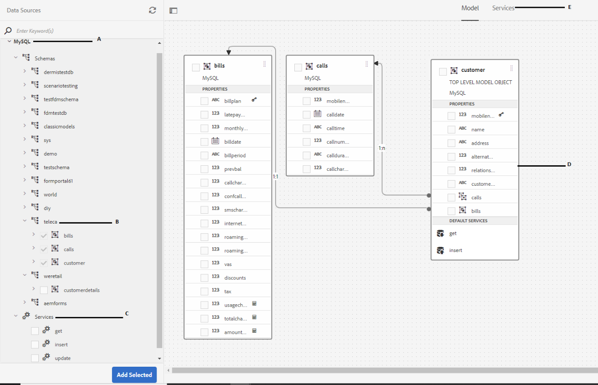
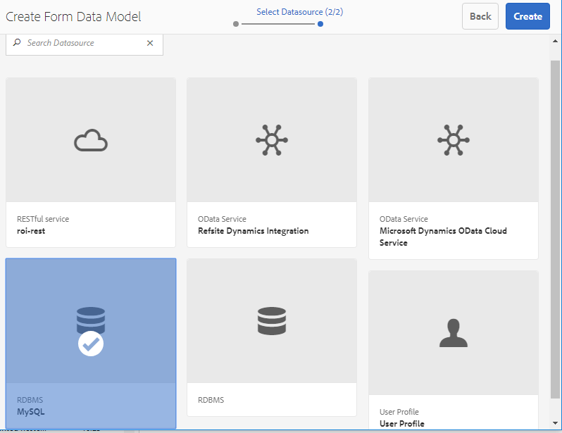
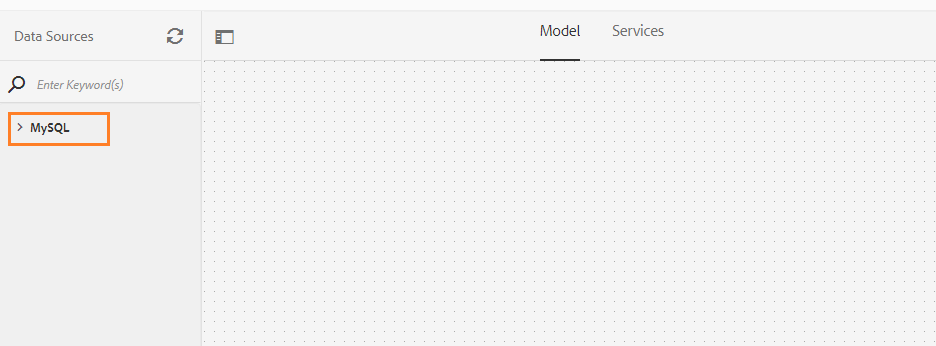
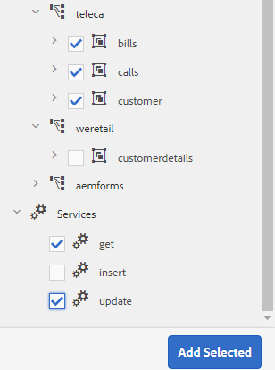
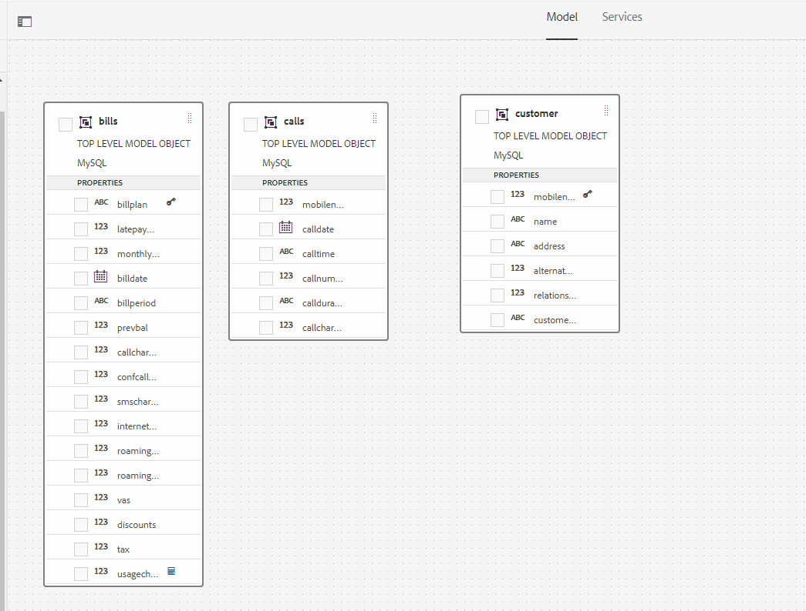
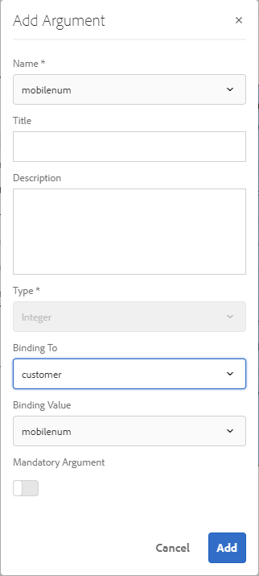
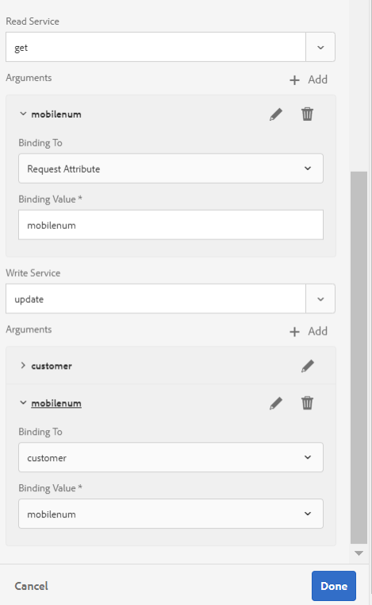
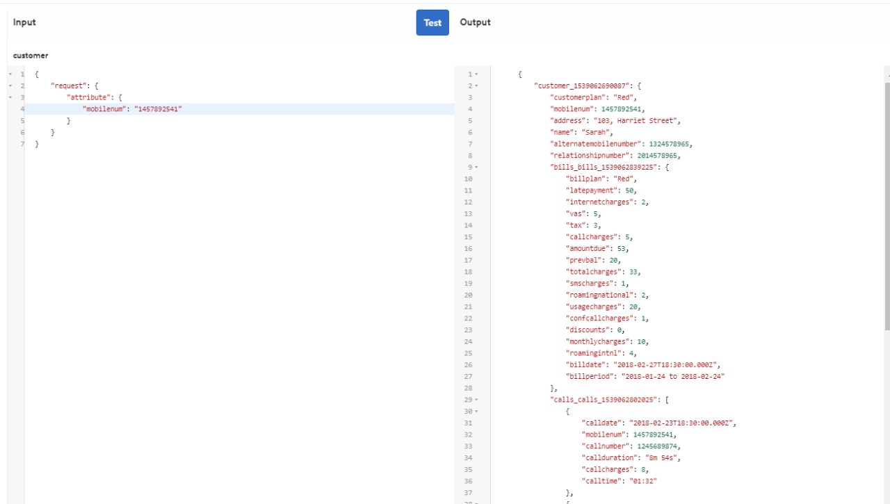
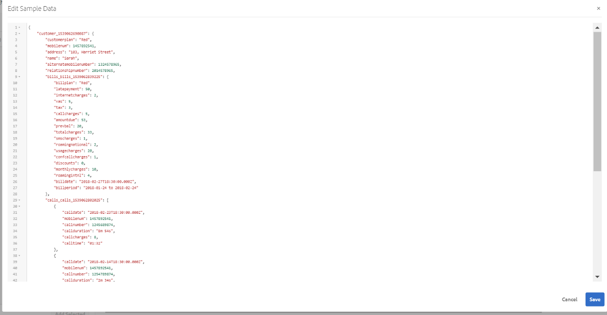

# Tutorial: Create form data model in AEM Forms{#tutorial-create-form-data-model}

 

This tutorial is a step in the [Create your first Interactive Communication](/help/forms/using/create-your-first-interactive-communication.md) series. It is recommended to follow the series in chronological sequence to understand, perform, and demonstrate the complete tutorial use case.

## About the tutorial {#about-the-tutorial}

AEM Forms data integration module allows you to create a form data model from disparate backend data sources such as AEM user profile, RESTful web services, SOAP-based web services, OData services, and relational databases. You can configure data model objects and services in a form data model and associate it with an adaptive form. Adaptive form fields are bound to data model object properties. The services enable you to prefill the adaptive form and write submitted form data back to the data model object.

For more information about form data integration and form data model, see [AEM Forms Data Integration](https://helpx.adobe.com/experience-manager/6-3/forms/using/data-integration.html).

This tutorial walks you through the steps to prepare, create, configure, and associate a form data model with an interactive communication. At the end of this tutorial, you will be able to:

* [Set up the database](../../forms/using/create-form-data-model0.md#step-set-up-the-database)
* [Configure MySQL database as data source](../../forms/using/create-form-data-model0.md#step-configure-mysql-database-as-data-source)
* [Create form data model](../../forms/using/create-form-data-model0.md#step-create-form-data-model)
* [Configure form data model](../../forms/using/create-form-data-model0.md#step-configure-form-data-model)
* [Test form data model](../../forms/using/create-form-data-model0.md#step-test-form-data-model-and-services)

The form data model looks similar to the following:



**A.** Configured data sources **B.** Data source schemas **C.** Available services **D.** Data model objects **E.** Configured services

## Prerequisites {#prerequisites}

Before you begin, ensure that you have the following:

* MySQL database with sample data as stated in the [Set up the database](../../forms/using/create-form-data-model0.md#step-set-up-the-database) section.
* OSGi bundle for MySQL JDBC driver as explained in [Bundling the JDBC Database Driver](https://helpx.adobe.com/experience-manager/6-3/help/sites-developing/jdbc.html#bundling-the-jdbc-database-driver)

## Step 1: Set up the database {#step-set-up-the-database}

A database is essential to create an Interactive Communication. This tutorial uses a database to display Form Data Model and persistence capabilities of Interactive Communications. Set up a database containing customer, bills, and calls tables.
The following image illustrates sample data for the customer table:


Use the following DDL statement to create the **customer** table in database.

```sql
CREATE TABLE `customer` (
   `mobilenum` int(11) NOT NULL,
   `name` varchar(45) NOT NULL,
   `address` varchar(45) NOT NULL,
   `alternatemobilenumber` int(11) DEFAULT NULL,
   `relationshipnumber` int(11) DEFAULT NULL,
   `customerplan` varchar(45) DEFAULT NULL,
   PRIMARY KEY (`mobilenum`),
   UNIQUE KEY `mobilenum_UNIQUE` (`mobilenum`)
 ) ENGINE=InnoDB DEFAULT CHARSET=utf8
```

Use the following DDL statement to create the **bills** table in database.

```sql
CREATE TABLE `bills` (
   `billplan` varchar(45) NOT NULL,
   `latepayment` decimal(4,2) NOT NULL,
   `monthlycharges` decimal(4,2) NOT NULL,
   `billdate` date NOT NULL,
   `billperiod` varchar(45) NOT NULL,
   `prevbal` decimal(4,2) NOT NULL,
   `callcharges` decimal(4,2) NOT NULL,
   `confcallcharges` decimal(4,2) NOT NULL,
   `smscharges` decimal(4,2) NOT NULL,
   `internetcharges` decimal(4,2) NOT NULL,
   `roamingnational` decimal(4,2) NOT NULL,
   `roamingintnl` decimal(4,2) NOT NULL,
   `vas` decimal(4,2) NOT NULL,
   `discounts` decimal(4,2) NOT NULL,
   `tax` decimal(4,2) NOT NULL,
   PRIMARY KEY (`billplan`)
 ) ENGINE=InnoDB DEFAULT CHARSET=utf8
```

Use the following DDL statement to create the **calls** table in database.

```sql
CREATE TABLE `calls` (
   `mobilenum` int(11) DEFAULT NULL,
   `calldate` date DEFAULT NULL,
   `calltime` varchar(45) DEFAULT NULL,
   `callnumber` int(11) DEFAULT NULL,
   `callduration` varchar(45) DEFAULT NULL,
   `callcharges` decimal(4,2) DEFAULT NULL,
   `calltype` varchar(45) DEFAULT NULL
 ) ENGINE=InnoDB DEFAULT CHARSET=utf8
```

The **calls** table includes the call details such as call date, call time, call number, call duration, and call charges. The **customer** table is linked to the calls table using the Mobile Number (mobilenum) field. For each mobile number listed in the **customer** table, there are multiple records in the **calls** table. For example, you can retrieve the call details for the **1457892541** mobile number by referring to the **calls** table.

The **bills** table includes the bill details such as bill date, bill period, monthly charges, and call charges. The **customer** table is linked to the **bills** table using the Bill Plan field. There is a plan associated to each customer in the **customer** table. The **bills** table includes the pricing details for all the existing plans. For example, you can retrieve the plan details for **Sarah** from the **customer** table and use those details to retrieve pricing details from the **bills** table.

## Step 2: Configure MySQL database as data source {#step-configure-mysql-database-as-data-source}

You can configure different types of data sources to create a form data model. For this tutorial, you will configure the MySQL database that is configured and populated with sample data. For information about other supported data sources and how to configure them, see [AEM Forms Data Integration](https://helpx.adobe.com/experience-manager/6-3/forms/using/data-integration.html).

Do the following to configure your MySQL database:

1. Install JDBC driver for MySQL database as an OSGi bundle:

    1. Log in to AEM Forms Author Instance as an administrator and go to AEM web console bundles. The default URL is [https://localhost:4502/system/console/bundles](https://localhost:4502/system/console/bundles).
    1. Tap **Install/Update**. An **Upload / Install Bundles** dialog appears.

    1. Tap **Choose File** to browse and select the MySQL JDBC driver OSGi bundle. Select **Start Bundle** and **Refresh Packages**, and tap **Install** or **Update**. Ensure that the Oracle Corporation's JDBC Driver for MySQL is active. The driver is installed.

1. Configure MySQL database as a data source:

    1. Go to AEM web console at [https://localhost:4502/system/console/configMgr](https://localhost:4502/system/console/configMgr).
    1. Locate **Apache Sling Connection Pooled DataSource** configuration. Tap to open the configuration in edit mode.
    1. In the configuration dialog, specify the following details:

        * **Datasource name:** You can specify any name. For example, specify **MySQL**.

        * **DataSource service property name**: Specify name of the service property containing the DataSource name. It is specified while registering the data source instance as OSGi service. For example, **datasource.name**.

        * **JDBC driver class**: Specify Java class name of the JDBC driver. For MySQL database, specify **com.mysql.jdbc.Driver**.

        * **JDBC connection URI**: Specify connection URL of the database. For MySQL database running on port 3306 and schema teleca, the URL is: `jdbc:mysql://'server':3306/teleca?autoReconnect=true&useUnicode=true&characterEncoding=utf-8`
        * **Username:** Username of the database. It is required to enable JDBC driver to establish a connection with the database.
        * **Password:** Password of the database. It is required to enable JDBC driver to establish a connection with the database.
        * **Test on Borrow:** Enable the **Test on Borrow** option.

        * **Test on Return:** Enable the **Test on Return** option.

        * **Validation Query:** Specify a SQL SELECT query to validate connections from the pool. The query must return at least one row. For example, **select &#42; from customer**.

        * **Transaction Isolation**: Set the value to **READ_COMMITTED**.

   Leave other properties with default [values](https://tomcat.apache.org/tomcat-7.0-doc/jdbc-pool.html) and tap **Save**.

   A configuration similar to the following is created.

   

## Step 3: Create form data model {#step-create-form-data-model}

AEM Forms provide an intuitive user interface to [create a form data mode](https://helpx.adobe.com/experience-manager/6-3/forms/using/data-integration.html#main-pars_header_1524967585)l from configured data sources. You can use multiple data sources in a form data model. For the use case in this tutorial, you will use MySQL as the data source.

Do the following to create form data model:

1. In AEM author instance, navigate to **Forms** &gt; **Data Integrations**.
1. Tap **Create** &gt; **Form Data Model**.
1. In the Create Form Data Model wizard, specify a **name** for the form data model. For example, **FDM_Create_First_IC**. Tap **Next**.
1. The select datasource screen lists all configured data sources. Select **MySQL** data source and tap **Create**.

   

1. Click **Done**. The **FDM_Create_First_IC** form data model is created.

## Step 4: Configure form data model {#step-configure-form-data-model}

Configuring form data model includes:

* [adding data model objects and services](#add-data-model-objects-and-services)
* [creating computed child properties for data model object](#create-computed-child-properties-for-data-model-object)
* [adding associations between data model objects](#add-associations-between-data-model-objects)
* [editing data model object properties](#edit-data-model-object-properties)
* [configuring services for data model objects](#configure-services)

### Add data model objects and services {#add-data-model-objects-and-services}

1. On AEM author instance, navigate to **Forms** &gt; **Data Integrations**. The default URL is [https://localhost:4502/aem/forms.html/content/dam/formsanddocuments-fdm](https://localhost:4502/aem/forms.html/content/dam/formsanddocuments-fdm).
1. The **FDM_Create_First_IC** form data model you created earlier is listed here. Select it and tap **Edit**.

   The selected data source **MySQL** is displayed in the **Data Sources** pane.

   

1. Expand the **MySQL** data source tree. Select the following data model objects and services from **teleca** schema:

    * **Data model objects**:

        * bills
        * calls
        * customer

    * **Services:**

        * get
        * update

   Tap **Add Selected** to add selected data model objects and services to the form data model.

   

   The bills, calls, and customer data model objects are displayed in the right pane in the **Model** tab. The get and update services are displayed in the **Services** tab.

   

### Create computed child properties for data model object {#create-computed-child-properties-for-data-model-object}

A computed property is the one whose value is computed based on a rule or an expression. Using a rule, you can set the value of a computed property to a literal string, a number, result of a mathematical expression, or the value of another property in the form data model.

Based on the use case, create the **usagecharges** child computed property in the **bills** data model object using the following mathematical expression:

* usage charges = call charges + conference call charges + SMS charges + mobile internet charges + roaming national + roaming international + VAS (all these properties exist in the bills data model object)
  For more information on the **usagecharges** child computed property, see [Plan the Interactive Communication](/help/forms/using/planning-interactive-communications.md).

Execute the following steps to create computed child properties for bills data model object:

1. Select the check box at the top of the **bills** data model object to select it and tap **Create Child Property**.
1. In the **Create Child Property** pane:

    1. Enter **usagecharges** as the name of the child property.
    1. Enable **Computed**.
    1. Select **Float** as the type and tap **Done** to add the child property to the **bills** data model object.

   

1. Tap **Edit Rule** to open the Rule Editor.
1. Tap **Create**. The **Set Value** rule window opens.
1. From the Select Option drop-down, select **Mathematical Expression**.

   

1. In the mathematical expression, select **callcharges** and **confcallcharges** as first and second objects, respectively. Select **plus** as the operator. Tap within the mathematical expression and tap **Extend Expression** to add **smscharges**, **internetcharges**, **roamingnational**, **roamingintnl**, and **vas** objects to the expression.

   The following image depicts the mathematical expression in the rule editor:

   

1. Tap **Done**. The rule gets created in the Rule Editor.
1. Tap **Close** to close the Rule Editor window.

### Add associations between data model objects {#add-associations-between-data-model-objects}

Once the data model objects have been defined, you can build associations between them. The association can be one-to-one or one-to-many. For example, there can be multiple dependents associated with an employee. It is referred to as one-to-many association and depicted by 1:n on the line connecting associated data model objects. However, if an association returns a unique employee name for a given employee ID, it is referred to as one-to-one association.

When you add associated data model objects in a data source to a form data model, their associations are retained and displayed as connected by arrow lines.

Based on the use case, create the following associations between the data model objects:

| Association |Data model objects |
|---|---|
| 1:n |customer:calls (Multiple calls can be associated with a customer in a monthly bill) |
| 1:1 |customer:bills (One bill is associated with a customer for a particular month) |

Perform the following steps to create associations between data model objects:

1. Select the check box at the top of the **customer** data model object to select it and tap **Add Association**. The **Add Association** property pane opens.
1. In the **Add Association** pane:

    * Specify a title for the association. It is an optional field.
    * Select **One to Many** from the **Type** drop-down list.

    * Select **calls** from the **Model Object** drop-down list.

    * Select **get** from the **Service** drop-down list.

    * Tap **Add** to link the **customer** data model object to **calls** data model object using a property. Based on the use case, the calls data model object must be linked to the mobile number property in the customer data model object. The **Add Argument** dialog box opens.

   

1. In the **Add Argument** dialog box:

    * Select **mobilenum** from the **Name** drop-down list. The mobile number property is a common property that is available in customer and calls data model objects. As a result, it is used to create an association between customer and calls data model objects.
      For each mobile number available in the customer data model object, there are multiple call records available in the calls table.

    * Specify an optional title and description for the argument.
    * Select **customer** from the **Binding To** drop-down list.

    * Select **mobilenum** from the **Binding Value** drop-down list.

    * Tap **Add**.

   

   The mobilenum property displays in the **Arguments** section.

   

1. Tap **Done** to create a 1:n association between customer and calls data model objects.

   Once you have created an association between customer and calls data model objects, create a 1:1 association between the customer and bills data model objects.

1. Select the check box at the top of the **customer** data model object to select it and tap **Add Association**. The **Add Association** property pane opens.
1. In the **Add Association** pane:

    * Specify a title for the association. It is an optional field.
    * Select **One to One** from the **Type** drop-down list.

    * Select **bills** from the **Model Object** drop-down list.

    * Select **get** from the **Service** drop-down list. The **billplan** property, which is the primary key for the bills table, is already available in the **Arguments** section.
      The bills and customer data model objects are linked using the billplan (bills) and customerplan (customer) properties respectively. Create a binding between these properties to retrieve the plan details for any customer available in the MySQL database.

    * Select **customer** from the **Binding To** drop-down list.

    * Select **customerplan** from the **Binding Value** drop-down list.

    * Tap **Done** to create a binding between the billplan and customerplan properties.

   

   The following image depicts the associations between the data model objects and the properties used to create associations between them:

   

### Edit data model object properties {#edit-data-model-object-properties}

After creating associations between the customer and other data model objects, edit the customer properties to define the property based on which the data is retrieved from the data model object. Based on the use case, mobile number is used as the property to retrieve data from the customer data model object.

1. Select the check box at the top of the **customer** data model object to select it and tap **Edit Properties**. The **Edit Properties** pane opens.
1. Specify **customer** as the **Top Level Model object**.
1. Select **get** from the **Read Service** drop-down list.
1. In the **Arguments** section:

    * Select **Request Attribute** from the **Binding To** drop-down list.

    * Specify **mobilenum** as the Binding Value.

1. Select **update** from the **Write** Service drop-down list.
1. In the **Arguments** section:

    * For **mobilenum** property, select **customer** from the **Binding To** drop-down list.

    * Select **mobilenum** from the **Binding Value** drop-down list.

1. Tap **Done** to save the properties.

   

1. Select the check box at the top of the **calls** data model object to select it and tap **Edit Properties**. The **Edit Properties** pane opens.
1. Disable the **Top Level Model object** for **calls** data model object.
1. Tap **Done**.

   Repeat steps 8 - 10 to configure the properties for **bills** data model object.

### Configure services {#configure-services}

1. Go to the **Services** tab.
1. Select the **get** service and tap **Edit Properties**. The **Edit Properties** pane opens.
1. In the **Edit Properties** pane:

    * Enter an optional title and description.
    * Select **customer** from the **Output Model Object** drop-down list.

    * Tap **Done** to save the properties.

   

1. Select the **update** service and tap **Edit Properties**. The **Edit Properties** pane opens.
1. In the **Edit Properties** pane:

    * Enter an optional title and description.
    * Select **customer** from the **Input Model Object** drop-down list.

    * Tap **Done**.
    * Tap **Save** to save the form data model.

   

## Step 5: Test form data model and services {#step-test-form-data-model-and-services}

You can test the data model object and services to verify that the form data model is configured properly.

Do the following to run the test:

1. Go to the **Model** tab, select the **customer** data model object, and tap **Test Model Object**.
1. In the **Test Form Data Model** window, select **Read model object** from the **Select Model/Service** drop-down list.
1. In the **Input** section, specify a value for the **mobilenum** property that exists in the configured MySQL database and tap **Test**.

   The customer details associated with the specified mobilenum property are fetched and displayed in the Output section as shown below. Close the dialog box.

   

1. Go to the **Services** tab.
1. Select the **get** service and tap **Test Service.**
1. In the **Input** section, specify a value for the **mobilenum** property that exists in the configured MySQL database and tap **Test**.

   The customer details associated with the specified mobilenum property are fetched and displayed in the Output section as shown below. Close the dialog box.

   

### Edit and save sample data {#edit-and-save-sample-data}

Form data model editor allows you to generate sample data for all data model object properties, including computed properties, in a form data model. It is a set of random values that comply with the data type configured for each property. You can also edit and save data, which is retained even if you regenerate the sample data.

Do the following to generate, edit, and save sample data:

1. On the form data model page, tap **Edit Sample Data**. It generates and displays the sample data in Edit Sample Data window.

   

1. In **Edit Sample Data** window, edit data, as required, and tap **Save**. Close the window.
