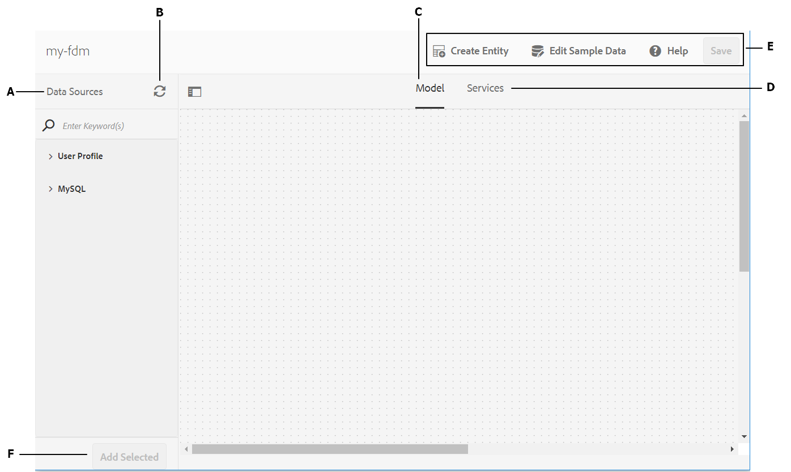
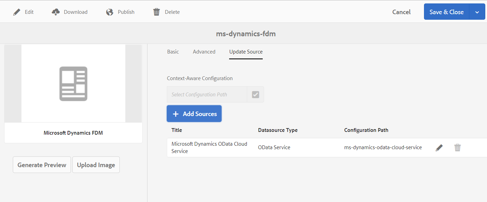

# Create form data model{#create-form-data-model}

| Version | Article link |
| -------- | ---------------------------- |
| AEM as a Cloud Service |    [Click here](https://experienceleague.adobe.com/docs/experience-manager-cloud-service/content/forms/integrate/use-form-data-model/create-form-data-models.html)                  |
| AEM 6.5     | This article         |

 

AEM Forms data integration provides an intuitive user interface to create and work with form data models. A form data model relies on data sources for exchange of data; however, you can create a form data model with or without a data source. There are two approaches to create a from data model depending on whether you have configured data sources:

* **Using preconfigured data sources**: If you have configured data sources as described in [Configure data sources](../../forms/using/configure-data-sources.md), you can select them while creating a form data model. It brings all data model objects, properties, and services from the selected data sources available for use in the form data model.

* **Without data sources**: If you have not configured data sources for your form data model, you can still create it without data sources. You can use the form data model to author adaptive forms and interactive communication and test them using sample data. When data sources are available, you can bind the form data model with data sources, which will automatically reflect in the associated adaptive forms and interactive communications.

>[!NOTE]
>
>You must be a member of both **fdm-author** and **forms-user** groups to be able to create and work with form data model. Contact your AEM administrator to become a member of the groups.

## Create form data model {#data-sources}

Ensure that you have configured the data sources you intend to use in the form data model as described in [Configure data sources](../../forms/using/configure-data-sources.md). Do the following to create a form data model based on configured data sources:

1. In AEM author instance, navigate to **[!UICONTROL Forms > Data Integrations]**.
1. Select **[!UICONTROL Create > Form Data Model]**.
1. In the Create Form Data Model dialog:

    * Specify a name for the form data model. 
    * (**Optional**) Specify title, description, and tags for the form data model.
    * (**Optional and applicable only if data sources are configured**) Select the tick icon next to the **[!UICONTROL Data Source Configuration]** field and select the configuration node where cloud services for the data sources you want to use reside. It restricts the list of data sources available for selection on the next page to the ones available in the selected configuration node. However, any JDBC database and AEM user profile data sources are listed by default. If you do not select a configuration node, data sources from all configuration nodes are listed.

   Select **[!UICONTROL Next]**.

1. (**Applicable only if data sources are configured**) The **[!UICONTROL Select Datasource]** screen lists available data sources, if any. Select data sources you want to use in the form data model.
1. Select **[!UICONTROL Create]** and on the confirmation dialog, select **[!UICONTROL Open]** to open the form data model editor.

Let us review the different components of the form data model editor UI.

**A. Data Sources** Lists data sources in a form data model. Expand a data source to view its data model objects and services.

**B. Refresh Data Source Definitions** Fetches any changes in data source definitions from configured data sources and updates them in the Data Sources tab of the form data model editor.

**C. Model** Content area where added data model objects appear.

**D. Services** Content area where added data source operations or services appear.

**E. Toolbar** Tools to work with form data model. The toolbar shows more options depending on the selected object in form data model.

**F. Add Selected** Adds selected data model objects and services to the form data model.

For more information about form data model editor and how you can work with it to edit and configure form data model, see [Work with form data model](../../forms/using/work-with-form-data-model.md).

## Update data sources {#update}

Do the following to add or update data sources to an existing form data model.

1. Go to **[!UICONTROL Forms > Data Integrations]**, select the form data model in which you want to add or update data sources, and select **[!UICONTROL Properties]**.
1. In the form data model properties, go to the **[!UICONTROL Update Source]** tab.

   In the Update Source tab:

    * Select the browse icon in the **[!UICONTROL Context-Aware Configuration]** field and select a configuration node where cloud configuration for the data source you want to add resides. If you do not select a node, cloud configurations residing only in the `global` node are listed when you select **[!UICONTROL Add Sources]**.
    
    * To add a new data source, select **[!UICONTROL Add Sources]** and select the data sources to add to the form data model. All data sources configured in `global` and the selected configuration node, if any, are displayed.
    
    * To replace an existing data source with another data source of the same type, select the **[!UICONTROL Edit]** icon for the data source and select from the list of available data sources.
    * To delete an existing data source, select the **[!UICONTROL Delete]** icon for the data source. The Delete icon is disabled if a data model object in the data source is added in the form data model.

   

1. Select **[!UICONTROL Save & Close]** to save the updates.

>[!NOTE]
>
>Once you add new data sources or update existing data sources in a form data model, ensure that you update the binding references, as appropriate, in adaptive forms and interactive communications that use the updated form data model.

## Next steps {#next-steps}

You now have a form data model with data sources added to it. Next, you can edit the form data model to add and configure data model objects and services, add associations between data model objects, edit properties, add custom data model objects and properties, generate sample data, and so on.

For more information, see [Work with form data model](../../forms/using/work-with-form-data-model.md).
