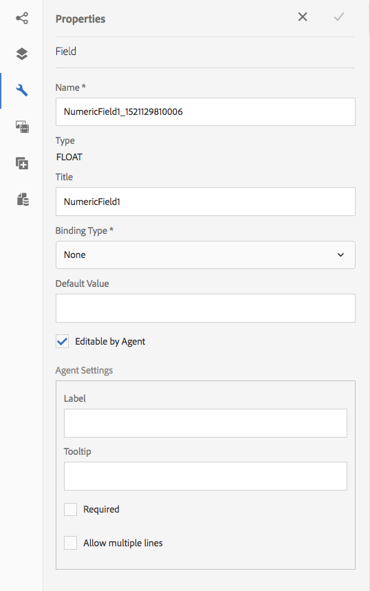
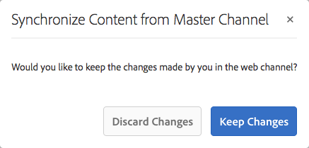

# Create an Interactive Communication  {#create-an-interactive-communication}

Create an Interactive Communication using the Interactive Communication editor. Use drag-and-drop functionality to build the Interactive Communication, and preview both print and web outputs on different device types.

## Overview {#overview}

Interactive Communications centralize and manages the creation, assembly, and delivery personalized, and interactive correspondences. Utilize print as master channel for web, you can minimize effort duplication in creating the web output of the Interactive Communication.

### Prerequisites {#prerequisites}

The following are the prerequisites for creating an Interactive Communication:

* Set up a [Form Data Model](/help/forms/using/data-integration.md) containing test data or with an actual data source, such as an instance of Microsoft® Dynamics. 
* Ensure that you have the [Document fragments](/help/forms/using/document-fragments.md).
* Ensure that you have [Templates for print and web channel](/help/forms/using/web-channel-print-channel.md).
* Ensure that you have the required [theme](/help/forms/using/themes.md) for the web channel.

## Create Interactive Communication {#createic}

1. Log in to the AEM author instance and navigate to **[!UICONTROL Adobe Experience Manager]** > **[!UICONTROL Forms]** > **[!UICONTROL Forms & Documents]**.
1. Tap **[!UICONTROL Create]** and select **[!UICONTROL Interactive Communication]**. Create Interactive Communication page appears. 

   

1. Enter the following information. :

    * **[!UICONTROL Title]**: Enter the title of the Interactive Communication.
    * **[!UICONTROL Name*]**: The name of the Interactive Communication is derived from the title you enter. Edit it, if necessary. 
    * **[!UICONTROL Description]**: Enter a description about the Interactive Communication. 
    * **[!UICONTROL Form Data Model*]**: Browse and select the form data model. For more information on Form Data Model, see [AEM Forms Data Integration](/help/forms/using/data-integration.md).
    * **[!UICONTROL Prefill Service]**: Select the prefill service to retrieve the data and prefill the Interactive Communication. 
    * **[!UICONTROL Post Process Type]**: You can select AEM or Forms workflow to be triggered when the Interactive Communication is submitted. Select the type of the workflow to be triggered.
    * **[!UICONTROL Post Process]**: Select the name of the workflow to be triggered. When you select AEM workflow, provide Attachment Path, Layout Path, PDF Path, Print Data Path, and Web Data Path.
    * **[!UICONTROL Tags]**: Select the tags to apply to the Interactive Communication. You can also type in a new/custom tag name and press Enter to create it. 
    * **[!UICONTROL Author]**:The author name is automatically taken from the logged in user's username. 
    * **[!UICONTROL Publish Date:]** Enter the date to publish the Interactive Communication. 
    * **[!UICONTROL Unpublish Date]**: Enter the date to unpublish the Interactive Communication.

1. Tap **[!UICONTROL Next]**. The screen to specify print and web channel details appears. 
1. Enter the following:

    * **[!UICONTROL Print]**: Select this option to generate the print channel of the Interactive Communication. 
    * **[!UICONTROL Print Template*:]** Browse and select an XDP as the print template.
    * **[!UICONTROL Use Print As Master For Web Channel:]** Select this option to create the web channel in sync with the print channel. Using print channel as master for web channel ensures the content and data binding of the web channel is derived from the print channel and the changes made in the print channel are reflected in the web channel when you tap Synchronize. The authors are, however, allowed to break the inheritance for specific components in the web channel, as required. For more information, see [Synchronize Web channel with Print channel](/help/forms/using/create-interactive-communication.md#synchronize). 
    * **[!UICONTROL Web:]** Select this option to generate the web channel or the responsive output of Interactive Communication. 
    * **[!UICONTROL Interactive Communication Web Template*:]** Browse and select the web template. 
    * **[!UICONTROL Theme]** and **[!UICONTROL Select Theme*]**: Browse and select the theme to style the web channel of the Interactive Communication. For more information, see [Themes in AEM Forms](/help/forms/using/themes.md).

   For more information on print channel and web channel, see [Print channel and web channel](/help/forms/using/web-channel-print-channel.md).

1. Tap **[!UICONTROL Create]**. The Interactive Communication is created and an alert box appears. Tap **[!UICONTROL Edit]** to start building the contents of the Interactive Communication as explained in [Add contents using Interactive Communication authoring user interface](#step2). Alternatively, you can tap **[!UICONTROL Done]** and choose to edit the Interactive Communication later.

## Add content to the Interactive Communication {#step2}

After you have created an Interactive Communication, you can use the Interactive Communication authoring interface to construct its contents.

For more information on the Interactive Communication authoring interface, see [Introduction to Interactive Communication authoring](/help/forms/using/introduction-interactive-communication-authoring.md).

1. The Interactive Communication authoring interface is launched when you Tap Edit as mentioned in [Create Interactive Communication](#createic). Alternatively, you can navigate to an existing Interactive Communication asset on AEM, select it, and tap **[!UICONTROL Edit]** to launch the Interactive Communication authoring interface.

   By default, the print channel of the Interactive Communication appears, unless the Interactive Communication is web-channel-only. The Print channel of the Interactive Communication displays target areas, as available in the selected XDP/print channel template. In these target areas and fields, you can add components or assets. 

1. With the Print channel selected, select the **[!UICONTROL Components]** tab. The following components are available in the print channel:

   | **Component** |**Functionality** |
   |---|---|
   | Chart |Adds a chart that you can use in Interactive Communication for visual representation of two-dimensional data retrieved from an form data model collection. For more information, see [Using charts in Interactive Communications](/help/forms/using/chart-component-interactive-communications.md). |
   | Document Fragment |Allows you to add a reusable component, such as text, list, or condition, to an Interactive Communication. The added component could be either form data model-based or without a form data model. |
   | Image |Allows you to insert an image. |

   Drag-and-drop the components into your Interactive Communication and configure them as required. 

1. With the print channel selected, go to the **[!UICONTROL Assets]** tab and apply the filter to display only the assets you want to see.

   Using the Assets browser, you can also directly drag and drop assets into Interactive Communication target areas. 

   

1. Drag-and-drop the document fragments into the Interactive Communication. Following are the types of document fragments that you can use in the print channel of the Interactive Communication. 

<table> 
 <tbody> 
  <tr> 
   <td><strong>Document Fragment Type</strong></td> 
   <td><strong>Example purpose</strong></td> 
  </tr> 
  <tr> 
   <td><a href="/help/forms/using/texts-interactive-communications.md" target="_blank">Text</a></td> 
   <td>Text for adding address, recipient's email, and body text of the letter </td> 
  </tr> 
  <tr> 
   <td><a href="/help/forms/using/conditions-interactive-communications.md" target="_blank">Condition</a></td> 
   <td>Condition to add the appropriate header image to the communication based on the type of the policy: Standard or Premium.   </td> 
  </tr> 
  <tr> 
   <td>List</td> 
   <td>Group of document fragments, including text, conditions, other lists, and images.   </td> 
  </tr> 
 </tbody> 
</table>

   For more information on document fragments, see [Document Fragments](/help/forms/using/document-fragments.md). 

1. To set up binding of variables, tap a variable and select  (Configure) and then set up the binding properties in the Properties panel in the sidebar.

    * **[!UICONTROL None]**: Agent will fill in the value for the variable.
    * **[!UICONTROL Text Fragment]**: If selected, you can browse and select a text document fragment whose content is rendered in the field. Only those text document fragments can be bound to variables that have no variables within. 
    * **[!UICONTROL Data Model Object]**: Select a form data model property whose value is populated in the field.

   You can also choose to configure the relevant text document fragment. The Properties panel displays the list of variables in the text document fragment. You can tap  (Edit) next to a variable name to display that variable's settings for editing.

1. To add a table, with the print channel selected, in the **[!UICONTROL Assets]** tab apply the filter to display only the Layout Fragments. Drag-and-drop the required layout fragment to the Interactive Communication. A layout fragment is based on an XDP and can be used to create graphical layouts or static and dynamic tables in Interactive Communication that get populated with dynamic data.

   Example: A layout table to display gross premium, loyalty discount %, and emergency roadside assistance availability for old and the new policies.

   For more information on layout fragments, see [Document Fragments](/help/forms/using/document-fragments.md). 

1. With the print channel selected, in the **[!UICONTROL Assets]** tab apply the filter to display images. Drag-and-drop the required images to the Interactive Communication, such as for company logo.

   Further, manage the following in the Interactive Communication:

    * [Adding and configuring charts](/help/forms/using/chart-component-interactive-communications.md)
    * [Sychronizing web channel with the print channel](/help/forms/using/create-interactive-communication.md#synchronize)

        * Auto sync
        * Cancel inheritance
        * Re-enable inheritance
        * Synchronize

    * [Attachments and library access](/help/forms/using/create-interactive-communication.md#attachmentslibrary)
    * [XDP/Layout field properties](/help/forms/using/create-interactive-communication.md#xdplayoutfieldproperties)
    * [Add rules to components](/help/forms/using/create-interactive-communication.md#rules)

1. Switch to **[!UICONTROL Web Channel]**. The web channel appears in the Interactive Communication editor. When you switch from the Print channel to the Web channel for the first time, the automatic synchornization takes place. For more information, see [Synchronizing web channel from the print channel](/help/forms/using/create-interactive-communication.md#synchronize).

   Since we are using Print as master for the web in this example, the Print channel placeholders, content, and data binding get synced to the web channel. However, you can change and customize the specific content in the web channel as required. 

   

1. To add additional components in the Web channel, with the Web channel selected, tap **[!UICONTROL Components]**. Drag-and-drop components in the web channel of your Interactive Communication as required and proceed to configure them.

   | Components |Functionality |
   |---|---|
   | Chart |Adds a chart that you can use in Interactive Communication for visual representation of two-dimensional data retrieved from a form data model collection. For more information, see [Using chart component](/help/forms/using/chart-component-interactive-communications.md). |
   | Document Fragment |Allows you to add a reusable component, text, list, or condition, to an Interactive Communication. The reusable component you add to an Interactive Communication could be either form data model-based or without a form data model. |
   | Image |Allows you to insert an image. |
   | Panel |The Panel component is a placeholder for grouping other components together and controls how a group of components, such as accordion and tabs, are laid out in the Interactive Communication. A panel component also allows you to make a group of components repeatable for the end user, such as in multiple entries required for filling in educational credentials.  |
   | Table |Adds a table that lets you organize data in rows and columns.  |
   | Target Area |Inserts a target area in a web channel to organize the web-channel-specific components. Target area is a plain container that allows you to group web-channel specific components.  |
   | Text |Adds rich text to the web channel of an Interactive Communication. Text can also make use of form data model objects to make the content dynamic. |

1. As required, insert assets in your web channel.

   You can [preview your Interactive Communication](#previewic) to see what the print and web outputs of the Interactive Communication look like and continue making changes, as required.

## Preview the Interactive Communication {#previewic}

You can use the **[!UICONTROL Preview]** option to evaluate appearance of the Interactive Communication. The web channel of Interactive Communication also provides an option to Emulate experience of an Interactive Communication for various devices. For example, iPhone, iPad, and Desktop. You can use both **[!UICONTROL Preview]** and **[!UICONTROL Emulator]**  options in conjunction with each other to preview the web outputs for devices of different screen sizes. The sample data in the preview is populated from the specified forms data model.

1. Select the (print or web) channel to preview and tap preview. The Interactive Communication appears.

   >[!NOTE]
   >
   >The preview is populated with the specified form data model's sample data. For more information on previewing the Interactive Communication with some other data or using the prefill service, see [Use form data model](/help/forms/using/using-form-data-model.md) and [Work with form data model](/help/forms/using/work-with-form-data-model.md).

1. For the web channel, use  to view how the Interactive Communication looks on various devices.

   

Further, you can [Prepare and send Interactive Communication using the Agent UI](/help/forms/using/prepare-send-interactive-communication.md).

## Configuring properties in Interactive Communication  {#configuring-properties-in-interactive-communication}

### Attachments and library access {#attachmentslibrary}

In the Print channel, you can configure the attachments and library access to allow the Agent manage attachments in the Agent UI for the Interactive Communication:

1. In the Print channel, highlight the Document Container and tap **[!UICONTROL Properties]**.

   

   The Properties panel appears in the Sidebar. 

   

1. Expand **[!UICONTROL Attachments]** and specify the following properties:

    * **[!UICONTROL Allow Library Access]**: Select to enable library access for the agent in the Agent UI. If enabled, the Agent can add files from the library while preparing the Interactive Communication.
    * **[!UICONTROL Allow Re-Ordering Of Attachments]**: Select to enable the Agent to re-order the attachments with the Interactive Communication.
    * **[!UICONTROL Max Number Of Attachments Allowed]**: Specify the maximum number of attachments allowed with the Interactive Communication.
    * **[!UICONTROL Files To Be Attached]**: Tap **[!UICONTROL Add]** and browse to select files to be attached and specify the following:

        * **[!UICONTROL Attach This File To Document By Default]**: You can change this option if only the attachment is not Mandatory.
        * **[!UICONTROL Mandatory:]** Agent will not be able to remove the attachment in the Agent UI.

   

1. Tap **[!UICONTROL Done]**.

### XDP/Layout field properties {#xdplayoutfieldproperties}

1. While editing the Print channel of an Interactive Communication, hover over a field, which is built in the Print channel template, and select  (Configure).

   The Properties dialog appears in the sidebar. 

   

1. Specify the following:

    * **[!UICONTROL Name]**: JCR node name. 
    * **[!UICONTROL Title]**: Enter a title that will be visible to the Agent in the Agent UI and in the Document Container tree.
    * **[!UICONTROL Binding Type]**: Select one of the following binding types for the field.

        * None: Agent will fill in the value for the property.
        * Text Fragment: If selected, you can browse and select a text document fragment whoses content is rendered in the field. 
        * Data model object: Select a form data model property whose value is populated in the field.

    * **[!UICONTROL Default Values]**: Default value ensures that the field is not empty when there is no value provided by the specified data model object or text fragment. If the data binding type is none, the default value is prepopulated in the field. 
    * **[!UICONTROL Editable By Agent]**: Select to allow the agent to edit the value in the field in the Agent UI. This setting is not applicable if Binding Type is Text Fragment. 
    * **[!UICONTROL Label]**: Specify a text string displayed with the field to the Agent in Agent UI. This setting is not applicable if Binding Type is Text Fragment. 
    * **[!UICONTROL Tooltip]**: Enter a text string that will be visible on mouse over to the Agent in Agent UI. This setting is not applicable if Binding Type is Text Fragment. 
    * **[!UICONTROL Required]**: Select to make the field mandatory for the Agent. This setting is not applicable if Binding Type is Text Fragment. 
    * **[!UICONTROL Allow multiple lines]**: Select this field to allow multiple lines of text as entry in the field. This setting is not applicable if Binding Type is Text Fragment.

1. Tap .

## Apply rules to Interactive Communication components {#rules}

To conditionalize components or content in the interactive communcation, tap the component/piece of content and select  (Create Rule) to launch Rule Editor.

For more information, see:

* [Rule Editor](/help/forms/using/rule-editor.md)
* [Introduction to Interactive Communication authoring](/help/forms/using/introduction-interactive-communication-authoring.md)

## Using tables {#tables}

### Dynamic tables in Interactive Communication {#dynamic-tables-in-interactive-communication}

You can add dynamic tables in Interactive Communication using layout fragments. The following steps use an example of a credit card statement to illustrate the use of a layout fragment for creating a dynamic table in an Interactive Communication.

1. Ensure that the required layout fragment for creating the table is available in AEM.
1. In the print channel of your Interactive Communication, drag and drop a layout fragment (with a multi-column table) in a Target Area from the Asset browser. 

   

   A table appears in the Interactive Communication layout area.

   

1. Specify data binding for each of the cells of the table. To create a repeatable row, insert form data model properties in the row belonging to a common collection property.

    1. Tap a cell in the table and select  (Configure).

       The Properties dialog appears in the sidebar. 
    
       

    1. Configure the properties:

        * **[!UICONTROL Name]**: JCR node name.
        * **[!UICONTROL Title]**: Enter a title that will be visible in the Interactive Communication editor. 
        * **[!UICONTROL Binding Type]**&ast;: Select one of the following binding types for the field.

            * **[!UICONTROL None]**
            * **[!UICONTROL Data model object]**: A form data model propert's value is populated in the field.

        * **[!UICONTROL Data Model Object]**: The form data model property whose value is populated in the field. 
        * **[!UICONTROL Default Value]**: Default value ensures that the field is not empty when there is no value provided by the specified data model object. The default value is pre-populated in the field. **[!UICONTROL]**
        * **[!UICONTROL Editable By Agent]**: Select to allow the agent to edit the value in the field in the Agent UI.

    1. Tap .

1. Preview the Interactive Communication to see the table rendered with the data.

   

### Web-channel only tables {#web-channel-only-tables}

You can create a web-channel only dynamic table in an Interactive Communication using a data model property of type collection. Such a table is a representation of a collection property's child properties. You can edit only the formatting properties of the various cells in the table.

1. Switch to the Web channel and then choose to display the Data Sources browser.
1. Drag and drop a collection property into a subform.

   A table gets created in the subform. 

1. Preview the table in the web preview of the Interactive Communication.

## Synchronizing web channel with print channel {#synchronize}

When you select Print as Master for Web Channel while creating an Interactive Communication, the Web channel is created in sync with the Print channel and the content and data binding of the Web channel is derived from the print channel and the changes made in the print channel are reflected in the web channel when you tap Synchronize.

The authors are, however, allowed to break the inheritance for components in the web channel, as required. 
    
[Click to enlarge](assets/printweb_2-3.png)

 

### Auto sync {#auto-sync}

If you are using Print channel as the master for the Web channel and you switch to the Web channel from the Print channel, automatic synchronization takes place. The automatic synchronization brings the placeholders, content, and data binding into the Web channel from the Print channel. Depending on the complexity and content of your Interactive Communication, automatic synchronization may take a little time.

>[!NOTE]
>
>Synchronizing the channels syncs only the document fragments, images, conditions, lists, and layout fragments from the print channel to the web channel. The subforms or parent nodes of that include such elements are not synced.

### Cancel inheritance {#cancel-inheritance}

In the web channel, the components are embedded in the target areas.

Hover over the relevant target area in the web channel and select  (Cancel Inheritance) and then in the Cancel Inheritance dialog, tap **[!UICONTROL Yes]**.

The inheritance of the components within the target area gets canceled and now you can edit them as required.

### Re-enable Inheritance {#re-enable-inheritance}

In the Web channel, if you have cancelled inheritance of a component, you can re-enable it. To re-enable inheritance, hover over the boundary of the relevant target area, which includes the component, and tap .

The Revert Inheritance dialog appears.

If required, select **[!UICONTROL Synchronize The Page After Reverting Inheritance]**. Select this option to synchronize the entire interactive communication. If you do not select this option only the relevant target area gets synchronized on reinstating the inheritance.

Tap **[!UICONTROL Yes]**.

### Synchronize {#synchronize-1}

If you are using Print as Master for Web Channel and make changes to the print channel, you can tap Synchronize to bring the newly made changes to the web channel.

1. To synchronize the Web channel with the Print channel, tap **[!UICONTROL Synchronize]**.

   Synchronize Content From Master Channel dialog appears. 

   

1. Tap one of the following:

    * **[!UICONTROL Discard Changes]**: Discards all the changes made to the Web channel regardless of the changes made in the web channel. 
    * **[!UICONTROL Keep Changes]**: Syncs content only for the target areas in which inheritance is not cancelled.

