# Create an Interactive Communication{#create-an-interactive-communication}

## Overview {#overview}

Interactive Communications centralize and manages the creation, assembly, and delivery personalized, and interactive correspondences. Utilize print as master channel for web, you can minimize effort duplication in creating the web output of the Interactive Communication.

### Prerequisites {#prerequisites}

The following are the prerequisites for creating an Interactive Communication:

* Set up a [Form Data Model](/help/forms/using/data-integration.md) containing test data or with an actual data source, such as an instance of Microsoft&reg; Dynamics.
* Ensure that you have the [Document fragments](/help/forms/using/document-fragments.md).
* Ensure that you have [Templates for print and web channel](/help/forms/using/web-channel-print-channel.md).
* Ensure that you have the required [theme](/help/forms/using/themes.md) for the web channel.

## Create Interactive Communication {#createic}

1. Log in to the AEM author instance and navigate to **[!UICONTROL Adobe Experience Manager]** > **[!UICONTROL Forms]** > **[!UICONTROL Forms & Documents]**.
1. Select **[!UICONTROL Create]** and select **[!UICONTROL Interactive Communication]**. Create Interactive Communication page appears.

   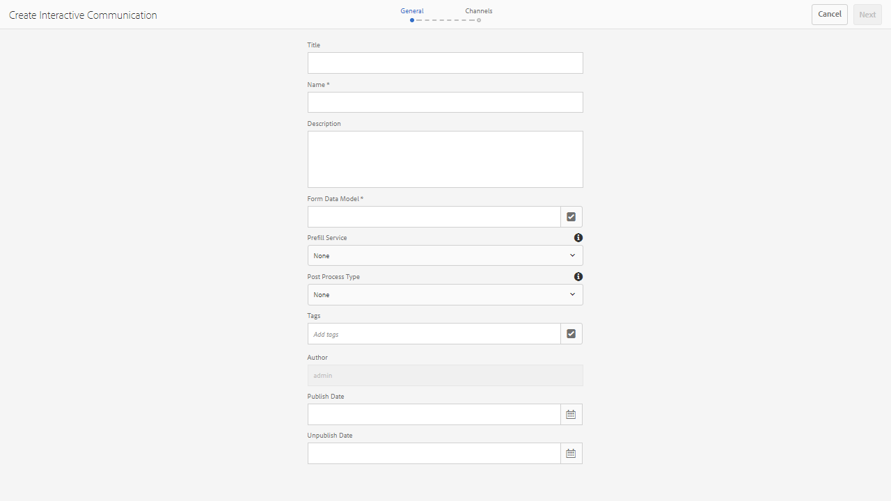

1. Enter the following information. :

    * **[!UICONTROL Title]**: Enter the title of the Interactive Communication.
    * **[!UICONTROL Name]**: The name of the Interactive Communication is derived from the title you enter. Edit it, if necessary.
    * **[!UICONTROL Description]**: Enter a description about the Interactive Communication.
    * **[!UICONTROL Form Data Model]**: Browse and select the form data model. For more information on Form Data Model, see [AEM Forms Data Integration](/help/forms/using/data-integration.md).

    * **[!UICONTROL Prefill Service]**: Select the prefill service to retrieve the data and prefill the Interactive Communication.
    * **[!UICONTROL Post Process Type]**: You can select AEM or Forms workflow to be triggered when the Interactive Communication is submitted. Select the type of the workflow to be triggered.

    * **[!UICONTROL Post Process]**: Select the name of the workflow to be triggered. When you select AEM workflow, provide Attachment Path, Layout Path, PDF Path, Print Data Path, and Web Data Path.
    * **[!UICONTROL Tags]**: Select the tags to apply to the Interactive Communication. You can also type in a new/custom tag name and press Enter to create it.
    * **[!UICONTROL Author]**:The author name is automatically taken from the logged in user's username.
    * **[!UICONTROL Publish Date:]** Enter the date to publish the Interactive Communication.
    * **[!UICONTROL Unpublish Date]**: Enter the date to unpublish the Interactive Communication.

1. Select **[!UICONTROL Next]**. The screen to specify print and web channel details appears.
1. Enter the following:

    * **[!UICONTROL Print]**: Select this option to generate the print channel of the Interactive Communication.
    * **[!UICONTROL Print Template]**: Browse and select an XDP as the print template.
    * **[!UICONTROL Web]**: Select this option to generate the web channel or the responsive output of Interactive Communication.
    * **[!UICONTROL Interactive Communication Web Template]**: Browse and select the web template.
    * **[!UICONTROL Theme]** and **[!UICONTROL Select Theme]**: Browse and select the theme to style the web channel of the Interactive Communication. For more information, see [Themes in AEM Forms](/help/forms/using/themes.md).

    * **[!UICONTROL Use Print As Master for Web Channel]**: Select this option to create the web channel in sync with the print channel. Using print channel as master for web channel ensures the content and data binding of the web channel is derived from the print channel and the changes made in the print channel are reflected in the web channel when you select Synchronize. The authors are, however, allowed to break the inheritance for specific components in the web channel, as required. For more information, see [Synchronize Web channel with Print channel](../../forms/using/create-interactive-communication.md#synchronize).
      If you select the **[!UICONTROL Use Print As Master for Web Channel]** option, you can select any of the following modes to generate Web channel:

        * **[!UICONTROL Auto layout]**: Select this mode to automatically generate placeholders, content, and data binding for Web channel from Print channel.
        * **[!UICONTROL Manually organize]**: Select this mode to manually select and add Print channel elements to the Web channel using the master content available in the **[!UICONTROL Data Sources]** tab. For more information, see [Select Print channel elements to create Web channel content](#selectprintchannelelements).

   For more information on print channel and web channel, see [Print channel and web channel](/help/forms/using/web-channel-print-channel.md).

1. Select **[!UICONTROL Create]**. The Interactive Communication is created and an alert box appears. Select **[!UICONTROL Edit]** to start building the contents of the Interactive Communication as explained in [Add contents using Interactive Communication authoring user interface](#step2). Alternatively, you can select **[!UICONTROL Done]** and choose to edit the Interactive Communication later.

## Add content to the Interactive Communication {#step2}

After you have created an Interactive Communication, you can use the Interactive Communication authoring interface to construct its contents.

For more information on the Interactive Communication authoring interface, see [Introduction to Interactive Communication authoring](/help/forms/using/introduction-interactive-communication-authoring.md).

1. The Interactive Communication authoring interface is launched when you Select Edit as mentioned in [Create Interactive Communication](#createic). Alternatively, you can navigate to an existing Interactive Communication asset on AEM, select it, and select **[!UICONTROL Edit]** to launch the Interactive Communication authoring interface.

   By default, the print channel of the Interactive Communication appears, unless the Interactive Communication is web-channel-only. The Print channel of the Interactive Communication displays target areas, as available in the selected XDP/print channel template. In these target areas and fields, you can add components or assets.

1. With the Print channel selected, select the **[!UICONTROL Components]** tab. The following components are available in the print channel:

   | **Component** |**Functionality** |
   |---|---|
   | Chart |Adds a chart that you can use in Interactive Communication for visual representation of two-dimensional data retrieved from a form data model collection. For more information, see [Using charts in Interactive Communications](/help/forms/using/chart-component-interactive-communications.md). |
   | Document Fragment |Lets you add a reusable component, such as text, list, or condition, to an Interactive Communication. The added component could be either form data model-based or without a form data model. |
   | Image |Lets you insert an image. |

   Drag-and-drop the components into your Interactive Communication and configure them as required.

   You can also use the undo and redo operations while authoring an Interactive Communication for both Print and Web channels.

   Use the undo operation to discard the last performed action and the redo operation to incorporate the discarded action again. For example, if you have inserted an image or created a data binding in an Interactive Communication and need to discard it, use the undo operation.

   

   The undo and redo options are displayed on the authoring UI page toolbar. The undo option is displayed only after performing an action. The redo option is displayed on the page toolbar only after performing an undo operation. These actions are reset on refreshing the page.

1. With the print channel selected, go to the **[!UICONTROL Assets]** tab and apply the filter to display only the assets you want to see.

   Using the Assets browser, you can also directly drag and drop assets into Interactive Communication target areas.

   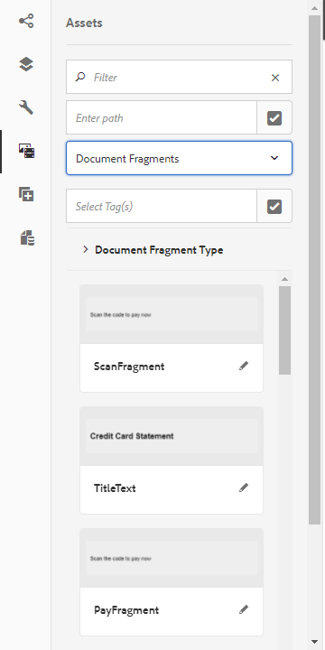

1. Drag-and-drop the document fragments into the Interactive Communication. Following are the types of document fragments that you can use in the print channel of the Interactive Communication.

<table>
 <tbody>
  <tr>
   <td><strong>Document Fragment Type</strong></td>
   <td><strong>Example purpose</strong></td>
  </tr>
  <tr>
   <td><a href="/help/forms/using/texts-interactive-communications.md" target="_blank">Text</a></td>
   <td>Text for adding address, recipient's email, and body text of the letter </td>
  </tr>
  <tr>
   <td><a href="/help/forms/using/conditions-interactive-communications.md" target="_blank">Condition</a></td>
   <td>Condition to add the appropriate header image to the communication based on the type of the policy: Standard or Premium. <br /> </td>
  </tr>
  <tr>
   <td>List</td>
   <td>Group of document fragments, including text, conditions, other lists, and images. <br /> </td>
  </tr>
 </tbody>
</table>

   You can also replace the binding between a target area and a document fragment by dropping the new fragment on the target area using the **[!UICONTROL Assets]** tab. The blue color shading of the target area while dragging the fragment indicates that the document fragment can be dropped to the target area.

   For more information on document fragments, see [Document Fragments](/help/forms/using/document-fragments.md).

   The authoring interface enables you to distinguish between the unbound and bound fields and variables within an Interactive Communication. The interface highlights the unbound fields and variables using an orange border.

   

   In addition, when you hover the mouse over these elements, a tooltip is displayed with the Field (Unbound) or Variable (Unbound) message.

   An unbound variable used in a document fragment may sometimes not be displayed on the authoring interface. It can happen due to an inline text rule within a document fragment or if there a condition fragment. In such cases, a tooltip, highlighted in blue, is displayed as a part of the document fragment. The tooltip displays the number of unbound variables used within a document fragment.

   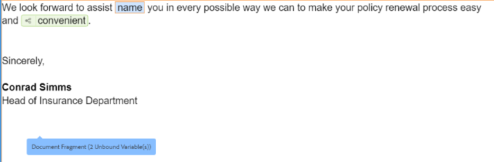

   Select the document fragment, select  (Configure), and then select **[!UICONTROL Properties]** from the sidekick of the Interactive Communication. The **[!UICONTROL Variables and Data Model Objects]** section lists the variables, including the hidden variables, and data model objects used in the document fragments. Use the  (Edit) icon next to each data model object or variable to edit the properties.

1. To set up binding of variables, select a variable and select  (Configure) and then set up the binding properties in the Properties panel in the sidebar.

    * **None**: Agent will fill in the value for the variable.
    * **Text Fragment**: If selected, you can browse and select a text document fragment whose content is rendered in the field. Only those text document fragments can be bound to variables that have no variables within.
    * **Data Model Object**: Select a form data model property whose value is populated in the field.
    * **Default Value:** You can define a default value for the variable using this field. The value is displayed when you preview the Interactive Communication or in the Agent UI.
    * **Display Pattern:** You can also define a display format for a variable. Select any of the pre-defined options from the **Type** drop-down list to apply a display format to a variable. Select **Custom** to define a display pattern that is not available in the list. For more information, see [Data display patterns](../../forms/using/create-interactive-communication.md#datadisplaypatterns).

   Navigate to [Variables and Data Model Objects](../../forms/using/create-interactive-communication.md#hiddenvariables) to set up binding of hidden variables in the document fragment.

   You can also drag-and-drop data source elements or text document fragments to set up binding of variables.  To create a binding with any of the data source elements, select the **Data Sources** tab and drag-and-drop the element to the variable name. The data source element and variable must be of the same type to set up the binding successfully. If you drag-and drop a data source element to an already bound variable, the new element replaces the previous one to create a binding with the variable. Similarly, select the **Assets** tab and drag-and-drop the text document fragment to variable name to set up the binding between them. The text document fragment must not contain any variables.

1. To add a table, with the print channel selected, in the **[!UICONTROL Assets]** tab apply the filter to display only the Layout Fragments. Drag-and-drop the required layout fragment to the Interactive Communication. A layout fragment is based on an XDP and can be used to create graphical layouts or static and dynamic tables in Interactive Communication that get populated with dynamic data.

   Example: A layout table to display gross premium, loyalty discount %, and emergency roadside assistance availability for old and the new policies.

   For more information on layout fragments, see [Document Fragments](/help/forms/using/document-fragments.md).

1. With the print channel selected, in the **[!UICONTROL Assets]** tab apply the filter to display images. Drag-and-drop the required images to the Interactive Communication, such as for company logo.

   Further, manage the following in the Interactive Communication:

    * [Adding and configuring charts](/help/forms/using/chart-component-interactive-communications.md)
    * [Sychronizing web channel with the print channel](../../forms/using/create-interactive-communication.md#synchronize)

        * Auto sync
        * Cancel inheritance
        * Re-enable inheritance
        * Synchronize

    * [Attachments and library access](../../forms/using/create-interactive-communication.md#attachmentslibrary)
    * [XDP/Layout field properties](../../forms/using/create-interactive-communication.md#xdplayoutfieldproperties)
    * [Add rules to components](../../forms/using/create-interactive-communication.md#rules)

1. Switch to **[!UICONTROL Web Channel]**. The web channel appears in the Interactive Communication editor. When you switch from the Print channel to the Web channel for the first time, the automatic synchornization takes place. For more information, see [Synchronizing web channel from the print channel](../../forms/using/create-interactive-communication.md#synchronize).

   Since we are using Print as master for the web in this example, the Print channel placeholders, content, and data binding get synced to the web channel. However, you can change and customize the specific content in the web channel. [Cancel inheritance](#cancelinheritance) for the target areas and variables that have been generated using the print channel to be able to customize content.

   

   Select the document fragment, select  (Configure), and then select **[!UICONTROL Properties]** from the sidekick of the Interactive Communication. The **[!UICONTROL Variables and Data Model Objects]** section lists the variables, including the hidden variables, and data model objects used in the document fragments. Use the  (Edit) icon next to each data model object or variable to edit the properties. In addition, for document fragments that have been [auto-generated](#synchronize) in Web channel using Print channel, use the  (Cancel Inheritance) icon next to each data model object and variable to [cancel inheritance](#cancelinheritance) and to be able to edit them.

1. To add additional components in the Web channel, with the Web channel selected, select **[!UICONTROL Components]**. Drag-and-drop components in the web channel of your Interactive Communication as required and proceed to configure them.

   | Components |Functionality |
   |---|---|
   | Chart |Adds a chart that you can use in Interactive Communication for visual representation of two-dimensional data retrieved from a form data model collection. For more information, see [Using chart component](../../forms/using/chart-component-interactive-communications.md). |
   | Document Fragment |Lets you add a reusable component, text, list, or condition, to an Interactive Communication. The reusable component you add to an Interactive Communication could be either form data model-based or without a form data model. |
   | Image |Lets you insert an image. |
   | Panel |Lets you add a [Panel](../../forms/using/create-interactive-communication.md#add-panel-component-to-the-web-channel) to the Interactive Communication. |
   | Table |Adds a table that lets you organize data in rows and columns.  |
   | Target Area |Inserts a target area in a web channel to organize the web-channel-specific components. Target area is a plain container that lets you group web-channel specific components.  |
   | Text |Adds rich text to the web channel of an Interactive Communication. Text can also use form data model objects to make the content dynamic. |
   | Button |Lets you add a [Button](../../forms/using/create-interactive-communication.md#add-button-component-to-the-web-channel) to the Interactive Communication. You can use the Button component to navigate to other Interactive Communications, adaptive forms, other assets such as images or document fragments, or an external URL. |
   | Separator |Lets you insert a horizontal line within an Interactive Communication. Use this component to distinguish between sections in a correspondence. For example, you can use the Separator component to distinguish between Customer Details and Credit Card Details sections in a credit card statement. |

1. As required, insert assets in your web channel.

   You can [preview your Interactive Communication](#previewic) to see what the print and web outputs of the Interactive Communication look like and continue making changes, as required.

## Preview the Interactive Communication {#previewic}

You can use the **Preview option** to evaluate appearance of the Interactive Communication. The web channel of Interactive Communication also provides an option to Emulate experience of an Interactive Communication for various devices. For example, iPhone, iPad, and Desktop. You can use both **Preview** and **Emulator**  options in conjunction with each other to preview the web outputs for devices of different screen sizes. The sample data in the preview is populated from the specified forms data model.

1. Select the (print or web) channel to preview and select preview. The Interactive Communication appears.

   >[!NOTE]
   >
   >The preview is populated with the specified form data model's sample data. For more information on previewing the Interactive Communication with some other data or using the prefill service, see [Use form data model](/help/forms/using/using-form-data-model.md) and [Work with form data model](/help/forms/using/work-with-form-data-model.md).

1. For the web channel, use  to view how the Interactive Communication looks on various devices.

   

Further, you can [Prepare and send Interactive Communication using the Agent UI](/help/forms/using/prepare-send-interactive-communication.md).

## Configure properties in Interactive Communication  {#configure-properties-in-interactive-communication}

### Attachments and library access {#attachmentslibrary}

In the Print channel, you can configure the attachments and library access to allow the Agent manage attachments in the Agent UI for the Interactive Communication:

1. In the Print channel, highlight the Document Container and select **Properties**.

   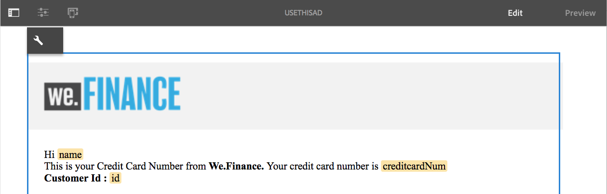

   The Properties panel appears in the Sidebar.

   

1. Expand **Attachments** and specify the following properties:

    * **[!UICONTROL Allow Library Access]**: Select to enable library access for the agent in the Agent UI. If enabled, the Agent can add files from the library while preparing the Interactive Communication.
    * **[!UICONTROL Allow Re-Ordering Of Attachments]**: Select to enable the Agent to re-order the attachments with the Interactive Communication.
    * **[!UICONTROL Max Number Of Attachments Allowed]**: Specify the maximum number of attachments allowed with the Interactive Communication.
    * **[!UICONTROL Files To Be Attached]**: Select **[!UICONTROL Add]** and browse to select files to be attached and specify the following:

        * **[!UICONTROL Attach This File To Document By Default]**: You can change this option if only the attachment is not Mandatory.
        * **[!UICONTROL Mandatory:]** Agent will not be able to remove the attachment in the Agent UI.

   

1. Select **[!UICONTROL Done]**.

### XDP/Layout field properties {#xdplayoutfieldproperties}

1. While editing the Print channel of an Interactive Communication, hover over a field, which is built in the Print channel template, and select  (Configure).

   The Properties dialog appears in the sidebar.

   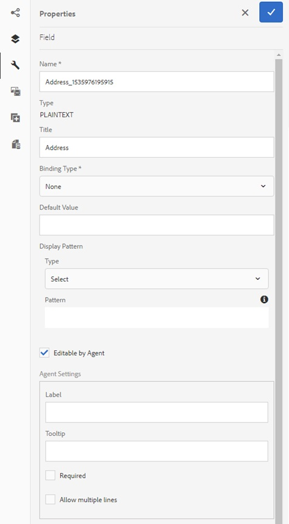

1. Specify the following:

    * **[!UICONTROL Name]**: JCR node name.
    * **[!UICONTROL Title]**: Enter a title that will be visible to the Agent in the Agent UI and in the Document Container tree.
    * **[!UICONTROL Binding Type]**: Select one of the following binding types for the field.

        * None: Agent will fill in the value for the property.
        * Text Fragment: If selected, you can browse and select a text document fragment whose content is rendered in the field. Alternatively, drag-and-drop the text document fragment to field name to set up the binding between them. The text document fragment must not contain any variables.
        * Data model object: Select a form data model property whose value is populated in the field. Alternatively, select the **Data Sources** tab and drag-and-drop the property to the field.

    * **[!UICONTROL Default Values]**: Default value ensures that the field is not empty when there is no value provided by the specified data model object or text fragment. If the data binding type is none, the default value is prepopulated in the field.
    * **[!UICONTROL Display Pattern]**: You can also define a display format for a field. Select any of the pre-defined options from the **Type** drop-down list to apply a display format to a field. Select **Custom** to define a display pattern that is not available in the list. For more information, see [Data display patterns](../../forms/using/create-interactive-communication.md#datadisplaypatterns)

    * **[!UICONTROL Editable By Agent]**: Select to allow the agent to edit the value in the field in the Agent UI. This setting is not applicable if Binding Type is Text Fragment.
    * **[!UICONTROL Label]**: Specify a text string displayed with the field to the Agent in Agent UI. This setting is not applicable if Binding Type is Text Fragment.
    * **[!UICONTROL Tooltip]**: Enter a text string that will be visible on mouse over to the Agent in Agent UI. This setting is not applicable if Binding Type is Text Fragment.
    * **[!UICONTROL Required]**: Select to make the field mandatory for the Agent. This setting is not applicable if Binding Type is Text Fragment.
    * **[!UICONTROL Allow multiple lines]**: Select this field to allow multiple lines of text as entry in the field. This setting is not applicable if Binding Type is Text Fragment.

1. Select .

### Data display patterns {#datadisplaypatterns}

The authoring interface enables you to define data display patterns for fields, variables, and form data model elements available while creating an Interactive Communication for print and web channels.

To configure the data display pattern, select the element, select  (Configure) and set up the display pattern in the **[!UICONTROL Properties]** panel in the sidebar. Select any pre-defined option from the **[!UICONTROL Type]** drop-down list to view the pattern associated with the selected type. Select **[!UICONTROL Custom]** from the **[!UICONTROL Type]** drop-down list to define a pattern that is not available in the list. Editing values in the **[!UICONTROL Pattern]** field automatically modifies the type to **[!UICONTROL Custom]**.

To apply the display pattern, the number of characters or digits defined in the Pattern field must match or exceed the characters or digits defined in the value for fields, variables, and form data model elements. For more information, see [example](../../forms/using/create-interactive-communication.md#greaternumberofdigits).

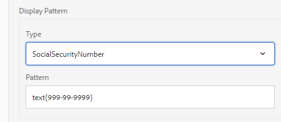

You can re-define display pattern for a field, variable, or a form data model element after generating web content from the print channel. As a result, an element can have different display patterns defined for print and web channels. If you do not define a display pattern for an element in print channel and auto-generate web content using print channel, the data binding defined for the element in print channel defines the display pattern options available in the **[!UICONTROL Type]** drop-down list. If there is no binding defined for the element, the data type of the element defines the available display pattern options. For example, if you create a data binding of Number type for an element in print channel, the display pattern options available in the **[!UICONTROL Type]** drop-down list are of Number type in various formats.

Switch to the **Preview** mode or open Agent UI to view the display pattern applied to these elements.

The following table lists an example of the values that display as a result of setting the data display pattern for a variable:

| Type |Default value |Display pattern |Display value |Description |
|---|---|---|---|---|
| SocialSecurityNumber |123456789 |text{999-99-9999} |123-45-6789 |The number of digits in the default value field matches the number of digits in the Pattern field. The value based on the pattern displays successfully. |
| SocialSecurityNumber |1234567 |text{999-99-9999} |1-23-4567 |The number of digits in the default value field is less than the number of digits in the Pattern field. The pattern applies to the 7 available digits. |
| SocialSecurityNumber |1234567890 |text{999-99-9999} |1234567890 |The number of digits in the default value field is greater than the number of digits in the Pattern field. As a result, there is no change in the display value. |

If a display pattern is not specified for a variable or a form data model element, the [global document fragment configuration](https://helpx.adobe.com//experience-manager/6-5/forms/using/interactive-communication-configuration-properties.html) is used by default.

If you do not apply a display pattern to a variable of number data type, the Print preview displays the pattern according to the global document fragment configuration. If you apply changes to the default global document fragment configuration, the Agent UI still displays the pattern according to the default separators defined for the locale.

Similarly, for fields, if display pattern is not specified, the pattern defined while creating the Print template (XDP) is applied to the field. If there is no pattern while creating the print template, the default patterns based on XFA specifications are applied to the fields.

In addition, if the display pattern that is specified is incorrect or cannot be applied, the default patterns based on XFA specifications are applied to the fields, variables, or form data model elements.

## Apply rules to Interactive Communication components {#rules}

To conditionalize components or content in the interactive communcation, select the component/piece of content and select  (Create Rule) to launch Rule Editor.

For more information, see:

* [Rule Editor](/help/forms/using/rule-editor.md)
* [Introduction to Interactive Communication authoring](/help/forms/using/introduction-interactive-communication-authoring.md)

## Using tables {#tables}

### Dynamic tables in Interactive Communication {#dynamic-tables-in-interactive-communication}

You can add dynamic tables in Interactive Communication using layout fragments. The following steps use an example of a credit card statement to illustrate the use of a layout fragment for creating a dynamic table in an Interactive Communication.

1. Ensure that the required layout fragment for creating the table is available in AEM.
1. In the print channel of your Interactive Communication, drag and drop a layout fragment (with a multi-column table) in a Target Area from the Asset browser.

   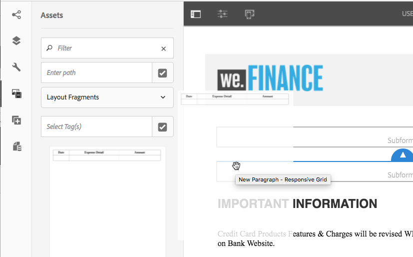

   A table appears in the Interactive Communication layout area.

   

1. Specify data binding for each of the cells of the table. To create a repeatable row, insert form data model properties in the row belonging to a common collection property.

    1. Select a cell in the table and select  (Configure).

       The Properties dialog appears in the sidebar.

       

    1. Configure the properties:

        * **[!UICONTROL Name]**: JCR node name.
        * **[!UICONTROL Title]**: Enter a title that will be visible in the Interactive Communication editor.
        * **[!UICONTROL Binding Type]**: Select one of the following binding types for the field.

            * **[!UICONTROL None]**
            * **[!UICONTROL Data model object]**: A form data model property's value is populated in the field. Alternatively, select the **Data Sources** tab and drag-and-drop the property to the field.

        * **[!UICONTROL Data Model Object]**: The form data model property whose value is populated in the field.
        * **[!UICONTROL Default Value]**: Default value ensures that the field is not empty when there is no value provided by the specified data model object. The default value is prepopulated in the field.

        * **[!UICONTROL Editable By Agent]**: Select to allow the agent to edit the value in the field in the Agent UI.

    1. Select .

1. Preview the Interactive Communication to see the table rendered with the data.

   

### Web-channel only tables {#webchanneltables}

Select the root panel in the Web template and select **+** to add a **Table** component to the Interactive Communication. A table including two rows is inserted in the Interactive Communication. The first row of the table represents the Table header.

#### Add rows and columns to the table {#addrowscolumnstable}

**To add or delete columns:**

1. Select the default text box in the table header row to view the component toolbar.
1. Select **Add Column** or **Delete Column** to add or delete table columns respectively.


**To add or delete rows:**

1. Select any of the table rows to view the component toolbar. You can also select table row using the Content browser in the sidekick of the Interactive Communication.
1. Select **Add Row** or **Delete Row** to add or delete table rows respectively. Use the **Move Up** and **Move Down** options available in the toolbar to rearrange rows in the table.

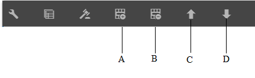

**A.** Add row **B.** Delete row **C.** Move up **D.** Move down

#### Add or edit text in table cells {#addedittexttable}

1. Select the default text box in the table cell and select  (Edit).
1. Type the text in the table cell and select  to save it.

#### Create binding between table cells and data model object elements {#createbindingtablecells}

1. Select the default text box in the table row and select  (Edit).
1. Select the Data Model objects drop-down list and select the property.
1. Select to save and create a binding between the table cell and the data model object property.

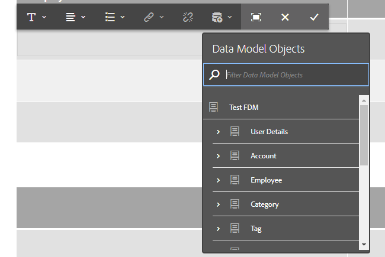

#### Create a hyperlink for text in the table cell {#createhyperlinktable}

1. Select the default text box in the table cell and select  (Edit).
1. Select the text in the table cell and select the Hyperlink icon.
1. Specify the URL in the **Path** field.
1. Select  to save the hyperlink properties.

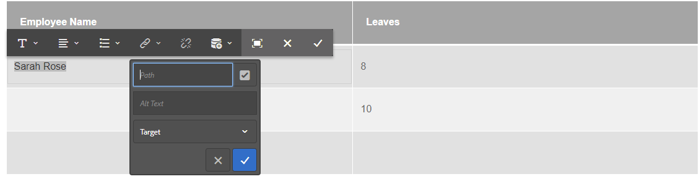

#### Create dynamic tables {#createdynamictables}

You can create a web-channel only dynamic table in an Interactive Communication using a data model property of type collection. Such a table is a representation of a collection property's child properties. You can edit only the formatting properties of the various cells in the table.

1. Switch to the Web channel and then choose to display the Data Sources browser.
1. Drag and drop a collection property into a subform. A table gets created in the subform.
1. Preview the table in the web preview of the Interactive Communication.

#### Sort columns in a table {#sortcolumns}

You can sort data based on any column in a table in the Interactive Communication. The values in the column can be sorted in an ascending or descending order.

Sorting can be applied to tables columns containing:

* Static text
* Data model object properties
* Combination of static text and data model object properties

To enable sorting:

1. Select the table and select  (Configure). You can also select the table using the **Content** browser in the sidekick of the Interactive Communication.
1. Select **Enable Sorting.**
1. Select  to save the table properties. The sorting icons, up and down arrows, in columns headers represent that the sorting has been enabled.

   

1. Switch to the **Preview** mode to view the output. The table is automatically sorted based on the first column of the table.
1. Click the column header to sort the values based on the column.

   A column header with an up arrow represents that the:

    * table is sorted based on that column.
    * values in the column are displayed in the ascending order.

   

   Similarly, a column header with a down arrow represents that the values in the column are displayed in the descending order.

## Edit Interactive Communication properties {#edit-interactive-communication-properties}

Once you create an Interactive Communication, you can edit its properties at a later stage.

Use the **Properties** page to:

* Edit values for the fields specified while creating the Interactive Communication, such as Title and Description.
* Add or delete Web channel for an existing Interactive Communication.
* Preview, download, or delete the Interactive Communication
* Open the [Agent UI](/help/forms/using/prepare-send-interactive-communication.md).

To access the **Properties** page:

1. Log in to the AEM author instance and navigate to **Adobe Experience Manager** &gt; **Forms** &gt; **Forms & Documents**.
1. Select the Interactive Communication and select **Properties**.
1. Select the **General** tab to edit the **Title** and **Description** fields.

### Add or delete the Web channel {#add-or-delete-the-web-channel}

Execute the following steps to add the Web channel for an existing Interactive Communication:

1. On the **Properties** page, select the **Channels** tab.
1. Select the **Web** checkbox and select a template for the Web channel.
1. Select **Use Print as Master for Web Channel** to enable synchronization between the Web channel and the Print channel.
1. Select **Save & Close** to save the changes.

   Similarly, you can select the **Web** checkbox on the **Channels** tab to delete the Web channel from the Interactive Communication.

## Add Button component to the Web channel {#add-button-component-to-the-web-channel}

You can add button as a component to the web channel of the Interactive Communication. Define rules using the [rule editor](../../forms/using/rule-editor.md) to be able to navigate to other Interactive Communications, adaptive forms, other assets such as images or document fragments, or an external URL on the select of the button.

To add button and define rules on it:

1. Select the root panel in the Web template and select **+** to add the **Button** component to the Interactive Communication.
1. Select the button component and select  to define rules on the select of the button.
1. In the **When** section, select **clicked** from the state of the button drop-down list.
1. In the **Then** section:

    1. Select an action from the drop-down list. For example, select **Navigate to** as the action type.

    1. Specify the URL of the Interactive Communication, adaptive form, an asset, or a web page. For example, specify the URL in the following format to navigate to another Interactive Communication: https://&lt;server-name&gt;:&lt;port&gt;/editor.html/content/forms/af/&lt;Interactive Communication name&gt;/channels/&lt;channel name - print or web&gt;.html
    1. Specify the option to open the asset in same tab, new tab, or new window.
    1. Select **Done** and then select **Close** to save the rule.

   Similarly, you can select other available options from the action type drop-down list, such as Invoke Service and Submit Form. For more information, see [rule editor](../../forms/using/rule-editor.md).

1. Preview the Interactive Communication and select the button to view the Interactive Communication, adaptive form, an asset, or a web page specified in step 4(b).

## Add Panel component to the web channel {#add-panel-component-to-the-web-channel}

The Panel component is a placeholder for grouping other components together and controls how a group of components, such as accordion and tabs, are laid out in the Interactive Communication. A panel component also lets you make a group of components repeatable for the end user, such as in multiple entries required for filling in educational credentials.

Perform the following steps to add a Panel component to the web channel:

1. Insert the **Panel** component in the web channel using any of the following options:

    * Select a component, select **+** and select the **Panel** component.

    * From the **Component** browser panel, drag-drop the **Panel** component on the Interactive Communication.

    * Select the **Panel** in the **Content** browser panel and select **Add Child Panel**. Selecting the **Add Child Panel** option displays the **Add Child Panel** dialog box. Enter the title and an optional description and name for the Panel component.

1. Select the panel from the **Content** browser to perform additional actions on the Panel such as configure, edit rules, copy, delete, and insert component.

   You can also drag-and-drop a panel within the **Content** browser to reflect the change in the structure of the Interactive Communication in the right pane.

## Synchronizing web channel with print channel {#synchronize}

When you select Print as Master for Web Channel while creating an Interactive Communication, the Web channel is created in sync with the Print channel and the content and data binding of the Web channel is derived from the print channel and the changes made in the print channel could be reflected in the web channel when you select Synchronize.

The authors are, however, allowed to break the inheritance for components in the web channel, as required.

 

### Auto sync {#autosync}

If you select the **[!UICONTROL Use Print As Master for Web Channel]** option, you can select any of the following modes to generate Web channel:

* **[!UICONTROL Auto layout]**: Select this mode to automatically generate placeholders, content, and data binding for Web channel from Print channel.
* **[!UICONTROL Manually organize]**: Select this mode to manually select and add Print channel elements to the Web channel using the master content available in the Data Sources tab. For more information, see [Select Print channel elements to create Web channel content](#selectprintchannelelements).

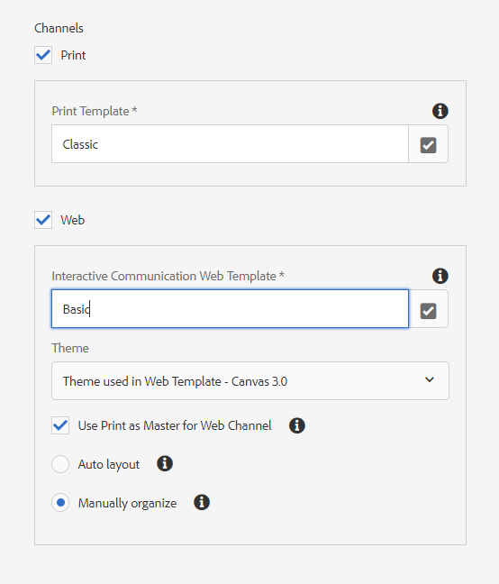

>[!NOTE]
>
>Synchronizing the channels syncs only the document fragments, images, conditions, lists, and layout fragments from the print channel to the web channel. The sub-forms or parent nodes that include such elements are not synced.

### Select Print channel elements to create Web channel content {#selectprintchannelelements}

If you select Print as master while creating the Interactive Communication and do not select the auto sync option, you can also drag-and-drop Print channel elements to the Web channel authoring interface.

Navigate to **Data Sources** &gt; **Master Content** to view the Print channel elements. Drag-and-drop the target areas, fields, or tables to the Web channel authoring interface. A blue circle icon next to the element name indicates that the Print channel element has already been included in the Web channel.


### Cancel inheritance {#cancelinheritance}

In the web channel, the components are embedded in the target areas.

Hover over the relevant target area or variable in the web channel and select  (Cancel Inheritance) and then in the Cancel Inheritance dialog, select **[!UICONTROL Yes]**.

The inheritence of the components within the target area gets cancelled and now you can edit them as required.

### Re-enable Inheritance {#re-enable-inheritance}

In the Web channel, if you have cancelled inheritance of a component, you can re-enable it. To re-enable inheritance, hover over the boundary of the relevant target area, which includes the component, and select .

The Revert Inheritance dialog appears.

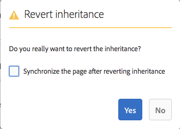

If necessary, select **[!UICONTROL Synchronize The Page After Reverting Inheritance]**. Select this option to synchronize the entire inteactive communication. If you do not select this option only the relevant target area gets synchronized on reinstating the inheritance.

Select **[!UICONTROL Yes]**.

### Synchronize {#synchronize-1}

If you are using Print as Master for Web Channel and change the Print channel, you can synchronize content to bring the newly made changes to the Web channel.

1. To synchronize the Web channel with the Print channel, switch to the Web channel and select the More options icon.

   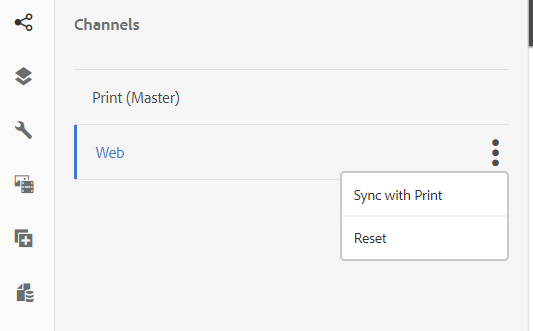

1. Select one of the following:

    * **[!UICONTROL Sync with Print]**: Syncs content only for the target areas in which inheritance is not cancelled.
    * **[!UICONTROL Reset]**: Syncs the Web channel content with the Print channel and discards all the changes made to the Web channel.

### Use component toolbar to perform actions on inherited components {#componenttoolbar}

Once you have auto-generated content in the web channel using the Synchronize option, you can perform more actions on components without canceling inheritance.


Select the component to view the following options:

* **Copy:** Copy a component and paste it in other places in the Interactive Communication.
* **Cut:** Move a component from one place to another in the Interactive Communication.
* **Insert Component:** Insert a component above the selected component.
* **Paste:** Paste the component you cut or copied using the options described above.
* **Group:** Select multiple components if you want to cut, copy, or paste more than one component together.
* **Parent:** Select the parent of a component.
* **View SOM Expression:** View the [SOM expression](../../forms/using/using-som-expressions-adaptive-forms.md) for the component.

* **Group Objects in Panel:** Group the components in a panel to be able to perform operations on those components simultaneously. For details, see [Group objects in Panel](#groupobjectspanel).

* **Cancel Inheritance:** [Cancel the inheritance](#cancelinheritance) of the components within the target area to edit them.

### Group objects in Panel {#groupobjectspanel}

The web channel authoring interface facilitates grouping the components in a panel to be able to perform operations on those components simultaneously. The **Content** tab lists the grouped components as child elements of the panel in the content tree.

1. Select a component and select the Group ( ) operation.
1. Select multiple components and select **Group objects in Panel**.

   

1. In the **Group Objects in Panel** dialog box, enter a name for the Panel.
1. Enter an optional title and description for the Panel.
1. Click .

   The grouped components display as child elements of the Panel in the content tree.

   

## Output format for Print channel {#output-format-print-channel}

Use PrintChannel API to define output format for the Print channel of an Interactive Communication. If you do not define an output format, AEM Forms generates the output in PDF format.

```javascript
//options for rendering print channel of a multi-channel document
PrintChannelRenderOptions renderOptions = new PrintChannelRenderOptions();
PrintDocument printDocument = printChannel.render(renderOptions);
```

To generate the output in any other format, specify the  output format type. Refer to [PrintChannel API](https://helpx.adobe.com/experience-manager/6-5/forms/javadocs/com/adobe/fd/output/api/PrintConfig.html) for the list of supported output format types.

For example, you can use the following sample to define PCL as output format for an Interactive Communication:

```javascript
//options for rendering print channel of a multi-channel document
PrintChannelRenderOptions renderOptions = new PrintChannelRenderOptions();
renderOptions.setRenderFormat(PrintConfig.HP_PCL_5e);
PrintDocument printDocument = printChannel.render(renderOptions);
```
