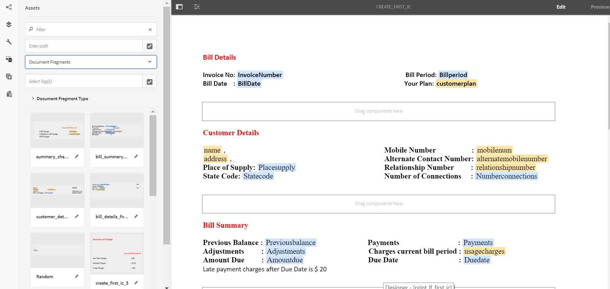
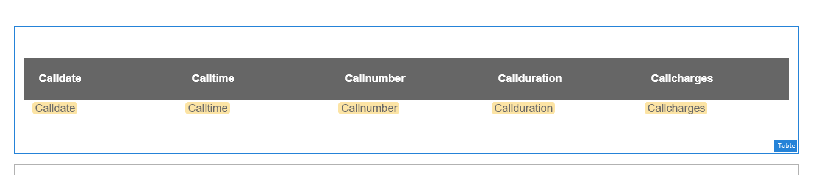
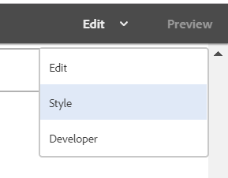
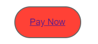
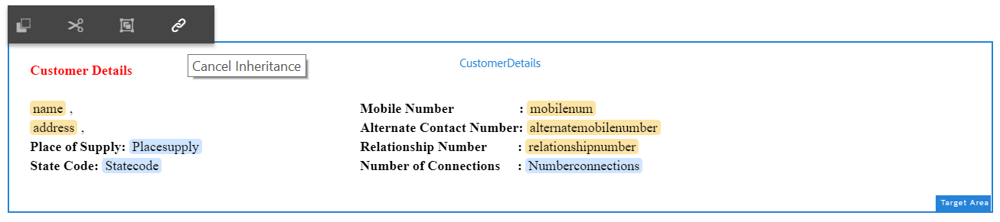
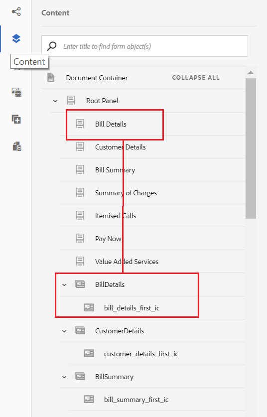

# Tutorial: Create Interactive Communication {#tutorial-create-interactive-communication}

Create an Interactive Communication using all building blocks

 

This tutorial is a step in the [Create your first Interactive Communication](/help/forms/using/create-your-first-interactive-communication.md) series. It is recommended to follow the series in chronological sequence to understand, perform, and demonstrate the complete tutorial use case.

Once you have created all the building blocks such as form data model, document fragments, templates, and themes for the web version, you can start creating an Interactive Communication.

Interactive Communications can be delivered through two channels: Print and Web. You can also create an Interactive Communication with Print channel as the master. Print as master option for Web channel ensures the content, inheritance, and data binding of the Web channel is derived from the Print channel. It also ensures that the changes made in the Print channel are synchronized in the Web channel. The Interactive Communication authors are, however, allowed to break the inheritance for specific components in the Web channel.

This tutorial walks you through the steps to create interactive communications for Print and Web channels. At the end of this tutorial, you will be able to:

* Create Interactive Communication for the Print channel
* Create Interactive Communication for the Web channel
* Create Print and Web Interactive Communications with Print as Master

## Create Interactive Communications for Print and Web with no synchronization {#create-interactive-communications-for-print-and-web-with-no-synchronization}

### Create Interactive Communication for Print channel {#create-interactive-communication-for-print-channel}

The following is the list of resources that have already been created in this tutorial and are needed while creating the Interactive Communication for the Print channel:

**Print template:** [create_first_ic_print_template](/help/forms/using/create-templates-print-web.md)

**Form Data Model:** [FDM_Create_First_IC](/help/forms/using/create-form-data-model0.md)

**Document Fragments:** [bill_details_first_ic, customer_details_first_ic, bill_summary_first_ic, summary_charges_first_ic](/help/forms/using/create-document-fragments.md)

**Layout Fragments:** [table_lf](/help/forms/using/create-templates-print-web.md)

**Images:** PayNow and ValueAddedServices

1. Log in to the AEM author instance and navigate to **Adobe Experience Manager** &gt; **Forms** &gt; **Forms & Documents**. 
1. Tap **Create** and select **Interactive Communication**. The **Create Interactive Communication** wizard is displayed. 
1. Specify **create_first_ic** in the **Title** and the **Name** field. Select **FDM_Create_First_IC** as the Form Data Model and tap **Next**.
1. In the **Channels** wizard:

    1. Specify **create_first_ic_print_template** as the Print template and tap **Select**. Ensure that the **Use Print as Master for Web Channel** checkbox is not selected.
    1. Specify **Create_First_IC_templates** folder &gt; **Create_First_IC_Web_Template** as the Web template and tap **Select**.
    1. Tap **Create**.

   A confirmation message is displayed that the Interactive Communication has been created successfully.

1. Tap **Edit** to open the Interactive Communication in the right pane.
1. Go to the **Assets** tab and apply the filter to display only the document fragments in the left pane.
1. Drag-and drop the following document fragments to their target areas in the Interactive Communication:

   | Document Fragment |Target Area |
   |---|---|
   | bill_details_first_ic |BillDetails |
   | customer_details_first_ic |CustomerDetails |
   | bill_summary_first_ic |BillSummary |
   | summary_charges_first_interactive_communication |Charges |

   

1. Tap **Charts** target area, and tap **+** to add a **Chart** component. 
1. Tap the Chart component and select  (Configure). The chart properties display in the left pane:

    1. Specify a name for the chart.
    1. Select **Pie** from the **Chart Type **drop-down list.
    1. Select the **calltype** property from the **calls** data model object type in the **X-axis** section. Tap .
    1. Select **Frequency** from the **Function** drop-down list.
    1. Select the **calltype** property from the **calls** data model object type in the **Y-axis** section. Tap .
    1. Tap  to save the chart properties.

1. Go to the **Assets** tab and apply the filter to display only the layout fragments in the left pane. Drag-and-drop the **table_lf** layout fragment to the **Itemised Calls** target area.
1. Select the Text Field in the **Date** column and tap  (Configure).
1. Select **Data Model Object** from the **Binding Type** drop-down list and select **calls** &gt; **calldate**. Tap  twice to save the properties.

   Similarly, create binding with **calltime**, **callnumber**, **callduration**, and **callcharges** for text fields in the **Time**, **Number**, **Duration**, and **Charges** columns respectively.

1. Tap **PayNow** target area, and tap **+** to add an **Image** component. 
1. Tap the Image component and select  (Configure). The image properties display in the left pane:

    1. Specify **PayNow** as the name of the image in the **Name** field.
    1. Tap **Upload**, select the image saved on the local file system, and tap **Open**.
    1. Tap  to save the image properties.

1. Repeat steps 13 and 14 to add **ValueAddedServices** image to the **ValueAddedServices** target area.

### Create Interactive Communication for Web channel {#create-interactive-communication-for-web-channel}

The following is the list of resources that have already been created in this tutorial and are needed while creating the Interactive Communication for the Web channel:

**Web template:** [Create_First_IC_Web_Template](/help/forms/using/create-templates-print-web.md)

**Form Data Model:** [FDM_Create_First_IC](/help/forms/using/create-form-data-model0.md)

**Document Fragments:** [bill_details_first_ic, customer_details_first_ic, bill_summary_first_ic, summary_charges_first_ic](/help/forms/using/create-document-fragments.md)

**Images:** PayNowWeb and ValueAddedServicesWeb

1. Log in to the AEM author instance and navigate to **Adobe Experience Manager** &gt; **Forms** &gt; **Forms & Documents**. 
1. Tap **Create** and select **Interactive Communication**. The **Create Interactive Communication** wizard is displayed. 
1. Specify **create_first_ic** in the **Title** and the **Name** field. Select **FDM_Create_First_IC** as the Form Data Model and tap **Next**.
1. In the **Channels** wizard:

    1. Specify **create_first_ic_print_template** as the Print template and tap **Select**. Ensure that the **Use Print as Master for Web Channel** checkbox is not selected.
    1. Specify **Create_First_IC_templates** folder &gt; **Create_First_IC_Web_Template** as the Web template and tap **Select**.
    1. Tap **Create**.

   A confirmation message is displayed that the Interactive Communication has been created successfully.

1. Tap **Edit** to open the Interactive Communication in the right pane.
1. Tap the **Channels** tab from the left pane and tap **Web**.
1. Go to the **Assets** tab and apply the filter to display only the document fragments in the left pane.
1. Drag-and drop the following document fragments to their target areas in the Interactive Communication:

   | Document Fragment |Target Area |
   |---|---|
   | bill_details_first_ic |BillDetails |
   | customer_details_first_ic |CustomerDetails |
   | bill_summary_first_ic |BillSummary |
   | summary_charges_first_interactive_communication |Charges |

1. Tap **Summary of Charges** target area, and tap **+** to add a **Chart** component. 
1. Tap the Chart component and select  (Configure). The chart properties display in the left pane:

    1. Specify a name for the chart.
    1. Select **Pie** from the **Chart Type **drop-down list.
    1. Select the **calltype** property from the **calls** data model object type in the **X-axis** section. Tap .
    1. Select **Frequency** from the **Function** drop-down list.
    1. Select the **calltype** property from the **calls** data model object type in the **Y-axis** section. Tap .
    1. Tap  to save the chart properties.

1. Select the **Data Sources** tab from the left pane and drag-and-drop the **calls** data model object to the **Itemised Calls** target area. All properties in the **calls** data model object are displayed as table columns in the** Itemised Calls** target area in the right pane.

   Based on the use case, you require Call Date, Call Time, Call Number, Call Duration, and Call Charges columns in the table.

   

1. Select **Mobilenum** table column heading and select **More options** &gt; **Delete column**. Similarly, delete the **Calltype** column.
1. Select the **Calldate** table column heading and tap  (Edit) to rename the text to **Call Date**. Similarly, rename other column headings in the table.
1. Based on the use case, insert a **Pay Now** button in the Interactive Communication that provides the user an option to make the payment by clicking the button. Execute the following steps to insert the button:

    1. Tap **Pay Now** target area, and tap **+** to add a **Text** component. 
    1. Tap the text component and tap  (Edit).
    1. Rename the text to **Pay Now**.
    1. Select the text and tap the Hyperlink icon.
    1. Specify the payment URL in the **Path** field.
    1. Select **New Tab** from **Target** drop-down list.
    1. Tap  to save the hyperlink properties.

1. Select **Style** from the drop-down list next to the **Preview** option.

   

1. Style the hyperlink text to display it as a button in the Interactive Communication using the following steps:

    1. Tap the text component and select  (Edit).
    1. In the **Border** section, specify **1.5px** as **Border Width**, select **Solid** as **Border Style**, and specify **46px** as **Border Radius**.
    1. Select Red as the background color for the button from the **Background** section.
    1. In the **Margin** field for **Dimensions & Position** section, tap the **Edit simultaneously** icon, and set the **Right** margin as **450px**. The Top, Bottom, and Left fields are set as blank.

   

1. Tap **Pay Now** target area, and tap **+** to add an **Image** component. 
1. Tap the Image component and select  (Configure). The image properties display in the left pane:

    1. Specify **PayNow** as the name of the image in the **Name** field.
    1. Tap **Upload**, select the **PayNowWeb** image saved on the local file system, and tap **Open**.
    1. Tap  to save the image properties.

1. Based on the use case, insert a **Subscribe** button in the Interactive Communication that provides the user an option to subscribe to the value added services by clicking the button.

   Repeat steps 13 - 17 to add a **Subscribe** button to the **Value Added Services** target area and add the **ValueAddedServicesWeb** image.

## Create Interactive Communications for Print and Web with auto synchronization {#create-interactive-communications-for-print-and-web-with-auto-synchronization}

You can also create an Interactive Communication by enabling auto synchronization between Print and Web channels. To enable auto synchronization, select the Print as master option while creating the Interactive Communication. Selecting the Print as master option ensures the content, inheritance, and data binding of the Web channel is derived from the Print channel. It also ensures that the changes made in the Print channel are reflected in the Web channel.

Execute the following steps to derive the Web channel content using Print channel:

1. Log in to the AEM author instance and navigate to **Adobe Experience Manager** &gt; **Forms** &gt; **Forms & Documents**.
1. Tap **Create** and select **Interactive Communication**. The **Create Interactive Communication** wizard is displayed. 
1. Specify **create_first_ic** in the **Title** and the **Name** field. Select **FDM_Create_First_IC** as the Form Data Model and tap **Next**.
1. In the **Channels** wizard:

    1. Specify **create_first_ic_print_template** as the Print template and tap **Select**. 
    1. Select the **Use Print as Master for Web Channel** checkbox.
    1. Specify **Create_First_IC_templates** folder &gt; **Create_First_IC_Web_Template** as the Web template and tap **Select**.
    1. Tap **Create**.

   A confirmation message is displayed that the Interactive Communication has been created successfully.

1. Tap **Edit** to open the Interactive Communication in the right pane.
1. Execute steps 6 - 15 of [Create Interactive Communication for Print channel](/help/forms/using/create-interactive-communication0.md#create-interactive-communication-for-print-channel) section.
1. Tap the **Channels** tab from the left pane and tap **Web** to auto-generate content for the Web channel from the Print channel. 
1. As the **Use Print as Master for Web Channel** checkbox is selected in step 4, the content and bindings are auto-generated for Web channel from the Print channel.

   The print channel content is inserted below the Web channel template content. To modify the Web channel content that has been auto-generated from the Print channel, you can cancel the inheritance for any target area.

   Hover over the relevant target area in the web channel and select  (Cancel Inheritance) and then in the **Cancel Inheritance** dialog, tap **Yes**. 

   

   If you have canceled inheritance of a component, you can re-enable it. To re-enable inheritance, hover over the boundary of the relevant target area, which includes the component, and tap . 

1. Select the **Content** tab in the left pane.
1. Drag-and-drop the auto-generated Web channel content to the existing panels in the Web template using the content tree. The following is the list of components that need to be rearranged:

    * Bill Details component to Bill Details panel
    * Customer Details component to Customer Details panel
    * Bill Summary component to Bill Summary panel
    * Summary of Charges component to Summary of Charges panel
    * Layout fragment (table) to the Itemised Calls panel

   

1. Repeat steps 13 - 18 of [Create Interactive Communication for Web channel](/help/forms/using/create-interactive-communication0.md#create-interactive-communication-for-web-channel) to insert the **Pay Now** and **Subscribe** hyperlinks in the Web channel of the Interactive Communication.

