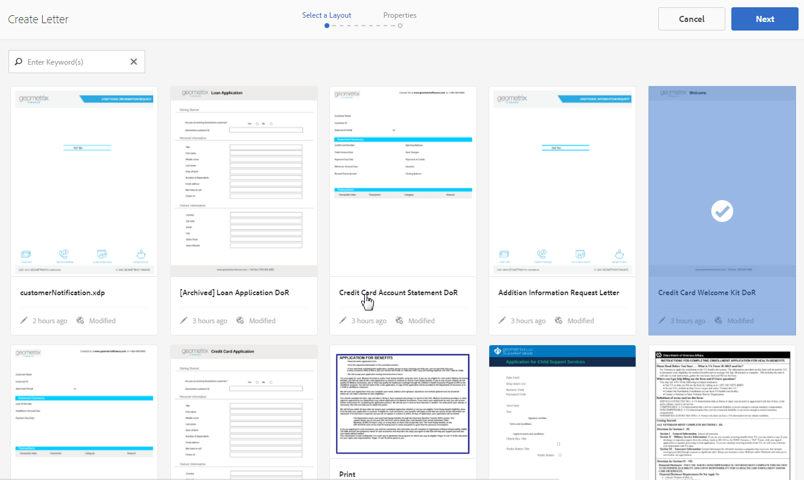
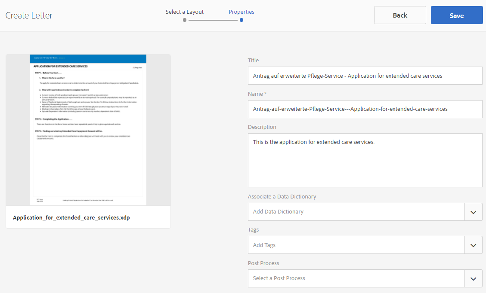
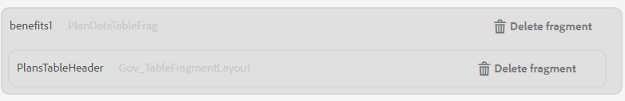
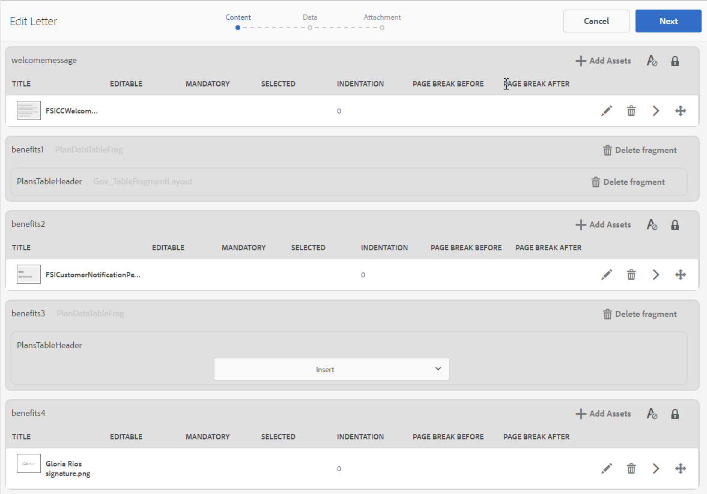
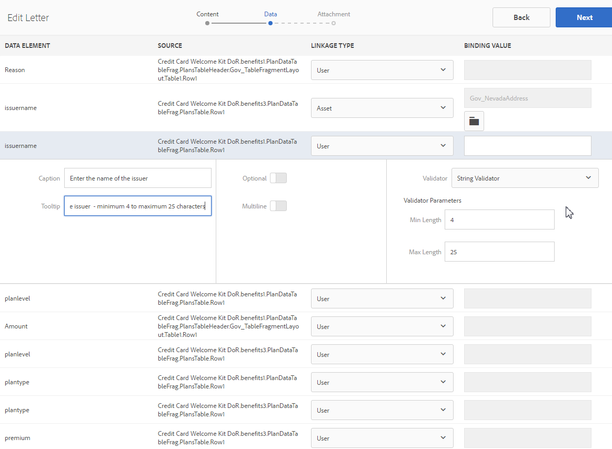

# Create Letter {#create-letter}

## Correspondence Management workflow {#correspondence-management-workflow}

The Correspondence Management workflow consists of four phases:

1. Template creation
1. Document Fragment creation
1. Letter creation
1. Postprocessing

### Template creation {#template-creation}

The following graphic shows a typical workflow for creating a correspondence template.

In this workflow:

1. Form Designers create layouts and fragment layouts using Adobe Forms Designer and upload them to a CRX repository. The layouts contain typical form fields, layout features such as a header and footer, and empty "target areas" for the placement of content. Later, Application Specialists map the content that is required for these target areas. More information on [designing layout](/help/forms/using/layout-design-details.md).
1. Subject Matter Experts from Legal, Finance, or Marketing departments, create, and upload content such as text clauses disclaimers, terms and conditions, and images such as logos, that are reused in various correspondence templates. 
1. Application Specialists create correspondence templates. The Application Specialist

    * Maps text clauses and images to target areas in the layout templates
    * Defines conditions/rules for the inclusion of content
    * Binds layout fields and variables to underlying data models

1. Author previews the letter and submits it for post processing. More information about [post processing](/help/forms/using/submit-letter-topostprocess.md).

#### Using letter templates provided with Correspondence Management {#using-letter-templates-provided-with-correspondence-management}

Instead of creating a layout template from scratch, you can choose to modify and reuse the templates that Correspondence Management provides. You can use designer to quickly modify the branding and the data and content fields of the templates to suit your organization's needs. For more information on Correspondence Management templates, see [Reference letter templates](/help/forms/using/reference-cm-layout-templates.md).

### Document fragment creation {#document-fragment-creation}

Document fragments are reusable parts\components of a correspondence using which you can compose letters\correspondence.

The document fragments are of the following types:

#### Text {#text}

A text asset is a piece of content that consists of one or more paragraphs of text. A paragraph can be static or dynamic. A dynamic paragraph contains references to data elements, whose values are supplied at runtime.

#### List {#list}

List is a series of document fragments, including text, lists (the same list cannot be `` added in itself), conditions, and images. The order of the list elements can be fixed or editable. While creating a letter, you can use some or all the list elements to replicate a reusable pattern of elements.

#### Condition {#condition}

Conditions enable you to define what content gets included at correspondence creation time, based on the supplied data. The condition is described in terms of control variables. The variables can be either a data dictionary element or a placeholder. When you add a condition, you can choose to include an asset based on the value that the control variable has. Conditions have a single output based on an expression. The first expression is found to be true, based on current condition variable. Its value becomes the condition's output.

#### Layout fragment {#layout-fragment}

A layout fragment is a layout that can be used within one or more letters. A layout fragment is used to create repeatable patterns, especially dynamic tables. The layout can contain typical form fields such as "Address" and "Reference Number." It also contains empty sub forms that denote target areas. The layouts (XDPs) are created in Designer and then are [uploaded to Forms and Documents](/help/forms/using/get-xdp-pdf-documents-aem.md).

### Letter creation {#letter-creation}

There are two ways to generate the correspondence that is sent to your customers: user-driven and system-driven.

#### User driven {#user-driven}

Customer-facing employees such as claims adjustors or case workers can create customized correspondence. Using a simple and intuitive letter-filling interface, business users can add optional text to the correspondence, personalize editable content while previewing the correspondence in real time. They can then submit the customized correspondence to a back-end process.

 

#### System driven {#system-driven}

The correspondence generation is automated, driven by event triggers. For example, a reminder notice sent to a citizen prompting her for advance tax filing, is generated by merging the predefined template with citizen data. The final letter can be emailed, printed, faxed, or archived.

 

### Post processing {#post-processing}

The final correspondence can be sent to a back-end process for postprocessing. The correspondence can be:

1. Processed for email, fax, or batch printing, or placed in a folder for printing or e-mailing.
1. Submitted for review and approval.
1. Secured by applying digital signatures, certification, encryption, or rights management.
1. Converted to a searchable PDF document that contains all the necessary metadata for archiving and auditing purposes.
1. Included in a PDF Portfolio that includes more documents, such as marketing material. The PDF Portfolio can then be sent as the final correspondence.

### Correspondence Management solution architecture {#correspondence-management-solution-architecture}

The following graphic provides an overview of an example architecture of the Letters Solution.

 

## Deconstructing a letter {#deconstructing-a-letter}

This Notice of Cancelation document is an example of a typical correspondence: 

 

<table> 
 <tbody> 
  <tr> 
   <td><strong>Letter elements</strong></td> 
   <td><strong>Description</strong></td> 
   <td><strong>Formed with</strong></td> 
  </tr> 
  <tr> 
   <td>Data from back-end Enterprise systems</td> 
   <td>Data that is sourced from backend enterprise systems. The data is merged dynamically with the correspondence template.</td> 
   <td>The  Data file created based on a Data Dictionary</td> 
  </tr> 
  <tr> 
   <td>Data  Entered by front-line Employee</td> 
   <td>Data that can be supplied by a front-line employee who is customizing the letter before sending it out.  </td> 
   <td>
Unprotected DD elements  Editable text paragraphs  Variables/placeholders  
 </td> 
  </tr> 
  <tr> 
   <td>Pre-Approved  Text Paragraphs</td> 
   <td>Pre-approved text content. Experts in Legal, Finance, or a line of business who understand the business context of the letter, typically author the text content. Content such as header, footer, disclaimers, and salutation would be common to most of the letters. However, content such as "reason for termination" would be specific to the particular letter.</td> 
   <td>
Text\Lists\  Conditions\Layout
 
 
 </td> 
  </tr> 
  <tr> 
   <td>Data  Based on Custom Logic ?</td> 
   <td>For some letters, such as a letter to request more information regarding a claim, users such as the Claims Adjustor can add custom text content.</td> 
   <td>Document  Fragment of type Condition </td> 
  </tr> 
  <tr> 
   <td>Stored  Images from Central Repository</td> 
   <td>Images such as logos and signature images. Images such as corporate logos would appear in most or all correspondence. Signature images are specific to the letter and to the person on whose behalf the letter is sent.</td> 
   <td>
Images stored in AEM assets (DAM)  
 
 
 </td> 
  </tr> 
 </tbody> 
</table>

## Analyze a letter before you construct it {#analyze-a-letter-before-you-construct-it}

Analyze every letter to uncover the various pieces that make up the letter. The Application Specialist analyzes the correspondences that are generated.

* Which parts of the correspondence are static and which are dynamic. The variables that are filled from backend data sources or by end users.
* The order in which the various text paragraphs appear in the correspondence such as whether a business user can change paragraphs during correspondence creation.
* Is the correspondence system-generated or does it require an end user to edit the correspondence? How many correspondences are system-generated and how many require user intervention?
* How frequently does the correspondence template change? Will it be updated yearly, quarterly, or only when a particular legislation changes? What type of changes is expected? Is it a change to fix typographical errors, a layout change, adding more fields, adding more paragraphs, and so on.
* When planning your correspondence requirements, assemble the list of new correspondence templates. For each correspondence template, you require:

    * Text clauses, images, and tables
    * Data values from backend systems
    * The layout and fragment layouts of the correspondence
    * The order in which content appears in the letter and rules for inclusion and exclusion of content

* The conditions under which business users such as claims adjustors or case workers modify content or portions in the letter.
* Scenarios are narratives that describe the user experience, requirements, and benefits of using the Letters Solution. 
* Scenarios also provide:The required skill sets and tools you require for your project.
* Best practices for planning your implementation. ``High-level implementation overview.

## Benefits of performing the analysis {#benefits-of-performing-the-analysis}

**Content reuse** You have a consolidated list of new content required for generating correspondence. Much of the content such as headers, footers, disclaimers, and introductions are common to many letters and can be reused across various letters. All such common content can be created and approved by experts once and then reused in many pieces of correspondence.

**Building the data dictionary** There will be data values such as "Customer Id" and "Customer Name" that are common to many letters. You can prepare a consolidated list of all such data values. Typically someone from the enterprise middleware team is consulted when planning the structure. This forms the basis for building the Data Dictionary.

**Sourcing data from backend enterprise systems** You will also know all data values that are needed and from where the enterprise system data is obtained. You can then architect the implementation to extract the data from the enterprise system and feed to the Letters solution.

**Estimating the complexity of letters** It is important to determine how complex it will be to create a particular correspondence. This analysis helps in determining the amount of time and skill sets that will be required to create the letter templates. This in turn will help in estimating the resources and cost of implementing the Letters solution.

## Correspondence complexity {#correspondence-complexity}

The complexity of correspondence can be determined by analyzing the following parameters:

**Layout complexity** How complex is the layout? Letters such as Notice of Cancelation have simple layouts. Whereas letters such as Claims Coverage Confirmation has a complex layout with several tables and more than 60 form fields. Creating complex layouts takes more time and requires advanced layout design skill sets.

**Number of text paragraphs and conditions** A loan contract can be 10 pages long and contain more than 40 text clauses. Many of these clauses would depend `` loan parameters. Based on the exact terms and conditions, the clauses would be included or excluded from the contract. Creating such letters requires thorough planning and careful definition of the complex conditions.

This table provides some guidelines that you can use to classify your letters:

<table> 
 <tbody> 
  <tr> 
   <td>
<strong>Complexity level</strong>
 </td> 
   <td>
<strong>Layout complexity (subjective)</strong>
 </td> 
   <td>
<strong>Number of text paragraphs</strong>
 </td> 
   <td>
<strong>Number of conditional texts or images</strong>
 </td> 
   <td>
<strong>Required skill set</strong>
 </td> 
  </tr> 
  <tr> 
   <td>
Low complexity
 </td> 
   <td>
Low. Layout has few form fields (&lt;15).
 
Typically one page.
 </td> 
   <td>
8
 </td> 
   <td>
1
 </td> 
   <td>
Medium Designer skills.
 </td> 
  </tr> 
  <tr> 
   <td>
Medium complexity
 </td> 
   <td>
Medium complexity layout. Includes structures such as tables. Typically more than one page long.
 </td> 
   <td>
16
 </td> 
   <td>
2
 </td> 
   <td>
Medium Designer skills.
 
 
 
Capability to create complex expressions using user interfaces.
 </td> 
  </tr> 
  <tr> 
   <td>
High complexity
 </td> 
   <td>
Complex layout. Can be greater than three pages. Contains tables and more than 60 form fields.
 </td> 
   <td>
40
 </td> 
   <td>
8
 </td> 
   <td>
Expert Designer skills.
 
 
 
Capability to create complex expressions using user interfaces.
 </td> 
  </tr> 
 </tbody> 
</table>

## Overview of Creating a Letter {#overview-of-creating-a-letter}

1. Select the appropriate layout that serves as the base of the letter and create a letter.
1. Add data modules or layout fragments to the letter and configure them.
1. Choose to preview the correspondence.
1. Edit and set up the fields, variables, content, and attachments.

### Prerequisites {#prerequisites}

You need the following in place first to create a correspondence:

* [Compatibility Package](compatibility-package.md). Install the Compatibility Package to view the **Letters** option on the **Forms** page.
* The letter XDP ([layout](/help/forms/using/document-fragments.md)).
* Other XDPs ([layout fragments](document-fragments.md#document-fragments)) that form parts of the letter. The XDPs\Layouts are created in [Designer](https://www.adobe.com/go/learn_aemforms_designer_65). 
* The relevant [data dictionary](/help/forms/using/data-dictionary.md) (Optional). 
* The [data modules](/help/forms/using/document-fragments.md) you want to use in the correspondence.
* [Test Data](/help/forms/using/data-dictionary.md#p-working-with-test-data-p) is the XML file with the test data ported in it. Test data is required if you are using a data dictionary.

## Create a letter template {#create-a-letter-template}

### Select a layout and enter the letter properties {#select-a-layout-and-enter-the-letter-properties}

1. Select **Forms** &gt; **Letters**.  

1. Select **Create &gt; Letter**. Correspondence Management displays the available layouts (XDPs). These layouts come from Designer. The layouts also include the letter templates that Correspondence Management provides out of the box. For more information on Correspondence Management templates, see [Reference letter templates](/help/forms/using/reference-cm-layout-templates.md). To add your own layouts, create XDP (layout) files in Designer and then [upload them to AEM Forms](/help/forms/using/get-xdp-pdf-documents-aem.md).

   

1. Select a layout by tapping it and select **Next**.

   

1. Enter the properties for the Correspondence and select **Save:**

    * **Title (Optional):** Enter the title for the letter. Title do not need to be unique and can have special characters and non-english characters. 
    * **Name:** The unique name for the letter. No two letters in any state can exist with the same name. In the Name field, you can enter only English language characters, numbers, and hyphens. The Name field is automatically populated based on the Title field. The special characters, spaces, numbers, and non-English characters entered in the Title field are replaced with hyphens in the Name field. Although the value in the Title field is automatically copied to the Name, you can edit the value.
    * **Description (Optional):** Describe the letter for your reference.
    * **Data Dictionary (Optional)**: The Data Dictionary can be associated to the correspondence. The assets that you later insert in this correspondence should either have the same data dictionary as the one you choose for the correspondence here or no data dictionary. 
    * **Tags (Optional):** Select the tags to apply to the correspondence. You can also type in a new/custom tag name and press Enter to create it. 
    * **Post Process (Optional):** Select the post process to be applied to the letter template. There are out of the box post processes and the ones you have created using AEM, such as e-mail and print.

   

1. The system displays a message: "Letter created successfully." (in the alert message) Select **Open** to configure the data modules and layout fragments in it. Or select **Done** to go back to the previous page. 

   

   **Next**: When you select **Open**, Correspondence Management displays a representation of the layout with all the components in the layout (XDP) listed. Go ahead with inserting the [Data Modules and Layout Fragments and Configuring them](/help/forms/using/create-letter.md#p-insert-data-modules-and-layout-fragments-in-a-letter-and-configure-them-p).

### Insert data modules and layout fragments in a letter and configure them {#insert-data-modules-and-layout-fragments-in-a-letter-and-configure-them}

When after creating a correspondence, you select Open, Correspondence Management displays a representation of the layout with all the subforms/target areas in the layout (XDP) listed. In each of the target areas, you can choose to insert either a Data Module or a Layout Fragment (and then data modules in the layout fragment).

>[!NOTE]
>
>You can also choose to select Edit icon for a letter in the Letters page to Insert data modules and layout fragments in a letter and configure them.

1. Select **Insert** for each of the subforms and select Data Modules or a Layout Fragment to insert in each of the subforms.

   

1. Select Data Module or Layout Fragment for these options for each of the subforms and then choose the Data Modules or the Layout Fragments to insert. A layout fragment lets you further insert data modules or layout fragments in it according to its design (up to four levels). 

   

1. If you insert a layout fragment, the name of the layout fragment appears in the subform. And according to the selected fragment, nested subforms appear in the subform.
1. After the chosen Data Modules are inserted in the layout, you can select configure mode and set the following after tapping the Edit icon for each of the modules:

    1. **Editable**: When this option is selected, the content can be edited in Create Correspondence user interface. Mark content as editable only if it requires the business user (such as a Claims Adjustor) to modify it.
    1. **Mandatory**: When this option is selected, the content is required in Create Correspondence user interface.
    1. **Selected**: When this option is selected, the content is selected by defaults in the Create Correspondence user interface.
    1. **Indentation**: Increase or decrease the indentation of the module/content in the letter. Indentation is specified in terms of levels, starting 0. Each level indents 36pts. For more information on customizing forms, see **[!UICONTROL Correspondence Management Configurations]** in [Forms workflow](submit-letter-topostprocess.md#formsworkflow).
    1. **Page break before**: If you set the Page Break Before to on, the contents of THIS module always display on a new page.
    1. **Page break after**: If you set the Page Break After to on for a specific module, the contents of the NEXT module always display on a new page.

   

1. To edit a module, select the Edit icon next to it. After editing the modules, select **Save**.

   In this page, you can also do the following for the subforms:

    1. **Allow Free Text**: If Allow free Text is enabled then user can add inline text in letter in CCR view. In CCR view a 'T' action is enabled for those target areas which has Allow Free Text enabled and when user select it then it asks for name and description of the text and then on tapping ok it opens that text in edit mode where user can add text. So this acts like other text modules
    1. **Lock Order**: Locks the order of the subforms in the letter. The author is not allowed to reorder the subforms/components while creating the letter.

   In this page, you can also do the following for each of the assets in the subforms:

    1. **Change the order of the assets**: drag-and-drop an asset holding the reorder icon for an asset ( ).
    1. **Delete assets**: Select the Delete icon next to an asset to delete it.
    1. **Preview assets**: Select the show preview icon ( ) next to an asset.

1. Select **Next**. 
1. The Data page details how data fields and variables are used in the template. Data can be linked to data sources such as a data dictionary or user input. Each field defines properties from which data dictionary maps data or what caption is displayed for user input fields.

   Linkage:

    * The **field** elements can be linked to a literal, data dictionary element, an asset, or a user specified value. You can also ignore a field element by binding it to the Ignore option.
    * The **variable** elements can be linked to a literal, data dictionary element, a field, a variable, an asset, or a user specified value.

   Following are some main fields in the linkage:

    * **Multi-line**: You can specify if the data entry for a field or variable is multi-line. If you select this option, the input box for the field or variable displays as multi-line input box in the Data Editing View. The field or variable also displays as multi-line in the Data and Content views in the Create Correspondence user interface. The multi-line input field is similar to the field for entering a comment in a TextModule. The multi-line option is available only for fields and variables with linkage type User or unprotected Data Dictionary Elements.
    * **Optional**: You can specify if the value for field or variable is optional or not. The optional field option is available for fields and variables with linkage type User or unprotected Data Dictionary Elements.

    * **Field / Variable Validation**: To provide enhanced validation of the value of a field or variable, you can assign a validator to the field or variable. This option is available only for fields and variables with linkage type User or unprotected Data Dictionary Elements.
    * **Caption** and **Tooltip**: Caption is the label of the field that appears before the field in the CCR user interface. This option is available for fields and variables with linkage type User or unprotected Data Dictionary Elements.

   Following are the types of validation you can use for the fields:

    * **String Validator**: Use the String Validator to specify a minimum and maximum length of the string entered in field or variable. When you create a String Validator, ensure that you specify valid validation parameters. Enter a valid length for both the minimum and maximum values. For String validator, you can specify the min and max length of the value that can be entered. If the value entered is not according to the min and max specified, the relevant field in the CCR user interface is marked in red color.

    * **Number Validator**: Use the Number Validator to specify the minimum and maximum numeric value entered in a field or variable. When you create a Number Validator, ensure that you specify valid validation parameters. Enter numeric values for both the minimum and maximum values.

    * **Regular Expression Validator**: Use the Regular Expression Validator to define a regular expression that is used to validate the value of a field or variable. In addition, you can customize the error message. When you create a Regular Expression Validator, ensure that you specify valid regular expression.

   >[!NOTE]
   >
   >The field and variable validators are only available on fields or variables with linkage type User or unprotected Data Dictionary Elements.

   

1. After specifying linkage, select **Next**. Correspondence Management displays the Attachments screen.

### Set up the attachments {#set-up-the-attachments}

1. Select **Add Asset**. 
1. In the Select Asset screen, select the assets to attach with the letter and select **Done**. You need to have the assets first uploaded to Assets. It is recommended that you attach only PDF and Microsoft Office documents, but you can also attach images. For more information on uploading assets in DAM, see [Uploading Assets](/help/assets/manage-assets.md).
1. To lock the order of the assets in the list so that the Claims Adjustor cannot change the order, select **Lock Order**. If you do not select this option, the Claims Adjustor can change the order of the list items.
1. To change the order of the assets, drag-and-drop an asset holding the reorder icon for an asset ( ).
1. Select **Edit** in front of an attachment and specify an attachment as Mandatory if you do not want the author to be able to delete it. Specify an attachment as Selected if you want it to be preselected in the CCR interface. 
1. Select **Library Access** to give the access to the library. If Library Access is enabled, the Claims Adjustor can access content library while creating a letter and insert attachments.
1. Select **Attachments Configuration** and specify the maximum number of attachments.  

1. Select **Save**. Your correspondence is created and listed on the Letters page.

After a letter template is created in Correspondence Management, the end user/agent/claim adjustor can open the letter in the CCR user interface and create a correspondence by entering data, setting up content, and managing attachments. For more information, see [Create Correspondence](/help/forms/using/create-correspondence.md).

## Types of linkage available for each of the fields {#types-of-linkage-available-for-each-of-the-fields}

The following table describes which types of linkage are available for various types of fields.

The following values in the table

* **Yes**: Field type in the leftmost column supports that type of mapping
* **No**: Field type in the leftmost column does not support that type of mapping
* **N/A**: Field type in the leftmost column is not applicable

<table> 
 <tbody> 
  <tr> 
   <td> </td> 
   <td><strong>Literal</strong></td> 
   <td><strong>Asset</strong></td> 
   <td><strong>Data Dictionary</strong></td> 
   <td><strong>Ignore</strong></td> 
   <td><strong>User</strong></td> 
   <td><strong>Field</strong></td> 
   <td><strong>Variable</strong></td> 
  </tr> 
  <tr> 
   <td><strong>date</strong></td> 
   <td>Yes</td> 
   <td>No</td> 
   <td>Yes</td> 
   <td>Yes</td> 
   <td>Yes</td> 
   <td>N/A</td> 
   <td>N/A</td> 
  </tr> 
  <tr> 
   <td><strong>time</strong></td> 
   <td>Yes</td> 
   <td>No</td> 
   <td>Yes</td> 
   <td>Yes</td> 
   <td>Yes</td> 
   <td>N/A</td> 
   <td>N/A</td> 
  </tr> 
  <tr> 
   <td><strong>datetime</strong></td> 
   <td>Yes</td> 
   <td>No</td> 
   <td>Yes</td> 
   <td>Yes</td> 
   <td>Yes</td> 
   <td>N/A</td> 
   <td>N/A</td> 
  </tr> 
  <tr> 
   <td><strong>integer</strong></td> 
   <td>Yes</td> 
   <td>No</td> 
   <td>Yes</td> 
   <td>Yes</td> 
   <td>Yes  </td> 
   <td>N/A</td> 
   <td>N/A</td> 
  </tr> 
  <tr> 
   <td><strong>float</strong></td> 
   <td>Yes</td> 
   <td>No</td> 
   <td>Yes</td> 
   <td>Yes</td> 
   <td>Yes  </td> 
   <td>N/A</td> 
   <td>N/A  </td> 
  </tr> 
  <tr> 
   <td><strong>richtext</strong></td> 
   <td>Yes</td> 
   <td>text only</td> 
   <td>Yes</td> 
   <td>Yes</td> 
   <td>Yes</td> 
   <td>N/A</td> 
   <td>N/A</td> 
  </tr> 
  <tr> 
   <td><strong>plain</strong> <strong>text</strong></td> 
   <td>Yes</td> 
   <td>text only</td> 
   <td>Yes</td> 
   <td>Yes</td> 
   <td>Yes</td> 
   <td>N/A</td> 
   <td>N/A</td> 
  </tr> 
  <tr> 
   <td><strong>image</strong></td> 
   <td>No</td> 
   <td>image only</td> 
   <td>No</td> 
   <td>Yes</td> 
   <td>No</td> 
   <td>N/A</td> 
   <td>N/A</td> 
  </tr> 
  <tr> 
   <td><strong>signature</strong></td> 
   <td>No</td> 
   <td>No</td> 
   <td>No  </td> 
   <td>Yes</td> 
   <td>No</td> 
   <td>N/A</td> 
   <td>N/A  </td> 
  </tr> 
 </tbody> 
</table>

## Create copy of a letter template {#createcopylettertemplate}

You can use an existing letter template to quickly create a letter template with similar properties, content, and inherited assets, such as document fragments and data dictionary. To do this, copy and paste a letter.

1. In the Letters page, select one or more letters. The UI displays the Copy icon. 
1. Select Copy. The UI displays the Paste icon. You can also choose to go inside a folder before you paste. Different folders can contain assets with same names. For more information on folders, see [Folders and organizing assets](/help/forms/using/import-export-forms-templates.md#folders-and-organizing-assets). 
1. Select Paste. The Paste dialog appears. If you are copying and pasting the letters at the same place, the system automatically assigns names and titles to the new copies of letters but you can edit the titles and names of the letters. 
1. If necessary, edit the Title and Name with which you want to save the copy of the letter.
1. Select Paste. The copy of the letter is created. Now you can make the required changes in your newly created letter.
