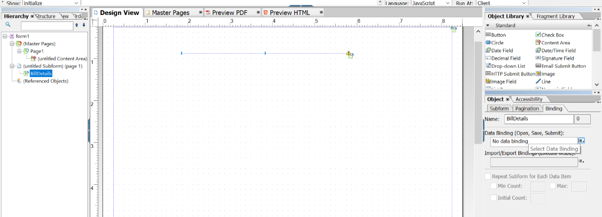
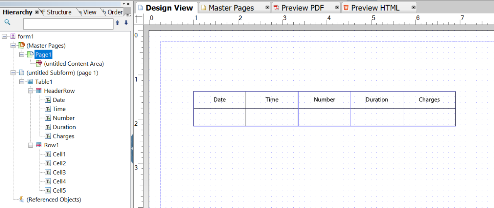
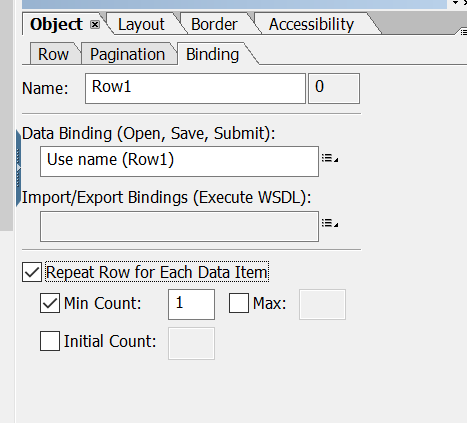
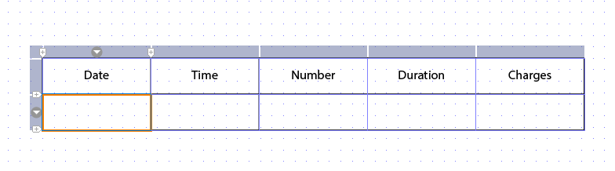
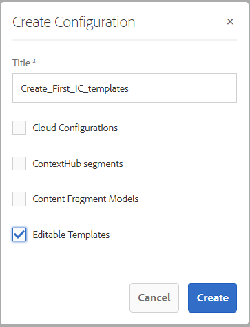
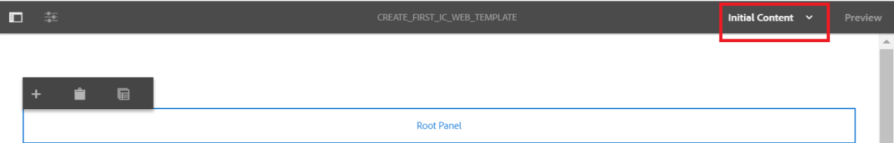
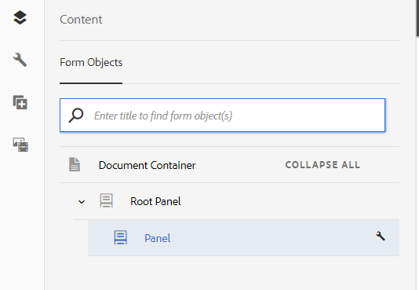
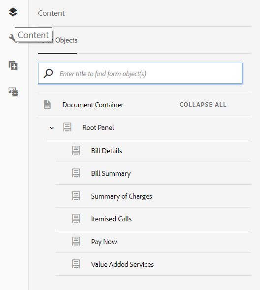
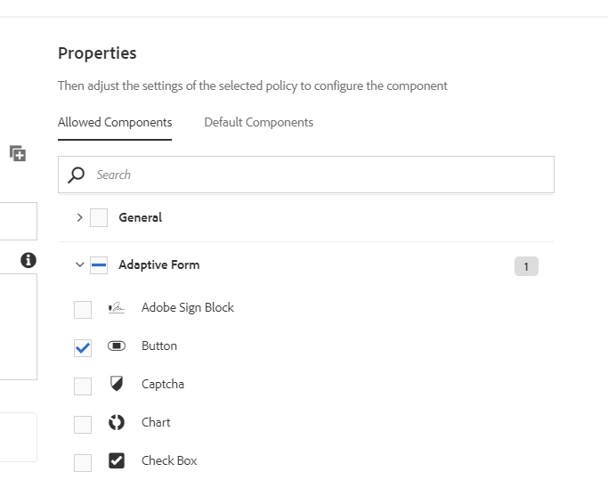

# Tutorial: Create templates{#tutorial-create-templates}

 

This tutorial is a step in the [Create your first Interactive Communication](/help/forms/using/create-your-first-interactive-communication.md) series. It is recommended that you follow the series in chronological sequence to understand, perform, and demonstrate the complete tutorial use case.

To create an Interactive Communication, you must have templates available on the AEM server for Print and Web Channels.

The templates for the Print channel are created in Adobe Forms Designer and uploaded to the AEM server. These templates are then available for use while creating an Interactive Communication.

The templates for the Web channel are created in AEM. Template authors and administrators can create, edit, and enable web templates. Once created and enabled, these templates are available for use while creating an Interactive Communication.

This tutorial walks you through the steps to create templates for Print and Web channels so that they are available for use while creating Interactive Communications. At the end of this tutorial, you will be able to:

* Create XDP templates for Print channel using Adobe Forms Designer
* Upload the XDP templates to the AEM Forms Server
* Create and enable templates for the Web channel

## Create template for Print channel {#create-template-for-print-channel}

Create and manage a template for the Print channel of Interactive Communication using the following tasks:

* [Create an XDP template by using Forms Designer](../../forms/using/create-templates-print-web.md#create-xdp-template-using-forms-designer)
* [Upload an XDP template to the AEM Forms Server](../../forms/using/create-templates-print-web.md#upload-xdp-template-to-the-aem-forms-server)
* [Create an XDP template for layout fragments](../../forms/using/create-templates-print-web.md#create-xdp-template-for-layout-fragments)

### Create an XDP template by using Forms Designer {#create-xdp-template-using-forms-designer}

Based on the [use case](/help/forms/using/create-your-first-interactive-communication.md) and [anatomy](/help/forms/using/planning-interactive-communications.md), create the following subforms in the XDP template:

* Bill Details: Includes a Document Fragment
* Customer Details: Includes a Document Fragment
* Bill Summary: Includes a Document Fragment
* Summary: Includes a Document Fragment (Charges subform) and a chart (Charts subform)
* Itemized Calls: Includes a table (layout fragment)
* Pay Now: Includes an image
* Value Added Services: Includes an image

These subforms are displayed as target areas in the Print template after uploading the XDP file to the Forms Server. All entities such as document fragments, charts, layout fragments, and images are added to target areas while creating the Interactive Communication.

To create an XDP template for the Print channel, do the following:

1. Open the Forms Designer, select **File** &gt; **New** &gt; **Use a blank form,** select **Next**, and then select **Finish** to open the form for template creation.

   Ensure that the **Object Library** and **Object** options are selected from the **Window** menu.

1. Drag-and-drop the **Subform** component from the **Object Library** to the form.
1. Select the subform so you can see the options for the subform in the **Object** window in the right pane.
1. Select the **Subform** tab and select **Flowed** from the **Content** drop-down list. To adjust the length, drag the left endpoint of the subform.
1. In the **Bindings** tab:

    1. Specify **BillDetails** in the **Name** field.

    1. Select **No data binding** from the **Data Binding** drop-down list.

   

1. Similarly, select the root subform, select the **Subform** tab, and select **Flowed** from the **Content** drop-down list. In the **Bindings** tab:

    1. Specify **TelecaBill** in the **Name** field.

    1. Select **No data binding** from the **Data Binding** drop-down list.

   

1. Repeat steps 2 - 5 to create the following subforms:

    * BillDetails
    * CustomerDetails
    * BillSummary
    * Summary - Select the **Subform** tab and select **Positioned** from the **Content** drop-down list for this subform. Insert the following subforms in the **Summary** subform.

        * Charges
        * Charts

    * ItemisedCalls
    * PayNow
    * ValueAddedServices

   To save time, you can also copy and paste existing subforms to create additional subforms.

   To shift the **Charts** subform to the right of the Charges subform, select the **Charts** subform from the left pane, select the **Layout** tab, and specify a value for the **AnchorX** field. The value must be greater than the value for the **Width** field for the **Charges** subform. Select the **Charges** subform and select the **Layout** tab so you can view the value of the **Width** field.

1. Drag-and-drop the **Text** object from the **Object Library** to the form and enter the **Dial XXXX to subscribe** text in the box.
1. Right-click the text object in the left pane, select **Rename Object**, and enter the name of the text object as **Subscribe**.

   

1. Select **File** &gt; **Save As** to save the file on the local file system:

    1. Navigate to the location where you can save the file and specify the name as **create_first_ic_print_template**.
    1. Select **.xdp** from the **Save as type** drop-down list.

    1. Select **Save**.

### Upload an XDP template to the AEM Forms Server {#upload-xdp-template-to-the-aem-forms-server}

Once you have created an XDP template using the Forms Designer, you must upload it to the AEM Forms Server so that the template is available for use while creating the Interactive Communication.

1. Select **[!UICONTROL Forms]** &gt; **[!UICONTROL Forms & Documents]**.
1. Select **Create** &gt; **File Upload**.

   Navigate and select the **create_first_ic_print_template** template (XDP) and select **Open** to import the XDP template to the AEM Forms Server.

### Create an XDP template for layout fragments {#create-xdp-template-for-layout-fragments}

To create a layout fragment for the Print channel of the Interactive Communication, create an XDP using Forms Designer and upload it to the AEM Forms Server.

1. Open the Forms Designer, select **File** &gt; **New** &gt; **Use a blank form,** select **Next**, and then select **Finish** to open the form for template creation.

   Ensure that the **Object Library** and **Object** options are selected from the **Window** menu.

1. Drag-and-drop the **Table** component from the **Object Library** to the form.
1. In the Insert Table dialog:

    1. Specify the number of columns as **5**.
    1. Specify the number of body rows as **1**.
    1. Select the **Include Header Row in Table** checkbox.
    1. Tab **OK**.

1. Select **+** in the left pane next to **Table** 1 and right-click **Cell1** and select **Rename Object** to **Date**.

   Similarly, rename **Cell2**, **Cell3**, **Cell4**, and **Cell5** to **Time**, **Number**, **Duration**, and **Charges** respectively.

1. Click the Header text fields in the **Designer View** and rename them to **Time**, **Number**, **Duration**, and **Charges**.

   

1. Select **Row 1** from the left pane and select **Object** &gt; **Binding** &gt; **Repeat Row for Each Data Item**.

   

1. Drag-and-drop the **Text Field** component from the **Object Library** to the **Designer View**.

   

   Similarly, drag-and-drop the **Text Field** component to the **Time**, **Number**, **Duration**, and **Charges** rows.

1. Select **File** &gt; **Save As** to save the file on the local file system:

    1. Navigate to the location where you can save the file and specify the name as **table_lf**.
    1. Select **.xdp** from the **Save as type** drop-down list.

    1. Select **Save**.

   Once you have created an XDP template for layout fragment using the Forms Designer, you must [upload](../../forms/using/create-templates-print-web.md#upload-xdp-template-to-the-aem-forms-server) it to the AEM Forms Server so that the template is available for use while creating layout fragments.

## Create a template for Web channel {#create-template-for-web-channel}

Create and manage a template for the Web channel of Interactive Communication using the following tasks:

* [Create folder for templates](../../forms/using/create-templates-print-web.md#create-folder-for-templates)
* [Create the template](../../forms/using/create-templates-print-web.md#create-the-template)
* [Enable the template](../../forms/using/create-templates-print-web.md#enable-the-template)
* [Enabling buttons in Interactive Communications](../../forms/using/create-templates-print-web.md#enabling-buttons-in-interactive-communications)

### Create a folder for templates {#create-folder-for-templates}

To create a Web channel template, define a folder where you can save the created templates. Once you create a template inside that folder, enable the template to allow the forms users to create a Web channel of an Interactive Communication based on the template.

To create a folder for the editable templates, do the following:

1. Select **Tools**  &gt; **Configuration Browser**.
   * See the [Configuration Browser](/help/sites-administering/configurations.md) documentation for more information.
1. In the Configuration Browser page, select **Create**.
1. In the **Create Configuration** dialog, specify **Create_First_IC_templates** as the title for the folder, check **Editable Templates**, and select **Create**.

   

   The **Create_First_IC_templates** folder is created and listed on the **Configuration Browser** page.

### Create the template {#create-the-template}

Based on the [use case](/help/forms/using/create-your-first-interactive-communication.md) and [anatomy](/help/forms/using/planning-interactive-communications.md), create the following panels in the Web template:

* Bill Details: Includes a Document Fragment
* Customer Details: Includes a Document Fragment
* Bill Summary: Includes a Document Fragment
* Summary of Charges: Includes a Document Fragment and a chart (two-column layout)
* Itemized Calls: Includes a table
* Pay Now: Includes a **Pay Now** button and an image
* Value Added Services: Includes an image and a **Subscribe** button.

All the entities such as document fragments, charts, tables, images, and buttons are added while creating the Interactive Communication.

To create a template for the Web channel in the **Create_First_IC_templates** folder, do the following steps:

1. Navigate to the appropriate template folder by selecting the **Tools** &gt; **Templates** &gt; **Create_First_IC_templates** folder.
1. Select **Create**.
1. On the **Pick a Template Type** configuration wizard, select **Interactive Communication - Web Channel** and select **Next**.
1. On the **Template Details** configuration wizard, specify **Create_First_IC_Web_Template** as the template title. Specify an optional description and select **Create**.

   A confirmation message that the **Create_First_IC_Web_Template** is displayed.

1. Select **Open** to open the template in the template editor.
1. Select **Initial Content** from the drop-down list next to the **Preview** option.

   

1. Select **Root Panel** and then select **+** to view the list of components that you can add to the template.
1. To add a panel above the **Root Panel**, select **Panel** from the list.
1. Select the **Content** tab in the left pane. The new panel added in step 8 is displayed under the **Root Panel** in the content tree.

   

1. Select the panel and select  (Configure).
1. In the Properties pane:

    1. Specify **billdetails** in the Name field.
    1. Specify **Bill Details** in the Title field.
    1. Select **1** from the **Number of Columns** drop-down list.

    1. To save the properties, select .

   The name of the panel is updated to **Bill Details** in the content tree.

1. Repeat steps 7 - 11 to add panels with the following properties to the template:

   | Name |Title |Number of Columns |
   |---|---|---|
   | customerdetails |Customer Details |1 |
   | billsummary |Bill Summary |1 |
   | summarycharges |Summary of Charges |2 |
   | itemisedcalls |Itemized Calls |1 |
   | paynow |Pay Now |2 |
   | vas |Value Added Services |1 |

   The following image depicts the content tree after adding all panels to the template:

   

### Enable the template {#enable-the-template}

Once you have created the Web template, you must enable it to use the template while creating the Interactive Communication.

To enable the Web template, do the following:

1. Select **Tools**  &gt; **Templates**.
1. Navigate to the **Create_First_IC_Web_Template** template, select it, and select **Enable**.
1. Select **Enable** again to confirm.

   The template is enabled and its status is displayed as Enabled. You can use this template while creating Interactive Communication for the Web channel.

### Enabling buttons in Interactive Communications {#enabling-buttons-in-interactive-communications}

Based on the use case, you must include the **Pay Now** and **Subscribe** buttons (adaptive forms components) in Interactive Communication. To enable the use of these buttons in the Interactive Communication, do the following:

1. Select **Structure** from the drop-down list next to the **Preview** option.
1. Select the **Document Container** root panel using the content tree and select **Policy** to select the components that are allowed for use in the Interactive Communication.

   

1. In the **Allowed Components** tab of the **Properties** section, select **Button** from the **Adaptive Form** components.

   

1. To save the properties, select .
