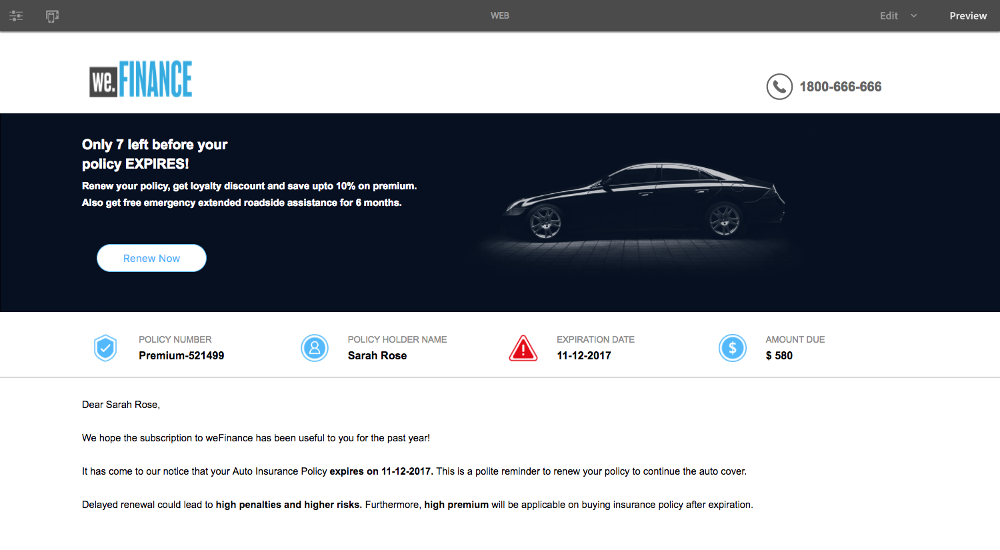

# DO NOT PUBLISH Create your first adaptive document {#do-not-publish-create-your-first-adaptive-document}

## Use Case {#use-case}

We Finance is a leading organization in Financial Services domain that offers comprehensive and personalized financial solutions to suit the requirements of diverse customer profiles.

One of their customers' auto insurance policy is expiring and they are sending her a reminder, which is interactive and includes a PDF, with the renewal quotation. The communication also includes other information, such as loyalty rewards and offers of discounts.

The portal runs on Adobe AEM. The web and print welcome channel output is created using the multi-channel capabilities of Adaptive Document.

You will have an adaptive document similar to the following at the end of the tutorial:
        Creating your first adaptive document tutorial is categorized into steps. Each step is a complete article in itself.

<table> 
 <tbody>
  <tr>
   <th>You will learn</th> 
   <th>
    <ul> 
     <li>Creating an adaptive document and form data model.</li> 
     <li>Creating templates and themes for adaptive documents.</li> 
     <li>Using rule editor to build business rules.  </li> 
     <li>Publishing an adaptive document.   </li> 
    </ul> </th> 
  </tr>
  <tr>
   <td>Prerequisite</td> 
   <td>
    <ul> 
     <li>Setup AEM author instance. </li> 
     <li>Install AEM Forms add-on. For detailed information see, <a href="/help/forms/using/installing-configuring-aem-forms-osgi.md" target="_blank">Install and configure AEM Forms</a>.</li> 
     <li>Obtain JDBC database driver (JAR file) from database provider. Examples in the tutorial are based on MySQL database and use Oracle's MySQL JDBC database driver. </li> 
     <li>Setup a database containing customer data. A database is essential to create an adaptive document. This tutorial uses a database to display form data model and persistence capabilities of AEM Forms. </li> 
     <li>Create/import and enable <a href="/help/forms/using/web-channel-print-channel.md">Templates for print and web channel</a>.</li> 
     <li>Ensure you have the <a href="/help/forms/using/document-fragments.md">Document fragments based on the FDM</a>.</li> 
    </ul> </td> 
  </tr>
 </tbody>
</table>

## Step 1: Create Form Data Model {#step-create-form-data-model}

A form data model allows to connect an adaptive document to disparate data sources. For example, AEM user profile, RESTful web services, SOAP-based web services, OData services, and relational databases. A Form data model is a unified data representation schema of business entities and services available in connected data sources. You can use the form data model with an adaptive document to retrieve data from connected data sources. For more information about form data model, see [AEM Forms Data Integration](/help/forms/using/data-integration.md).

Goals:

* Configure database instance (Microsoft Dynamics) as a data source  
* Create the form data model using Microsoft Dynamics as a data source
* Add data model objects to form data model
* Configure read and write services for the form data model  
* Test form data model and configured services with test data

## Step 2: Create an adaptive document {#step-create-an-adaptive-document}

Customer Communications centralizes and manages the creation, assembly, and delivery of secure, personalized, and interactive correspondences such as business correspondence, letters, documents, statements, benefit notices, wealth management prospectus, marketing mails, bills, and welcome kits.

Using adaptive documents, you can create customer communications that are engaging, responsive, dynamic, and adaptive in nature. AEM Forms provide a drag-and-drop WYSIWYG editor to create adaptive documents. 

<!--`For more information about adaptive documents, see [Introduction to authoring adaptive documents](/forms/using/introduction-ad-authoring.md).`-->

Goals:

* Create print and web output of an adaptive document based on form data model. 
* Layout fields of an adaptive form to display information to the customer
* Create rules to retrieve and display information from form data model to adaptive document.

<!---->

## Step 3: Apply rules to adaptive document fields (Web channel only) {#step-apply-rules-to-adaptive-document-fields-web-channel-only}

Adaptive document provides an editor to write rules on adaptive document objects. These rules define actions to trigger on document objects based on preset conditions and user actions on the document. It helps ensuring accuracy and speeds up user experience in the web version of the adaptive document. For more information about adaptive document rules and rules editor, see [rule editor](/help/forms/using/rule-editor.md).

Goals:

* Create and apply rules to adaptive document's web channel fields
* Use rules to trigger document data model services in the web channel

## Step 4: Style the adaptive document (Web channel only) {#step-style-the-adaptive-document-web-channel-only}

Adaptive documents provide an editor to create themes for the adaptive documents and in-line styling. A theme contains styling details for components and panels, and you can reuse a theme on web channels of different documents. Styles include properties such as background colors, state colors, transparency, alignment, and size. When you apply the theme to your document, the specified style reflects on corresponding components of your document. For more information, see [Themes](/help/forms/using/themes.md).

Goals:

* Create theme for the adaptive document web channel
* Apply theme to the adaptive document web channel
* Validate appearence of the adaptive document web channel on mobile devices and desktop

## Step 5: Publish the adaptive document {#step-publish-the-adaptive-document}

Once you are done creating your adaptive document, you need to publish it for it to be available on your publish instance where the agents could use the adaptive document to create the communication instances based on it.

To publish the adaptive document, the document authors need to have the required permissions. 
