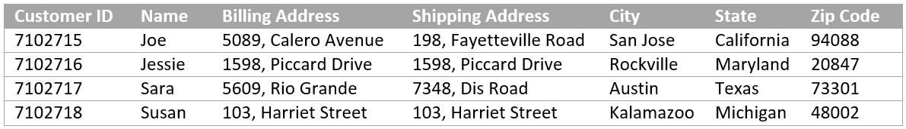

# Create your first adaptive form {#do-not-publish-create-your-first-adaptive-form}

 

## Introduction {#introduction}

Are you looking for a mobile-friendly **forms experience** that simplifies enrolment, increases engagement and reduces turnaround time, **adaptive forms** is a perfect fit for you. Adaptive forms provide a mobile, automation, and analytics-friendly forms experience. You can easily build forms that are resposnisive and intreactive in nature, use automated processes to reduce administrative and repetitive tasks, and use data analytics to improve and personalize the experience customers have with your forms.

This tutorial provides an end-to-end framework to create an adaptive form. The tutorial is organized into a use case and multiple guides. Each guide helps you learn and add new features to the adaptive form that is created in this tutorial. You have a working adaptive form after every guide. The guide to create an adaptive form is available. Subsequent guides will be available soon. At the end of this tutorial, you will be able to:

* Create an adaptive form and form data model.
* Style your adaptive form.
* Use adaptive form rule editor to build business rules.
* Test and publish an adaptive form.

The journey starts with learning the use case:

A website offers a range of products for diverse customers. Customers browse the portal, select, and order the products. Every customer creates an account and provides shipping and billing addresses. An existing customer, Sara Rose, is looking to add her shipping address to the website. The website provides an online form to add and update shipping addresses.

The website runs on Adobe Experience Manager (AEM) and uses AEM Forms for data capture and processing. The address addition and update form is an adaptive form. The website stores customer details in a database. They use the address addition and update form to retrieve and display available addresses. They also use the adaptive form to accept updated and new addresses.

### Prerequisite {#prerequisite}

* Setup an AEM author instance.  
* Install [AEM Forms add-on](/help/forms/using/installing-configuring-aem-forms-osgi.md) on author instance.
* Obtain JDBC database driver (JAR file) from database provider. Examples in the tutorial are based on MySQL database and use Oracle's [MySQL JDBC database driver](https://dev.mysql.com/downloads/connector/j/5.1.html).   

* Setup a database containing customer data with the fields displayed below. A database is not essential to create an adaptive form. This tutorial uses a database to display form data model and persistence capabilities of AEM Forms.

## Step 1: Create an adaptive form {#step-create-an-adaptive-form}

Adaptive forms are new generation, engaging, responsive, dynamic, and adaptive in nature. Using adaptive forms, you can deliver personalized and targeted experiences. AEM Forms provide a drag-and-drop WYSIWYG editor to create adaptive forms. For more information about adaptive forms, see [Introduction to authoring adaptive forms](/help/forms/using/introduction-forms-authoring.md).

Goals:

* Create an adaptive form that allows a customer to add a shipping address
* Layout fields of an adaptive form to display and accept information from a customer
* Create submit action to send an email containing form content
* Preview and submit an adaptive form

    

## Step 2: Create Form Data Model {#step-create-form-data-model}

A form data model allows to connect an adaptive form to disparate data sources. For example, AEM user profile, RESTful web services, SOAP-based web services, OData services, and relational databases. A Form data model is a unified data representation schema of business entities and services available in connected data sources. You can use the form data model with an adaptive form to retrieve, update, delete, and add data to connected data sources.

Goals:

* Configure the website's database instance (MySQL database) as a data sources  
* Create the form data model using MySQL database as a data source
* Add data model objects to form data model
* Configure read and write services for the form data model  
* Test form data model and configured services with test data

    

## Step 3: Apply rules to adaptive form fields {#step-apply-rules-to-adaptive-form-fields}

Adaptive forms provide an editor to write rules on adaptive form objects. These rules define actions to trigger on form objects based on preset conditions, user inputs, and user actions on the form. It helps ensure accuracy and speeds up form filling experience.

Goals:

* Create and apply rules to adaptive form fields
* Use rules to trigger form data model services to update data to database

## Step 4: Style your adaptive form {#step-style-your-adaptive-form}

Adaptive forms provide themes and an [editor](/help/forms/using/themes.md) to create themes for the adaptive forms. A theme contains styling details for components and panels, and you can reuse a theme in different forms. Styles include properties such as background colors, state colors, transparency, alignment, and size. When you apply the theme to your form, the specified style reflects on corresponding components of your form. Adaptive forms also support in-line styling for styles specific to a form.

Goals:

* Apply an out of the box theme to an adaptive form
* Create a theme for adaptive form using the theme editor
* Use web fonts in a custom theme

    

## Step 5: Test your adaptive form {#step-test-your-adaptive-form}

Adaptive forms are integral to your customer interactions. It is important to test your adaptive forms with every change you make in them. Testing every field of a form is tedious. AEM Forms provide an SDK (Calvin SDK) to automate testing of adaptive forms. Calvin allows you to automate testing of your adaptive forms in the web browser.

Goals:

* Install Calvin SDK
* Create test suite and test cases for change address form

To learn about SDK, see [Using Automated Tests with AEM Adaptive Form](/help/forms/using/calvin.md).

## Step 6: Publish your adaptive form {#step-publish-your-adaptive-form}

You can publish adaptive forms as a stand-alone form (single page application), include in AEM [sites page](/help/forms/using/embed-adaptive-form-aem-sites.md), or list on an AEM site using [Forms Portal](/help/forms/using/introduction-publishing-forms.md).

Goals:

* Publish the adaptive form as a single page application

