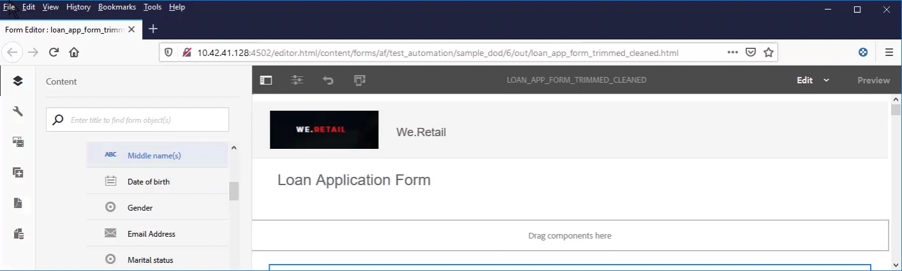
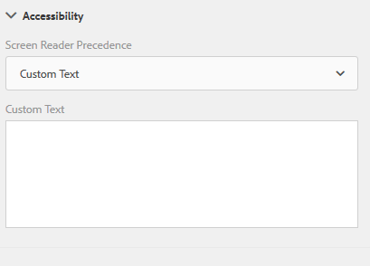
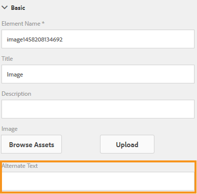

# Creating accessible adaptive forms{#creating-accessible-adaptive-forms}

 Adobe recommends using the modern and extensible data capture [Core Components](https://experienceleague.adobe.com/en/docs/experience-manager-core-components/using/adaptive-forms/introduction) for [creating new Adaptive Forms](/help/forms/using/create-an-adaptive-form-core-components.md) or [adding Adaptive Forms to AEM Sites pages](/help/forms/using/create-or-add-an-adaptive-form-to-aem-sites-page.md). These components represent a significant advancement in Adaptive Forms creation, ensuring impressive user experiences. This article describes an older approach to authoring Adaptive Forms using foundation components. 

## Introduction {#introduction}

An accessible form is a form that everyone can use, including users with special needs. Adaptive Forms include several features and capabilities that enhance the usability for users with different abilities. Building accessibility into adaptive forms not only allows the widest possible audience for content, but it is also a requirement when supplying documents in geographies where compliance with accessibility standards is mandated. AEM Forms help form developers comply with the accessibility standards.

While authoring an adaptive form, author should consider the following points to create accessible adaptive form:

* Check the form with Accessible Name and Description Inspector (ANDI) accessibility testing tool
* Provide proper labels for form controls
* Provide text equivalents for images
* Provide sufficient color contrast
* Ensure that form controls are keyboard accessible

## Prerequisite

You require an accessibility tool such as **Accessible Name and Description Inspector (ANDI)** and an **Adaptive Form theme developed to fix accessibility related issues** to create an accessible adaptive form.

### Download and install accessibility testing tool

Accessible Name and Description Inspector (ANDI) tool helps you identify and fix accessibility compliance-related issues in web content. It is the recommended tool under Trusted Tester v5 guidelines of Department of Homeland Security. It is developed by the Social Security Administration​ department of United States to check Section 508 compliance of web content. The tool:

* Helps detect accessibility issues​ on a webpage
* Provides suggestions to improve accessibility​
* Detects keyboard accessibility and color contrast issues
* Clearly identifies the screen reader content in compliance with the standards

ANDI works with all major Internet browsers. See [ANDI's documentation](https://www.ssa.gov/accessibility/andi/help/install.html) for detailed instructions on how to configure and use the tool.

### Download and install the Ultramarine-Accessible theme

The Ultramarine-Accessible theme is a reference theme. It helps demonstrate how to fix color contrast and other accessibility-related issues in an adaptive form. Adobe recommends that you create a custom theme for the production environment based on the styles approved by your organization. Perform the following steps to upload the theme to your AEM instance:

1. Download the theme package.
1. Navigate to **[!UICONTROL Experience Manager]** > **[!UICONTROL Navigation]**  > **[!UICONTROL Forms]** on your AEM instance.
1. Select **[!UICONTROL Create]** > **[!UICONTROL File Upload]**. Select and upload the x  Ultramarine-Accessible-Theme.zip file. It uploads the theme to your AEM instance.

## Make an adaptive form accessible

You should focus on four key aspects: keyboard navigation, color contrast, meaningful alternate text for images, and appropriate labels for forms controls to make an adaptive form accessible. Perform the following steps to make your existing adaptive forms accessible:

### 1. Apply an accessible theme and perform additional fixes

Apply the Ultramarine-Accessible theme to your existing adaptive form. To apply the theme:

1. Open the adaptive form for editing.
1. Select a component and select the parent icon. In the context menu, select **[!UICONTROL Adaptive Form Container]** and then select the Configure icon.
1. Select the Ultramarine-Accessible theme in the properties browser and select **[!UICONTROL Save]** icon.
1. Refresh the browser window. The theme is applied to the adaptive form.  

After applying an accessible theme, perform the below listed additional fixes. The fixes are in addition to accessibility fixes covered in the accessible theme:

1. Add a meaningful alternate text for the logo image in the adaptive form.

    Provide a meaningful alternate text for images in header and footer components of the adaptive form template. When you fix the template and use it to create an adaptive form, the adaptive forms inherit all the accessibility-related fixes applied to header and footer of the template.  For an existing adaptive form, make changes at the adaptive form level. Changes made to an adaptive form template do not automatically flow to an existing adaptive form.

1. Add a heading component containing form name to the adaptive form. If your form design specifies a company name, add a separate heading component for the company name also. 

    Most accessibility tools inform users about the hierarchy of the content to help them understand structure of the web page. Set different heading levels for organization name and form name text on the adaptive form to provide a hierarchical structure to these texts. In addition, use a Text component before each panel and section with an appropriate heading level to create a hierarchy.

    

1. Change footer background color to use appropriate contrast in accordance with the accessibility standards to improve visibility and readability of the text. You can use ANDI to find color contrast issues in your form. Also, do not use very small font. Small fonts are difficult to read.

1. Replace the switch and image choice components in your existing adaptive form with choice (radio) component.

1. Replace the numeric stepper component in your existing adaptive form with numeric box component.

1. Replace date input field with date picker field.  

1. Set display, validation, and edit patterns for the date picker component. Also, set a custom validation error message. For example, You have specified an invalid date. The correct format of the date is YYYY-MM-DD.

1. Set custom accessibility text for the date picker component. For example, Enter your date of birth. Screen readers read these custom accessibility texts.  

1. Use short description instead of long description for adaptive form components. A long description adds help  button. Ensure the adaptive does not have any Help button.  

1. Add custom accessibility text to all the read-only cells of tables. Also, disable all the read-only cells of tables.

1. Remove scribble signature fields, if any in the adaptive form. Configure the adaptive form to use Adobe Sign for a seamless digital signing experience.

### 2. Provide proper labels for form controls {#provide-proper-labels-for-form-controls}

The label or title of a component identifies what the form component represents. For example, the text "First name" tells users that they have to enter their first name in a text field. To be accessible by screen readers, the label is programmatically associated with a form component. Alternatively, the form control is configured with additional accessibility information.

The label that is perceived by screen readers does not need to be the same as the visual caption. In some cases, you may want to be more specific about the control's purpose. For each field object in a form, the accessibility options can be used to specify what the screen reader announces to identify the specific form field.

To use the Accessibility option, follow these steps:

1. Select a component and select .
1. Click **[!UICONTROL Accessibility]** in the sidebar to choose the desired accessibility option.

### Accessibility options in form components {#accessibility-options-in-form-components}

**Custom Text** Form authors provide the content in the accessibility option Custom text field. The assistive technology, such as screen readers, uses this custom text. Using the Title setting is the best option in a majority of the scenarios. Consider creating Custom Screen Reader Text only when using the Title or a short description is not possible.

**Short description** For a majority of the components, the short description appears at runtime when the user hovers the pointer over the component. You can set this option in the short description field, under help content option.

**Title** Use this option to let AEM Forms use the visual label associated with the form field as the screen reader text.

**Name** You can specify a value in the Name field of the Binding tab. The name cannot contain any spaces.

**None** Selecting None causes the form object to not have a name in the published form. None is not a recommended setting for form controls.

>[!NOTE]
>
>* Radio Button and Check-box can have only two options for accessibility, namely Custom Text and Title.
>* For XFA-based adaptive forms, the accessibility option is inherited from the accessibility options set in the XDP. Tool tips from XDP are mapped to the Short Description and Caption are mapped to Title. The other options work as is.

### 3. Provide text equivalents for images {#provide-text-equivalents-for-images}

Images can help improve comprehension for some users. However, for users using screen readers, images decrease the accessibility of your form. If you choose to use images, provide text descriptions for all images.

Ensure that the text describes the object and its purpose in the form. A screen reader reads this alternative text when it encounters an image. An image must always have an alternative text specified.

Select an image component and select . In the sidebar, under Properties, specify alternate text for an image.

### 4. Provide sufficient color contrast {#provide-sufficient-color-contrast}

Accessibility design involves considering additional guidelines for color usage. Form authors can use colors to improve the appearance of forms, by highlighting various form components. However, an improper use of color may make a form difficult or impossible to read by people with different abilities.

Users with vision impairment rely on a high contrast between text and the background to read digital content. Without sufficient contrast, a form can become difficult, if not impossible, to read for some users.

It is recommended that you use the default font and background colors--content in black color on a white background. If you change the default colors, choose either a dark foreground color on a light background color, or conversely.

See [Creating custom themes for adaptive forms](/help/forms/using/creating-custom-adaptive-form-themes.md), for more information about changing the color contrast and theme for the adaptive forms.

### 5. Ensure that form controls are keyboard accessible {#ensure-that-form-controls-are-keyboard-accessible}

An accessible form can be filled completely using only the keyboard or an equivalent input device. Users with reduced mobility or impaired vision may have no choice but to use the keyboard and many users who can use a mouse, prefer keyboard input. By allowing for the various input methods, you not only create accessible forms, you also create forms that are better suited to the preferences of all users.

The following keyboard shortcuts are available in AEM Forms.

| Action |Keyboard shortcut |
|---|---|
| Move the cursor forward through a form |Tab |
| Move the cursor backward through a form |Shift+Tab |
| Move to the next panel |Alt+Right Arrow |
| Move to the previous panel |Alt+Left Arrow |
| Reset the filled data in a form |Alt+R |
| Submit a form |Alt+S |

In addition, there are various keyboard shortcut keys available for the **[!UICONTROL Date Picker]** component in Adaptive Forms. To enable the shortcut keys, select the **[!UICONTROL Date Picker]** component and select  to open the properties. In the **[!UICONTROL Patterns]** section, select a display pattern using the **[!UICONTROL Type]** and **[!UICONTROL Pattern]** dropdown lists. Save the properties to enable the use of shortcut keys for the **[!UICONTROL Date Picker]** component.

The following keyboard shortcut keys are available for the Date Picker component in Adaptive Forms:

| Action |Keyboard shortcut |
|---|---|
| <ul><li>Display the Date Picker component options when the tab focus highlights the calendar icon</li><li>Perform the click event when the tab focus highlights an option</li> |Space or Enter |
| Hide the Date Picker component options |Esc|
| <ul><li>Move the cursor forward through the options available in the Date Picker component.</li><li>Set tab focus on calendar icon when date input field is active</li> |Tab |
| Move the cursor backward through the options available in the Date Picker component |Shift+Tab |
| <ul><li>Display the Date Picker component options when the tab focus highlights the date input field</li><li>Move the cursor downward in the calendar available in the Date Picker component</li> |Down Arrow |
| Move the cursor upward in the calendar available in the Date Picker component |Up Arrow |
| Move the cursor backward in the calendar available in the Date Picker component |Left Arrow |
| Move the cursor forward in the calendar available in the Date Picker component |Right Arrow |
| Perform the action for the caption available between right and left navigation arrows in the calendar |Shift + Up Arrow |
| Perform the action for right navigation arrow icon  available in the calendar |Shift + Left Arrow |
| Perform the action for left navigation arrow icon  available in the calendar|Shift + Right Arrow |

## Use the accessibility tool to find remaining accessibility issues

Accessible Name and Description Inspector (ANDI) helps you identify and fix accessibility compliance-related issues in an adaptive form. To use the ANDI tool to find the accessibility issues in an adaptive form:

1. Open the adaptive form in preview mode.
1. Click the bookmarked ANDI tool icon. The ANDI tool analyzes the adaptive form and displays accessibility issues. For details on how to use the tool, see [ANDI's documentation](https://www.ssa.gov/accessibility/andi/help/howtouse.html).
1. Review and fix the issues reported by ANDI.
